#####################
Computation Processor User Guide
#####################
This Document is part of the OpenDCS Software Suite for environmental
data acquisition and processing. The project home is:
https://github.com/opendcs/opendcs

See INTENT.md at the project home for information on licensing.

.. contents: Table of Contents
    :depth: 3

Overview
========

The Computation Processor is a suite of programs for executing
computations on data stored in a time-series database. It is currently
supported for the U.S. Bureau of Reclamation Hydrologic Database (HDB)
and the U.S. Army Corps of Engineers Corps Water Management System
(CWMS, pronounced ‘swims’).

The CP is designed to handle many types of computations:

-  USGS Rating Algorithm: Table lookup with shifts.

-  Consumptive Use = Subtract return flow from diversion.

-  Periodic averages, minimums, maximums, and other statistics

-  Total flow at several stream gages to calculate reservoir inflow.

-  Variation on total flow: gages could be far upstream, allow a
   time-offset on each gage. Note that this could result in future
   (forecasted) flows.

-  Reservoir surface elevation = gage height + base elevation.

-  Total reservoir release = bypass releases + turbine releases + spill.

-  Cumulative annual precip = previous value plus delta from recording
   device. Omit negative deltas (which would mean the device was reset).

-  Percent of normal precip = specified year’s cumulative annual precip
   / cumulative annual precip averaged for number of years.

-  Polynomial with constant or seasonally-changing coefficients.

-  Interpolate between two other computations. Example: transition from
   one rating to another

-  3D Table Lookup: Two input parameters, one output parameter.

A composite computation might also be defined that combines several of
the above primitive types. The CP is packaged with the following
components:

-  Generic Time Series Database Interface with extensions to support
   USBR (U.S. Bureau of Reclamation) HDB (Hydrologic Database), and
   USACE (U.S. Army Corps of Engineers) CWMS (Corps Water Management
   System).

-  DECODES Consumer to ingest incoming DCP (Data Collection Platform)
   data and store it directly into either HDB or CWMS.

-  The background Computation Processor that watches the database for
   incoming data and performs computations as needed.

-  An initial set of algorithms (periodic averages, adding & scaling,
   stage to flow conversions with USGS RDB files, deltas).

-  GUI (Graphical User Interface) editors for computational meta-data
   and Java algorithms.

-  XML (Extensible Markup Language) Import and Export utilities for
   archiving and transferring computational meta-data.

-  This manual.

The CP is designed for flexibility in several ways:

1. The GUI algorithm editor makes it is easy to add new types of
   algorithms without an expert-level understanding of Java.

2. The database interface is designed to work with any SQL DBMS.

3. The data structures and operational concepts are designed to
   accommodate HDB, NWIS, CWMS, and Sutron’s commercial Tempest
   Hydro-Met Analysis product.

The last item requires some elaboration:

Funding for the CP was provided by USBR, USGS (U.S. Geological Survey),
and USACE. We initially developed and tested the code against USBR’s
Hydrologic Database. Sutron has used it extensively within their
Tempest™ Hydro-Met Analysis product for derived parameters and
limit-checking. In 2008 and 2009 it was ported to work with USACE’s CWMS
database. Thus the CP is currently operational in 3 different database
systems, each with different schema.

Glossary and List of Acronyms
-----------------------------

CP Computation Processor – the background program that executes
computations as new data arrives.

CCP CWMS Computation Processor – i.e. the CP configured for CWMS.

CWMS Corps Water Management System (pronounced ‘swims’) - A system for
hydrologic data storage and analysis used by USACE.

DBMS Database Management System

DCP Data Collection Platform – equipment in the field that collects and
transmits raw environmental measurements.

DECODES DEviceCOnversion and DElivery System – A collection of software
for decoding raw environmental data, and converting it to a time-series
in a variety of formats.

ERD Entity Relationship Diagram

GUI Graphical User Interface

HDB Hydrologic Database – A system for hydrologic data storage an
analysis used by USBR.

NWIS National Water Information System - A system for hydrologic data
storage an analysis used by USGS.

SDI Site Data-type ID. In HDB this is used to denote a particular
parameter at a particular site. It is stored as a numeric ID.

SQL (a.k.a. “sequel”) Structured Query Language

TSDB Time Series Database

USACE U. S. Army Corps of Engineers

USBR U. S. Bureau of Reclamation

USGS U. S. Geological Survey

XML Extensible Markup Language

Document History
----------------

Changes made for Revision 2 (April, 2015)

-  DATCHK Configuration Files are described in section 12.3.2.

Changes made for Revision 11 (July 2016)

-  Added chapter on HDB-specific features.

-  Added section on the Stat (Statistics) Algorithm.

-  Added description of the Resample Algorithm “method” property.

Changes made for Revision 12 (September 2016)

-  Sections added to Chapter 15 on the HDB-specific algorithms.

-  Improved section 9.2 on the compimport utility by describing the
   command line arguments, including the new –o (no overwrite) argument
   for OpenDCS 6.2 RC13.

Changes for revision 13 (November 2016)

-  Consolidated HDB-specific stuff into a single chapter. Previously
   there were two separate chapters.

-  Removed information on the obsolete “local tasklist” feature. This is
   no longer necessary or supported.

-  The previous section 3 on HDB-specific installation has been removed.
   All installation instructions are in the separate OpenDCS
   Installation Guide.

-  Likewise, the previous section 4 on configuration has been removed.
   The OpenDCS Installation Guide covers this information.

-  Added discussion of Process Types to the section of compedit that
   deals with the Process Edit Tab (section 3.5).

-  Expanded section 4.2 describing time series identifiers in CWMS,
   including information from the new CMWS Naming Standards document.

-  Expanded sections 4.5 through 4.8 describing how computation
   parameters use substitution for group members, and how CWMS wildcard
   characters work for time series ID components.

Changes for revision 14 (December 2016)

-  CwmsRatingMultiIndep now supports “locationOverride” property.

Changes for revision 15 (Jan 2017)

-  The CwmsRatingMultiIndep algorithm, locationOverride property may now
   contain wildcard chars (12.5).

Changes made for revision 16 (June 2017)

-  negativeReplacement property in Average Algorithm

Changes made for revision 16 (July 2017)

-  Added documentation for all built-in USBR algorithms.

Changes made for revision 17 (November, 2017)

-  Added PeriodToDate Algorithm

Changes made for revision 18 (February, 2018)

-  Added description of reclaimTasklistSec application property.

Changes made for revision 20 (November 2018)

-  Timed Computations feature was added for OpenDCS 6.5 RC03. These are
   described in section 2.7.

Changes made for revision 21 (January 2019)

-  Section 6.4: Improved explanation on time series meta-data that is
   available for both HDB and CWMS.

-  New GroupAdder algorithm. See section 5.27.

Changes made for revision 22 (April 2019)

-  Added explanation of standard properties maxMissingValuesForFill and
   maxMissingTimeForFill

-  Enhanced FillForward algorithm for new feature of filling to present
   time or next input value.

Changes for revision 23 (July 2019)

-  Section 2.7 added describing Timed Computations

Changes for revision 24 (September 2019)

-  Fill Forward Algorithm clarified.

Changes for revision 25 (September 2020)

-  Computations are now supported for OpenTSDB/PostgreSQL.

Changes made for revision 26 (March 2021)

-  Improvements to section 10.11 to go along with bug fixes in the
   compexec utility.

Changes for revision 27 (October 2021)

-  Section 14.1 on HDB Model Run ID. The inputModelRunId property is
   implemented.

Theory of Operation
===================

Figure 1 shows the workflow for the CP. The “Computation Processor
Application” is a Java program that runs continually in the background.

-  It is triggered when new time-series data arrives in your database.

-  The program finds all computations that you have defined that depend
   on the new data. Computations are defined in special tables within
   the database.

-  The program attempts to execute these computations, which may involve
   retrieving other data from the database. For example, if the
   computation is to add A and B, when a new value for ‘A’ arrives, we
   may need to fetch a previously stored ‘B’ value.

-  Results are written back to the time series database. This may (as is
   the case for HDB) trigger an external database QC process.

-  When results are written, this may recursively fire *other*
   computations, and so on.

.. image:: ./media/image1.emf

Figure 1: Workflow for the Computation Processor.

Time Series Database Assumptions
--------------------------------

The CP assumes that you are storing hydro-meteorological data in a SQL
database. We have striven to isolate the code that accesses the database
into a few classes with abstract Java interfaces. The goal is to make it
as easy as possible to adapt CP for many organizations.

The CP makes several assumptions about how data is stored in the
time-series database:

-  Sites represent locations and each site has a unique string ID.

-  Data type codes are used

-  USGS uses numeric EPA codes.

-  HDB uses its own numeric codes.

-  CWMS uses standard 2-part string codes like “Stage-Pool”.

-  Many other agencies uses SHEF physical element codes.

-  A particular parameter at a particular site can be denoted by a
   single numeric ID called a SDI (for Site Datatype ID).

-  For HDB this is called the SDI.

-  For NWIS this is called a Data Descriptor ID.

-  For CMWS this is called TS_CODE.

-  The database may store parameters of different intervals in different
   tables.

-  HDB has INSTANT, HOUR, DAY and other tables.

-  USGS NWIS has Unit value tables, Daily value tables and others.

-  CWMS many interval codes including: 1Minute, **N**\ Minutes (where N
   can be 2, 3, 4, 5, 6, 10, 12, 15, 20, or 30), 1Hour, **N**\ Hours
   (where N can be 2, 3, 4, 6, 8, or 12), 1Day, Week, 1Month, 1Year,
   1Decade.

-  An additional string element called a “table selector” can be used to
   build part of the table name that stores a particular parameter.

-  For HDB this is a prefix denoting real (R\_) or modeled (M\_) data.

-  For USGS this is a function of the database number (DBNO).

-  For CWMS this provides the remaining parts of the 6-part DSS path
   name.

CP and DECODES Mapping to HDB
-----------------------------

The CP and DECODES were designed to cross-platform. Generic concepts are
mapped to HDB in the following ways:

Sites represent locations and each site has a unique string ID. Entities
in the HDB_SITE table are mapped to Site objects in CP and DECODES. The
numeric site ID appears as the “hdb” site name type. In Figure 2, note
the different name types. Also note the “hdb” column containing the
numeric IDs.

.. image:: ./media/image2.png
   :alt: Macintosh HD:Users:mmaloney:Desktop:Screen Shot 2012-08-31 at 9.29.22 AM.png
   :width: 6.49444in
   :height: 4.66319in

Figure 2: Site List Tab in DECODES Database Editor (dbedit).

You can add/remove site name types for your system with the “rledit”
(Reference List Editor) command.

Figure 3 shows the reference list editor. There are many “Enumerations”
that you can modify in this GUI. After making changes select File – Save
to DB to make your changes permanent.

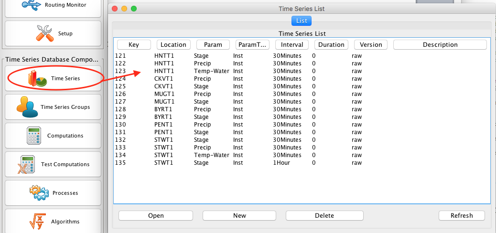

Figure 3: Reference List Editor being used to modify the Site Name Type
Enumeration.

DECODES and CP support Data Type codes from multiple standards. HDB uses
its own numeric codes. USGS uses numeric EPA codes. CWMS uses standard
2-part string codes like “Stage-Pool”. Many other agencies use SHEF
physical element codes.

In DECODES Sensors, you can control this directly by entering multiple
data types for each sensor.

.. image:: ./media/image4.png
   :alt: Macintosh HD:Users:mmaloney:Desktop:Screen Shot 2012-08-31 at 9.43.12 AM.png
   :width: 3.875in
   :height: 2.89548in

Figure 4: DECODES Edit Sensor Dialog, showing multiple data type codes.

DECODES can also attempt to automatically translate between data coding
systems. The “Data Type Equivalence” tab of the rledit program is shown
in Figure 5. If you share DECODES configurations with other agencies in
your area (for example Colorado Division of Natural Resources uses a
data type coding system called “transform”), you may add their coding
system and establish equivalences to HDB data types.

.. image:: ./media/image5.png
   :alt: Macintosh HD:Users:mmaloney:Desktop:Screen Shot 2012-08-31 at 9.56.00 AM.png
   :width: 6.25in
   :height: 3.14037in

Figure 5: Reference List Editor - Data Type Equivalence Tab.

To establish a new coding system:

-  On the “Enumerations” tab, select the “Data Type Standard”
   enumeration and click the add button.

-  Click File – Save to DB.

-  Exit the rledit program and restart.

-  On the “Data Type Equiv” tab, use the buttons at the right to add,
   edit, or delete equivalences to HDB data types.

For your computations, you will always want to enter the numeric HDB
data type.

In HDB, the SDI (Site Data-Type ID) is used to combine the numeric site
and data type IDs into a single integer. This detail is usually
invisible to the user but occasionally shows up in error and log
messages.

A string element called a “table selector” is used to denote real (R\_)
verses modeled (M\_) data.

Computation Meta-Data
---------------------

.. image:: ./media/image6.png
   :width: 6in
   :height: 2.21042in

Figure 6: Logical Depiction of Computations Meta Data.

The above diagram illustrates the types of information used to execute
computations.

In the lower right, we see “Jar File”. JAR stands for Java Archive. Java
software is distributed as one or more jar files. You will need these
jar files:

-  *decodes.jar* (included in OPENDCS release. This is found in the
   “bin” directory under the installation. This file contains all of the
   code for DECODES, the CP infrastructures, and the built-in
   algorithms.

-  *ojdbc14.jar* (provided by Oracle). This contains code that allows CP
   to talk to an Oracle database. It is not included in the release. You
   must place it in the “dep” directory under the installation.

-  *Algorithm-JARs:* If you create your own algorithms, you should place
   them in the “dep” directory under the installation.

-  You may also define the environment variable CP_SHARED_JAR_DIR
   pointing to a directory containing JAR files that you want to be
   shared. These jars will be included in class path ahead of the ones
   in the dep directory.

At the top we see “Computation Process Meta Data”. The database defines
“loading applications” for any application that can load time-series
data into the database. You can see all of the loading application in
the “compedit” (Computation Editor) program, on the “Processes” tab. We
define the following loading applications:

-  *DECODES* – for DECODES routing specifications that load raw
   time-series data from incoming DCP messages.

-  *compproc* – The background computation process daemon.

-  *compedit* – the computation editor

-  *runcomp* – the GUI for interactively running computations

-  *compdepends* – the background process that maintains

-  *compproc_regtest* – This is not required for all installations. It
   is used for running the regression tests only.

An *Algorithm* is an abstract set of instructions for performing a
particular type of computation. Examples would be “periodic average” or
“USGS Rating Table Lookup”. Each algorithm has a CP_ALGORITHM record
containing the name of the Java class that will execute the computation.
You can see all of the algorithms defined in compedit, Algorithms tab.

-  Algorithms have one or more *time-series parameters*
   (CP_ALGO_TS_PARM). These denote the inputs and outputs of the
   algorithm. Each parameter has a ‘role name’ denoting how it is used
   within the algorithm.

-  Algorithms also may have one or more *named properties*. These are
   used to control various aspects of the algorithm. For example, a
   rating table algorithm might have a property denoting the directory
   in which to find rating table files.

A *Computation* applies an algorithm to specific parameters in the time
series database. It is assigned to be executed by a particular loading
application.

-  The CP_COMPUTATION record associates a computation with an algorithm
   and a loading application.

-  Computations may only be valid for a certain time period, denoted by
   the effective start and end times in the record.

-  There will be a CP_COMP_TS_PARM record corresponding to the algorithm
   parameter records (CP_ALGO_TS_PARM). This is where a specific SDI,
   interval, and table-selector are assigned to the algorithm’s roles.

-  A ‘Delta-T’ value may optionally be assigned. This allows us to
   correlate data values at different times. For example, suppose we are
   adding two inflows from different streams, and that the gage for one
   stream was 3-hours upstream.

-  A computation may also assign values to the algorithm’s properties.
   This is done with a CP_COMP_PROPERTY record.

A *Time-Series Group* is a flexible way of defining a group of
time-series that share some attribute. For example you could have a
group of all “Stage-Tail” values with Version “raw”. Groups are
important for reducing the number of computations you have to maintain.
For example, if you have the same set of 5 computations that you execute
on all Stage values. You can just define a group of these time-series
and use it as input for the 5 computations. You don’t need to redefine
the computation for each site.

Computations Meta-Data ERD
~~~~~~~~~~~~~~~~~~~~~~~~~~

The following figure shows computation meta-data as it is defined in the
HDB database.

Figure 7: Computation Meta-Data Entity Relationship Diagram (ERD).

Tools Provided with the CP
--------------------------

Figure 8 shows how the tools interact with each other and the time
series database. For completeness we also show some of the DECODES tools
which process raw data as it arrives from the field.

.. image:: ./media/image8.emf

Figure 8: Workflow through the Provided Tools.

1. DECODES meta-data is stored in a SQL DECODES Database. It is modified
   by various DECODES GUI programs.

2. Raw Site Data is retrieved in various ways (LRGS-DDS interface,
   data-logger file, modem, etc.). The DECODES routing spec uses
   instructions in the DECODES meta-data to convert raw data into
   time-tagged engineering units

3. A “Data Collection” is an internal Java data structure that holds one
   or more time series. Data in a time series is read from/written to a
   Time Series Database like HDB or NWIS.

   a. The Computation Process reads data from the time series database,
      and then writes the computational results to the time series
      database.

4. Computation Meta-Data is stored in the SQL Computation Database. A
   GUI is provided to display and modify it. Import/Export utilities
   convert meta-data to/from XML files. The CP relies on this meta-data
   for instructions on how to manipulate the time series.

5. Some computations may require additional, external input files. An
   example would be a USGS rating that runs from RDB files stored in a
   directory on disk.

6. Computation meta-data will be exported to/imported from XML files.

7. Computations which are not assigned to a background processor may be
   performed interactively by the user through a graphical user
   interface (GUI).

How the Computation Processor Works
-----------------------------------

Refer again to Figure 1 above. It presents a high-level workflow for the
CP. This section will describe CP execution in more detail.

Algorithms and Computations
~~~~~~~~~~~~~~~~~~~~~~~~~~~

Recall that:

-  An *Algorithm* is abstract. It specifies a Java class to do the
   actual calculations. It specifies abstract role-names for each
   parameter (e.g. “input”, “output”, “stage”, “flow”, “precip”).

-  A *Computation* is concrete. It specifies database parameters at
   specific sites to play the roles in a given algorithm. Many
   computations can use the same algorithm.

How to Determine which Computations to Execute
~~~~~~~~~~~~~~~~~~~~~~~~~~~~~~~~~~~~~~~~~~~~~~

The Computation Processor (CP) is triggered when new data arrives in the
database that is an input for any computation. The CP is also triggered
when existing data (that is a computation input) is deleted. The
database must provide a mechanism to capture these events, and place the
relevant information into a queue. The CP_COMP_TASKLIST is really a
queue in the database:

-  CP reads records from this table to determine what data has newly
   arrived (or what existing data has been deleted).

-  CP deletes records from this table after processing.

HDB uses Oracle Triggers on inserts and updates to the data tables to
capture new, modified, and deleted data. CWMS accomplishes the same
thing through a well-defined API and Oracle Advaned Queues

Both databases use computation meta-data to determine if any
computations need to run.

-  The CP_COMP_DEPENDS table is a simple two-column table relating a
   time-series identifier and a computation identifier.

-  Each computation is assigned to a loading application.

-  The trigger (or queue handler in CWMS) places an entry in the
   CP_COMP_TASKLIST table with the new data values and the loading
   application ID.

Now, the background CP “compproc” reads the task list table, determines
which computations can run, and then executes them.

-  If the data in the task list record serves as an input to a
   computation, the CP will attempt to execute that computation.

-  The task list records are then deleted from the database.

Retrieving Additional Data Needed in a Computation
~~~~~~~~~~~~~~~~~~~~~~~~~~~~~~~~~~~~~~~~~~~~~~~~~~

Consider a simple algorithm that adds X + Y and produces an output ‘Z’,
where X, Y, and Z signify time-series parameters. When a new X arrives
without a new Y, the algorithm must attempt to read the time-correlated
Y which may be already stored in the database.

Also consider an algorithm that produces a daily average of hourly
values for X. The algorithm makes the constraint that it must have at
least 13 hourly values to produce an average. When a new X arrives, it
must retrieve the other values for the same day.

So, the CP has the capability to fill-out time-series data that it needs
in performing a computation.

Time Slice and Aggregating Algorithms
~~~~~~~~~~~~~~~~~~~~~~~~~~~~~~~~~~~~~

The CCP distinguishes between three general types of algorithms:

-  *Time Slice* – These algorithms step through all available input
   values in time order. In general, a time slice algorithm produces one
   output for each set of inputs. An example would be a simple adder,
   e.g. “output = A + B”. For each time-correlated pair of A and B, we
   produce one output.

-  *Aggregating* – These algorithms iterate over a defined time-period.
   After iterating, they produce an aggregate for the period. An example
   would be an averaging algorithm, e.g. “daily = ∑(hourly A)”. When new
   ‘A’ values are placed in the database, we iterate over each day for
   which we have ‘A’ samples. We produce an output for each day.

-  *Running* *Aggregate* – These perform some time-based aggregate but
   at a user-defined interval. For example, every hour you could compute
   an average of the last 24 hours of input values. This is a running
   average.

The distinction is made explicitly in the Algorithm Editor (section 4).
Note however, that an algorithm may have multiple outputs. An expert
algorithm-writer could create an algorithm that does both Time Slicing
and Aggregating.

For aggregate periods, we must know a couple additional pieces of
information:

1. Time zone: If we are computing a daily average, we might want the day
   to go from 00:00 (midnight) to 23:59 in Eastern Standard Time. The
   configuration property ‘aggregateTimeZone’ defines a default for the
   time-zone setting. If you have individual computations that you need
   to use a different time-zone, you may define a property called
   ‘aggregateTimeZone’ in the computation record to override the
   default.

2. Do you want to include the value at the beginning of the time-period?
   If so, set the property ‘aggLowerBoundClosed’ to true.

3. Do you want to include the value at the end of the time-period? If
   so, set the property ‘aggUpperBoundClosed’ to true

4. Time Offset: As off version 5.2 you can specify a property with name
   “aggregateTimeOffset”. This can be in either the algorithm or
   computation records. The value is a string like “1 hour”, “2 days 15
   minutes”, etc.

For all three of the above properties, you can set a default system-wide
value in the decodes.properties file. You could then set an
algorithm-wide property in the algorithm record. Finally you could set a
computation-specific value in the computation record.

Handling Deleted Data
~~~~~~~~~~~~~~~~~~~~~

What does a computation do when its input values are deleted from the
database? There are three possibilities:

1. Delete the computation outputs.

2. Re-execute the computation, perhaps executing a different logic path.

3. Do nothing.

The first approach is reasonable for time-slice algorithms like the
simple adder described above. Unless we have both A and B, we can’t
produce an output. So if either A or B is deleted, we should delete the
corresponding output.

The second possibility is reasonable for aggregating algorithms. Perhaps
an averaging algorithm requires 13 hourly points to produce a daily
value. When one input is deleted we may still have the requisite 13, but
the average may be different. So we re-execute the computation.

The 3\ :sup:`rd` possibility is made available to algorithms with
special needs.

Handling Missing Data
~~~~~~~~~~~~~~~~~~~~~

Environmental data collection is a messy business. Data can go missing
for a variety of reasons. The CP has provisions for handling missing
data automatically.

Consider a time-slice algorithm that adds the flow from three channels
A, B, and C. Suppose we collect hourly flow samples for all three
parameters but parameter B has a missing sample at 08:00 AM. We might
want to compute the sum and use an interpolated value for the missing B.

By default, the CP will only attempt to compute a time slice if all of
its inputs are present. You can control this behavior by adding
properties to the computation meta-data. Table 2‑1 lists the
possibilities.

+------------------+---------------------------------------------------+
| **               | **Meaning**                                       |
| rolename_MISSING |                                                   |
| Property Value** |                                                   |
+------------------+---------------------------------------------------+
| fail             | (This is the default.) Do not execute the         |
|                  | algorithm at this time slice.                     |
+------------------+---------------------------------------------------+
| ignore           | Leave data missing in the slice. The algorithm    |
|                  | must handle it directly.                          |
+------------------+---------------------------------------------------+
| prev             | Take the last value before this time slice.       |
+------------------+---------------------------------------------------+
| next             | Take the next value after this time slice.        |
+------------------+---------------------------------------------------+
| interp           | Interpolate between last and next values.         |
+------------------+---------------------------------------------------+
| closest          | Choose last or next value closest in time.        |
+------------------+---------------------------------------------------+

Table 2‑1: Property values to control missing data.

This feature is limited by two settable properties:

-  *maxMissingValuesForFill* – The maximum number of allowable
   contiguous missing values. The CP will not attempt to fill gaps with
   more than this number of missing values. Obviously, this will only
   work if the CP can determine the expected interval of the parameter.
   That is, it will not work for INSTANT or IRREGULAR parameters.

-  *maxMissingTimeForFill*– This is the maximum allowable time (in
   seconds) between contiguous values. This will work for any type of
   parameter.

These properties can be defined in 3 places:

1. The “decodes.properties” file

2. Settings made in an Algorithm Record will override the default and
   apply to any computation using this algorithm.

3. Settings made in a Computation Record will override other settings
   and apply to this computation only.

Handling Questionable Data
~~~~~~~~~~~~~~~~~~~~~~~~~~

Every value in the time series database has a flag word that holds
(among other things) the results of validity checking. Each database
defines ‘questionable’ in a different way. For CWMS, the
VALIDITY_QUESTIONABLE bit must be set in the data’s flag word.

For time slice algorithms such as validation, copy, scaler-adder, and
rating, you can determine how the CP handles questionable data by
setting a special property named “ifQuestionable”. The property can take
any of the three settings:

-  **ProcessAsNormal** – (For backward compatibility this is the default
   setting). This means to ignore the validation results on input values
   and process the data as if it were normal.

-  **QuestionOutput** – This means to set the output’s flags to
   ‘questionable’ if any of the inputs are questionable.

-  **SkipTimeslice** – This means to skip a time slice if any of the
   inputs are considered questionable.

To use this feature, add a property to either the computation or
algorithm record using the GUI computation editor. Adding it to the
algorithm will affect all computations using this algorithm. Adding it
to the computation will only affect this particular computation.

The property name should be “ifQuestionable” and the value should be one
of the settings described above.

Automatic Deltas
~~~~~~~~~~~~~~~~

Many algorithms will want to act on changes to parameter values rather
than the actual value itself. Now you *could* have one computation
compute the delta and write it to the database, and then have another
computation trigger off the delta value.

However, the use of deltas is so pervasive that we added an automatic
feature so that these intermediate parameters would not be necessary.
Table 2‑2 lists the type-codes for inputs to computations.

+-----------+----------------------------------------------------------+
| **Type    | **Meaning**                                              |
| Code**    |                                                          |
+-----------+----------------------------------------------------------+
| i         | Use the input value itself, not the delta.               |
+-----------+----------------------------------------------------------+
| id        | Input delta – infer the period from INTERVAL setting of  |
|           | the time-series assigned to this role. Illegal for       |
|           | irregular (USBR INSTANT) parameters.                     |
+-----------+----------------------------------------------------------+
| idh       | Input delta for this time to one hour ago.               |
+-----------+----------------------------------------------------------+
| idd       | Input delta for this time to one day ago.                |
+-----------+----------------------------------------------------------+
| idm       | Input delta for this time one month ago.                 |
+-----------+----------------------------------------------------------+
| idy       | Input delta for this time one year ago.                  |
+-----------+----------------------------------------------------------+
| idlh      | Input delta since the end of the last hour.              |
+-----------+----------------------------------------------------------+
| idld      | Input delta since the end of the last day.               |
+-----------+----------------------------------------------------------+
| idlm      | Input delta since the end of the last month.             |
+-----------+----------------------------------------------------------+
| idly      | Input delta since the end of the last year.              |
+-----------+----------------------------------------------------------+
| idlwy     | Input delta since September 30 of the last year.         |
+-----------+----------------------------------------------------------+
| id\ *NNN* | … where\ *NN* is a number of minutes: Input delta        |
|           | between this time and specified number of minutes ago.   |
+-----------+----------------------------------------------------------+
| o         | The parameter is an output.                              |
+-----------+----------------------------------------------------------+

Table 2‑2: Input & Output Parameter Types Showing Different Types of
Automatic Deltas.

The code will use the parameter-type to determine the time of the
previous value. It will search for a value with the matching time. If
one is found, the delta will be computed and made available to the
algorithm.

You can specify a property in the algorithm or computation called
TIMEROUND. This defaults to 60 seconds. When searching for the previous
value for the delta, the code will use any value with a time-stamp
within this number of seconds.

Handling Failed Computations
~~~~~~~~~~~~~~~~~~~~~~~~~~~~

Computations can fail if required resources are unavailable. A common
example is a group-based rating computation that uses any “Stage” value
of a given increment (e.g. hourly) as input. There may be Stage values
in your database for which you do not currently have a rating table.

Recall that computations are triggered by “tasklist” records when an
input to a computation is written to the database. You can determine
what happens to a tasklist record a when a computation fails:

-  Discard the tasklist record. That is, never retry failed
   computations.

-  Retry every hour a limited number of times.

-  Retry every hour indefinitely.

In some databases (CWMS) the processing required to support
failed-computation-retries has been seen to be prohibitively expensive.
We recommend for CWMS that you disable failed computation retries by
setting the variable in your “decodes.properties” file:

retryFailedComputations=false

If you *do* want to attempt to retry computations, set this to true and
then set an additional variable:

maxComputationRetries=3

Set this to the maximum number of times you want a computation
attempted. The special value of zero means to retry indefinitely.

Executable Programs Included with CP
------------------------------------

+-------------+---------------------------------------+----------------+
| **Command** | **Description**                       | **Manual       |
|             |                                       | Section**      |
+-------------+---------------------------------------+----------------+
| algoedit    | Start the GUI algorithm editor        | 4              |
+-------------+---------------------------------------+----------------+
| algolist    | List all algorithms defined in the    | 10.2           |
|             | database.                             |                |
+-------------+---------------------------------------+----------------+
| compedit    | Start the GUI Computation Editor      | 2.7            |
+-------------+---------------------------------------+----------------+
| runcomp     | Run computations interactively in a   | 4              |
|             | GUI.                                  |                |
+-------------+---------------------------------------+----------------+
| compexport  | Export computation meta-data to XML   | 7.3            |
+-------------+---------------------------------------+----------------+
| compimport  | Import computation meta-data to XML   | 7.2            |
+-------------+---------------------------------------+----------------+
| complist    | List all computations defined in      | 10.1           |
|             | meta-data                             |                |
+-------------+---------------------------------------+----------------+
| c           | List all current                      | 0              |
| omplocklist | computation-processor locks. This     |                |
|             | will show you which CPs are currently |                |
|             | running.                              |                |
+-------------+---------------------------------------+----------------+
| compnewdata | Retreive and clear the new data       | 10.6           |
|             | task-list entries for a given CP.     |                |
|             | Useful for testing, and for clearing  |                |
|             | a CP’s task-list queue in special     |                |
|             | circumstances.                        |                |
+-------------+---------------------------------------+----------------+
| compproc    | Starts the CP. Arguments specify      | 8              |
|             | which loading application to assign.  |                |
+-------------+---------------------------------------+----------------+
| groupedit   | GUI for editing time series groups    |                |
+-------------+---------------------------------------+----------------+
| setHdbUser  | Writes the file “.hdb.auth” in your   | **Error!       |
|             | home directory with your HDB username | Reference      |
|             | and password                          | source not     |
|             |                                       | found.**       |
+-------------+---------------------------------------+----------------+
| importts    | Import Time Series data from an ASCII | 10.8           |
|             | file into HDB                         |                |
+-------------+---------------------------------------+----------------+
| lau         | Start the combined GUI with the       | **Error!       |
| ncher_start | launcher-buttons on the left side of  | Reference      |
|             | the screen.                           | source not     |
|             |                                       | found.**       |
+-------------+---------------------------------------+----------------+
| outputts    | Output time series data using any of  | 10.5           |
|             | the DECODES output formatters         |                |
+-------------+---------------------------------------+----------------+
| rledit      | Reference List Editor. Typically used | DECODES        |
|             | to configure pull-down list choices   | Reference      |
|             | for the GUI.                          | Manual         |
+-------------+---------------------------------------+----------------+
| dbedit      | DECODES Database Editor               | DECODES        |
|             |                                       | Reference      |
|             |                                       | Manual         |
+-------------+---------------------------------------+----------------+
| dbexport,   | DECODES Database Export and Import    | DECODES        |
| pxport,     | Programs                              | Reference      |
| dbimport    |                                       | Manual         |
+-------------+---------------------------------------+----------------+
| e           | (CWMS Only) programs for editing,     | 12.1           |
| ditRatings, | viewing, exporting and importing      |                |
| l           | Rating Tables within the database     |                |
| istRatings, |                                       |                |
| im          |                                       |                |
| portRating, |                                       |                |
| e           |                                       |                |
| xportRating |                                       |                |
+-------------+---------------------------------------+----------------+

Table 3‑3: Executable Scripts in the Computation Processor Extensions.

Timed Computations
------------------

This feature was added OpenDCS 6.5 RC03. It does not exist in earlier
versions.

There are various reasons why you might want computations to be run on a
timer rather than the normal input-triggering mechanism:

-  Computations with many inputs which can only succeed when all data is
   present. Running on a timer after all input data is expected to be
   present is more efficient than trying the computation after each
   input is written.

-  Aggregates could be run once after the end of the period, saving the
   need to attempt the aggregate as each time slice of data arrives.

Algorithms and Computations now support the following properties:

-  timedCompInterval: Set this property to a number and an interval, for
   example “3 hours”. Setting this property flags the computation as a
   timed computation.

-  timedCompOffset: Set this optional property to have the computation
   executed on an offset after the even interval. For example, set to “5
   minutes”. Then your “3 hour” interval computation will be executed at
   5 minutes after every 3\ :sup:`rd` hour.

As with most computation properties, they can be set in an algorithm
record (in which case they apply to any computation using that
algorithm) or in a computation record (overriding any setting in the
algorithm).

The CompDepends Daemon will not create any dependency records for timed
computations. Indeed if any previously existed, they will be removed. No
dependency records are needed because time computations are executed
directly by the computation process to which they are assigned.

When a timed computation is executed, the computation process will
gather any inputs that have come in during the specified interval. It
will then execute the computation as if those inputs had created
“tasklist” records.

The Computation Process checks its complete list of computations
periodically to see if any changes have been made to the schedule. By
default it does this every 600 seconds (time minutes). you can control
this by setting a property ‘checkTimedCompsSec’ in the Computation
Process’s process record.

Normally a timed computation gathers inputs SINCE the last time it ran
UNTIL the current run time. You can optionally control the data window
over which timed computations execute with the following two properties:

-  timedCompDataSince: Set to a number and an interval, for example “150
   minutes” causes the window to start two and one half hours prior to
   the run time.

-  timedCompDataUntil: Set to a number and an interval, for example “10
   minutes” causes the window to end ten minutes prior to the run time.

The Computation Editor
======================

Section 0 explains the computation meta-data stored in the database.
This section will explain how to view and modify this meta-data.

Start the GUI computation editor with the command:

compedit

The command accepts the following arguments

-d1 Set to debug level 1.

-d2 Set to debug level 2.

-d3 Set to debug level 3 (the most verbose).

-l logfile Default log name is “compedit.log” in the current directory.

The program starts by reading summaries of all the records in the
database. These are displayed in three list tabs on the main screen:

-  Computations

-  Algorithms

-  Processes (a.k.a. Loading Application)

The screen layout is shown below in Figure 9. Note the top-level tabs
labeled “Algorithms”, “Computations”, and “Processes”. Click on the tab
to edit each kind of object.

The List Tabs
-------------

The computation editor presents a list tab for each of the three types
of object. For algorithms and processes, these are simple lists as shown
in the following two figures. You can sort the list by clicking on a
column header.

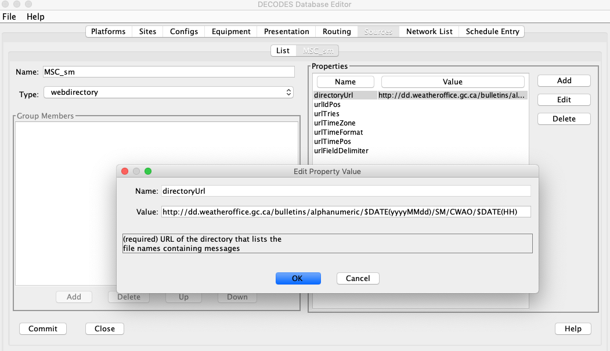

Figure 9: Computation Editor - Algorithms List Tab.

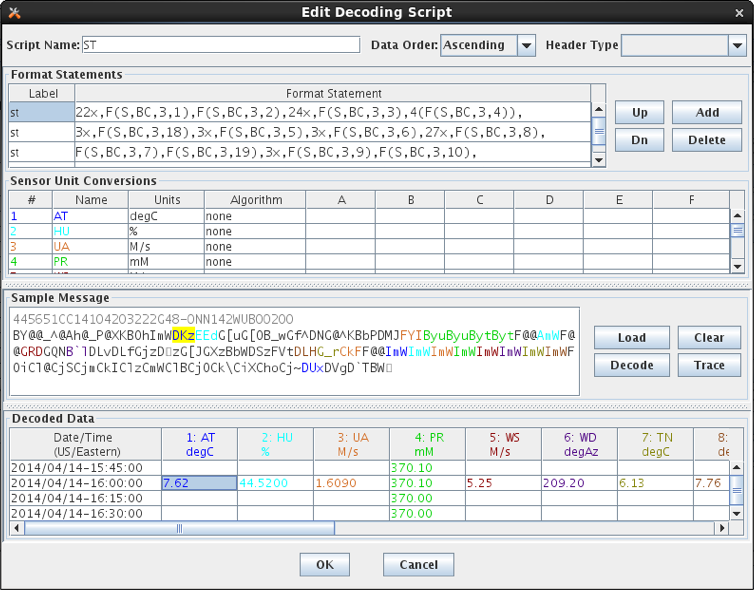

Figure 10: Computation Editor - Processes List Tab.

For the list of computations, you see a filter-area at the top of the
screen (Figure 11). Since a database is likely to have hundreds or even
thousands of computations, this allows you to quickly find the ones you
are interested in. To use the filter, select any combination of
filter-values and hit the ‘Refresh List’ button. The fields are …

-  ‘Has Param at Site’ Select a site. Only computations with at least
      one parameter at that site are shown.

-  ‘Has Param Code’ Type or select a parameter code. Only computations
      with a parameter with that code are shown.

-  ‘Has Param Interval’ Select an interval. Only computations with a
      parameter with that interval are shown.

-  ‘Process’ Select a computation process (a.k.a. loading application).
      Only computations assigned to that process are shown.

-  ‘Algorithm’ Select an algorithm. Only computations using that
      algorithm are shown.

Figure 11: Computation Editor - Computation List Tab.

Action Buttons
~~~~~~~~~~~~~~

Buttons along the bottom provide access to the detailed object
information:

-  Select an item in the list and press ‘Open’ to open an edit tab with
   the detailed information.

-  Click ‘New’ to create a new object of the specified type.

-  Select an item in the list and press ‘Copy’ to make a copy of an
   object with a different name and database ID.

-  Select an item in the list and press ‘Delete’ to delete the item from
   the database.

Deleting Records that are ‘In Use’
~~~~~~~~~~~~~~~~~~~~~~~~~~~~~~~~~~

In HDB, you will not be able to delete records that are ‘in-use’. This
includes:

-  Algorithms that are being used by one or more computations.

-  Processes that have one or more computations assigned.

-  Computations that have data in HDB.

Crisp First Line in Comment Areas
~~~~~~~~~~~~~~~~~~~~~~~~~~~~~~~~~

Note that the list tab shows only the first line of a possibly very long
comment field. So please make the first line a good overall summary.
Subsequent lines can provide more detail.

Sorting the Lists
~~~~~~~~~~~~~~~~~

Click on the column headers to sort the list by that column. This is
useful for finding related records. For example, on the computation list
tab, to find all computations using a particular algorithm, click on the
Algorithm column header.

Algorithm Edit Tab
------------------

After pressing ‘Open’, ‘New’, or ‘Copy’ on the Algorithms List tab, you
will see an open editor tab, as shown in Figure 12.

The main purpose of an algorithm record is to associate a name in
database with a Java Class that will execute the algorithm. Creating the
Java code for algorithms is covered in section 4.

It is important to keep in mind that the data in the Algorithm record
must correspond to attributes in the Java code. For this reason,
modifying algorithms is usually left to developers. See the separate
manual CP-DevelopersGuide.

So why allow editing of algorithm meta-data here at all? One good reason
is that there need not be a one-to-one relationship between Java classes
and algorithm records. You could have several algorithm records that use
the same Java class with different property settings, and even parameter
definitions.

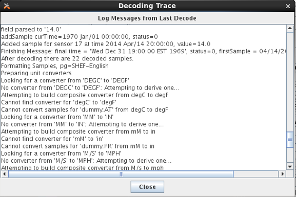

Figure 12: Computation Editor - Algorithm Editor Tab.

The fields in the algorithm edit tab include:

   **Algorithm Name:** Every Algorithm has a unique descriptive name.
   Press the ‘Change’ button to the right of the field to change the
   name of an existing algorithm.

   **Algorithm ID:** This field shows the unique database ID for this
   record.

   **Exec Class:** This is the fully qualified Java Class name for this
   algorithm.

   **Num Comps:** This is the number of computations that are currently
   making use of this algorithm.

   **Comment:** Please type a complete description of your algorithm.
   Type a crisp opening line that will appear on the list tabs.

In the **Parameters** section you define the input and output
time-series values to be used inside the algorithm. You define them by
supplying a ‘role name’ and a type code.

To add a new parameter, press the ‘Add’ button to the right of the list.
To edit an existing one, select it and then press ‘Edit’. In either case
you see a dialog as shown in Figure 13.

Please refer back to Table 2‑2 for a list of parameter types. The
Parameter dialog allows you to specify one of these types for this role.

**Trick: The input parameter type need not agree with the type-code you
defined when writing the algorithm Java code. For example, you could
specify “idh” for hourly delta, when using the CopyAlgorithm. This would
be an easy way to save a delta value to the database.**

In the **Properties** area you specify non-time-series values. These are
typically used to control features of the Java code. For example, the
Java RdbRating code honors Boolean properties to allow it to do table
looks that exceed the bounds of the table, and whether or not to apply
the shifts found in the table. It has a String property specifying the
directory where RDB files are to be found.

|image1|\ |image2|

Figure 13: Algorithm Parameter and Property Dialogs.

Select Algorithm Executable Class
~~~~~~~~~~~~~~~~~~~~~~~~~~~~~~~~~

As of OpenDCS 6.1 RC15 there is a ‘Select’ button to the right of the
Exec Class name. Prior to this you had to type the class name. Click the
button and you are presented with a list of all known classes, as shown
in the figure below:

.. image:: ./media/image15.png
   :alt: Macintosh HD:Users:mmaloney:Desktop:Screen Shot 2015-11-18 at 9.33.22 AM.png
   :width: 6.49514in
   :height: 4.54444in

You can customize the list of class names that appear in this list by
modifying one of two files:

-  $DCSTOOL_HOME/doc/algorithms.txt (provided with the RC15 release)

-  $DCSTOOL_USERDIR/algorithms.txt (for a multi-user installation)

The file has a single class per line. The first blank-delimited string
on a line is the class name, the remainder of the line is a brief
description.

If you have created your own classes, please annotate them in
$DCSTOOL_USERDIR/algorithms.txt. This way, if you update in the future,
your additions will not be lost. (*The file in the doc subdirectory
under the toolkit will be overwritten by an update!)*

6-Hour Holdout Algorithm Example
--------------------------------

Another example will illustrate the value in defining special algorithm
records that modify the defaults defined in the Java code. See Figure
14.

The USGS Equation Algorithm takes one input, one output and four
coefficients. It executes the equation:

output = A \* (B + input)^^C + D

Note the “type code” assigned to input. It is “id360” meaning that
instead of operating on the input value directly, it will take the
6-hour delta (360 minutes).

Next we define A to be 2.0167. Why? Look at the EU (engineering units)
definitions: The input is in ac-ft (Acre Feet). So we are looking at the
change in storage in Acre Feet over 6 hours. But we want to output a
FLOW in cfs (cubic feet per second), So …

ac-ft/6Hours = cfs \* 2.0167

Thus we co-opted an existing algorithm to do a special purpose without
writing any Java code!

Figure 14: Algorithm record that customizes the UsgsEquation algorithm
for a 6-hour holdout.

Computation Edit Tab
--------------------

After pressing ‘Open’, ‘New’, or ‘Copy’ on the Computation List tab, you
will see an open editor tab as shown in Figure 15 (for HDB) and Figure
16 (for CWMS).

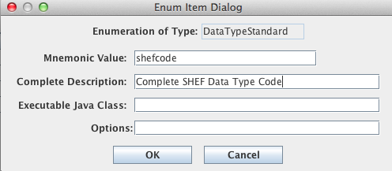

Figure 15: Computation Edit Tab for HDB.

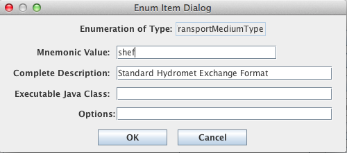

Figure 16: Computation Edit Tab for CWMS.

The fields in the computation edit tab include:

   **Comp Name:** A unique symbolic name for this computation in the
   database. Press the ‘Change’ button to change a computation’s name.

   **Comp ID:** The unique numeric ID assigned by the database when this
   computation is first saved. This is not editable.

   **Algorithm:** Associates this computation with an algorithm in the
   database. Press the ‘Select’ button to select a different algorithm.

   **Last Modified:** The date/time that this record was last modified
   in the database.

   **Effective Start:** Input data before the specified time will not be
   processed by this computation. This value overrides any global
   “CpEffectiveStart” setting made in the decodes.properties file (see
   **Error! Reference source not found.**). You can specify the limit in
   three ways:

-  No Limit (default setting) – no limit on lower end of date/time range

-  Now minus some interval – (e.g. “now – 1 day”) This is evaluated when
   the computation is run. It allows you to specify that the computation
   is to process near real-time data only.

-  Specified date/time – You specify a hard date/time value that is
   used.

..

   **Effective End:** Input data after the specified time will not be
   processed by this computation. You can specify the limit in four
   ways:

-  No Limit (default setting) – no limit on upper end of date/time range

-  Now – meaning do not process future data

-  Now plus some interval – (e.g. now + 1 day) This allows the
   computation to process a limited amount of future data. For example
   if you are processing predicted stage value through the next 24 hours
   but never beyond that, you could enter “now + 25 hours”.

-  Specified date/time – You specify a hard date/time value that is
   used.

..

   **Enabled:** Only computations that are enabled will be executed.

   **Process:** In order to be executed, you must assign the algorithm
   to a running process.

   **Comment:** Please type a complete description of your algorithm.
   The first line will appear in the description column in lists, so
   please make it a good overall summary. Subsequent lines can provide
   more detail.

The Edit/Delete buttons for computation parameters work much like they
do in the Algorithm Tab. The computation parameter dialog is shown in
Figure 17.

If you have deleted a parameter that is defined in the algorithm and
want to add it back in later, just re-select the algorithm. It will
bring in all undefined parameters again.

The Role Name area shows the selected algorithm role. In the rest of the
fields you specify the location (site) data type, and other parameters
necessary to point to a particular time series in your database.

Data Type can be typed directly, or you can press the ‘Lookup’ button a
list of existing time series at the selected site. For inputs, you must
select an existing data-type. For outputs, you can type a data-type that
does not yet exist at that site and the system will create one.

|image3|\ |Macintosh HD:Users:mmaloney:Desktop:Screen Shot 2012-11-12 at 4.10.31 PM.png|

Figure 17: Computation Editor - Computation Parameter Dialog (HDB on
left, CWMS on right).

Note also at the bottom of Figure 15, the button labeled ‘Run
Computations’. Pressing this button will bring up the Interactive
Run-Computations GUI described in chapter 9. The Run-Computations GUI
will be linked to the Computation Edit screen such that changes made
will be reflected in the run-computations without saving them first to
the database.

Engineering Units
~~~~~~~~~~~~~~~~~

Note the “Units” field at the bottom of Figure 17. For some algorithms,
it is important that you specify the correct units for the input and
output. For example, if you are using an TAB Rating table that takes
meters and outputs cubic meters per second, then you MUST specify these
units in the parameter record. Otherwise the computation will be done
using the default storage units for the underlying database, which in
HDB are imperial units.

-  When you specify units for an *input* param, the CP will convert the
   data into the correct units before performing the computation.

-  When you specify units for an *output* param, the CP knows to do a
   conversion back to the correct storage-units for the parameter.

Options for handling Missing Data
~~~~~~~~~~~~~~~~~~~~~~~~~~~~~~~~~

For each input parameter, you can tell the computation processor what to
do if a value is missing at a needed time. The possibilities are:

-  FAIL – Don’t execute the algorithm at this time-slice.

-  IGNORE – Execute the algorithm anyway. This is for algorithms with
   *optional* parameters like ScalerAdder that know how to proceed if an
   input parameter is not present.

-  PREV – Execute the algorithm using the value just previous to this
   time slice.

-  NEXT – Execute the algorithm using the value after this time slice.

-  INTERP – Interpolate between the previous and next value.

-  CLOSEST – Use either the PREV or NEXT value, whichever is closer in
   time.

In most cases, the default setting is made by the developer in the
algorithm record and you should not change it.

Computation Properties
~~~~~~~~~~~~~~~~~~~~~~

Note the properties settings at the bottom of Figure 15. Many algorithms
take property settings to control various functions. See the individual
section on each algorithm below for details.

Properties can be set in three places:

Computation Record **overrides** Algorithm Record **overrides** System
defaults

Thus the computation record shown above is the final word on the
property settings.

Running Computations Interactively
~~~~~~~~~~~~~~~~~~~~~~~~~~~~~~~~~~

Before leaving the computation editor when you have created or modified
a computation, it is recommended to press the ‘Run Computation’ button
in the lower right corner. You will see a pop-up dialog as shown in
Figure 18. Select the time-range over which to run the computation and
press the Run button. The results are shown both graphically and in a
table.

You can use this screen to execute computations over a historical
time-period and then save the results to the database.

After you are satisfied that the computation is running properly, click
the “Enabled” checkbox and assign it to the background computation
processor “compproc”.

.. image:: ./media/image21.png
   :width: 6.5in
   :height: 7.15in

Figure 18: Run Computations Screen.

Process Edit Tab
----------------

After pressing ‘Open’, ‘New’, or ‘Copy’ on the Processes List tab, you
will see an open editor tab as shown in Figure 19.

In HDB, a computation process is the same thing as a “LOADING APP”. It
has a unique process name and ID (assigned by the database). It also has
a free-form comment area.

.. image:: ./media/image22.png
   :alt: Macintosh HD:Users:mmaloney:Desktop:Screen Shot 2016-11-03 at 10.50.34 AM.png
   :width: 6.49514in
   :height: 3.06944in

Figure 19: Computation Editor - Process Edit Tab.

New to OpenDCS 6.2 is the concept of a Process Type. Each process should
be given a valid process type. You can create/edit the list of know
process types with the OpenDCS Reference List Editor. Start it with the
“rledit” command. Then, on the Enumerations Tab, select the “Application
Type” Enumeration. You should see a list of known process types, as
shown below.

Also on the process screen, notice two standard properties that are
available to all daemon processes:

-  monitor (true/false) – set to true to allow this process to be
   monitored in the new Process Status GUI.

-  EventPort – For monitored processes, assign a unique event number to
   each. This enables the new Process Status GUI to connect and retrieve
   events from the process as they occur.

For OpenDCS 6.4 RC08 a new Computation Daemon property was added:

-  reclaimTasklistSec– set to a number of seconds (default = 0). This is
   only used on Oracle Databases. If set to a positive number of
   seconds, then, when the tasklist is empty and this number of seconds
   has elapsed since the last attempt, the code will attempt to reclaim
   space allocated to the CP_COMP_TASKLIST table by issuing the
   following queries. The purpose is to shrink the allocated space back
   to something reasonable in case it has grown large.

..

   ALTER TABLE cp_comp_tasklist ENABLE ROW MOVEMENT

   ALTER TABLE cp_comp_tasklist SHRINK SPACE CASCADE

   ALTER TABLE cp_comp_tasklist DISABLE ROW MOVEMENT

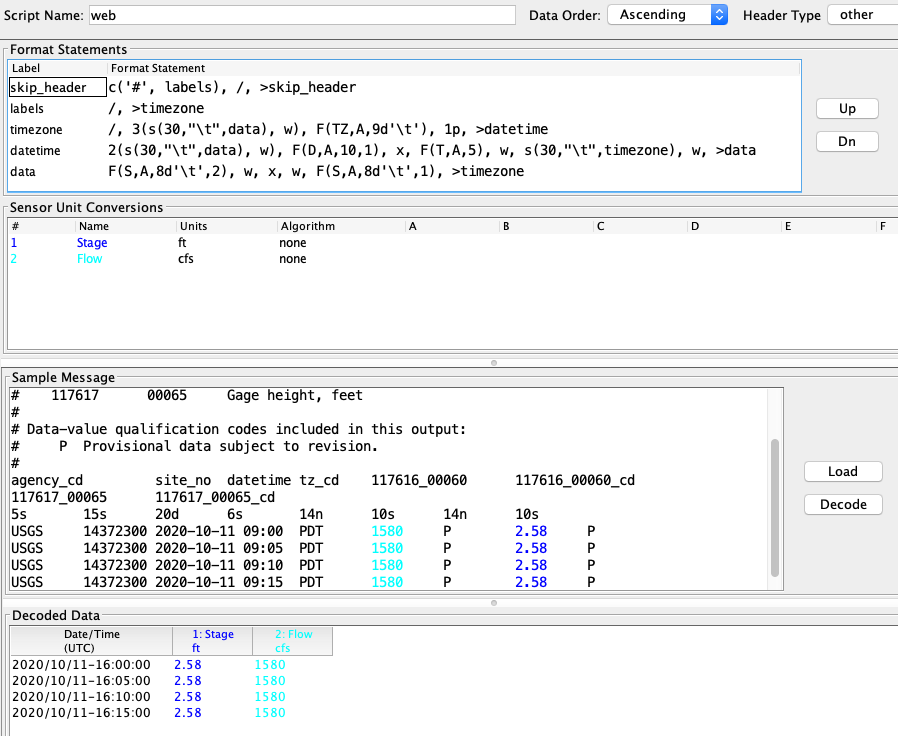

Figure 20: Application Type Enumeration

Time Series Groups and Computations
===================================

The above sections describe how to create and test computations that are
assigned to *specific time-series* in the database. Do a quick estimate:
How many water level parameters to you monitor? For each one, how many
computations would you want to perform? For most organizations, this
quickly becomes a very large number (hundreds or even thousands of
computations).

This section will describe a way to define *Time Series Groups*, and
then run your computations from the groups, rather than specific
time-series. This will greatly reduce the number of computations you
have to maintain.

Time Series Identifiers in HDB
------------------------------

An HDB Time Series is uniquely identified by:

-  Site

-  Data-Type (Site and Data-Type are sometimes combined into SDI)

-  Interval: (instant, hour, day, month, year, or water year)

-  Table-Selector: R\_ (real) or M\_ (modeled)

-  Model-ID (modeled data only)

-  Model-run-ID (modeled data only)

Some applications, such as the “outputts” (output time series) program
described below, specify time series with a 4, 5, or 6 “path name”:

   RUEWEACO.7.instant.R\_ Instantaneous real precip at site ‘RUEWEACO’

   RUEWEACO.8.hour.M\_.1.1 Hourly modeled precip at the same site, model
   id and model run ID are both 1.

Time Series Identifiers in CWMS
-------------------------------

CWMS uses a 6-part key:

Location.Param.ParamType.Interval.Duration.Version

For a complete discussion of CWMS Time Series Identifiers, see: *U.S.
Army Corps of Engineers (USACE) CWMS Standard Naming Conventions*. WMIST
(Water Management Implementation Support Team) Standard Naming
Committee, March 2016.

As described in that document, Location, Param, and Version are often
subdivided into multiple parts with a hyphen. The part up to the first
hyphen is called the base part. After the first hyphen is called the sub
part.

Examples:

-  Location “Jefferson-Lower”.

   -  Base Location is “Jefferson”. Sub Location is “Lower”.

-  Location “Jefferson-Spillway-Tailwater”.

   -  Base Location is “Jefferson”. Sub Location is
      “Spillway-Tailwater”.

-  Location “L&D #24-Lock Chamber East”

   -  Base Location is “L&D #24”. Sub Location is “Lock Chamber East”.

-  Param “Temp-DewPoint-Air”

   -  Base Param is “Temp”. Sub Param is “DewPoint-Air”.

-  Param “Speed-Gust-Air”

   -  Base Param is “Speed”, Sub Param is “Gust-Air”.

-  Version “Rev-GOES”

   -  Base Version is “Rev”. Sub Version is “GOES”.

Note that in the case of Location and Param, the distinction between
base and sub part is formalized within the database (i.e. base and sub
are stored in different table columns). In the Version string, this is
not the case. The database stores it as a single 32-character string.
For the purposes of CCP, however, it is treated the same as Location and
Param.

What is a Time Series Group?
----------------------------

We have implemented a very flexible way of determine which time-series
below to which groups. You can define a group in any of the following
ways:

1.  Select a set of specific time-series denoted by the full path name.

2.  Specify one or more Locations: All time-series at the specified
    location(s) are members of the group.

3.  Specify one or more Param designators. For example, a group called
    “Water-Levels” comprised of all time-series that have a param of 65
    or 66.

4.  Specify one or more Intervals. For example, all time series with
    interval of ‘instant’ or ‘Hour’.

5.  Specify real or modeled data.

6.  Specify one or more Model IDs.

7.  A group may *include* all members of another group. For example you
    might have a “basin” group that includes several “river” groups.

8.  A group may *exclude* all members of another group.

9.  A group may be *intersected* with members of another group.

10. Any combination of the above.

Time Series Group Editor
------------------------

Start the group editor in one of two ways:

-  With the “groupedit” command line.

-  Select “Groups” from the main Launcher bar.

Figure 21 shows the time series group editor. Like the other editors in
computation processor and DECODES a list screen shows all the objects
(groups) currently defined in the database. At the bottom you can open a
group, create a new group, delete a group, or refresh the list.

.. image:: ./media/image24.png
   :width: 6.5in
   :height: 3.53958in

Figure 21: Time Series Group Editor List Screen

In the following descriptions, the HDB and CWMS versions of the GUI look
slightly different because of the different components of a Time Series
Identifier. The concepts are identical however.

Figure 22 shows a group that has been opened for editing. Following the
figure, we will describe all the editing functions.

.. image:: ./media/image25.png
   :alt: Macintosh HD:Users:mmaloney:Desktop:Screen Shot 2012-09-03 at 11.29.21 AM.png
   :width: 6.49444in
   :height: 5.16875in

Figure 22: Time Series Group Editor - Open Group Screen.

The editor looks the same for HDB and CWMS except for the time series
identifier components:

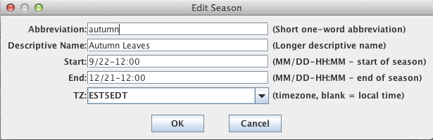

Figure 23: Time Series Group Editor for CWMS.

The button controls on this screen include:

**Rename** Press this button to rename the group. Every group in your
database must have a unique name.

We recommend that you refrain from putting spaces in your group names.
This is because names may be used on command-line utilities
occasionally. Spaces in the name can cause command-parsing problems. So
call your group “Raw-Stage” rather than “Raw Stage”.

**New Type** Each group is assigned a group type. You may define any
number of group types. For example you might have a group type ‘River’
and then several groups that use this type for the rivers you maintain.

**The Time Series Group Members Table** is used to explicitly add time
series to the group by specifying the complete path name.

**Add** Click this button to bring up a dialog of all time-series
defined in your database. You may select one or more time-series from
the list for inclusion in your group.

**Delete** Select a time-series in the list and click ‘Delete’ to remove
a time-series from the group.

**The Sub-Group Member Table**\ is used to combine other groups into
*this* group that you are defining. There are three ways to combine:

**Add SubGroup** Add the members of another group into this group.

**Subtract SubGroup** Subtract the members of another group from this
group. This is useful for special cases. E.g. you want all Revised Stage
values *EXCEPT* the ones at a few specified sites.

**Intersect SubGroup** Intersect the members of a subgroup with this
group. That is, only members contained in *both* groups will be
included.

**The Other-Criteria List** is used to specify path-name parts for
inclusion. You can filter by Site, Data-Type, Interval, Real/Modeled, or
Model ID.

**Evaluate the Group**

Finally, notice the “Evaluate” button at the bottom right. Click this
button to show you an expanded list of all existing time-series that
would be considered members of this group as currently defined.

Filtering by Location, Param, and Version in CWMS
~~~~~~~~~~~~~~~~~~~~~~~~~~~~~~~~~~~~~~~~~~~~~~~~~

The Location, Param, and Version buttons in the lower right of the
editor bring up special dialogs in CWMS in which you can specify full,
base, or sub part.

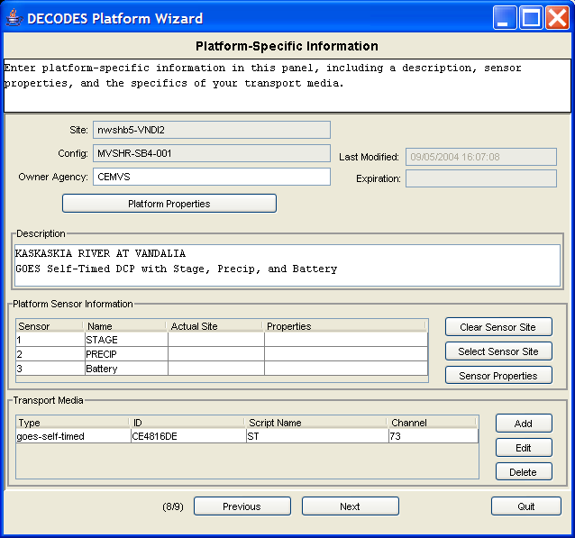

Figure 24: CWMS Special buttons for Location, Param, and Version.

The dialog for Location is shown below. The dialogs for Param and
Version work the same way. The dialog shows you a list of all locations
currently defined in the database. By clicking on the column headers,
you can sort by base-part, sub-part, or the number of time series IDs
that are currently defined at that location.

Figure 25: CWMS Group Editor Location Dialog.

At the bottom of the dialog are three radio buttons, which specify the
type of filter you are adding:

-  Full Location – Accept time series that match the selected full
   location (base and sub).

-  Base Location – Accept time series that match the base location (any
   sub location is OK).

-  Sub Location – Accept time series that match the sub location (any
   base location is OK).

If Sub Location is selected (or sub param or sub version in those
dialogs), you may also include an asterisk ‘*’ as a wildcard. Do this by
directly editing the Result field at the bottom of the dialog.

For example, if you edited the sub location field to be
“Spillway*-Gate*”, it would match, for example, the following locations:

-  ABC-Spillway1-Gate1

-  XYZ-Spillway2-Gate5

Thus the asterisk will match any character *except* the hyphen.

Evaluating Time Series ID Components
~~~~~~~~~~~~~~~~~~~~~~~~~~~~~~~~~~~~

You can specify any number of time series ID components using the
buttons at the bottom of the editor. When you hit the Evaluate button,
it will show you a list of time series which match the components you
have specified.

You can specify multiple values for the same component, for example:

-  Param: Stage

-  Param: Flow

-  Param: Stage-Bubbler

These are combined with a logical OR. Thus any time series that matches
any of the 3 values will pass the filter.

If you specify values for different components, they are combined with a
logical AND. Thus if you added to the above:

-  Interval: 1Hour

-  Duration: 0

Then of the time series with param Stage, Flow, or Stage-Bubbler, only
those with interval 1Hour and duration 0 would pass the filter.

Using a Group in a Computation
------------------------------

To use a group in a computation, open the computation in the editor and
select it from the list of groups. Then for each time series parameter,
you specify a *mask* to be applied to each group member.

.. image:: ./media/image29.png
   :alt: Macintosh HD:Users:mmaloney:Desktop:Screen Shot 2016-11-03 at 1.57.38 PM.png
   :width: 6.48542in
   :height: 3.94028in

Figure 26: Using a Group in a Computation.

Note that the Computation Parameter dialog allows you to specify each
time series identifier component individually. The values you specify
will be substituted in the time series identifiers in the group.

Here’s how it works:

-  The group is *evaluated* as described in the previous section. This
   results in a set of Time Series Identifiers (TSIDs) that are
   considered members of the group.

-  When a computation uses that group, the set of TSIDs is applied to
   each input parameter as follows:

   -  Replace the components in the TSID with the components specified
      in the Computation Parameter dialog.

   -  This results in a different TSID. If this new TSID exists in the
      database, the computation can be executed. If not, it is skipped.

-  Next the output parameters are resolved from the first input
   parameter in the same manner:

   -  Replace the components in the input parameter TSID with the
      components specified in the dialog for the output. If the
      resulting TSID does not exist, it is created in the database.

Notice that specifying the computation parameter TSID components is not
quite a filter. After applying the parameter mask, you could end up with
a TSID which is not a group member. For example:

-  A group called “Inst Stages” that contain any TSID with the param
   “Stage” and a duration of 0 (that is, an instantaneous value).

   -  Suppose one of the TSIDs is
      “Hoover-Tailwater.Stage.Inst.15Minutes.0.raw”

-  A computation called “Hourly Average Stage” which uses the group. The
   input parameter mask is wide open (i.e. it accepts all group members
   as-is.) The output parameter changes the interval and duration to
   1Hour and the Param Type to Ave.

   -  Input: Hoover-Tailwater.Stage.Inst.15Minutes.0.raw

   -  Output: Hoover-Tailwater.Stage.Ave.1Hour.1Hour.raw

-  A computation called “Hourly Flow” which uses the same group. The
   input parameter mask specifies interval=1Hour and duration=1Hour.
   Thus, this computation will use the TSIDs that are output from the
   first computation. Note that these TSIDs are *not* members of the
   group. The output changes the param to “Flow”.

   -  Input: Hoover-Tailwater.Stage.Ave.1Hour.1Hour.raw

   -  Output: Hoover-Tailwater.Flow.Ave.1Hour.1Hour.raw

-  A computation called “Monthly Peak Flow”. It’s input parameter mask
   specifies param=Flow, interval=1Hour, and duration=1Hour. The output
   changes param=Flow-Peak, Interval=1Month

   -  Input: Hoover-Tailwater.Flow.Ave.1Hour.1Hour.raw

   -  Output: Hoover-Tailwater.Flow.Ave.1Month.1Hour.raw

Thus the entire chain operates from a single group. Except for the first
computation in the chain, the input parameters are masked such that the
computation is operating on TSIDs that are not members of the group.

As another example, suppose you have a group called “Reservoirs” which
contains the Locations of all of your reservoirs. Then when the group is
evaluated, it will contain all time series at those reservoirs, which
may contain water levels, precipitation, temperatures, battery voltages,
computed parameters, what-have-you. By specifying our input in the way
described above, we filter the group so that our computation is only
triggered by a subset of the group.

A Group Computation Example (HDB)
---------------------------------

Figure 27 shows a computation that uses a group called “regtest_006”.
Note the central area of the screen, which defines the Time-Series
Parameters:

-  Some of the path components are defined such as datatype, interval,
   and real/modeled.

-  Some of the components are left variable.

When you define path components, these are substituted into the group
members.

-  For Inputs, this determines which time series will trigger the
   computation.

-  For Outputs, this will determine the time series identifiers written
   to HDB.

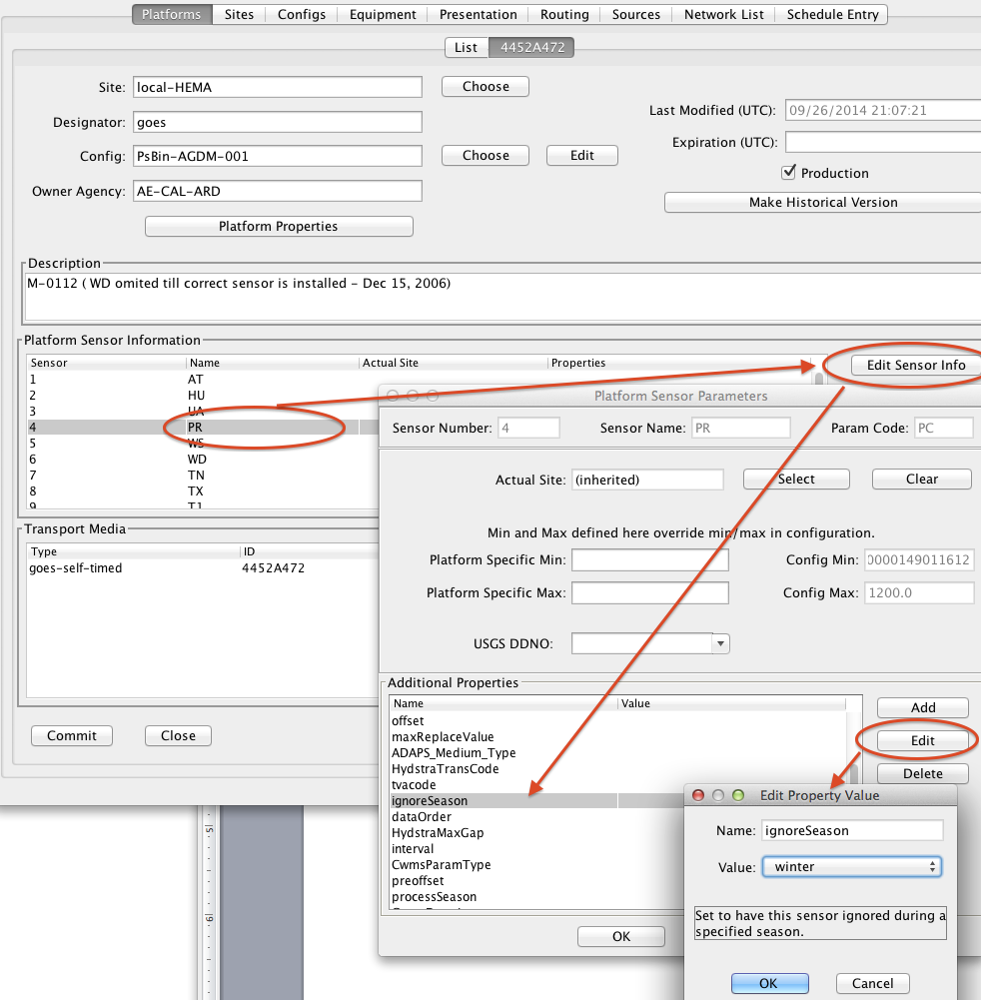

Figure 27: A Copy Computation with a Group Input

Computation Chains with Groups
------------------------------

As you can see, computations with groups are very flexible. Figure 28
provides an example for the Corps of Engineers CWMS database (but the
concept is the same for HDB). Suppose you have a group called
“Reservoirs” which contains a bunch of locations, including one called
“BMD”. Now you use that group as the input for the three computations
shown. Then you define the parameters as shown and see how the chain
works!

.. image:: ./media/image31.emf

Figure 28: Chain of Computations with a Single Group.

CWMS Comp Param Substitution with Wildcards
-------------------------------------------

This enhancement was added for OpenDCS 6.3 and only applies to CWMS.

A previous section describes how an asterisk can be used to denote a
wildcard for Sub Location, Sub Param, or Sub Version in a group
definition. A similar capability exists when applying parameter masks to
these components.

The select buttons on the computation parameter screens bring up dialogs
that are almost the same as the dialogs for groups. The location dialog
is shown below.

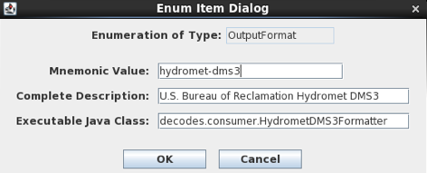

Figure 29: Computation Parameter Location Selection Dialog.

The only restriction is that an asterisk must be either at the beginning
or end of the string, or must be bounded by hyphens. Recall that the
mask is used to replace part of the TSID in the group members. The
hyphen gives it the context it needs to do this.

Algorithms Provided in the Computation Processor
================================================

The first section below describes properties that are common to
different algorithm classes (time-slice, aggregating,
running-aggregate). Following this, a subsection is provided for each
algorithm supplied with the CP distribution.

Common Properties to Algorithms
-------------------------------

The following tables describe properties used by the computation
infrastructure and are thus common to all algorithms or all algorithms
of a given class. They can be set in algorithm records (to apply to all
computations using an algorithm) or computation records (to apply to a
specific computation).

Property names are NOT case sensitive.

**Properties Common to All Algorithms:**

+-----------------+---------------+--------------------------------------------+
| **Name**        | **Java Type** | **Description**                            |
|                 |               |                                            |
|                 |               |                                            |
|                 |               |                                            |
+-----------------+---------------+--------------------------------------------+
| debugLevel      | long          | This property overrides the “-d” argument  |
|                 |               | used when compproc is started. Thus you    |
|                 |               | can increase debug level for a particular  |
|                 |               | algorithm (by defining the property in the |
|                 |               | algorithm record) or for a particular      |
|                 |               | computation.                               |
|                 |               |                                            |
|                 |               | 0=no debug, 1=more debug, 2=even more,     |
|                 |               | 3=most verbose.                            |
+-----------------+---------------+--------------------------------------------+
| TIMEROUND       | long          | Default=60 (seconds). Time series values   |
|                 |               | with time-tags within this many seconds    |
|                 |               | are considered to be at the same           |
|                 |               | time-slice.                                |
+-----------------+---------------+--------------------------------------------+
| interpDeltas    | Boolean       | Default = false. When computing an         |
|                 |               | automatic delta, if one of the bounding    |
|                 |               | values is missing and this is set to true, |
|                 |               | then the CP can interpolate the missing    |
|                 |               | value in order to compute the delta. This  |
|                 |               | is subject to the ‘maxInterpIntervals’     |
|                 |               | property.                                  |
+-----------------+---------------+--------------------------------------------+
| max             | long          | Default = 10. See ‘interpDeltas’ above.    |
| InterpIntervals |               | When CP interpolates in order to compute   |
|                 |               | an automatic delta. It will not            |
|                 |               | interpolate if more than this many         |
|                 |               | contiguous values are missing.             |
+-----------------+---------------+--------------------------------------------+
| ag              | String        | Default is set in decodes.properties. This |
| gregateTimeZone |               | can be set on an algorithm or computation  |
|                 |               | to override the default. It must be one of |
|                 |               | Java’s valid time-zone identifiers. This   |
|                 |               | is also used inside debug messages in the  |
|                 |               | log when displaying a time-series value.   |
+-----------------+---------------+--------------------------------------------+
| *rolen          | String        | See section 3.4.2. Normally this is set in |
| ame*\ \_MISSING |               | the computation parameter dialog. You can  |
|                 |               | set it in your algorithms to establish a   |
|                 |               | default.                                   |
+-----------------+---------------+--------------------------------------------+

**Properties for Aggregating Algorithms:**

+----------------------+--------+--------------------------------------+
| **Name**             | **Java | **Description**                      |
|                      | Type** |                                      |
+----------------------+--------+--------------------------------------+
| aggregateTimeZone    | String | (default set in decodes.properties)  |
+----------------------+--------+--------------------------------------+
| aggLowerBoundClosed  | B      | (default=true) True means to include |
|                      | oolean | the lower bound of the aggregate     |
|                      |        | period in the calculation.           |
+----------------------+--------+--------------------------------------+
| aggUpperBoundClosed  | B      | (default=false) True means to        |
|                      | oolean | include the upper bound of the       |
|                      |        | aggregate period in the calculation. |
+----------------------+--------+--------------------------------------+
| aggregateTimeOffset  | String | (default = no offset, i.e. aggregate |
|                      |        | period starts at beginning of even   |
|                      |        | interval). Syntax is:                |
|                      |        |                                      |
|                      |        | *N* *period …*                       |
|                      |        |                                      |
|                      |        | Where *N* is a positive integer and  |
|                      |        | *period* is one of year, month, day, |
|                      |        | hour, minute, second. You can have   |
|                      |        | multiple specifications like:        |
|                      |        |                                      |
|                      |        | “1 day 4 hours”                      |
+----------------------+--------+--------------------------------------+
| noAggregateFill      | B      | (default=false) If set to True, then |
|                      | oolean | CP will not iterate time slices for  |
|                      |        | aggregate computations. This         |
|                      |        | accommodates algorithms that want to |
|                      |        | perform the aggregate in the         |
|                      |        | database.                            |
+----------------------+--------+--------------------------------------+
| max                  | I      | See section 2.5.6. This property     |
| MissingValuesForFill | nteger | provides an upper limit to the       |
|                      |        | number of values that the            |
|                      |        | computation processor will           |
|                      |        | automatically fill missing values.   |
+----------------------+--------+--------------------------------------+
| m                    | I      | This is a number of seconds. See     |
| axMissingTimeForFill | nteger | section 2.5.6. This property         |
|                      |        | provides an upper limit to the       |
|                      |        | amount of time that the computation  |
|                      |        | processor will automatically fill    |
|                      |        | missing values.                      |
+----------------------+--------+--------------------------------------+

**Properties for Running Aggregate Algorithms:**

+--------------------+----------+--------------------------------------+
| **Name**           | **Java   | **Description**                      |
|                    | Type**   |                                      |
+--------------------+----------+--------------------------------------+
| aggPeriodInterval  | String   | (No default, required). For running  |
|                    |          | aggregates, the aggregate period     |
|                    |          | interval is set independently from   |
|                    |          | the interval of the output           |
|                    |          | parameter. Syntax is                 |
|                    |          |                                      |
|                    |          | *dbInterval*                         |
|                    |          |                                      |
|                    |          | or                                   |
|                    |          |                                      |
|                    |          | *dbInterval \* count*                |
|                    |          |                                      |
|                    |          | where *dbInterval* is a valid        |
|                    |          | interval string in the underlying    |
|                    |          | database and count is an integer.    |
+--------------------+----------+--------------------------------------+
| aggregateTimeZone  | String   | (default set in decodes.properties)  |
+--------------------+----------+--------------------------------------+
| a                  | Boolean  | (default=true) True means to include |
| ggLowerBoundClosed |          | the lower bound of the aggregate     |
|                    |          | period in the calculation.           |
+--------------------+----------+--------------------------------------+
| a                  | Boolean  | (default=false) True means to        |
| ggUpperBoundClosed |          | include the upper bound of the       |
|                    |          | aggregate period in the calculation. |
+--------------------+----------+--------------------------------------+
| noAggregateFill    | Boolean  | (default=false) If set to True, then |
|                    |          | CP will not iterate time slices for  |
|                    |          | aggregate computations. This         |
|                    |          | accommodates algorithms that want to |
|                    |          | perform the aggregate in the         |
|                    |          | database.                            |
+--------------------+----------+--------------------------------------+

AddToPrevious
-------------

**Type:** Time Slice

**Input Parameters:**

+---------------------+----------------------+-------------------------+
| **Name**            | **Java Type**        | **Type Code**           |
+---------------------+----------------------+-------------------------+
| Input               | double               | i                       |
+---------------------+----------------------+-------------------------+

**Output Parameter:**

output : double precision

**Properties:**

+---------------------------------+----------------+------------------+
| **Name**                        | **Java Type**  | **Default**      |
+---------------------------------+----------------+------------------+
| minSamplesNeeded                | long           | 1                |
+---------------------------------+----------------+------------------+

**Description:**

Adds the current value to the previous value in the database and outputs
the sum. Works on any time-series, any interval. This algorithm does
assume that you are calling it with a series of contiguous values, like
you would get out of a DCP message.

Average
-------

**Type:** Aggregating – period defined by output parameter “average”.

**Input Parameters:**

+---------------------+----------------------+-------------------------+
| **Name**            | **Java Type**        | **Type Code**           |
+---------------------+----------------------+-------------------------+
| Input               | double               | i                       |
+---------------------+----------------------+-------------------------+

**Output Parameter:**

average : double precision

**Properties:**

+-----------------------+------------+---------------------------------+
| **Name**              | **Java     | **Default**                     |
|                       | Type**     |                                 |
+-----------------------+------------+---------------------------------+
| minSamplesNeeded      | long       | 1                               |
+-----------------------+------------+---------------------------------+
| outputFutureData      | Boolean    | False                           |
+-----------------------+------------+---------------------------------+
| aggPeriodInterval     | String     | (no default – required)         |
+-----------------------+------------+---------------------------------+
| aggregateTimeZone     | String     | (default set in                 |
|                       |            | decodes.properties)             |
+-----------------------+------------+---------------------------------+
| aggLowerBoundClosed   | Boolean    | False                           |
+-----------------------+------------+---------------------------------+
| aggUpperBoundClosed   | Boolean    | True                            |
+-----------------------+------------+---------------------------------+
| aggregateTimeOffset   | String     | No offset. I.e. aggregate       |
|                       |            | period starts at beginning of   |
|                       |            | even interval                   |
+-----------------------+------------+---------------------------------+
| negativeReplacement   | double     | No default. If set, and the     |
|                       |            | average value to be output is   |
|                       |            | negative, then replace it with  |
|                       |            | this value.                     |
+-----------------------+------------+---------------------------------+

**Description:**

This is a general purpose averaging algorithm. The aggregating period
will be determined by the “interval” value that you assign to the output
variable “average”. Thus it is useful for producing a wide variety of
averages.

Your computation record should set an appropriate value for the
“minSamplesNeeded” property, depending on the output period and the
interval of the input parameter.

This algorithm fail and not produce an output if the required number of
points is not present in the aggregating period.

It will attempt to delete its output if any of the input points was
flagged as being deleted. This handles the case where there used to be
an average, but some of the input points are deleted and there is no
longer the required minimum.

In version 5.2 the aggregateTimeOffset period has been added. This
allows you to compute averages other than midnight to midnight.

Bridge Clearance
----------------

**Type:** Time-Slice

**Input Parameters:**

+-------------------------+------------------+-------------------------+
| **Name**                | **Java Type**    | **Type Code**           |
+-------------------------+------------------+-------------------------+
| waterLevel              | double           | i                       |
+-------------------------+------------------+-------------------------+

**Output Parameter:**

clearance : double precision

**Properties:**

+-------------------------------+-------------------+-----------------+
| **Name**                      | **Java Type**     | **Default**     |
+-------------------------------+-------------------+-----------------+
| lowChord                      | double            | 1               |
+-------------------------------+-------------------+-----------------+

**Description:**

Computes bridge clearance by subtracting *waterlevel* from constant 'low
chord'.

Make sure that the *waterlevel* and low chord are consistent. If one is
a stage above arbitrary datum, then they both must be. Likewise, if one
is an elevation above sea level, the other must be also.

Choose One
----------

**Type:** Time-Slice

**Input Parameters:**

+-------------------------+------------------+-------------------------+
| **Name**                | **Java Type**    | **Type Code**           |
+-------------------------+------------------+-------------------------+
| input1                  | double           | i                       |
+-------------------------+------------------+-------------------------+
| input2                  | Double           | i                       |
+-------------------------+------------------+-------------------------+

**Output Parameter:**

output : double precision

**Properties:**

+-----------------------------+-----------------+---------------------+
| **Name**                    | **Java Type**   | **Default**         |
+-----------------------------+-----------------+---------------------+
| upperLimit                  | double          | 999999999999.9      |
+-----------------------------+-----------------+---------------------+
| lowerLimit                  | Double          | -999999999999.9     |
+-----------------------------+-----------------+---------------------+
| chooseHigher                | Boolean         | True                |
+-----------------------------+-----------------+---------------------+
| input1LowThreshold          | Double          | (none)              |
+-----------------------------+-----------------+---------------------+

**Description:**

Useful in situations where you have redundant sensors: Given two inputs,
output the best one:

-  If only one is present at the time-slice, output it.

-  If one is outside the specified upper or lower limit (see properties)
   output the other.

-  If both are present and within limits, then it chooses based on other
   properties:

-  If the input1LowThreshold property is supplied, then

   Output input1 if its value is above the low threshold

   Otherwise output input2.

-  Otherwise (input1LowThreshold *not* supplied), if chooseHigher==true
      (the default) then output the higher of the two, otherwise the
      lower of the two.

Copy
----

**Type:** Time-Slice

**Input Parameters:**

+---------------------+----------------------+-------------------------+
| **Name**            | **Java Type**        | **Type Code**           |
+---------------------+----------------------+-------------------------+
| Input               | double               | i                       |
+---------------------+----------------------+-------------------------+

**Output Parameter:**

output : double precision

**Properties:**

+----------------------------+----------------+-----------------------+
| **Name**                   | **Java Type**  | **Default**           |
+----------------------------+----------------+-----------------------+
| mult                       | double         | 1.0                   |
+----------------------------+----------------+-----------------------+
| offset                     | Double         | 0.0                   |
+----------------------------+----------------+-----------------------+

**Description:**

Copies its input to its output with an optional multiplier and offset.

You can use this algorithm to save delta values to the database as
follows:

-  In the Computation Editor, make a copy of the algorithm record called
   “HourlyDelta”.

-  In this record change the input type code to “idh”.

-  Create a computation record to use the new algorithm.

Likewise, you can use this algorithm for any type of delta (daily,
monthly, etc.) by changing the input type code appropriately.

This algorithm will delete its output if its input is deleted.

Copy No Overwrite
-----------------

This algorithm is the same as the plain Copy algorithm with the
following exceptions:

-  It will *not* overwrite the output if a value already exists at the
   same time.

-  It does not support the “mult” property.

Dis-Aggregate
-------------

**Type:** Time-Slice

**Input Parameters:**

+---------------------+----------------------+-------------------------+
| **Name**            | **Java Type**        | **Type Code**           |
+---------------------+----------------------+-------------------------+
| input               | double               | i                       |
+---------------------+----------------------+-------------------------+

**Output Parameter:**

output : double precision

**Properties:**

+-----------------------+-----------+---------------------------------+
| **Name**              | **Java    | **Default**                     |
|                       | Type**    |                                 |
+-----------------------+-----------+---------------------------------+
| method                | String    | “fill”                          |
+-----------------------+-----------+---------------------------------+

**Description:**

This algorithm ‘dis-aggregates’ by spreading out the input values to the
outputs in various ways (fill or split). The interval of the input
should always be equal to, or longer than, the output. The output value
is filled over the time-period of the inputs.

For example: Input is daily, and the output is hourly. Then 24 output
values are written covering the period of each input.

The algorithm takes one property called ‘method’. This determines how
the output values are assigned:

-  fill (default) - Each output is the same as the input covering the
   period.

-  split - Divide the input equally between the outputs for the period.

Recall from the definitions in section 2.5.4, that a time-slice
algorithm iterates over all available input parameters. That is indeed
what the dis-aggregate algorithm does, although it produces more than
one output per input. Thus this is a time-slice algorithm.

Incremental Precip
------------------

**Type:** Aggregating

**Input Parameters:**

+-----------------------------+-------------------+--------------------+
| **Name**                    | **Java Type**     | **Type Code**      |
+-----------------------------+-------------------+--------------------+
| cumulativePrecip            | double            | I                  |
+-----------------------------+-------------------+--------------------+

**Output Parameter:**

incrementalPrecip: double precision

**Properties:**

+-----------------------------------+--------------+------------------+
| **Name**                          | **Java       | **Default**      |
|                                   | Type**       |                  |
+-----------------------------------+--------------+------------------+
| aggLowerBoundClosed               | Boolean      | True             |
+-----------------------------------+--------------+------------------+
| aggUpperBoundClosed               | Boolean      | True             |
+-----------------------------------+--------------+------------------+
| allowNegative                     | Boolean      | False            |
+-----------------------------------+--------------+------------------+

**Description:**

Compute Incremental *Precip* from Cumulative *Precip* over a specified
period.

Period determined by the interval of the output parameter, specified in
computation record.

If property allowNegative is set to true, then negative cumulative
Precip inputs will be accepted. The default is to ignore negative
inputs.

Resample
--------

**Type:** Aggregate – period defined by output parameter “output”.

**Input Parameters:**

+---------------------+----------------------+-------------------------+
| **Name**            | **Java Type**        | **Type Code**           |
+---------------------+----------------------+-------------------------+
| input               | double               | i                       |
+---------------------+----------------------+-------------------------+

**Output Parameter:**

output : double precision

**Properties:**

+----------+-----------+----------+-----------------------------------+
| **Name** | **Java    | **D      | **Description**                   |
|          | Type**    | efault** |                                   |
+----------+-----------+----------+-----------------------------------+
| method   | String    | “interp” | Determines how to set outputs for |
|          |           |          | which there is no input in the    |
|          |           |          | period. For example, going from   |
|          |           |          | DAY to HOUR values. If set to     |
|          |           |          | “interp” then each hour will be   |
|          |           |          | an interpolation between the day  |
|          |           |          | values. You can also set the      |
|          |           |          | property to “fill”, meaning that  |
|          |           |          | each hour will be set to the      |
|          |           |          | previous daily value.             |
+----------+-----------+----------+-----------------------------------+

**Description:**

Resample an input to an output with a different interval. Output must
not be instant (irregular). Input may be irregular or any interval
greater than or less than the output.

Note, The Subsample algorithm is more efficient when converting a short
interval to a long interval (e.g. output a daily value by selecting the
midnight hourly value).

Reservoir Full
--------------

**Type:** Time Slice

**Input Parameters:**

+---------------------+----------------------+-------------------------+
| **Name**            | **Java Type**        | **Type Code**           |
+---------------------+----------------------+-------------------------+
| storage             | double               | i                       |
+---------------------+----------------------+-------------------------+

**Output Parameter:**

percentFull : double precision

storageRemaining : double precision

**Properties:**

+------------------------------+----------------+----------------------+
| **Name**                     | **Java Type**  | **Default**          |
+------------------------------+----------------+----------------------+
| capacity                     | double         | 1                    |
+------------------------------+----------------+----------------------+

**Description:**

Given reservoir storage (output of rating computation), and a property
'capacity', output the percent full and storage remaining.

Running Average
---------------

**Type:** Running-Aggregate – period defined by output parameter
“average”.

**Input Parameters:**

+---------------------+----------------------+-------------------------+
| **Name**            | **Java Type**        | **Type Code**           |
+---------------------+----------------------+-------------------------+
| input               | double               | i                       |
+---------------------+----------------------+-------------------------+

**Output Parameter:**

average : double precision

**Properties:**

+------------------------------+----------------+----------------------+
| **Name**                     | **Java Type**  | **Default**          |
+------------------------------+----------------+----------------------+
| minSamplesNeeded             | long           | 1                    |
+------------------------------+----------------+----------------------+
| outputFutureData             | Boolean        | False                |
+------------------------------+----------------+----------------------+
| aggPeriodInterval            | String         | (no default –        |
|                              |                | required)            |
+------------------------------+----------------+----------------------+
| aggregateTimeZone            | String         | (default set in      |
|                              |                | decodes.properties)  |
+------------------------------+----------------+----------------------+
| aggLowerBoundClosed          | Boolean        | False                |
+------------------------------+----------------+----------------------+
| aggUpperBoundClosed          | Boolean        | True                 |
+------------------------------+----------------+----------------------+

**Description:**

This outputs a running average at the same interval as the input
parameter.

The aggregate period is set by the “aggPeriodInterval” property, which
must be a valid interval-string in the underlying database. For example:

-  In HDB, you could use hour, day, month, year, or wateryear.

-  In CWMS, you could use 6Hours, 1Day, etc.

You can also add a multiplier. For example “hour*12” would mean twelve
hours.

The “minSamplesNeeded” property works just like it does in the simple
Average Algorithm: If less than this many ‘input’ values are present in
an aggregate period, no ‘average’ will be produced.

Note that this algorithm can produce future data. For example, suppose
‘input’ is at an interval of 1Hour, minSamplesNeeded is set to 12, and
aggPeriodInterval is set to “1Day”. Then, when a 9AM value appears in
real time, it will compute averages from 9AM through 9PM. After that,
there will be less than 12 samples.

To prevent future data from ever being computed, set the
‘outputFutureData’ property to false.

CentralRunningAverage
~~~~~~~~~~~~~~~~~~~~~

**Type:** Running Aggregate

**Introduced in Version:** 6.2 RC05

To make this algorithm visible after installing an update, run:

cd $DCSTOOL_HOME

bin/compimport imports/comp-standard/CentralRunningAverageAlgorithm.xml

USACE added a separate algorithm called CentralRunningAverage. It is
identical to Running Average (described above) except that the outputs
are time tagged at the center of the period. The time tag is determined
to second-resolution by splitting the different between the beginning of
one period and the next.

*Caution:* If the aggregate time zone is one that honors daylight time
the aggregate periods may not be of equal length (example: daily running
average computed every hour for time zone EST5EDT). For the days when
daylight time changes, the “day” being averaged will be either 23 or 25
hours. Thus the center of period will be either 11.5 or 12.5 hours after
the start of period.

An alternate way to accomplish this with more control would be to use
Running Average (described in previous section) and put a Delta-T on the
output parameter.

ScalerAdder
-----------

**Type:** Time-Slice

**Input Parameters:**

+---------------------+----------------------+-------------------------+
| **Name**            | **Java Type**        | **Type Code**           |
+---------------------+----------------------+-------------------------+
| input1              | double               | i                       |
+---------------------+----------------------+-------------------------+
| input2              | double               | i                       |
+---------------------+----------------------+-------------------------+
| input3              | double               | i                       |
+---------------------+----------------------+-------------------------+
| input4              | double               | i                       |
+---------------------+----------------------+-------------------------+
| input5              | double               | i                       |
+---------------------+----------------------+-------------------------+
| Input6              | double               | i                       |
+---------------------+----------------------+-------------------------+
| Input7              | double               | i                       |
+---------------------+----------------------+-------------------------+
| Input8              | double               | i                       |
+---------------------+----------------------+-------------------------+
| Input9              | double               | i                       |
+---------------------+----------------------+-------------------------+
| Input10             | double               | i                       |
+---------------------+----------------------+-------------------------+

**Output Parameter:**

output : double precision

**Properties:**

+-----------------------------------+-------------+-------------------+
| **Name**                          | **Java      | **Default**       |
|                                   | Type**      |                   |
+-----------------------------------+-------------+-------------------+
| coeff1                            | double      | 1.0               |
+-----------------------------------+-------------+-------------------+
| coeff2                            | double      | 1.0               |
+-----------------------------------+-------------+-------------------+
| coeff3                            | double      | 1.0               |
+-----------------------------------+-------------+-------------------+
| coeff4                            | double      | 1.0               |
+-----------------------------------+-------------+-------------------+
| coeff5                            | double      | 1.0               |
+-----------------------------------+-------------+-------------------+
| coeff6                            | double      | 1.0               |
+-----------------------------------+-------------+-------------------+
| coeff7                            | double      | 1.0               |
+-----------------------------------+-------------+-------------------+
| coeff8                            | double      | 1.0               |
+-----------------------------------+-------------+-------------------+
| coeff9                            | double      | 1.0               |
+-----------------------------------+-------------+-------------------+
| coeff10                           | double      | 1.0               |
+-----------------------------------+-------------+-------------------+
| input1_MISSING                    | String      | “ignore”          |
+-----------------------------------+-------------+-------------------+
| input2_MISSING                    | String      | “ignore”          |
+-----------------------------------+-------------+-------------------+
| input3_MISSING                    | String      | “ignore”          |
+-----------------------------------+-------------+-------------------+
| input4_MISSING                    | String      | “ignore”          |
+-----------------------------------+-------------+-------------------+
| input5_MISSING                    | String      | “ignore”          |
+-----------------------------------+-------------+-------------------+
| input6_MISSING                    | String      | “ignore”          |
+-----------------------------------+-------------+-------------------+
| input7_MISSING                    | String      | “ignore”          |
+-----------------------------------+-------------+-------------------+
| input8_MISSING                    | String      | “ignore”          |
+-----------------------------------+-------------+-------------------+
| input9_MISSING                    | String      | “ignore”          |
+-----------------------------------+-------------+-------------------+
| input10_MISSING                   | String      | “ignore”          |
+-----------------------------------+-------------+-------------------+

**Description:**

This algorithm can take up to 10 inputs, multiply them by supplied
coefficients and add them together. In summary:

output = (input1 \* coeff1)

+ (input2 \* coeff2)

+ (input3 \* coeff3)

+ (input4 \* coeff4)

+ (input5 \* coeff5)

+ (input6 \* coeff6)

+ (input7 \* coeff7)

+ (input8 \* coeff8)

+ (input9 \* coeff9)

+ (input10 \* coeff10)

The algorithm checks to make sure each value is present before
multiplying by it’s coefficient and adding it to the output.

Note the default setting of “ignore” on the MISSING properties. This
makes the algorithm useful for adding from 1 to 10 points. Your
computation record should override these values to “fail” for required
inputs.

Subsample
---------

**Type:** Aggregating

**Input Parameters:**

+---------------------------------+------------------+-----------------+
| **Name**                        | **Java Type**    | **Type Code**   |
+---------------------------------+------------------+-----------------+
| inputShortInterval              | double           | I               |
+---------------------------------+------------------+-----------------+

**Output Parameter:**

outputLongInterval: double precision

**Properties:**

+-----------------------------------+--------------+------------------+
| **Name**                          | **Java       | **Default**      |
|                                   | Type**       |                  |
+-----------------------------------+--------------+------------------+
| aggLowerBoundClosed               | Boolean      | True             |
+-----------------------------------+--------------+------------------+
| aggUpperBoundClosed               | Boolean      | False            |
+-----------------------------------+--------------+------------------+

**Description:**

Subsamples the input parameter by the interval of the output parameter.
For example, you could produce an hourly value by subsampling 15-minute
input values.

Sum Over Time
-------------

**Type:** Aggregating

**Input Parameters:**

+-----------------------------+-------------------+--------------------+
| **Name**                    | **Java Type**     | **Type Code**      |
+-----------------------------+-------------------+--------------------+
| Input                       | double            | I                  |
+-----------------------------+-------------------+--------------------+

**Output Parameter:**

sum: double precision

**Properties:**

+-----------------------------------+--------------+------------------+
| **Name**                          | **Java       | **Default**      |
|                                   | Type**       |                  |
+-----------------------------------+--------------+------------------+
| aggLowerBoundClosed               | Boolean      | False            |
+-----------------------------------+--------------+------------------+
| aggUpperBoundClosed               | Boolean      | True             |
+-----------------------------------+--------------+------------------+
| minSamplesNeeded                  | Integer      | 1                |
+-----------------------------------+--------------+------------------+

**Description:**

Sum the input values over the period of the output.

Rating Calculations with USGS RDB Files
---------------------------------------

**Type:** Time-Slice

**Input Parameters:**

+---------------------+----------------------+-------------------------+
| **Name**            | **Java Type**        | **Type Code**           |
+---------------------+----------------------+-------------------------+
| Indep               | double               | i                       |
+---------------------+----------------------+-------------------------+

**Output Parameter:**

dep : double precision

**Properties:**

+-----------------------+-----------+---------------------------------+
| **Name**              | **Java    | **Default**                     |
|                       | Type**    |                                 |
+-----------------------+-----------+---------------------------------+
| exceedLowerBound      | boolean   | False                           |
+-----------------------+-----------+---------------------------------+
| exceedUpperBound      | boolean   | False                           |
+-----------------------+-----------+---------------------------------+
| tableDir              | String    | $DECODES_INSTALL_DIR/rdb        |
+-----------------------+-----------+---------------------------------+

**Description:**

This algorithm uses the USGS RDB rating-table files to do a
stage-to-flow (or elevation-to-volume) conversion.

It looks for a file in the specified “tableDir” directory with a name of
the form:

*UsgsSiteNum*.rdb

You can download these files for any USGS site from the following URL:

http://nwis.waterdata.usgs.gov/nwisweb/data/exsa_rat/*filename*

… where\ *filename* is constructed as above.

The two ‘exceed’ properties tell the algorithm how to handle the
situation where the input value is below the lowest table value or above
the highest. The default behavior is to fail to produce an output. By
setting these properties to ‘true’, you can cause it to extend the
interpolation of the two lowest or highest values.

Rating with simple ASCII Table Files
------------------------------------

**Type:** Time-Slice

**Input Parameters:**

+---------------------+----------------------+-------------------------+
| **Name**            | **Java Type**        | **Type Code**           |
+---------------------+----------------------+-------------------------+
| indep               | double               | i                       |
+---------------------+----------------------+-------------------------+

**Output Parameter:**

dep : double precision

**Properties:**

+-------------------+---------+---------------------------------------+
| **Name**          | **Java  | **Default**                           |
|                   | Type**  |                                       |
+-------------------+---------+---------------------------------------+
| exceedLowerBound  | boolean | False                                 |
+-------------------+---------+---------------------------------------+
| exceedUpperBound  | boolean | False                                 |
+-------------------+---------+---------------------------------------+
| tableDir          | String  | $DECODES_INSTALL_DIR/tab-files        |
+-------------------+---------+---------------------------------------+
| tableName         | String  | (empty string)                        |
+-------------------+---------+---------------------------------------+
| tableNameSuffix   | String  | .tab                                  |
+-------------------+---------+---------------------------------------+

**Description:**

This algorithm uses the rating table files to do a stage-to-flow (or
elevation-to-volume) conversion.

It looks for a file in the specified “tableDir” directory with a name of
the form:

*SiteName + suffix*

Or, you can completely specify the “tableName” property directly.

The two ‘exceed’ properties tell the algorithm how to handle the
situation where the input value is below the lowest table value or above
the highest. The default behavior is to fail to produce an output. By
setting these properties to ‘true’, you can cause it to extend the
interpolation of the two lowest or highest values.

USGS Equation
-------------

**Type:** Time-Slice

**Input Parameters:**

+---------------------+----------------------+-------------------------+
| **Name**            | **Java Type**        | **Type Code**           |
+---------------------+----------------------+-------------------------+
| input               | double               | i                       |
+---------------------+----------------------+-------------------------+

**Output Parameter:**

output : double precision

**Properties:**

+-----------------------+-----------+---------------------------------+
| **Name**              | **Java    | **Default**                     |
|                       | Type**    |                                 |
+-----------------------+-----------+---------------------------------+
| A                     | double    | 1.0                             |
+-----------------------+-----------+---------------------------------+
| B                     | double    | 0.0                             |
+-----------------------+-----------+---------------------------------+
| C                     | double    | 1.0                             |
+-----------------------+-----------+---------------------------------+
| D                     | double    | 0.0                             |
+-----------------------+-----------+---------------------------------+

**Description:**

Implements the USGS Equation:

output = A \* (B + input)^C + D

where A, B, C, and D are provided as properties.

Fill Forward
------------

**Type:** Time-Slice

**Introduced in Version:** 5.3

**Input Parameters:**

+---------------------+----------------------+-------------------------+
| **Name**            | **Java Type**        | **Type Code**           |
+---------------------+----------------------+-------------------------+
| input               | double               | i (simple input)        |
+---------------------+----------------------+-------------------------+

**Output Parameter:**

output : double precision

**Properties:**

+---------------+---------+--------+----------------------------------+
| **Name**      | **Java  | **Def  | **Description**                  |
|               | Type**  | ault** |                                  |
+---------------+---------+--------+----------------------------------+
| numIntervals  | Integer | 4      | Maximum number of output         |
|               |         |        | intervals to fill forward. Set   |
|               |         |        | to 0 for no limit.               |
+---------------+---------+--------+----------------------------------+

**Description:**

This algorithm is used to project an input value by copying it forward
in time for the specified number of intervals. This is used for certain
modeling programs.

For example, suppose the following parameters:

-  Input: OKVI4.Stage.Inst.1Hour.0.rev

-  Output: OKVI4.Stage.Inst.1Hour.0.fill

-  NumIntervals: 4

Now suppose the 08:00 input value of 5.23 arrives. This algorithm will
set the following output values: (08:00 5.23), (09:00 5.23), (10:00
5.23), and (11:00 5.23).

The algorithm will fill-forward until one of the following:

-  the specified maximum number of intervals is reached

-  the next input is reached

-  the current time is reached.

The input and output interval may be different. Filling will start on
the first output time after or equal to the input time. It also honors
the aggregateTimeZone and aggregateTimeOffset properties:

Example:

-  Input OKVI4.Stage.Inst.1Hour.0.rev

-  Output: OKVI4.Stage.Inst.~1Day.0.fill

-  NumIntervals: 4

-  AggregateTimeZone: EST5EDT

-  AggregateTimeOffset: 5 hours

Now suppose the Jan 5 08:00 EST input value of 5.23 arrives. This
algorithm will set the following output values: (Jan 6 05:00 EST 5.23),
(Jan 7 05:00 EST 5.23), (Jan 8 05:00 EST 5.23), and (Jan 9 05:00 EST
5.23).

An enhancement was added in 6.5 RC04 to allow filling to either the
current time or the next input value (whichever is earlier). To do this:

-  Set the numIntervals property to 0 (zero).

-  Set the maxMissingValuesForFill property to a number large enough to
   cover the period you want filled. Example: if the values have
   interval 1Hour and you need to fill 4 days, then set to at least 4 \*
   24 = 96.

-  Set the maxMissingTimeForFill property to a number of seconds large
   enough to cover the period you want filled. Example: if fill 4 days,
   then set to at least 4 \* 86400 = 345600.

Expression Parser Algorithm
---------------------------

**Type:** Time-Slice

**Introduced in Version:** 6.1 RC11

To make this algorithm visible after installing an update, run:

cd $DCSTOOL_HOME

bin/compimport imports/comp-standard/ExpressionParserAlgorithm.xml

**Input Parameters:**

+---------------------+----------------------+-------------------------+
| **Name**            | **Java Type**        | **Type Code**           |
+---------------------+----------------------+-------------------------+
| in1                 | double               | i (simple input)        |
+---------------------+----------------------+-------------------------+
| in2                 | double               | i (simple input)        |
+---------------------+----------------------+-------------------------+
| in3                 | double               | i (simple input)        |
+---------------------+----------------------+-------------------------+
| in4                 | double               | i (simple input)        |
+---------------------+----------------------+-------------------------+
| in5                 | double               | i (simple input)        |
+---------------------+----------------------+-------------------------+

**Output Parameter:**

out1 : double precision

out2 : double precision

**Properties:**

+------------+---------+--------+-------------------------------------+
| **Name**   | **Java  | **Def  | **Description**                     |
|            | Type**  | ault** |                                     |
+------------+---------+--------+-------------------------------------+
| pre\_\*    | String  | (none) | Lines of script to execute before   |
|            |         |        | time slices.                        |
+------------+---------+--------+-------------------------------------+
| ex\_\*     | String  | (none) | Lines of script to execute for each |
|            |         |        | time slice.                         |
+------------+---------+--------+-------------------------------------+
| post\_\*   | String  | (none) | Lines of script to execute after    |
|            |         |        | each time slice.                    |
+------------+---------+--------+-------------------------------------+

**Description:**

This algorithm allows you to write your own scripts using mathematical
expressions. The scripts are stored in properties. There are 3 separate
scripts:

-  All properties with names beginning with “pre\_” are sorted into a
   script and executed once before time slices. This script is typically
   used for looking up meta data to be used during the time slices.

-  All properties with names beginning with “ex\_” are sorted into a
   script and executed for each time slice. Assignments made to the
   output variables, out1 and out2, cause data to be written to the
   database.

-  All properties with names beginning with “post\_” are sorted into a
   script and executed once after all of the time slices.

The expression parser is based on JEP (Java Expression Parser). A
discussion of JEP syntax and capabilities can be found here:

http://www.cin.ufpe.br/~gfsv/gfsv/workspace/jep-2.4.1-ext-1.1.1-gpl/doc/html/

In addition to the standard syntax and all the standard mathematical
constants and functions, the following custom functions have also been
added:

+---------------------+------------------------------------------------+
| l                   | FUTURE IMPLEMENTATION. This function looks up  |
| ookupMeta(location, | meta data for a given location.                |
| param)              |                                                |
+=====================+================================================+
| cond(*cond, expr*)  | If the *cond* expression evaluates to true,    |
|                     | then execute the second argument *expr* and    |
|                     | return its value. Typically this is an         |
|                     | assignment, like this:                         |
|                     |                                                |
|                     | cond(in2 < 915.0, tabname=in1.site + “,”)      |
|                     |                                                |
|                     | else(tabname = in2.site)                       |
+---------------------+------------------------------------------------+
| else(*expr*)        | This would normally be on the line following   |
|                     | the cond() function. If the previous cond      |
|                     | function resulted in false (such that its      |
|                     | expression was not evaluated) then the         |
|                     | expression in the else(expr) statement here    |
|                     | will be evaluated.                             |
+---------------------+------------------------------------------------+
| exit()              | Typically included in some kind of conditional |
|                     | expression like if, cond, or else. This        |
|                     | function returns 0. It also sets a flag        |
|                     | causing the execution of the script to stop.   |
+---------------------+------------------------------------------------+
| goto(*expr*)        | ‘expr’ should result in a string that matches  |
|                     | one of your property name statement labels.    |
|                     | The function itself returns zero. After        |
|                     | execution the next statement label is set.     |
+---------------------+------------------------------------------------+
| debug3(*expr*)      | These statements cause messages to be written  |
|                     | to the computation processor log. Each message |
| debug2(*expr*)      | will be prefixed with the date/time and name   |
|                     | of the computation.                            |
| debug1(*expr*)      |                                                |
|                     |                                                |
| info(*expr*)        |                                                |
|                     |                                                |
| warning(*expr*)     |                                                |
+---------------------+------------------------------------------------+
| onError(*expr*)     | ‘expr’ should result in a string that matches  |
|                     | one of your property name statement labels.    |
|                     | This is usually used near the beginning of a   |
|                     | script. If any subsequent statement results in |
|                     | an error, then execution jumps to the named    |
|                     | label.                                         |
+---------------------+------------------------------------------------+
| rating(specId, in1, | The first argument is the string rating spec   |
| in2...inN)          | ID. Subsequent arguments are the independent   |
|                     | input values for the rating. The rating spec   |
|                     | determines the number of input variables       |
|                     | allowed.                                       |
+---------------------+------------------------------------------------+

+---------------------+------------------------------------------------+
| datchk(inputName)   | The argument is the variable name (e.g. “in1”  |
|                     | in double quotes). The function performs       |
|                     | whatever screenings are defined for the named  |
|                     | parameter at the current time slice. It        |
|                     | returns the resulting quality flags. These are |
|                     | usually assigned to the flags associated with  |
|                     | the variable, as in:                           |
|                     |                                                |
|                     | in1.flags = datchk("in1")                      |
+=====================+================================================+
| s                   | This performs screening according to screening |
| creening(inputName) | records in the CWMS database.                  |
+---------------------+------------------------------------------------+
| isQuestio           | Returns true if the passed flags-value         |
| nable(*parm*.flags) | indicates that the value is marked as          |
|                     | QUESTIONABLE. This is used to check the result |
|                     | of screening.                                  |
|                     |                                                |
|                     | Example, the following will perform a datchk   |
|                     | screening and set set the flags on the input   |
|                     | parameter. Then, if the result of the          |
|                     | screening is not REJECTED, the value and flags |
|                     | are set.                                       |
|                     |                                                |
|                     | in1.flags = datchk("in1", in1)                 |
|                     |                                                |
|                     | cond(isQuestionable(in1.flags),                |
|                     | warning("..."))                                |
+---------------------+------------------------------------------------+
| isRej               | Returns true if the passed flags-value         |
| ected(*parm*.flags) | indicates that the value is marked as          |
|                     | REJECTED. This is used to check the result of  |
|                     | screening.                                     |
|                     |                                                |
|                     | Example, the following will perform a datchk   |
|                     | screening and set set the flags on the input   |
|                     | parameter. Then, if the result of the          |
|                     | screening is not REJECTED, the value and flags |
|                     | are set.                                       |
|                     |                                                |
|                     | in1.flags = datchk("in1")                      |
|                     |                                                |
|                     | cond(isRejected(in1.flags), exit())            |
|                     |                                                |
|                     | out1 = in1                                     |
|                     |                                                |
|                     | out1.flags = in1.flags                         |
+---------------------+------------------------------------------------+

The following constants can be used in your expressions:

+-----------+--------+-------------------------------------------------+
| **Name**  | **     | **Description**                                 |
|           | Type** |                                                 |
+===========+========+=================================================+
| in1       | Number | The value of the in1 parameter in this          |
|           |        | timeslice.                                      |
+-----------+--------+-------------------------------------------------+
| in1       | String | Location of the time series associated with in1 |
| .Location |        |                                                 |
+-----------+--------+-------------------------------------------------+
| in1.Param | String | The ‘param’ part of the time series ID          |
|           |        | associated with in1                             |
+-----------+--------+-------------------------------------------------+
| in1.      | String | ParamType part of the TS ID associated with in1 |
| ParamType |        |                                                 |
+-----------+--------+-------------------------------------------------+
| in1       | String | Interval part of the TS ID associated with in1  |
| .Interval |        |                                                 |
+-----------+--------+-------------------------------------------------+
| in1       | String | Duration part of the TS ID associated with in1  |
| .Duration |        |                                                 |
+-----------+--------+-------------------------------------------------+
| in        | String | Version part of the TS ID associated with in1   |
| 1.Version |        |                                                 |
+-----------+--------+-------------------------------------------------+
| in1.      | String | ParamType part of the TS ID associated with in1 |
| ParamType |        |                                                 |
+-----------+--------+-------------------------------------------------+
| in1.      | String | ParamType part of the TS ID associated with in1 |
| ParamType |        |                                                 |
+-----------+--------+-------------------------------------------------+
| in        | String | The base location of the TS ID associated with  |
| 1.baseloc |        | in1                                             |
+-----------+--------+-------------------------------------------------+
| i         | String | The sub location of the TS ID associated with   |
| n1.subloc |        | in1                                             |
+-----------+--------+-------------------------------------------------+
| in1.      | String | The base param of the TS ID associated with in1 |
| baseparam |        |                                                 |
+-----------+--------+-------------------------------------------------+
| in1       | String | The sub param of the TS ID associated with in1  |
| .subparam |        |                                                 |
+-----------+--------+-------------------------------------------------+
| in1.ba    | String | The portion of the version string up to the     |
| seversion |        | first hyphen, of the entire string if no hyphen |
|           |        | is present                                      |
+-----------+--------+-------------------------------------------------+
| in1.s     | String | The portion of the version string after the     |
| ubversion |        | first hyphen, or unassigned if no hyphen is     |
|           |        | present                                         |
+-----------+--------+-------------------------------------------------+
| in1.flags | Number | A long integer representation of the data       |
|           |        | quality and other flags associated with the     |
|           |        | input value. These are used by the screening    |
|           |        | and datchk methods.                             |
+-----------+--------+-------------------------------------------------+
| in2...in5 | as     | For all input params you can reference the      |
|           | above  | value or the parts of the time series ID as     |
|           |        | described above for in1.                        |
+-----------+--------+-------------------------------------------------+
| out1      | Number | Initially, out1 and out2 have no value. Your    |
|           |        | script at some point should make an assignment  |
| out2      |        | to one or both of them. After an assignment is  |
|           |        | made, the value may be used in other            |
|           |        | expressions.                                    |
+-----------+--------+-------------------------------------------------+
| out1.\ *t | String | The time series ID parts may be referenced for  |
| sid-part* |        | both output parameters in the same way as       |
|           |        | described above.                                |
| out2.\ *t |        |                                                 |
| sid-part* |        |                                                 |
+-----------+--------+-------------------------------------------------+
| out1.     | Number | A long integer representation of the data       |
| \ *flags* |        | quality and other flags associated with the     |
|           |        | output value. These are used by the screening   |
| out2.     |        | and datchk methods.                             |
| \ *flags* |        |                                                 |
+-----------+--------+-------------------------------------------------+

WARNING! Care should be taken to ensure that you do not write a script
that results in an endless loop. Since looping is possible in a variety
of contexts, the algorithm code has no way of detecting all the ways
that an endless loop can happen.

As implied in the table above, at some point your time slice or post
script should make assignments to one or both of the output parameters.
After executing a script (e.g. in a timeslice), the code checks to see
if an assignment was made, and if so, a time-series value is written to
the database.

A quirk of the JEP parser is apparent when combining strings and
numbers, which will be common in the expressions in the logging
functions. Use JEP’s str() function to convert numbers to strings before
combining with other strings:

info("in1 = " + str(in1) + ", in2=" + str(in2))

Example of Using Expression Parser for Conditional Rating
~~~~~~~~~~~~~~~~~~~~~~~~~~~~~~~~~~~~~~~~~~~~~~~~~~~~~~~~~

The figure below shows an example of using the Expression Parser
algorithm for a conditional rating.

Figure 30: Expression Parser used for Conditional Rating

Note the three inputs defined and the single output. Now see the two
properties ex_1 and ex_2. these form the following script:

cond(in2 < 5, out1 = rating(stab, in2))

else(out1 = rating(mtab, in1, in2, in3))

Thus if the value at a given time for in2
(TESTSITE1.Opening-Conduit_Gates.Inst.1Hour.0.test) is less than 5, then
the single-variable rating defined by *stab* is used. Otherwise (in2
>=5) the multi-variable rating defined by *mtab* is used.

See how stab and mtab are defined in the ‘pre’ script.

Division Algorithm
------------------

**Type:** Time-Slice

**Introduced in Version:** 6.2 RC05

To make this algorithm visible after installing an update, run:

cd $DCSTOOL_HOME

bin/compimport imports/comp-standard/Division.xml

**Input Parameters:**

+---------------------+----------------------+-------------------------+
| **Name**            | **Java Type**        | **Type Code**           |
+---------------------+----------------------+-------------------------+
| input1              | double               | i (simple input)        |
+---------------------+----------------------+-------------------------+
| input2              | double               | i (simple input)        |
+---------------------+----------------------+-------------------------+

**Output Parameter:**

output : double precision

**Properties:**

+------------+---------+--------+-------------------------------------+
| **Name**   | **Java  | **Def  | **Description**                     |
|            | Type**  | ault** |                                     |
+------------+---------+--------+-------------------------------------+
| a          | Double  | 1.0    | Multiplier for input1               |
+------------+---------+--------+-------------------------------------+
| b          | Double  | 0.0    | Adder for input1                    |
+------------+---------+--------+-------------------------------------+
| c          | Double  | 1.0    | Multiplier for input2               |
+------------+---------+--------+-------------------------------------+
| d          | Double  | 0.0    | Adder for input2                    |
+------------+---------+--------+-------------------------------------+

**Description:**

Implement the equation:

output = ((a \* input1) + b) / ((c \* input2) + d)

No output is produced if the right side of the division operator
evaluates to 0.

Weighted Water Temperature
--------------------------

**Type:** Time-Slice

**Introduced in Version:** 6.2 RC05

To make this algorithm visible after installing an update, run:

cd $DCSTOOL_HOME

bin/compimport imports/comp-standard/WeightedWaterTemperature.xml

**Input Parameters:**

+---------------------+----------------------+-------------------------+
| **Name**            | **Java Type**        | **Type Code**           |
+---------------------+----------------------+-------------------------+
| input1              | double               | i (simple input)        |
+---------------------+----------------------+-------------------------+
| input2              | double               | i (simple input)        |
+---------------------+----------------------+-------------------------+
| input3              | double               | i (simple input)        |
+---------------------+----------------------+-------------------------+
| input4              | double               | i (simple input)        |
+---------------------+----------------------+-------------------------+

**Output Parameter:**

output : double precision

**Properties:**

(none)

**Description:**

Implement the equation:

output = ((input1 / input2) \* input3) + (1 – (input1 / input2) \*
input4)

No output is produced if the input2 is less than or equal to zero.

FlowResIn – Compute Reservoir Inflow at LRP
-------------------------------------------

**Type:** Time-Slice

**Introduced in Version:** 6.2 RC05

To make this algorithm visible after installing an update, run:

cd $DCSTOOL_HOME

bin/compimport imports/comp-standard/FlowResIn.xml

**Input Parameters:**

+---------------+----------------+------------------------------------+
| **Name**      | **Java Type**  | **Type Code**                      |
+---------------+----------------+------------------------------------+
| ResOut        | double         | i (simple input)                   |
+---------------+----------------+------------------------------------+
| Dstore        | double         | id (Delta with implicit period)    |
+---------------+----------------+------------------------------------+

**Output Parameter:**

ResIn : double precision

**Properties:**

averageSamples (default=1)

**Description:**

Computes estimated reservoir inflow using measured outflow and change in
storage.

The Dstore interval must be one of:

-  15minutes

-  1hour

-  1day

-  ~1day

The algorithm converts the change in reservoir storage (DStore) from
acre-ft per interval (one of the allowed intervals) and adds it to the
measured ResOut (which should be in cfs), and then assigns the result to
ResIn.

An alternate, more flexible way of computing reservoir inflow using
Python Algorithm is described in section 6.6.

Multiplication Algorithm
------------------------

**Type:** Time-Slice

**Introduced in Version:** 6.2 RC05

To make this algorithm visible after installing an update, run:

cd $DCSTOOL_HOME

bin/compimport imports/comp-standard/Multiplication.xml

**Input Parameters:**

+---------------------+----------------------+-------------------------+
| **Name**            | **Java Type**        | **Type Code**           |
+---------------------+----------------------+-------------------------+
| input1              | double               | i (simple input)        |
+---------------------+----------------------+-------------------------+
| input2              | double               | i (simple input)        |
+---------------------+----------------------+-------------------------+

**Output Parameter:**

output : double precision

**Properties:**

+------------+---------+--------+-------------------------------------+
| **Name**   | **Java  | **Def  | **Description**                     |
|            | Type**  | ault** |                                     |
+------------+---------+--------+-------------------------------------+
| a          | Double  | 1.0    | Multiplier for input1               |
+------------+---------+--------+-------------------------------------+
| b          | Double  | 0.0    | Adder for input1                    |
+------------+---------+--------+-------------------------------------+
| c          | Double  | 1.0    | Multiplier for input2               |
+------------+---------+--------+-------------------------------------+
| d          | Double  | 0.0    | Adder for input2                    |
+------------+---------+--------+-------------------------------------+

**Description:**

Implement the equation:

output = ((a \* input1) + b) \* ((c \* input2) + d)

Stat (Statistics) Algorithm
---------------------------

**Type:** Aggregating

**Introduced in Version:** 6.2 RC09

To make this algorithm visible after installing an update, run:

cd $DCSTOOL_HOME

bin/compimport imports/comp-standard/Stat.xml

Time Series Parameters:

+-------------+------------+------------------------------------------+
| **Role      | **Type**   | **Description**                          |
| Name**      |            |                                          |
+=============+============+==========================================+
| input       | input      | The input time series.                   |
+-------------+------------+------------------------------------------+
| ave         | output     | The average of the inputs over the       |
|             |            | period.                                  |
+-------------+------------+------------------------------------------+
| min         | output     | The minimum of the inputs over the       |
|             |            | period.                                  |
+-------------+------------+------------------------------------------+
| max         | output     | The maximum of the inputs over the       |
|             |            | period.                                  |
+-------------+------------+------------------------------------------+
| med         | output     | The median of the inputs over the        |
|             |            | period.                                  |
+-------------+------------+------------------------------------------+
| stddev      | output     | The standard deviation of the inputs     |
|             |            | over the period.                         |
+-------------+------------+------------------------------------------+

You may leave the statistics undefined if desired. For example, if you
only want min, max, and average, leave median and stddev undefined. If
this is a group-based computation, you should also set the ‘enabled’
properties listed below to prevent them from being automatically
defined.

The interval of the time series assigned to the ‘ave’ output is used to
determine the aggregate period. It is up to you to make sure that the
time series assigned to the outputs each has the same interval. If ‘ave’
is undefined, you may use the built-in ‘aggPeriodInterval’ property to
define the aggregate period.

The output units are set to the input units.

Properties:

+--------------+--------+----------+---------------------------------+
| **Property   | **Java | **D      | **Description**                 |
| Name**       | Type** | efault** |                                 |
+==============+========+==========+=================================+
| aggPe        | String | (none)   | If defined, this will be used   |
| riodInterval |        |          | to define the aggregate period. |
|              |        |          | Normally this is taken from the |
|              |        |          | Interval of the time series     |
|              |        |          | assigned to the ‘average’       |
|              |        |          | output.                         |
+--------------+--------+----------+---------------------------------+
| aveEnabled   | b      | true     | If false, no average output is  |
|              | oolean |          | produced.                       |
+--------------+--------+----------+---------------------------------+
| minEnabled   | b      | true     | If false, no minimum output is  |
|              | oolean |          | produced.                       |
+--------------+--------+----------+---------------------------------+
| maxEnabled   | b      | true     | If false, no maximum output is  |
|              | oolean |          | produced.                       |
+--------------+--------+----------+---------------------------------+
| medEnabled   | b      | true     | If false, no median output is   |
|              | oolean |          | produced.                       |
+--------------+--------+----------+---------------------------------+
| devi         | b      | true     | If false, no standard_deviation |
| ationEnabled | oolean |          | output is produced.             |
+--------------+--------+----------+---------------------------------+
| minS         | long   | 1        | If fewer than this many inputs  |
| amplesNeeded | int    |          | are present in the period, then |
|              |        |          | no output is produced.          |
+--------------+--------+----------+---------------------------------+

PeriodToDate Algorithm
----------------------

**Type:** Aggregating

**Introduced in Version:** 6.4 RC04

To make this algorithm visible after installing an update, run:

cd $DCSTOOL_HOME

bin/compimport imports/comp-standard/PeriodToDate.xml

Time Series Parameters:

+---------------+------------+-----------------------------------------+
| **Role Name** | **Type**   | **Description**                         |
+===============+============+=========================================+
| input         | input      | The input time series.                  |
+---------------+------------+-----------------------------------------+
| periodToDate  | output     | The output period-to-date values go     |
|               |            | here. Must have same interval as input. |
+---------------+------------+-----------------------------------------+
| deter         | output     | Used only to determine the aggregate    |
| mineAggPeriod |            | period. See below.                      |
+---------------+------------+-----------------------------------------+

This algorithm behaves like a time-slice algorithm in that it outputs an
value for each input value, and that the input and output (periodToDate)
parameters must have the same interval.

A second output parameter, ‘determineAggPeriod’, is used only to
determine the aggregating period. That is, when the to-date values are
to be reset. No values are ever written to this time series, but it must
exist in the database.

Example: To do a daily year-to-date value, set input to the time series
with the daily values. Set periodToDate to the time series that will
hold the output year-to-date values. Set determineAggPeriod to any
yearly time series in the database.

Properties:

+--------------+---------+----------+----------------------------------+
| **Property   | **Java  | **D      | **Description**                  |
| Name**       | Type**  | efault** |                                  |
+==============+=========+==========+==================================+
| goo          | boolean | false    | If set to true, then only good   |
| dQualityOnly |         |          | quality input values will        |
|              |         |          | contribute to the output         |
|              |         |          | periodToDate tally.              |
+--------------+---------+----------+----------------------------------+

GroupAdder Algorithm
--------------------

**Type:** Time Slice

**Introduced in Version:** 6.6 RC01

To make this algorithm visible after installing an update, run:

cd $DCSTOOL_HOME

bin/compimport imports/comp-standard/GroupAdder.xml

Time Series Parameters:

+---------------+------------+-----------------------------------------+
| **Role Name** | **Type**   | **Description**                         |
+===============+============+=========================================+
| mask          | input      | Applied to members of the group to      |
|               |            | determine the time series to sum. The   |
|               |            | Missing Action assigned to this         |
|               |            | parameter determines how to handle      |
|               |            | values that are missing at a given time |
|               |            | slice (see below).                      |
+---------------+------------+-----------------------------------------+
| sum           | output     | The sum of the masked group members.    |
+---------------+------------+-----------------------------------------+
| count         | output     | optional output set to the number of    |
|               |            | inputs processed                        |
+---------------+------------+-----------------------------------------+
| average       | output     | optional output set to the average of   |
|               |            | inputs                                  |
+---------------+------------+-----------------------------------------+

This algorithm provides a way to sum members of a group. It is a good
alternative to ScalarAdder and BigAdder in cases where the coefficient
is always 1.

It is designed to run efficiently as a timed computation (see section
2.7). You can have the computation run periodically at a time when the
input values are expected to be present. It *can* be run in the normal
fashion, as a triggered computation, but be aware that the computation
will then run when each individual input arrives, which may be
asynchronously.

The group is expanded to a set of time series identifiers. The mask is
then applied, which may modify the time series identifiers. Data is
fetched for each time series and then summed. The output sum is written
to the database.

The Missing Action assigned to the ‘mask’ parameter determines how the
algorithm handles the case where one or more of the time series does not
have a value at a given time slice. Section 2.5.6 describes the possible
values.

Python Algorithms
=================

Beginning with OpenDCS 6.2 RC04 you have the ability to write algorithms
that use Python scripts to execute your computations.

Creating a New Python Algorithm
-------------------------------

In the Computation Editor, on the Algorithm tab, click New. Then click
the Select button to the right of Exec Class. Select
decodes.tsdb.algo.PythonAlgorithm from the list.

.. image:: ./media/image34.png
   :alt: Macintosh HD:Users:mmaloney:Desktop:Screen Shot 2016-03-19 at 4.08.30 PM.png
   :width: 6.48542in
   :height: 4.61389in

As a demonstration, we will create a Python algorithm that does a
validation of a Stage input “rawstage” to produce “revstage”. It then
does a rating on “revstage” to produce “flow”. Since the algorithm can
be triggered by either rawstage or revstage, both are defined as inputs.
Flow is defined as an output.

-  *Use Case: A user uses a GUI to modify a revstage value.*

Use the Add button to the right of the Parameters window to create the
time series parameters for the algorithm:

Now, notice that when PythonAlgorithm is selected, the Python button in
the lower right of the screen is now enabled. Press it now.

You can write three different scripts:

-  A script executed before each group of time-slices. This is useful
   for initializing variables (like tallies and countes), as well as
   opening any external resources the algorithm needs.

-  A script executed at each time slice

-  A script executed after each group of time-slices

What defines a ‘group of time-slices’? This depends on the Algorithm
Type. There are three types:

-  TIME_SLICE (the simplest type): CCP will collect all the new input
   values. It will execute the *Before* script once. It will execute the
   *Time Slice* script for each discrete time in the data. It will
   execute the *After* script once when finished.

-  AGGREGATING: For example, for a Daily Average, the *Before* script is
   executed for each Day seen in the input data. Use it to set the tally
   and count to zero. The *Time Slice* script is executed for each value
   in the day. Use it to add to the tally and increment the count. The
   *After* script is executed after all the values for a given day are
   processed. Use it to output the daily average.

-  RUNNING_AGGREGATE: Like AGGREGATING, but the aggregate period is
   specified in a property rather than the interval of the output.

Our example is a simple TIME_SLICE algorithm.

Now in the ‘Before Time Slices’ tab we create a simple script that sets
a CWMS Rating Spec ID. The script is shown below.

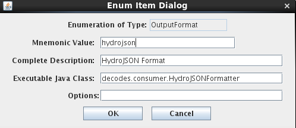

Now click the Time Slice tab. The bulk of the work is done here.

As an aid while typing your script, you can click the CCP Built-In
button. This gives you an annotated list of built-in functions for
interfacing with CCP and the CWMS database. You can select a function
from the dialog to have it inserted into your code.

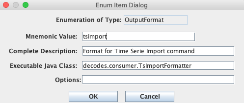

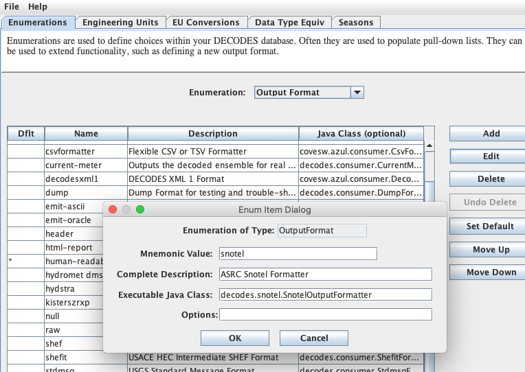

Here is the script text. We will go through it line by line.

if isNew('rawstage'):

screening('rawstage')

if isGoodQuality('rawstage'):

setOutputAndQual('revstage', rawstage.value, rawstage.qual)

setOutput('flow', rating(ratingSpecId, revstage.value))

The first two lines of the script are:

if isNew('rawstage'):

screening('rawstage')

The isNew() function will return true if the named parameter is either a
triggering value or a derived value in this time slice:

-  A *triggering* value comes from a tasklist entry. It is what caused
   this computation to run.

-  A *derived* value is one that was just computed *in this computation*
   and is flagged for output to the database.

Why do the isNew() check? Suppose this computation was triggered by
someone using a GUI to modify a revstage value. In such a case there is
no need to redo the screening on rawstage.

The screening() function looks for a CWMS Screening record for the named
parameter. If found, it is applied to the current timeslice value and
the quality flags set appropriately.

The next two lines are:

if isGoodQuality('rawstage'):

setOutputAndQual('revstage', rawstage.value, rawstage.qual)

The isGoodQuality() function will return true if the results of the
screening are OK. That is, the value is present, and it is not flagged
as Questionable or Rejected. We only want good values copied to the
revstage parameter.

The setOutputAndQual() function copies the passed value and quality to
the named parameter. Notice how the value and quality of rawstage are
referenced.

The final block of code is:

setOutput('flow', rating(ratingSpecId, revstage.value))

Notice call to the rating function embedded in the call to setOutput():

rating(ratingSpecId, revstage.value)

We pass it the ratingSpecId that was computed in the Before Time Slices
script. We then pass it the current value for revstage. The rating()
function can take multiple independent variables. If it fails for any
reason it will not produce an output and the call to setOutput will do
nothing.

When we ran this computation with a batch of test values, the output was
as follows. We set the screening such that the top two and lower two
values are Rejected. The next two on either side are Questionable. The
Rating was constructed to output a value ten times the input for easy
verification.

\| rawstage \| revstage \| flow \|

\| Stage \| Stage \| Flow \|

UTC \| ft \| ft \| cfs \|

\| TESTSITE1 \| TESTSITE1 \| TESTSITE1 \|

01/01/2012 00:00:00 \| 0.00 SR \| \| \|

01/01/2012 01:00:00 \| 1.00 SR \| \| \|

01/01/2012 02:00:00 \| 2.00 SQ \| \| \|

01/01/2012 03:00:00 \| 3.00 SQ \| \| \|

01/01/2012 04:00:00 \| 4.00 S \| 4.00 S \| 40.00 \|

01/01/2012 05:00:00 \| 5.00 S \| 5.00 S \| 50.00 \|

01/01/2012 06:00:00 \| 6.00 S \| 6.00 S \| 60.00 \|

01/01/2012 07:00:00 \| 7.00 S \| 7.00 S \| 70.00 \|

01/01/2012 08:00:00 \| 8.00 S \| 8.00 S \| 80.00 \|

01/01/2012 09:00:00 \| 9.00 S \| 9.00 S \| 90.00 \|

01/01/2012 10:00:00 \| 10.00 S \| 10.00 S \| 100.00 \|

01/01/2012 11:00:00 \| 11.00 S \| 11.00 S \| 110.00 \|

01/01/2012 12:00:00 \| 12.00 S \| 12.00 S \| 120.00 \|

01/01/2012 13:00:00 \| 13.00 S \| 13.00 S \| 130.00 \|

01/01/2012 14:00:00 \| 14.00 S \| 14.00 S \| 140.00 \|

01/01/2012 15:00:00 \| 15.00 S \| 15.00 S \| 150.00 \|

01/01/2012 16:00:00 \| 16.00 S \| 16.00 S \| 160.00 \|

01/01/2012 17:00:00 \| 17.00 S \| 17.00 S \| 170.00 \|

01/01/2012 18:00:00 \| 18.00 S \| 18.00 S \| 180.00 \|

01/01/2012 19:00:00 \| 19.00 S \| 19.00 S \| 190.00 \|

01/01/2012 20:00:00 \| 20.00 SQ \| \| \|

01/01/2012 21:00:00 \| 21.00 SQ \| \| \|

01/01/2012 22:00:00 \| 22.00 SQ \| \| \|

01/01/2012 23:00:00 \| 23.00 SR \| \| \|

01/02/2012 00:00:00 \| 24.00 SR \| \| \|

Accessing the Time Slice Time Value
-----------------------------------

A special variable named “tsbt” is available to your python code. This
holds the double-precision “tick” value of the time slice base time. You
can use any of the functions in the Python “time” package to manipulate
the value as date/time components or strings.

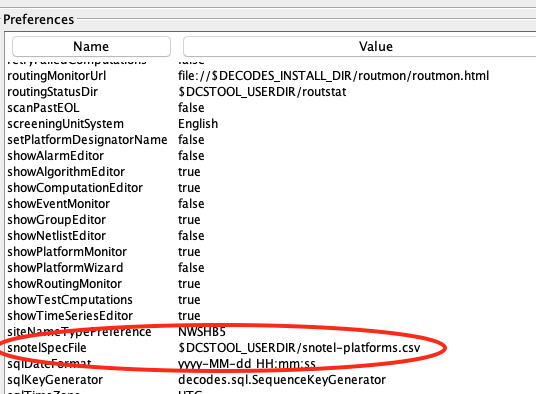

Creating a Computation that Uses the Algorithm
----------------------------------------------

You create computations for Python algorithms in the same way you do for
any other algorithm. The figure below shows a computation assigned to
our new “Python1” algorithm. Concrete time series identifiers are
assigned to each of the “roles” defined in the algorithm.

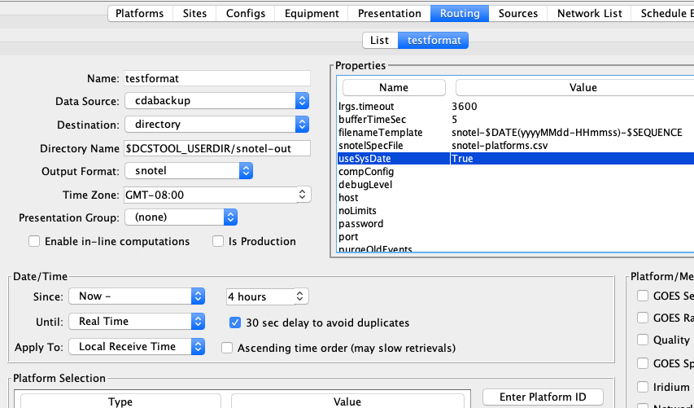

Time Series Parameters in the Python Scripts
--------------------------------------------

Two variables are always available to your scripts:

loading_application_id This is set to the ID (surrogate key) of the
application used to connect to the database when the computation
processor (or compedit if you’re running the computation interactively)
started up.

computation_id This is set to the ID (surrogate key) of the computation
record in the database.

As you noticed in the above example, you can access time-series
variables within your script. Use the dot-notation to specify what you
want to access in the time series:

*rolename*.value The value of the time series at the current time-slice
(may only be used in the Time Slice script.)

*rolename*.qual The quality flag value of the time series at the current
time-slice (may only be used in the Time Slice script.)

*rolename*.tsid The String time series identifier, or TSID.

*rolename*.tskey The surrogate key for this TSID in the database. For
CWMS, this is the numeric ts_code. For HDB this is the key in to the
CP_TS_ID table (i.e. CP_TS_ID.TS_ID).

*rolename*.interval The Interval portion of the TSID.

**CWMS-Specific Time Series Meta Data:**

*rolename*.location The location portion of the TSID

*rolename*.baselocation The base location of the TSID or the entire
location if there is no hyphen separater in the string.

*rolename*.sublocation The sub location of the TSID, or empty if there
is no hyphen.

*rolename*.param The Param portion of the TSID

*rolename*.baseparam The base param of the TSID, or the entire param if
there is no hyphen

*rolename*.subparam The sub param of the TSID, or empty if there is no
hyphen.

*rolename*.paramtype The ParamType portion of the TSID (e.g. Inst,
Total)

*rolename*.duration The Duration portion of the TSID

*rolename*.version The Version portion of the TSID

*rolename*.baseversion The base version of the TSID, or the entire
version if there is no hyphen

*rolename*.subversion The sub version of the TSID, or empty if there is
no hyphen

**HDB-Specific Time Series Meta Data:**

*rolename.*\ sdi The Site Datatype ID of the time series (in HDB, this
is distinct from tskey).

*rolename*.site The DECODES preferred site name for the location of the
TSID.

*rolename*.tableselector This will be R\_ for real data or M\_ for
modeled.

*rolename*.modelId If this time series is modeled data, this will be the
model ID.

Also notice that several of the built-in CCP functions take a role name
as an argument. See how the isNew() function is called:

if isNew('rawstage'):

Conditional Rating Example
--------------------------

For another example we will do a conditional rating. We define a new
Python Algorithm with the following parameters:

.. image:: ./media/image41.png
   :alt: Macintosh HD:Users:mmaloney:Desktop:Screen Shot 2016-03-22 at 4.29.48 PM.png
   :width: 6.07369in
   :height: 2.94431in

We have a reservoir with gates. The first three parameters are a count
of the gates, the gate opening in feet, and the reservoir level. The
forth parameter is the stage for the reservoir tail. The final output
parameter flow is rated as follows:

-  If stagetail is less than 5.0 we using a single-variable rating that
   depends only on stagetail.

-  If stagetail is greaterthan or equal to 5.0 we use a 3-variable
   rating with independent parameters count, opening, and reslev.

There are two CWMS-resident rating tables. In the Before Time Slices
script we construct the CWMS Rating Spec IDs:

Notice how the locations are taken from the parameters to build the
complete Spec IDs. The debug1() function will print the names of the
tables to the log.

The Time Slice script is now very simple:

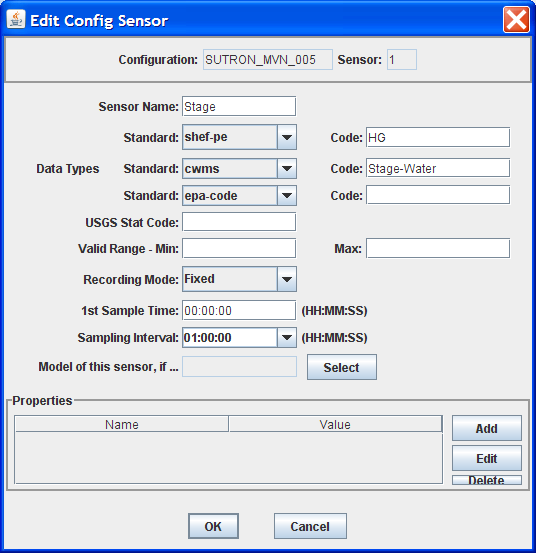

Reservoir Estimated Inflow
--------------------------

For a more complex example we will computed estimated inflow for a
reservoir that measures only pool elevation and tail-water stage. The
computation is illustrated as follows:

In the past, each of the green rounded boxes would be a separate
computation. We will implement the entire chain in a single Python
algorithm. To start, we define a new Python Algorithm as follows. Notice
that we define time series parameters for each of the labels to the left
and right of the figure above. Also, the yellow boxes labeled
“.Flow..6Hours.rev” and “.Flow-Holdout..5Hours.rev” will exist only
inside the Python script. They will not be written to time series in the
database.

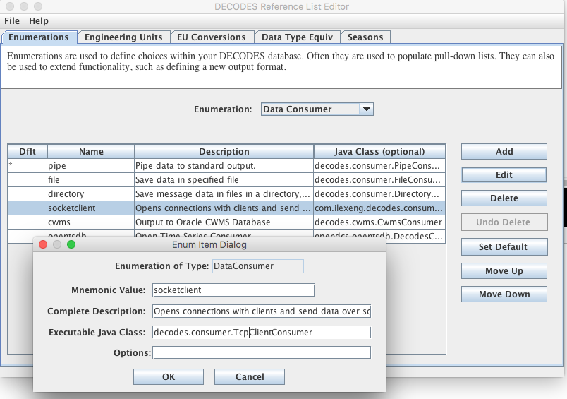

We will be doing two ratings using RDB and simple TAB files. In the
Before script we define the file names, again using the location from
the time series parameters:

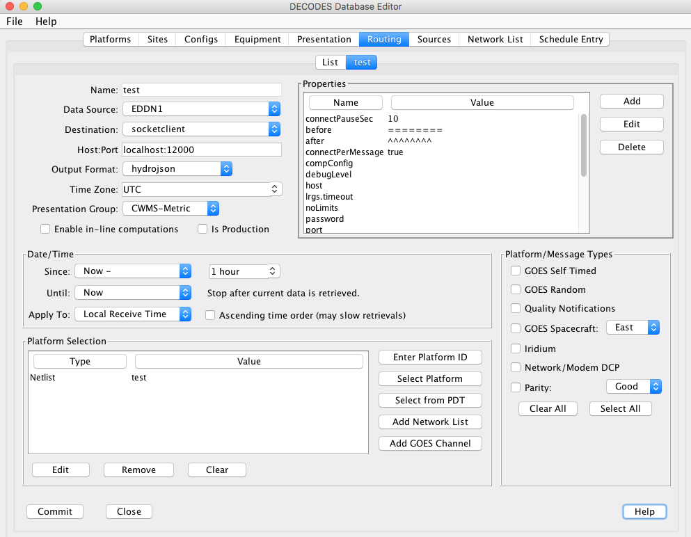

We assume the files will be in the current directory (where compproc is
running). That’s why we use the “./” prefix, meaning current directory.
You could also use a hard coded path name.

The Time Series script is as follows:

# Copy no-overwrite from stagetail raw to rev

if isNew('stagetail_raw') and not isGoodQuality('stagetail_rev'):

setOutputAndQual('stagetail_rev', stagetail_raw.value,
stagetail_raw.qual)

# Rating from stagetail rev to outflow

if isNew('stagetail_rev'):

try:

setOutput('outflow', rdbrating(rdbfile, stagetail_rev.value))

except NoValueException as e:

warning(e.toString())

# 6 hour running average of outflow is not saved to a time series

if isNew('outflow'):

ave6hrOutflow = runningAverage('outflow', '6Hours', '(]')

# 2nd part of chain: Stage Pool

if isNew('stagepool_raw') and not isGoodQuality('stagepool_rev'):

setOutputAndQual('stagepool_rev', stagepool_raw.value,
stagepool_raw.qual)

# Rating from stagepool to storage

if isNew('stagepool_rev'):

try:

setOutput('storage', tabrating(tabfile, stagepool_rev.value))

except NoValueException as e:

warning(e.toString())

# Holdout is a 6hr delta storage converted from acre-ft to cfs (not
saved)

if isNew('storage'):

try:

holdout = changeSince('storage', '6Hours') \* 2.0167

# Finally, the inflow is outflow + holdout.

setOutput('inflow', ave6hrOutflow + holdout)

except NoValueException as e:

warning('Error in changeSince: ' + e.toString())

Note how each block begins with ‘isNew()’ containing the name of the
parameter that would trigger that block of code. This is so we only do
the amount of work needed: Imagine if the computation were triggered by
a GUI edit of stagepool_rev: Only the 2\ :sup:`nd` half of the script
would be run, starting with the tabrating for storage.

Also notice the exception handling in the final block of code: The
rating, averaging, and changeSince functions can raise a
NoValueException if they are unable to produce an output. It’s important
to catch this to prevent the computation from terminating without saving
its output.

XML Import/Export Utilities
===========================

Computational Meta-Data can be exported to, and imported from, XML
files. This section describes the XML format and the import/export
utilities.

XML Format for Computation Meta-Data
------------------------------------

Figure 31 contains an example meta-data file. The file contains:

-  One Computation Process Record (a.k.a. Loading Application) called
   “compTester”.

-  Two Algorithm Records called “Copy” and “RdbRating”.

-  Two Computation Records called “GRZU1-Copy-65-120” and
   “GRZU1-Rdb-65-60”.

The example illustrates all aspects of the XML format.

<?xml version="1.0" standalone="yes"?>

<CompMetaData>

<LoadingApplication name="compTester">

<Comment>Test computation process.

Modified comment</Comment>

</LoadingApplication>

<Algorithm name="Copy">

<Comment>

Copy input parameter to output. Delete output if input was deleted.

</Comment>

<ExecClass>decodes.tsdb.algo.CopyAlgorithm</ExecClass>

<AlgoParmroleName="input">

<ParmType>i</ParmType>

</AlgoParm>

<AlgoParmroleName="output">

<ParmType>o</ParmType>

</AlgoParm>

</Algorithm>

<Algorithm name="RdbRating">

<Comment>

Implements rating table computations. Holds the lookup table &amp; shift

values. Independent (e.g. STAGE) value is called &quot;indep&quot;.

Dependent (e.g. FLOW) is called &quot;dep&quot;. &lt;p&gt;Properties

include: &lt;ul&gt; &lt;li&gt;applyShifts - true if you want algorithm
to

apply shifts. Usually unnecessary because RDB files are expanded.

&lt;/li&gt; &lt;li&gt;tableType - default=&quot;RDB&quot;. Also supports

&quot;SimpleTable&quot;. &lt;/li&gt; &lt;li&gt;tableDir - Directory

containing table files.&lt;/li&gt; &lt;/ul&gt;

</Comment>

<ExecClass>decodes.tsdb.algo.RdbRating</ExecClass>

<AlgoProperty name="exceedUpperBound">false</AlgoProperty>

<AlgoProperty name="applyShifts">false</AlgoProperty>

<AlgoProperty name="exceedLowerBound">false</AlgoProperty>

<AlgoProperty name="tableDir">$DECODES_INSTALL_DIR/rdb</AlgoProperty>

<AlgoParmroleName="dep">

<ParmType>o</ParmType>

</AlgoParm>

<AlgoParmroleName="indep">

<ParmType>i</ParmType>

</AlgoParm>

</Algorithm>

<Computation name="GRZU1-Copy-65-120">

<Comment>Copies datatype 65 into datatype 120.</Comment>

<Enabled>false</Enabled>

<CompProcName>compTester</CompProcName>

<AlgorithmName>Copy</AlgorithmName>

<LastModified>2006-09-26 11:33:47 EDT</LastModified>

<CompParmroleName="input">

<SiteDataType>

<SiteNameNameType="nwshb5">GRZU1</SiteName>

<SiteNameNameType="usgs">09234500</SiteName>

<DataType Standard="HDB">65</DataType>

</SiteDataType>

<Interval>instant</Interval>

<TableSelector>R_</TableSelector>

<DeltaT>0</DeltaT>

</CompParm>

<CompParmroleName="output">

<SiteDataType>

<SiteNameNameType="nwshb5">GRZU1</SiteName>

<SiteNameNameType="usgs">09234500</SiteName>

<DataType Standard="HDB">120</DataType>

</SiteDataType>

<Interval>instant</Interval>

<TableSelector>R_</TableSelector>

<DeltaT>0</DeltaT>

</CompParm>

</Computation>

<Computation name="GRZU1-Rdb-65-60">

<Comment>RDB Rating for site GRZU1 input=65, output=60</Comment>

<Enabled>true</Enabled>

<CompProcName>compTester</CompProcName>

<AlgorithmName>RdbRating</AlgorithmName>

<LastModified>2006-09-26 15:04:22 EDT</LastModified>

<CompProperty name="tableDir">.</CompProperty>

<CompParmroleName="dep">

<SiteDataType>

<SiteNameNameType="nwshb5">GRZU1</SiteName>

<SiteNameNameType="usgs">09234500</SiteName>

<DataType Standard="HDB">60</DataType>

</SiteDataType>

<Interval>instant</Interval>

<TableSelector>R_</TableSelector>

<DeltaT>0</DeltaT>

</CompParm>

<CompParmroleName="indep">

<SiteDataType>

<SiteNameNameType="nwshb5">GRZU1</SiteName>

<SiteNameNameType="usgs">09234500</SiteName>

<DataType Standard="HDB">65</DataType>

</SiteDataType>

<Interval>instant</Interval>

<TableSelector>R_</TableSelector>

<DeltaT>0</DeltaT>

</CompParm>

</Computation>

</CompMetaData>

Figure 31: Example XML Meta-Data File.

Import Utility
--------------

Synopsis:

compimport [-C] [-o] *filename1 [filename2 ...]*

Description

   Imports meta-data from the named files into your database.
   Computation records include Processes, Algorithms, Time Series Groups
   and Computations. Each has a unique name in the database. Unless the
   “-o” option is present (see below), importing records will overwrite
   records with the same name in your database.

Options:

-C (default = false) Create Time Series for computation parameters as
needed. That is, if a non-group computation uses time series that do not
exist in the database, an empty time series will be created.

-o (default = false) Do not overwrite existing records with the same
name as a record in the XML file.

Export Utility
--------------

**Synopsis:**

compexport[–C *ctrlfile*]\ *filename*

**Description**

Exports meta-data in your database to the named file.

Use the “-C *ctrlfile*\ ” option (where *ctrlfile* is the name of a
file) to control which records are exported. Without a control file, all
records are exported. The control file is an ASCII text file with one
record per-line. Lines can be of the following forms:

proc:**Process Name**

comp:**Computation Name**

algo:**Algorithm Name**

group:**Time-Series Group Name**

Id you uaw control file, only the records specified will be exported,
with one caveat: If you export a computation that uses a group, that
group’s definition will always be included in the output XML file.

Starting the Computation Processor Daemons
==========================================

There are two daemon processes which must run in the background for the
CP to function:

-  The Computation Processor or “compproc”.

-  The new Computation-Dependencies daemon.

The Computation Processor
-------------------------

Synopsis:

compproc –a *appname[options]*

complocklist

stopcomp –a *appname*

Options:

-m *ModelRunId* Specify the default model run ID to use when writing
modeled data.

-d *DebugLevel* Debug Level is 1, 2, or 3 (3 = most verbose) – Control
the verbosity of log messages.

-c *ConfigFile* Specify computation config file (default =
$DECODES_INSTALL_DIR/comp.conf).

-l *LogFile* Specify log file name (default = comp.log in current
directory).

Description

   The “compproc” script starts the background computation processor. On
   Unix/Linux systems it starts it in the background using the nohup
   command. Thus any output will be sent to “nohup.out”.

   The “-a *appname*\ ” argument is required. The “\ *appname*\ ” string
   must match the name of a computation process (a.k.a. loading
   application) in the database. This determines what the
   LOADING_APPLICATION_ID for this process will be.

   The process continues to run in the background until its lock is
   removed.

   The “complocklist” script will list any computation locks that
   currently exist along with their status.

   The “stopcomp” script will remove the lock for the specified
   computation process, thus terminating the background process.

The Computation Dependencies Daemon
-----------------------------------

HDB has always used the CompDepends Daemon described here. Beginning
with OpenDCS 6.3, CWMS will also use it.

Synopsis:

   compdepends *options*

Options:

-d *debug-level* Sets debug level from 0 (no debug messages, INFO only)
to 3 (most verbose).

-a *appname* The application to use when connecting (default =
“compdepends”).

-G *GroupDumpDir* Specify a directory to dump group evaluations after
they are performed. This is a trouble-shooting feature that allows you
to monitor how the daemon is evaluating groups.

-F Perform a full evaluation of all dependencies upon startup.

Description:

With the addition of time series groups, determining what computations
need to be run for a given input becomes significantly more complex. In
older versions of the CP the trigger on the various data tables did this
determination directly. For the new CP, a separate Java daemon performs
this task and places computation dependencies in a simple two-column
relation. Two new tables are shown in the ERD in Figure 32.

Figure 32: CP_COMP_DEPENDS table used to optimize relationship between
time series and computations.

The CP_TS_ID table provides a single unique integer key to a time
series. The CP GUIs and the background compproc daemon update this table
as needed when new time series are created.

The CP_COMP_DEPENDS table then relates this TS_ID to the computations
that must be run when data for this time series is written to HDB. It is
the job of the compdepends daemon to keep this table up to date.

The Computation Dependencies Daemon relies on database trigger code and
a new table called CP_DEPENDS_NOTIFY. Triggers fire on events that would
change the computation dependencies. The trigger places a notification
into the CP_DEPENDS_NOTIFY table. The Computation Dependencies Daemon
reads the notifications and updates the CP_COMP_DEPENDS table
accordingly. The notifications are as follows:

+----------+-----------------------------------------------------------+
| Event    | Description                                               |
| Type     |                                                           |
+==========+===========================================================+
| T        | Time Series Created – a new time series has been created  |
|          | in the database. KEY is the unique database key (i.e. for |
|          | HDB CP_TS_ID.ts_id). The daemon must check to see if this |
|          | new time series meets the criteria for a group            |
|          | computation.                                              |
+----------+-----------------------------------------------------------+
| D        | Time Series Deleted – A time series with the specified    |
|          | KEY was deleted from the database. Any computations       |
|          | depending on this time series will no longer be           |
|          | performed. For group computations, the dependency is      |
|          | simply removed. For single (non-group) computations, the  |
|          | computation itself will be disabled.                      |
+----------+-----------------------------------------------------------+
| M        | Time Series Modified – indicates that one of the key      |
|          | fields of a time series has been modified. Dependencies   |
|          | will be re-evaluated.                                     |
+----------+-----------------------------------------------------------+
| C        | Computation Modified – KEY is the computation ID.         |
|          | Indicates that the specified computation was modified in  |
|          | some way. All previous dependencies are removed and new   |
|          | ones are evaluated.                                       |
+----------+-----------------------------------------------------------+
| G        | KEY is the time series group ID. Indicates that a time    |
|          | series group was modified. Any computations that use this |
|          | group (recursively) must be reevaluated.                  |
+----------+-----------------------------------------------------------+
| F        | Special message indicating that a full evaluation should  |
|          | be performed. Thus by inserting a record into             |
|          | CP_DEPENDS_NOTIFY with EVENT_TYPE = ‘F’ (e.g. from SQL    |
|          | Developer), you can force a reevaluation of all           |
|          | dependencies.                                             |
+----------+-----------------------------------------------------------+

Interactive Run-Computations GUI
================================

Figure 33 shows the Interactive Run-Computations GUI. The program can be
started in two ways:

-  Stand-alone from the ‘runcomp’ script in your bin directory.

-  Linked to the Computation Editor by pressing the ‘Run Computations’
   button as described in section 3.4 above.

When run in stand-alone mode, you select the computations you want to
run from a list. When linked to the computation editor, that section of
the screen is grayed-out. You are implicitly running the
computation-being-edited. Other than this, the operation is the same in
both modes.

Just below the computation list, you enter a date/time range and then
press the ‘Run Computations’ button. Input values for the selected range
are retrieved, the computations are run, and the results are shown in
the graph and in the table at the bottom. You can zoom-in/out by
dragging and right-clicking the mouse in the graph.

.. image:: ./media/image48.png
   :width: 5.45833in
   :height: 6.01042in

Figure 33: Interactive Run Computations GUI.

Other Utilities
===============

Several other utilities were written as unit-test programs. They may be
useful in operational scenarios as well.

List All Computations
---------------------

Synopsis:

complist

Description:

   Prints a list of computations defined in the database.

List All Algorithms
-------------------

Synopsis:

algolist

Description:

   Prints a list of algorithms defined in the database.

List Locks Used by Computation Processes
----------------------------------------

Synopsis:

complocklist

Description:

   Prints a list of computation locks defined in the database. This in
   essence will give you a list of currently running computation
   processes.

List the CP_COMP_DEPENDS Table
------------------------------

Synopsis:

decj decodes.tsdb.ShowCompDepends

Description:

   This is a trouble-shooting utility to print out the current
   computation dependencies in a CSV format. The following is an example
   showing the command and its output for the HDB database. The format
   for a Time Series Identifier will vary for HDB, Tempest, and CWMS.

decj decodes.tsdb.ShowCompDepends

9936, "TESTSITE1.65.instant.R\_", 146, "regtest_006-1-DailyAverage", 50,
"compproc_regtest"

9944, "TESTSITE3.65.instant.R\_", 146, "regtest_006-1-DailyAverage", 50,
"compproc_regtest"

9945, "TESTSITE1.66.day.R\_", 147, "regtest_006-2-Disagg", 50,
"compproc_regtest"

9946, "TESTSITE3.66.day.R\_", 147, "regtest_006-2-Disagg", 50,
"compproc_regtest"

The columns are:

-  Time Series Key (integer)

-  Time Series ID (String – Database Specific Unique Time Series
   Identifier)

-  Computation ID (integer)

-  Computation Name (String)

-  Computation Process ID (integer)

-  Computation Process Name (String)

Output Time Series Data
-----------------------

Synopsis:

outputts *[ options ]* time-series-ID-1 *[ time-series-ID-N … ]*

Options:

   -F *OutputFormat* (default=Human-Readable). OutputFormat can be any
   of the recognized DECODES formatters. See the “rledit” utility,
   Output Format Enumeration for a list.

   -S *SinceTime* Retrieve data since this time (dd-MMM-yyyy/HH:mm). You
   can also say “today” for midnight today, “yesterday” for midnight
   yesterday, or “all” for all data in storage.

   -U *UntilTime* Retrieve data until this time (dd-MMM-yyyy/HH:mm). You
   can also specify “now”.)

   -Z *TimeZone* Interpret –S and –U arguments in this time zone. Output
   time-stamps in this time zone.

   -G *PresentationGrp* Apply this DECODES presentation group to the
   output (sets significant digits and engineering units for each
   parameter).

In HDB, a Time Series Identifier (TSID) has 4 or 5 parts:

Site.DataType.Interval._R *(For Real Data)*

Site.DataType.Interval._M.ModelId *(For Modeled Data)*

For CWMS and OpenTSDB, a TSID has six parts:

Location.Param.ParamType.Interval.Duration.Version

Description:

   Retrieves the specified data, formats it, and prints it to the
   standard output in the specified format.

   If you use the “tsimport” format (See TsImport Formatter in the
   Routing Scheduling Guide), then the output file is compatible with
   the importts utility described below. This is the easiest way to
   transfer time series data from one database to another.

Show New Data Assigned to Computations
--------------------------------------

Synopsis:

compnewdata –a *appname*

Description:

   This is a unit test program to show values created in the
   CP_COMP_TASKLIST table. It functions in part like the actual
   computation process:

-  Connects to the database as the specified loading app.

-  Waits in a loop for task-list records to occur.

-  Retrieves and deletes task-list entries

..

   But instead of executing computations, it simply prints the task-list
   entries to the screen.

   We use this utility in the test procedures to clear any unwanted
   task-list entries before starting a controlled test.

Delete a Time Series
--------------------

Synopsis:

tsdelete *sdi:interval:tabselect:modid*

Description:

   Deletes last 24 hours worth of data from the specified time series.
   The time series is identified by a string in the format shown, where:

-  sdi = Site Datatype ID

-  tabselect = table selector, e.g. “R\_”

-  modid = model run ID (use -1 for real data)

Import Time Series Data from a File
-----------------------------------

Synopsis:

importts filename

Description:

   Reads the file and imports the data into HDB.

   The file has three types of lines:

-  SET:TZ\ *=*\ TimeZone

-  TSID:*Full Time Series Path Name*

-  Data line: YYYY/MM/DD-HH:MM:SS,Value,Flags

-  SET:UNITS=\ *units abbreviation (e.g. “ft”)*

..

   The SET and TSID apply to all subsequent data lines.

Evaluate a Time Series Group
----------------------------

To test the group, run the command-line utility showtsgroup:

showtsgroup **group-name**

The display will show you all information about the group including how
it is defined in the database, and an expanded list of all time-series
that would currently be considered members of this group.

Convert Individual Computations to Groups (HDB Only)
----------------------------------------------------

We have prepared a utility to convert individual computations to group
computations. This is intended for USBR offices that have been running
old versions of CP and have a sizable number of computations already
deployed.

The anticipated workflow is:

1. Prepare a time series group and evaluate it in the “groupedit” GUI.
   Verify that it contains the time-series you want to use for input for
   a computation.

2. Prepare a computation that uses the group, but do not yet enable it.

3. Run the utility in test mode and view the report. Verify that the
   results are what you want.

4. Run the utility again (without test mode). This will enable the group
   computation and disable any individual computations that are handled
   by the group.

We provide more detail and examples for each step below.

Prepare Time Series Group
~~~~~~~~~~~~~~~~~~~~~~~~~

Run the groupedit GUI. Create a group using any of the criteria
available. Save the group and press the Evaluate button at the lower
right. Verify that the group contains the parameters that you want to
use for input to the group computation.

.. image:: ./media/image49.png
   :alt: Macintosh HD:Users:mmaloney:Desktop:Screen Shot 2012-09-03 at 1.49.22 PM.png
   :width: 5.125in
   :height: 1.43689in

Figure 34: Group Evaluation.

Now suppose we have two individual computations that use the Copy
Algorithm to copy these time series values to a modeled (M\_) table with
model ID 1. One such computation is shown in Figure 35. (Assume that
this computation is enabled.)

.. image:: ./media/image50.png
   :alt: Macintosh HD:Users:mmaloney:Desktop:Screen Shot 2012-09-03 at 1.51.03 PM.png
   :width: 5.75in
   :height: 3.61588in

Figure 35: Individual Computation that will be replaced by a group
computation.

Prepare a Computation that uses the Group
~~~~~~~~~~~~~~~~~~~~~~~~~~~~~~~~~~~~~~~~~

Now we prepare a computation as shown in Figure 36. Note that the
computation is not yet enabled. This will happen when we run the
utility.

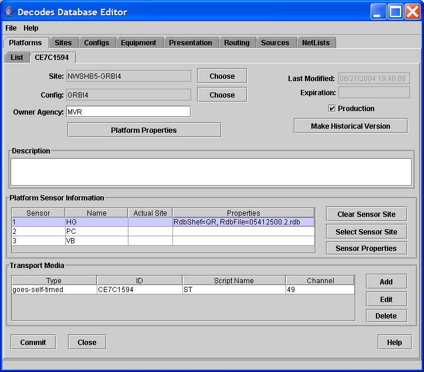

Figure 36: Group Computation that will Replace Individual Computations.

Run the Utility
~~~~~~~~~~~~~~~

Synopsis:

convert2group *[ options ]* Group-Comp-ID

Options:

   -T Test Mode. Produce a report of actions to be taken but make no
   database changes.

   -S *filename* Filename to save disposed computations in. Default is
   “disposed-comps.xml”

   -R *filename* Filename of the report of actions (to be) taken.
   Default is “convert2group-report.txt”.

   -X delete The default action is to disable computations when they
   have been replaced by a group. You can use this option to tell the
   utility to attempt to delete the computation from the database. This
   will only be successful if there are no data in HDB for these
   computations. (HDB records the source of every piece of data. It will
   not let you delete a computation if data exists from it).

The ‘Group-Comp-ID’ is the numeric ID of the new group computation. In
our example above it is 169. So to run the utility in test mode, type:

convert2group –T 169

Now examine the report that it produces. Since we did not supply a
filename, this is found in “convert2group-report.txt”.

The report will tell us which computations would be affected by the
utility, but since we included –T in the command, no actions were
actually taken.

If all is well, type the command line again, but without the –T
argument.

Following this, reopen compedit. Verify that the individual computations
were disabled and the new group-based computation has been enabled.

How the Matching is Done
~~~~~~~~~~~~~~~~~~~~~~~~

The Utility expands the group and applies it to the computation input
parameters. Then, for each result, it looks for an individual
computation with matching input parameters, output parameters, and
property settings. If it finds one, the individual computation is a
candidate for disposal.

Now consider a special case:

-  We have 100 locations with instantaneous stage values.

-  We have 100 individual rating computations.

-  99 of them are identical, but one uses different property settings.

-  I make a group that specifies instantaneous stage (65) and apply it
   to a new rating computation.

The utility will find matches for 99 and dispose of 99 individual
computations. However the one with different property values will remain
enabled. Furthermore the utility will create subgroups so that this
input is excluded from the group computation.

Execute Computations over Time Range from Command Line
------------------------------------------------------

**Synopsis:**

compexec *options* ...

Supported options:

-f *ControlFileName*

-  Allows you to use a control file to specify which computations,
   groups and/or time series to execute. See below.

-S *YYYY/MM/dd-HH:mm:ss*

-  Since time in UTC. If omitted, then all data back to the oldest
   records in the database are processed.

-U *YYYY/MM/dd-HH:mm:ss*

-  Until time in UTC. If omitted, then all data up to the most recent
   records in the database are processed.

-C *comp*

-  The *comp* argument can be either a numeric surrogate key comp-ID or
   the name of the computation. Both of these are visible in the
   computation editor on the list panel.

-  This option can appear multiple times for multiple computations.

-G *group*

-  *group* can be either the numeric (surrogate key) time series group
   ID or the group name. Both are visible in the group editor.

-  This option can appear multiple times for multiple groups.

-T *TSID*

-  *TSID* should be the String Time Series Identifier appropriate for
   this database.

-  This option can appear multiple times for multiple Time Series.

-o *OutputFormat*

-  *OutputFormat* should be the name of a valid DECODES output
   formatter.

-  Normally this utility will execute the computations and write the
   results to the time series database. Use this option if you want the
   results written to the standard output in the specified format,
   rather than the database. That is, when you use this option, no data
   will be written back to the database.

-R *PresentationGroup*

-  *PresentationGroup* should be the name of the DECODES Presentation
   Group to use.

-  This option only takes effect in conjunction with the –o OutputFormat
   option.

-Z *TimeZone*

-  *TimeZone* should be the String representation of a valid Java time
   zone.

-  This option only takes effect in conjunction with the –o OutputFormat
   option.

-q

-  This option means quiet mode. No prompts or statistics will be
   written to the standard output.

Think of specifying *-G group* as a shortcut to specifying a number of
TSIDs with multiple -T arguments. It does *not* mean to execute only
those computations that use the group. It means to evaluate the group
into a list of time series IDs and then execute any computation that
uses any of those TSIDs as an input.

The -C argument specifies which computations to execute. If a
computation is a group-based computation, it could have two meanings:

-  If you do NOT also specify time series, it will determine all
   possible inputs and execute the computation for each possible input
   set.

-  If you DO specify time series, this limits the possible inputs to the
   named time series.

Which computations, Time Series, and Groups to process are controlled by
either the –C, -G, and –T option or in a control file. If you opt to use
a control file, it must be an ASCII file in which each line specifies
one of the options:

# comment lines begin with ‘#’

tsid ABCDE.Stage.Inst.1Hour.0.Raw

tsid FGHIJ.Stage.Inst.1Hour.0.Raw

group *Numeric-Group-Id*

comp *Numeric-Comp-Id*

Examples:

compexec -G AllSpillwayStages -o Human-Readable -S 2016/05/01-12:30:00

Evaluate the group named “AllSpillwayStage” into a set of time series.
Then execute any computations that take any of those time series as
input. Only use inputs with a since time >= the specified time. Output
data to the screen in Human-Readable format.

Note: If you’re not sure what a command is about to do, a good idea is
to output it to the screen first and look at the results. If you’re
happy, then rerun the command without the -o argument.

compexec -G AllSpillwayStages -S 2016/05/01-12:30:00

Evaluate the group named “AllSpillwayStage” into a set of time series.
Then execute any computations that take any of those time series as
input. Ingest the results of the computations back into the database.

compexec -G 4 -S 2016/05/01-12:30:00

Evaluate the group with ID=4 into a set of time series. Then execute any
computations that take any of those time series as input. Ingest the
results of the computations back into the database.

compexec -G 4 -C 27 -C 35 -S 2016/05/01-12:30:00

Evaluate the group with ID=4 into a set of time series. Then execute any
computations with ID=27 and ID=35 over the time series in the group.
Ingest the results of the computations back into the database.

Features Specific to USBR HDB
=============================

The following features apply only to USBR HDB Database.

Model Run ID
------------

This section describes how Model Run ID is handled within computations.

When a computation is triggered by modeled data. The default model run
ID for any outputs will be the same as the input.

If the computation was triggered by real data and an output is modeled.
The model run ID can be controlled in the following ways:

-  The computation processor can be started with the –m argument as
   described in section 8.1. This becomes the default for all
   computations.

-  The algorithm record can contain a property with name
   “writeModelRunId”. This will override a default set with the –m
   argument.

-  The computation record can contain a property with name
   “writeModelRunId”. This will override any default set with –m
   argument and any property set in the algorithm record.

In a computation has both REAL and MODELED inputs, and it is triggered
by only REAL data, the input model run ID will be determined as follows:

-  If a property “inputModelRunId” is present, it will be used.

-  Otherwise find the most recent model run ID for the specified model
   ID.

HDB Specific Algorithms
-----------------------

A collection of algorithms were developed for HDB by a separate
contractor. These algorithms have come to do the bulk of the
computations for USBR. Most of these algorithms provide a thin bridge
between the CP infrastructure and the SQL database. The CP is used
mainly as a triggering mechanism, the actual computational work is done
in database resident procedures.

For OpenDCS 6.2, these legacy algorithms have been included in the
“opendcs.jar” release. They are found in the “decodes.algo.hdb” package.

BeginofPeriodAlg
~~~~~~~~~~~~~~~~

Subsamples a time series by taking the first recorded value within a
period.

Note: See the standard Subsample and Resample algorithms described
above, which provide more flexibility than this HDB-specific algorithm.

Time Series Parameters:

+------------+------------+-------------------------------------------+
| **Role     | **Type**   | **Description**                           |
| Name**     |            |                                           |
+============+============+===========================================+
| input      | input      | The input time series.                    |
+------------+------------+-------------------------------------------+
| output     | output     | The time series output. The Interval of   |
|            |            | the output parameter determines the       |
|            |            | aggregate period.                         |
+------------+------------+-------------------------------------------+

Properties:

+-----------------+--------+----------+-------------------------------+
| **Property      | **Java | **D      | **Description**               |
| Name**          | Type** | efault** |                               |
+=================+========+==========+===============================+
| re              | int    | 0        | See below. If the first input |
| q_window_period |        |          | value is not within the       |
|                 |        |          | specified number of periods,  |
|                 |        |          | then do NOT output the value. |
+-----------------+--------+----------+-------------------------------+
| desire          | int    | 0        | See below. If the first input |
| d_window_period |        |          | value is not within the       |
|                 |        |          | specified number of periods,  |
|                 |        |          | then flag the output with     |
|                 |        |          | validation flag ‘w’.          |
+-----------------+--------+----------+-------------------------------+
| validation_flag | String | <empty>  | Specify validation flags for  |
|                 |        |          | all output values.            |
+-----------------+--------+----------+-------------------------------+

The definition of the two ‘window period’ properties depends on the
interval of the output parameter:

-  If the output parameter is HOUR, then the parameter is a number of
   minutes.

-  If the output parameter is DAY, then the parameter is a number of
   hours.

-  If the output parameter is MONTH, then the parameter is a number of
   days.

-  If the output parameter is YEAR or WY, then the parameter is a
   multiple of 31 days.

In all cases, if the period is 0 (the default) then the check is not
done.

CallProcAlg
~~~~~~~~~~~

Takes up to 5 input values labeled input1 ... input5. Uses these to call
a procedure named in the callproc property.

Time Series Parameters:

+------------+------------+-------------------------------------------+
| **Role     | **Type**   | **Description**                           |
| Name**     |            |                                           |
+============+============+===========================================+
| input      | input      | The input time series parameters.         |
| 1...input5 |            |                                           |
+------------+------------+-------------------------------------------+
| output     | output     | This is a dummy output parameter and is   |
|            |            | never set by the algorithm. The procedure |
|            |            | specifed by the proccall property would   |
|            |            | have to set any outputs directly.         |
+------------+------------+-------------------------------------------+

Properties:

+-----------------+--------+----------+-------------------------------+
| **Property      | **Java | **D      | **Description**               |
| Name**          | Type** | efault** |                               |
+=================+========+==========+===============================+
| proccall        | String | (none)   | The complete procedure call   |
|                 |        |          | containing masks <<input1>>   |
|                 |        |          | ... <<input5>> masks          |
|                 |        |          | representing the input        |
|                 |        |          | parameters. You can also      |
|                 |        |          | include a mask <<tsbt>>       |
|                 |        |          | representing the time slice   |
|                 |        |          | base time.                    |
+-----------------+--------+----------+-------------------------------+

DynamicAggregatesAlg
~~~~~~~~~~~~~~~~~~~~

Note: See the ‘Stat’ algorithm described in section 5.25. Stat provides
a more efficient and portable way of performing many of the functions
described here.

This algorithm performs aggregation across HDB intervals. It can do any
Oracle-based aggregation that takes a single input time series. The
‘aggregate_name’ property specifies which function to call, which can be
any of the following:

-  min

-  max

-  avg

-  count

-  sum

-  median

-  stddev

-  variance

Time Series Parameters:

+------------+------------+-------------------------------------------+
| **Role     | **Type**   | **Description**                           |
| Name**     |            |                                           |
+============+============+===========================================+
| input      | input      | The input time series.                    |
+------------+------------+-------------------------------------------+
| output     | output     | The time series output. The Interval of   |
|            |            | the output parameter determines the       |
|            |            | aggregate period.                         |
+------------+------------+-------------------------------------------+

Properties:

+---------------+--------+----------+---------------------------------+
| **Property    | **Java | **D      | **Description**                 |
| Name**        | Type** | efault** |                                 |
+===============+========+==========+=================================+
| agregate_name | String | (none)   | The name of the Oracle          |
|               |        |          | aggregate function.             |
+---------------+--------+----------+---------------------------------+
| min_va        | int    | 1        | No output is produced if there  |
| lues_required |        |          | are fewer than this many inputs |
|               |        |          | in the aggregate period. See    |
|               |        |          | description below of min-value  |
|               |        |          | processing for months.          |
+---------------+--------+----------+---------------------------------+
| min_v         | int    | 0        | If fewer than this many inputs  |
| alues_desired |        |          | are present then the output is  |
|               |        |          | flagged as a “partial”          |
|               |        |          | calculation.                    |
+---------------+--------+----------+---------------------------------+
| partial       | b      | false    | If true, then partial           |
| _calculations | oolean |          | calculations are accepted, but  |
|               |        |          | are flagged at ‘T’ (Temporary)  |
+---------------+--------+----------+---------------------------------+

**Min-Value Processing for Months**

If min_values_required or min_values_desired is zero or negative and the
output interval is MONTH, then it means that the value is actually the
number of input intervals that is allowed to be missing. For example,
suppose input interval is DAY and output interval is MONTH, and we are
calculating the aggregate for June, which has 30 days. The following
table contains examples.

+----------------+---------------+---------------+--------+----------+
| **min_val      | **min_val     | **partial_c   | **#    | **r      |
| ues_required** | ues_desired** | alculations** | days   | esult?** |
|                |               |               | pre    |          |
|                |               |               | sent** |          |
+================+===============+===============+========+==========+
| -1             | 0             | false         | 29     | Yes      |
+----------------+---------------+---------------+--------+----------+
| -1             | 0             | false         | 28     | No       |
+----------------+---------------+---------------+--------+----------+
| -5             | -1            | true          | 28     | Yes –    |
|                |               |               |        | ‘T’      |
+----------------+---------------+---------------+--------+----------+
| -5             | -1            | false         | 28     | No       |
+----------------+---------------+---------------+--------+----------+

End Of Period Algorithm
~~~~~~~~~~~~~~~~~~~~~~~

Note: See the standard Subsample and Resample algorithms described
above, which provide more flexibility than this HDB-specific algorithm.

Output the last value seen within an aggregate period.

Time Series Parameters:

+------------+------------+-------------------------------------------+
| **Role     | **Type**   | **Description**                           |
| Name**     |            |                                           |
+============+============+===========================================+
| input      | input      | The input time series. for the aggregate  |
|            |            | period are aggregated by the specified    |
|            |            | Oracle function.                          |
+------------+------------+-------------------------------------------+
| output     | output     | The time series output.                   |
+------------+------------+-------------------------------------------+

Properties:

+-----------------+--------+----------+-------------------------------+
| **Property      | **Java | **D      | **Description**               |
| Name**          | Type** | efault** |                               |
+=================+========+==========+===============================+
| req_window      | i      | 0        | If >0, then this represents   |
| period          | nteger |          | the maximum number of input   |
|                 |        |          | intervals from the end of     |
|                 |        |          | period in which there must be |
|                 |        |          | a value. Example: input=hour, |
|                 |        |          | output=day,                   |
|                 |        |          | req_window_period=3. Then an  |
|                 |        |          | output is produced only if an |
|                 |        |          | input is present within the   |
|                 |        |          | last 3 hours of the day.      |
+-----------------+--------+----------+-------------------------------+
| desire          | i      | 0        | Like req_window_period, but   |
| d_window_period | nteger |          | an output can still be        |
|                 |        |          | produced, but it will be      |
|                 |        |          | flagged with the supplied     |
|                 |        |          | validation flag.              |
+-----------------+--------+----------+-------------------------------+
| validation_flag | String | (empty)  | If an output is produced, but |
|                 |        |          | it is outside of the desired  |
|                 |        |          | window period, it will be     |
|                 |        |          | flagged with this validation  |
|                 |        |          | flag.                         |
+-----------------+--------+----------+-------------------------------+

EOPInterpAlg (End Of Period Interpolating)
~~~~~~~~~~~~~~~~~~~~~~~~~~~~~~~~~~~~~~~~~~

Note: See the standard Resample algorithm above which provides more
flexibility for resampling and interpolating than the HDB-specific
algorithm described here.

This algorithm uses the same inputs, outputs, and properties as
described above for End Of Period Algorithm. The only difference is that
if the actual value at the end of the period is missing, it will be
interpolated.

EquationSolverAlg
~~~~~~~~~~~~~~~~~

Takes up to 5 input values labeled input1 ... input5. Uses these to
construct a SQL query as specified in the ‘equation’ property. The
output value will be set to the result of the equation.

Time Series Parameters:

+------------+------------+-------------------------------------------+
| **Role     | **Type**   | **Description**                           |
| Name**     |            |                                           |
+============+============+===========================================+
| input      | input      | The input time series parameters.         |
| 1...input5 |            |                                           |
+------------+------------+-------------------------------------------+
| output     | output     | Will be set to the result of the          |
|            |            | equation.                                 |
+------------+------------+-------------------------------------------+

Properties:

+-----------------+--------+----------+-------------------------------+
| **Property      | **Java | **D      | **Description**               |
| Name**          | Type** | efault** |                               |
+=================+========+==========+===============================+
| equation        | String | (none)   | The complete procedure call   |
|                 |        |          | containing masks <<input1>>   |
|                 |        |          | ... <<input5>> masks          |
|                 |        |          | representing the input        |
|                 |        |          | parameters. You can also      |
|                 |        |          | include a mask <<tsbt>>       |
|                 |        |          | representing the time slice   |
|                 |        |          | base time. As of 6.7 RC02,    |
|                 |        |          | the following substitutions   |
|                 |        |          | are also made:                |
|                 |        |          | <<loading_application_id>>,   |
|                 |        |          | <<computation_id>>,           |
|                 |        |          | <<algorithm_id>>              |
+-----------------+--------+----------+-------------------------------+
| validation_flag | String | (none)   | If specified, the validation  |
|                 |        |          | flag is set to the first      |
|                 |        |          | character of the supplied     |
|                 |        |          | string.                       |
+-----------------+--------+----------+-------------------------------+

FlowToVolumeAlg
~~~~~~~~~~~~~~~

This algorithm calculates volume by aggregating interval flows over
time. The output interval determines the time.

Time Series Parameters:

+------------+------------+-------------------------------------------+
| **Role     | **Type**   | **Description**                           |
| Name**     |            |                                           |
+============+============+===========================================+
| input      | input      | The input flow                            |
+------------+------------+-------------------------------------------+
| output     | output     | The output volue.                         |
+------------+------------+-------------------------------------------+

Properties:

+-----------------+--------+----------+-------------------------------+
| **Property      | **Java | **D      | **Description**               |
| Name**          | Type** | efault** |                               |
+=================+========+==========+===============================+
| parti           | b      | false    | Set to true to allow output   |
| al_calculations | oolean |          | when only part of the period  |
|                 |        |          | is known.                     |
+-----------------+--------+----------+-------------------------------+
| observati       | b      | false    |                               |
| ons_calculation | oolean |          |                               |
+-----------------+--------+----------+-------------------------------+
| min\_           | i      | 1        | Number of input values        |
| values_required | nteger |          | required before output can be |
|                 |        |          | made. Zero means all.         |
+-----------------+--------+----------+-------------------------------+
| min             | i      | 0        | If specified number of inputs |
| _values_desired | nteger |          | is not present, then ‘w’      |
|                 |        |          | validation flag will be set.  |
+-----------------+--------+----------+-------------------------------+
| flow_factor     | String | 864      | Use as a multiplier for       |
|                 |        | 00/43560 | flow-to-volume calculation.   |
+-----------------+--------+----------+-------------------------------+
| validation_flag | String | (none)   | If specified, the validation  |
|                 |        |          | flag is set to the first      |
|                 |        |          | character of the supplied     |
|                 |        |          | string.                       |
+-----------------+--------+----------+-------------------------------+

The bulk of the work for computing aggregates is done by SQL functions
in the hdb_utilities package. The following query is used:

select hdb_utilities.get_sdi_unit_factor(**inputSDI**) \*

hdb_utilities.get_sdi_unit_factor(**outputSDI**) \* **flow_factor** \*

**day_multiplier** \* **average_flow** volume ,

hdb_utilities.date_in_window('**outputInterval**',

to_date('**\_aggregatePeriodBegin'**,'dd-MM-yyyy HH24:MI'))

is_current_period from dual;

HdbACAPSRating
~~~~~~~~~~~~~~

**Type:** Time-Slice

Implements the ACAPS rating algorithm from tables in the database.
Independent value is “elevation”. Dependent values are “storage” and
“area”.

**Parameters:**

+-----------+--------+-------------------------------------------------+
| **Name**  | **Type | **Description**                                 |
|           | Code** |                                                 |
+-----------+--------+-------------------------------------------------+
| elevation | input  | Reservoir elevation in ft.                      |
+-----------+--------+-------------------------------------------------+
| storage   | output | Storage in cubic feet                           |
+-----------+--------+-------------------------------------------------+
| area      | output | Area in acre-feet                               |
+-----------+--------+-------------------------------------------------+

HdbEvaporation
~~~~~~~~~~~~~~

**Type:** Time-Slice

This algorithm uses an input area time series to compute evaporation
from a coefficient that is dependent on the area. The coefficient can be
provided as a second time series input, or, if it is not provided or not
present at this time slice, a lookup value will be used from one of the
stat tables in HDB. Ideally, a coefficient time series should be
provided that incorporates temperature and relative humidity.

The state table is:

-  R\_\ *interval*\ STAT for real values, where *interval* is the
   interval of the area time series.

-  M\_\ *interval*\ STAT for modeled values

**Parameters:**

+-----------+--------+-------------------------------------------------+
| **Name**  | **Type | **Description**                                 |
|           | Code** |                                                 |
+-----------+--------+-------------------------------------------------+
| area      | input  | Area or average area over period in acre-feet.  |
+-----------+--------+-------------------------------------------------+
| evapCoeff | input  | Coefficient Time Series in ft/day               |
+-----------+--------+-------------------------------------------------+
| evap      | output | Evaporation in acre-feet                        |
+-----------+--------+-------------------------------------------------+

**Properties:**

+---------------+-----+---------+-------------------------------------+
| **Name**      | **J | **De    | **Description**                     |
|               | ava | fault** |                                     |
|               | Typ |         |                                     |
|               | e** |         |                                     |
+---------------+-----+---------+-------------------------------------+
| ign           | B   | false   | If set to true, then ignore the     |
| oreTimeSeries | ool |         | evapCoeff time series, even if it   |
|               | ean |         | is provided. Always look up the     |
|               |     |         | evaporation coefficient from the    |
|               |     |         | HDB stat table.                     |
+---------------+-----+---------+-------------------------------------+

HdbRating Algorithm
~~~~~~~~~~~~~~~~~~~

**Type:** Time-Slice

**Important:** If you have upgraded from a previous version of CP, you
may have the wrong Algorithm record. Open compedit, click the Algorithms
Tab, Open the HdbShiftRating algorithm. Make sure the executable class
is (exactly) as follows:

decodes.tsdb.algo.HdbShiftRating

**Parameters:**

+-----------+------------+-------------+------------------------------+
| **Name**  | **Java     | **Type      | **Description**              |
|           | Type**     | Code**      |                              |
+-----------+------------+-------------+------------------------------+
| indep     | double     | i (simple   | The independent value to be  |
|           |            | input)      | rated.                       |
+-----------+------------+-------------+------------------------------+
| dep       | double     | output      | The rated (e.g. flow) value. |
+-----------+------------+-------------+------------------------------+

**Properties:**

+----------------+------+---------+----------------------------------+
| **Name**       | **   | **De    | **Description**                  |
|                | Java | fault** |                                  |
|                | Ty   |         |                                  |
|                | pe** |         |                                  |
+----------------+------+---------+----------------------------------+
| ex             | Boo  | false   | Set to true to allow rating to   |
| ceedLowerBound | lean |         | extend the rating below the      |
|                |      |         | lowest value of the table. May   |
|                |      |         | be invalid for certain rating    |
|                |      |         | types.                           |
+----------------+------+---------+----------------------------------+
| ex             | Boo  | false   | Set to true to allow rating to   |
| ceedUpperBound | lean |         | extend the rating above the      |
|                |      |         | highest value of the table. May  |
|                |      |         | be invalid for certain rating    |
|                |      |         | types.                           |
+----------------+------+---------+----------------------------------+
| ratingType     | St   | Shift   | This property provides the       |
|                | ring | A       | HDB_TABLE type for the actual    |
|                |      | djusted | rating table, which indirectly   |
|                |      | Stage   | determines the lookup algorithm. |
|                |      | Flow    |                                  |
+----------------+------+---------+----------------------------------+
| applyShifts    | Boo  | false   | If true, add the ‘shift’         |
|                | lean |         | property value before table      |
|                |      |         | lookup.                          |
+----------------+------+---------+----------------------------------+
| shift          | do   | 0       | Constant shift value added to    |
|                | uble |         | indep before look, but only if   |
|                |      |         | applyShifts == true.             |
+----------------+------+---------+----------------------------------+

**Description:**

The output (dep) value is:

dep = ratingTable.lookup(indep) # if applyShifts == false

or

dep = ratingTable.lookup( indep + shift ) # if applyShifts == true

HdbShiftRating Algorithm
~~~~~~~~~~~~~~~~~~~~~~~~

**Type:** Time-Slice

**Important:** If you have upgraded from a previous version of CP, you
may have the wrong Algorithm record. Open compedit, click the Algorithms
Tab, Open the HdbShiftRating algorithm. Make sure the executable class
is (exactly) as follows:

decodes.hdb.algo.HdbShiftRating

**Parameters:**

+-----------+------------+-------------+------------------------------+
| **Name**  | **Java     | **Type      | **Description**              |
|           | Type**     | Code**      |                              |
+-----------+------------+-------------+------------------------------+
| indep     | double     | i (simple   | The independent value to be  |
|           |            | input)      | rated.                       |
+-----------+------------+-------------+------------------------------+
| dep       | double     | output      | The rated (e.g. flow) value. |
+-----------+------------+-------------+------------------------------+
| shift     | double     | output      | The shift used at this       |
|           |            |             | timeslice.                   |
+-----------+------------+-------------+------------------------------+

**Properties:**

+----------------+--------+--------+------------------------------------+
| **Name**       | **Java | **Def  | **Description**                    |
|                | Type** | ault** |                                    |
|                |        |        |                                    |
|                |        |        |                                    |
+----------------+--------+--------+------------------------------------+
| variableShift  | Boolean| false  | False means to use a constant      |
|                |        |        | shift value provided by the        |
|                |        |        | “singleShift” property. True means |
|                |        |        | to use a separate lookup table for |
|                |        |        | shifts.                            |
+----------------+--------+--------+------------------------------------+
| singleShift    | double | 0      | If variableShift == false, which   |
|                |        |        | is the default, then this property |
|                |        |        | provides the single shift value to |
|                |        |        | be used for all time slices.       |
+----------------+--------+--------+------------------------------------+
| shiftTableType | String | Stage  | if variableShift is set to True,   |
|                |        | Shift  | then a separate table is used to   |
|                |        |        | lookup a shift value at each time  |
|                |        |        | slice. This property provides the  |
|                |        |        | HDB_TABLE type.                    |
+----------------+--------+--------+------------------------------------+
| l              | String | Stage  | This property is new in OpenDCS    |
| ookupTableType |        | Flow   | 6.3. In previous releases it was   |
|                |        |        | hard-coded to “Stage Flow”. This   |
|                |        |        | property provides the HDB_TABLE    |
|                |        |        | type for the actual rating table.  |
+----------------+--------+--------+------------------------------------+

**Description:**

At each time slice, a shift is determined. If variableShift==false, the
shift is constant. Else the shift is looked up by applying the indep
stage value to a separate Shift table. The shift value is available as
an output. The output (dep) value is:

dep = ratingTable.lookup( indep + shift )

InflowAdvancedAlg
~~~~~~~~~~~~~~~~~

**Type:** Time-Slice

The output is simply the sum of all of the non-missing input values. A
preferred method of doing this would be to use the standard ScalarAdder
algorithm.

This algorithm is an Advanced mass balance calculation for *inflow* as:

Delta Storage + Total Release + Delta Bank Storage + evaporation

-  all incoming diversions + all outgoing diversions

If any of the input properties are set to "fail" then the *inflow* will
not be calculated and/or the *inflow* will be deleted. If all of the
inputs do not exist because of a delete the *inflow* will be deleted if
the output exists regardless of the property settings.

Class Name: decodes.hdb.algo.InflowAdvancedAlg

**Parameters:**

+---------------+------------+----------------------------------------+
| **Name**      | **Type     | **Description**                        |
|               | Code**     |                                        |
+---------------+------------+----------------------------------------+
| total_release | input      |                                        |
+---------------+------------+----------------------------------------+
| delta storage | input      |                                        |
+---------------+------------+----------------------------------------+
| inflow        | output     |                                        |
+---------------+------------+----------------------------------------+

InflowBasicAlg
~~~~~~~~~~~~~~

**Type:** Time-Slice

The output is simply the sum of all of the non-missing input values. A
preferred method of doing this would be to use the standard ScalarAdder
algorithm.

This algorithm is an Advanced mass balance calculation for *inflow* as:

Delta Storage + Total Release + Delta Bank Storage + evaporation

-  all incoming diversions + all outgoing diversions

-  (up to 5 diversions of each type)

If any of the input properties are set to "fail" then the *inflow* will
not be calculated and/or the *inflow* will be deleted. If all of the
inputs do not exist because of a delete the *inflow* will be deleted if
the output exists regardless of the property settings.

Class Name: decodes.hdb.algo.InflowAdvancedAlg

**Parameters:**

+---------------+------------+----------------------------------------+
| **Name**      | **Type     | **Description**                        |
|               | Code**     |                                        |
+---------------+------------+----------------------------------------+
| total_release | input      |                                        |
+---------------+------------+----------------------------------------+
| delta storage | input      |                                        |
+---------------+------------+----------------------------------------+
| delta_bs      | input      | bank storage                           |
+---------------+------------+----------------------------------------+
| evap          | input      |                                        |
+---------------+------------+----------------------------------------+
| diver_in1 ... | input      | Up to 5 diversion inputs. Unused ones  |
| 5             |            | should be set to MISSING=Ignore in the |
|               |            | Computation Parameter Dialog           |
+---------------+------------+----------------------------------------+
| diver_out1    | input      | Likewise                               |
| ... 5         |            |                                        |
+---------------+------------+----------------------------------------+
| inflow        | output     |                                        |
+---------------+------------+----------------------------------------+

PowerToEnergyAlg
~~~~~~~~~~~~~~~~

PowerToEnergyALg - calculates Energy base on power readings converted to
hourly *Megawatt* rates.

Input Time Series:

-  input

Output Time Series:

-  output

Properties:

-  partial_calculations: boolean: default false: if current period
   partial calculations will be performed

-  min_values_required: number: default 1: the minimum number of
   observations required to perform computation

-  min_values_desired: number: default 0: the minimum number of
   observations desired to perform computation

-  validation_flag: string: default empty: the validation flag value to
   be sent to the database

This algorithm uses the hdb_utilities.get_sdi_unit_factor SQL function.

SideInflowAlg
~~~~~~~~~~~~~

This algorithm is an Side Inflow mass balance calculation for inflow as:
Delta Storage - Total Release Above + Total Release Below + evaporation.

If inputs Delta Storage, or Total Release Above, or Total Release Below,
or if the Evap do not exist, or have been deleted, and if the
Delta_STORAGE_MISSING, or the TOTAL_REL_ABOVE_MISSING, or EVAP_MISSING,
or TOTAL_REL_BELOW_MISSING properties are set to "fail" then the inflow
will not be calculated and/or the inflow will be deleted. If all of the
inputs do not exist because of a delete the inflow will be deleted if
the output exists regardless of the property settings.

This algorithm written by M. Bogner, August 2008 Modified by M. Bogner
May 2009 to add additional delete logic and version control

Input Time Series:

-  delta_storage

-  evap

-  total_rel_above

-  total_rel_below

Output Time Series:

-  side_inflow

VolumeToFlowAlg
~~~~~~~~~~~~~~~

VolumeToFlowAlg calculates average flows based on the sum of the inputs
volumes for the given period:

-  Flow (*cfs*) = sum of volumes \* 43560 *sq* *ft* per acre / # of days
   / 86400 seconds

This algorithm assumes units are in *cfs* and acre-feet; if not a
conversion is done to output the correct units

Properties:

-  partial_calculations: boolean: default false: if current period
   partial calculations will be performed

-  min_values_required: number: default 1: the minimum number of
   observations required to perform computation

-  min_values_desired: number: default 0: the minimum number of
   observations desired to perform computation

-  validation_flag: string: default empty: the validation flag value to
   be sent to the database

-  flow_factor: Number: use as multiplier for volume to flow factor
   (.5,.5041) : Default: 43560/86400

Input Time Series:

-  input

Output Time Series:

-  output

HDB Site Specific Algorithms
----------------------------

In addition to the above algorithms, there are several site specific HDB
algorithms:

-  BMDCUnreg – Blue Mesa Unregulated Inflow

-  CRRCUnreg – Crystal Unregulated Inflow

-  EstGLDAInflow – computes Lake Powell inflow from the three upstream
   gages

-  FLGUUnreg – Flaming Gorge Unregulated Inflow

-  GLDAEvap – Lake Powell Evaporation

-  GLDAUnreg – Lake Powell Unregulated Inflow

-  GlenDeltaBSMBaAlg – Glen Canyon Bank Storage Mass Balance

-  ParshallFlume – Stage to Flow computation for Parshall Flume

Features Specific to CWMS
=========================

Rating Tables within the CWMS Database
--------------------------------------

The following utilities are included for working with Rating objects
inside the CWMS database:

listRatings List all of the rating objects in the database.

importRating Import a rating from an XML file.

exportRating Export a rating to an XML file.

editRatings A GUI for listing, viewing, importing, and exporting
ratings.

In each case, type the command with a –x argument to have it list
available options.

Virtual Gage Algorithm
----------------------

**Type:** Time-Slice

**Input Parameters:**

+-----------------------------+------------------+---------------------+
| **Name**                    | **Java Type**    | **Type Code**       |
+-----------------------------+------------------+---------------------+
| upstreamGage                | double           | i                   |
+-----------------------------+------------------+---------------------+
| downstreamGage              | double           | i                   |
+-----------------------------+------------------+---------------------+

**Output Parameter:**

virtualGage : double precision

**Properties:**

+------------------------------+--------------+------------------------+
| **Name**                     | **Java       | **Default**            |
|                              | Type**       |                        |
+------------------------------+--------------+------------------------+
| upstreamPosition             | double       | 0.0                    |
+------------------------------+--------------+------------------------+
| downstreamPosition           | double       | 10.0                   |
+------------------------------+--------------+------------------------+
| virtualPosition              | double       | 5.0                    |
+------------------------------+--------------+------------------------+
| upstreamGageZero             | double       | 0.0                    |
+------------------------------+--------------+------------------------+
| downstreamGageZero           | double       | 0.0                    |
+------------------------------+--------------+------------------------+
| virtualGageZero              | double       | 0.0                    |
+------------------------------+--------------+------------------------+

**Description:**

Compute a virtual elevation at an intermediate point between two other
*gages*.

Inputs are the upstream and downstream elevation,

Properties specify Upstream position (e.g. Mile number), Downstream
position, and Virtual Gage position.

The positions are required to do proper interpolation. Default values
place the virtual gage halfway between up & downstream gages.

If provided, you may set gage-zero properties for each of the locations,
thus the output can be in gage height or elevation.

Validation with DATCHK Files
----------------------------

**Algorithm Name:** DatchkScreening

**Type:** Time-Slice

**Input Parameters:**

+-----------------------------+------------------+---------------------+
| **Name**                    | **Java Type**    | **Type Code**       |
+-----------------------------+------------------+---------------------+
| input                       | double           | i                   |
+-----------------------------+------------------+---------------------+

**Output Parameter:**

output : double precision (optional – see below)

**Properties:**

+--------------+-------+--------+-------------------------------------+
| **Name**     |       | **Def  | **Meaning**                         |
|              | **Java| ault** |                                     |
|              | T     |        |                                     |
|              | ype** |        |                                     |
+--------------+-------+--------+-------------------------------------+
| noOverwrite  | Bo    | False  | If set to true, then don’t          |
|              | olean |        | overwrite output values that        |
|              |       |        | already exist at a given time. Can  |
|              |       |        | only be used if the input and       |
|              |       |        | output refer to different time      |
|              |       |        | series.                             |
+--------------+-------+--------+-------------------------------------+
| s            | Bo    | False  | If set to true, then set the flag   |
| etInputFlags | olean |        | bits on the input parameter in      |
|              |       |        | addition to the output parameter.   |
|              |       |        | Can only be used if the input and   |
|              |       |        | output refer to different time      |
|              |       |        | series.                             |
+--------------+-------+--------+-------------------------------------+
| setR         | Bo    | False  | If set to true, then if the         |
| ejectMissing | olean |        | validation results in the value     |
|              |       |        | being rejected, then write a dummy  |
|              |       |        | output value with flags indicating  |
|              |       |        | that it is MISSING. Can only be     |
|              |       |        | used if the input and output refer  |
|              |       |        | to different time series.           |
+--------------+-------+--------+-------------------------------------+
| noOu         | Bo    | False  | If set to true and the output time  |
| tputOnReject | olean |        | series is different from the input, |
|              |       |        | then when a value is flagged as     |
|              |       |        | REJECTED as the result of           |
|              |       |        | validation, do not write any value  |
|              |       |        | to the output.                      |
+--------------+-------+--------+-------------------------------------+

**Description:**

This algorithm performs validation and sets flag values in the output
(and optionally, the input) parameter. The validation information is
stored in files for the legacy DATCHK utility that worked with DSS.

The CCP DATCHK implementation can do the following types of checks:

-  Absolute Magnitude – Compare input value with constant min/max
   values.

-  Duration Magnitude – Accumulate value over defined period and then
   check it against constant min/max. Typically used for incremental
   precip.

-  Constant Value – Check to see if a value has remained constant
   (within a given tolerance) over a specified time period.

-  Rate of Change (per Hour) – Check min/max rate of change per hour.

For a complete description of the checks see the legacy DATCHK manual,
typically called CPD-65.pdf, available for download at a number of USACE
sites.

The DATCHK Validation algorithm will set flag bits on the input
parameter directly. You can optionally have it copy the value to another
time series, along with the resulting flag bits, by setting an output
parameter in the computation. If the output parameter is left undefined,
then only the input flags are set.

Results of Validation
~~~~~~~~~~~~~~~~~~~~~

Validation results can be stored on every time series value in your CWMS
database. Currently a 32-bit integer is used to store all results in a
compact form. Figure 37 shows the bit layout.

The CWMS user should not need to care about the internal representation
of flag bits. This section is included for completeness and technical
reference only.

**       3                   2                   1                    
     2 1 0 9 8 7 6 5 4 3 2 1 0 9 8 7 6 5 4 3 2 1 0 9 8 7 6 5 4 3 2 1**

**     P - - - - - T T - T - T T T T T T M M M M C C C D R R V V V V S
     \|           <---------+---------> <--+--> <-+-> \| <+> <--+--> \|
     \|                     \|              \|      \|   \|  \|    
\|    +------Screened T/F
     \|                     \|              \|      \|   \|  \|    
+-----------Validity Mutually-Exclusive Flags
     \|                     \|              \|      \|   \| 
+--------------Value Range Integer
     \|                     \|              \|      \|  
+-------------------Different T/F
     \|                     \|              \|     
+---------------Replacement Cause Integer
     \|                     \|             
+---------------------Replacement Method Integer
     \|                    
+-------------------------------------------Test Failed
Mutually-Exclusive Flags
    
+-------------------------------------------------------------------Protected
T/F**

Figure 37: CWMS Time Series Value Quality Flags.

After a value is screened by the validation algorithm, the ‘S’ (low
order) bit will be set.

The four bits labeled “VVVV” can take on the following values:

-  0 = Unknown validity

-  1 = Validity OK (all screening tests passed)

-  2 = Missing

-  4 = Questionable

-  8 = Rejected

If the Protected (high order) bit is set in the output value, it will
not be modified in any way by the validation algorithm.

The several bits labeled ‘T’ indicate which test failed, e.g.
ABSOLUTE_MAGNITUDE, RATE_OF_CHANGE, etc.

DATCHK Configuration Files
~~~~~~~~~~~~~~~~~~~~~~~~~~

**Top Config File**

The CCP Algorithm reads a top-level configuration file telling where to
find the DATCHK files and other mapping files. By default, this
top-level configuration file is called “datchk.cfg” and is stored in
your $DECODES_INSTALL_DIR. You can modify the location by setting the
“datchkConfigFile” property in the toolkit setup menu (or the
“decodes.properties” file).

The top config file is a simple XML file. An example is shown below.

<DatchkConfig>

<!-- The pathmap file maps DSS paths to CWMS paths -->

<pathmap>./pathmap.txt</pathmap>

<!-- One or more datchk files go here -->

<datchk>./TESTSITE2.datchk</datchk>

</DatchkConfig>

**Pathmap File**

The pathmap file maps DSS Path Names to CWMS Time Series IDs. It also
supplies the engineering units that are used in the DATCHK criteria
definitions.

The pathmap file contains lines in the following format:

*CwmsTimeSeriesID*\ =\ *DSS-PATH;*\ Units=\ *unit-abbr;...other
assignments*

where...

-  *CmwsTimeSeriesId* is a valid CWMS Time Series ID. This is the time
   series to be validated.

-  *DSS-PATH* is the DSS Path name used in the DATCHK files for this
   time series

-  *unit-abbr* is a valid CCP Engineering Unit abbreviation. This
   specifies the units used in DATCHK file criteria definition.

-  Other assignments are possible on this line for legacy reasons. They
   are ignored.

Examples:

TESTSITE1.Flow.Inst.0.0.test=/TEST/TESTSITE1/FLOW//1HOUR/OBS;Units=cfs

TESTSITE1.Precip.Inst.0.0.test=/TEST/TESTSITE1/PRECIP///OBS;Units=in

**DATCHK Criteria Files**

The format for DATCHK Criteria Files is defined in *DATCHK & DATVUE Data
Screening Software User’s Manual, February 1995*. It is distributed as
CPD-65.pdf from HEC.

Several DATCHK Criteria files may be specified in the Top Config File.
The definitions are loaded and combined.

At the time of this writing the only CRITERIA types that are supported
are:

-  ABS – Absolute Magnitude

-  DUR – Duration Magnitude

-  CONST – Constant Value Checks

-  RATE – Hourly Rate of Change Checks

As of OpenDCS 6.1 RC08 we have extended the functionality of DUR and
CONST to support irregular time series (ABS could already support
irregular).

For CONST checks, one extension was needed to the syntax: The last
argument on the line is described in the HEC document as “nmiss”,
meaning the maximum number of contiguous missing values allowed in the
period being checked. It defaults to zero. If there are more than this
number of contiguous missing values in the period, the check is aborted.

For irregular time series there is no way to determine whether a value
was expected and therefore missing. Consequently, for irregular time
series, you may use any valid CWMS interval (e.g. 4Hours, 2Days) instead
of a number. This represents the maximum allowable amount of time
between values in the period.

Example:

CRITERIA CONST Q 2D 0.0 0.1 12Hours

This means to check for a constant value (within a tolerance of .1) over
the past 2 days, but if there is more than 12 hours between contiguous
values in the period, abort the check.

Rating Algorithm for a Single Independent Value
-----------------------------------------------

**Algorithm Name:** CwmsRatingSingleIndep

**Type:** Time-Slice

**Input Parameters:**

+-----------------------------+------------------+---------------------+
| **Name**                    | **Java Type**    | **Type Code**       |
+-----------------------------+------------------+---------------------+
| indep                       | double           | i                   |
+-----------------------------+------------------+---------------------+

**Output Parameter:**

dep : double precision

**Properties:**

+------------------------------+--------------+------------------------+
| **Name**                     | **Java       | **Default**            |
|                              | Type**       |                        |
+------------------------------+--------------+------------------------+
| specVersion                  | String       | “Production”           |
+------------------------------+--------------+------------------------+
| templateVersion              | String       | “USGS-EXSA”            |
+------------------------------+--------------+------------------------+
| useDepLocation               | Boolean      | false                  |
+------------------------------+--------------+------------------------+
| locationOverride             | String       | none                   |
+------------------------------+--------------+------------------------+

**Description:**

This algorithm performs a rating using rating tables stored within the
CWMS database.

A “Rating Specification” in CWMS is specific to a location and
parameters at that location. For a rating with a single independent
parameter, a Rating Specification ID is a string of the form:

*LocationID . IndepParam* ; *DepParam* . *TemplateVersion . SpecVersion*

For example, a Stage/Flow rating at site BMD might be:

BMD.Stage;Flow.USGS-EXSA.Production

CP builds the specification ID from the information provided:

-  Location is normally taken from the independent time series used as
   input. If the ‘useDepLocation’ property is set to true, the location
   from the output ‘dep’ param will be used.

   -  If locationOverride property is supplied, then it is used to
      determine the location. This supports wildcards in a similar
      manner to the location portion of a time series parameter TSID.

-  Indep and Dep Param values come from the input and output time series
   provided

-  TemplateVersion and SpecVersion are provided as properties, which can
   be specified either in the algorithm or computation records.

Rating Algorithm for Multiple Independent Values
------------------------------------------------

**Algorithm Name:** CwmsRatingMultiIndep

**Type:** Time-Slice

**Input Parameters:**

+--------------------+-------------+--------------+--------------------+
| **Name**           | **Java      | **Type       | **MISSING action** |
|                    | Type**      | Code**       |                    |
+--------------------+-------------+--------------+--------------------+
| indep1             | double      | i            | Fail               |
+--------------------+-------------+--------------+--------------------+
| indep2             | double      | i            | Ignore             |
+--------------------+-------------+--------------+--------------------+
| indep3             | double      | i            | Ignore             |
+--------------------+-------------+--------------+--------------------+
| indep4             | double      | i            | Ignore             |
+--------------------+-------------+--------------+--------------------+
| indep5             | double      | i            | Ignore             |
+--------------------+-------------+--------------+--------------------+
| indep6             | double      | i            | Ignore             |
+--------------------+-------------+--------------+--------------------+
| indep7             | double      | i            | Ignore             |
+--------------------+-------------+--------------+--------------------+
| indep8             | double      | i            | Ignore             |
+--------------------+-------------+--------------+--------------------+
| indep9             | double      | i            | Ignore             |
+--------------------+-------------+--------------+--------------------+

**Output Parameter:**

dep : double precision

**Properties:**

+-------------+--------+----------------------------------------------+
| **Name**    | **Java | **Default**                                  |
|             | Type** |                                              |
+-------------+--------+----------------------------------------------+
| specVersion | String | “Production”                                 |
+-------------+--------+----------------------------------------------+
| temp        | String | “USGS-EXSA”                                  |
| lateVersion |        |                                              |
+-------------+--------+----------------------------------------------+
| use         | B      | false                                        |
| DepLocation | oolean |                                              |
+-------------+--------+----------------------------------------------+
| locat       | String | Use this to directly specify the location    |
| ionOverride |        | for the rating spec, or to apply a wildcard  |
|             |        | (*) mask to either the indep1 or dep (if     |
|             |        | UseDepLocation is set) location              |
+-------------+--------+----------------------------------------------+

**Description:**

This algorithm performs a rating using rating tables stored within the
CWMS database. It can handle up to 9 independent time series inputs.

See the discussion above in the previous section (Single Independent)
about constructing a Rating Specification ID. The only difference here
is that there can be multiple *DepParam* strings, separated by
semicolons. For example a rating with 3 dependent variables with
parameters Elev, Gate1, and Gate2 might be:

BMD.Elev;Gate1;Gate2.NAE-Derived.Production

The location for the specification is normally taken from the first
independent parameter (which is required). If the ‘useDepLocation’
property is set to true, then the location will be taken from the output
dep parameter.

As of 6.3 RC05 the locationOverride property may be used to modify the
location (either indep1 or dep, if useDepLocation is true). If it
contains wildcard (*) characters, the mask is applied in the same manner
that the location part of a time series parameter is applied for a group
computation.

The algorithm allows up to 9 independent parameters, but most ratings
only take a small number. You should delete any “indepN” parameters you
don’t need from the computation record. For example, Figure 38 shows the
computation editor screen for a rating with three independent
parameters. Note that “indep4” through “indep9” have been deleted.

Figure 38: Computation Editor showing Rating with Three Independent
Parameters.

Figure 39: Param List for a Computation with Three Independent
Parameters.

Make sure you change the Missing-Action for the defined parameters to
something other than “Ignore”:

-  FAIL: Do not produce an output (dep) if this independent parameter is
   missing at this time.

-  PREV: Use the previous value for this independent parameter if it is
   missing at this time.

-  NEXT: Use the next value for this independent parameter if it is
   missing at this time.

-  INTERP: Interpolate between previous and next if if this independent
   parameter is missing at this time.

-  CLOSEST: Use the closest value (in time) for this independent
   parameter if it is missing at this time.

Figure 40 shows the dialog for the indep3 parameter (Elev). We have
chosen FAIL.

.. image:: ./media/image53.png
   :alt: Macintosh HD:Users:mmaloney:Desktop:Screen Shot 2012-11-20 at 11.20.08 AM.png
   :width: 3in
   :height: 3.88271in

Figure 40: Computation Parameter Dialog, Showing the 'FAIL' setting for
Independent Parameter 3.

If you are using CWMS Parameter values for the first time, you may
encounter a popup telling you to enter the new parameters into the
DECODES database editor, presentation tab. For example, when we first
entered the computation for a multi-variable rating using conduit gates
we had to add these parameters. We entered them into our “CWMS-English”
Presentation group, as shown in Figure 41. Be sure to also enter the
appropriate units for the new parameters.

.. image:: ./media/image54.png
   :alt: Macintosh HD:Users:mmaloney:Desktop:Screen Shot 2012-11-20 at 11.08.28 AM.png
   :width: 6.49444in
   :height: 4.12639in

Figure 41: Entering new Parameter Values into the CWMS-English
Presentation Group.

CWMS Parameters and DECODES Data Types
--------------------------------------

DECODES allows data types from many different standard systems such as
SHEF, USGS, CWMS, and HDB. DECODES stores data types in a table that
includes columns Standard, Code.

CWMS ‘Parameters’ are mapped to DECODES data types with the standard
‘CWMS’.

There are places in the DECODES and CCP GUIs where a list of data types
(a.k.a. Parameter) values are presented for the user to select from. We
have prepared a utility you can run at any time to copy all CWMS
Parameter values so that they are visible to DECODES and CP. Run this
utility with the following command:

decj decodes.cwms.CwmsParam2DataType

It may be necessary to re-run this utility from time to time as your
CWMS database is populated with Parameter values outside of the CCP.

Validation from CWMS Screening Database
---------------------------------------

As of OpenDCS 6.2 RC13 the CP can do validations from screening records
stored in the CWMS Database. This section will:

-  Explain the CWMS screening records,

-  Describe tools for importing, exporting, and editing the records,

-  Describe the Cwms Screening Algorithm

CWMS Screening Database Records
~~~~~~~~~~~~~~~~~~~~~~~~~~~~~~~

The CWMS CMA web utility provides the capability for you to create,
view, edit, and delete screening records. This section will provide a
brief overview of the information therein. The logical arrangement of
screening records is depicted in Figure 42.

-  Each time series may be assigned to a single screening. *Note that
   CWMS CMA also assigns a resulting TSID. This is not supported by CCP
   because output parameters are specified by the CCP infrastructure
   already.*

-  Each screening has a unique 16 character ID (name)

-  Each screening may have multiple seasons. A season is denoted by the
   start month and day. A season starts at midnight on the specified day
   in the time zone associated with the time series location.

-  Each criteria record (season) may have multiple Duration/Magnitude
   checks, each denoted by a different duration.

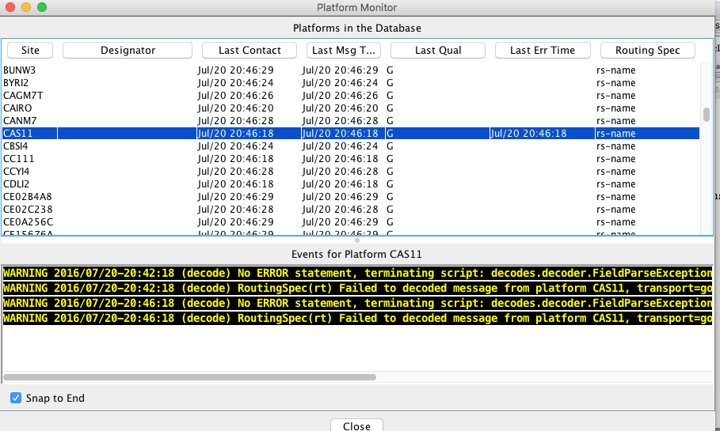

Figure 42: Logical Arrangement of CWMS Screening Records.

The criteria records contain limits that are used for screening the time
series values. These are modeled on the screening operations available
in DATCHK. As a result of screening, the quality bits associated with
each time series value will be set to Good, Questionable, or Rejected.

The checks include:

-  Absolute Range Check: Low/High limits are set for Questionable and
   Rejected.

   -  Example: if Stage > 13.5, flag the value as questionable.

-  Hourly Rate of Change Check: Rise/Fall limits are set for
   Questionable and Rejected

   -  Example: If Stage has risen more than 6 inches per hour, flag the
      value as questionable.

-  Constant Value (e.g. stuck sensor): Checks whether a sensor value has
   remained constant (within a specified tolerance) over a specified
   time period.

   -  Example: If Precip has not changed more than .1 inch for the 5
      days, flag the value as questionable

-  Duration/Magnitude Checks accumulate values over a specified duration
   and then allow you to specify limits. They are designed for
   cumulative precip.

   -  Example: If there has been more than 14.5” of rain in the past 12
      hours, flag the value as questionable.

Each type of check may be independently enabled or disabled. For
example, you may disable all of the constant value checks associated
with a screening ID, but allow all the other checks to proceed.

Importing DATCHK Screening Information
~~~~~~~~~~~~~~~~~~~~~~~~~~~~~~~~~~~~~~

As a convenience for districts that are already using DATCHK screening,
we have provided a utility to import DATCHK screening records. See the
section above on DATCHK Screening for a discussion of how these
screening tests are specified. They involve three types of files:

-  The overall DATCHK Configuration File

-  Path Map files map CWMS Time Series IDs to DSS Path Names

-  Crit files contain the DATCHK criteria. A file may be optionally
   assigned to a season.

The utility is started as follows:

datchkImport [-C] datchk-config-file

The –C argument means to confirm each screening before it is written to
the database. It is a good idea to include this argument.

The datchk-config-file argument is required. In your DATCHK algorithm,
this is normally set by the DECODES property called ‘datchkConfigFile’.

The utility will read all of the pathmap and crit files specified in the
configuration file into memory, along with the assignments to time
series. Then it will write the criteria records to the database. If you
specified the –C argument it will ask permission before writing each
one.

Now recall that each screening ID must have a unique 16-character ID.
The DATCHK files do not specify the screening ID so the import program
must construct one. It does so as follows:

*6-chars-location . 4-chars-param . 4-char-hash*

That is, the first 6 chars of the location, followed by the first 4
chars of the Param, followed by a 4-character hash code of the entire
Time Series ID (used to guarantee uniqueness).

For example, the screening for
WVD.Stage-Tailwater.Inst.15Minutes.0.DCP-raw will be named
“WVD.STAG.ibVK”.

The CWMs CMA web application allows you to rename the screenings and
assign multiple time series to the same screening after the import.

Export Screening Information
~~~~~~~~~~~~~~~~~~~~~~~~~~~~

Synopsis:

screeningExport [-n *screeningId*] [-q] [-G *presgrp*] [-A] [-E] [-T
*tsid*]

...where:

   -n *screeningId* Output a specific screening by its unique name

   -q Query the user for a list of screening IDs

   -G *presgrp* Apply the specified presentation group to the screening
   limits, allowing you to control the precise units in the export file.

   -A Export All of the screenings. This is useful as a backup mechanism

   -E Export screenings in English units (default is SI).

   -T *tsid* Output the screening for the specified time series
   identifier.

Screenings are exported in a plain text format as depicted below.
Information is printed to the standard output. You can redirect to a
file to capture the output. For example, to take a backup of all your
screenings in English units to a file called “screenings.bak”:

screeningExport –A –E >screenings.bak

Note that the CRITERIA records are identical to DATCHK criteria files:

SCREENING *unique-16-char-ID*

DESC *Several lines may be included here*

DESC *with the complete description of the screening.*

PARAM *CWMS Param ID, e.g. Stage-Pool*

PARAMTYPE *CWMS Param Type ID, e.g. Inst*

DURATION *CWMS Duration ID, e.g. 0*

UNITS *The CWMS Units ID used to specify the limits*

RANGE_ACTIVE *true or false*

ROC_ACTIVE *true or false*

CONST_ACTIVE *true or false*

DURMAG_ACTIVE *true or false*

CRITERIA_SET

SEASON *MM/DD, e.g. 03/21 for a season that starts on March 21*

CRITERIA ... *Multiple* *Criteria records as they appear in a DATCHK
file*

CRITERIA_SET_END

*other criteria sets can appear here for a screening with multiple
seasons.*

ASSIGN *CWMS-Time-SeriesId : Screening ID.*

Here is an example screening with two seasons and four time series
assigned to it:

SCREENING regtest_027

PARAM Flow

PARAMTYPE Inst

DURATION 0

UNITS cfs

RANGE_ACTIVE true

ROC_ACTIVE true

CONST_ACTIVE true

DURMAG_ACTIVE true

CRITERIA_SET

SEASON 1/1

CRITERIA ABS R 4 20

CRITERIA ABS Q 8 16

CRITERIA RATE Q -1.5 1.5

CRITERIA CONST Q 2D 0 0 3

CRITERIA_SET_END

CRITERIA_SET

SEASON 1/2

CRITERIA ABS R 2 22

CRITERIA ABS Q 4 20

CRITERIA RATE Q -1.5 1.5

CRITERIA CONST Q 2D 0 0 3

CRITERIA_SET_END

SCREENING_END

ASSIGN TESTSITE2.Flow.Inst.1Hour.0.test : regtest_027

ASSIGN TESTSITE3.Flow.Inst.1Hour.0.test : regtest_027

ASSIGN TESTSITE4.Flow.Inst.1Hour.0.test : regtest_027

ASSIGN TESTSITE1.Flow.Inst.1Hour.0.test : regtest_027

Importing Screening Records
~~~~~~~~~~~~~~~~~~~~~~~~~~~

A utility is provided to import record from screening files described in
the previous section. This provides you a way to edit screening records
outside of the CWMS CMA GUI:

-  Export desired screening records to a file.

-  Make modifications with a text editor.

-  Import the modified records.

Synopsis

screeningImport [-T] [y] *screening-files ...*

... where:

-  -T means do NOT import time series assignments. Only import screening
   records.

-  -y means to import screenings without asking for confirmation. The
   default behavior is to ask for confirmation before each screening is
   written.

The Screening Algorithm
~~~~~~~~~~~~~~~~~~~~~~~

The CWMS Screening Algorithm is called “CwmsScreening”. You may need to
import the screening algorithm one time before using:

compimport $DCSTOOL_HOME/imports/comp-cwms/CwmsScreeningAlgorithm.xml

You will now see the Screening Algorithm in the Algorithms tab of the
computation editor. It will also be in the selection list for algorithms
when you are creating computations.

The screening algorithm is designed to work the same way as the DATCHK
Screening algorithm described above in section 12.3. The properties are
the same. You are encouraged to read that section for details.

The only difference between the algorithms is where the screenings are
read:

-  DATCHK Screening opens the specified datchk.config file to load path
   map files and criteria files.

-  CWMS Screening reads screening information from the CWMS database.

CWMS Screening Editor
---------------------

As of OpenDCS 6.1 RC15, the package includes a GUI Editor for CWMS
Screening Records. The GUI is not yet integrated with the Launcher
Button bar. To start it, use the script:

screeningEdit

It takes the normal options that other OpenDCS programs take, like:

-  -l *logfilename*

-  -d1, -d2, -d3 to set the debug level

The initial screen is a tabbed pane with two tabs. The Screening IDs tab
shows a list of all screening IDs that exist in your database:

.. image:: ./media/image56.png
   :alt: Macintosh HD:Users:mmaloney:Desktop:Screen Shot 2015-11-17 at 4.34.09 PM.png
   :width: 6.49514in
   :height: 3.88819in

You can sort the list in various ways by clicking the column headers.
Use the buttons at the bottom to:

-  Edit: Open a selected screening to modify its seasons, limits, etc.

-  New: Create a new screening.

-  Delete: Delete one or more selected screenings.

-  Assign to TS: Assign a selected screening to one or more Time Series
   IDs.

-  Refresh: Re-read the list from the database

The TS Assignments tab shows you all current time series assignments to
screenings:

.. image:: ./media/image57.png
   :alt: Macintosh HD:Users:mmaloney:Desktop:Screen Shot 2015-11-17 at 4.37.03 PM.png
   :width: 6.49514in
   :height: 3.93472in

Again, you can sort the list by clicking the column headers. Use the
buttons at the bottom to:

-  Edit Screening: Open the screening ID on a selected line to modify
   its seasons, limits, etc.

-  Delete Assignment: Delete the assignments for one or more selected
   lines. Note that this deletes the *assignment to time series.* It
   does not delete the screening ID.

-  Set/Clear Active: In CWMS, a screening record can be made inactive.
   You can select one or more lines and then press this button to change
   the Active setting.

-  Refresh: Re-read the list from the database.

When you open a screening ID for edit, you get a new tab (it works just
like the DECODES database editor):

The header area of this screen allows you to:

-  Rename the Screening ID – The system will verify that the new name is
   unique.

-  Set the Duration for this screening with a pull-down list.

-  Select the Param ID for this screening from a list of known parameter
   IDs in your database.

-  Select the Param Type (Total, Ave, Inst, Max, Min) from a pull-down
   list.

-  Select the Unit System that you want to use for viewing and editing
   limit values. The system looks up the appropriate units for the Param
   ID you have selected and shows it next to the Unit System pull-down.

-  Type a multi-line description.

The footer is just like the DECODES editor. You can Commit any changes
you have made and then Close the tab.

The middle area of the screen shows the “Seasons” for this Screening ID.
All screenings must have at least one Season, which by default starts on
Jan 1. Each Season allows you to specify a start date and a different
set of screening criteria.

Reject limits are highlighted in red, Questionable limits in yellow.
Hover over any of the fields to get a tooltip with a detail explanation
of what the control does.

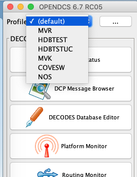
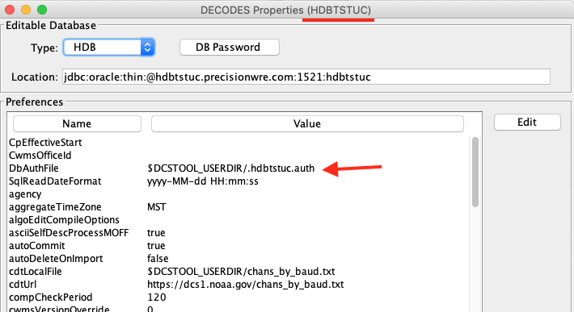
.. |image3| image:: ./media/image19.png
   :width: 2.75016in
   :height: 3.91717in
.. |Macintosh HD:Users:mmaloney:Desktop:Screen Shot 2012-11-12 at 4.10.31 PM.png| image:: ./media/image20.png
   :width: 3.42858in
   :height: 3.87798in
