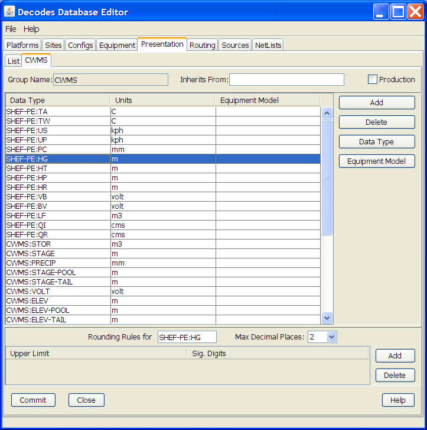
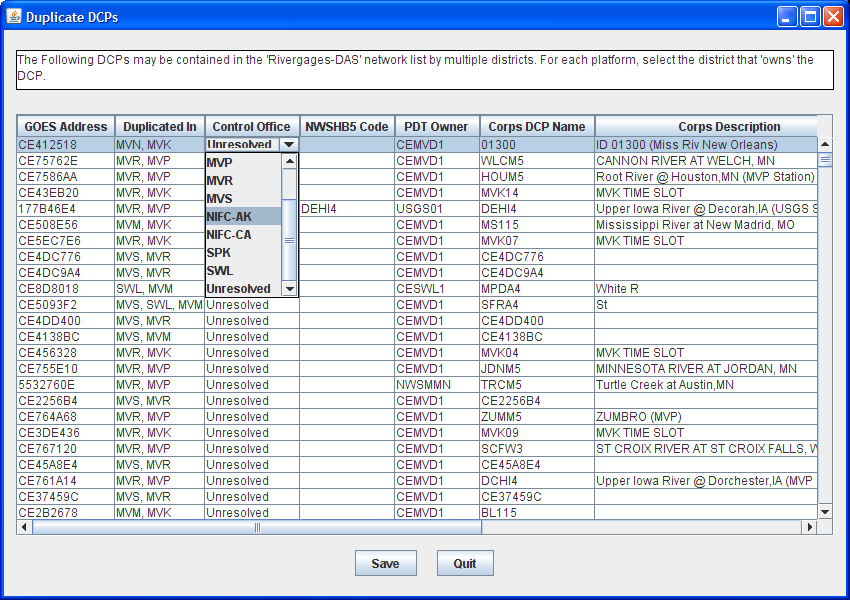
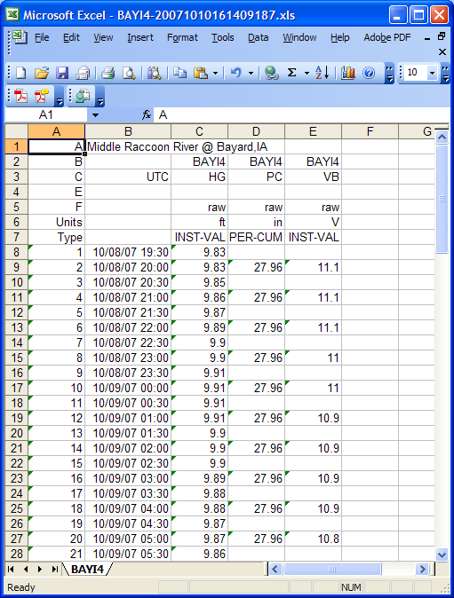

######################
OPENDCS CWMS Interface
######################

..
    Document Revision 2

    January, 2019

    This Document is part of the OpenDCS Software Suite for environmental
    data acquisition and processing. The project home is:
    https://github.com/opendcs/opendcs

    See INTENT.md at the project home for information on licensing.

.. contents. Table of Contents
   :depth: 3

Purpose of this Document
========================

DECODES, LRGS and related tools were developed by ILEX Engineering, Inc.
using funding from several U.S. federal agencies. This approach of
sharing the software-development burden has benefitted all agencies in
many ways. Most importantly, the overall cost is reduced, and there is a
large community of users knowledgeable in using the software.

The U.S. Army Corps of Engineers has been a major contributor to the
development efforts. They have funded several enhancements to make the
software work well for the Corps mission.

This document describes these Corps-specific enhancements. We have also
attempted to provide guidance for new Corps offices attempting to use
DECODES and LRGS.

Revision History
----------------

Revision 2, Jan 2019:

-  Fixed information in the table regarding dbUri.

LRGS and DECODES Usage by USACE
===============================

`Figure 2-1 <#anchor-2>`__ shows data-flow for hydro-met data collection
by a typical Corps office:

-  The LRGS receives data from a satellite link (DOMSAT, NOAAPORT, DRGS,
   Internet, LRIT, etc.)
-  DECODES is a client application that pulls raw data from the LRGS and
   decodes it into engineering units. Many districts run DECODES on the
   same machine as the LRGS, but as shown, it does not need to be done
   that way.
-  DECODES feeds data into CWMS, RiverGages, DSS, and other database
   systems.

Figure 2‑1: Simplified Data Flow Diagram for LRGS, DECODES, & CWMS.

In the past, the interface between DECODES and a database system was
done with files: DECODES would build a file in SHEF or SHEFIT format.
The database system would ingest data from these files.

We now have a working interface directly to the CWMS Server so that data
arrives in the database as soon as it comes over the satellite link.
Chapter `6 <#anchor-4>`__ describes this interface.

DECODES Configuration Options
=============================

DECODES does *not* need to run on the same machine as your LRGS. In fact
there is an advantage to installing it on a different machine: If they
are independent and your LRGS is down, your DECODES can continue to work
by pulling data from another district.

DECODES now supports a variety of databases for storing its meta-data
about your platforms:

-  XML – meta-data is stored in a tree of directories under the edit-db
   directory where you installed DECODES
-  PostgreSQL – a high-performance, open-source database server that
   runs on Windows, Linux, and Solaris. PostgreSQL is now officially
   supported by Sun Microsystems for Solaris 10.
-  MS SQL Server – We ported the DECODES database interface for a
   state-government customer. It is available for use by USACE as well.

ILEX currently has a contract with the Corps to support storing DECODES
meta-data in the CWMS Oracle database. This will be complete in
mid-2008.

XML verses SQL:

-  If you only run DECODES on one machine, XML is the easiest solution.
   You don’t have to install or maintain a SQL database.
-  If you have several people in your office that want to run DECODES
   components against a shared central database, then you should
   consider one of the SQL options. PostgreSQL is the most-tested and
   best-performing of the current options.

Decoding Conventions and Practices
==================================

Many Corps districts are trying to establish conventions for site-names,
data-types, sensor-names, etc. so that data can be more easily shared.
DECODES allows perhaps too-much flexibility in some cases.

Data Type Codes
---------------

Most districts use SHEF (Standard Hydro-Meteorologic Exchange Format)
for data-type codes. This is a National Weather Service standard. Many
DCPs are programmed to include SHEF codes in the message data, making
the messages self-describing.

The first two characters of a SHEF code designate the Physical Element.
Thus DECODES refers to these 2-character codes as ‘shef-pe’ codes.

A handy on-line reference for SHEF codes is maintained by NESDIS at:

http://noaasis.noaa.gov/DCS/htmfiles/schefcodes.html

Site Names
----------

DECODES allows each site-location to have several names. Each name has
two parts:

-  A ‘standard’
-  A name-value

National Weather Service publishes Handbook 5-character names for all
sites that they monitor. DECODES refers to this name as NWSHB5. The NWS
‘HADS’ (Hydrometeorolgical Automated Data System) provides a
web-application and various text files for looking up the NWSHB5 name
for a site.

http://www.nws.noaa.gov/oh/hads/

If you use the ‘NWSHB5’ name type, please be sure that you are using
valid NWS names.

Other naming conventions in common use are:

-  CBTT – Colombia Basin Teletype

-  USGS – The numeric Site Number assigned by USGS

-  Local – Your own local mnemonic name

-  dcpmon – The name for a site used by the DCP Monitor

-  cwms – The CMWS name for a site.

You can use the ‘rledit’ program to create new site name types, as
described in DECODES User Guide section on the Reference List Editor.

Engineering Units
-----------------

DECODES has an extensive library of known Engineering Units and
conversions. See the appendix at the end of the DECODES User Guide for a
list of known unit-abbreviations. You should use these in your scripts.

If you see ‘unknown’ in the output where the units normally would be,
open the configuration, and then the decoding script. Assign a valid
unit-abbreviation to each sensor.

Presentation Group for Automatic Unit Conversions
-------------------------------------------------

Presentation Groups are an under-used feature of DECODES. Open the
Database Editor and then click on ‘Presentation’ and open the
SHEF-English presentation group.

For each data-type you can specify the proper units and the maximum
number of decimal points you want to see.

You then apply a presentation group to your DECODES routing-spec or
DCS-Toolkit Retrieval Process. Thus, for example, suppose you get a
decoding configuration from Canada that decodes gage-height into meters.
You don’t need to change it. Just apply the SHEF-English presentation
group to the routing spec and DECODES will do the conversion for you.

Take Backups!
-------------

We recommend that you take a zip backup of the following directories at
least once per week, and more often if you have made a lot of database
edits. $DCSTOOL_HOME is the directory where you installed the toolkit.

-  $DCSTOOL_HOME/edit-db – This is the XML database

-  $DCSTOOL_HOME/decodes.properties – DECODES configuration info.

-  $DCSTOOL_HOME/procs – Toolkit retrieval processes.

The first item above will backup the database *only if you are using an
xml database.* If you use a SQL database, then you should use the
dbexport tool:

dbexport > mybackup.xml

You can then zip or gzip the ‘mybackup.xml’ file.

In-Line Rating Computations
===========================

DECODES can do in-line rating as it decodes your DCP messages. It
extracts the stage samples, then reads a rating table file, looks-up the
discharge, and outputs both the HG (stage) and QR (discharge).

See the chapter in the DECODES User Guide on Rating Computations for
details.

DECODES can currently handle two types of rating files:

-  USGS Rating Table (rdb) files

-  Plain ASCII CSV (comma-separated-value) or space-delimited table
   files.

We are currently working on the addition of stage/area ratings and a
computation that takes area and average velocity to compute flow. This
sometimes called a ‘velocity rating’.

USGS maintains a national web-repository of RDB files at:

http://nwis.waterdata.usgs.gov/nwisweb/data/exsa_rat/**USGS-SITE-NUM**.rdb

USACE CWMS Interface
====================

The USACE (U.S. Army Corps of Engineers) CWMS (Corps Water Management
System) stores uses a time-series database to store water-level and
related data. The DECODES software suite has a module allowing it to
place incoming data directly into the CWMS database. This obviates the
need for intermediate flat-files used in the pass.

Figure 6‑6‑2: CWMS Interface Data Flow.

The “CWMS Consumer” is selected as the output (consumer) module in the
routing spec. It receives the decoded data from the routing spec and
stores it in the CWMS Oracle Database. The CWMS Consumer uses the new
SQL API (Application Program Interface) published by HEC to write
time-series data directly to CWMS.

We have tried to make the CWMS Consumer as automatic as possible. It has
hard-coded defaults for time-series storage parameters that can be used
in most cases. For special cases, the consumer allows you to provide
properties in the DECODES database to override the defaults.

Control files tell DECODES how to connect and authenticate to the CWMS
database.

This section will explain how to set up DECODES to store data directly
into a CWMS database.

What You Will Need
------------------

In order to use the CWMS consumer, you must have a working CWMS database
with the 1.4 HEC CWMS API Installed. You must have a valid CWMS username
& password with permission to write time series data.

The Consumer uses the “STORE_TS” PL/SQL stored procedure to store the
data. Refer to the CWMS Oracle API User’s Manual for more information
about the “STORE_TS” procedure.

Oracle provides a JDBC driver that you will need. At the time of this
writing, the latest version is a file called “ojdbc14.jar”. By default
the CWMS Data Consumer uses the Oracle “thin” driver which does not
require additional libraries besides the jar file. We have tested the
consumer and verified that it works with the “thin” driver.

*If for special reasons, you are required to use the “OCI” driver, then
you will need additional native library files. You must install these
files in the machine where DECODES will run. The native libraries are
required for the Oracle JDBC OCI driver. Refer to the Oracle web site
(http://www.oracle.com) to find the correct “oci” Driver libraries for
your operating system.*

You will also need to add this Jar file to your CLASSPATH variable. For
example, on a UNIX system, if you place the file in /usr/local/lib, then
in your shell startup file (.profile, .bash_profile, etc.) place the
lines:

CLASSPATH=/usr/local/lib/ojdbc14.jar:$CLASSPATH

export CLASSPATH

On a windows system use the System control panel to set CLASSPATH.

Set up DECODES for CWMS
-----------------------

CWMS requires some additions to the DECODES Database:

-  New “CWMS” Site Name Type
-  New “CWMS” Parameter Data Type
-  Several Engineering Units (CWMS is very particular about what EUs it
   will accept).
-  Unit Converters to convert from other DECODES units to the ones that
   CWMS recognizes.
-  A new “CWMS” Data Consumer Type
-  A “Null” Output Formatter

We have prepared an XML file containing these items. To import these
items into your DECODES database, open a terminal window. Then CD to the
DECODES_INSTALL_DIR directory. Then::

    bin/dbimport –r to_import/cwms-import.xml

(If you are working on a Windows machine, substitute backslash for slash
in the above).

CWMS Connection Parameters
--------------------------

Two files are required: A Properties file stores the CWMS connection and
default parameters. An encrypted file stores the username and password
to use when connecting to CWMS.

The CWMS Properties File
~~~~~~~~~~~~~~~~~~~~~~~~

Create a text file in the $DECODES_INSTALL_DIR called
“decodes-cwms.conf”. This is a text file containing ‘name=value’ pairs,
one per line. `Table 8-6-1 <#anchor-22>`__ explains the parameters,
whether or not they are required, and what the default value is. The
parameter name is *not* case sensitive.

+-------------------+-----------------------+-----------------------+
| Name              | Default Value         | **Description**       |
+-------------------+-----------------------+-----------------------+
| dbUri             | No default value      | In the form:          |
|                   | provided              |                       |
|                   |                       | jdb\                  |
|                   |                       | c:oracle:thin:@\ **Ho |
|                   |                       | stName**:1521:**SID** |
+-------------------+-----------------------+-----------------------+
| cwmsVersion       | Raw                   | Optional: This is     |
|                   |                       | used as the default   |
|                   |                       | “Version” part of the |
|                   |                       | time-series           |
|                   |                       | descriptor.           |
+-------------------+-----------------------+-----------------------+
| cwmsOfficeId      | No default value      | This is the CWMS      |
|                   | provided              | office ID passed to   |
|                   |                       | the API “store_ts”    |
|                   |                       | procedure. Typically  |
|                   |                       | this is your          |
|                   |                       | 3-character district  |
|                   |                       | abbreviation.         |
|                   |                       | Example: MVR          |
|                   |                       |                       |
|                   |                       | Note: If you are      |
|                   |                       | using CWMS to store   |
|                   |                       | your DECODES info,    |
|                   |                       | you don’t need to     |
|                   |                       | specify this. It will |
|                   |                       | pick it up from your  |
|                   |                       | DECODES properties.   |
+-------------------+-----------------------+-----------------------+
| DbAuthFile        | $DECODES_INSTALL_DIR/\| Optional: Set this if |
|                   | .cwmsdb.auth          | you want to stored    |
|                   |                       | the database          |
|                   |                       | authentication file   |
|                   |                       | in a different        |
|                   |                       | location.             |
|                   |                       |                       |
|                   |                       | Note: If you are      |
|                   |                       | using CWMS to store   |
|                   |                       | your DECODES info,    |
|                   |                       | you don’t need to     |
|                   |                       | specify this. It will |
|                   |                       | pick it up from your  |
|                   |                       | DECODES properties.   |
+-------------------+-----------------------+-----------------------+
| shefCwmsParamFile | $DECODES_INSTALL_DIR/\| Optional: Set this if |
|                   | shefCwmsParam.prop    | you want to store the |
|                   |                       | SHEF to CWMS mapping  |
|                   |                       | in a different file.  |
+-------------------+-----------------------+-----------------------+

Table 8‑6‑1: CWMS Connection Parameters.

Encrypted Username/Password File
~~~~~~~~~~~~~~~~~~~~~~~~~~~~~~~~

The CWMS Consumer will look for a file called “.cwmsdb.auth” in the
directory $DECODES_INSTALL_DIR. This file will contain the needed login
information in an encrypted form.

A script called “setCwmsUser” has been prepared to facilitate creating
or modifying the file. This script must be run in a terminal session::

    cd $DECODES_INSTALL_DIR
    bin/setCwmsUser
    *(enter username & password when prompted).*
    chmod 600 .cwmsdb.auth

If this is a Windows system, open a DOS (“cmd”) window and type::

    cd %DECODES_INSTALL_DIR%
    bin\setCwmsUser

The program will ask you for a username and password. These will be
encrypted and stored in the file.

After creating the file for the first time, you should set its
permissions so that only you have access to it::

    chmod 600 .cwmsdb.auth

Note: The file should be owned by the user who will run the DECODES
routing spec. The routing-spec will need permission to read this file.

Optional CWMS Parameter Mapping File
~~~~~~~~~~~~~~~~~~~~~~~~~~~~~~~~~~~~

DECODES must build a time-series descriptor that contains a valid CWMS
“Parameter Type”. Since most of the Corps is currently using DECODES
with SHEF codes, we have provided a way to automatically map SHEF codes
to CMWS Parameter Types.

**Note: See section**\ *\ *\ `6.4.1 <#anchor-26>`__\ *\ *\ **for a more
complete description on how DECODES builds the descriptor. You can
specify CWMS data-types directly in the DECODES database, bypassing SHEF
altogether.**

DECODES can do the mappings listed in `Table 6-2 <#anchor-27>`__
automatically. If these are sufficient for you, then you do not need to
create a mapping file.

========= ===============
SHEF Code CWMS Param Type
PC        Precip
HG        Stage
HP        Stage-Pool
HT        Stage-Tail
VB        Volt
BV        Volt
HR        Elev
LF        Stor
QI        Flow-In
QR        Flow
TA        Temp-Air
TW        Temp-Water
US        Speed-Wind
UP        Speed-Wind
UD        Dir-Wind
========= ===============

Table 6‑2: Built-in SHEF to CWMS Parameter Code Mapping

If the above defaults are *not* adequate, you may provide a mapping file
to override or supplement them. Prepare a text file “shefCwmsParam.prop”
and place it in $DECODES_INSTALL_DIR. This is a Java properties file,
containing name=value pairs, one per line. For example, to have SHEF
“HP” map to CWMS Param Type “Stage”, add a line as follows::

    HP=Stage

How DECODES Uses the CWMS API
-----------------------------

DECODES uses a stored procedure in the API called “STORE_TS”. This
procedure requires several arguments to be passed. This section will
explain how DECODES determines these arguments.

The CWMS Time Series Descriptor
~~~~~~~~~~~~~~~~~~~~~~~~~~~~~~~

A CWMS Time-Series descriptor has six parts. Each part is separated with
a period::

    *Location* . *Param* . *ParamType* . *Interval* . *Duration* . *Version*

We have designed the DECODES CWMS Consumer for convenience and
flexibility: For *convenience*, DECODES can build the descriptor
automatically, using information that it already has in the DECODES
database. For *flexibility*, you can explicitly set part or all of the
descriptor in special circumstances.

The following subsections describe each part of the descriptor.

Location
^^^^^^^^

The *Location* corresponds to a DECODES site name. DECODES allows each
site to have multiple names of different types. It also allows each site
to specify which name-type to use by default (see the
“SiteNameTypePreference” parameter in your “decodes.properties” file).

So, if you have CWMS set up with the same names that you use in DECODES,
then you do not need to do anything else.

The consumer will build the location as follows:

-  If a site-name with type “CWMS” exists, use it.

-  Otherwise, use the default site name.

See section `6.4.3 <#anchor-31>`__ below for instructions on creating an
explicit CWMS site-name-type.

Param 
^^^^^^

The ‘Param’ part must exactly-match one of the CWMS parameter in your
database. The preferred way is to specify an explicit “CWMS” data-type
in the Config Sensor record, as shown in `Figure 6-3 <#anchor-33>`__.

.. image:: ./media/cwms-interface/Pictures/1000000000000218000002294C65880F.png
   :width: 3.8799in
   :height: 3.9972in

Figure 6‑3: Config Sensor with Explicit CWMS Data Type.

If no *explicit*\ CWMS data-type is specified, then the Consumer will
attempt to map it from a SHEF code. The consumer will use the mapping
specified in the file described in section `6.3.3 <#anchor-25>`__, or a
default mapping listed in `Table 6-2 <#anchor-27>`__ if the SHEF code is
not found in the file.

ParamType
^^^^^^^^^

By default the consumer will set *ParamType* to “Inst”. You can override
this by adding a sensor property to the DECODES database called
“CwmsParamType”.

Set a Config Sensor Property if you want the value to be applied to all
platforms using shared configuration. Use a Platform Sensor Property to
apply the value to a single platform.

Other valid settings for ParamType include: “Ave”, “Max”, “Min”, or
“Total”.

Interval 
^^^^^^^^^

The *Interval* part specifies the period at which this parameter is
measured. DECODES already has this information in each sensor record. It
will build the appropriately-formatted string.

Duration
^^^^^^^^

The *Duration* part should be “0” for data with a ParamType of “Inst”.
DECODES will handle this automatically. For other types (specified by a
sensor property), DECODES will build a duration string matching the
sensor period. The user can override this choice by adding a sensor
property called “CwmsDuration”.

Version
^^^^^^^

The *Version* is used by different districts in different ways:

1. Some districts always use a constant value like “Raw” for data
   ingested from DECODES.
2. Other districts use the Version component to denote the source of the
   data. That is, which LRGS, DRGS, or file provided the data.
3. Some districts need to use a different Version component for each
   parameter.

The CWMS Consumer accommodates all three situations:

1. To always use a constant value, set the “cwmsVersion” parameter in
   the CWMS Properties file as described above in section
   `6.3.1 <#anchor-21>`__.
2. To have the Version denote the Source of the data: set up separate
   DECODES routing specs for each source. Add a routing spec property
   called “cwmsVersion” set to the appropriate value. A routing spec
   property, if supplied, will override the value in the CWMS Properties
   file.
3. To have a particular version for a particular parameter, add a sensor
   property called “CwmsVersion” containing the desired value. A
   sensor-setting will override any other values.

The CMWS Office ID
~~~~~~~~~~~~~~~~~~

The value for the CWMS office ID is set in the CMWS properties file. See
`Table 8-6-1 <#anchor-22>`__.

You can also specify this as a routing-spec property called
“CwmsOfficeId”. This gives you flexibility: The properties file can
contain the default. Individual routing specs may override the default
if they process data from another office.

The “Store Rule”
~~~~~~~~~~~~~~~~

The store rule value is used by the STORE_TS procedure to control how to
handle the insertion of data samples that already exist in the CWMD
database.

By default, the consumer will set the store rule to “Replace All”. You
may override this by adding a routing-spec property with the desired
setting. The valid values are:

-  Replace All
-  Delete Insert
-  Replace With Non Missing
-  Replace Missing Values Only
-  Do Not Replace

Refer to the API User’s Manual for more information on the store rule
field.

Override Protection
~~~~~~~~~~~~~~~~~~~

This value determines how CWMS will override existing data in the
database. By default, the consumer sets this to 1 (true). To set it to
false (0), add a routing-spec property called “OverrideProt” set to a
value of “0”.

Refer to the API User’s Manual for more information on the override
protection field.

Version Date
~~~~~~~~~~~~

NOT USED ON CURRENT CWMS DATABASE. Default value is null. Refer to the
CWMS Oracle API User’s Manual for more information on this field

Create the Routing Spec
-----------------------

Open the DECODES database editor and create a new routing spec in the
normal manner. For Consumer Type, select “cwms”. For Output Format,
select “null”.

As stated above, the properties shown in `Table 8-6-3 <#anchor-43>`__
may be used to override the built-in defaults. Property names are *not*
case-sensitive.

+--------------+------------------------------------------------------+
| Name         | Description                                          |
+--------------+------------------------------------------------------+
| CwmsOfficeId | Overrides setting in decodes-cwms.conf file.         |
+--------------+------------------------------------------------------+
| StoreRule    | Overrides built-in default of “Replace All”          |
+--------------+------------------------------------------------------+
| OverrideProt | Overrides built-in default of 0 (false). Set to 1    |
|              | for true.                                            |
+--------------+------------------------------------------------------+
| VersionDate  | NOT USED ON CURRENT CWMS DATABASE VERSION. Default   |
|              | value null. Refer to the CWMS Oracle API User’s      |
|              | Manual for more information.                         |
+--------------+------------------------------------------------------+

Table 8‑6‑3: CWMS Routing Spec Properties.

We also recommend that you select the “CWMS” presentation group. This
will ensure that your data is converted into EUs that CWMS will accept.

.. _engineering-units-1:

Engineering Units
-----------------

The sensor engineering-units need to be in compliance with the CWMS
Oracle Database, otherwise the sensor data will not be accepted by CWMS.
We have prepared a presentation group that will automatically convert
your data into CWMS EUs. You simply have to select the presentation
group in the routing spec.

`Figure 6-6-4 <#anchor-45>`__ shows the database editor with the CWMS
presentation group open. See how the presentation group asserts which
units should be used for each parameter type. When you apply the
presentation group to a routing spec, DECODES will automatically convert
the data into the correct units.

Figure 6‑6‑4: Database Editor Showing the CWMS Presentation Group.

Refer to the section on Presentation Groups in the DECODES User Guide.
Recall that you can also use the presentation group to omit certain
parameter types from the output. For example, if you do not store
battery voltage in the CWMS database, change the units for VB to ‘omit’.

Troubleshooting
---------------

The DECODES Routing Spec sends log messages to a file in the “routstat”
directory under $DECODES_INSTALL_DIR. Find the file there with the same
name as your routing spec and an extension “.log”. For example if your
Routing Spec is called “cwms_rs”, the log file name will be:
cwms_rs.log.

The remainder of this section will provide examples of possible log
messages, explaining what each means and what to do to correct the
situation. A ‘FATAL’ message will result in the termination of the
routing spec.

FATAL 03/06/07 16:56:46 CwmsConsumer Cannot load configuration from
‘$DECODES_INSTALL_DIR/decodes-cwms.conf': java.io.IOException:
CwmsDbConfig Cannot open config file 'C:\DCSTOOL/decodes-cwms.conf':
java.io.FileNotFoundException: C:\DCSTOOL\decodes-cwms.conf (The system
cannot find the file specified)]

This fatal message means that the decodes-cwms.conf file was not found
under the required directory. Make sure that the decodes-cwms.conf file
is located under the DECODES installed directory.

WARNING 03/06/07 16:31:26 CwmsConsumer Cannot read DB auth from file
'C:\DCSTOOL/.cwmsdb.auth': java.io.FileNotFoundException:
C:\DCSTOOL\.cwmsdb.auth (The system cannot find the file specified)

This warning message means that the authentication file, which contains
the encryption of the username and password for the Database connection,
is not on the right directory. Make sure that the .cwmsdb.auth file is
located under the DECODES installed directory.

FATAL 03/06/07 16:31:26 CwmsConsumer Error getting JDBC ORACLE
connection using driver 'jdbc:oracle:thin:@' to database at
'155.76.210.137:1521:MVRT' for user '': java.sql.SQLException: invalid
arguments in call

CWMS Data Consumer will log Database connection fatal messages if:

- The wrong username/password was sent to it, which in this case make
  sure that the authentication file (.cwmsdb.auth) is on the right
  directory and contains the right username and password (this is the
  sample log shown above)

- The wrong CWMS Database connection information was supplied; in this
  case make sure that the DbUri property on the decodes-cwms.conf file
  contains the right Database connection information

- The CWMS Database server is down, in this case call the CWMS Database
  system administrator

WARNING 03/06/07 17:03:17 CwmsConsumer Cannot read properties file
'C:\DCSTOOL/shefCwmsParam.prop': java.io.FileNotFoundException:
C:\DCSTOOL\shefCwmsParam.prop (The system cannot find the file
specified)

This warning message means that the shefCwmsParam.prop file was not
found under the DECODES installed directory. However, this file is not
required. If the user has decided not to use this file no action need to
be taken. If not, make sure that this file exists under the DECODES
installed directory.

WARNING 03/06/07 15:30:59 CwmsConsumer Platform Site Name nwshb5-STBI4,
Platform Agency MVR, DCP Address CE2DC544, sensor HG Error while
inserting sensor data in cwms_ts.store_ts CWMS procedure
:java.sql.SQLException: ORA-20010: INVALID_OFFICE_ID: "tttMVR" is not a
valid CWMS office id

This warning message means that the office that was set on the
decodes-cwms.conf file is not valid for the CWMS Database. Make sure
that the decodes-cwms.conf file contains the correct office value on the
cwmsofficeid property.

WARNING 03/05/07 16:22:40 CwmsConsumer Platform Site Name nwshb5-STBI4,
Platform Agency MVR, DCP Address CE2DC544, sensor VB Error while
inserting sensor data in cwms_ts.store_ts CWMS procedure
:java.sql.SQLException: ORA-20210: WARNING(cwms_loc.get_ts_code):
STBI4.Volt.Inst.1Hour.0.raw FOR OFFICE: MVR NOT FOUND

This warning message means that the time-series descriptor does not
exists in the CWMS Database. Make sure that the CWMS Database contains
the time-series descriptors specified in the warning message. In this
case ‘STBI4.Volt.Inst.1Hour.0.raw’ for office MVR.

FAILURE 02/23/07 15:20:13 RoutingSpec(CWMSTEST) Error on data consumer
'cwms': decodes.consumer.DataConsumerException: CwmsConsumer Error while
inserting sensor data in cwms_ts.store_ts CWMS procedure
:java.sql.SQLException: ORA-20103: Requested unit conversion is not
available

This warning message means that the CWMS Database does not recognize the
unit value that CWMS Data Consumer sent. Make sure that the sensor unit
is accepted by the CWMS Database, you may need to create a DECODES
presentation group to convert units if the CWMS Database does not handle
the current senor unit. Refer to the DECODES Presentation group on the
DECODES User Manual for more information.

WARNING 03/05/07 16:34:36 CwmsConsumer Platform Site Name nwshb5-CRVI4,
Platform Agency MVR, DCP Address CE637FAC, sensor YA Cannot find CWMS or
SHEF datatype -- skipping.

This warning message means that the time-series descriptor was not
created for that particular sensor. Change the sensor data type to cwms
with the correct cwms code (this is done on the Edit Config Sensor
dialog) or add the mapping of that sensor data type code on the
shefCwmsParam.prop file.

Combining Multiple Databases into One
=====================================

This is used by the USACE Mississippi Valley Division (MVD).

MVD runs an application called “River Gages” on a server at Rock Island.
This server hosts a database hub, as described in this chapter. The hub
exists in the directory ~lrgs/dbhub. See the DECODES Web-Apps User Guide
section on DECODES Database Hub. MVD uses this to collect periodic
snapshots of each district’s database.

The districts are, from north to south:

-  MVP – St. Paul, MN

-  MVR – Rock Island, IL

-  MVS – St. Louis, MO

-  MVM – Memphis, TN

-  MVK – Vicksburg, MS

-  MVN – New Orleans, LA

-  More districts from around the country have seen a benefit to
   RiverGages. It is no longer limited to MVD.

Now the RiverGages WIBS server also hosts a DECODES PostgreSQL database
that combines platforms from each district’s database into one large SQL
database. The RiverGages DCP Monitor and routing specs then run from
this large, combined database, shown in `Figure 7-5 <#anchor-49>`__.

Figure 7‑5: Combining District Databases.

The two files labeled ‘PDT File’ and ‘HADS File’ are used to assign
names and descriptions to platforms that are not in any database.

*At the Rock Island WIBS server, the combined database is under the
DECODES installation at ~lrgs/DECODES7.*

Determining the Controlling District for each Platform
------------------------------------------------------

Recall that each district’s XML DECODES database contains that
district’s platforms. It may also contain platforms of interest from
other districts. So there may be platforms that are duplicated in more
than one database.

-  The ‘controlling district’ is the one with primary responsibility for
   the DCP
-  An ‘observing district’ is a different district that observes data
   from a DCP.

This leads to a problem: When we merge, we should take each platform
*only from the controlling district*. An observing district might not
keep the record up to date with the latest decoding formats and names.

ILEX completed a contract in 2007 to correct this situation: We created
a GUI to allow the administrator of the combined database to detect
duplicate DCPs and then assign one district to be the *controlling
district*.

The merge-script works off of each district’s *DDD-RIVERGAGES-DAS*
network list, where *DDD*\ is the district abbreviation. RiverGages
allows districts that don’t use DECODES to participate in the DCP
monitor. These districts supply only an old-style “.nl” network list
file. Thus the job of this new GUI is to detect duplications in network
lists.

Create a directory under your toolkit installation called ‘dcptoimport’.
In this directory we will prepare a file called
‘controlling-districts.txt’. The GUI below will edit this file.

Start the GUI with the following script:

dupdcps_start -f *dcpmon-config-file* -t *pdt-file* –w *hads-file*

where …

-  *dcpmon-config-file* is the path of the DCP Monitor Config file. This
   file specifies the groups, and indirectly the databases that take
   part in the DCP Monitor. The default if you don’t specify this
   argument is $DECODES_INSTALL_DIR/dcpmon/dcpmon.conf.
-  *pdt-file* is the downloaded PDT file from NESDIS. This is downloaded
   automatically by the LRGS and stored in the LRGS home directory. The
   PDT is used to fill out the PDT Description and PDT Owner columns.
   The default value if you don’t specify an argument is
   “$LRGSHOME/pdt”.
-  *hads-file*\ is a text report downloaded from the National Weather
   Service, containing NWSHB5 names and descriptions for every platform.
   This file is used to fill out the NWSHB5 Code Description columns.
   The default value if you don’t specify this argument is
   “$DECODES_INSTALL_DIR/hads”

At the Rock Island WIBS, the complete command is:

cd $HOME/DECODES7

bin/dupdcps

This calls the generic ‘dupdcps_start.sh’ script as follows:

dupdcps_start –f dcpmon/dcpmon.conf –t $HOME/pdts_compressed.txt –w
dcpmon/hads.txt

Figure 7‑6: Duplicate DCPs GUI.

The GUI shows a list of all platforms that are duplicated in multiple
network lists. For each platform, you should select the district which
has primary responsibility (i.e. ‘controls’) that platform. When you
click the ‘Control Office’ column header, platforms that are unresolved
are sorted to the top of the list. Notice that the District pull down
menu shows the Districts that have platform records on the Combine SQL
Database as well as Districts that use the LRGS Network List style.

Caveat: The Duplicate DCPs application expects the .nl files to be under
the same directory as the dcpmon.conf file.

Once the “Save” button is pressed the Application will create a
‘controlling district file’ to be used by the merge-code and the DCP
Monitor. In addition, the Duplicate DCPs Application will create network
list files (.nl style) to be used by the combine-from-hub scripts to
determine how to import duplicate platforms within the districts.

Note the following file locations:

-  This information is saved in the directory
   “$DECODES_INSTALL_DIR/dcptoimport”.

-  The list of controlling districts for each DCP is called
   “controlling-districts.txt”.

-  The network lists are called “\ **DIST**\ **-**\ TOIMPORT.nl”, where
   **DIST** is the 3-letter district abbreviation.

We recommend that you run this GUI periodically (e.g. once per day) to
select the controlling district for any unresolved platforms.

As Platforms are resolved the combine-from-hub.sh script will take care
of importing the right platforms for each district.

Running the Script to Merge Databases
-------------------------------------

The actual merge is accomplished by a script called combine-from-hub.sh.
At Rock Island this is found in the DECODES7/bin directory. We set up
the crontab to run this script at 5:15 Central Time every morning.

This script takes into account the control district that you defined in
the GUI. It will only merge DCPs that each district controls, *or that
no district controls*.

How to Add a New USACE District to the DCP Monitor
--------------------------------------------------

You will add a district to the DCP monitor so that it shows up as a
selectable group at the top-level web page.

The ‘DCPMON directory’ for Rock Island is
/u01/home/lrgs/DECODES7/dcpmon.

If the District Uses DECODES …
------------------------------

Add the district to the database hub mechanism so that you have a
current copy of their database. Make sure the district has a network
list in their database called:

**DDD**-RIVERGAGES-DAS

… where **DDD** is the 3-character district abbreviation.

Modify the ‘dcpmon.conf’ file in the DCP Monitor directory. Define a new
group for the district with the name of the network list. For example,
suppose you had 21 groups before and you are adding district SAJ. Add
this line:

group_22=SAJ-RIVERGAGES-DAS

If the District DOES NOT Use DECODES …
--------------------------------------

Obtain a network list containing the DCPs used by the district. Name the
list **DDD**.nl, where **DDD** is the 3-character district abbreviation.

Place this list into the DCP Monitor directory.

Modify the ‘dcpmon.conf’ file in the DCP Monitor directory. Define a new
group for the district with the name of the network list. For example,
suppose you had 21 groups before and you are adding district SAJ. Add
this line:

group_22=file:SAJ.nl

Restart the DCP Monitor Server
------------------------------

After making changes to the configuration file stop and then restart the
server. CD to the DCPMON directory and …

rm dcpmon.lock

(wait for about 20 seconds, then …)

start_dcpmon

CWMS-Compatible Excel Data Format
=================================

CWMS can import data from an Excel file provided that certain header
rows and columns are provided. As of version 7.4, DECODES can produce
files in this format.

DECODES modules which output data are called “consumers”. Thus the
module which writes these files is called the “Excel Consumer”.

The Excel Consumer receives the formatted data created by a DECODES
Routing spec or Retrieval Process. It then generates an Excel “xls” file
for every DCP on the Network list.

The names of the files generated by this consumer are composed of site
name plus current time in the format YYYYMMDDHHMMSSmmm. For example:
“NADA4-20071010161409390.xls”.

Normally the consumer will create *one file per DCP* with all the
messages for that DCP added to a single file. When you run a routing
spec or retrieval process in real-time, you will want to have a separate
file for each message.

To do this add a property: msgPerXlsFile = true.

This property will indicate to the Excel Consumer that the Routing Spec
is running in real time and that it will generate an excel file for
every decoded message received instead of an excel file for every Site
on the Network List.

Add Excel Consumer to Your System
---------------------------------

Use the Reference List Editor to add the consumer to the DECODES
pull-down menus. Open a command window, and run the ‘rledit’ script in
the bin directory under your toolkit.

-  Under the Enumerations tab:

-  

   -  Select “Data Consumer” from the Enumeration pull down menu
   -  Click the Add button on the right and create the following entry:

-  

   -  

      -  Mnemonic Value: excel
      -  Complete Description: Output to Excel file
      -  Executable Java Class: decodes.excel.ExcelConsumer

-  

   -  Click ok button
   -  Select “Output Format” from the Enumeration pull down menu
   -  Verify that the Null Formatter is on the list, if it is not on the
      list, Click the Add button on the right and create the following
      entry:

-  

   -  

      -  Mnemonic Value: null
      -  Complete Description: Null Formatter

-  

   -  

      -  Executable Java Class: decodes.consumer.NullFormatter

-  

   -  Click ok button
   -  Select File – Save to DB.

Please be careful typing the Java class names above. They must be typed
exactly as shown above. Upper/Lower case is distinct.

Set up a Routing Spec to Produce Excel Files
--------------------------------------------

When setting the Routing Spec:

-  Select excel for “Consumer Type” drop down menu
-  Select null for the “Output Format” drop down menu
-  Set Consumer Args to the directory where the excel files will be
   created, if no directory (full path) is giving on the Consumer Args
   the Excel Consumer will create all Excel files in the DCSTOOL install
   directory.

The following property can be added to the Routing Spec dialog window:

+---------------+-----------------------------------------------------+
| **Name**      | Description                                         |
+---------------+-----------------------------------------------------+
| msgperxlsfile | This property is required when running the Excel    |
|               | Consumer on real time (meaning no until value is    |
|               | defined). Set the msgperxlsfile value to true.      |
+---------------+-----------------------------------------------------+

Control the DSS/CWMS Path Name F-part
-------------------------------------

The F-part of the path name is usually either “rev” or “raw”. If not
specified, DECODES will output “raw”. You can control this by adding a
property to either the configuration or platform sensor:

+-------+-------------------------------------------------------------+
| Name  | Description                                                 |
+-------+-------------------------------------------------------------+
| fpart | This value is optional. This value is either rev or raw. If |
|       | no value is given the Excel Consumer default the FPART to   |
|       | raw.                                                        |
+-------+-------------------------------------------------------------+

Example of an Excel file generated by the Excel Consumer:
---------------------------------------------------------

Using CWMS Oracle Database for DECODES Meta Data
================================================

As of version 7.5 you can store the DECODES meta-data inside the Oracle
database used for CWMS. This offers the following advantages:

-  Automated backups
-  Your CWMS location-records and data-types are automatically included
   in DECODES.

This chapter will explain how to configure DECODES for operation with
the CWMS database.

Configure DECODES for CWMS Database
-----------------------------------

`Table 9-4 <#anchor-63>`__ shows the “decodes.properties” file settings
that are appropriate for CWMS. Note that if you set them in
“decodes.properties”, you do *not* need to set them in the CWMS-specific
configuration file discussed in section `6 <#anchor-4>`__.

+----------------------+----------------------+----------------------+
| Name                 | Value for CWMS       | Description          |
+----------------------+----------------------+----------------------+
| editDatabaseType     | CWMS                 | Specifies that your  |
|                      |                      | editable database    |
|                      |                      | will use the CWMS    |
|                      |                      | extensions to the    |
|                      |                      | standard SQL         |
|                      |                      | database.            |
+----------------------+----------------------+----------------------+
| editDatabaseLocation | *\                   | Required parameter   |
|                      | host:portnumber:SID* | that specifies the   |
|                      |                      | location of the      |
|                      |                      | ORACLE CWMS          |
|                      |                      | database.            |
+----------------------+----------------------+----------------------+
| jdbcOracleDriver     | Default =            | Optional Oracle JDBC |
|                      |                      | Driver String. The   |
|                      | jdbc:oracle:thin:@   | default driver is    |
|                      |                      | “thin” but you can   |
|                      |                      | change it to “oci”.  |
|                      |                      | If “oci” is used     |
|                      |                      | native code will     |
|                      |                      | have to be           |
|                      |                      | installed. No need   |
|                      |                      | to modify this       |
|                      |                      | property.            |
+----------------------+----------------------+----------------------+
| DbAuthFile           | $\                   | Optional: Set this   |
|                      | DECODES_INSTALL_DIR/ | if you want to       |
|                      | .decodes.auth        | stored the database  |
|                      |                      | authentication file  |
|                      |                      | in a different       |
|                      |                      | location.            |
+----------------------+----------------------+----------------------+
| sqlTimeZone          | *Required Time-Zone  | Specifies the        |
|                      | Abbreviation.        | time-zone in which   |
|                      | Default=UTC*         | the CWMS database    |
|                      |                      | displays and accepts |
|                      |                      | date/time strings.   |
+----------------------+----------------------+----------------------+

Table 9‑4: DECODES Properties File Settings for CWMS.

Show snapshot of decodes properties panel for setting time zone.
