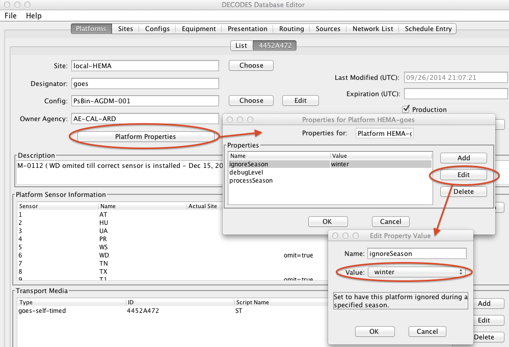

###############################
DECODES Platform Decoding Guide
###############################

.. contents. Table of Contents

Introduction
============

DECODES stands for DEvice COnversion and DElivery System. DECODES is the
module within OpenDCS (Open Data Collection System) that takes data from
a variety of recording devices and converts it into standard engineering
units, suitable for entry into a database.

This manual describes how to use configure DECODES to handle data from
each of your platforms. Included is a basic description of the database
editor, importing & exporting, and the DECODES format language.

For information on running DECODES routing specs, scheduling, and
checking status, see the OPENDCS DECODES Routing and Scheduling Guide.

What does DECODES Do?
---------------------

The types of recording devices include:

-  Electronic Data Loggers (EDLs) – typically manually retrieved data,

-  GOES DCPs (Data Collection Platforms – data retrieved by satellite
   telemetry,

-  Modem loggers – must be polled via modem

-  Network DCPs – either polled via network (including GPRS) or the
   stations call into a data collection server.

The operations performed by DECODES are below.

.. image:: ./media/decoding-guide/decodes_ops.png
   :width: 1.30347in
   :height: 3.65139in

Figure 1: What DECODES Does

DECODES can handle any ASCII format currently in use by the DCS. This
includes true ASCII values or the pseudo-binary values common in compact
random messages.

DECODES Database
----------------

DECODES uses a database of platform specifications to tell it how to
decode data from a given station. This database includes:

**DataSource** Where to retrieve raw data from: Directory, File, LRGS
Network Connection, shared memory, etc. If an LRGS network connection is
specified, you can specify network lists, time-ranges, etc.

**Sites** Information about a location

**Platforms** Information about the logging device. There may be more
than one Platform at a Site.

**DecodingScript** A structured scripting language that tells DECODES
how to extract time-tagged samples from the raw messages

**EU-Converters** How to convert raw values into engineering units, and
how to convert between various types of engineering units (e.g. feet to
meters).

**Presentation** How to format each type of sample. For example, you
might want all stage values to be presented in centimeters with 10.3
resolution.

**DataTypes** DECODES knows how to convert between the USGS (EPA)
numeric codes and SHEF physical element codes.

**Formatters** How to format data on output. Formatters are implemented
for SHEF, SHEFIT, Human-Readable, and “Dump”.

**Consumers** Where to put the output data: files, directories, pipes,
etc.

**RoutingSpec** Puts all of the above together. A RoutingSpec says where
to get the raw data, how to decode it, how to EU convert it, how to
format it, and where to send it.

DECODES can store information in several types of databases:

-  XML – This is really just a tree of XML files on the local disk.

-  OPENDCS PostgreSQL – The OpenDCS SQL Schema for the PostgreSQL
   Relational Database Management System

-  OPENDCS Oracle - The OpenDCS SQL Schema for the Oracle Relational
   Database Management System

-  CWMS – U.S. Army Corps of Engineers’ CWMS (Corps Water Management
   System) is a multi-office SQL schema running under Oracle

-  USBR HDB – U.S. Bureau of Reclamations HDB (Hydrologic Database) is a
   SQL schema running under Oracle

DECODES Requirements
--------------------

DECODES is written in 100% pure Java. Therefore there should be no
porting issues in running it on any modern computing platform. Operation
has been verified under Windows (various releases), Linux, and Mac OS X.

Resources
---------

See the *OPENDCS6 Installation Guide* for information on:

-  Installing OPENDCS in various architectures

-  Configuring OPENDCS and DECODES

-  Creating a DECODES or Time Series Database

-  Using OPENDCS with external database systems like CWMS and HDB

See the *OPENDCS 6 Routing and Scheduling Guide* for information on:

-  DECODES Data Sources

-  Presentation Groups

-  Routing Specifications

-  Automated Scheduler

-  Output Formatters

-  DECODES Consumers

Revision History
----------------

Revision 7, January 2018:

-  Documented Platform and Platform Sensor Properties

Revision 8, October 2020:

-  New Field Type TZ Added with new Manual Section

Revision 9, August 2022:

-  Improvements to Load Message Dialog in the Configuration Script Edit
   Dialog in section 5.1.

Import and Export
=================

DECODES supports an XML format for all of its database schema. DECODES
meta data (data describing your platforms, sites, devices, etc.) can be
imported from and exported to XML.

Export from the DECODES Database Editor
---------------------------------------

Press ‘File – Export’ to view the dialog shown in **Error! Reference
source not found.**. You have four choices as to what to export:

-  Entire Database –Create an XML file containing all of your database
   records. This is the equivalent of the ‘dbexport’ command.

-  All Platforms – Create an XML file containing all of your platform
   records. This is equivalent to the ‘pxport –a’ command.

-  Platforms in network list - Create an XML file containing platform
   records for platforms in the specified network list. This is
   equivalent to the ‘pxport –n’ command.

-  Platforms by Name – Create an XML file containing named-platform
   records only.

After selecting what to export, specify an output file by either typing
the name in the area provided or by pressing the ‘Choose’ button.
Finally press the ‘Export’ button. As data is exported, a message will
be added to the ‘Results’ area at the bottom.

Figure 2: The Export Dialog

Import with the DECODES Database Editor
---------------------------------------

Select File – Import. You will see the dialog shown in Figure 3. This
dialog will allow you to open an XML file, scan its records, select
which records to import, and finally, import them into your editable
database.

Figure 3: Import XML Files Dialog.

Press the ‘Browse’ button or type in the file name in the area provided.
After selecting a file, press the ‘Scan File’ button. Figure 4 shows the
dialog after a file has been opened and scanned. The user has selected
two platforms for import.

Figure 4: Import Dialog showing successful scan.

The ‘All’ button will select all records. The ‘None’ button will
de-select all records. Once you have the desired records selected, press
the ‘Import’ button at the bottom.

The imported records will be opened in editor tabs. You should then go
to each tab and verify the information. Finally press the ‘Commit’ and
‘Close’ buttons on each tab.

If you are sure that all information is correct in all tabs, you can
select ‘File – Commit All’ and ‘File – Close All’ as a short cut.

DB Import Utility (dbimport)
-----------------------------

**Synopsis:**

dbimport *<options>* file1 file2 . . .

**Options:**

   -d *debug-level* Level should be 1, 2, or 3 from the least to most
   verbose.

   -v Validate only: Do not actually import any data. Just issue
   warnings about conflicts and parsing errors.

   -o Keep old records on conflict. Default is to overwrite old records
   with new ones.

   -r Write reference list information. Usually reference list info like
   site name types, data-types, etc., is ignored.

   -A agency-code Specify a default Agency Code used for platform
   records that do not supply one.

   -O platform-owner Specify the owner for all imported platform records

   -C Link platforms to existing configurations. Do not import
   configuration records even if they are present in the input data.

   -W Overwrite the entire contents of the current database with the
   imported data. **Caution! This should only be used when you want to
   replicate a remote DECODES database. All of your current metadata
   will be erased!**

   -y Normally, if you use the –W option it will ask you for
   confirmation. The ‘-y’ option means ‘Yes. I really mean it.’ You
   would use this option when you are periodically replicated a remote
   database, e.g. from a cron job.

**Description:**

This program accepts XML files that were created by the export utilities
described above. Imported records are inserted into your editable
database.

DbImport normally ignores ‘setup’ records that are part of a large
database dump. This allows you to exchange a dump of your entire
database with other users, without fear that special changes they make
in the database structure will affect you. The following record types
are only imported if the corresponding file is placed on the command
line:

-  Enumeration Records – found in the file enum/EnumList.xml

-  Engineering Units and Conversion – found in the file
   eu/EngineeringUnitList.xml

If you want to import setup records, use the –r option.

This program writes log messages to a file called “util.log” in the
current directory.

**Examples:**

pxport –a > platform-dump.xml

...at a different organization

dbimport platform-dump.xml

Platform Export Utility (pxport)
--------------------------------

**Synopsis:**

pxport *<options>*

**Options:**

   -d *debug-level* Level should be 1, 2, or 3 from the least to most
   verbose.

   -n *network-list* Export platforms referenced by the named network
   list.

   -s *site-name* Export the platform record for a specific site.

   -a Export all platforms.

   -c *config-name* Export platforms that use a given platform
   configuration.

   -i Export from the installed database. The default is to export from
   the editable database.

**Description:**

This program writes XML records containing platforms (and all
subordinate records such as site, config, script, and transport media).
Records are written to standard output.

Multiple instances of the above options are acceptable. See examples
below.

This program writes log messages to a file called “util.log” in the
current directory.

**Examples:**

Dump all platforms to a single XML file:

pxport –a > platform-dump.xml

Export three specific sites:

pxport –s TCLG1 –s HUDG1 –s LHMG1 > threesites.xml

Export platforms referenced by Atlanta’s network list:

pxport –n Atlanta > Atlanta-platforms.xml

Database Export Utility (dbexport)
-----------------------------------

You can export the entire database to an XML file with the ‘dbexport’
command:

dbexport > *file* *By default exports the editable database.*

dbexport –i > *file* *Option to export installed database*

This command is very useful for taking periodic backups of the DECODES
database.

DECODES Database Editor
=======================

Start the Database Editor (dbedit) from the launcher with the command::

    launcher_start

Then press the button for DECODES Database Editor.

You can also start the dbedit directly from a terminal with the command::

    dbedit *<options>*

**Options:**

   -d *debug-level* Level should be 1, 2, or 3 from the least to most
   verbose.

   -E databaseLoc Edit the XML database at the specified location. This
   overrides the editable database location specified in your DECODES
   Properties file.

The editor starts as shown in Figure 5.

Figure 5: Database Editor Platform List Screen.

GUI Layout
----------

A row of Tabs appears along the top corresponding to the different kinds
of records in the database (Platforms, Sites, Configs, etc.)

List Panels in General
~~~~~~~~~~~~~~~~~~~~~~

Underneath each of those tabs you will see a “List” tab. In Figure 5,
the Platform tab is selected, so we see the List of platforms.

Click on the column header in the List tab to sort the elements by the
columns value. In Figure 5 the ‘Site’ column header was clicked, so we
see elements sorted by Site name.

Along the bottom of the List tab you see buttons with the following
labels:

**Open** To edit a database record, click on it in the list and press
Open

**New** Press new to create a new database record.

**Copy** To copy a database record, click on it in the list and press
Copy. You will be prompted for a name for the copy.

**Delete** To delete a database record, click on it in the list and
press Delete.

**Refresh** This is a placeholder for future a feature.

Edit Panels in General
~~~~~~~~~~~~~~~~~~~~~~

When you **Open** a record, a new tab appears to the right of the list
tab. For example, Figure 6 shows the result after we do the following:

-  Select the **Configs** top-level tab.

-  Select the record loggernet-20 from the list

-  Press the **Open** button.

Notice the bottom of the Edit Panel. The **Commit** button writes the
record back to the database. You can do this at any time. It does not
close the panel.

The **Close** button closes the edit panel. If you have made changes to
the record you will be asked if you want to save them.

Exiting the Editor
~~~~~~~~~~~~~~~~~~

You can exit the editor by selecting File-Exit or by closing the window.
If you have edit panels open in which changes have not been saved, you
will be forced to close these panels before you can exit.

Figure 6: Platform Config Edit Panel.

Sites
=====

In DECODES, a site is simply a location with one or more names. It also
has a collection of meta-data it can store about the location.

Figure 7 shows an example of the Site Edit Panel. The left panel shows
the names for the site. A site can have several names, but only one of
each time. This site has a local name “RNSASRMH” and a wsc (Water Survey
of Canada) name of 05DC001. If your organization uses a particular kind
of name, you can add it.

On the right are type-in fields for descriptive information about the
site such as latitude, longitued, etc.

As in many of the DECODES records, you can adorn the site with a set of
Properties (name=value pairs). Properties are used by various formatters
and other modules and are described in the appropriate sections.

.. image:: ./media/decoding-guide/image7.png
   :alt: Macintosh HD:Users:mmaloney:Desktop:Screen Shot 2014-04-14 at 3.48.01 PM.png
   :width: 6.49444in
   :height: 4.20208in

Figure 7: The Site Edit Panel.

DECODES Configurations
======================

Suppose you wanted to field 10 new water-level stations. You purchase
ten sets of identical equipment (loggers, transmitters, antenna,
sensors) and configure them all the same. In this case, you could decode
them all with the same Configuration record.

The Configuration record contains:

-  A list of sensors (names, data type codes, min/max, other properties)

-  A script that handles the decoding using the DECODES Format Language.

-  The script contains more information about each sensor such as the
   engineering units and any coefficients required to convert raw data
   to the correct units.

Figure 8 shows an example of an open platform configuration.

The panel shows you the current number of platforms that are using this
configuration. This may be important if you plan to make modifications.
Your modifications will affect all platforms using the config.

The center of the panel contains a list of Sensors defined in this
configuration. Using the buttons to the right, you can Delete, Edit, or
Add sensors in this list. If you edit or add a sensor, you will see the
dialog shown in Figure 9.

At the bottom of the panel you see a list of decoding scripts. Decoding
scripts do the work of extracting sensor samples from your raw message.
Using the buttons to the right, you can Delete, Edit, or Add scripts in
this list. If you edit or add a script, you will see the dialog shown in
Figure 10

Figure 8: Platform Config Edit Panel.

Figure 9: Edit Config Sensor Dialog.

Sensor Properties are used to activate many special features within
DECODES.

You can define properties here, and they will apply to all platforms
using this configuration. For example, the figure above shows that a
time offset of -2700 (seconds) is to be applied to every value for this
sensor (to subtract 45 minutes).

If you want the property setting to apply to only a specific platform,
apply the property in the Platform Sensor dialog, as described in
section 0. Any settings defined in the Platform dailog will override
settings made in the Config-Sensor dialog shown above.

Decoding Scripts
----------------

A sample Decoding Script dialog is shown in Figure 10. This is the
trickiest part. You will likely spend more time in this dialog than any
other part of DECODES.

At the very top of the screen you see the name of the configuration that
this script belongs to, the name of the script, and a selection for data
order.

The name of the script must be unique within the configuration. You are
strongly encouraged to follow these conventions:

-  Script Name ‘ST’ for Self Timed GOES DCP Messages,

-  Script Name ‘RD’ for Random GOES DCP Messages,

-  Script Name ‘EDL’ for Electronic Data Logger Files.

Below the top line, there are four main areas of this dialog:

-  Format Statements

-  Sensor Units & Conversions

-  Sample Message

-  Decoded Data

**Format Statements:** Type the label in the left column and the
statement in the right. Each statement must have a label. You can break
up a long format statement on two lines with the same label. The figure
below shows that a single statement with label “st” has been broken into
several lines.

Execution will always start with the first statement in the list. You
can select a statement and press the Up or Down buttons to move
statements around in the list. You can use the Add button to add a new
statement at the end of the list. The Delete button will ask you for
confirmation before deleting the selected statement.

The syntax for Format Statements is the topic of the entire Chapter 7
below.

**Sensor Units & Conversions:** In this list you assign units to each
sensor and a raw conversion algorithm. In the example shown the user has
selected the algorithm for Battery voltage. Linear conversion (y = Ax +
B) has been selected for both parameters. You then type the coefficients
directly in the table.

**Sample Message Area:** You can load raw data and interactively try to
decode it using your format statements and conversions. You can do this
several ways.

To load a sample GOES DCP message from your LRGS server, do this:

-  Press the ‘Load’ button to bring up the dialog shown in Figure 11.

-  Select “Load from LRGS”.

-  Select an LRGS server from the list.

-  Enter or select the DCP address, and optionally, the channel number.

-  Click OK.

Improvement made for OpenDCS 7.0.2 and later versions: You can either
type in the DCP Address in the area provided, or select it from the
list. This list is populated like this:

-  If you entered the configuration editor by clicking the “Edit”
   (config) button on a platform edit panel, then just the medium IDs
   for that platform will be present in the list.

-  ELSE If this is a previously-existing configuration, the list will be
   populated with all platforms that use this configuration.

-  ELSE (i.e., this is a new configuration), the list will be populated
   with the medium IDs for all platforms.

-  NOTE: In any case, you can always type the DCP address directly as
   you could in previous versions.

To load a sample message of any type from a file, do this:

-  Press the ‘Load’ button to bring up the dialog shown in Figure 11.

-  Select “Load from File”.

-  Enter the file name, or press the ‘Select’ button to navigate to it
   from a menu.

-  Click OK.

You can also copy/paste from other applications directly into the Sample
Message area. Use the standard copy/paste commands (CTRL-C=copy,
CTRL-V=paste).

Press the ‘Decode’ button to apply the format statements to the raw
data. The results are shown in the Decoded Data area at the bottom.

For easy reference, DECODES will assign a color to each sensor. The
color will be used for the decoded data, for the sensors in the unit
conversion list, and finally, the raw data within the sample message.

After decoding, you can select a cell within the decoded data. The
corresponding raw data is highlighted with a yellow background. The
example shows that the 16:00 Air Temperature value corresponds to raw
characters “DKz” within the message.

.. image:: ./media/decoding-guide/image10.png
   :alt: Macintosh HD:Users:mmaloney:Desktop:Screen Shot 2014-04-14 at 4.53.34 PM.png
   :width: 6.49444in
   :height: 5.07847in

Figure 10: Decoding Script Edit Dialog Showing Interactive Decoding.

.. image:: ./media/decoding-guide/load_platform_lrgs.png
   :alt: Macintosh HD:Users:mmaloney:Desktop:Screen Shot 2014-04-14 at 4.57.40 PM.png
   :width: 4in
   :height: 3.85358in

.. image:: ./media/decoding-guide/load_platform_file.png
   :alt: Macintosh HD:Users:mmaloney:Desktop:Screen Shot 2014-04-14 at 4.57.40 PM.png
   :width: 4in
   :height: 3.85358in

Figure : Load Sample Message Dialog (load from LRGS or from File).

For even more information on how the script was executed, you can hit
the ‘Trace’ button after decoding. A detailed list of operations is
shown, as in Figure 12.

.. image:: ./media/decoding-guide/image12.png
   :alt: Macintosh HD:Users:mmaloney:Desktop:Screen Shot 2014-04-14 at 5.01.59 PM.png
   :width: 5.625in
   :height: 3.75622in

Figure 12: Decoding Script Trace Dialog.

Platforms
=========

In DECODES, a Platform models a particular data-logger & transmitter. It
is a box that emits a message. The platform edit panel is shown in
Figure 13.

-  A Platform exists at a Site. Press the Site Choose button to bring up
   a dialog in which you can select a site.

-  A Platform is assigned to a Configuration. Press the Config Choose
   button to make this association. As a shortcut, there is also an Edit
   button. This is equivalent to going to the Configs tab and opening
   the selected config.

If you only have a single platform at a site (a typical arrangement),
then you do not to enter a Designator. If you have multiple platforms at
the same site, then you must add a designator to distinguish them.

The Owner Agency and Description are simple free-form type-in fields.
They are informational and not used by other DECODES software.

Figure 13: Platform Edit Panel.

Platform Properties
-------------------

Click on the Platform Properties button to bring up a pre-populated list
of available properties that apply to platforms as a whole. The
properties currently include:

-  pollPriority: An integer 1, 2, or 3, with default = 3. This only
   applies to polled stations. It allows you to determine the priority
   (order) in which stations will be polled in the network list of
   polled stations. The highest priority is 1, meaning that it will be
   polled before any stations with priority 2, or 3.

-  ignoreSeason – Set to the name of a season you have defined. This
   station will *not* be decoded during the specified season. A typical
   use is for stream gauge stations during months when the stream is
   frozen.

-  processSeason – Set to the name of a season you have defined. This
   station will *only* be decoded during the specified season.

-  debugLevel – Set to 1, 2, or 3 for increasing levels of debugging
   information when decoding this platform. 3 is the most verbose. This
   value, if specified, will override the debug level on the routing
   spec.

Platform Sensors
----------------

Platform-specific sensor information is stored here. To modify this
information, select the sensor and click ‘Edit Sensor Info’. The dialog
is shown in Figure 14.

-  If a sensor on this platform is actually located at a different site,
   you can associate the sensor with a site. In most cases, however, the
   “Actual Site” field is blank, meaning that this sensor is at the same
   site as the platform.

-  You can enter platform-specific max and min limits. For convenience,
   the dialog shows any max/min that is specified in the config record.
   **The values here will override the config.**

-  A set of properties can be defined. The list show most of the
   possible properties. You can hover the mouse over a property name for
   tool-tip help on each.

You can do simple scale and offset adjustments to sensor values on a
platform specific basis by defining the following properties:

-  preoffset – A number added to each sensor value. This is done prior
   to scaling.

-  scale – A number to be multiplied by each sensor value.

-  offset – A number added to each sensor value (after scaling).

Normally values outside the min/max bounds will simply be discarded. You
can add additional properties to cause the out-of-bounds values to be
replaced with some other special value. Min/Max checks are done after
offset and scaling.

-  “minReplaceValue” – Add a property with this name if you want a value
   below the minimum to be replaced with a special value.

-  “maxReplaceValue” – Add a property with this name if you want a value
   above the maximum to be replaced with a special value.

.. image:: ./media/decoding-guide/image14.png
   :alt: Macintosh HD:Users:mmaloney:Desktop:Screen Shot 2014-04-14 at 5.21.27 PM.png
   :width: 4.20199in
   :height: 3.67135in

Figure 14: Platform Sensor Parameters Dialog.

Platform Sensor Properties
~~~~~~~~~~~~~~~~~~~~~~~~~~

There are many properties that can apply to sensors. Properties set in a
Platform Sensor record will override any values set in the Config Sensor
record. Currently supported properties include:

-  ADAPS_Medium_type – Medium Type to use in the UGSG StdMsg Output
   Formatter.

-  CwmsDuration – Duration field to use when constructing a CWMS Time
   Series ID.

-  CwmsParamType – ParamType field to use when constructing a CWMS Time
   Series ID.

-  CwmsVersion – Version field to use when constructing a CWMS Time
   Series ID.

-  HydstraMaxGap – Maximum gap used by the Hydstra Output Formatter

-  Hydstra Translation Code used by the Hydstra Output Formatter

-  TimeOffsetSec – Time adjustment (positive or negative) in seconds to
   add to this sensor’s samples after decoding.

-  dataOrder – A=Ascending, D=Descending. Used to override the default
   data order in the configuration script.

-  ignoreSeason / processSeason – These function like the properties of
   the same name for Platforms. But in this case the processing is
   controlled for a single sensor.

-  interval – In the HDB Consumer used by Bureau of Reclamation, this
   controls the INTERVAL part of the time series ID.

-  minReplaceValue / maxReplaceValue – Normally values outside the
   min/max bounds will simply be discarded. You can add additional
   properties to cause the out-of-bounds values to be replaced with some
   other special value. Min/Max checks are done after offset and
   scaling.

-  modelID – for HDB Consumer, this sets the model ID.

-  modeled – for HDB consumer, set to TRUE if this is to be considered
   modeled data.

-  offset p preoffset / scale – described above

-  tvacode – Data Type Code to use in TVA transaction file formatter

-  omit – set to true to have this sensor’s values always omitted from
   the output.

Transport Media
---------------

Transport Media define how the data from this platform is retrieved. The
data may need to be decoded differently depending on whether it was
received over DOMSAT, DRGS, or EDL file, even though it came from the
same platform.

The example shown shows two transport media for GOES-Self-Timed on
channel 142.

-  For GOES TM records, you must enter both Medium Identifier (GOES DCP
   Address) and Channel number

-  For Data Logger and other types, it is usually sufficient to enter
   the medium identifier. This is usually a station name or some other
   unique identifier.

Also in this dialog, you associate each transport medium with the name
of a “Script” which will be used to decode the data.

Figure 15: Transport Medium Edit Dialog.

You can add a Time Adjustment as a positive or negative number of
seconds. This will be added to the message time before any decoding is
done. A typical example for this is:

-  My GOES DCP transmits right on the hour. So the message is received a
   few seconds after the top of the hour.

-  The most recent water level is from 45 minutes after the previous
   hour.

-  Add a short negative time adjustment like -60. This forces the
   message time back into the previous hour, so that when DECODES
   assigns time values it will choose the correct one.

The DECODES Format Language
===========================

DECODES uses Fortran-like format statements to interpret data received
from a recording device. A *Decoding Script* is made up of one or more
format statements. These format statements consist of two parts:

1. a *label* to identify the format, and

2. a *statement* containing a sequence of format operations.

Within a statement, the format operations are separated from each other
by commas. You enter format statements within the Decoding Script Edit
Dialog, described in section 5.1.1.

Execution of Format Statements
------------------------------

This is what happens when a routing spec decodes a message:

1. Use the DCP Address and channel number within the message to find a
   matching transport medium.

2. Get the platform record associated with that transport medium. The
   platform record is associated with a platform-config record, which in
   turn contains sensor records and one or more Decoding Scripts.

3. Retrieve the Decoding Script associated with this transport medium.
   For example, the message came in on channel 31, so use the ‘ST’
   (self-timed) script.

4. Parse the script into a hierarchy of executable operations.

5. Starting with the first format statement in the script, execute the
   operations against the message data.

Step 4 (parsing the script) is only done once. If a second message is
received for the same platform, the already-prepared scripts are reused.

Step 5 (executing the script against the message data) is the subject of
this chapter.

For troubleshooting an individual platform, you can set a property
“debugLevel” to a value of 1, 2, or 3. When data from this platform is
decoded, the log verbosity (3 = most verbose) will be set.

Stepping through the Script and the Data
----------------------------------------

As it is executing, the script keeps track of three things:

-  The currently executing format statement

-  The current operation within the format statement

-  The current position within the message data

The message header (e.g. 37-byte DOMSAT header) is not processed by the
script. The data pointer is initialized to the first actual message
byte.

The script starts with the first format statement, so position is
important. This differs from previous versions of DECODES and EMIT.

Each format statement has a label. Several operations can cause decoding
to jump to a new statement, identified by its label. Labels may only
contain letters and digits.

Adjacent format statements with the *exact* same label are joined into a
single long statement before parsing and executing.

The various operations in the format statements step through the message
data from beginning to end. There are operations for skipping characters
and lines, and for positioning the data pointer within the message data.

Format Operation Overview
-------------------------

A quick reference of DECODES format operations is presented in Table
6‑1. The subsections that follow provide more detail on each one.

Several of the operators are identified by a letter. The parser is not
case-sensitive, so ‘X’ and ‘x’ can both be used for skipping characters.

+-----------+------------------------------+---------------------------+
| **\       | **Description**              | **Examples**              |
| Command** |                              |                           |
+===========+==============================+===========================+
| *n*\ X    | Skip n data characters       | 2X *- skip 2 characters   |
|           |                              | (bytes).*                 |
+-----------+------------------------------+---------------------------+
| *n*\ P    | Position to the nth          | 2P - Position to          |
|           | character in the current     | 2\ :sup:`nd` character in |
|           | line.                        | current line.             |
+-----------+------------------------------+---------------------------+
| *n*/      | Skip n data lines            | 3/ - skip 3 lines         |
+-----------+------------------------------+---------------------------+
| *n*\\     | Skip backward *n* data       |                           |
|           | lines.                       |                           |
+-----------+------------------------------+---------------------------+
| >\        | Jump to the format with the  | >ST3 -switch to format    |
| *label*   | specified label              | with label ST3            |
+-----------+------------------------------+---------------------------+
| *n*\      | Repeat operations enclosed   | 10(F(S,A,6,1)) – repeat   |
| (*operat\ | in parenthesis n times       | “F(s,A,6,1)” 10 times.    |
| ions...*) |                              |                           |
+-----------+------------------------------+---------------------------+    
| C(*n*\ N, | Check the next 'n'           | C(3N, ERROR) - checks the |
| *label*)  | characters for number        | next three characters for |
|           | characters (digits, decimal  | digits, decimal point, or |
|           | point or sign). If all are   | sign. If at least one of  |
|           | number-characters, continue  | the three is not, switch  |
|           | to the next format           | to format ERROR           |
|           | operation. If at least one   |                           |
|           | is not, switch to format     |                           |
|           | with specified label. Do not |                           |
|           | change the current data      |                           |
|           | pointer.                     |                           |
+-----------+------------------------------+---------------------------+
| C(S,      | Check the next character for | C(S, ERROR) - checks the  |
| *label*)  | a sign ('+' or '-' ). If it  | next character for a      |
|           | is a sign, continue to the   | sign, switch to format    |
|           | next operation within this   | ERROR                     |
|           | format statement; otherwise, |                           |
|           | switch to specified format.  |                           |
+-----------+------------------------------+---------------------------+    
| C\        | Compare the string of        | C('001',NXT) - checks the |
| ('*str*', | characters 'str' with the    | next three characters for |
| *label*)  | next length-of-string        | a match with '001'. If    |
|           | characters in the device     | there is no match, change |
|           | data. If there is a match,   | to format labeled NXT.    |
|           | continue to the next         |                           |
|           | operation in the current     |                           |
|           | format. Otherwise, switch to |                           |
|           | the format with the          |                           |
|           | specified label. Do not      |                           |
|           | change the current data      |                           |
|           | pointer.                     |                           |
+-----------+------------------------------+---------------------------+
| csv(s\    | Parse a series of comma      | csv(x,1,x,x,2) – Skip     |
| ens#,...) | separated values, assigning  | 1\ :sup:`st` CSV column,  |
|           | columns to the specified     | assign column 2 to sensor |
|           | sensor numbers. Terminates   | #1. Skip 2 more columns   |
|           | when all specified columns   | and assign the final      |
|           | processed or on end of line. | column to sensor # 2.     |
+-----------+------------------------------+---------------------------+
| S(*n*, N,\| The second argument defines  | S(6,N,ERROR) - scan at    |
| *label*)  | what to scan for:            | most the next 6           |
|           |                              | characters searching for  |
| S(*n*, S,\| N = scan for any number      | a number or a sign; and   |
| *label*)  | character (digits or sign)   | if found, set the data    |
|           |                              | pointer to the matching   |
| S(*n*, A,\| S = scan for any sign        | character and continue to |
| *label*)  | character ('+' or '-')       | the next format           |
|           |                              | operation; if not found,  |
| S(*n*,\   | A = scan for any alphabetic  | set the data pointer plus |
| '*str*',\ | character                    | 6 and change to the       |
| *label*)  |                              | format with the label     |
|           | '*str*' = Scan for specified | ERROR                     |
|           | string                       |                           |
|           |                              | S(0,'A',NXT) - check the  |
|           | Scan at most **n** data      | current data character to |
|           | bytes until either the       | see if it matches 'A'; if |
|           | target of the scan is found  | it does, continue to the  |
|           | or an end-of-line is found.  | next format operation; if |
|           |                              | not found, change to      |
|           | If the target of the scan is | format with format label  |
|           | found, continue with the     | NXT; in either case the   |
|           | next operation in the        | data pointer is not       |
|           | current format. Otherwise    | changed.                  |
|           | switch to the format         |                           |
|           | statement with the specified | S(10,'01+',ERROR)- scan   |
|           | label. After the operation   | the next 10 characters    |
|           | is completed the current     | for the string '01+'. If  |
|           | data pointer points to where | not found, change to      |
|           | the scan halted, i.e. if     | format with label ERROR.  |
|           | target character(s) is       |                           |
|           | found, it points to that     |                           |
|           | character. Otherwise, it is  |                           |
|           | moved 'n' characters form    |                           |
|           | the previous position.       |                           |
|           |                              |                           |
|           | A special case of the S      |                           |
|           | operation results when n is  |                           |
|           | 0. In this case the current  |                           |
|           | data pointer remains         |                           |
|           | unchanged. If the target of  |                           |
|           | the scan is found, continue  |                           |
|           | with the next operation.     |                           |
|           | Otherwise switch to          |                           |
|           | specified format. This       |                           |
|           | feature allows multiple      |                           |
|           | tests on the same data       |                           |
|           | character.                   |                           |
+-----------+------------------------------+---------------------------+
| *n*\      | Field Descriptions.          | Many varieties.           |
| \ F(*FT,  |                              |                           |
| DT, L, S, |                              |                           |
| E*)       |                              |                           |
+-----------+------------------------------+---------------------------+
| W         | Skip any number of white     |                           |
|           | space characters, including  |                           |
|           | space, tab, carriage return, |                           |
|           | and linefeed.                |                           |
+-----------+------------------------------+---------------------------+
      

Table 6‑1: Common DECODES Format Operations.

Skipping and Positioning Operations
-----------------------------------

To skip a single character:

x

To skip a specified number of characters, place a number before the ‘X’:

5x

To skip to the end of the current line and continue processing data at
the beginning of the next line, use a forward slash:

/

To skip to the end of more than one line, place a number before the
slash:

2/

To position the data-pointer to a particular character position on the
line, put a number followed by the letter ‘p’. The following positions
the pointer to the 5\ :sup:`th` character of the line. Note: byte
position 1 is the start of the line.

5p

To skip backward a number of lines, use a backslash preceded by a
number.

2\\

The Check Operation
-------------------

Check commands are used to check the current location in the data for a
specified condition. The data pointer is not altered. If the condition
is false, you specify an alternate format statement to jump to.

To check to make sure the next *n* characters are numbers (digits,
decimal point, or sign), and jump to the statement labeled ‘NAN’ if any
are not, do the following. Note that if the check is true, we proceed
with the next operation, which assigns the numbers to a sensor value.

c(5N, NAN), f(s,a,5,1)

To check if the next character is a sign (either ‘+’ or ‘-‘), and jump
to the statement NOSIGN if not:

c(S, NOSIGN), ...

To check to see if the data matches the string ‘AA’ and skip to the
format labeled ‘BB’ if it does not:

c('AA', BB), ...

In this usage of the check command, the string must match exactly. The
check is case sensitive and the entire string must match the current
data position. Otherwise the check is false and control jumps to the
named format statement.

The Scan Operation
------------------

Scan commands are used to scan forward from the current location in the
data until a specified condition has occurred. These commands are used
to position to a particular location based upon a specified condition.

Scan operations have the following syntax:

S(\ *n*, *condition*, *label*)

…where **n** is the number of characters to scan (or to the end of the
current line), **condition** specifies what we are scanning for (see
below), and **label** specifies the format that we jump to if the
condition is not met.

The **condition** can be one of the following:

N Scan for any digit, decimal point, or sign

S Scan for a sign character, either + or -.

A Scan for any letter, either upper or lower case

   P Scan for any pseudo-binary character, or the ‘/’ character which is
   commonly used to represent missing data.

X\ *nn* Scan for a character with the hex value *nn*

'str' Scan for the exact string ‘str’

If the condition is true (i.e. the requested pattern was found),
processing continues to the next operation in the current format
statement.

After the operation is completed the current data pointer points to
where the scan halted, i.e. if target character(s) is found, it points
to that character. Otherwise, it is moved 'n' characters form the
previous position.

The Jump Operation
------------------

The Jump operation causes an unconditional jump to a specified format
statement. The data pointer remains unaffected. The jump operation has
the following syntax:

>\ *label*

Repeating Groups of Operations
-------------------------------

Any group of operations can be performed repeatedly. Operations enclosed
in parentheses and preceded by a number will be performed the specified
number of times. For example,

8(x,F(S,B,3,1))

causes the operations within the parentheses (the **x** operation and
the **F** operation) to be performed 8 times.

Field Operations
----------------

Field operations are used to extract time and sensor values from the
message. The general form of a field description is:

**n\ F(ft, dt, len\ gth ,\ sensor # or fld-ID, E)**

where:

-  **n** is a repetition factor

-  **ft** defines the type of field

-  **dt** defines the type of data

-  **length** defines the field length with optional delimiters.

-  **sensor #** the sensor number associated with this sensor-value
   field

-  **fld-id** is used with DATE and TIME fields to specify different
   representations

-  **E** is used with TIME fields to indicate that the recording of time
   is viewed as an event

The field type can be one of the following:

   D Date Field (see 0 for Date and Date Components)

   D+ Date of period just now ending

   YR Year

   MN Month

   DY Day of Month

   JDY Julian Day of Year

   JDY+ Julian Day of Year just now ending

   T Time Field (see 7.9.4 for Time and Time Components)

   HR Hour

   MIN Minutes

   SEC Seconds

   A AM or PM

   TZ Time Zone Field

   TI Time Interval Field (see 7.10.1)

   MINT Minute Interval Field (see 7.10.2)

   MOFF Minute Offset Field (see 7.10.2

   F Format Label Field (see 0)

   S Sensor Value Field (see7.10.4)

The data type can be one of the following:

   A ASCII

   B Pseudo Binary (unsigned)

   I Pseudo Binary Signed Integer (signed binary)

   L Labarge pseudo-ASCII

   X Hexadecimal

   S String

   BC Campbell Scientific Binary Format

   C Campbell Scientific Binary Format (first byte defines sign and
   magnitude)

   BD Design Analysis binary Format (Integer value made negative by sign
   bit)

   BT Telonics Binary Format (same as BD)

   BIN Pure Binary 2's compliment Signed Integer, MSB-first

   UBIN Unsigned (always a positive) Pure Binary Integer, MSB-first

   BINL Pure Binary 2 Pure Binary 2's compliment Signed Integer,
   LSB-first

   UBINL Unsigned (always a positive) Pure Binary Integer, LSB-first

In special cases, you may want to process literal data in the script
rather than from the message. You can do this by enclosing the literal
string with double quotes in the data type field. For example, the
following will execute the “MOFF” field type with the literal ASCII
string “0”. The effect is to undo a MOFF set from a previous sensor.

F(MOFF, "0", 1, 9)

Pseudo-Binary and Pure-Binary Fields
~~~~~~~~~~~~~~~~~~~~~~~~~~~~~~~~~~~~

“Pseudo Binary” can be thought of as a compression technique. NOAA
mandates that all DCP data should contain printable ASCII characters.
Pseudo Binary divides a number into 6-bit chunks and then encodes each
chunk into a byte. The high-order 2-bits are set to 01 resulting in a
printable ASCII character. The exception is the binary number 111111
(decimal 63), which is typically encoded as a question-mark.

Example: Encode the number 68561 as a 3-byte pseudo binary number:

-  468561 encodes to binary: 10000101111010001

-  Divide into 6-bit chunks: 010000 101111 010001

-  Tack on high order bits 01: 01010000 01101111 01010001

-  Encoded in ASCII characters: PoQ

With the 'BIN', 'UBIN', 'BINL', and 'UBINL' formats, DECODES now also
supports pure binary data in which all 8-bits of each byte are used.

Large integers may be spread over multiple bytes. The formats 'BIN' and
'UBIN' assume that the most-significant-byte is presented first. The
formats 'BINL' and 'UBINL' assume that the least-significant-byte is
first.

Field Length and Delimiters:
~~~~~~~~~~~~~~~~~~~~~~~~~~~~

**Length** can be optionally followed by the character D and a one or
more delimiter characters. The delimiters are usually enclosed in single
quotes.

For example:

   6D’,’ This indicates that the field has a length of 6 characters or
   can be delimited by a comma.

   8D’ ,:’ This indicates that the field has a maximum length of 8
   characters and can be delimited either by a space, comma, or colon.

The delimiter can be simply asserted, enclosed in single quotes, or
represented as *xnn* where nn is the hexadecimal rep­resentation. If the
delimiter is a comma, it must be enclosed in single quotes.

For example:

   **6D’,’** The field is delimited by a comma

   **6Dx1E** The field is delimited by a period (the hexa­decimal
   representation of a period is 1E).

   **6D' '** The field is delimited by a space

   **6DS** The field is delimited by a sign (+ or -) character.

   **6D!** The field is delimited by any non-numeric character.

The delimiter 'S' means that the data is delimited by a sign (+ or -).

The delimiter ‘!’ means that the data is delimited by a non-numeric
characters. Numeric characters include digits, decimal point, signs, and
either ‘e’ or ‘E’ (to support exponential notation.)

Care must be taken in positioning your data pointer after a delimited
field. The pointer will be left *at* the delimiter. Hence you will
probably want to use a skip operation to skip the delimiter after
parsing the field.

If the delimiter is not found, the pointer is advanced by *length*
characters.

Date Fields
~~~~~~~~~~~

Date field descriptions have a field type of 'D'. Date fields are used
in EDL files to extract time from the message data. The times are then
subsequently used to time-tag data samples.

The form of a date field description is

**F(D, data type, length<Dc>, fld-id)**

The 'fld id' parameter is used to define four different date formats.
Possible formats are as follows:

**F(D, type, length<Dc>,1)**

Fld-id 1 indicates the date is in the format year, month, day. The
format differs for different field lengths:

-  For length 8, we expect the format YY/MM/DD, YY-MM-DD, or YY MM DD

-  For length 6, we expect the format YYMMDD

-  For length 10, we expect the format YYYY/MM/DD, YYYY-MM-DD or

YYYY MM DD.

**F(D, type, length<Dc>,2)**

Fld-id 2 indicates a Julian day is used. For length 8, fields have the
format YYYY-DDD, YYYY/DDD; for length 7, YYYYDDD; for length 6, YY-DDD,
YY/DDD; for length 5, YYDDD; for length 3, DDD; for length 2, DD. For
cases where the year is not in the date field, the year will default to
the current year unless the user specifies a year during the data
con­version process. If the user lets the year default and a Julian day
is found that exceeds the current Julian day, it will be assumed that
the data belongs to the previous year and so the year will be
decremented.)

**F(D, type, length<Dc>,3)**

Fld-id 3 indicates only the month and day are re­corded. For length 5,
fields with format MM/DD, MM-DD, AND MM DD; for length 4, MMDD. The same
rules about the missing year apply to the field descriptions for dates
with fld id of 3 as the ones for the dates with fld id of 2.

**F(D, type, length<Dc>,4)**

Fld-id 4 indicates the same type of format as fld-id 1 but in a
different order-month, day, year. For length 10, fields with format
MM/DD/YYYY, MM-DD-YYYY, and MM DD YYYY; length 8, fields with format
MM/DD/YY, MM-DD-YY, and MM DD YY; for length 6 MMDDYY.

You can also parse the date components individually:

   F(YR, type, length) Parse a year field. Length can be 2 or 4.

   F(MN, type, length) Parse a month field. If length is 2, expect a
   number from 1 to 12. If length is 3, expect a 3-character month
   abbreviation like jan, feb, etc.

   F(DY, type, length) Parse day of month.

   .

   F(JDY, type, length) Parse julian day-of-year.

   F(JDY+, type, length) Parse julian day-of-year just ending.

**The ‘Increment-Day’ Feature:**

The ‘D’ and ‘JDY’ field-types may optionally have a plus sign after
them. This feature allows us to handle EDL data that gives complete date
information only at the end of a day. For example, suppose(( a file
started like this:

001 20:00 22.1 12.5

001 21:00 22.2 12.5

001 22:00 22.1 12.5

001 23:00 22.3 12.4

004 2003 335 24:00 22.2 12.5

001 01:00 22.3 12.5

...

Notice that the line with the label “004” contains the year and the
Julian day (335) that has just ended. Data prior to this line is day
335, data after this line is day 336. Hence we want to increment the day
after parsing it. So use the JDY+ operator.

Time Fields
~~~~~~~~~~~

Field descriptions for times have a field type of 'T' and a data type of
'A' (ASCII). Thus, the form of a field description for a time is:

**F(T, A, length<Dc><, sensor #, E>)**

The optional *'sensor #'* and *'E'* parameters signify that the time
recorded is an event. This is used for recorders that record only the
time whenever an event occurs e.g. the time is recorded whenever a
tipping bucket tips. In this case, the recorded time is considered to be
the data. When DECODES encounters a field description for a time and it
has a sensor num­ber and the 'E' parameter, DECODES will use the value 1
as the data value associated with that time.

The raw value of 1 can be converted to the desired units via an EU
conversion in the script. For example, if a tipping bucket rain gage
records the time whenever .01 inches of rain falls, convert the raw
value of 1 to .01 with a linear EU conversion.

For length 8, times are expected with format HH-MM-SS or HH:MM:SS; for
length 6, HHMMSS; for length 5, HH:MM, HH-MM; for length 4, HHMM; for
length 3, HMM; and for length 2, MM.

You can also parse the time components individually:

   F(HR, type, length<Dc>) *Numeric Hour Field*

   F(MIN, type, length<Dc>) *Numeric Minute Field*

   F(SEC, type, length<Dc>) *Numeric Second Field*

   F(A, type, length<Dc>) *One of “AM”, “A”, “PM”, “P”*

Time Zone Fields (Field Type TZ)
~~~~~~~~~~~~~~~~~~~~~~~~~~~~~~~~

This feature was added for OpenDCS Version 6.8 RC02.

If your message contains time stamps, it is important that the time zone
be set correctly. Normally the time zone is set in the transport medium.
But suppose the “message” is actually an RDB file downloaded from the
USGS web site – in this case, you can parse the time zone directly from
the message. Using a field with type ‘TZ’ overrides any time zone
setting in the transport medium.

Suppose we are parsing a USGS RDB File as follows:

# Data-value qualification codes included in this output:

# P Provisional data subject to revision.

#

agency_cd site_no datetime tz_cd 69928_00060 69928_00060_cd 69929_00065
69929_00065_cd

5s 15s 20d 6s 14n 10s 14n 10s

USGS 01646500 2020-10-11 12:45 EDT 2270 P 2.89 P

USGS 01646500 2020-10-11 13:00 EDT 2270 P 2.89 P

We would want to parse the time zone “EDT” right after the time field,
and then go back to parse the date time fields. This file could be
parsed thusly:

.. image:: ./media/decoding-guide/image16.png
   :width: 6.5in
   :height: 1.31042in

The “skip_header” line skips any line that starts with a ‘#’.

The “labels” line skips over the two lines containing column headers.

The “timezone” line skips to the next line of data and then skips ahead
3 tab-delimited fields to get to the time zone value “EDT”, which it
parses with a TZ field. It then resets the pointer to first character of
the line with “1p”.

The “datetime” line skips to the date and time values and parses them
with the correct time zone.

The “data” line parses the data fields.

We skip the first two fields (USGS and 01646500). Then we parse the date
and time. Then we parse “EDT” to set the time zone so that the time and
date are interpreted correctly. (The rest of the format statement that
would parse the data is not shown.)

The time zone ID is extracted as a string in the normal fashion. The
example above says that the time zone is ASCII with maximum length 6 or
delimited by a tab. This gives us the string “EDT”.

Time Zone IDs are interpreted as follows:

-  They can match a Java Time Zone ID like “EDT”, “EST5EDT”,
   “America/Chicago”, or “GMT-08:00”. There are many. See Java
   documentation for a complete list.

-  They can be in the form [-]HH[:]MM, like “-0400”. This is interpreted
   as GMT-04:00. The sign before HH and the colon between HH and MM are
   optional.

Remember: Time Zone must be parsed before any date/time values to which
it applies. This might necessitate jumping forward in the string and
then back.

The Time Truncation Operator
----------------------------

Often you may want to discard seconds and minutes from the recorded
data. The time truncation operators can be placed at the beginning of
your script to accomplish this. The following operators modify the
‘current-time’ maintained while decodes. Thus they will effect all
subsequent FIELD operations.

   T(M) Truncate current time to previous minute (discard seconds)

   T(M5) Truncate to 5 minute interval

   T(H) Truncate current time to previous hour (discard minutes and
   seconds)

Time Interval Fields
~~~~~~~~~~~~~~~~~~~~

Time interval fields have a field type of TI and a data type of 'A'
(ASCII). The time inter­val field describes a field that contains a new
time interval for recording data. This field description is useful for
recorders that can adjust the recording interval from that set in the
SENSORS entity to a new one when certain conditions occur. The form of a
field description for a time interval is as follows. The data field
format is the same as those for the time field description.

F(TI, A, length<Dc>, sensorNum)

Minute Interval and Offset Fields
~~~~~~~~~~~~~~~~~~~~~~~~~~~~~~~~~

Minute interval fields have a field type of MINT. The data type can be
ASCII or any of the binary types. It is useful for parsing data where
the time interval is given in a number of minutes.

F(MINT, A, length<Dc>, sensorNum)

Many GOES DCP messages contain a minute offset to the first sample. You
can process these with field type ‘MOFF’:

F(MOFF, A, length<Dc>)

The offset sets the ‘current time’ to the message time, minus the parsed
number of minutes. It also has the effect of truncating the seconds. So
if message time is 14:22:39 and the minute offset in the message is 22,
then the current time is set to 14:00:00.

You can use MOFF multiple times in the same message. Each time it sets
current time relative to the unchanging message time.

Negative intervals can be specified by adding a minus sign after MINT:

F(MINT-, A, length<Dc>, sensorNum)

Use the negative interval only when the data is descending (i.e. most
recent samples first) AND you are time-tagging based on times or time
offsets found IN THE MESSAGE (not including the GOES header).

For example, look at the following GOES DCP message::

    4804F5C804011203139G31-5HN060W0000177:HG
    31#30+3.95500e+00+3.95700e+00+3.95700e+00+3.95700e+00+3.95700e+00+3.95700e+00:HG
    196#180+3.94900e+00:HG 206#180+3.96100e+00:VB
    31#60+1.18576e+01+1.18620e+01+1.18509e+01:ZL$

After the initial :HG, we have 31 (minute offset to first sample)
followed by #30 (minute interval of sample values – negative), followed
by 6 sample values in exponential notation. Ignore the remainder of the
message starting with the second ‘:HG’.

We can process this message with the following format statement::

    4x,f(moff,a,3d’#’),x,f(mint-,a,2,1),6(f(s,a,12,1))

Format Label Fields
~~~~~~~~~~~~~~~~~~~

Format-label fields describe a data field that contains a code that is
to be used as a format label to select a new format. DECODES extracts a
label from the message data and jumps to a matching format statement.

The data pointer will remain at the character immediately following the
extracted format-label.

Format-label fields allow DECODES to switch formats based upon a code
found in the device data. For ex­ample, if a device records the data in
different for­mats and also records a code that identifies the each
format, a statement can be written for each code, using the code itself
as a format label.

If DECODES cannot find a match for the label extracted from the data, it
will attempt to switch to a format statement with the label ‘ERROR’. If
none exists, decoding of this message will be aborted.

The format of a field description for format labels is

**F(F, A, length<Dc>)**

Examples:

   **F(F, A, 4)** - Format label field is 4 characters long.

   **F(F, A, 8D’,’)** - Format label field is delimited by a comma and
   has at most 8 characters.

Sensor Value Fields
~~~~~~~~~~~~~~~~~~~

Sensor field descriptions have a field type of 'S'. They are used to
extract data samples from the mes­sage. The format of a sensor field
description is

   **nF(S, data type, length<Dc>, sensor #)**

“Data type” can be any valid type listed above in section Field
Operations

Examples:

   **F(S, A, 6, 1)** The Data will contain one 6-character ASCII sample
   for sensor number 1.

   **F(S, A, 5D’,’, 2)** The data is delimited by a comma and has at
   most 4 ASCII characters; the value was produced by sensor 2.

   **3F(S, B, 3, 1)** 3 signed-binary samples for sensor number 1. Each
   sample is 3 characters long.

Other Decoding Features
------------------------

How to Omit Specific Sensor Values
~~~~~~~~~~~~~~~~~~~~~~~~~~~~~~~~~~

There are a number of ways to omit sensor data from decoding, and from
output:

1. Field operation with negative sensor number: In your script, for
   sensor number you may put a negative number or an ‘x’ in the
   sensor-number field. DECODES will parse the field as specified but
   will not save the sensor value.

2. To omit all sensor values of a given data type, create a presentation
   group. Set the engineering units for the data time to the string
   “omit”. Example: you get scripts from USGS which include Precip, but
   you don’t need or want Precip in your database from any platform.

3. To omit specific sensors from a configuration, add a config-sensor
   property called “omit” with a value of “true”.

4. To omit specific sensors from a specific platform, add a
   platform-sensor property called “omit” with a value of “true”.

Data Delimited by either a Plus or Minus Sign
~~~~~~~~~~~~~~~~~~~~~~~~~~~~~~~~~~~~~~~~~~~~~

Some platforms send data in a string of values that are delimited only
by a sign. For example::

    HG: +13.2+10.1+8.4+5.1+2.5+0.1-1.5-4.2

Notice that the length of the sample changes with the magnitude of the
number. Above 10, we have 5 characters “+13.2”. Below 10 we have 4
characters “+8.4”. Also note that the sign can change.

To handle this, if the delimiter in your field operator is a sign
(either ‘+’ or ‘-‘), then either sign will work as a delimiter when
parsing the message. Thus, we could parse the above line as follows::

    4x, 8( F(S,A,6d’+’,1) )

Format-Language Function Calls
-------------------------------

In recent years, several vendors of sensor and logger equipment have
started encoding data in ways that are inconvenient or impossible to
handle with the simple FIELD operations described above. We have added
‘function calls’ to the language to handle special conditions. A
function call looks like it does in other programming languages::

    *FunctionName(arg1, arg2, …)*

In keeping with other features of DECODES, function names are not case
sensitive.

The following subsections describe each available function in detail.

Comma-Separated Value Data
~~~~~~~~~~~~~~~~~~~~~~~~~~

The “csv” function can be used to easily parse comma-separated values
within a message. The arguments to the function are a series of DECODES
sensor numbers. Use an ‘x’ if you want to skip a column.

For example::

    csv(1, x, 4, 3, x, 2)

This would mean to assign the value in the first column to DECODES
sensor number 1, skip the second column, assign the third column to
sensor number 4, etc.

The function will stop when it reaches a newline or when it runs out of
specified columns.

Supposed the data were as follows::

    03/01/2014 12:00:00 23.95, 17.2, 8252, 0, 0, 98.1
    03/01/2014 13:00:00 23.96, 16.9, 8252, 0, 0, 98.1
    03/01/2014 14:00:00 23.97, 15.2, 8252, 0, 0, 98.2

We wan to parse the date and time from each column and then assign the
first column to water level sensor number 1, the second to temperature
(sensor 2), and the sixth to humidity (sensor 3). The following
statement would handle it::

    3(/, F(D,A,10,4), x, F(T,A,8), csv(1, 2, x, x, x, 3) )

Processing SHEF Data
~~~~~~~~~~~~~~~~~~~~

SHEF (Standard Hydro-Meteorological Exchange Format) is defined by the
U.S. National Weather Service. DECODES can process files that conform to
this format. Such files are distributed by the NWS in various ways such
as web-download and LDM (Local Data Manager). This section will explain
how to set up a DECODES configuration for SHEF data.

**Required Enumeration Values**

First run the reference list editor (“rledit”) and click the
enumerations tab. Select the enumeration for Data Type Standard. Make
sure an entry “shefcode” exists. If it does not, add it as shown in
Figure 16. DECODES will use the “shefcode” data type assigned to your
sensors to map codes that appear in the SHEF input files.

.. image:: ./media/decoding-guide/image17.png
   :alt: Macintosh HD:Users:mmaloney:Desktop:Screen Shot 2014-04-28 at 3.19.00 AM.png
   :width: 4.75in
   :height: 2.07889in

Figure 16: Add a Data Type Enumeration Value "shefcode".

Next, select the “Transport Medium Type” enumeration and make sure an
entry called “shef” exists. If it does not, add it as shown in Figure
17. The SHEF Transport Medium Type knows how to parse the SHEF header
containing the message type (.E or .A), the station name, and the
message time stamp.

.. image:: ./media/decoding-guide/image18.png
   :alt: Macintosh HD:Users:mmaloney:Desktop:Screen Shot 2014-04-28 at 3.22.48 AM.png
   :width: 4.75in
   :height: 2.10018in

Figure 17: Add a Transport Medium Type Enumeration Value called "shef".

After creating the enumeration entries, make sure you select File – Save
to DB from the File menu before exiting rledit.

**A Directory Data Source for Incoming SHEF Files**

SHEF files are downloaded from somewhere like web or LDM. DECODES
doesn’t handle the download. The files land in a directory that DECODES
is monitoring. Start the DECODES database editor and click the “Sources”
tab. Figure 18 shows a data source that monitors the directory
“shef-incoming” under the OPENDCS installation.

Make sure you assign the following properties:

-  DirectoryName = *Name of Directory to monitor*

-  mediumType = shef

-  shefMode = true

An optional property “DoneDir” is shown in the example. Thus, after
files are processed by DECODES, they will be moved to the directory
“shef-done” under the toolkit installation.

Figure 18: Data Source for Incoming SHEF Files.

**DECODES Configuration for Processing SHEF**

Follow the following steps to create a DECODES configuration for
processing SHEF:

1. Define the sensors that you want to process. Assign a Data Type with
   standard “shefcode” to the exact code that occurs in the message. For
   example, if the message contains SHEF code “HGIFF” assign exactly
   that data type with standard “shefcode”. You may assign other data
   type codes like CWMS, SHEF-PE, etc. This is shown in Figure 19 below.

2. The script should contain a single line that calls the
   “shefprocess()” function.

3. Be sure to set the parameter units and any conversions that you want.

An example DECODES script is shown below in Figure 20.

The shefprocess() function parse the SHEF data and handle .A and .E
format messages. It will assign the correct time stamps and intervals.
For each sensor encountered in a message it will look for an exact match
with datatype “shefcode”. If none is found, it will attempt to match
“shef-pe” data type codes. If no match is found for either, the sensor
will be skipped and a warning will be issued to the log.

Figure 19: Define a Sensor with "shefcode" Data Type.

Figure 20: DECODES Script for Processing SHEF Data.

Defining Symbols to Represent Missing Data
~~~~~~~~~~~~~~~~~~~~~~~~~~~~~~~~~~~~~~~~~~

This feature is added for OpenDCS 6.4.

DECODES handles several common symbols that represent missing data. If
you have a DCP that uses an unsupported symbol, you can add it at the
beginning of the script by adding a call to the setMissing function.

For example

start setMissing(ND), ... (the rest of your script here.

Then if a data field contains your symbol, it will be flagged as missing
data.

The DECODES Platform Wizard
===========================

The Platform Wizard is a Graphical User Interface (GUI) tool for
entering or editing your platform meta-data. It guides you step-by-step
through the process of entering site, equipment, configuration, and
platform data.

Everything that the Platform Wizard does can also be accomplished with
the DECODES Database Editor described above, and you may prefer to
continue using that tool. The wizard provides a more directed approach.

The platform wizard has nine panels. Each will be described in the
following subsections.

-  Start Panel

-  Site Panel

-  Platform Sensors Panel

-  Equipment Model Panel

-  Decoding Script Panels for self-timed, random, and EDL

-  Platform Specific Information Panel

-  “Save Your Work” Panel

Platform Wizard Start Panel
---------------------------

When you start the platform wizard, you see the initial panel shown in
Figure 15‑21. Here you specify what types of messages this platform can
generate: GOES Self Timed or Random, or EDL (Electronic Data Logger)
files. You also specify the identifying information for the message. For
example, the figure shows that we want to create a platform record for a
GOES Self Timed DCP with address “CE4816DE” that transmits on channel
73.

If this is a NEW platform, press Next to continue to the next panel.

If this panel already exists in your database, press the “My Editable
Database” button to cause the GUI to be initialized with the information
you’ve already entered.

Future versions will allow you to initialize the GUI from remote DECODES
databases, the National Weather Service HADS System, and from your
NEWSID PDT (Platform Description Table) records.

Figure 15‑21: Platform Wizard Start Panel.

Platform Wizard Site Panel
--------------------------

The Site Panel is shown in Figure 15‑22. Here you enter information
about the location. We have also entered the NWSHB5 (National Weather
Service Handbook 5) name “VNDI2” for this site.

Figure 15‑22: Platform Wizard Site Panel.

Platform Wizard Sensors Panel
-----------------------------

The next panel, shown in Figure 15‑23, allows you to enter information
about each sensor on this platform. This Platform has three sensors:
Stage, Precip, and Battery. Each reports a value every 15 minutes within
a message.

Figure 15‑23: Platform Wizard Sensors Panel.

Platform Wizard Equipment Model Panel
-------------------------------------

This panel allows you to enter information for the equipment model.

Figure 15‑24: Platform Wizard Equipment Model Panel.

Platform Wizard Decoding Script Panel
-------------------------------------

Refer back to the start panel in Figure 15‑21. There you specified up to
three ways to get data from this platform: GOES Self-Timed, GOES Random,
and EDL. You will be presented with a separate Decoding Script Panel for
each of the three message types. In Figure 15‑25 we see the panel for
GOES Self-Timed Messages.

The “Load” button along the right makes it easy to retrieve a message of
the specified type. This is then shown in the “Sample Message” area.
Press the “Decode” button to apply your format statements to the sample
message. The results are shown in the “Decoded Data” area at the bottom.

The figure shows a simple ASCII DCP message with 8 fifteen-minute
samples for each of the three sensors. Notice how the format statement
makes use of the ‘w’ operator and delimited lengths in the ‘F’ field
operators. This allows us to correctly handle the 4\ :sup:`th` data
line, where an extra space appears before the stage value, and the
battery value is only 4 characters long.

.. image:: ./media/decoding-guide/image26.png
   :width: 5.02778in
   :height: 6.48611in

Figure 15‑25: Platform Wizard Decoding Script Panel.

Platform Specific Information
-----------------------------

The next panel, shown in Figure 15‑26 allows you to enter
platform-specific information. Make sure that you have one “Transport
Medium” record at the bottom for each of the 3 ways of retrieving data.
Our example shows a single record for GOES Self Timed.

.. image:: ./media/decoding-guide/image27.png
   :width: 4.98611in
   :height: 4.66667in

Figure 15‑26: Platform Wizard "Platform Specific Info" Panel.

Save Your Work
---------------

The final panel, shown in Figure 27, allows you to save your work to the
editable database, or to a separate XML file.

First press the “Validate Platform” button. If there are any
inconsistencies in the data you entered, this will be explained on the
screen. You will be directed back to other panels to correct the errors.
When finished, return to this panel and press the Validate button again.

The example screen shows that our sample platform validated
successfully. So we pressed the “Write to Editable Database” button.
This was also successful.

Figure 27: Platform Wizard "Save Your Work" Panel.

USGS EDL (Electronic Data Logger) Files
=======================================

EDL (Electronic Data Logger) files can be processed by DECODES routing
specs just as easily as DCP messages. This section highlights some of
the differences that you’ll need to be aware of in setting up your
database.

How does DECODES find the Platform Record?
------------------------------------------

If file contains USGS header with a complete values for STATION and
DEVICE, then DECODES can construct a transport medium ID as follows:

*station*-*devname-devnum*

Example: Suppose the file header contains::

    //STATION 01234567
    //DEVICE CR10 1

…then the medium ID would be “01234567-CR10-1”. Your platform record
would need to have a Transport Medium record with this value.

If your files do not contain a complete USGS header, then you can supply
it on the command line with a -D argument. For example:

    rs -Dfilename=\ **myfile** -DMediumID=01234567-CR10-1 **myspecname**

(station number with device number), for example “//STATION cr10

MediumID property set on command line for files that are missing STATION
or device number in the file. Example:

    rs -DMediumID=0143563-cr10-3 **specname**

Time Zones for Dates & Times in EDL Files
-----------------------------------------

Time zone abbreviations can be one of:

-  Standard time zone name like America/Chicago.

-  Custom Java time zone in the form “GMT-HH:MM”. For example, Eastern
   US that never uses daylight time could be “GMT-05:00”.

-  A sign followed by a minute offset, followed by a flag indicating
   whether or not daylight time applies: Y, N, or M (see below).

Time zones (as of DECODES 6.1) are stored in the transport medium record
(see Figure 15). If none is specified here, the time zone specified in
the site record is used. If none there, then “UTC” is assumed.

The daylight time flag can take on three values:

Seasonal Data Processing
========================

You can control conditional decoding in the following ways:

-  Ignore platforms during a specified season

-  Only process platforms during a specified season

-  Ignore sensors during a specified season

-  Only process sensors during a specified season

Refer to the OpenDCS 6 Installation Guide chapter on Reference List
Editor. With the reference list editor you can define any annual seasons
you need. For each season you specify:

-  A unique abbreviation – this will be used to refer to the season from
   platform and sensor records

-  A descriptive name

-  A start date/time of the year

-  An end date/time of the year

-  An optional Time Zone for intepreting the date/times. If left blank,
   the default time zone on the computer (typically local time) is
   assumed.

To control the processing of platform messages by season, open the
DECODES Database Editor, Platform Tab. Figure 28 illustrates the
process.

Open the desired platform and click the Platform Properties button. You
will see two properties in the list:

-  ignoreSeason – Define if you want the platform to be ignored during a
   season.

-  processSeason – Define if you want the platform to *only* be
   processed during a season.

To define, double click the property in the list, or select it and click
the Edit button. Then in the “Edit Property Value” dialog, select the
season from the pull down list.

To *deselect*, simply make the property value blank. A blank selection
is always present at the top of the list.

Figure 28: Seasonal Processing of Platform.

To control individual sensors, you have two choices.

1. Define the ignoreSeason/processSeason property in a Configuration
   Sensor record. It will then apply to any platform using this
   configuration.

2. Define the ignore/Season/processSeason property in a Platform Sensor
   record.

For example, see Figure 29 below. To have only the PR sensor ignored.
While still in the platform tab, select the PR sensor in the list and
click Edit Sensor Info. The properties are at the bottom of the Platform
Sensor Parameters dialog. Click “ignoreSeason” and press the Edit
button. Now define the season.

.. image:: ./media/decoding-guide/image30.png
   :width: 6.5in
   :height: 6.6231in

Figure 29: Seasonal Processing of Individual Sensor.
