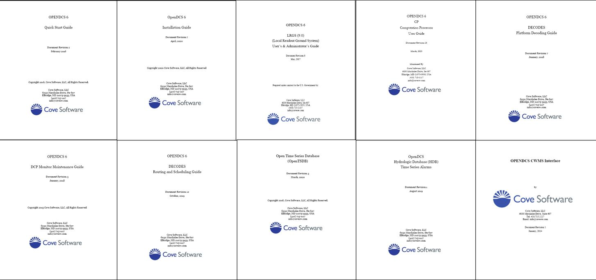

Welcome to OpenDCS's documentation!
===================================

**OpenDCS** suite of software for collecting, decodes, storing, and 
manipulating time series data.

.. note::

   This project is under active development.

Documentation Outline
---------------------
OpenDCS documentation is currently divided into four sections:

#. Staying Involved: Intended for users of all levels
#. Getting Started: Intended for new users
#. Resources: Intended for intermediate users
#. Developer Documentation: Intended for advanced users or developers
#. Legacy Documentation and References: Intended for users familiar with the content in legacy PDF documentation

The **Staying Involved** part of this documentation is intended
for users of all levels.  This section contains information
about the OpenDCS Project.  

* How to sign up for notifications
* How to get involved with development
* Information about the GitHub repository

The **Getting Started** part of this documentation is intended
for new users.  Once reviewed one should be familiar with the 
following topics:

* How to set up and install OpenDCS
* How to launch the GUI and learn the main menu
* What OpenDCS is used for
* What the main pieces and parts of a time series are
* What primary pieces comprise of a routing spec
* What are the fundamental operations that make up decoding scripts
* How to set up basic computations 
* How to set-up screening for a time series

The **Resources** part of this documentation is intended
for users who already have some familiarity with OpenDCS. It
assumes users are familiar with the sections above.  These
pages are for users looking for the following:

* Simple examples of operational DECODES scripts
* Background on the "standard" algorithms
* Guidance on how to set up a custom algorithms
* Additional information about computations
* Examples of how to import screening criteria

The **Developer Documentation** part is intended for developers.
It is for advanced users.  Targeted audience is familiar
with the code development and testing practices.

The **Legacy Documentation** part contains content and pages that 
used to be provided in the PDF documentation.  The content was 
migrated from PDFs to read the docs format.  This part is referred to 
as legacy documentation as it serves as a reference and 
contains lots of information at a deeper level than is 
typically relevant to the GUI end-user.  

* :doc:`OPENDCS-QuickStart <./legacy-quick-start>`
* :doc:`OPENDCS-Installation-Guide <./legacy-install-guide>`
* :doc:`OPENDCS-LRGS-UserGuide <./legacy-lrgs-userguide>`
* :doc:`OPENDCS-CP-UserGuide <./legacy-cp-userguide>`
* :doc:`OPENDCS-Platform-Decoding-Guide <./legacy-decoding-guide>`
* :doc:`OPENDCS-OpenTSDB <./legacy-tsdb>`
* :doc:`OPENDCS-Alarms <./legacy-alarms>`
* :doc:`OPENDCS-CWMS-Interface <./legacy-cwms-interface>`

To access legacy PDFs see the https://github.com/opendcs/opendcs/wiki/Documentation page. 
Reminder - legacy PDFs are no longer being updated.  

.. toctree::
   :maxdepth: 1
   :caption: Staying Involved
   
   Involvement <./involved-opendcs.rst>
   
.. toctree::
   :maxdepth: 1
   :caption: Getting Started
   
   Software Set-Up <./start-software.rst>
   Time Series - Intro <./start-timeseries.rst>
   Routing Spec - Intro<./start-routingspec.rst>
   DECODING - Intro<./start-decoding.rst>
   Computations - Intro <./start-computations.rst>
   Screening - Intro <./start-screening.rst>
   
.. toctree::
   :maxdepth: 1
   :caption: Resources
   
   DECODING <./resources-decoding.rst>
   Algorithms <./resources-algorithms.rst>   
   Computations <./resources-computations.rst>
   Screening Editor <./resources-screening.rst>
   
.. toctree::
   :maxdepth: 1
   :caption: Developer Documentation
   
   Developer Documentation <./dev-docs.rst>
   Algorithm Development <./algorithm-dev.rst>
   
.. toctree:: 
   :maxdepth: 1
   :caption: Legacy Documentation
   
   Quick Start <./legacy-quick-start.rst>
   Install Guide <./legacy-install-guide.rst>
   LRGS Guide <./legacy-lrgs-userguide.rst>
   Computation Guide <./legacy-cp-userguide.rst>
   DECODES Guide <./legacy-decoding-guide.rst>
   Routing & Scheduling Guide <./legacy-routesched-guide.rst>
   Snotel Addendum <./legacy-snotel.rst>
   TimeSeriesDatabase <./legacy-tsdb.rst>
   Alarms <./legacy-alarms.rst>
   CWMS Interface <./legacy-cwms-interface.rst>
   
   
