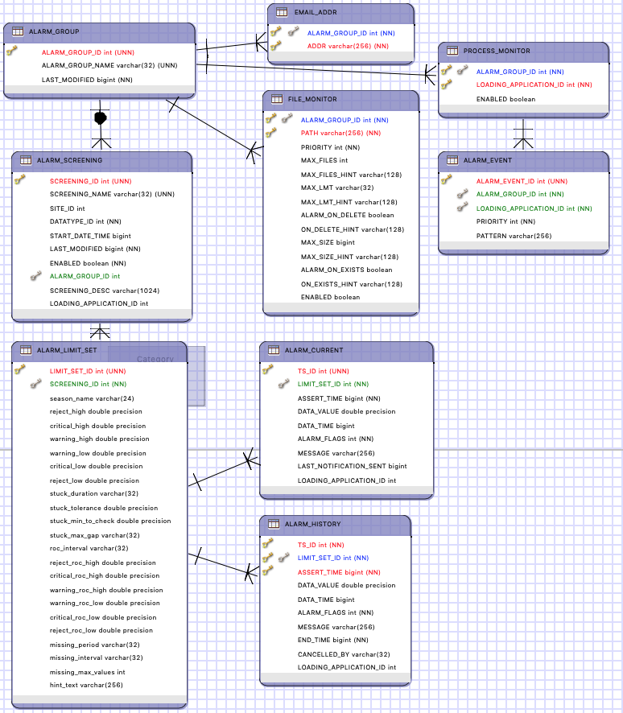
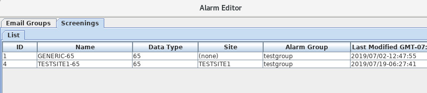
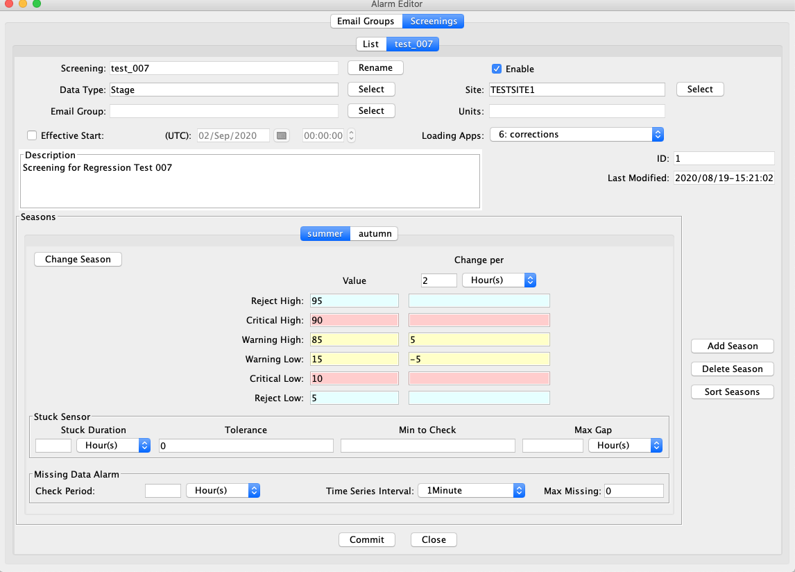
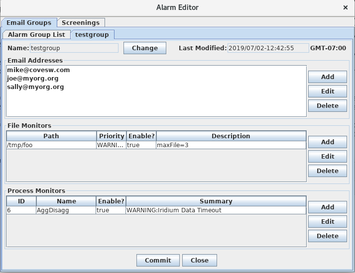
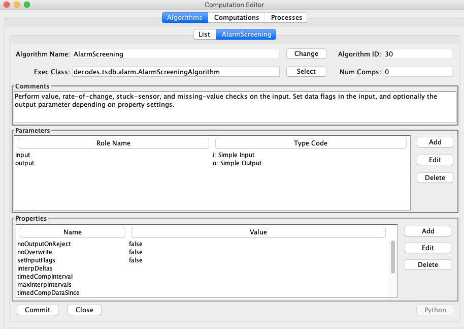
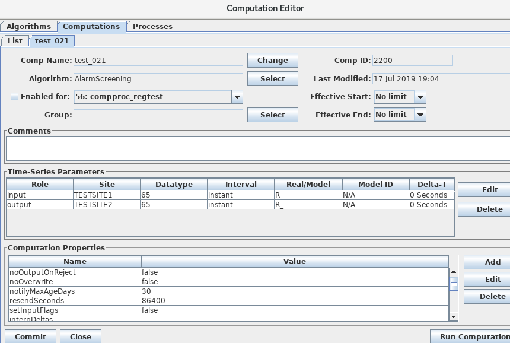
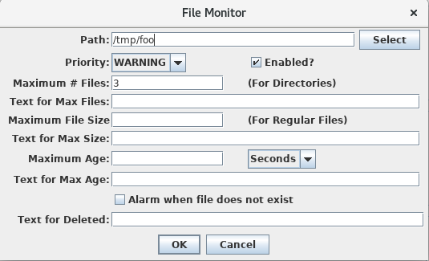
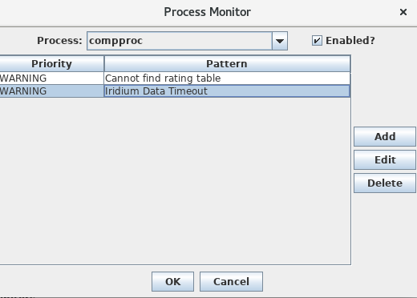

##################
Time Series Alarms
##################

..
    Document Revision 2

    September 2020

    This Document is part of the OpenDCS Software Suite for environmental
    data acquisition and processing. The project home is:
    https://github.com/opendcs/opendcs

    See INTENT.md at the project home for information on licensing.

.. note::

    Originally built for Hydrologic Database (HDB), may work with other 
    supported databases.

.. contents. Table of Contents
   :depth: 3

Introduction
============

This document describes an enhancement added to the OpenDCS Computation
Processor for use by the United States Bureau of Reclamation. The
enhancement supports data screening and the generation of automated
Alarms based on the results of the screening.

There are four types of screening checks:

-  Value Limits

-  Rate of Change Limits

-  Stuck Sensor Checks

-  Missing Data Checks

For both Value and Rate of Change (ROC) Limits, the user can specify
different severities which divide the range into seven possibilities:

-  Reject High: Value or ROC is impossibly high – bad data

-  Critical High: Value or ROC is in a critical high range

-  Warning High: Value or ROC is somewhat high

-  (Good Range – No Limits Violated)

-  Warning Low: Value or ROC is somewhat low

-  Critical Low: Value or ROC is in a critical low range

-  Reject Low: Value or ROC is impossibly low – bad data

Any or all of the limits can be specified. E.g., perhaps you just need a
Value-Warning-High limit and leave the others undefined.

To detect stuck sensors, you specify the following:

-  Duration over which to check, e.g., check to see if a sensor value is
   stuck for more than “1 day”, “48 hours”, “5 days”.

-  Tolerance: Defines what it means to be stuck. A value changing by
   more than this is considered unstuck. Zero or NULL means any change
   is considered unstuck.

-  Minimum Value to Check: Below this, no stuck sensor checking is done.

-  Max Gap: This prevents missing data from being interpreted as a stuck
   sensor. If you have a gap longer than this in the period being
   checked, then no alarm is asserted.

For Missing Data Checks, you specify the following:

-  Missing Period: The period over which to check for missing data. E.g.
   “1 day”, “48 hours”

-  Missing Interval: The Interval of the time series to check for
   missing values. This cannot be an INSTANT time series, otherwise the
   system does not know how many values to expect. The system will check
   for missing data at this interval.

-  Max Missing Values: The maximum number of missing values in the
   period to accept before declaring an alarm. Missing values do not
   have to be contiguous.

For example, if Missing Period is “48 hours”, interval is “Hour”, and
Max Missing is 3, this means that if more than three missing hourly
values are detected within any 48 hour period, declare a missing data
alarm. Note that missing values do not need to be contiguous within the
period.

When an alarm condition is detected, a “ALARM_CURRENT” record is stored
in the database. Later, the alarm may be resolved in a number of ways:

-  Value or ROC returns to normal range.

-  A stuck sensor becomes unstuck.

-  New data is received for a time series that was previously declared
   Missing.

-  A user manually cancels an alarm.

When an alarm is resolved it is moved to the “ALARM_HISTORY” table and
an end time is assigned.

Email Notifications may optionally be sent when alarm conditions are
detected and resolved. An ALARM_GROUP defines a list of email addresses.

The enhancment to OpenDCS presented here expands on previous work done
for a different client. That client required alarms to be generated when
certain conditions were detected on files or on the event messages being
generated by some process.

Database Tables for Alarms
==========================

The Entity Relationship Diagram for Alarms is shown below.

An ALARM_GROUP contains a list of EMAIL_ADDR records. It is also
associated with PROCESS_MONITOR and FILE_MONITOR records described
elsewhere.

An ALARM_SCREENING is associated with a DATATYPE and optionally a SITE.
Records without SITE assignment can define a kind of default for a data
type. For example, you might define a screening with
datatype=Incremental Precip and no site assignment.

When checking a value, the system looks first for a screening with
matching SITE and DATATYPE. Then if not found, a match for only DATATYPE
will be used.

An ALARM_SCREENING may have a START_DATE_TIME. If so, only values after
the specified start will be checked with this screening. For example,
you may have limits that evolve over time for a given Site/DataType.
There may be a series of ALARM_SCREENING records with different
START_DATE_TIMEs. The appropriate record will be used depending on the
data time.

A screening may have multiple seasonal ALARM_LIMIT_SET records. If you
do not need seasonal checks, simply leave SEASON_NAME undefined. A limit
set with no SEASON_NAME will be the default for data that does not occur
within a named season.

The Limit Set holds all of the limits that control how checks are done.
The names in the ERD above are self explanatory.

ALARM_CURRENT holds currently-asserted alarms. ALARM_HISTORY holds
alarms that have been asserted and resolved in the past. In these
tables:

-  TS_ID is a foreign key to CP_TS_ID in HDB, or the time series *code*
   in CWMS.

-  LIMIT_SET_ID is a foreign key to ALARM_LIMIT_SET containing the
   limits used to generate this alarm.

-  ASSERT_TIME is a Java millisecond time (milliseconds since the Unix
   epoch Jan 1, 1970 midnight UTC. This is the time that the alarm was
   initially generated—that is, the time the value limits were first
   violated.

-  DATA_TIME is the time-stamp (Java msec) of the first value that
   violated the limits.

-  END_TIME is one of the time-stamp (Java msec) of the first value
   where the value went back within limits and the alarm was moved from
   the current table to the history table.

Note that ALARM_SCREENING is associated with a Site/Datatype but not the
other parameters that specify a unique time series such as Interval,
Real/Modeled, Model ID. Assigning specific time series is done in the
normal way for the Computation Processor: By assigning a time series to
a computation.

For OpenDCS 6.8, LOADING_APPLICATION_ID was added to ALARM_SCREENING,
ALARM_CURRENT, and ALARM_HISTORY. The ID must be set in ALARM_SCREENING
and must match the application ID assigned to the screening algorithm.

Alarm Editor
============

The program “alarmedit” will allow you to maintain all of the screening
records in a GUI. It is structured like the computations editor and the
DECODES database editor. At the top level there are two tabs:

-  Email Groups – a list of named Email groups in the database from
   which you can open, create new, copy, or delete

-  Screenings – a list of named screenings in the database

In both cases you can sort the list in various ways by clicking the
column header.

Screenings and Limit Sets
-------------------------

The snapshot below shows a screening open in the editor. You can see
that the fields shown in the GUI match the columns in the database
tables shown in section 2. Note the following:

-  The screening shown is named “GENERIC-65”. All screenings have a
   unique name.

-  It is called GENERIC-65 because the datatype is 65 (in HDB this
   refers to instantaneous stream stage) and no site is defined. This
   mean that this screening will be used when the algorithm can’t find a
   screening with a matching site.

-  This screening is associated with Email Group “testgroup”, meaning
   that when an alarm is generated an email will be sent to the
   recipients in that group.

-  The Units field shows you the units in which alarms are specified. In
   HDB, these are always the database storage units for the DATATYPE
   specified.

-  No Effective Start is applied, meaning that there is no lower bound
   on the time range for this screening.

-  The screening has a single Season Tab labeled “default”. The
   “default” season is used for date/times not within any of the other
   seasons. If you don’t need seasonal limits, use only the default
   season. You can Add, Delete, or Sort the season tabs with the buttons
   on the right.

-  For Value and ROC limits, only specify the limits you need.

-  The screening shown does not define a missing data alarm because the
   required Check Every field is left blank.

Email Groups
------------

Email groups let you specify a list of email addresses. This feature
builds on a previous OpenDCS feature added for another client that
allows you to send Email alarms based on file and event conditions.

The snapshot below shows an email group with 3 email addresses. When an
alarm is generated or resolved that is assigned to this group, email
notifications will be sent to each recipient.

Alarm Screening Computations
============================

For OpenDCS 6.6 RC04 there is a new Alarm Screening Algorithm. If you do
not have this algorithm in your database yet, import it as follows:

compimport $DCSTOOL_HOME/imports/comp-standard/AlarmScreening.xml

After import, restart the computation editor GUI and the Alarm Screening
will now appear on the Algorithms tab.

The AlarmScreening algorithm has one input and one optional output. They
may refer to the same time series or you can leave the output undefined.
Properties control how flags are set on input and output parameters.

Properties specific to the algorithm are:

+----------------+--------+--------------------------------------------+
| Name           | Type   | Description                                |
+================+========+============================================+
| setInputFlags  | B\     | (default=false) Normally the flags are set |
|                | oolean | on the output only. Set this to true to    |
|                |        | have flags set on the input values as      |
|                |        | well. Recall that the output parameter is  |
|                |        | optional. If undefined, then you should    |
|                |        | set ‘setInputFlags’ to TRUE.               |
+----------------+--------+--------------------------------------------+
| no\            | B\     | (default=false) If set, and if the input   |
| OutputOnReject | oolean | value is in a rejected value or            |
|                |        | rate-of-change range, then the output      |
|                |        | value is *not* written.                    |
+----------------+--------+--------------------------------------------+
| noOverwrite    | B\     | (default=false) If true, then the output   |
|                | oolean | is *not* written if there is already an    |
|                |        | output value at that time. This allows you |
|                |        | to manually modify a value’s flags in HDB  |
|                |        | without fear that reprocessing will        |
|                |        | overwrite your manual changes.             |
+----------------+--------+--------------------------------------------+
| setDataFlags   | B\     | (default=true) Normally, you want the      |
|                | oolean | flags resulting from screening to be saved |
|                |        | with each time series value. An exception  |
|                |        | would be if you have multiple *different*  |
|                |        | screenings assigned to the same time       |
|                |        | series to be executed by different loading |
|                |        | applications. In this case, you only want  |
|                |        | one of the screenings to write flags. Set  |
|                |        | this property to false to the *other*      |
|                |        | screening to prevent it from writing       |
|                |        | flags.                                     |
+----------------+--------+--------------------------------------------+

The algorithm does the following when an input value arrives and
triggers the computation:

-  Lookup the applicable screening and limit set according to the
   input’s datatype and site designation. The screening start date/time
   and the limit set’s season assignment are also taking into account.

   -  *Note: in OpenDCS 6.8, LOADING_APPLICATION_ID in the screening
      must also match the ID assigned to the computation. This was added
      to allow you to have multiple different screenings for each TSID,
      as long as they’re assigned to different loading applications.*

-  Perform the value, rate-of-change, and stuck-sensor checks. This
   results in a set of bit flags.

   -  If (setInputFlags == true), then the flags are set on the input
      value

   -  If an output is defined, set the flags on the output value

-  If a *new* alarm condition is detected, create or update an entry in
   the ALARM_CURRENT table.

   -  Do not rewrite existing identical records. E.g. if a
      Value-Warning-High alarm was already in effect and this value is
      also Value-Warning-High, no change is made to the ALARM_CURRENT
      record.

-  If a previous alarm condition is now resolved (e.g. a stuck sensor
   becomes un-stuck), move the alarm record to ALARM_HISTORY.

-  When ALARM_CURRENT records are created, updated, or moved to the
   history table, if an email group is assigned to the screening, send
   email to the recipients in the group.

The Alarm Computation assigns specific time series to be screened. The
example below is rather contrived. It shows a computation that does a
screening on datatype 65 (instantaneous stream stage) at a site
TESTSITE1, and writes the output to TESTSITE2.

Missing Data Checks
-------------------

Missing Data Checks are specified by:

-  The period over which the check is done. You specify this with a
   string like “72 hours” or “1 day”.

-  The time series interval: this tells the algorithm the interval of
   the time series to check. It also implicitly tells the system how
   often to expect a value.

-  Maximum number of Missing Values to tolerate before generating an
   alarm. If you set to 0, then any missing data generates an alarm. If
   you set to 4, then an alarm is generated on 5 or more missing values
   in the period.

Missing Checks are done by the computation process at the specified time
series interval. Each time, it scans backward over the specified period
and determines the number of missing values. If this is greater than the
specified threshold, a missing data alarm is asserted.

Configure Computation Process for Email Notifications
-----------------------------------------------------

The following properties control the connection to the mail SMTP server.
These properties are set in the Loading Application Record. In the
Computations Editor, click the Processes Tab. Open the process that will
run the alarm computations. You may apply the following properties.

Assigning these to the application means that all alarm computations
assigned to the same application will use the same mail server settings.

If you want email notifications to come from the computation editor when
running an alarm computation, be sure to also set these properties in
the “compedit” process record.

+---------------------+---------+--------------------------------------+
| **Property Name**   | **De\   | **Description**                      |
|                     | fault** |                                      |
+=====================+=========+======================================+
| mail.smtp.host      | no\     | This is required in order to send    |
|                     | default | alarm email. The host name or IP     |
|                     |         | address of the mail server.          |
|                     |         |                                      |
|                     |         | Remove this property or set it to    |
|                     |         | blank to disable email output        |
|                     |         | altogether.                          |
+---------------------+---------+--------------------------------------+
| mail.smtp.port      | 587     | TCP port for connecting to mail      |
|                     |         | server                               |
+---------------------+---------+--------------------------------------+
| mail.smtp.auth      | false   | (true/false) if true, then perform   |
|                     |         | an authenticated connection to the   |
|                     |         | mail server. If true, then you must  |
|                     |         | also set smtp.username and           |
|                     |         | smtp.password.                       |
+---------------------+---------+--------------------------------------+
| mail.s\             | false   | (true/false) if true, then use TLS   |
| mtp.starttls.enable |         | (SSL) for a secure connection to the |
|                     |         | mail server.                         |
+---------------------+---------+--------------------------------------+
| smtp.username       | no      | Required if mail.smtp.auth is true,  |
|                     | default | this is the user name for connecting |
|                     |         | to the mail server.                  |
+---------------------+---------+--------------------------------------+
| smtp.password       | no      | Required if mail.smtp.auth is true,  |
|                     | default | this is the password for connecting  |
|                     |         | to the mail server.                  |
+---------------------+---------+--------------------------------------+
| fromAddr            | no      | Set this to the email address to be  |
|                     | default | used in the ‘from’ field of the      |
|                     |         | header.                              |
+---------------------+---------+--------------------------------------+
| fromName            | no      | Set to the name for the from field   |
|                     | default | of the header.                       |
+---------------------+---------+--------------------------------------+
| resendSeconds       | 86400   | Number of seconds. Resend email for  |
|                     |         | existing alarms after they have been |
|                     |         | asserted for this long. Set to -1 to |
|                     |         | disable resend.                      |
+---------------------+---------+--------------------------------------+
| notifyMaxAgeDays    | 30      | Do not send email notifications for  |
|                     |         | alarms on data older than this.      |
+---------------------+---------+--------------------------------------+
| resendSeconds       | 86400   | Normal email is not sent when an     |
|                     |         | existing alarm is re-asserted, e.g.  |
|                     |         | a WARNING-HIGH value is detected but |
|                     |         | the previous value was also          |
|                     |         | WARNING-HIGH. Email will be only be  |
|                     |         | sent if the last notification was    |
|                     |         | longer than this many seconds ago    |
|                     |         | (default = 1 day worth of seconds).  |
|                     |         | If you never want repeat emails, set |
|                     |         | to -1.                               |
+---------------------+---------+--------------------------------------+
| notifyMaxAgeDays    | 30      | Do not send email notifications for  |
|                     |         | alarm conditions on data older than  |
|                     |         | this.                                |
+---------------------+---------+--------------------------------------+

Import and Export Screening Records
===================================

The alarmexport and alarmimport utilities can export screening records
to and import from XML files.

Export Alarm Records to XML File
--------------------------------

.. code-block:: bash

    alarmexport [*options...]*

The following arguments can be used in combination to filter which
screenings are written to the output XML file.

As with most opendcs programs, the –x argument will result in a help
message containing all allowable options.

   -C Export current alarm screenings only. I.e. not those superseded
   with a later start date.

   -T *datatype* Export only screenings for a given data type.

   -F Include file and process alarms in the output.

   -G *alarmGroupName* Export only screenings assigned to the named
   group.

   -S *siteName* Export only screenings for a given site.

The –d, -g, and –s arguments may occur multiple times for multiple data
types, groups, and sites, respectively.

Data Types may be simple strings to match the preferred data type, or of
the form::

    *Standard:Code*

to specify data types of a given standard. For example::

    SHEF-PE:HG
    CWMS:Stage-Tailwater
    HDB:65

Likewise, Site Names may be simple names to match the preferred name
type or may be specified as *nametype:namevalue*. E.g.::

    NWSHB5:M1DRN
    CWMS:PatapscoJunction

Import Alarm Records from XML File
----------------------------------

.. code-block:: bash

    alarmimport [*options...]* filename(s)

Include the file name(s) to be imported at the end of the command line.

XML File Format
---------------

Here is an example alarm file that demonstrates the format:

.. code-block:: xml

    <?xml version="1.0" encoding="UTF-8" standalone="yes"?>
    <AlarmDefinitions>
        <AlarmGroup name="test-group">
            <Email>mike@covesw.com</Email>
            <FileMonitor path="somepath" priority="WARNING">
                <OnDelete hint="7"/>
                <MaxFiles hint="2">1</MaxFiles>
                <MaxSize hint="4">3</MaxSize>
                <MaxLMT hint="6">5 Seconds</MaxLMT>
                <Enabled>true</Enabled>
            </FileMonitor>
            <ProcessMonitor name="compproc">
                <Enabled>true</Enabled>
                <AlarmDef priority="FAILURE">failure</AlarmDef>
                <AlarmDef priority="WARNING">WARNING</AlarmDef>
            </ProcessMonitor>
        </AlarmGroup>
        <AlarmScreening name="test screening">
            <alarmGroupName>test-group</alarmGroupName>
            <desc>a description of a test screening</desc>
            <datatype standard="SHEF-PE">HG</datatype>
            <Enabled>true</Enabled>
            <AppName>compproc</AppName>
            <AlarmLimitSet season="spring">
                <RejectHigh>100.0</RejectHigh>
                <CriticalHigh>80.0</CriticalHigh>
                <WarningHigh>60.0</WarningHigh>
                <WarningLow>40.0</WarningLow>
                <CriticalLow>20.0</CriticalLow>
                <RejectLow>0.0</RejectLow>
                <stuckDuration>1 day</stuckDuration>
                <stuckTolerance>0.0</stuckTolerance>
                <stuckMinToCheck>0.0</stuckMinToCheck>
                <stuckMaxGap>5 hours</stuckMaxGap>
                <rocInterval>2 hours</rocInterval>
                <RejectRocHigh>100.0</RejectRocHigh>
                <CriticalRocHigh>80.0</CriticalRocHigh>
                <WarningRocHigh>60.0</WarningRocHigh>
                <WarningRocLow>40.0</WarningRocLow>
                <CriticalRocLow>20.0</CriticalRocLow>
                <RejectRocLow>0.0</RejectRocLow>
                <missingPeriod>1 day</missingPeriod>
                <missingInterval>15Minutes</missingInterval>
                <missingMaxValues>4</missingMaxValues>
            </AlarmLimitSet>
        </AlarmScreening>
    </AlarmDefinitions>

Alarm Flags
===========

Each time series value in the database also stores a set of flags. These
flags indicate whether the value was screened, and if so, what the
results of the screening were.

The flags are stored with each record in the time series tables in the
database. They are also stored in the ALARM_CURRENT and ALARM_HISTORY
tables when alarms are asserted. (Obviously the “missing value” code
will only be in the alarm tables because there is no time series
record.)

The following alarm definitions are applicable to HDB and OpenTSDB:

+---------------+---------+---------+---------------------------------+
| **Condition** | **Bits  | **Di\   | **Description**                 |
|               | (hex)** | splay** |                                 |
+===============+=========+=========+=================================+
| Screened      | 0\      | S(*\    | Indicates that the value has    |
|               | 0010000 | codes*) | been screened. Any error codes  |
|               |         |         | will be contained within the    |
|               |         |         | parentheses.                    |
+---------------+---------+---------+---------------------------------+
| Value Code    | 0\      |         | Mask used to extract the value  |
| Mask          | 00E0000 |         | results from the flags word.    |
+---------------+---------+---------+---------------------------------+
| Value Reject  | 0\      | R+      | Value was >= reject high limit  |
| High          | 0020000 |         |                                 |
+---------------+---------+---------+---------------------------------+
| Value Crit    | 0\      | ++      | Value was >= critical high      |
| High          | 0040000 |         | limit                           |
+---------------+---------+---------+---------------------------------+
| Value Warn    | 0\      | +       | Value was >= warning high limit |
| High          | 0060000 |         |                                 |
+---------------+---------+---------+---------------------------------+
| Value Warn    | 0\      | -       | Value was <= warning low limit  |
| Low           | 0080000 |         |                                 |
+---------------+---------+---------+---------------------------------+
| Value Crit    | 0\      | --      | Value was <= critical low limit |
| Low           | 00A0000 |         |                                 |
+---------------+---------+---------+---------------------------------+
| Value Reject  | 0\      | R-      | Value was <= reject low limit   |
| Low           | 00C0000 |         |                                 |
+---------------+---------+---------+---------------------------------+
| ROC Code Mask | 0\      |         | Mask used to extract the        |
|               | 0700000 |         | rate-of-change results from the |
|               |         |         | flags word.                     |
+---------------+---------+---------+---------------------------------+
| ROC Reject    | 0\      | R^      | ROC was >= reject high limit    |
| High          | 0100000 |         |                                 |
+---------------+---------+---------+---------------------------------+
| ROC Crit High | 0\      | ^^      | ROC was >= critical high limit  |
|               | 0200000 |         |                                 |
+---------------+---------+---------+---------------------------------+
| ROC Warn High | 0\      | ^       | ROC was >= warning high limit   |
|               | 0300000 |         |                                 |
+---------------+---------+---------+---------------------------------+
| ROC Warn Low  | 0\      | v       | ROC was <= warning low limit    |
|               | 0400000 |         |                                 |
+---------------+---------+---------+---------------------------------+
| ROC Crit Low  | 0\      | vv      | ROC was <= critical low limit   |
|               | 0500000 |         |                                 |
+---------------+---------+---------+---------------------------------+
| ROC Reject    | 0\      | Rv      | ROC was <= reject low limit     |
| Low           | 0600000 |         |                                 |
+---------------+---------+---------+---------------------------------+
| Stuck Sensor  | 0\      | ~       | Stuck sensor was detected       |
|               | 0800000 |         |                                 |
+---------------+---------+---------+---------------------------------+
| Missing Data  | 0\      | m       | Missing data threshold was      |
|               | 1000000 |         | reached                         |
+---------------+---------+---------+---------------------------------+

In HDB, the Display codes are stored in the “derivation_flags” values in
the R\_\ *interval* tables.

Display codes are also used in GUIs and command-line utilities that
display the results of validation. Multiple codes are possible resulting
from a screening. For example, the following indicates that after a
screening, a time series value exceeded the high warning value limit
*and* the critical rate-of-change limit::

    S(+ ^^)

The bits in the above table are used internally inside the computation
processor. You will need to use these if you are writing algorithm code
in either Java or Python and you need to use screening results.

In OpenTSDB, the flag word associated with each value uses the bit
definitions in the above table.

In CWMS, the screening conditions will have to be mapped to existing
CWMS flag bit definitions. this work is TBD.

Display Alarms
==============

The ‘showAlarms’ utility can be used to show currently asserted and
historical alarms. Running without any arguments will display all
alarms::

    showAlarms > allAlarms.csv

To display only alarms for particular time series, add a list of time
series identifiers::

    showAlarms TESTSITE1.66.hour.R\_ TESTSITE2.66.hour.R\_ > someAlarms.csv

The format is a comma-separated value format that can be easily imported
into Excel. The following shows that there are no currently-asserted
alarms and several recent (but historical) alarms for
TESTSITE1-66.hour.R\_::

    All times in UTC

Current Alarms(0)::

    tsid,screening,season,assertion,value,data_time,flags,msg,last_notify,loading_app

Historical Alarms (9)::

    tsid,screening,season,assertion,value,data_time,flags,msg,end_time,cancelled_by,loading_app

    TESTSITE1.66.hour.R_, TESTSITE1-66, default, 2019/08/28-10:47:07, 34.45,
    2019/08/28-09:00:00, 0x90000, Value 34.45 at time 2019/08/28-02:00:00:
    value in WARNING_LOW range., 2019/08/28-10:00:00,compproc

    TESTSITE1.66.hour.R_, TESTSITE1-66, default, 2019/08/28-07:47:07, 34.5,
    2019/08/28-07:00:00, 0x70000, Value 34.5 at time 2019/08/28-00:00:00:
    value in WARNING_HIGH range., 2019/08/28-07:00:00,compproc

    TESTSITE1.66.hour.R_, TESTSITE1-66, default, 2019/08/28-00:47:08, 34.5,
    2019/08/28-05:00:00, 0x70000, Value 34.5 at time 2019/08/27-22:00:00:
    value in WARNING_HIGH range., 2019/08/28-06:00:00,compproc

    TESTSITE1.66.hour.R_, TESTSITE1-66, default, 2019/08/27-22:47:08, 34.52,
    2019/08/27-22:00:00, 0x70000, Value 34.52 at time 2019/08/27-15:00:00:
    value in WARNING_HIGH range., 2019/08/27-23:00:00,compproc

    TESTSITE1.66.hour.R_, TESTSITE1-66, default, 2019/08/27-21:47:15, 34.52,
    2019/08/27-20:00:00, 0x70000, Value 34.52 at time 2019/08/27-13:00:00:
    value in WARNING_HIGH range., 2019/08/27-21:00:00,compproc

    TESTSITE1.66.hour.R_, TESTSITE1-66, default, 2019/08/27-19:47:09, 34.5,
    2019/08/27-19:00:00, 0x70000, Value 34.5 at time 2019/08/27-12:00:00:
    value in WARNING_HIGH range., 2019/08/27-19:00:00,compproc

File Monitors and Process Monitors
==================================

These are legacy features and have nothing to do with the Computation
Processor. A special “Alarm Monitor” task can be started with the
“alarmmonitor” script. The AlarmMonitor daemon will look in the database
for Email Groups, File Monitors, and Process Monitors and then run in
the background performing the indicated checks.

The AlarmMonitor process record should be given the same properties
described above for the Computation Processor in section 4.2.

A File Monitor allows you to watch a directory or normal file for
abnormal conditions, and then to send email notifications when they are
detected. A record in the GUI is shown below.

You can cause email notifications to be sent on the following
conditions.

-  If the Path specifies a directory, you can specify the maximum number
   of files that can be in the directory before an email notification is
   sent.

-  If the Path specifies a regular file, you can specify the maximum
   file size.

-  For either file or directory you can specify the maximum age, that
   is, the amount of time elapsed since the file or directory was last
   modified.

-  You can alarm if the file does not exist (i.e. was deleted.

For each notification you can specify additional text to be included in
the email notifications.

For Process Monitors, the alarm monitor task will connect to one of the
supported OpenDCS processes and collect events as they happen. It
searches for events with a matching priority that contains the specified
pattern. If these are detected then become email notifications.

In the above example, the Alarm Monitor task will connect to the
application named “compproc” and monitor the events being generated by
it. (Note: only INFO, WARNING, FAILURE, and FATAL events will be
monitored, not DEBUG messages.)

When it sees a WARNING message containing the string “Cannot find rating
table”. The event message will be emailed to the members of the group.

BC Hydro Alarm Mailer
=====================

For version 7.0.2, a special alarm mailer class was added to support the
special alarm email format required by BC Hydro. To activate this, add a
property “mailer.class” to the process record and set the value to::

    decodes.tsdb.alarm.mail.BCHydroAlarmMailer
