##################
Installation Guide
##################

This Document is part of the OpenDCS Software Suite for environmental
data acquisition and processing. The project home is:
https://github.com/opendcs/opendcs

See INTENT.md at the project home for information on licensing.

.. contents. Table of Contents
   :depth: 3

Overview
========

OPENDCS is a collection of tools for collecting hydrometeorologic data.
It was developed originally for use with the GOES (Geostationary
Operational Environmental Satellite) DCS (Data Collection System). These
tools have been developed over the last decade (starting in 1999) and
are used heavily by several U.S. Federal government agencies.

Included in OPENDCS:

-  LRGS (Local Readout Ground Station) – a background server process and
   collection of GUI tools for collecting raw data via satellite links
   and over the network from other LRGS systems.

-  Client-side GUI tools for LRGS – DCP Message Browser connects to any
   LRGS server, retrieve raw DCP messages based on a variety of search
   criteria. Display raw and/or decoded messages on the screen and/or
   save to file.

-  DECODES (DEvice COnversion and DElivery System) – A sophisticated
   collection of GUI and background process to decode data from any
   platform and reformat into a large number of standard formats.

-  OPENTSDB (Open Time Series Database) – will be released with OPENDCS
   6.1, this is a powerful time series database engine modeled on CWMS
   (Corps Water Management System).

-  Computation Processor – Can be used with CWMS, HDB (USBR’s Hydrologic
   Database), or OPENTSDB. A collection of GUIs and background processes
   that perform real-time computations and validations on a time series
   database.

Glossary and List of Acronyms
-----------------------------

CP Computation Processor – the background program that executes
computations as new data arrives.

CCP CWMS Computation Processor – i.e. the CP configured for CWMS.

CWMS Corps Water Management System (pronounced ‘swims’) - A system for
hydrologic data storage and analysis used by USACE.

DAS Data Acquisition Server – responsible for collecting raw DCP
messages via a variety of satellite and internet links.

DBMS Database Management System

DCP Data Collection Platform – equipment in the field that collects and
transmits raw environmental measurements.

DCS Data Collection System

DECODES DEviceCOnversion and DElivery System – A collection of software
for decoding raw environmental data, and converting it to a time-series
in a variety of formats.

ERD Entity Relationship Diagram

GUI Graphical User Interface

HDB Hydrologic Database – A system for hydrologic data storage an
analysis used by USBR.

LRGS Local Readout Ground Station – This is synonymous with DAS. It is
the legacy name for a Data Acquisition Server.

NWIS National Water Information System - A system for hydrologic data
storage an analysis used by USGS.

SDI Site Data-type ID. In HDB this is used to denote a particular
parameter at a particular site. It is stored as a numeric ID.

SQL (a.k.a. “sequel”) Structured Query Language

TSDB Time Series Database

USACE U. S. Army Corps of Engineers

USBR U. S. Bureau of Reclamation

USGS U. S. Geological Survey

XML Extensible Markup Language

Installing OPENDCS
==================

There are two types of installations:

-  Single User Installation. Only one user will use OpenDCS. This user
   will own all the installation files and directories.

-  Multiple user Installation appropriate for Unix or Linux systems
   where multiple user accounts must use OpenDCS. A central designated
   user (we recommend user name “opendcs”) will own the installation
   files and directories. Other users may run OpenDCS from their own
   accounts.

Single User OPENDCS Installation
--------------------------------

This is the simplest type of installation. It is appropriate for Windows
and other systems where a single-user will run the software.

Install OpenDCS *as the user who will run the utilities*. This user owns
OpenDCS files. This ensures there will be no issues with permissions.
This user will have full access to all utilities and configurations.

Start the installation by executing the downloaded installer JAR (Java
Archive) file. On Windows, you can likely double-click the file icon in
the windows explorer. On other system, CD to the directory where you
downloaded the file and execute the following command::
 
    java –jar *downloaded-file-name*

The installer guides you through a series of screens:

Welcome Screen:

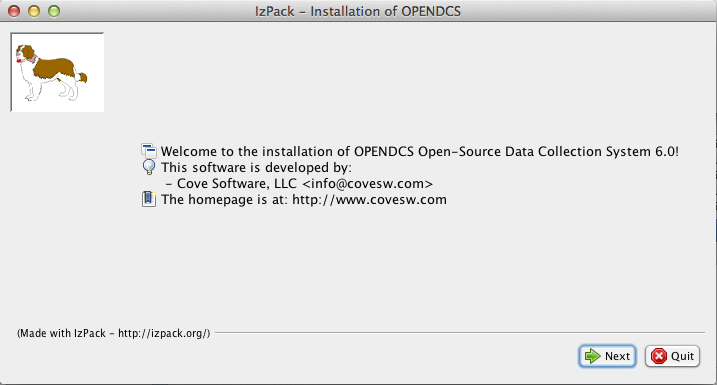

Select an installation location. The installer will create a tree of
files under the location that you specify.

-  For Unix/Linux installations, we recommend that you run the installer
   as the user that will own the installation files.

-  For Windows installations, we recommend that you avoid directory
   names that have embedded spaces. For example, do not place the
   software under ‘C:\Program Files’.

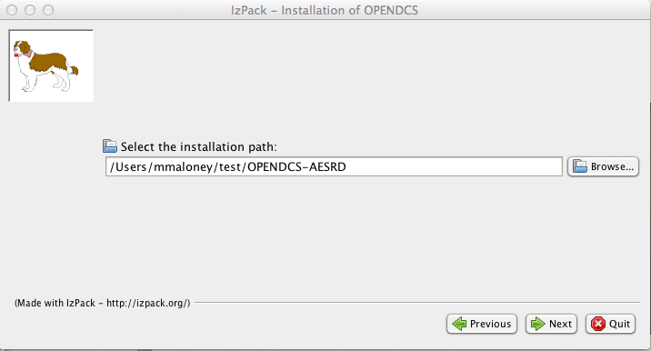

Select the packages that you want to install.

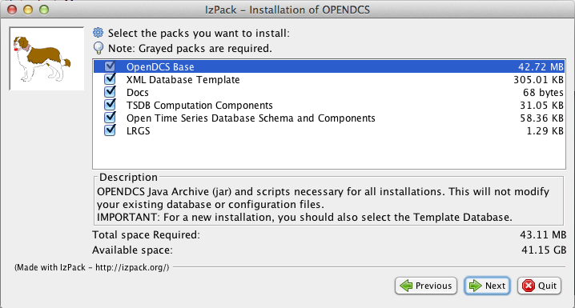

Allow the installation to complete:

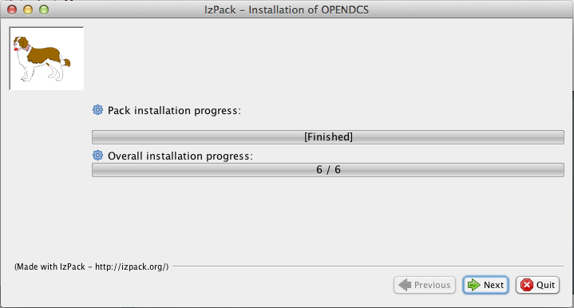

Go all the way to the final screen and hit ‘Done’. *Warning: Exiting the
installer prior to the final screen may leave the software in an
unusable state!*

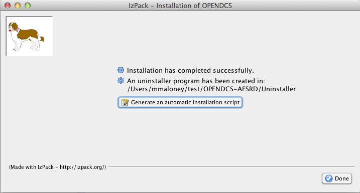

After installation we recommend that you establish an environment
variable DCSTOOL_HOME pointing to the installation directory. Then place
OPENDCS’s *bin* directory in your path.

So, for example, if you are running bash under a linux system, add this
to your .bash_profile::

    DCSTOOL_HOME=\ **insert complete path to installation here!**
    export DCSTOOL_HOME
    PATH=$DCSTOOL_HOME/bin:$PATH

After modifying this file, log out and back in so that the environment
is now set.

Multiple User Installation (Unix/Linux)
----------------------------------------

OPENDCS may be installed on a Unix/Linux system in a multi user
environment.

A designated user (typically “opendcs”) owns the installation. Follow
instructions below for creating this account and installing OpenDCS as
this user.

Other users must become members of the “opendcs” Unix user group. They
then run a script to set their environment for running the software.
These users may customize a subset of the software configuration. Log
and other types of files are placed in a subdirectory under each user’s
HOME directory. See subsections below for details.

Setup OPENDCS Owner and Group
~~~~~~~~~~~~~~~~~~~~~~~~~~~~~

An account must be designated as the OPENDCS toolkit owner. This should
*not* be root! Also, a user group will be created allowing members
read-only access to toolkit files and directories.

We suggest that the OpenDCS owner and group should both be called
“opendcs”.

Before running the OPENDCS Toolkit installation, do the following:

-  Login as root.

-  Create the owner group account (e.g. “opendcs”)

-  Create owner user account (e.g. “opendcs”). For login shell, specify
   ‘bash’. (Note, ksh will also work or sh if you must. Do not specify
   csh.)

-  Ensure that the owner user’s primary group is the specified group
   account.

-  Set permissions on the directory such that members of the group can
   access files in this directory.

|image1|\ Figure 2‑1 shows the group and user creation screens under a
Red Hat Linux system. Similar menus are available under Solaris.

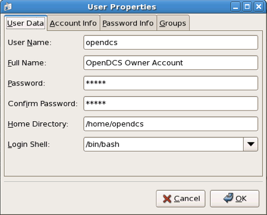

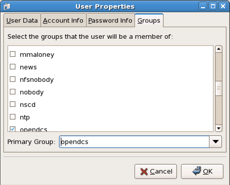

Figure 2‑1: "opendcs" User and Group Creation under Red Hat Linux.

Permissions on Installation Directories
~~~~~~~~~~~~~~~~~~~~~~~~~~~~~~~~~~~~~~~

The central user’s $HOME and the OPENDCS installation directories should
have permissions: drwxr-x---. If not, login as the central user and
type::

   chmod 750 $HOME
   mkdir $HOME/OPENDCS
   chmod 750 $HOME/OPENDCS

Install OpenDCS
~~~~~~~~~~~~~~~

Use instructions in section 2.1 or 2.3 to install OpenDCS either from
the GUI or a compressed TAR image. Install it as user opendcs at
location $HOME/OPENDCS.

Giving a Normal User Access to OpenDCS
~~~~~~~~~~~~~~~~~~~~~~~~~~~~~~~~~~~~~~

After the installation is complete, login as a normal user (other than
opendcs, and of course never *root*) that needs to run toolkit programs.

In the new user account, before doing anything else, set an environment
variable DCSTOOL_HOME pointing to the actual installation in the owner’s
account. For example, if user “opendcs” owns OpenDCS at
/home/opendcs/OPENDCS, set an environment variable in BASH like this:

export DCSTOOL_HOME=/home/opendcs/OPENDCS

A script called “opendcs_user_init” is included with OpenDCS to set up a
user’s environment. The script will do the following:

-  Create a local directory for toolkit files.

-  Define a shell variable called DCSTOOL_USERDIR pointing to this
   directory.

-  Create a script $HOME/opendcs.init that you can run to set up your
   environment.

After running the script modify your .bash_profile in your $HOME
directory to source the opendcs.init script by adding a line at the end::

    . $HOME/opendcs.init

(Note the dot – space at the beginning of this line. This tells bash to
make the variable settings part of your current environment.)

After running this script, your PATH variable now includes the OPENDCS
bin directory, giving you access to all of the programs. To start the
main toolkit launcher bar, type::

   launcher_start &

Troubleshooting:

-  If you get some variation of “permission denied”, it probably means
   that you don’t have access to the OPENDCS bin directory.

   -  Make sure you are a member of the “opendcs” group.

   -  Check the permissions on the installation directories (see section
      2.2.2)

-  If you get some variation of “command not found”, then your PATH is
   probably not set correctly. Did you source the “opendcs.init” file in
   your .bash_profile, as described above?

   -  Type the command “echo $PATH”. You should see the bin directory
      under the OPENDCS installation (e.g. /home/opendcs/OPENDCS/bin) in
      the colon-separated list.

Customizing the User’s Configuration
~~~~~~~~~~~~~~~~~~~~~~~~~~~~~~~~~~~~

The OPENDCS configuration is normally stored in the file
“decodes.properties” found in the installation directory.

When you login as the central user and run the OPENDCS setup menu, you
will have full access to all configuration variables. The values will be
stored in $DCSTOOL_HOME/decodes.properties.

You can customize the configuration for individual users. Overrides to
the shared settings are stored in $DCSTOOL_USERDIR/user.properties. When
you run the OPENDCS setup menu as a normal user, your settings will be
stored in your configuration file and will only apply to you.

Installing from a Compressed Tar Image
---------------------------------------

USACE requested that we prepare a compressed TAR (Tape Archive) image
file for easy command-line installations.

NOTE:

   We are not distributing this particular file anymore; however we
   are working letting the normal installer allow this type of installation.

The installation file will be called:
opendcs-*version*-unix-install.tgz. For example release 6.0 is called:
opendcs-6-0-unix-install.tgz. These files have been prepared by Cove
Software, LLC, and delivered to USACE.

For a fresh install, first create the desired home directory, and then
CD into it. For example::

   cd $HOME
   mkdir OPENDCS
   cd OPENDCS

For an upgrade installation, the directory will already exist.

This directory will correspond to a required environment variable called
DCSTOOL_HOME.

Un tar the file within this directory. For example if the tar file
exists in the /tmp directory, you would type::

   tar xvzf /tmp/opendcs-6-0-unix-install.tgz

For this type of installation, you MUST set the environment variable
DCSTOOL_HOME. For example, if you are using the BASH (preferred) shell,
edit .bash_profile and add a line like this::

   export DCSTOOL_HOME=$HOME/OPENDCS

You will probably also want to add the OPENDCS bin directory to your
path::

   PATH=$DCSTOOL_HOME/bin:$PATH

The TAR file is meant to be used as *either* a fresh install or an
upgrade. Therefore it cannot overwrite any configuration files you have
customized. The config files in the release have modified filenames:

+----------------------------------+-----------------------------------+
| **Operational Config File**      | **Name in the TAR file**          |
+==================================+===================================+
| computations.conf                | computations.conf.sample          |
+----------------------------------+-----------------------------------+
| ddsrecv.conf                     | ddsrecv.conf.sample               |
+----------------------------------+-----------------------------------+
| decodes.properties               | decodes.properties.sample         |
+----------------------------------+-----------------------------------+
| drgsconf.xml                     | drgsconf.xml.sample               |
+----------------------------------+-----------------------------------+
| lrgs.conf                        | lrgs.conf.sample                  |
+----------------------------------+-----------------------------------+
| edit-db (directory)              | edit-db.init                      |
+----------------------------------+-----------------------------------+
| users (directory)                | users.init                        |
+----------------------------------+-----------------------------------+

For an upgrade install, you can just delete the samples that were
included in the TAR file.

For a fresh install, rename the sample included in the TAR file to the
operational name before starting the software for the first time.

Unattended Installation
-----------------------

After performing a normal install the final panel of the installer will have a
button to generate an "installation script":

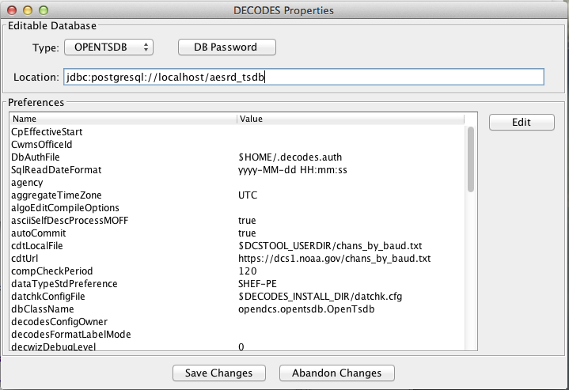

If you need to perform the same install in several places with the same options,
like which packs to use, you can use this file as follows (assuming you've called it auto-install.xml):

    java -jar *downloaded-file-name* auto-install.xml

Upgrading Database for a Previous Release
=========================================

As features are added to OpenDCS, it is occasionally necessary to modify
the database schema to add new tables, columns, etc. Each new release of
the software will come with schema files to build a new database, but
what if you already have a working database with the old schema?

**Option 1: Do nothing.**

We always ensure backward compatibility with a new Java software
release. The new Java code will work just fine with older versions of
the schema. The only down-side is that you won’t be able to take
advantage of any new features that require the schema changes.

**Option 2: Update to Latest Schema**

Run the command-line utility ‘dbupdate’ once after installing the new
Java code.

The utility will ask you for the username and password of the database
schema owner. It will make any necessary modifications to the database
structure. Usually this involves defining new tables, or adding columns
to existing tables.

The utility will detect the current schema version and make only the
changes necessary to update to the latest. It will display all of the
changes as they are made.

A sample run is shown below. User responses are in bold italic. ::

   $ bin/decj opendcs.dbupdate.DbUpdate
   Enter user name and password for the CP/DECODES schema owner account.
   CP schema owner user name: **aesrd_adm**
   Password:
   Init DECODES DB: EU, Enum, DataType, Sources,
   Site, Equip, Config, Platform List, Presentation Groups, Network Lists,
   Routing,
   Init done.
   TSDB Database is currently 9
   DECODES Database is currently 10
   Executing: ALTER TABLE NETWORKLISTENTRY ADD COLUMN PLATFORM_NAME VARCHAR(24)
   Executing: ALTER TABLE NETWORKLISTENTRY ADD COLUMN DESCRIPTION VARCHAR(80)
   Executing: UPDATE TSDB_DATABASE_VERSION SET DB_VERSION = 10, DESCRIPTION = 'Updated on Wed Jun 04 13:07:45 EDT 2014'
   Executing: UPDATE DECODESDATABASEVERSION SET VERSION_NUM = 11

.. _leg-inst-start-configure:

Starting and Configuring OPENDCS
================================

The release directory contains a file called “decodes.properties”. This
file contains “name=value” pairs, one per line. The options are shown in
Table 3‑1. “Default Value” is the value that will be used by the
software if the property is missing from the file.

The installation procedure will create a “decodes.properties” file based
on selections you made in the dialogs.

Note: if this is a multi-user installation, then your settings will be
stored in $DCSTOOL_USERDIR/user.properties.

Also, new properties are added from time to time to control new features
added to OpenDCS. For a complete list, see the Setup GUI available from
the Launcher button panel.

+------------------+---------------+-----------------------------------+
| **Property       | **Default     | **Description**                   |
| Name**           | Value**       |                                   |
+==================+===============+===================================+
| SiteNa\          | NWSHB5        | Specifies the “preferred” type    |
| meTypePreference |               | for DCP names. By default this is |
|                  |               | the Handbook-5 standard used by   |
|                  |               | the National Weather Service.     |
+------------------+---------------+-----------------------------------+
| EditDatabaseType | “xml”         | The is the type for the Editable  |
|                  |               | database. The same values allowed |
|                  |               | for the DatabaseType property are |
|                  |               | allowed here; viz “XML” or “SQL”. |
+------------------+---------------+-----------------------------------+
| Edit             | N/A           | This is the location for          |
| DatabaseLocation |               | accessing the editable database.  |
|                  |               | The same values allowed for the   |
|                  |               | DatabaseLocation property are     |
|                  |               | allowed here.                     |
+------------------+---------------+-----------------------------------+
| EditOutputFormat | “Hu\          | Output format to test decoding    |
|                  | man-Readable” | scripts within dbedit.            |
+------------------+---------------+-----------------------------------+
| EditP            | N/A           | Presentation group used to format |
| resentationGroup |               | samples when testing decoding     |
|                  |               | scripts within the editor.        |
+------------------+---------------+-----------------------------------+
| EditTimeZone     | “UTC”         | Time zone used when decoding      |
|                  |               | sample data within the editor.    |
|                  |               | Using UTC makes it easy to        |
|                  |               | correlate sample times with the   |
|                  |               | DCP message time stamp.           |
+------------------+---------------+-----------------------------------+
| jdbcDriverClass  | org.post\     | Full Java class name of the JDBC  |
|                  | gresql.Driver | driver here.                      |
+------------------+---------------+-----------------------------------+
| SqlKeyGenerator  | Java Class    | Class name of SQL key generator.  |
|                  | Name          |                                   |
+------------------+---------------+-----------------------------------+
| RoutingStatusDir | Directory     | Default:                          |
|                  | Name          | $DECODES_INSTALL_DIR/routstat     |
|                  |               |                                   |
|                  |               | By default, your routing specs    |
|                  |               | will periodically place their     |
|                  |               | status in this directory. The     |
|                  |               | “Routing Status Monitor” Web      |
|                  |               | Application can be used to make   |
|                  |               | this information visible via a    |
|                  |               | web page.                         |
+------------------+---------------+-----------------------------------+
| D\               | Data Source   | Default: “drot.wcda.noaa.gov”.    |
| efaultDataSource | Name          |                                   |
|                  |               | This is used in the database      |
|                  |               | editor (dbedit) to retrieve       |
|                  |               | sample messages to test your      |
|                  |               | decoding.                         |
+------------------+---------------+-----------------------------------+
| TransportMedi\   | String        | Used in the database editor list  |
| umTypePreference |               | panels to choose which of the     |
|                  |               | (possibly several) transport      |
|                  |               | media to display.                 |
+------------------+---------------+-----------------------------------+
| DataT\           | String        | Used by editor and some output    |
| ypeStdPreference |               | formatters to choose which of the |
|                  |               | (possibly several) data types to  |
|                  |               | display.                          |
+------------------+---------------+-----------------------------------+
| decwizTimeZone   | String        | Time zone used in the decoding    |
|                  |               | wizard displays.                  |
+------------------+---------------+-----------------------------------+
| decwizDebugLevel | 0, 1, 2, 3    | Debug level in trace log 0=no     |
|                  |               | debug info, 3= verbose.           |
+------------------+---------------+-----------------------------------+
| de\              | String        | Default = “stdmsg”.               |
| cwizOutputFormat |               |                                   |
+------------------+---------------+-----------------------------------+
| decwizRawDataDir | Directory     | Default location to move raw data |
|                  |               | files into.                       |
+------------------+---------------+-----------------------------------+
| decw\            | Directory     | Default location to save decoded  |
| izDecodedDataDir |               | data in.                          |
+------------------+---------------+-----------------------------------+
| decwizSummaryLog | File Name     | Default file to append decoding   |
|                  |               | summaries to.                     |
+------------------+---------------+-----------------------------------+
| hdb\             | True or False | Default = false. True will        |
| SiteDescriptions |               | automatically place the preferred |
|                  |               | name at the beginning of the      |
|                  |               | description. HDB requires this.   |
+------------------+---------------+-----------------------------------+
| a\               | Time zone     | Name of time zone used to         |
| ggregateTimeZone | name          | determine the start/end of        |
|                  |               | aggregate periods for             |
|                  |               | computations. If not set, it will |
|                  |               | default to the sqlTimeZone        |
|                  |               | setting.                          |
+------------------+---------------+-----------------------------------+
| DbAuthFile       |$HOME/\        | For SQL Database connections,     |
|                  |.decodes.auth  | this file stores the database     |
|                  |               | username and password. It is      |
|                  |or             | encrypted and should have         |
|                  |               | protected permissions in the      |
|                  |authtype:config| user’s home directory. Thus each  |
|                  |See below for  | user can have a different         |
|                  |more.          | database role.                    |
+------------------+---------------+-----------------------------------+
| language         | en            | For internationalization, “en” is |
|                  |               | the default (English).            |
+------------------+---------------+-----------------------------------+
| Country          | us            | Country abbreviation for          |
|                  |               | internationalization.             |
+------------------+---------------+-----------------------------------+
| Agency           | String        | Name of agency that owns the      |
|                  |               | database.                         |
+------------------+---------------+-----------------------------------+
| Location         | String        | Sub-location of the agency that   |
|                  |               | owns the database.                |
+------------------+---------------+-----------------------------------+
| archiveDataDir   | Directory     | Directory for archiving raw data  |
|                  |               | and summary files.                |
+------------------+---------------+-----------------------------------+
| arc\             | File Template | File (template) for archiving raw |
| hiveDataFileName |               | data files.                       |
+------------------+---------------+-----------------------------------+
| remembe\         | true          | By default DECODES will remember  |
| rScreenPositions |               | the poisition and size of each    |
|                  |               | GUI screen so that when a program |
|                  |               | is restarted it will appear in    |
|                  |               | the same place. Set this to false |
|                  |               | to turn off this behavior.        |
+------------------+---------------+-----------------------------------+
| CwmsOfficeId     | String        | Set to override office ID         |
|                  |               | determined at login.              |
+------------------+---------------+-----------------------------------+
| wr\              | true          | Boolean. If false, then DECODES   |
| iteCwmsLocations |               | will be unable to create CWMS     |
|                  |               | Location records.                 |
+------------------+---------------+-----------------------------------+
| sh\              | false         | Boolean. If true, include the     |
| owPlatformWizard |               | platform wizard button on the     |
|                  |               | launcher.                         |
+------------------+---------------+-----------------------------------+
| s\               | false         | Boolean. Show the legacy          |
| howNetlistEditor |               | flat-file network list editor on  |
|                  |               | the launcher.                     |
+------------------+---------------+-----------------------------------+
| show\            | true          | Boolean.                          |
| TimeSeriesEditor |               |                                   |
+------------------+---------------+-----------------------------------+
| showC\           | true          | Boolean.                          |
| omputationEditor |               |                                   |
+------------------+---------------+-----------------------------------+
| showGroupEditor  | true          | Boolean.                          |
+------------------+---------------+-----------------------------------+
| show\            | true          | Boolean.                          |
| TestComputations |               |                                   |
+------------------+---------------+-----------------------------------+
| sho\             | true          | Boolean.                          |
| wAlgorithmEditor |               |                                   |
+------------------+---------------+-----------------------------------+
| sh\              | true          | Boolean.                          |
| owRoutingMonitor |               |                                   |
+------------------+---------------+-----------------------------------+
| sho\             | true          | Boolean.                          |
| wPlatformMontiro |               |                                   |
+------------------+---------------+-----------------------------------+
| datchkConfigFile | $\            | For DATCHK CCP validations.       |
|                  | DCSTOOL_USERD\|                                   |
|                  | IR/datchk.cfg |                                   |
+------------------+---------------+-----------------------------------+
| retryFa\         | true          | Set to false to disable all       |
| iledComputations |               | computation retries.              |
+------------------+---------------+-----------------------------------+
| maxCom\          | 0 (meaning    | Set to positive integer to        |
| putationsRetries | unlimited)    | control the maximum number of     |
|                  |               | time a computation will be        |
|                  |               | retried if it fails. Zero (the    |
|                  |               | default) means unlimited.         |
+------------------+---------------+-----------------------------------+
| CpEffectiveStart | String        | Can be set to a negative          |
|                  |               | increment like “-3 days” to limit |
|                  |               | the age of data that CP will      |
|                  |               | process.                          |
+------------------+---------------+-----------------------------------+
| de\              | 4             | In the absence of a presentation  |
| faultMaxDecimals |               | group entry, this will determine  |
|                  |               | the maximum number of fractional  |
|                  |               | digits in various output formats. |
+------------------+---------------+-----------------------------------+
| eventPurgeDays   | 5             | Number of days that data          |
|                  |               | acquisition events will be stored |
|                  |               | in the database before they are   |
|                  |               | purged.                           |
+------------------+---------------+-----------------------------------+
|                  |               |                                   |
+------------------+---------------+-----------------------------------+

Table 3‑1: DECODES Property Values.

DbAuthFile can reference a file directly, or configuration for other auth sources.
The full syntax is::

  auth-type:configuration

If no auth-type + : is present, the normal user auth file is assumed.

UserAuthFile and env-auth-source are provided in the installation. See the developer Documenation
for instructions on creating new sources.

Table 3-2: DbAuthFile values

+----------------+-------------------------+-------------------------------------------------------------------+
|Type            |Description              |Configuration                                                      |
+----------------+-------------------------+-------------------------------------------------------------------+
|UserAuthFile    |Traditional file         |File name. Environment variables are expanded                      |
|                |Control by setDecodesUser|                                                                   |
|                |command                  |                                                                   |
+----------------+-------------------------+-------------------------------------------------------------------+
|env-auth-source |pull credentials from    |Mapping of internal name to environment vars.                      |
|                |environment variables.   |For example if your environment creds are                          |
|                |                         |OPENDCS_USERNAME and OPENDCS_PASSWORD                              |
|                |                         |the line would be:                                                 |
|                |                         |env-auth-source:username=OPENDCS_USERNAME,password=OPENDCS_PASSWORD|
|                |                         |                                                                   |
+----------------+-------------------------+-------------------------------------------------------------------+
|gui-auth-source |Prompt user with a       |Dialog title.                                                      |
|                | dialog.                 |                                                                   |
+----------------+-------------------------+-------------------------------------------------------------------+

The “decodes.properties” file is read when an OPENDCS program is
started. Therefore, in most cases, after making changes you must restart
the affected program(s).

You can edit the file directly with a text editor. The preferred way to
make changes is through the GUI. Start the launcher with the command::

   launcher_start

(Or on Windows, run Start – OPENDCS – Launcher).

Hit the “Setup” button. This brings up the DECODES Properties window as
shown below.

Figure 4‑1: DECODES Properties Setup GUI.

All of the possible properties are shown, regardless of whether they
have been set. You can hover the mouse pointer over the name for a
tool-tip for each. To edit a property, select it from the list and hit
‘Edit’.

See the sections below for Database connection settings.

After you are finished, hit the Save Changes button at the bottom.
Restart any affected program (including the Launcher GUI).

Configuring From the Database
-----------------------------

This section applies to OpenDCS 6.2 RC13 and later.

In certain situations, usually having to do with security, you may need
to be able to set the above-mentioned configuration parameters from the
database. For example, if the data acquisition runs on a server that you
do not have login privileges to. OpenDCS provides a mechanism for this.

The Computation Processor User Guide describes records that describe
processes. You can use these process records to store configuration
parameters in the database. Parameters stored and referenced in the way
described here will override the settings in the decodes.properties or
user.properties files described above.

To do this you will first need to create a new Application Type record.
Start the reference list editor with the “rledit” command. On the
Enumerations tab, select the Application Type enumeration. Create a new
enumeration record as shown below.

-  Mnemonic Value must be “settings”

-  Executable Java Class must be (exactly): decodes.util.DecodesSettings

Before leaving rledit, be sure to hit File – Save to DB.

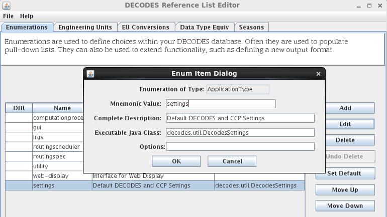

Figure 4‑2: Create the "settings" Application Type in the Reference List
Editor.

Now we will create special process (a.k.a. Loading Application) records
that store DECODES and CCP settings.

You can create/modify/delete process records in two ways:

-  From the computation editor on the “Processes” tab.

-  From the Processes button on the launcher screen.

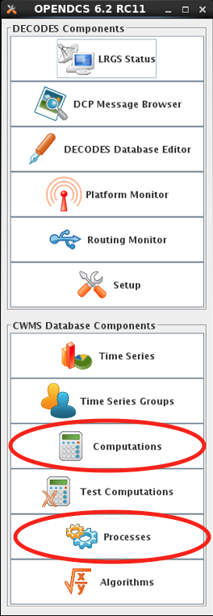

Figure 4‑3: Edit Processes from Two Different Apps.

Create a new process record. The example below shows a process record
called “ServerSettings” because its intended for settings to control
daemons on a remote server.

Under Process Type, select the “settings” record you created in rledit
above. This will cause the Application Properties screen to fill in with
a template of all available properties to control DECODES and CCP. These
are the same properties listed in Table 3‑1 above.

Hover the mouse over a parameter name for a tool-tip help. Click the
parameter and the Edit button to assign a value to the parameters. When
you assign a value here, it will override any value from
decodes.properties or user.properties. Leave properties blank if the
default value is acceptable.

Thus a “process” record here is not really for a process. Rather it is a
named set of overrides for the DECODES and CCP settings stored in the
startup files.

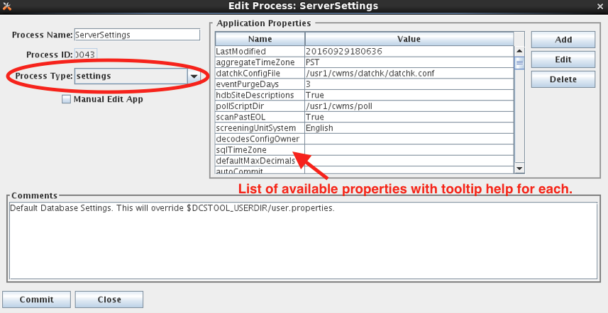

Figure 4‑4: Create a "settings" Process Record to Store DECODES/CCP
Overrides.

**Command Line Args for Starting DECODES/CCP Programs:**

Now, how do you start a DECODES or CCP program and tell it to use one of
these named settings processes? Add a command line arg as follows:

-Dsettings=\ *ProcessName*

For example, to start the computation process I could do something like
this::

   nohup compproc –d1 –l compproc.log –a RatingComps –Dsettings=ServerSettings &

In the above example the “ServerSettings” process is referenced.

You can add this argument to any DECODES or CCP program.

Accessing Multiple Database Profiles from the GUI
-------------------------------------------------

As of 6.6 RC07 it is possible to run multiple profiles from the OpenDCS
Launcher GUI. This is handy if you need to have several different
OpenDCS configurations, each with a separate database.

By default, your local system configuration is stored in
“decodes.properties” (for a single user installation) or
“user.properties” (for a multi-user installation). This file specifies
the location of your database and all other operational parameters.

The Multiple Profiles feature is normally hidden. To enable it, copy the
“decodes.properties” file to a separate file with an extension
“.profile”. For example, if I wanted to create a profile for my work
with the NOS database, I might name the copy “NOS.profile”. Store it in
the same directory as decodes.properties.

Then restart the launcher GUI and you will see a new pull-down list at
the top:

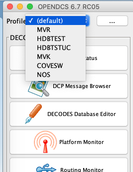

Select the profile you want to work with. Then click Setup. I selected
HDBTSTUC. Note the Setup screen indicates the selected profile at the
top:

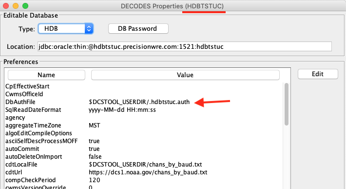

In this screen set the database type and location as needed.

Also note: If you access several SQL databases, you will likely need
separate encrypted password files for each. Normally the file is simply
“.decodes.auth”. Change it to something unique for each database. I used
“.hdbtstuc.auth”.

Now when you click any of the launcher buttons, it will open the GUI for
the selected profile. You could, for example, have the DECODES database
editor open for multiple profiles at the same time like this:

-  Select the (default) profile and click DECODES Database Editor. It
   will open the editor for the database defined in the normal
   “decodes.properties” file.

-  Then select a different profile (e.g. “COVESW”) and click the Editor
   button. It will open the editor for the database defined in
   COVESW.profile.

This could get confusing! What if I modify something in the wrong
database?

Two items have been added to every GUI screen to avoid confusion. The
header now shows the profile name, and the footer now shows the profile
name and the database location:

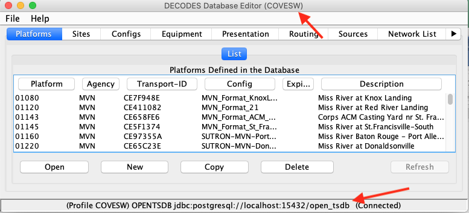

Once you have created the initial profile by copying the
decodes.properties file, the feature is now enabled. You can create
additional profiles from within the GUI. Back on the setup screen, click
the button labeled “…” to the right of the pull-down list of profiles:

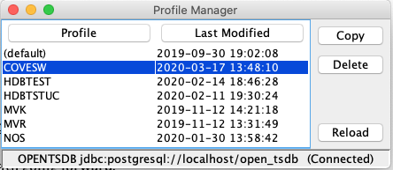

Here you can select a profile and copy it (giving it a different name).

You can delete a profile, except for the “(default)” profile. This
corresponds to the “decodes.properties” file and may not be deleted.

Creating a DECODES Database
===========================

XML Database
------------

The installer creates the tree ‘edit-db’ under the installation. It will
install default versions of the necessary XML reference list files for
enumerations, engineering units, data types, etc.

After a successful installation, your XML database is ready to go.

OpenDCS Database under PostgreSQL 
-----------------------------------

OPENDCS comes with the required files to install the schema into a PostgresSQL database.
Testing has been done with PostgresQL 15; however anything about 14 should work. Older version may work
but will not be supported.

Previous versions of OpenDCS have made a distinction between the "DECODES" database and the Timeseries Database.
For the Opendcs-Postgres version The schema now combines everything. You may set the `NUM_TS_TIMESERIES` and `NUM_TEXT_TIMESERIES` 
values to 1 to reduce the amount of space used and ignore the tables.

The actual schema install scripts are contained within opendcs.jar; if you need to review them you can open the jar with a zip tool or 
review them at https://github.com/opendcs/opendcs/tree/master/src/main/resources/db/OpenDCS-Postgres

The installation assumes you have already installed Postgres or otherwise have appropriate access to a Postgres instance. If you do not
have full control of your Postgres instance and must go through an IT department you require the following:

1. A user to own the schema (this user should *NOT* be the application user.)
2. A named database (from createdb) owned by that user (e.g. DCS)
3. The credentials for said user.
4. The fully-qualified hostname of the database (e.g. mydb.example.local)

Create a `decodes.properties`, `user.properties`, or `<name>.profile` in the appropriate directory.

set the following properties:

.. code-block:: properties

   editDatabaseType: OPENTSDB
   editDatabaseLocation: jdbc:postgresql://mydb.example.local/DCS

Set other settings as appropriate to your environment and needs.

To start the initial schema installation:

.. code-block:: bash

   migrateApp -I OpenDCS-Postgres -P full_path_to.properties
   # enter the Schema owner username and password when prompted.
   # You will be prompted for the number of numeric and text time series tables
   # enter appropriate values for you're expected data volume.
   # On a fresh install the schema installation will just happen.

On a fresh installation you will be prompted to create an admin user.
This user will be able to create new users and assign them appropriate roles, such as
a user to run compproc or routesched processes (additional details in <./cp-userguide.rst> and <./routesched-guide.rst> ).

To update to the latest schema run the above command again. A list of updates 
will be provided and you will be prompted if you wish to continue.

Instead of creating the properties file manually you can start the launcher to
begin the configuration process:

   launcher_start &

(Or on Windows, run Start – OPENDCS – Launcher).

Hit the Setup button in the upper part of the launcher. This brings up
the DECODES Properties window as shown below.

From the pull-down list of database types, select OPENTSDB. In the
Location field enter the string in the format shown::

   jdbc:postgresql://**DBHOST**/**DBNAME**

Use the DBHOST and DBNAME for your provided database

Select an administrative user name and password. This is different from
the postgres superuser name that you specified above. Write it down and
remember it!

Hit the DB Password button. Type in the administrative user name and
password that you selected. 

Use this username and password combination when prompted by the migrateApp for 
an admin user.

You may want to peruse the other settable properties. You can hover the
mouse pointer over the name for a tool-tip for each.

After you are finished, hit the Save Changes button at the bottom and
exit OpenDCS completely.

You are now read to run the migration tool as shown above.

You should now run run dbimport in the following order:

.. code-block:: bash

   export DH=PATH_TO_THE_DECODES_INSTALLATION
   # if you are using user.properties or decodes.properties you can leave the -P
   # portion off and dbimport will load the appropriate default file.

   $DH/bin/dbimport -P path_to_your_properties -r $DH/edit-db/loading-app/*.xml
   $DH/bin/dbimport -P path_to_your_properties -r $DH/edit-db/enum/*.xml
   $DH/bin/dbimport -P path_to_your_properties -r $DH/edit-db/eu/EngineeringUnitList.xml
   $DH/bin/dbimport -P path_to_your_properties -r $DH/edit-db/datatype/DataTypeEquivalenceList.xml
   $DH/bin/dbimport -P path_to_your_properties -r $DH/edit-db/presentation/*.xml

   # if using computations
   $DH/bin/compimport -P path_to_your_properties $DH/imports/comp-standard/*.xml

NOTE: we know this is a bit of a pain. Future work will simplify the processed in a similar way
as the database schema install.

Database roles created by the script:

-  OTSDB_ADMIN – These users have full administrative privilege in the
   new database. This is needed mainly for installing the software and
   updates.

-  OTSDB_USER – Grants read-only access to all OpenTSDB tables. This
   would be used by report generation and other display programs.

-  OTSDB_DATA_ACQ – Used for data acquisition. It grants write access to
   the time series tables but not meta-data.

-  OTSDB_COMP_EXEC – Used by the daemon process that will execute
   computations. Read access is granted to all tables, write access to
   time-series data, and read/write access is granted to the special
   tasklist tables used for computations.

-  OTSDB_MGR – Grants full read/write access to all tables, including
   metadata. These are users who maintain the decoding and computation
   definition metadata.

Creating OPENDCS DECODES Database under Oracle
----------------------------------------------

OPENDCS comes with scripts needed to create an Oracle database instance
with the entire schema to support DECODES and a fully functional time
series database.

The instructions below were tested using Oracle RDBMS 11.2 running under
CentOS 6.5. We assume you have a working Oracle installation and
environment.

**Install the OPENDCS Package**

We recommend a temporary/test installation *on* the database server. We
installed as user ‘oracle’ on the database server and allowed it to
create a subdirectory $HOME/OPENDCS. As you run the installer GUI,
select all packages to install and be sure to follow the installation
all the way through to the end.

Following installation, add this to your environment::

   DCSTOOL_HOME=$HOME/OPENDCS
   export DCSTOOL_HOME

If you installed in a different location, modify the setting
appropriately. You can add these lines to your .bash_profile (assuming
you’re using bash) so that they are automatically added to your
environment.

**Create the Oracle Database Instance**

Create the database instance with Oracle’s Database Creation Assistant
tool. In the following examples, we will create a database with SID
(a.k.a. TNS Name “aesrddec”.

Start the Database Creation Assistant with the command “dbca”. The
following answers will give you a working DECODES database. Advanced
Oracle administrators may want to customize their answers for their
specific environment:

-  Step 1: Select “Create a Database”

-  Step 2: Select “General Purpose of Transaction Processing”.

-  Step 3: For both Global Database Name and SID, type “aesrddec”

-  Step 4: We will uncheck “Configure Enterprise Manager” (you can use
   that tool if desired.)

-  Step 5: Click “Use the Same Administrative Password for All
   Accounts”. Then type and confirm a good password. Remember it!

-  Step 6: For Storage Type, select “File System”. For Storage
   Locations, select “Use Database File Locations from Template”.

-  Step 7: Accept defaults for recovery configuration

-  Step 8: Do *not* check Sample schemas. Also, include no Custom
   Scripts.

-  Step 9: Accept defaults for all initialization parameters.

-  Step 10: Accept defaults for Database Storage

-  Step 11: Check “Create Database”. Then click “Finish” at the bottom.

DBCA will then create and configure your database.

Set an environment variable ORACLE_SID with the name of your database.
E.g.::

   ORACLE_SID=aesrddec
   export ORACLE_SID

To verify that the database creation worked, start SQLPLUS and enter the
commands shown in red below::

   [oracle@coveoracle ~]$ **echo $ORACLE_SID**
   aesrddec
   [oracle@coveoracle ~]$ **sqlplus / as sysdba**
   SQL*Plus: Release 11.2.0.1.0 Production on Tue Feb 18 14:51:59 2014
   Copyright (c) 1982, 2009, Oracle. All rights reserved.
   Connected to:
   Oracle Database 11g Enterprise Edition Release 11.2.0.1.0 - 64bit
   Production
   With the Partitioning, OLAP, Data Mining and Real Application Testing
   options
   SQL> **select \* from global_name;**
   GLOBAL_NAME
   --------------------------------------------------------------------------------
   AESRDDEC
   SQL> quit
   Disconnected from Oracle Database 11g Enterprise Edition Release
   11.2.0.1.0 - 64bit Production
   With the Partitioning, OLAP, Data Mining and Real Application Testing
   options
   [oracle@coveoracle ~]$
   Make sure you see the single global name corresponding to your SID (but
   converted to all capitals).

**Edit Definitions for DECODES Database Creation**

Now you are ready to run the OPENDCS DECODES Database Creation Script.
This is found in the subdirectory “schema/opendcs-oracle”, under your
OPENDCS installation.

CD to this directory and edit the file “defines.sh” with your favorite
text editor::

   #!/bin/bash
   #
   # Modify the definitions below before creating the database
   #
   #
   # SYS_SCHEMA is a system administrator account for the oracle server.
   # It is used to create users, roles, and tablespaces.
   # Set SYS_PASSWD before executing and remove it afterward.
   #
   export DBSUPER=SYS
   export DBSUPER_PASSWD=xxxxxxxx
   # Hostname & port where the database is running
   export DBHOST=localhost
   export DBPORT=1521
   # Logfile for installation scripts.
   export LOG=createdb.log
   # Schema Owner Account and password
   export TSDB_ADM_SCHEMA=tsdb_adm
   export TSDB_ADM_PASSWD=xxxxxxxx
   # SID (a.k.a. TNS Name)
   export DB_TNSNAME=aesrddec
   # Oracle tablespace name and temporary tablespace name
   export TBL_SPACE_DIR=/home/oracle/app/oradata/$DB_TNSNAME
   export TBL_SPACE_DATA=aesrddec_data
   export TBL_SPACE_TEMP=aesrddec_temp
   # Number of numeric and string storage tables to create
   export NUM_TABLES=10
   export STRING_TABLES=5

You must enter the actual passwords in this file temporarily. You can
delete them after database creation is complete. The DBSUPER_PASSWD at
the top is what you entered in dbca in step 5.

The specified schema account will be created with the specified password
and will be granted full administrative privileges to all DECODES
database objects. The above settings are for a small database with
default Oracle settings.

**Configure the DCS Toolkit**

Part of the installation will be to run an XML importer to initialize
various lists within the database. For this reason you must configure
OpenDCS for the new database before running the schema creation script.

Start OpenDCS with the command::

   launcher_start &

Then click on the setup button. Make the following changes:

-  Database Type: OPENTSDB

-  Database Location:
   jdbc:oracle:thin:@\ **HOSTNAME**:1521:**DB_TNSNAME**

   -  where HOSTNAME is you system hostname, or localhost if you are
      running on the same machine as the DBMS.

   -  DB_TNSSAME is the SID or TNS Name you used in DBCA step 3.

-  Click the DB Password Button and enter the administrative user
   account and password that you entered in defines.sh for
   “TSDB_ADM_SCHEMA”.

-  For jdbcDriverClass, enter: oracle.jdbc.driver.OracleDriver

-  For sqlKeyGenerater, enter: decodes.sql.OracleSequenceKeyGenerator

When finished, click “Save Changes”. Then exit completely out of the
OPENDCS GUI.

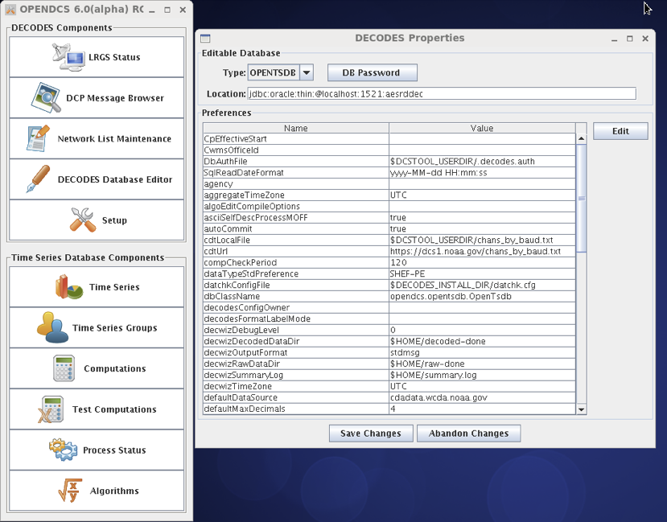

**Run the Database Creation Script**

Finally you are ready to run the script to create the database schema
and users::

   cd $DCSTOOL_HOME/schema/opendcs-oracle
   ./createDb.sh

Following script completion you can view a log of all actions taken in
the file “createdb.log”.

If any errors have occurred, the log will contain an explanation. After
fixing the problem you will want to run the complete script again. To
drop the entire schema before restarting, start sqlplus as administrator
and issue the command:

drop user **TSDB_ADM_SCHEMA** cascade;

... where **TSDB_ADM_SCHEMA** is as you defined it in the file
“defines.sh”.

**Make the Database Start when the Server is Booted**

Edit /etc/oratab. Find the line corresponding to the database you just
created. Change the final field from ‘N’ to ‘Y’. On our system the line
reads as follows::

   aesrddec:/home/oracle/app/product/11.2.0/dbhome_1:Y

Using OPENDCS with CWMS
------------------------

HEC usually creates the complete CWMS database image for use at a USACE
district, including the OPENDCS/DECODES schema.

**Create OPENDCS DECODES Schema (Done by HEC)**

We begin after the CWMS is installed.

1. Install the OPENDCS 6.0 Installation in a directory on the Oracle
   Server. This can be done via the installer GUI (selecting all
   packages) or with the tarball release.

-  Select a reasonable installation path. E.g. /home/oracle/OPENDCS.

2. Set environment variable $DCSTOOL_HOME pointing to the installation
   location. (Or the location where the tarball was un-tarred.)

3. CD to $DCSTOOL_HOME/schema/cwms30.

4. Edit the file “defines.sh” in this directory. This is a bash shell
   script containing several definitions, which are passed to the SQL
   creation scripts. See the comments in this file and make appropriate
   settings for your environment. Add the necessary passwords. (You can
   remove them after the schema is successfully created.)

5. *While still in the schema/cwms30 directory,* run the script
   ./createDefinesSql.sh

   -  This creates the file defines.sql which is included in all of the
      remaining SQL scripts.

6. *To be done by ACE-IT, while still in this schema/cwms30 directory*,
   run the script ./createTableSpaces.sh.

7. *To be done by HEC Personnel:* run the script ./createDb.sh

-  **WARNING: This script drops, and then recreates the entire CCP
   schema. It will delete any existing CCP database objects.**

8. After the script completes, peruse the file “createdb.log”. Search
   for the string ERROR. The only acceptable error is in dropping the
   CCP user near the beginning of the script.

**Create CCP User Accounts (Done by HEC)**

HEC or your local CWMS administrator will create Oracle database
accounts for every user. In order to use CCP, the user must be granted
the Oracle CCP_USER role. It must also have one of the following CWMS
office privileges:

-  “CCP Mgr” – A *Manager* has full read-write access to CCP objects in
   this district. This is used to modify DECODES and CCP meta-data
   records.

-  “CCP Proc” – This privilege is intended for background processes like
   a DECODES routing spec or the CCP Computation Processor. It has read
   access to meta data. It has write access to a few tables used for
   creating locks, etc. It is also able to write time series data into
   CWMS.

-  “CCP Reviewer” – A *Reviewer* can view data for a district and export
   it to XML, but cannot modify any tables.

**Initialize the CWMS CCP Database for Each District**

You must now initialize the DECODES database for each district by
importing a few bootstrap XML files. First run OpenDCS::

   cd $DCSTOOL_HOME
   bin/launcher_start

Click the Setup button and make the following settings:

-  Editable Database Type must be CWMS

-  Enter the correct connection string for your database.

-  Click DB Password and enter the username and password for a CCP
   Database User with privilege in the office that you are trying to
   initialize.

-  Click Save Changes and exit.

Now::

   cd $DCSTOOL_HOME/schema/cwms30
   ./importDecodesTemplate.sh

You must do this for every district that will use the database.

**Configure the Operational OPENDCS Toolkit for CWMS**

On the remote system where CCP is to run, install the OPENDCS 6.0
Toolkit:

-  Select a reasonable installation path. E.g. /home/oracle/OPENDCS.

-  Select all Packages

-  No need to create shortcuts (uncheck this)

-  Make sure you go all the way through the installation and click
   ‘Done’ on the final panel.

Set an environment variable DCSTOOL_HOME pointing to the installation.
Then add the OpenDCS bin directory to your path. For example, in your
.bash_profile::

   export DCSTOOL_HOME=/home/opendcs/OPENDCS
   PATH=$DCSTOOL_HOME/bin:$PATH
   Start the launch menu:
   launcher_start&

Click the Setup button and make the following settings:

-  Editable Database Type must be CWMS

-  Enter the correct connection string for your database. See Below.

-  Click DB Password and enter the username and password for a CCP
   Database User with privilege in the office that you are trying to
   initialize.

-  Click Save Changes and exit.

The Location field is filled in with a URL pointing to your database. It
must be of the form::

   jdbc:oracle:thin:@\ **HostName**:**PortNum**:**SID**

Where

-  **HostName** is the host name of your database server

-  **PortNum** is the port number on which the server listens (typically
   1521)

-  **SID** Is the unique identifier for your database on the server

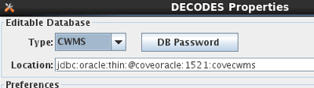

You can now use dbimport and compimport to import DECODES and
computation settings from a previous installation.

Using OPENDCS with USBR HDB
---------------------------

For HDB, in the Setup menu, select HDB for database type. Under location
provide a URL pointing to your HDB database. It should be of the form::

   jdbc:oracle:thin:@\ **HostName**:**PortNum**:**SID**

Where

-  **HostName** is the host name of your database server

-  **PortNum** is the port number on which the server listens (typically
   1521)

-  **SID** Is the unique identifier for your database on the server

In HDB, the REF_DB_PARAMETER table contains a setting with the label
“TIME_ZONE”. This determines how to interpret all the date/time values
stored in Oracle DATE objects within the database. The CP software will
automatically read this parameter so you do not have to set SqlTimeZone
as you did in previous versions.

Many HDB tables contain a column DATE_TIME_LOADED, which records the
time that a given record in the database was last modified. These
columns are typically set automatically (e.g. within a trigger) from the
Oracle “sysdate” value.

Since “sysdate” returns the date/time in the time zone of the underlying
operating system, we recommend that the Unix server’s time zone be set
to the same as the TIME_ZONE setting in REF_DB_PARAMETER. This will
ensure that all DATE values in HDB are consistent.

Encrypted Password File for Database Connection
-----------------------------------------------

Note the decodes.properties parameter listed above labeled “DbAuthFile”.
The CP software stores an encrypted version of the database username and
password in this file.

When you hit the “DB Password” button in the settings GUI, the software
will save your responses in this encrypted file.

For HDB, this is used by all OpenDCS utilities. For CWMS, it is only
used for background (daemon) processes. GUIs always prompt the user to
enter username and password.

Initialize from an Export of Another Database
---------------------------------------------

If you are upgrading from a previous version of OpenDCS or CWMS, you
will likely want to initialize your DECODES/CCP data from your existing
database.

First make an XML image of the existing database. On the old system,
type these commands into the old toolkit release::

   dbexport > DecodesImage.xml
   compexport > CompImage.xml

Now transfer these files to the new installation, and::

   dbimport –r –W DecodesImage.xml

   *You will be asked for confirmation. Be aware that the –W argument
   tells the program to DELETE any existing DECODES records in your
   database. Only use this argument if you want the new database to be a
   true mirror of the old one.*

::

   compimport CompImage.xml

Reference List Editor
=====================

The DECODES database contains information to populate pull-down lists.
You will probably never need to modify this information.

However, if you need to expand DECODES functionality you will need to
use the Reference List Editor.

To start the program, type ‘rledit’ at the command prompt. The initial
screen is shown in Figure 13‑6‑1. Along the top, you see four tabs for
the four types of reference lists:

-  Enumerations: Used to populate pull-down lists in the database
   editor, and also to expand DECODES functionality in some cases.

-  Engineering Units: This tab contains the units known to DECODES.

-  Engineering Unit Conversions: This tab contains the conversions
   between units.

-  Data Type Equiv: This tab contains the known data types, and
   assertions as to equivalence.

-  Seasons: This tab allows you to define seasons for conditional
   processing.

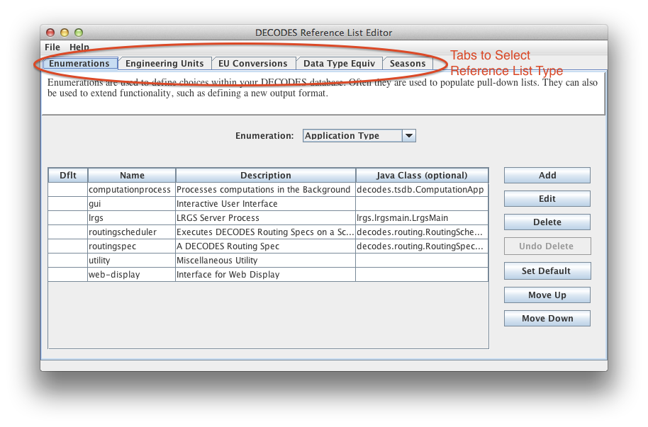

Figure 13‑6‑1: Reference List Editor Enumerations Tab.

Enumerations
------------

There are several enumeration sets within DECODES. Select one from the
pull-down listed labeled “Enumeration”. Notice that when you select a
different enumeration, the table below is populated with the values in
that set.

Each set has a particular purpose:

-  Application Type – DECODES allows multiple types of named processes.
   Features are enabled/disabled depending on the process type.

-  Data Consumer – These are shown in the dbedit routing spec panel.
   This set associates a name like ‘pipe’ with a Java class that
   implements the consumer, like ‘decodes.consumer.PipeConsumer’.

-  Data Source Type – These values are shown in the dbedit Data Source
   panel. Each DECODES data source is associated with a type. This set
   tells DECODES which Java class to use for each type.

-  Data Type Standard – This set defines the data type coding standards
   that you use. Common values are ‘shef-pe’ used by USACE, and
   ‘epa-code’ used by USGS.

-  Interval Code – This is a list of interval codes understood by the
   time series manipulation an computation modules.

-  Measures – This is used for engineering units. Every EU measures some
   physical quantity like area, length, flow, volume, etc. This is a
   list of those physical quantities.

-  Output Format - These are shown in the dbedit routing spec panel
   where you select the format for output data. This set associates each
   name with its Java class.

-  Script Type – DECODES was designed to support several types of
   scripts, although currently only the ‘standard’ script is used.

-  Site Name Type – Sites may have many names, but only one of each
   type. This set defines the name type columns that appear in dbedit.

-  Statistics Code – These are typically used in time series naming.

-  Transport Medium Type – Each TM has a type like GOES-Self-Timed, or
   “Data-Logger”. This set determines the values shown in the pull down
   list in dbedit.

-  Unit Conversion Algorithm – currently contains four values for the
   different conversion types: none, linear, poly-5, and usgs-standard.

Using the buttons on the right you can add, edit, or delete enumeration
values.

The ‘Set Default’ button places an asterisk next to the selected value.
In certain cases, the default value is used in the absence of a user
selection.

The order of values in the list determines the order they will appear in
a pull-down list. Hence you can use the Move-Up and Move-Down buttons to
change the order shown here.

Many of the enumerations are simple ordered lists with no other
information required. Examples of this type are Data Type Standard, Site
Name Type Standard, and Interval.

For other enumerations (e.g. Data Source Type) a Java Class Name must be
carefully entered for each enumeration value. This provides a way to
extend the software, by implementing new functionality in Java and then
referencing it in an enumeration.

For example, the figure below shows the enumeration value for the FTP
Data Source.

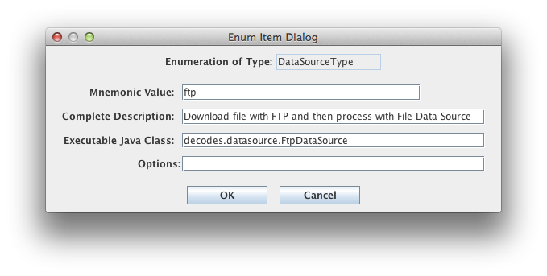

Figure 6‑2: Data Source Enumeration Value for FTP.

Engineering Units
-----------------

The Engineering Units tab is shown in Figure 13‑6‑3. This list defines
all of the known EUs in DECODES.

You can click on the column headers to sort by:

-  Abbreviation

-  Full Name

-  Family (i.e. English, Metric, or Universal)

-  Measures (the physical quantity being measured by the EU)

You can use the buttons to the right to add, edit, or delete an EU.

Abbreviations must not contain embedded spaces.

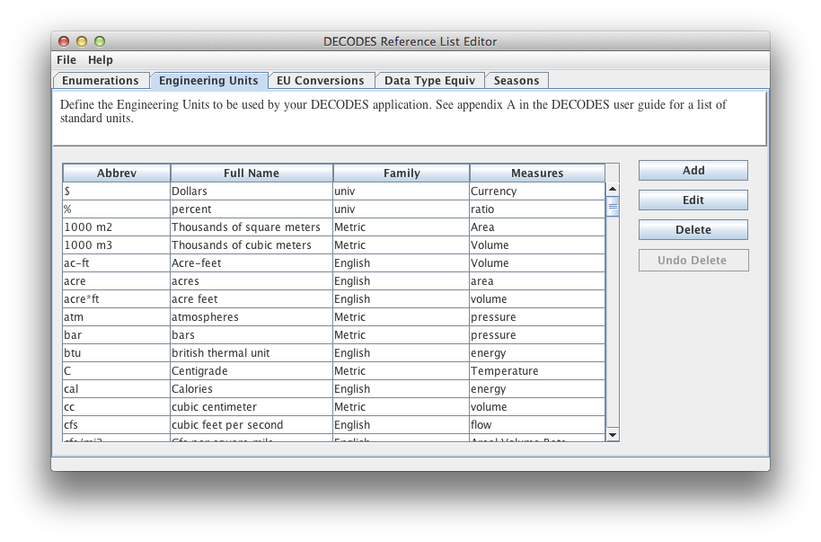

Figure 13‑6‑3: Reference List Editor Engineering Units Tab.

Engineering Unit conversions
----------------------------

The EU conversions tab is shown in Figure 13‑6‑4.

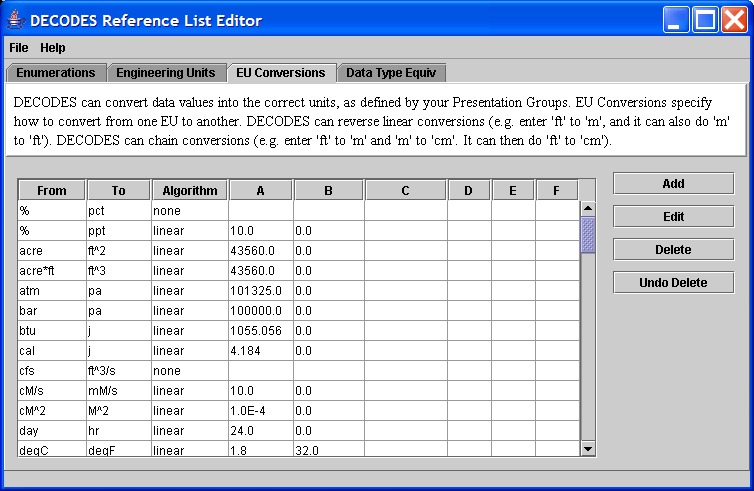

Figure 13‑6‑4: Reference List Editor EU Conversions Tab.

This list shows the standard conversions. Each line specifies how to
convert *from* one EU abbreviation *to* another. There are four
possibilities for Algorithm:

-  none – This means that the two units are to be considered synonyms.
   Examples: % is a synonym for pct, and cfs is a synonym for ft^3/s.

-  linear – Uses the equation y = Ax + B, where *y* is the EU we are
   converting to, and *x* is the EU we are converting from.

-  usgs – Uses the equation y = A \* (B + x)^C + D

-  poly-5 – 5\ :sup:`th` order polynomial: y = Ax^4 + Bx^4 + Cx^3 + Dx^2
   + Ex + F

To add, edit, or delete, use the buttons to the right of the table.

DECODES can invert “none” and “linear” algorithms. Hence if we specify
how to convert from “cal” to “j”, we don’t need to specify how to
convert from “j” to “cal”.

DECODES can also combine conversions. Suppose you specify:

-  in -> ft

-  ft -> m

-  m -> mm

Then DECODES can combine these if it needs to convert “in” to “mm”.

Data Type Equivalencies
-----------------------

Figure 13‑6‑5 shows the tab for Data Type Equivalencies. Recall that
DECODES allows you to specify multiple data type codes for each sensor.
So, for a stream stage sensor you might enter HG. Then, if you select
USGS-STDMSG for your output format, DECODES must convert HG to the
equivalent EPA numeric parameter code.

This feature is rarely used and should be considered a last resort. The
problem is that mapping between data type systems is rarely one-to-one.
For example, USGS (EPA) code 00065 may be represented in SHEF as HG, HP,
HT, etc.

You are strongly encouraged to enter the specific data types that you
want into each DECODES Configuration record for each sensor. Thus the
automatic mapping will never be used.

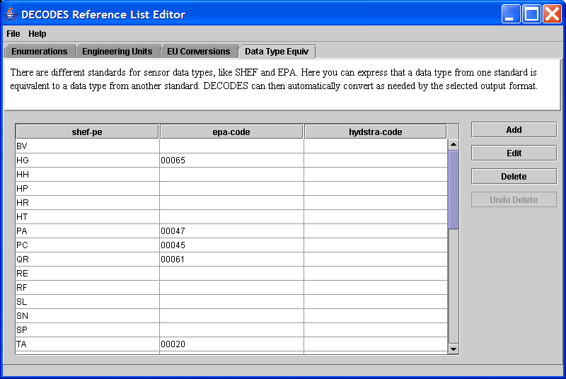

Figure 13‑6‑5: Reference List Editor - Data Type Equivalencies Tab.

Seasons
--------

As of OpenDCS 6.1 you can define “Seasons” by name, and then use them
for conditional processing. For example, a platform that should be
ignored in the winter because it is iced-over.

The Seasons tab is shown below. You are not limited to the normal four
seasons. You can define a season with any name and any date/time range.
For example, “planting” is the planting season, “rainy” could be defined
as the rainy season.

To add, edit, or delete seasons, using the buttons on the right. The
figure below shows a season being edited.

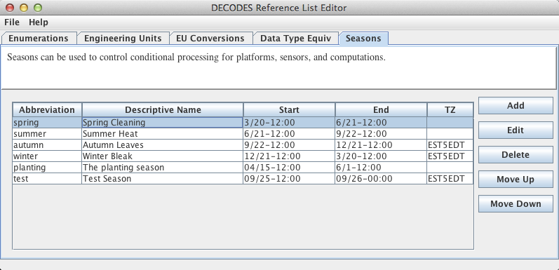

Figure 6‑6: Reference List Editor - Seasons Tab.

.. image:: ./media/legacy/install-guide/im-27-season-duration-edit.png
   :width: 5.625in
   :height: 1.82057in

Figure 6‑7: A Season being edited.

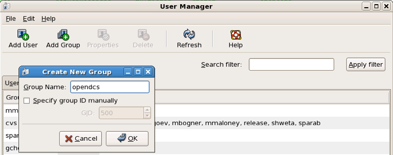
