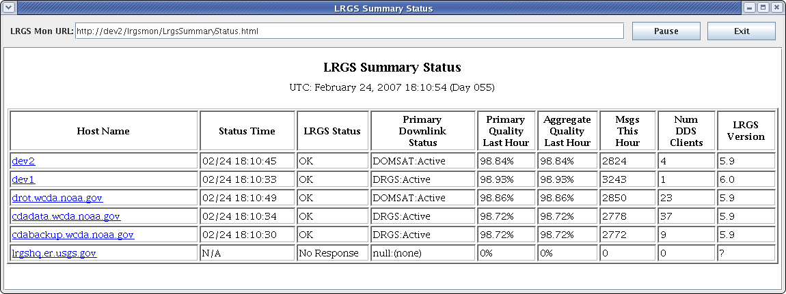

##########
LRGS (9.0)
##########

(Local Readout Ground System)

User’s & Administrator’s Guide

..
    Document Revision 8

    May, 2017

    This Document is part of the OpenDCS Software Suite for environmental
    data acquisition and processing. The project home is:
    https://github.com/opendcs/opendcs

    See INTENT.md at the project home for information on licensing.

.. contents. Table of Contents
   :depth: 3

Introduction
============

LRGS stands for Local Readout Ground Station. LRGS is a universal
store-and-forward device for GOES-DCP data. It can receive data via
several satellite links and the internet. It stores the raw DCP data
efficiently for a month or more, automatically deleting the oldest data
when pre-set storage limits are reached. It provides the DDS network
service to distribute data efficiently to client processes, such as
DECODES.

From 1999 through 2007, ILEX Engineering, Inc. built the LRGS
open-source code through a series of government contracts with:

-  U.S. Geological Survey (USGS), Water Resources Division,

-  U.S. Army Corps of Engineers (USACE), and

-  National Oceanic and Atmospheric Administration (NOAA).

By funding the LRGS development, these three agencies have done a great
service for the entire DCS user community.

.. note::
    
    See the wiki for a list of current companies that provide commerical support
    for OpenDCS. https://github.com/opendcs/opendcs/wiki/Getting-Paid-Support

Change Log
----------

-  Revision 7: Added write up for “source=\ *name*\ ” notation in DDS
   Receive in section `5.2.1 <#anchor-2>`__.

-  Revision 8:

   -  Addition of properties: ddsMinHourly, lritMinHourly, edlMinHourly,
      and drgsMinHourly. See additions to table of configuration
      parameters in section `5 <#anchor-3>`__.
   -  Addition to configuration dialogs to set the xxxMinHourly
      properties mentioned above.
   -  Added section `5.5.2 <#anchor-4>`__ on writing INFO and
      higher-priority events to a SQL database.

GOES Data Collection System Overview
====================================

The LRGS is a proven system that provides many federal, state, local, and
private organizations with the ability to collect remote environmental
data in real-time. The LRGS provides local storage of raw DCP data
limited only by your disk capacity.

With the LRGS you can receive and archive data from any combinations of
input interfaces: HRIT (DAMS-NT), GOES-DRGS, Internet-DDS, or
NOAAPORT, HRIT Files, custom. Platform messages are merged according to a user-settable
priority scheme for ultra-reliable data collection.

The LRGS provides the de-facto standard DDS (DCP Data Service) for
distributing raw data to your processing applications. Your
data-processing applications can run on the same machine as the LRGS, or
over the network.

The LRGS is written in 100% Java. Consequently, the LRGS will run on any modern computing
platform such as Linux, Macintosh, Windows, Solaris, AIX, and running on various architectures.

The NOAA/NESDIS Data Collection System
--------------------------------------

The National Environmental Satellite, Data, and Information Service
(NESDIS) operates the U.S. Geostation­ary Operational Environmental
Satellite (GOES) system. The GOES system's pri­mary mission is to
continuously observe changing weather phenomena from satellite-based
sensors situated approximately 23,000 miles from Earth. As a collateral
duty, the GOES system supports a radio relay or Data Collection System
(DCS). The DCS enables a large variety of environmental data to be
relayed from point sources through GOES and back to Earth, from where
these data are dissemi­nated to the various system users. These point
sources are called Data Collection Platforms (DCP), and can be are land,
sea or mobile-based.

`Figure 2-1 <#anchor-8>`__ depicts the GOES DCS. Starting on the left,
data is transmitted from over 30,000 DCPs throughout the western
hemisphere. Each platform is equipped with a recorder, power source,
transmitter, antenna, and an array of environmental sensors. Each DCP is
programmed to collect sensor data and then transmit it in a ‘message’
during specified time-slots on specified GOES channels.

Users with a GOES DRGS (Direct Readout Ground Station) can receive the
DCP messages directly from GOES. For other users, NOAA provides other
services through the DCS Automated Processing System (DAPS). DAPS is a
large dual-computer based system located at the NOAA Command and Data
Acquisi­tion (CDA) facility in Wallops, Virginia. It continually monitors
all GOES RF channels for incoming DCP messages. DAPS can support the
receipt and archival of messages from up to 100,000 platforms,
redistributing them to up to 5,000 users.

NOAA also supports the direct transmission of DCP data to users via
internet. This uses a TCP socket protocol called DDS (DCP Data Service).
DDS allows users to specify data of interest by DCP address, channel, or
time range. Users can retrieve historical data or a real-time stream.

Figure 2‑1: GOES DCS Overview.

In 2004, NOAA started a new service called HRIT (High Rate Information
Transfer). This service combines low resolution WEFAX images and all DCS
data. It operates on a separate frequency on both GOES East and West
Satellites.

Finally, the NOAAPORT data stream is similar to the old DOMSAT (no longer supported )
in that it operates on a separate domestic satellite. It differs from DOMSAT in the
following ways:

-  NOAAPORT contains imagery data, weather bulletins and other products,
   in addition to DCP messages.
-  Only DCP messages processed by the National Weather Service are
   transmitted over NOAAPORT.
-  There can be a several minute delay in retrieving DCP data via
   NOAAPORT. DOMSAT was almost instantaneous.

The Role of the LRGS
--------------------

The LRGS can retrieve data via any of the input interfaces mentioned
above, as shown in `Figure 2-2 <#anchor-11>`__. The LRGS can be
configured with multiple interfaces. It can merge data simultaneously
from any or all of the interfaces shown at the left. The LRGS acts as a
store-and-forward device. It archives any amount of historical data
(limited only by available disk space) and provides network interfaces
to a variety of programs shown at the right.

The core of the LRGS software was written by ILEX Engineering, Inc.,
under contract to the federal government. As such it is freely
available. Cove Software, LLC now maintains the software and provides
support to the user community.

Figure 2‑2: The Role of the LRGS.

DCP Message Content
-------------------

Each DCP message will have header fields followed by a message body.
Regardless of which interface a DCP message was received from, the LRGS
internally formats the header into a 37-byte character string with the
following fields:

-  8 hex digit DCP Address
-  YYDDDHHMMSS – Time the message arrived at the Wallops receive
   station. The day is represented as a three digit day of the year
   (julian day).
-  1 character failure code
-  2 decimal digit signal strength
-  2 decimal digit frequency offset
-  1 character modulation index
-  1 character data quality indicator
-  3 decimal digit GOES receive channel
-  1 character GOES spacecraft indicator (‘E’ or ‘W’)
-  2 hex digit uplink carrier status

-  5 decimal digit message data length

Following the header will be the message body, with a variable number of
characters. The format of the message body varies widely depending on
the manufacturer of the transmitter, data logger, sensors, and the
technician who programmed the DCP. The body can be simple ASCII,
sometime with parameter codes and time-stamps embedded, sometimes not.
The body can also be in ‘Pseudo-Binary’ which is character encoding of
binary data that uses 6 bits of every byte and guarantees that all
characters are printable.

The message body must be processed by a program like DECODES to convert
the data into time-tagged engineering units. From there it is typically
ingested into a time-series database.

The following subsections detail the meaning of various header fields.

Failure Code
~~~~~~~~~~~~

The single character labeled 'Failure Code' in the DCP message header
indicates whether the message originated from a DCP or whether it is a
DAPS-generated status mes­sage. Real DCP messages have a failure code of
'G' for good message, or '?' if the message contained parity errors when
received by DAPS.

If the failure code is anything other than '?' or 'G', the message is
generated by DAPS. These status messages have the DCP address of the
pertinent platform and are typically sent immediately after the real DCP
message from that platform. The body of the message will be a brief text
message explaining the event.

Possible failure codes are as follows:

-  **Real DCP Messages:**

   **G** Good DCP Message

   **?** DCP Message withParity Error\ ** **

   DAPS Status Messages:

   **W** Previous DCP message was Received on the wrong channel

   **D** Previous DCP message was duplicated (i.e. received on multiple
   channels)

   **A** Previous DCP message contained a correct­able address error

   **B** Previous DCP message contained a bad (unknown) address

   **T** Previous DCP message was received outside its proper time slice
   (early/late)

   **U** Previous DCP message was unexpected

   **M** The DCP message for the referenced plat­form was missing (not
   received in its proper time slice)

   **I** Previous DCP message had an invalid ad­dress

   **N** The referenced platform has a non-complete entry in the DAPS
   Platform Description Table (PDT)

   **Q** Previous DCP message had bad quality measurements

Signal Strength
~~~~~~~~~~~~~~~

Signal Strength will be two ASCII digits and will be in the range of 32
to 57. Signal strength is the implied EIRP, assuming the pilot is a +47
dBm reference.

Frequency Offset
~~~~~~~~~~~~~~~~

Frequency Offset will be two ASCII charac­ters. The first will be a plus
or minus sign. The second will be on ASCII digit 0 through 9, or the
capital letter 'A'. The sign indicates that the DCP is transmitting
above or below (plus or minus, respectively) the channel center
frequency. The digit indicates the amount of the offset in increments of
50 Hz. The character 'A' represents 500 Hz, which is the worst case
frequency error that DAPS can acquire.

Modulation Index
~~~~~~~~~~~~~~~~

Modulation Index will be one of the follow­ing three characters:

-  **N** Normal: (60° ± 5°)

   **L** Low: (£ 50°)

   **H** High: (³ 70°)

Data Quality
~~~~~~~~~~~~

Data Quality will be one of the following three characters:

-  **N** Normal: Error rate better than 10\ :sup:`-6`

   **F** Fair: Error rate between 10\ :sup:`-4` and 10\ :sup:`-6`

   **P** Poor: Error rate worse than 10\ :sup:`-4`

DCP Message Types
-----------------

There are several types of DCP mes­sages:

Self-Timed DCP Messages are generated by a platform according to an
internal schedule. NOAA assigns time-slices and GOES channel numbers.

1. Random DCP Messages are generated by a platform in response to some
   environmental trigger. These are sent over a separate ‘random’
   channel. Since there is a possibility of collision, the DCP will
   typically send 3 copies of the message at random time intervals.
2. Retransmitted DCP messages: If you are receiving data from one of the
   DAPS-rebroadcasts (NOAAPORT, HRIT, DDS) you may see
   historical messages. These are sent from time to time in response to
   a user’s request.

DADDS-generated status messages: In many cases, DADDS will generate a
sepa­rate status message transmitted immediately after the normal DCP
mes­sage to indicate some type of failure (e.g. a message received on an
unexpected channel). The header will contain the DCP address and the
message body will explain the er­ror condition. See the above discussion
on ‘Failure Code’ for a list of possible codes.

The DOMSAT Re-Broadcast
-----------------------

The DOMSAT re-broadcast is no longer supported by NOAA. For a similar capability
use either an HRIT system or NOAA port.

While the DOMSAT system is no longer supported, some of the mechanisms present from it,
such as the "DOMSAT Header" still permeate the software. You may seen references to such a 
header or various elements. These generally apply generically to various connections such as DRGS
and HRIT in some way. Consider this while reading the documentation as we are still cleaning up the text
and variable naming. 

LRGS Software Overview
======================

The LRGS is a single Java application designed to run in the background
on a real-time server. The application has many modules, some of which
represent separate threads of execution. `Figure 3-5 <#anchor-25>`__
shows how data flows through the system

Figure 3‑5: LRGS Software Data Flow.

Major modules include:

-  The Main Module controls start-up, shutdown, configuration, and
   status gathering.
-  The Archive Module manages a series of day-files, along with
   corresponding index files. By default, a system is configured to
   store 30 days worth of data. This can be increased, limited only by
   available disk capacity.
-  The DRGS Receive Module handles data reception from any number of
   DAMS-NT connections. You can mix and match demodulator systems from
   different vendors as long as they support DAMS-NT.
-  DDS (DCP Data Service) Network Receive Module handles data reception
   from other LRGS systems over the network. This is typically used for
   backup. If your satellite link fails, you will still get real-time
   data over the network.
-  NOAAPORT Receive Module handles data reception from a variety of
   NOAAPORT receivers, using the real-time socket interface that they
   provide.
-  The LRIT DAMS-NT Receive Module receives data from LRIT receivers
   that support the DAMS-NT protocol.

-  The DDS Server handles client connections to serve up DCP data,
   status, and events.

Starting and Stopping the LRGS Server Daemon
============================================

We recommend that you set an environment variable LRGSHOME pointing to
the OPENDCS installation directory. Then you should add the LRGS’s bin
directory to your path. On a unix or linux system, modify your startup
script (e.g. “.bash_profile” if you are using bash) with the lines:

LRGSHOME=\ *The Directory where you installed OPENDCS*

export LRGSHOME

PATH=$LRGSHOME/bin:$PATH

After installation, you will find a script in the $LRGSHOME/bin
directory called “startLRGS” (for Windows, “startLRGS.bat”). Run this
script either from the command line, or a GUI shortcut, to start the
LRGS.

The LRGS creates a lock file in the $LRGSHOME directory called
“lrgs.lock”. While it is running, it periodically updates the
last-access-time on this file. The purpose of this file is two-fold:

-  

   1. It prevents multiple instances of the LRGS from running at the
      same time.
   2. It provides an easy way to shut down the LRGS: simply delete the
      lock file.

Hence, to stop the LRGS on a Linux/Unix system, type the following. The
LRGS will shutdown within 10 seconds.

cd $LRGSHOME

rm lrgs.lock

The ‘startLRGS’ script can take the following arguments:

-f *configFile*\ Sets the name of the LRGS configuration file. The
default is $LRGSHOME/lrgs.conf

-l *logFileName*\ Sets the base name of the LRGS log file. The default
is $LRGSHOME/lrgslog

-d *debugLevel* Sets the verbosity for log messages. Default=0 (meaning
no debug messages). You can enter 1 … 3. (3 is most verbose).

-S *maxLogSize* Sets the maximum size of a log file. Default=20000000
(20 million bytes). When the file reaches this size, the logs are
rotated.

-N *numOldLogs* Sets the number of old log files to keep. Default=5. Old
logs are given a numeric extension 1 (most recent) … *N*\ (oldest).

LRGS Configuration
==================

After the initial installation, the LRGS comes with an administrative
user account named “lrgsadmin” with password “lrgsadmin”.

You are strongly encouraged to change this password after first starting
the LRGS.

After starting the LRGS server as described above, start the real-time
status display on the same machine with the command:

rtstat

Along the top, type “localhost” for hostname and “lrgsadmin” for user
name. Also check the box and type the password for lrgsadmin.

If this is your first time connecting, Hit File – Set Password from the
menu in the upper left. Then reconnect with the new password.

You can now select File – LRGS Configuration from the menu at the upper
left. As shown in `Figure 5-6 <#anchor-31>`__, you will be presented
with a multi-tabbed configuration GUI in which you can modify all of the
LRGS configuration parameters by category.

Figure 5‑6: LRGS Configuration Menu.

The LRGS Configuration is stored in three files in the $LRGSHOME
directory:

-  **lrgs.conf** is a series of ‘name=value’ pairs, one per line. You
   can modify the file with any standard text editor.
-  **ddsrecv.conf** is an XML file containing an XML record for each
   remote LRGS server that you want to use for backup.
-  **drgsconf.xml**\ is an XML file for each DAMS-NT DRGS that you are
   receiving data from.

The LRGS process checks the configuration files once per minute for
modifications. If it detects that a file has changed it is re-loaded.

For the main “lrgs.conf” file, `Table 5-1 <#anchor-32>`__ contains a
list of accepted properties. Some of the properties may not be changed
on-the-fly. The right-most column indicates whether the property can be
modified on the file. If this is ‘No’ then you must restart the LRGS in
order for the change to take effect.

You may put comments in the file by placing a ‘#’ character at the
beginning of the line.

+--------------+--------------+--------------+--------------+--------+
| Property     | Value Type   | Default      | Description  | Can    |
| Name         |              |              |              |        |
|              |              |              |              | Modify |
+==============+==============+==============+==============+========+
| acce\        | true/false   | false        | Normally, an | Yes    |
| ptDomsatARMs |              |              | LRGS does    |        |
|              |              |              | its own      |        |
|              |              |              | schedule     |        |
|              |              |              | checking     |        |
|              |              |              | based on     |        |
|              |              |              | NOAA’s PDT.  |        |
|              |              |              | If you want  |        |
|              |              |              | to rely on   |        |
|              |              |              | ARMs         |        |
|              |              |              | (Abnormal    |        |
|              |              |              | Response     |        |
|              |              |              | Messages)    |        |
|              |              |              | from a       |        |
|              |              |              | remote LRGS, |        |
|              |              |              | set this to  |        |
|              |              |              | true.        |        |
+--------------+--------------+--------------+--------------+--------+
| archiveDir   | directory    | $LRGS\       | The name of  | No     |
|              | name         | HOME/archive | the          |        |
|              |              |              | directory    |        |
|              |              |              | containing   |        |
|              |              |              | the archive  |        |
|              |              |              | day-files.   |        |
+--------------+--------------+--------------+--------------+--------+
| channel\     | Filename     | $\           | Name of file | Yes    |
| MapLocalFile |              | LRGSHOME/cdt | in which to  |        |
|              |              |              | store cached |        |
|              |              |              | channel map  |        |
+--------------+--------------+--------------+--------------+--------+
| c\           | URL          | htt\         | URL for      | Yes    |
| hannelMapUrl |              | ps://dcs1.no | downloading  |        |
|              |              | aa.gov/chans | the channel  |        |
|              |              | _by_baud.txt | descriptions |        |
|              |              |              | from         |        |
|              |              |              | Wallops.     |        |
|              |              |              | This tells   |        |
|              |              |              | the LRGS     |        |
|              |              |              | which        |        |
|              |              |              | channel      |        |
|              |              |              | numbers are  |        |
|              |              |              | valid and    |        |
|              |              |              | what baud    |        |
|              |              |              | rates each   |        |
|              |              |              | can handle   |        |
+--------------+--------------+--------------+--------------+--------+
| d\           | true/false   | false        | Set to true  | Yes    |
| dsAllowAdmin |              |              | if you want  |        |
|              |              |              | ad           |        |
|              |              |              | ministrative |        |
|              |              |              | functions to |        |
|              |              |              | be available |        |
|              |              |              | through DDS. |        |
|              |              |              | If enabled,  |        |
|              |              |              | ad           |        |
|              |              |              | ministrative |        |
|              |              |              | functions    |        |
|              |              |              | will only be |        |
|              |              |              | allowed for  |        |
|              |              |              | a            |        |
|              |              |              | uthenticated |        |
|              |              |              | connections. |        |
+--------------+--------------+--------------+--------------+--------+
| ddsBindAddr  | IP Addr      | (empty)      | For systems  | No     |
|              |              |              | with         |        |
|              |              |              | multiple     |        |
|              |              |              | network      |        |
|              |              |              | interfaces.  |        |
|              |              |              | If you only  |        |
|              |              |              | want to      |        |
|              |              |              | enable the   |        |
|              |              |              | DDS server   |        |
|              |              |              | on a         |        |
|              |              |              | specific     |        |
|              |              |              | NIC, specify |        |
|              |              |              | the IP       |        |
|              |              |              | Address.     |        |
+--------------+--------------+--------------+--------------+--------+
| d\           | Integer      | 16003        | TCP Port on  | No     |
| dsListenPort |              |              | which to     |        |
|              |              |              | listen for   |        |
|              |              |              | incoming DDS |        |
|              |              |              | client       |        |
|              |              |              | connections. |        |
+--------------+--------------+--------------+--------------+--------+
| d\           | Integer      | 100          | Maximum      | No     |
| dsMaxClients |              |              | number of    |        |
|              |              |              | simultaneous |        |
|              |              |              | DDS clients  |        |
|              |              |              | that can be  |        |
|              |              |              | supported on |        |
|              |              |              | this LRGS.   |        |
+--------------+--------------+--------------+--------------+--------+
| ddsMinHourly | Integer      | 0            | If set to    | Yes    |
|              |              |              | positive     |        |
|              |              |              | number, then |        |
|              |              |              | issue a      |        |
|              |              |              | warning      |        |
|              |              |              | message if   |        |
|              |              |              | the number   |        |
|              |              |              | of messages  |        |
|              |              |              | received in  |        |
|              |              |              | an hour is   |        |
|              |              |              | less than    |        |
|              |              |              | this value.  |        |
|              |              |              | Also, this   |        |
|              |              |              | will enable  |        |
|              |              |              | the check    |        |
|              |              |              | for number   |        |
|              |              |              | of messages  |        |
|              |              |              | in a given   |        |
|              |              |              | hour being   |        |
|              |              |              | less than    |        |
|              |              |              | half the     |        |
|              |              |              | number of    |        |
|              |              |              | messages in  |        |
|              |              |              | the previous |        |
|              |              |              | hour.        |        |
+--------------+--------------+--------------+--------------+--------+
| d\           | directory    | $LRGS\       | Any network  | No     |
| dsNetlistDir | name         | HOME/netlist | list files   |        |
|              |              |              | (ending in   |        |
|              |              |              | “.nl”)       |        |
|              |              |              | placed in    |        |
|              |              |              | this         |        |
|              |              |              | directory    |        |
|              |              |              | will be      |        |
|              |              |              | available to |        |
|              |              |              | all DDS      |        |
|              |              |              | clients for  |        |
|              |              |              | specifying   |        |
|              |              |              | DCP          |        |
|              |              |              | addresses    |        |
|              |              |              | and DCP      |        |
|              |              |              | names.       |        |
+--------------+--------------+--------------+--------------+--------+
| d\           | file name    | $LRGSHOME/\  | Name of      | No     |
| dsRecvConfig |              | ddsrecv.conf | c            |        |
|              |              |              | onfiguration |        |
|              |              |              | file for the |        |
|              |              |              | DDS Receiver |        |
|              |              |              | Software.    |        |
|              |              |              | This         |        |
|              |              |              | contains a   |        |
|              |              |              | list of      |        |
|              |              |              | server names |        |
|              |              |              | to connect   |        |
|              |              |              | to, and      |        |
|              |              |              | other        |        |
|              |              |              | parameters.  |        |
+--------------+--------------+--------------+--------------+--------+
| dd\          | true/false   | false        | Set to true  | No     |
| sRequireAuth |              |              | if you want  |        |
|              |              |              | to require   |        |
|              |              |              | all DDS      |        |
|              |              |              | clients to   |        |
|              |              |              | authenticate |        |
|              |              |              | themselves   |        |
|              |              |              | via          |        |
|              |              |              | ha           |        |
|              |              |              | sh/password. |        |
|              |              |              | See          |        |
|              |              |              | discussion   |        |
|              |              |              | below.       |        |
+--------------+--------------+--------------+--------------+--------+
| ddsUsageLog  | file name    | $LRGS\       | DDS          | No     |
|              |              | HOME/dds-log | connection   |        |
|              |              |              | information  |        |
|              |              |              | is           |        |
|              |              |              | periodically |        |
|              |              |              | logged. This |        |
|              |              |              | specifies    |        |
|              |              |              | the file     |        |
|              |              |              | name.        |        |
+--------------+--------------+--------------+--------------+--------+
| dd\          | Directory    | $LR\         | The name of  | No     |
| sUserRootDir | name         | GSHOME/users | the          |        |
|              |              |              | directory    |        |
|              |              |              | containing a |        |
|              |              |              | s            |        |
|              |              |              | ub-directory |        |
|              |              |              | for every    |        |
|              |              |              | DDS users    |        |
+--------------+--------------+--------------+--------------+--------+
| ddsUser\     | Directory    | $LRGSHOME\   | The name of  | No     |
| RootDirLocal | name         | /users.local | the          |        |
|              |              |              | directory    |        |
|              |              |              | containing a |        |
|              |              |              | s            |        |
|              |              |              | ub-directory |        |
|              |              |              | for every    |        |
|              |              |              | local DDS    |        |
|              |              |              | users        |        |
+--------------+--------------+--------------+--------------+--------+
| doP\         | Boolean      | false        | Set to true  | No.    |
| dtValidation |              |              | to have this |        |
|              |              |              | local LRGS   |        |
|              |              |              | do GOES      |        |
|              |              |              | message      |        |
|              |              |              | validation   |        |
|              |              |              | based on the |        |
|              |              |              | downloaded   |        |
|              |              |              | PDT          |        |
+--------------+--------------+--------------+--------------+--------+
| d\           | String       | “COM1”       | Serial port  | No     |
| qmSerialPort |              |              | for sending  |        |
|              |              |              | sequence     |        |
|              |              |              | messages to  |        |
|              |              |              | DAPS.        |        |
+--------------+--------------+--------------+--------------+--------+
| dr\          | file name    | $LRGSHOME/d\ | Name of      | No     |
| gsRecvConfig |              | rgsrecv.conf | c\           |        |
|              |              |              | onfiguration |        |
|              |              |              | file for the |        |
|              |              |              | DRGS         |        |
|              |              |              | Receiver     |        |
|              |              |              | Software.    |        |
|              |              |              | This         |        |
|              |              |              | contains a   |        |
|              |              |              | list of      |        |
|              |              |              | server names |        |
|              |              |              | to connect   |        |
|              |              |              | to, and      |        |
|              |              |              | other        |        |
|              |              |              | parameters.  |        |
+--------------+--------------+--------------+--------------+--------+
| d\           | Integer      | 0            | If set to    | Yes    |
| rgsMinHourly |              |              | positive     |        |
|              |              |              | number, then |        |
|              |              |              | issue a      |        |
|              |              |              | warning      |        |
|              |              |              | message if   |        |
|              |              |              | the number   |        |
|              |              |              | of messages  |        |
|              |              |              | received in  |        |
|              |              |              | an hour is   |        |
|              |              |              | less than    |        |
|              |              |              | this value.  |        |
|              |              |              | Also, this   |        |
|              |              |              | will enable  |        |
|              |              |              | the check    |        |
|              |              |              | for number   |        |
|              |              |              | of messages  |        |
|              |              |              | in a given   |        |
|              |              |              | hour being   |        |
|              |              |              | less than    |        |
|              |              |              | half the     |        |
|              |              |              | number of    |        |
|              |              |              | messages in  |        |
|              |              |              | the previous |        |
|              |              |              | hour.        |        |
+--------------+--------------+--------------+--------------+--------+
| edlI\        | Boolean      | false        | Set to true  | No     |
| ngestEnabled |              |              | to enable    |        |
|              |              |              | ingest of    |        |
|              |              |              | EDL files by |        |
|              |              |              | scanning a   |        |
|              |              |              | hot          |        |
|              |              |              | directory.   |        |
+--------------+--------------+--------------+--------------+--------+
| edlIng\      | Directory    | $LRGSHOME/\  | Name of hot  | Yes    |
| estDirectory | Name         | edl-incoming | directory to |        |
|              |              |              | search for   |        |
|              |              |              | incoming EDL |        |
|              |              |              | files. If    |        |
|              |              |              | ‘edlInge     |        |
|              |              |              | stRecursive’ |        |
|              |              |              | is set, then |        |
|              |              |              | su           |        |
|              |              |              | bdirectories |        |
|              |              |              | are          |        |
|              |              |              | recursively  |        |
|              |              |              | searched     |        |
|              |              |              | also.        |        |
+--------------+--------------+--------------+--------------+--------+
| edlIng\      | Boolean      | false        | If true,     | Yes    |
| estRecursive |              |              | then         |        |
|              |              |              | edlIng       |        |
|              |              |              | estDirectory |        |
|              |              |              | is taken as  |        |
|              |              |              | the top of a |        |
|              |              |              | tree that is |        |
|              |              |              | searched     |        |
|              |              |              | recursively  |        |
|              |              |              | for incoming |        |
|              |              |              | files.       |        |
+--------------+--------------+--------------+--------------+--------+
| edlFi\       | String       | none         | If set, then | Yes    |
| lenameSuffix |              |              | only files   |        |
|              |              |              | with a       |        |
|              |              |              | matching     |        |
|              |              |              | filename     |        |
|              |              |              | suffix are   |        |
|              |              |              | processed.   |        |
|              |              |              | All other    |        |
|              |              |              | files in the |        |
|              |              |              | directory    |        |
|              |              |              | (or          |        |
|              |              |              | directory    |        |
|              |              |              | tree) are    |        |
|              |              |              | ignored.     |        |
+--------------+--------------+--------------+--------------+--------+
| edlD\        | Directory    | none         | If set, then | Yes    |
| oneDirectory | Name         |              | incoming EDL |        |
|              |              |              | files will   |        |
|              |              |              | be moved     |        |
|              |              |              | here after   |        |
|              |              |              | ingest. If   |        |
|              |              |              | not set,     |        |
|              |              |              | then the     |        |
|              |              |              | files will   |        |
|              |              |              | be deleted.  |        |
+--------------+--------------+--------------+--------------+--------+
| edlMinHourly | Integer      | 0            | If set to    | Yes    |
|              |              |              | positive     |        |
|              |              |              | number, then |        |
|              |              |              | issue a      |        |
|              |              |              | warning      |        |
|              |              |              | message if   |        |
|              |              |              | the number   |        |
|              |              |              | of messages  |        |
|              |              |              | received in  |        |
|              |              |              | an hour is   |        |
|              |              |              | less than    |        |
|              |              |              | this value.  |        |
|              |              |              | Also, this   |        |
|              |              |              | will enable  |        |
|              |              |              | the check    |        |
|              |              |              | for number   |        |
|              |              |              | of messages  |        |
|              |              |              | in a given   |        |
|              |              |              | hour being   |        |
|              |              |              | less than    |        |
|              |              |              | half the     |        |
|              |              |              | number of    |        |
|              |              |              | messages in  |        |
|              |              |              | the previous |        |
|              |              |              | hour.        |        |
+--------------+--------------+--------------+--------------+--------+
| e\           | true/false   | False        | Set to true  | Yes    |
| nableDdsRecv |              |              | to enable    |        |
|              |              |              | reception of |        |
|              |              |              | data over    |        |
|              |              |              | the network  |        |
|              |              |              | from other   |        |
|              |              |              | LRGS         |        |
|              |              |              | systems.     |        |
+--------------+--------------+--------------+--------------+--------+
| en\          | true/false   | False        | Set to true  | Yes    |
| ableDrgsRecv |              |              | to enable    |        |
|              |              |              | reception of |        |
|              |              |              | data over    |        |
|              |              |              | the network  |        |
|              |              |              | from DRGS    |        |
|              |              |              | (DAMS-NT)    |        |
|              |              |              | systems      |        |
+--------------+--------------+--------------+--------------+--------+
| en\          | true/false   | False        | Set to true  | Yes    |
| ableLritRecv |              |              | to enable    |        |
|              |              |              | the LRIT     |        |
|              |              |              | file ingest  |        |
|              |              |              | module.      |        |
+--------------+--------------+--------------+--------------+--------+
| ht\          | file name    | $\           | File in      | Yes    |
| mlStatusFile |              | LRGSHOME/lrg\| which to     |        |
|              |              | sstatus.html | save         |        |
|              |              |              | periodic     |        |
|              |              |              | HTML         |        |
|              |              |              | snapshots of |        |
|              |              |              | the LRGS     |        |
|              |              |              | status.      |        |
+--------------+--------------+--------------+--------------+--------+
| htmlS\       | Integer      | 30           | Number of    | Yes    |
| tatusSeconds |              |              | seconds      |        |
|              |              |              | between HTML |        |
|              |              |              | status       |        |
|              |              |              | snapshots    |        |
+--------------+--------------+--------------+--------------+--------+
| i\           | Boolean      | false        | Set to true  | No     |
| ridiumEnable |              |              | to enable    |        |
|              |              |              | the Iridium  |        |
|              |              |              | SBD Listener |        |
+--------------+--------------+--------------+--------------+--------+
| iridiu\      | Filename     | none         | If           | Yes    |
| mCaptureFile |              |              | specified,   |        |
|              |              |              | iridium SBD  |        |
|              |              |              | raw data     |        |
|              |              |              | will be      |        |
|              |              |              | captured     |        |
|              |              |              | here.        |        |
+--------------+--------------+--------------+--------------+--------+
| iridiumPort  | Integer      | 10800        | Port number  | No     |
|              |              |              | to listen    |        |
|              |              |              | for incoming |        |
|              |              |              | Iridium SBD  |        |
|              |              |              | messages     |        |
+--------------+--------------+--------------+--------------+--------+
| loadDecodes  | Boolean      | False        | Load the     | No     |
|              |              |              | DECODES      |        |
|              |              |              | Database at  |        |
|              |              |              | start up.    |        |
|              |              |              | This gives   |        |
|              |              |              | LRGS access  |        |
|              |              |              | to DECODES   |        |
|              |              |              | network      |        |
|              |              |              | lists.       |        |
+--------------+--------------+--------------+--------------+--------+
| lo\          | Boolean      | false        | Set to true  | No     |
| calAdminOnly |              |              | if this LRGS |        |
|              |              |              | synchronizes |        |
|              |              |              | user         |        |
|              |              |              | accounts     |        |
|              |              |              | from another |        |
|              |              |              | LRGS and you |        |
|              |              |              | *only* want  |        |
|              |              |              | local users  |        |
|              |              |              | to be able   |        |
|              |              |              | to           |        |
|              |              |              | administer   |        |
|              |              |              | this system  |        |
+--------------+--------------+--------------+--------------+--------+
| lrgsHostName | String       | (empty)      | Host name or | No     |
|              |              |              | IP address   |        |
|              |              |              | of the       |        |
|              |              |              | remote       |        |
|              |              |              | DAMS-NT LRIT |        |
|              |              |              | unit.        |        |
+--------------+--------------+--------------+--------------+--------+
| lritDamsNt\  | Hex Number   | 534D0D0A     | Start        | Yes    |
| StartPattern |              |              | pattern for  |        |
|              |              |              | DAMS-NT      |        |
|              |              |              | protocol     |        |
+--------------+--------------+--------------+--------------+--------+
| l\           | Integer      | 0            | If set to    | Yes    |
| ritMinHourly |              |              | positive     |        |
|              |              |              | number, then |        |
|              |              |              | issue a      |        |
|              |              |              | warning      |        |
|              |              |              | message if   |        |
|              |              |              | the number   |        |
|              |              |              | of messages  |        |
|              |              |              | received in  |        |
|              |              |              | an hour is   |        |
|              |              |              | less than    |        |
|              |              |              | this value.  |        |
|              |              |              | Also, this   |        |
|              |              |              | will enable  |        |
|              |              |              | the check    |        |
|              |              |              | for number   |        |
|              |              |              | of messages  |        |
|              |              |              | in a given   |        |
|              |              |              | hour being   |        |
|              |              |              | less than    |        |
|              |              |              | half the     |        |
|              |              |              | number of    |        |
|              |              |              | messages in  |        |
|              |              |              | the previous |        |
|              |              |              | hour.        |        |
+--------------+--------------+--------------+--------------+--------+
| lritPort     | Integer      | 17010        | Port number  | No     |
|              |              |              | on which the |        |
|              |              |              | DAMS/NT LRIT |        |
|              |              |              | Receiver is  |        |
|              |              |              | listening    |        |
+--------------+--------------+--------------+--------------+--------+
| lrit\        | String       | (empty)      | OPENDCS LRGS | No     |
| ReceiverType |              |              | only         |        |
|              |              |              | supports     |        |
|              |              |              | dams-nt      |        |
+--------------+--------------+--------------+--------------+--------+
| lritSrcCode  | 2-chars      | LR           | This is      | Yes    |
|              |              |              | inserted     |        |
|              |              |              | into the     |        |
|              |              |              | 37-byte GOES |        |
|              |              |              | header as    |        |
|              |              |              | the source   |        |
|              |              |              | field        |        |
+--------------+--------------+--------------+--------------+--------+
| lritTimeout  | # seconds    | 120          | Assert a     | Yes    |
|              |              |              | timeout if   |        |
|              |              |              | no LRIT      |        |
|              |              |              | files are    |        |
|              |              |              | received in  |        |
|              |              |              | this many    |        |
|              |              |              | seconds      |        |
+--------------+--------------+--------------+--------------+--------+
| l\           | # seconds    | 7200         | Discard      | Yes    |
| ritMaxAgeSec |              |              | messages     |        |
|              |              |              | arriving on  |        |
|              |              |              | the LRIT     |        |
|              |              |              | DAMS-NT link |        |
|              |              |              | that are     |        |
|              |              |              | older than   |        |
|              |              |              | this.        |        |
+--------------+--------------+--------------+--------------+--------+
| maxDownlinks | Integer      | 32           | Each process | No     |
|              |              |              | that         |        |
|              |              |              | supplies     |        |
|              |              |              | data to the  |        |
|              |              |              | LRGS is      |        |
|              |              |              | considered a |        |
|              |              |              | “downlink”.  |        |
|              |              |              | For example  |        |
|              |              |              | if you       |        |
|              |              |              | specify 3    |        |
|              |              |              | DRGS         |        |
|              |              |              | connections, |        |
|              |              |              | HRIT, and    |        |
|              |              |              | 4 DDS        |        |
|              |              |              | Receive      |        |
|              |              |              | Connections, |        |
|              |              |              | your system  |        |
|              |              |              | will use 8   |        |
|              |              |              | downlinks.   |        |
+--------------+--------------+--------------+--------------+--------+
| maxLogSize   | Integer      |              | Maximum size | No     |
|              |              |              | of the       |        |
|              |              |              | “lrgslog”    |        |
|              |              |              | file before  |        |
|              |              |              | it is        |        |
|              |              |              | rotated.     |        |
+--------------+--------------+--------------+--------------+--------+
| mergePref1   | Name         | None         | Specifies    | No     |
|              |              |              | the first    |        |
|              |              |              | (highest)    |        |
|              |              |              | preference   |        |
|              |              |              | for the      |        |
|              |              |              | merge        |        |
|              |              |              | filter. Can  |        |
|              |              |              | be one of    |        |
|              |              |              | “DDS”,       |        |
|              |              |              | “DRGS”,      |        |
|              |              |              | “LRIT”, or   |        |
|              |              |              | “NOAAPORT”.  |        |
+--------------+--------------+--------------+--------------+--------+
| mergePref2   | Name         | None         | Specifies    | No     |
|              |              |              | the second   |        |
|              |              |              | highest      |        |
|              |              |              | preference   |        |
|              |              |              | for the      |        |
|              |              |              | merge        |        |
|              |              |              | filter.      |        |
+--------------+--------------+--------------+--------------+--------+
| mergePref3   | Name         | None         | Specifies    | No     |
|              |              |              | the third    |        |
|              |              |              | highest      |        |
|              |              |              | preference   |        |
|              |              |              | for the      |        |
|              |              |              | merge        |        |
|              |              |              | filter.      |        |
+--------------+--------------+--------------+--------------+--------+
| mergePref4   | Name         | None         | Specifies    | No     |
|              |              |              | the fourth   |        |
|              |              |              | highest      |        |
|              |              |              | preference   |        |
|              |              |              | for the      |        |
|              |              |              | merge        |        |
|              |              |              | filter.      |        |
+--------------+--------------+--------------+--------------+--------+
| noaapor\     | String       | (empty)      | If supplied, | No     |
| tCaptureFile |              |              | LRGS will    |        |
|              |              |              | archive      |        |
|              |              |              | every        |        |
|              |              |              | NOAAPORT     |        |
|              |              |              | message      |        |
|              |              |              | received by  |        |
|              |              |              | adding a     |        |
|              |              |              | date/time    |        |
|              |              |              | extension to |        |
|              |              |              | the          |        |
|              |              |              | filename.    |        |
+--------------+--------------+--------------+--------------+--------+
| noa\         | true/false   | false        | Enables the  | No     |
| aportEnabled |              |              | NOAAPORT     |        |
|              |              |              | Interface    |        |
+--------------+--------------+--------------+--------------+--------+
| noaa\        | host or IP   | none         | Required if  | No     |
| portHostname | addr         |              | noaaport     |        |
|              |              |              | ReceiverType |        |
|              |              |              | is “unisys”. |        |
|              |              |              | In this case |        |
|              |              |              | the LRGS     |        |
|              |              |              | connects to  |        |
|              |              |              | an external  |        |
|              |              |              | server.      |        |
+--------------+--------------+--------------+--------------+--------+
| noaaportPort | Integer      | N/A          | Port number  | No     |
|              |              |              | to either    |        |
|              |              |              | listen on,   |        |
|              |              |              | or connect   |        |
|              |              |              | to,          |        |
|              |              |              | depending on |        |
|              |              |              | the type of  |        |
|              |              |              | NOAAPORT     |        |
|              |              |              | receiver     |        |
+--------------+--------------+--------------+--------------+--------+
| noaaport\    | String       | Can be       | Determines   | No     |
| ReceiverType |              | “marta”,     | the protocol |        |
|              |              | “unisys”, or | used to      |        |
|              |              | “PDI”        | communicate  |        |
|              |              |              | with the     |        |
|              |              |              | NOAAPORT     |        |
|              |              |              | receiver     |        |
+--------------+--------------+--------------+--------------+--------+
| numDayFiles  | Integer      | 30           | Number of    | No     |
|              |              |              | day files to |        |
|              |              |              | maintain.    |        |
|              |              |              | Files older  |        |
|              |              |              | than this    |        |
|              |              |              | are deleted. |        |
+--------------+--------------+--------------+--------------+--------+
| numOldLogs   | Integer      | 5            | Number of    | No     |
|              |              |              | old log      |        |
|              |              |              | files. Old   |        |
|              |              |              | log files    |        |
|              |              |              | are given a  |        |
|              |              |              | numeric      |        |
|              |              |              | suffix from  |        |
|              |              |              | 1 (most      |        |
|              |              |              | recent) to   |        |
|              |              |              | *N* (oldest) |        |
+--------------+--------------+--------------+--------------+--------+
| onStartupCmd | Command      | None         | Command to   | No     |
|              |              |              | be executed  |        |
|              |              |              | by LRGS when |        |
|              |              |              | it starts    |        |
|              |              |              | up. The      |        |
|              |              |              | command line |        |
|              |              |              | should be an |        |
|              |              |              | executable   |        |
|              |              |              | command in   |        |
|              |              |              | whatever     |        |
|              |              |              | operating    |        |
|              |              |              | system is    |        |
|              |              |              | used.        |        |
+--------------+--------------+--------------+--------------+--------+
| pdtLocalFile | File name    | $\           | File in      | Yes.   |
|              |              | LRGSHOME/pdt | which to     |        |
|              |              |              | store cached |        |
|              |              |              | version of   |        |
|              |              |              | downloaded   |        |
|              |              |              | PDT.         |        |
+--------------+--------------+--------------+--------------+--------+
| pdtUrl       | URL          | https\       | URL for      | Yes    |
|              |              | ://dcs1.noaa | downloading  |        |
|              |              | .gov/pdts_co | PDT from     |        |
|              |              | mpressed.txt | Wallops      |        |
+--------------+--------------+--------------+--------------+--------+
| re\          | true/false   | False        | If true,     | No     |
| coverOutages |              |              | then the     |        |
|              |              |              | DDS-Receive  |        |
|              |              |              | module will  |        |
|              |              |              | attempt to   |        |
|              |              |              | recover data |        |
|              |              |              | from         |        |
|              |              |              | discrete     |        |
|              |              |              | outages. If  |        |
|              |              |              | false        |        |
|              |              |              | (default)    |        |
|              |              |              | then         |        |
|              |              |              | DDS-Receive  |        |
|              |              |              | will         |        |
|              |              |              | retrieve a   |        |
|              |              |              | real-time    |        |
|              |              |              | stream.      |        |
+--------------+--------------+--------------+--------------+--------+
| ti\          | Integer      | 90           | If no data   | Yes    |
| meoutSeconds |              |              | is received  |        |
|              |              |              | in this      |        |
|              |              |              | amount of    |        |
|              |              |              | time, the    |        |
|              |              |              | LRGS asserts |        |
|              |              |              | a timeout    |        |
|              |              |              | condition.   |        |
+--------------+--------------+--------------+--------------+--------+
| wri\         | Boolean      | false        | If set to    | No     |
| teDacqEvents |              |              | true AND if  |        |
|              |              |              | loadDecodes  |        |
|              |              |              | is also true |        |
|              |              |              | AND you are  |        |
|              |              |              | using SQL    |        |
|              |              |              | for the      |        |
|              |              |              | DECODES      |        |
|              |              |              | Database,    |        |
|              |              |              | then INFO    |        |
|              |              |              | and higher   |        |
|              |              |              | priority     |        |
|              |              |              | events are   |        |
|              |              |              | also written |        |
|              |              |              | to the       |        |
|              |              |              | DACQ_EVENT   |        |
|              |              |              | table in the |        |
|              |              |              | SQL          |        |
|              |              |              | database.    |        |
+--------------+--------------+--------------+--------------+--------+

Table 5‑1: LRGS Configuration Variables.

DDS Users and Server Security
-----------------------------

Clients will connect to your system using DDS Protocol. DDS offers the
following operations:

-  Retrieve DCP messages.

-  Retrieve recent status and event information.

-  Change your own password (but only if you connected with a password).

The first two functions are inherently read-only. No one can harm your
system using these functions.

By default, DDS allows un-authenticated connections for the first two
functions. This means that the client must supply a valid user name, but
no password. However, for a more secure system, you can restrict access
to authorized clients to whom you have supplied a password. To do this,
set the “ddsRequireAuth” variable to true.

Additionally, *if* you connect to the server with a password *and* you
are defined on the server as an administrator, you will have the
following capabilities.

-  Add/Delete/Edit user accounts (names, passwords, permissions)
-  Other Administrative functions (not yet implemented).

DDS insists that these functions (Administrative) are only accessible to
authenticated clients who have been granted the “admin” role (see
below). You cannot change this behavior.

Any attempt by a non-authorized client to perform administrative
functions will cause the connection to be immediately disconnected.

Is DDS Secure?
~~~~~~~~~~~~~~

Yes when used with passwords, for the following reasons:

-  Passwords are never transmitted over the network. Rather, a
   one-way-hash of the password, user name, and current time are
   transmitted. Thus a network-sniffer could not intercept a login
   sequence to steal a password.
-  ‘Replay’ attacks are prevented by the inclusion of the time in the
   hash. The server requires that the time provided be *reasonably*
   current (within a few minutes).
-  A side effect is that if the client and server machines have internal
   clocks that differ by too-large an amount, the connection will be
   rejected.
-  The server stores a hash of the user’s password in a protected file.
   Permissions are set so that only ‘lrgs’ has read priviledges.
-  Administrative functions are only available to users who have been
   granted ‘admin’ privileges on the server.
-  Any sensitive information in admin messages in encrypted with DES.

How to Create DDS User Accounts Manually
~~~~~~~~~~~~~~~~~~~~~~~~~~~~~~~~~~~~~~~~

You must create the first account manually.

All users require a ‘sandbox’ directory where temporary files are
stored. These are sub-directories under the directory $LRGSHOME/users.
So, for example, to create a user with name “groucho”, issue the
following commands:

cd ~/users

mkdir groucho

LRGS stores passwords in a secure file called “.lrgs.passwd” in the
$LRGSHOME directory. This file stores user names, roles, and a hash of
the password. You should keep this file hidden so that only you can
modify it. On a Linux or Unix system, create the file as follows:

cd ~

touch .lrgs.passwd

chmod 600 .lrgs.passwd

Now run the utility for adding, removing, and modifying LRGS
administrative users. A simple command-line utility called “editPasswd”
(for Edit LRGS Passwords) has been supplied for this. Start the utility
by typing:

editPasswd

Type ‘help’ and hit ENTER for a list of supported commands. For example,
to add a user named ‘groucho’ with both DDS and Administrative
privileges, type:

adduser groucho

...(type the password as you are prompted)

addrole groucho dds

addrole groucho admin

write

quit

Currently the following roles are recognized:

-  “dds” allows the user to access read-only functions like pulling
   messages and status.

-  “admin” allows the user to access all administrative functions.

The editPasswd program also allows you to set ‘properties’ on each user.
These are used to control features such as the IP address restriction
(see section `7.6 <#anchor-39>`__) and the Real-Time Stream DCP Limit
(`7.7 <#anchor-40>`__).

How to Maintain DDS User Accounts from the Status GUI
~~~~~~~~~~~~~~~~~~~~~~~~~~~~~~~~~~~~~~~~~~~~~~~~~~~~~

Use the Real-Time status GUI to connect to your LRGS. Use a user name
that has ‘admin’ privilege and connect using a password. Select ‘File’ –
‘User Administration’ from the menus at the top left. `Figure
5-7 <#anchor-45>`__ shows the user administration screen.

Figure 5‑7: User Administration Screen.

By pressing the ‘Add’ button, or by selecting a user and pressing ‘Edit’
you will see the dialog shown in `Figure 5-8 <#anchor-46>`__. You are
*strongly* urged to define a password even if your server doesn’t
require one. We anticipate that authenticated connections will be the
norm in the near future.

Figure 5‑8: Edit DDS User Dialog.

You can edit the following information about each user:

-  DDS User Name – each user’s name must be unique and is case
   *sensitive*.
-  DDS Password – May be left blank if this user only uses
   unauthenticated access.
-  Permissions or ‘roles’. Currently only two are recognized:
-  Ability to retrieve DCP messages and status
-  Administrative privileges
-  An optional IP address restriction. If set, this user is only allowed
   to connect from the specified IP address or range.
-  To allow a range, the address may contain the wildcard ‘*’ as shown
   in the example.
-  To list addresses or ranges individually, separate with a semicolon:
-  Example: 205.156.3.*;192.168.5.23
-  An optional DCP real-time stream limit. If set, this user is not
   allowed to pull a real-time stream of data for more than the
   specified number of DCPs.

Configuring the DDS Receiver Connections
----------------------------------------

The LRGS can receive data in real-time from other LRGS systems. Your
LRGS will act as a client to the remote LRGS. You can specify up to 16
systems from which to pull data.

The configuration for the DDS receiver is stored in a separated
XML-format file. The file name, by default, is “$LRGSHOME/ddsrecv.conf”,
but it can be changed by specifying a different value in the “lrgs.conf”
file for the “ddsRecvConfig” property, as described above.

The “ddsrecv.conf” file is an XML file. `Figure 5-9 <#anchor-49>`__
shows an example of this file with two connections to the public servers
operated by NOAA/NESDIS. Note the hierarchical nature of the file.

.. code-block:: xml

    <?xml version="1.0" encoding="UTF-8" standalone="yes"?>
    <ddsrecvconf>
        <networkList>usace-mvd</networkList>
        <networkList>usace-nwd</networkList>
        <timeout>90</timeout>
        <connection number="1" host="drot.wcda.noaa.gov">
            <name>DROT</name>
            <port>16003</port>
            <enabled>true</enabled>
            <username>ilex</username>
            <authenticate>false</authenticate>
        </connection>
        <connection number="2" host="cdadata.wcda.noaa.gov">
            <name>CDADATA</name>
            <port>16003</port>
            <enabled>true</enabled>
            <username>ilex</username>
            <authenticate>false</authenticate>
        </connection>
    </ddsrecvconf>

Figure 5‑9: DDS Receive Configuration File Example.

The following rules must be followed in the DDS Receiver Configuration
File:

-  The top-level element in the file must be “ddsrecvconf”
-  There may be any number of “networkList” elements. See section
   `5.2.1 <#anchor-2>`__ below.
-  This element may contain up to 32 “connection” elements.
-  Every “connection” element must have unique number and host
   attributes. The host may be either a host name or an IP address.
-  The “name” element is used for displaying status. It should be
   descriptive, short, and unique.
-  The “port” element is used to specify a port number. If not supplied
   the default is 16003.
-  The “enabled” element may be used to disable a connection without
   removing it from the file.
-  The “username” element tells the receiver what username should be
   used when connecting to the remote server. The remote DDS server will
   require a valid user name.
-  The “authenticate” element defaults to “false” if not supplied. If
   set to “true”, it causes your LRGS to connect to the server using the
   secure hash-password method. In order to use this, add an entry in
   your password file (see above). You do not need to specify a roles
   since you are using this entry to access external systems only.
-  The “timeout” element specifies the number of seconds, after which,
   if no messages have been received from the server, that we will
   hang-up from this server and try the next one.

Use Network Lists to Only Pull Data of Interest
~~~~~~~~~~~~~~~~~~~~~~~~~~~~~~~~~~~~~~~~~~~~~~~

The purpose of this feature is to reduce network traffic by only
retrieving data from the platforms you are interested in.

In the DDS Receive Configuration File you may put any number of
“networkList” elements. Each one contains the name of a network list
that you maintain. A network list is simply a list of DCPs, identified
by the NESDIS DCP-Address. There are two types supported by LRGS:

-  Network Lists stored in a DECODES database. LRGS will look for this
   type first, but only if you have DECODES installed on this machine.
-  Flat file Network Lists in the format described in section
   `7.3.1 <#anchor-51>`__.

The example in `Figure 5-9 <#anchor-49>`__ shows two lists called
“usace-mvd” and “usace-nwd”. These represent the DCPs for two different
Corps of Engineers Divisions.

Again, *if* DECODES is installed on this machine, *and* LRGS can
successfully find and open the DECODES database, *and* the named list
exists in the database, *then* LRGS will use the DECODES network list.
*Else*, LRGS will look for a flat file network list in the
$LRGSHOME/netlist directory. In either case, you do *not*\ need to
include the “.nl” extension on the list name.

When *your* LRGS makes a connection to some *remote* LRGS, it will send
the lists and then reference them in a search criteria file.
Subsequently, when you pull data, you will only get data for the
platforms in the lists.

In summary, to use this feature, do the following:

-  Build one or more network lists containing the platform addresses of
   interest.
-  If you’re using DECODES, build the list in the “dbedit” database
   editor.
-  If you use DECODES, but on another machine, build the list with
   “dbedit” and then export it by using the nl2lrgs utility. See section
   4.6.2 in the DECODES User Guide for details.
-  If you’re not using DECODES, you can prepare a flat file in the
   format described in section `7.3.1 <#anchor-52>`__.
-  Place these lists in the $LRGSHOME/netlist directory. (That is, the
   “netlist” subdirectory under your LRGS installation).
-  Add one or more “networkList” elements to the XML configuration file,
   as shown in `Figure 5-9 <#anchor-49>`__.
-  That’s It! You do not need to restart LRGS. The DDS Receiver will
   notice that the configuration has changed and automatically reload
   it.

One final wrinkle: The remote LRGS may be configured to impose limits on
the number of DCPs for which you can pull data. (*See
section*\ `7.7 <#anchor-40>`__\ *for how to impose these limits on your
LRGS.*)

*IF* a limit is imposed on the remote system for your user name, *AND
IF* the total number of DCP in all of your lists is over that limit,
*THEN* the remote LRGS will return a special error code after you
establish the connection. When this happens, your LRGS will try a
different LRGS connection.

**New Feature added in OpenDCS 6.2 RC12:**

Network Lists added to either the primary or secondary group can be of
the form:

source=\ **source-name**

Where **source-name**\ is one of:

-  NETDCP – Network DCPs a.k.a. Electronic Data Logger messages, usually
   received via polling or manual file-drop.
-  IRIDIUM – Iridium Messages

A good use for this feature is in the secondary group. Specify an LRGS
in the group that is receiving network DCPs, then specify
“source=netdcp” as a network list for the group. Then you will receive
all network DCP messages from that LRGS without having to specify the
medium ID (EDL Name) for each one.

Configuring DRGS Connections
----------------------------

The LRGS can receive data from any GOES demodulator systems that
supports the NOAA-published DAMS-NT (Data Acquisition and Monitoring
System - New Technology) ICD can supply data to an LRGS. The LRGS
supports up to 64 simultaneous DAMS-NT connections.

To receive data from a DRGS, first make sure that the “enableDrgsRecv”
variable is set to true in the “lrgs.conf” file, and that the
“drgsRecvConfig” is set to the name of the DRGS connection configuration
file. By default this will be $LRGSHOME/drgsconf.xml.

Configure your DRGS Interfaces
~~~~~~~~~~~~~~~~~~~~~~~~~~~~~~

Next you need to edit the file ‘drgsconf.xml’ found in the $LRGSHOME
directory. This is an XML file. A sample file with two DRGS connections
is shown below:

.. code-block:: xml

<<<<<<< HEAD:docs/source/legacy-lrgs-userguide.rst
    <?xml version="1.0" encoding="UTF-8" standalone="yes"?>
    <drgsconf>
        <validate enable="true"
            pdturl="http://dcs.noaa.gov/ftp_daily/pdts_compressed.txt"
            cdturl="http://dcs.noaa.gov/ftp_daily/chans_by_baud.txt"/>
        <connection number="0" host="drgs-e.mydomain.gov">
            <name>EAST-DRGS</name>
            <enabled>true</enabled>
            <msgport>17010</msgport>
            <evtport>17011</evtport>
            <evtenabled>false</evtenabled>
            <startpattern>534D0D0A</startpattern>
            <cfgfile>$LRGSHOME/EAST-DRGS.cfg</cfgfile>
            <sourceCode>DE</sourceCode>
        </connection>    
        <connection number="1" host="drgs-w.mydomain.gov">
            <name>WEST-DRGS</name>
            <enabled>false</enabled>
            <msgport>17010</msgport>
            <evtport>17011</evtport>
            <evtenabled>false</evtenabled>
            <startpattern>534D0D0A</startpattern>
            <cfgfile>$LRGSHOME/WEST-DRGS.cfg</cfgfile>
            <sourceCode>DW</sourceCode>
        </connection>
    </drgsconf>

=======
   <?xml version="1.0"?>
   <drgsconf>
      <validate enable="true"
         pdturl="http://dcs.noaa.gov/ftp_daily/pdts_compressed.txt"
         cdturl="http://dcs.noaa.gov/ftp_daily/chans_by_baud.txt"/>
      <connection number="0" host="drgs-e.mydomain.gov">
         <name>EAST-DRGS</name>
         <enabled>true</enabled>
         <msgport>17010</msgport>
         <evtport>17011</evtport>
         <evtenabled>false</evtenabled>
         <startpattern>534D0D0A</startpattern>
         <cfgfile>$LRGSHOME/EAST-DRGS.cfg</cfgfile>
         <sourceCode>DE</sourceCode>
      </connection>
      <connection number="1" host="drgs-w.mydomain.gov">
         <name>WEST-DRGS</name>
         <enabled>false</enabled>
         <msgport>17010</msgport>
         <evtport>17011</evtport>
         <evtenabled>false</evtenabled>
         <startpattern>534D0D0A</startpattern>
         <cfgfile>$LRGSHOME/WEST-DRGS.cfg</cfgfile>
         <sourceCode>DW</sourceCode>
      </connection>
   </drgsconf>
>>>>>>> 9f7b4f31 (Correct Formatting errors in the documentation.):docs/source/lrgs-userguide.rst

Figure 5‑10: DRGS Configuration File Example.

You can include up to 64 “connection” records, each with a unique
“number” argument from 0…63. The host argument is required and may be a
host name or IP address.

As shown in the sample, you can include options inside the connection
records:

-  <name> specifies the name to show on the real-time status page, and
   in log messages.
-  <enabled> defaults to ‘true’. You may set it to false to temporarily
   disable receiving messages from a particular DRGS.
-  <msgport> defaults to 17010 as per the NOAA DAMS-NT ICD. Only change
   it if your DRGS uses a non-standard port number.
-  <evtport> defaults to 17011 as per the NOAA DAMS-NT ICD.
-  <evtenabled> defaults to ‘true’. Set it to false to disable event
   reporting from a particular DRGS. Events from the DRGS are turned
   into LRGS log messages.

-  <startpattern> defaults to the value shown in the sample. This is
   equivalent to the pattern “SM\r\n”, SM stands for Start Message.
   Enter the 8-hex-digits appropriate for your DRGS.

-  <cfgfile> contains the name of a file with configuration statements.
   It defaults to a file in the $LRGSHOME directory with the same name
   as the connection and an extension of “.cfg”.
-  <sourceCode> contains a two-character code that is inserted into
   every message received from this DRGS link. The code is inserted into
   the unused IFPD status bytes in the DOMSAT header. Using unique codes
   for each DRGS will allow you to positively identify the source of
   each message in your archive.

DRGS Message Validation
~~~~~~~~~~~~~~~~~~~~~~~

Note the ‘validate’ entry in the configuration file with three
attributes:

-  enable: set to “true” or “false”. Set to true for validation to be
   enabled.
-  pdturl: set to a URL from which to download the daily PDT dump.
-  cdturl: set to a URL from which to download the daily channel table
   dump.

Message validation ensures that each message was received on the proper
channel and in the proper time-slice. If any anomalies are detected, the
code generates the same ‘status messages’ which are currently generated
by the DAPS system. These are described above in section
`2.3.1 <#anchor-14>`__. Specifically `Table 5-2 <#anchor-56>`__ lists
which checks are done.

+------------------------------+--------------------------------------+
| Status Msg Type              | Conditions Causing the Message       |
+------------------------------+--------------------------------------+
| ‘A’ - correctable addr error | DRGS reports that an address was     |
|                              | corrected.                           |
+------------------------------+--------------------------------------+
| ‘I’ – invalid address        | DCP address not found in the PDT.    |
+------------------------------+--------------------------------------+
| ‘W’ – wrong channel          | Self-timed or random message was     |
|                              | received on wrong channel, as        |
|                              | defined in PDT for each message      |
|                              | type.                                |
+------------------------------+--------------------------------------+
| ‘T’ – time slice             | Self-timed message was received      |
|                              | partially out of its time-window     |
|                              | (either starts too early or finishes |
|                              | too late).                           |
+------------------------------+--------------------------------------+
| ‘M’ – Missing                | Self-timed window expires and no     |
|                              | message was received.                |
+------------------------------+--------------------------------------+
| ‘U’ – Unexpected             | Self-timed message was received      |
|                              | completely out of its time-window.   |
+------------------------------+--------------------------------------+
| ‘D’ – Duplicate              | Message received on more than one    |
|                              | channel.                             |
+------------------------------+--------------------------------------+

Table 5‑2: DRGS Message Validation Results and Conditions.

To disable this type of validation, either delete the ‘validate’ element
from the configuration file, or set the enabled attribute to “false”.

The pdturl attribute tells the software where to get the periodic dump
of the Platform Description Table. NOAA currently provides this on their
Wallops web site. The URL for this is the setting shown in the example.

Likewise, the cdturl attribute tells the software where to get the
periodic dump of the channel table.

The CDT and PDT URLs can be set to an empty string. This will prevent
the software from attempting the download. The latest disk copy will be
used in this case.

The DRGS configuration file is a series of commands that would normally
be sent to the DRGS configuration port. Consult the DAMS-NT
specification or your DRGS documentation for a complete list of
commands. The LRGS looks for ‘assign’ statements in this file this list
to determine which channels are ‘covered’ on each connection. Only
channels that are covered will cause ‘M’ (missing) status messages to be
generated. Assign statements look like this:

assign *slot channel spacecraft baud*

DAMS-NT Compliance
~~~~~~~~~~~~~~~~~~

The LRGS complies with DAMS-NT Version 8.1. In this specification, the
DAMS-NT unit may optionally include carrier stop/end times to
millisecond-resolution. The code automatically detects if carrier times
are being used. You do not need to change configuration to enable this.

Configuring Alarms and Actions
------------------------------

The LRGS generates a stream of event messages. These are visible at the
bottom of the LRGS Real-Time Status Screen and are saved in the file
“lrgslog”. Some of these event messages can be alarm messages. Messages
which can be treated as alarms have the form:

*Priority Date/Time Module:EventNum Message ...*

… where *priority*\ can be “INFO”, “WARNING”, or “FAILURE”. The
distinguishing feature is that the message must have a module name and
an event number.

For any alarm message you can associate a process to be executed. To do
this, create a file “alarm.conf” in the $LRGSHOME directory. You can add
to this file lines of the form:

Module:EventNum Command ...

… where “Command” is the name of the external program to be executed,
and “…” are arguments passed to the command.

As a convention, several of the LRGS software modules generate a WARNING
or FAILURE alarm with a positive event number when an alarm condition is
asserted. Later when the alarm condition has been rectified, an INFO
alarm is generated with the corresponding negative number.

For example, if the HRIT Hardware times-out – meaning that no data has
been seen in more than 60 seconds, you will see an alarm with even
number 5, that looks like this:

    WARNING YYYY-MM-DD/HH:MM:SS LritRecv:3 No data in more than 60
    seconds.

Later, suppose that data starts flowing again. You will see an alarm
with the number -5:

    INFO YYYY-MM-DD/HH:MM:SS LritRecv:3 Lrit Link Recovered.

You could associate different commands with events 5 and -5.

`Table 5-3 <#anchor-60>`__ contains a list of module names and event
numbers, along with an explanation of each alarm.

+------------+-----------+-------------------------------------------+
| Module     | Event Num | Meaning                                   |
+------------+-----------+-------------------------------------------+
| DrgsRecv   | 1         | Connection to a DRGS server failed. This  |
|            |           | can be due to the server not running, the |
|            |           | configuration has the wrong port number,  |
|            |           | or perhaps the connection is being        |
|            |           | blocked by a firewall.                    |
+------------+-----------+-------------------------------------------+
| DrgsRecv   | -1        | Connection to a DRGS server succeeded.    |
+------------+-----------+-------------------------------------------+
| DrgsRecv   | 2         | DRGS Connection Timeout. More than 20     |
|            |           | seconds has elapsed with no activity seen |
|            |           | on the port. The connection will be       |
|            |           | discarded and a new connection will be    |
|            |           | attempted.                                |
+------------+-----------+-------------------------------------------+
| DrgsRecv   | 3         | IO Error on DRGS Connection, meaning that |
|            |           | the connection was terminated by the      |
|            |           | server. Perhaps the server was shutdown,  |
|            |           | or an intervening firewall was            |
|            |           | reconfigured to disallow the connection.  |
+------------+-----------+-------------------------------------------+
| DrgsRecv   | 4         | Bad message header. Is this DRGS 100%     |
|            |           | DAMS-NT compliant?                        |
+------------+-----------+-------------------------------------------+
| DdsRecv    | 1         | No connections are configured. No data    |
|            |           | will be received by the DDS network       |
|            |           | module.                                   |
+------------+-----------+-------------------------------------------+
| DdsRecv    | 2         | Connection failed. If a backup connection |
|            |           | has been configured, it will be           |
|            |           | attempted.                                |
+------------+-----------+-------------------------------------------+
| DdsRecv    | 3         | Bad Configuration. Either the             |
|            |           | configuration file doesn’t exist or could |
|            |           | not be parsed.                            |
+------------+-----------+-------------------------------------------+
| LrgsMain   | 2         | Master configuration was changed.         |
+------------+-----------+-------------------------------------------+
| LritRecv   | 1         | Cannot move an LRIT file after            |
|            |           | processing. This usually indicates disk   |
|            |           | full or a permissions problem.            |
+------------+-----------+-------------------------------------------+
| LritRecv   | 2         | Cannot delete an LRIT file after          |
|            |           | processing. Check permissions on the      |
|            |           | directory where LRIT files are being      |
|            |           | read-from.                                |
+------------+-----------+-------------------------------------------+
| LritRecv   | 3         | Timeout – No files seen in more than 120  |
|            |           | seconds.                                  |
+------------+-----------+-------------------------------------------+
| LritRecv   | -3        | Timeout Recovery – New data seen after    |
|            |           | timeout was asserted.                     |
+------------+-----------+-------------------------------------------+

Table 5‑3: LRGS Alarm Module and Event Numbers.

LRGS Event Log Messages
-----------------------

The LRGS maintains a log file of event messages in the $LRGSHOME
directory called “lrgslog”. The file grows to a pre-determined size
(default = 10MB). When this limit is reached, it is closed and renamed
with a numeric extension. A new log is then created.

Each log message is on a separate line of the file. Each has three
fields followed by a free-format text message. The left-most field is
the message priority. This will be one of the following:

-  DBG3 – low-level voluminous debug info
-  DBG2 – mid-level fairly voluminous debug info
-  DBG1 – high-level not-so-voluminous debug info
-  INFO – Normal processing, not an error.
-  WARNING – abnormal but recoverable condition
-  FAILURE – a requested operation could not be performed
-  FATAL – a fatal error occurred in an LRGS process (the process
   subsequently aborted).

The LRGS normally only logs messages with a priority of INFO or higher.
However, the “startLRGS” script can be given a debug flag (-d1, -d2, or
–d3). When started in this way, increasing levels of verbosity can be
seen in debug messages.

After the priority is a time stamp in the format: YYYY-MM-DD/HH:MM:SS.
These times are always in UTC (GMT) time zone.

After the time stamp is name of the software module that generated the
event.

On Linux or Unix systems, a good way to view the log file in real-time
is with the command:

    tail –f lrgslog

Log File Rotation
~~~~~~~~~~~~~~~~~

Previous version of LRGS allowed only two historical logs. As of version
6, logs are rotated in a manner similar to the log files in UNIX:

-  “lrgslog” is the current log

-  “lrgslog.1” is the previous log

-  “lrgslog.2” is the log before that …

-  “lrgslog.\ **N**\ is the oldest log.

Command line arguments allow you to control the number of historical
logs and the maximum log size.

For LINUX Systems, you can also rotate the log by sending SIGHUP to the
executing Java process. First determine the process ID and then use:

kill –s SIGHUP **PID**

This feature is not available in other operating systems.

Writing Events to SQL Database
~~~~~~~~~~~~~~~~~~~~~~~~~~~~~~

As of OpenDCS 6.4, the LRGS can write its INFO and higher priority
events to the DACQ_EVENT table of the DECODES SQL database. To enable
this:

-  On the “Misc” configuration tab, set loadDecodes = true.
-  On the “Misc” tab, set writeDacqEvents = true
-  Restart LRGS.

In order for this to work you must have a DECODES SQL database with a
Database Version of 15 or higher. That is:

select \* from decodesdatabaseversion;

The VERSION_NUM column should be 15 or higher.

You should also create an LRGS process record so that events can be
properly associated with the LRGS process. From the OpenDCS Launcher,
select Processes. If there is no process currently named LRGS, click the
“New”button and add one. Name the process LRGS (required). and set the
process type to “lrgs”.

When this is enabled, you can then use the DECODES “eventmon” utility to
view recent LRGS events.

Message Files
-------------

The LRGS saves each day’s worth of data in a separate file in the
“archive” subdirectory. For each day, three files are saved:

-  arch-*YYYYMMDD*.msg – The actual message data.
-  arch-*YYYYMMDD*.idx – An index file used for sequential time-range
   searching.
-  arch-*YYYYMMDD*.min – A ‘minute-index’ used to optimize large
   searches.

The Quality Log File
--------------------

The LRGS monitors the number of message received on each data source.
Once per minute, it saves an line of text to a file called “quality.log”
in the $LRGSHOME directory. Each line has the following fields:

-  Date/Time stamp in the format YYYY/MM/DD-HH:MM:SS
-  Number of Good Quality messages received on DOMSAT
-  Number of Parity-Error messages received on DOMSAT
-  Average DOMSAT Bit Error Rate observed in the minute (or a hyphen if
   no observations)
-  Maximum DOMSAT Bit Error Rate observed in the minute (or a hyphen if
   no observations)
-  Number of Good Quality messages received on DRGS
-  Number of Parity-Error messages received on DRGS
-  Number of Good Quality messages received on DDS Network Links
-  Number of Parity-Error messages received on DDS Network Links
-  Number of Good Quality messages received on NOAAPORT
-  Number of Parity-Error messages received on NOAAPORT
-  Number of Good Quality messages received on LRIT
-  Number of Parity-Error messages received on LRIT
-  Number of Good Quality messages received over legacy network backup
   links
-  Number of Parity-Error messages received over legacy network backup
   links
-  Total number of Good Quality messages archived
-  Total number of Parity-Error messages archived

The “quality.log” file is allowed to grow to about 10 day’s worth of
measurements. At that time it will be renamed to “quality.log.old”, and
a new “quality.log” will be started. Thus at any given time you should
have at least 10 days of quality history.

The Merge Filter
----------------

The LRGS can receive data simultaneously from several satellite links
and from the internet. Thus it may receive several copies of the same
message. It uses a built-in ‘Merge Filter’ to save the best copy of each
message.

When the LRGS receives a message, it searches backward through the
archive to find a message from the same DCP on the same channel that was
received within 2 minutes of the message being processed. LRGS assumes
that these are copies of the same message. Then the following rules
apply:

1. If one is good (failure code ‘G’) and the other has errors (failure
   code ‘?’), LRGS saves only the good copy.

2. ELSE If both are good, and one is significantly (i.e. more than one
   byte) longer than the other, keep the longer copy.

3. ELSE If both are bad …

   a. If a preference order is provided, keep the one from the preferred
      downlink (see below)
   b. Else, If no preference is specified, keep the one that arrived
      first.

Refer back to `Table 5-1 <#anchor-32>`__ and notice the variables called
mergePref1, mergePref2, mergePref3, and mergePref4. Set these variables
to one of DOMSAT, DRGS, DDS, NOAAPORT, or LRIT.

For example, if you trust your DRGS more than you do DDS (which receives
data over the network, possibly from somebody else’s DRGS), then
specify:

-  mergePref1=DRGS
-  mergePref2=DDS

Monitoring LRGS Status
======================

LRGS provides several ways to monitor the status of your LRGS.

Web-Accessible Status Page
--------------------------

Every 10 seconds, the LRGS rewrites an HTML status page in the $LRGSHOME
directory called “lrgsstatus.html”. You can view this page in any web
browser, as shown in `Figure 6-11 <#anchor-72>`__. The page has an HTML
header field that causes the browser to refresh the content every 10
seconds.

Figure 6‑11: LRGS Status Web Page.

LRGS Real Time Status GUI
-------------------------

The ‘rtstat’ command brings up the real-time status GUI. This program
can be used to monitor the status of your LRGS.

rtstat *options*

Options include:

   -h *hostname* The host name to connect to initially. The last used
   username and port number will be used. The connection will be made
   immediately rather than waiting for the user to push the ‘Connect’
   button.

   -u *username* The name of the DDS user account to use when
   connecting.

   -H *headerfile* The name of the HTML header file to insert into the
   displayed report. You can use this option to modify the header
   appearance, add an agency logo, etc.

   -s *scan-period*\ Period at which to refresh the screen. The default
   is 2 seconds.

A snapshot of the screen is shown in `Figure 6-12 <#anchor-74>`__. As
you can see, the display is identical to the web page. The differences
are:

-  This screen updates approximately once every two seconds.
-  This s a Java GUI rather than a web browser. Notice the controls
   along the top for connecting to a particular host.
-  This screen uses the same DDS connection (16003) used to distributed
   messages, so no additional setup is required to make status available
   on a network.

Figure 6‑12: LRGS Real Time Status Screen.

Changing Your Password
----------------------

You can change your password by selecting File – Set Password. This
shows the dialog as in `Figure 6-13 <#anchor-76>`__. You can only do
this is you have connected to the LRGS with your old password. If you do
not currently have a password, contact your LRGS administrator to set
one for you.

Figure 6‑13: Set Password Dialog.

Managing DDS Account
--------------------

To access this feature you must connect with a password, and you must be
defined as an administrator on this LRGS. Select File – User
Administration to bring up the dialogs shown in `Figure
6-14 <#anchor-78>`__. The first dialog shows a list of users. You may
sort the list in various ways by clicking the column headers.

The second list is the result of selecting a user and pressing the
‘Edit’ button. Here you see and can change the details about this user
account.

Figure 6‑14: User Administration Dialog.

.. _lrgs-configuration-1:

LRGS Configuration
------------------

To access this feature you must connect with a password, and you must be
defined as an administrator on this LRGS. Select File – LRGS
Configuration to bring up the multi-tabbed GUI shown in `Figure
6-15 <#anchor-80>`__ through `Figure 6-20 <#anchor-81>`__. These screens
provide an easy way to edit the files described in section
`4 <#anchor-27>`__.

Also, you can use these screens to edit the configuration of a remote
LRGS (provided you are an administrator). When you bring up the dialog,
it fetches all of the configuration information from the LRGS. When you
click the OK or Apply button, the configurations are sent back to the
server.

The OK button will send any information that has changed to the server
and close the dialog. The Apply button will force-send all configuration
information regardless of whether it has changed.

Figure 6‑15: LRGS Configuration - Archive Tab.

Figure 6‑16: LRGS Configuration - DOMSAT Tab.

Figure 6‑17: LRGS Configuration - DDS Server Configuration Tab.

Figure 6‑18: LRGS Configuration - DDS Receive Tab.

Figure 6‑19: LRGS Configuration - DRGS DAMS-NT Tab.

Figure 6‑20: LRGS Configuration - NOAAPORT Parameters Tab.

.. image:: ./media/legacy/lrgs-userguide/im-14-lrgs-iridium.png
   :width: 6.4965in
   :height: 3.5634in

Figure 6‑21: LRGS Configuration - Iridium Parameters Tab.

Figure 6‑22: LRGS Configuration - LRIT Parameters Tab.

Network List Maintenance
------------------------

To access this feature you must connect with a password, and you must be
defined as an administrator on this LRGS. Select File – Network Lists to
bring up the dialog shown in `Figure 6-23 <#anchor-83>`__.

This dialog allows you to maintain which network lists are stored in the
shared (netlist) directory on the server.

The left-side list shows lists on the server. The button below the list
allows you to delete a list from the server. The right-side list shows
local copies. The button below allows you to delete a local list.

The middle buttons allow you move ‘refresh’ the left-side server-list,
‘retrieve’ a copy of a list on the server by copying it to your local
disk, and ‘install’ a copy of your local list to the server.

The right-side buttons allow you to create and edit local copies of
network lists. When this is done, the selected list is brought up in the
network list editor shown in `Figure 6-24 <#anchor-84>`__.

Figure 6‑23: Network List Maintenance Dialog.

Figure 6‑24: Network List Editor GUI.

Integrate RTSTAT with Web LRGS Monitor
--------------------------------------

The LRGS provides a summary status display that can work with the LRGS
Monitor Web Application to give you a summary of your LRGS systems, and
then the capability to ‘drill-down’ to individual systems for detailed
status and administration.

For information on setting up the LRGS Monitor Web Application, see the
DECODES Web Applications User Guide. Chapter three in that document is
devoted to setting up the LRGS monitor.

Type the command:

rtsum [-M *url-to-LRGS-Mon*]

This will start the display shown in `Figure 6-25 <#anchor-87>`__. If
you don’t supply an initial URL, the field at the top is blank and you
must type it there.

Figure 6‑25: LRGS Summary Status Display.

The display shows the following columns:

-  **Host Name** of the remote LRGS. This is a hyper-link. Click on the
   host name to bring up a Real-Time Status GUI on that system.
-  **Status Time**: This is the system time as reported by the remote
   system. All of your LRGS server times should be reasonably close.
-  **LRGS Status**: “OK” means that the system is receiving current data
   from one of its interfaces.
-  **Primary Downlink Status**: States the name of the primary downlink
   (e.g. HRIT or DRGS) and the status on that link.
-  **Primary Quality Last Hour**: This is a measure of good vs. parity
   error messages.
-  **Aggregate Quality Last Hour**: This is also a measure of good vs.
   parity errors, but aggregated for all available downlinks.
-  **Num DDS Clients**: Current number of clients connected.
-  **LRGS Version**: Version of the LRGS software running on the remote
   server.

LRGS Web Interface
------------------

The LRGS now has a simple Healthcheck end point and access to the status page over HTTP.
At present the design is simple, readonly, and meant to be access from behind some sort of proxy 
if TLS is required.

To enable add the following elements to your lrgs.conf file

   LrgsInput.httpStatus.class=org.opendcs.lrgs.http.LrgsHttpInterface
   LrgsInput.httpStatus.enabled=true
   LrgsInput.httpStatus.port=7000

7000 is the default port and can be left out of the lrgs.conf file.
Include the property and set the value if required in your environment.

These values can also be set on the "Misc" tab of of the RtStat configuration dialog.

The following paths are provided:

+---------+---------------------------------------------------------------+
|Path     | Purpose                                                       |
+=========+===============================================================+
|/health  |Returns "200 OK" if the Lrgs thinks it's in a usable state.    |
+---------+---------------------------------------------------------------+
|/status  |Returns the default Lrgs Status page, same as lrgsstatus.html. |
+---------+---------------------------------------------------------------+

Future work will include authentication, authorization, and other DDS operations
once that protocol is designed.

DDS Implementation
==================

DDS (DCP Data Service) is the LRGS’s link to the outside world. The DDS
server is built into the LRGS.

DDS is a standard protocol. Please contact info@covesw.com if you would
like a copy of the interface definition. This chapter discusses the
specific implementation of DDS that is built into the LRGS.

DCP Data User Directories
-------------------------

Each DCP Data User must have a sandbox-directory for local storage of
network list and search criteria files. The Configuration File specifies
the root directory where these are stored. See section
`?? <#anchor-33>`__ for instructions on creating DDS user accounts on
your server.

Password-Authenticated Connections
----------------------------------

The LRGS DDS implementation supports password-authenticated connections.
See section `?? <#anchor-33>`__ for instructions on setting this up.

The password file is called “.lrgs.passwd” and should be stored in the
$LRGSHOME directory. It should be protected so that only user ‘lrgs’ can
read or write the file. In Unix/Linux, we create the file with the
commands:

cd ~lrgs

touch .lrgs.passwd

chmod 600 .lrgspasswd

You then use the ‘editPasswd’ utility to modify the file, as described
in section `5.1.2 <#anchor-38>`__.

Each line in the password file will have the following format:

*username*:*role1,role2,…*:*authenticator*:*propname=value,…*

DCP Names and Network Lists
---------------------------

For the purpose of searching, the LRGS uses network lists to map names
to DCP addresses. When a name is referenced in a search criteria file,
the LRGS looks for a matching name in a network list file. It examines
network list files in the user’s sandbox directory first. If no match is
found, then it examines network list files in the $LRGSHOME/netlist
directory.

Thus any network list placed in $LRGSHOME/netlist is available to all
connections for mapping names.

Network List File Format
~~~~~~~~~~~~~~~~~~~~~~~~

Network List Files are ASCII text files that contain a series of DCP
addresses, one per line. By convention, they should have a “.nl”
extension.

The only mandatory restriction on the format of the file is that each
line should begin with a hex DCP address (8 chars long). However,
several utilities in the LRGS software suite can accept an enhanced
format that allows you to associate names and comments with each DCP
address:

*Address*:*Name* *Comment*

-  The line should begin with the hex DCP address followed by a single
   colon.
-  The first blank-delimited word following the colon is taken to be the
   DCP name.
-  Any additional text following the name is a free-form comment.

For example:

CE123456:BLUE_RIV Blue river at west fork – stage, temp

-  The DCP address is CE123456
-  The DCP Name is “BLUE_RIV”. This name can be used for a variety of
   purposes within the LRGS.

-  The comment is “Blue river at west fork – stage, temp”

Order of Data Retrieval
-----------------------

The LRGS uses two algorithms for retrieving data, depending on the
circumstances:

-  

   1. Forward-Index-Search: is used when no DCP address (or name) has
      been requested, or a network list with a very large number of
      DCPs. It’s also used for all real-time retrievals (i.e. retrievals
      with no ‘until’ time.)

      -  Data will be returned in ascending time order.

   2. Reverse-Pointer-Search: is used when a small number of DCP
      addresses has been requested.

      -  *Data will be returned by DCP in reverse time order.*

DDS Client Log
--------------

The DDS server maintains a file called “dds-log” to track the activity
of all its clients. Each minute, the server appends a line to the log
file for each client currently connected. The line has the following
fields:

*currentTime ID hostname numMsgs lastActivityTime*

The times are in the format YYYY-MM-DD/HH:MM:SS. The ID is a unique
runtime ID assigned to each client.

Allowing Connections Only from Known IP Addresses
-------------------------------------------------

You can limit the IP address that each user is allowed to connect from.
This is especially useful as a security feature if you are allowing
unauthenticated access. It prevents any arbitrary user from connecting
just because they know (or can guess) a valid user name.

To use this feature, see `Figure 5-8 <#anchor-46>`__ in section
`5.1.3 <#anchor-42>`__. Check the box labeled “IP Addr” and type in the
IP address in the field provided.

The IP address may contain a wildcard. For example, to allow any machine
that starts with the address “205.156.3” to connect, enter: 205.156.3.*.

As an alternative to the GUI, you can use the text-mode editPasswd
program described in section `5.1.2 <#anchor-37>`__. Simply add a
property to the user called “ipaddr”. The value of the property is the
IP address as described above.

Limiting Real-Time Clients to a Maximum Number of DCPs
------------------------------------------------------

If you have network bandwidth issues, and you potentially have a large
number of remote LRGS systems that will be pulling a real-time stream of
data from you for backup purposes, then you might want to impose a limit
on the total number of DCPs on a client-by-client basis.

This will prevent remote LRGS systems from pulling a complete real-time
stream from your LRGS if they are using a restricted user-name.

To activate this feature, see section `5.1.3 <#anchor-43>`__. When you
edit a DDS User, check the box labeled “DCP RT Limit” and type in the
desired DCP limit.

Alternately, you can use the text-mode editPasswd program described in
section `5.1.2 <#anchor-37>`__. Simply add a property to the user called
“maxdcps”. The value of the property is the integer limit.

How to Retrieve DCP Messages
============================

The LRGS supports any DDS client. Known DDS clients include:

-  The “getDcpMessages” Utility (see below)
-  LRGS Message Browser (see below)
-  DECODES Routing Spec
-  USGS SATIN (Satellite Input) Program
-  National Interagency Fire Center “ASCADS” Program

This chapter will discuss the first two client programs in the list,
which are included in the LRGS release.

The ‘getDcpMessages’ Utility
----------------------------

A command line program called getDcpMessages is included in the LRGS
release. You can use this program to retrieve DCP messages from any DDS
server. We provide a script in the bin directory called ‘getDcpMessages’
(for Windows, ‘getDcpMessages.bat’) to start the program.

Run the program as follows

getDcpMessages –u *username* *options...*

The only required argument is “-u *username”.* Supply a valid user name
on the server you are connecting to.

Options can be any of the following:

-  **-p**\ **port** Numeric TCP Port. Default is 16003.
-  **-h**\ **host** Supply a host name or IP address. Default is
   “localhost”.
-  **-f**\ **searchcrit** The name of the search criteria file to send
   to the server. If this argument is omitted, no search criteria file
   will be sent, this causes the server to send all messages currently
   in storage, which is probably *not* what you want.
-  **-b**\ **before**\ Specifies a string to be output before each
   message
-  **-a**\ **after**\ Specifies a string to be output after each message
-  **-n**\ Causes a newline to be output after each message
-  **-v**\ (Verbose) – Cuases various status information to be printed
   while running.
-  **-d**\ **level**\ Sets the debug level: 0 (no debug messages), 1, 2,
   or 3 (most verbose)
-  **-l**\ **logfile**\ Name of log file where debug messages are sent
   (default=stderr)
-  **-t**\ **seconds**\ Timeout value: Number of seconds to wait for a
   message from the server before exiting.
-  **-s**\ (single) Use this option to force the client to retrieve
   messages from the server one-at-a-time. By default, if the server is
   protocol version 4 or higher, the client will attempt to retrieve DCP
   messages in 80KB blocks. (This is much more efficient.) Hence, only
   use this argument in trouble-shooting scenarios.

The *before* and *after* strings can contain control and binary
characters by using Unix-style escape sequences.

The search criteria file format is described below.

The Message Browser
-------------------

To start the GUI message browser, use the ‘msgaccess’ (for Windows
‘msgaccess.bat’) script provided with the LRGS release.

The Message Browser screen is shown in `Figure 8-26 <#anchor-104>`__.

Figure 8‑26: Message Browser Screen.

In the upper left quadrant you specify connection information:

-  Host Name is either a fully-qualified domain name, an alias, or an IP
   address specifying the LRGS host you want to connect to.
-  Port is a numeric TCP port number. The LRGS DCP data server uses port
   16003 by default.
-  User Name specifies your ID for connecting to the host.

-  The Password field is for authenticated connections to a DDS server.
   Leave the password field blank for a standard (unauthenticated)
   connection.

The middle-left section of the screen is where you specify search
criteria. You can specify the name of a search criteria file. This file
will be downloaded when you first try to display a message.

The "Select" button brings up a file-selection dialog for you to
navigate to, and select a file. Once selected, you can press the "Edit"
button to bring up the Search Criteria Editor screen, as shown in
`Figure 8-27 <#anchor-105>`__.

The check-box labeled "Send Network Lists" allows you to specify how
network lists are handled. Recall that a search criteria file can
specify network lists to be used. These lists might already reside on
the LRGS in your user directory, or in one of the LRGS directories. If
this is the case, leave this box un-checked.

Conversely, you may be using a new network list that only resides on
your client machine. If this is the case, check the box. The network
lists will be downloaded to the LRGS before the search criteria file is
transferred.

When the server encounters a network list name in a search criteria
file, it looks in directories in the following order:

-  The user's sandbox directory – user-specific lists that you upload
   through the browser.
-  $LRGSHOME/netlist – system-wide lists maintained on the server.

The lower-left area controls the Display Format for each DCP message.
The 'Prefix' string is printed before the message. The 'Suffix' string
is printed after the message. When the 'Wrap Long Lines' check box is
checked, the horizontal scroll-bar will disappear. Long lines will be
wrapped. When un-checked, lines of data will not be wrapped. Rather, a
horizontal scroll bar will appear allowing you to view the entire
message.

The 'Before Data' string is printed after the message but before the
decoded data. The 'After Data' string is printed after the decoded data.

The ‘Show’ combo box lets you determine what information gets shown on
the screen (or saved to the file). The choices are: Raw DCP Message
Only, Raw and Decoded Message, and Decoded Data Only.

In order to successfully decode a message, you must have DECODES
installed on your system. If decoding is successful, you will see the
decoded data. If not, you will see an error message explaining the
problem.

Please see the DECODES User Guide for more information on setting up a
database of platform meta-data to facilitate decoding your DCP data.

The Search Criteria Editor Screen
~~~~~~~~~~~~~~~~~~~~~~~~~~~~~~~~~

The search criteria editor screen is shown in `Figure
8-27 <#anchor-105>`__. There are several valid formats for entering
timer ranges, as explained in section `8.3 <#anchor-107>`__. A commonly
used technique is to specify times relative to “now”, as shown in the
figure.

Figure 8‑: Search Criteria Editor.

The Message Output Screen
~~~~~~~~~~~~~~~~~~~~~~~~~

If you press “Save To File” from the Message Browser screen, The Message
Output Screen is displayed, as depicted in `Figure
8-28 <#anchor-109>`__.

In this window you specify an output file to receive the data specified
by your search criteria. The radio buttons along the left allow you to
specify what to do if the file already exists.

Press 'Run' to start saving data to the file. The DCP address,
time-stamp, and message count will be displayed in the screen along the
right.

You can pause output by pressing the 'Pause' button. Press 'Run' to
continue.

If you want the window to automatically close when the specified 'UNTIL'
time is reached, check the box labeled 'Close When Done'.

Figure 8‑28: The Message Output Screen.

Search Criteria File Format
---------------------------

A search criteria file is a text file containing a series of
keyword-value pairs, one per line. By convention, search criteria files
should have a “.sc” extension. Each keyword signifies a particular
criterion that DCP messages must pass in order to be returned.

Each line begins with a keyword, followed by a colon, followed by a
string value. Here are the available keywords:

   **DRS_SINCE** Only retrieve messages that were received after the
   specified time. *See allowable time formats below.*

   **LRGS_SINCE**\ Synonym for DRS_SINCE.

   **DRS_UNTIL** Only retrieve messages that were received before the
   specified time. *See allowable time formats below.*

   **LRGS_UNTIL**\ Synonym for DRS_UNTIL.

   **DAPS_SINCE** Only retrieve messages with a DAPS time-stamp after
   the specified time. *See allowable time formats below.*

   **DAPS_UNTIL** Only retrieve messages with a DAPS time-stamp before
   the specified time. *See allowable time formats below.*

   **NETWORK_LIST** The value following this keyword is a network list
   file. Only retrieve messages whose DCP address is contained in the
   list. For multiple lists, put multiple lines in the search criteria
   file, each beginning with the NETWORK_LIST keyword.

   **DCP_ADDRESS** Only retrieve messages with the specified DCP
   address. To specify multiple addresses, put multiple lines in the
   search criteria file, each beginning with the DCP_ADDRESS keyword.

   **DCP_NAME** Only retrieve messages with the specified DCP name.
   Names are mapped to DCP addresses in network list files.

   **CHANNEL** Only retrieve messages that were transmitted on the
   specified GOES channel. The value is a number only. The GOES
   spacecraft identifier (‘E’ or ‘W’) is not necessary.

   **SOURCE** Specifies that the client only wants to retrieve data that
   was received from the named source. Possible arguments are 
   NETBACK, DRGS, NOAAPORT, LRIT, or OTHER. For multiple sources, put
   multiple lines starting with ‘SOURCE:’, each with a single argument.

Allowable Time Formats for a Search Criteria File
~~~~~~~~~~~~~~~~~~~~~~~~~~~~~~~~~~~~~~~~~~~~~~~~~

The SINCE and UNTIL values can take one several time formats.

Relative formats start with the keyword “now” and then add or subtract
increments. For example:

now – 20 minutes

now – 1 day

now – 1 week 3 days 20 minutes 10 seconds

now

You can specify an absolute GMT value in one of the following formats.

YYYY/DDD HH:MM:SS complete specification

YYYY/DDD HH:MM seconds assumed to be 00

DDD HH:MM:SS assume current year

DDD HH:MM seconds assumed to be 00

HH:MM:SS assume current day

HH:MM seconds assumed to be 00

You can specify that output should start with the last message you
retrieved from a previous session. This is a special value that can only
appear in the LRGS_SINCE field. Simply type the word:

last

The “last” keyword provides an easy way to connect periodically and
processes all messages that have arrived since your last session. Simply
connect periodically and use the time range:

LRGS_SINCE: last

LRGS_UNTIL: now

The server tracks the last message received by each user. So if you plan
to use “last”, make sure that no one else is using your DDS account.

Network Lists Referenced in a Search Criteria File
~~~~~~~~~~~~~~~~~~~~~~~~~~~~~~~~~~~~~~~~~~~~~~~~~~

See section `7.3.1 <#anchor-94>`__ for an explanation of the format of a
network list file.

On an LRGS, Network List Files can be in two places:

1. A DDS User’s sandbox directory: Lists here are only accessible to
   this DDS user.
2. In the “$LRGSHOME/netlist” directory: Lists here are accessible to
   all DDS users.

When the LRGS receives a search-criteria file from a DDS client that
contains a NETWORK_LIST reference, it will look for a matching file name
in these two locations, in the order listed above. Hence if the same
list exists in both places, the specific DDS User’s version will be
used.

Be convention, your network list files should end with the “.nl”
extension. As of version 5.9, you do not need to put the “.nl” in the
search-criteria reference. The LRGS will find the file whether or not it
follows the convention.

Synchronize a Group of Cooperating LRGS Systems
===============================================

Version 6 of the LRGS contains scripts to facilitate a group of
cooperating LRGS systems. You would like to synchronize the following
files among group members:

-  DDS User Information: names, permissions, passwords, and sand-box
   directories.
-  Network Lists

We will set up a configuration file defining the members of the group.
The file also designates one system as the ‘master’ of the group.
Periodically, the master will run a script that pushes its user
information and network lists out to each group member. We will use
secure Unix utilities to accomplish the file transfers: namely RSYNC,
SSH, and SCP.

Set up the LRGS-Synchronization Configuration File
--------------------------------------------------

A sample configuration file is depicted in

lrgs hqlrgs9.er.usgs.gov /home/lrgs

satin hqnwisdev8.er.usgs.gov /usr/opt/LRGS

lrgs sfdrgs1.wr.usgs.gov /usr/opt/LRGS MASTER

lrgs sfdrgs2.wr.usgs.gov /usr/opt/LRGS

admin 155.98.222.105 /u01/home/users/lrgs

Figure 9‑29: Sample LRGS-Syncronization Configuration File.

For each LRGS in the group you must specify three parameters:

-  The Unix user name that owns the LRGS installation.
-  The host name or IP address
-  Where LRGS is installed on that system. That is, the $LRGSHOME
   directory.

Also, one line will have an additional argument, the word ‘MASTER’. This
designates that system as the group master. In the example above, the
master is the LRGS owned by ‘lrgs’ running on the host
‘sfdrgs1.wr.usgs.gov’.

Set up SSH, SCP, and RSYNC
--------------------------

SSH, SCP, and RSYNC are widely available for Linux and Solaris. You must
have these utilities installed on every machine that is to participate
in the group.

As we stated above, the ‘master’ of the group will be doing all the work
by overwriting or deleting files on the subordinates. Therefore each
system must be set up to grant SSH access to the master using a
public/private RSA key pair. This section will describe how to
accomplish this.

First, you must generate a key-pair on the master. Login as the
LRGS-owner (‘lrgs’ in our example). Then type:

ssh-keygen –t rsa

You are prompted for a location in which to store the keys. Hit ENTER to
accept the default. You are then prompted for a pass-phrase. It is
important to just hit ENTER here. We do not want a pass-phrase because
we will run the synchronization script in the background. It must be
able to use the keys without a human to type the pass-phrase.

The default location for the keys is in the “.ssh” directory under your
HOME directory. This directory will be created so that only you have
access to it. CD to this directory and you will find two new files:

-  id_rsa: This is your PRIVATE key. It should never leave this machine.
   Its permissions should always be -rw-------, or 600, meaning that
   only the owner can access it in any way.
-  id_rsa.pub: This is your PUBLIC key. You need to send a copy of this
   file to all of the subordinate machines.

Now, you can send the keys to the LRGS owner accounts on each of the
subordinate machines. In our examples, we would send it to the first
machine as follows:

scp ~/.ssh/id_rsa.pub lrgs@lrgs.example.com:/tmp/master-key

You will need to enter the password for ‘lrgs’ on that machine.

Finally, login to that machine as the designated user, and add this key
to the end of the file that designates authorization. Again in our
example, we just sent the file as user ‘lrgs’ to the machine
‘lrgs.example.com’::

    ssh lrgs@lrgs.example.com *(enter password)*
    mkdir .ssh *(Only if it doesn’t already exist)*
    chmod 700 .ssh *(Restrict access to this directory)*
    cd .ssh
    cat /tmp/master-key >>authorized_keys2
    chmod 600 authorized_keys2
    exit

The final ‘exit’ command terminates the remote session. Now test by once
again typing the ssh command:

ssh lrgs@lrgs.example.com

If everything is right, you will be granted access to the system without
a password.

Do this for every computer in the group. If you are setting it up so
that more than one system can act as a master (at different times of
course), then each subordinate system must have every potential master’s
key installed in this manner.

Test the Synchronization Script
-------------------------------

At this point we assume that you have a configuration file on the master
and you have set up all the subordinates to grant access by the master.

We recommend that you call the configuration file “lrgs-sync.conf” and
store it in the $LRGSHOME directory on the master.

Test the script by typing:

lrgs-sync.sh *config-file-name*

This will push all user information and network lists on the master out
to the subordinates. **This will overwrite user and network list
information on the subordinates.**

If everything works, you can now place this command in your crontab to
have it run on a schedule.

If it fails and asks you for a password check the following:

-  The permissions on your home directory should be 755 or 750.
-  The permissions on the .ssh directory must be 700.
-  The permissions on the authorized_keys2 file must be 700.

Changing Masters
----------------

The script will do nothing unless it is running on the system designated
as the MASTER. That is: **The output of the ‘hostname’ command must
match the hostname of the system designated as the MASTER in the
configuration file.**

This approach makes it easy to change masters: you need to modify the
configuration file and designate a new master. You need to distribute
this file to the new *and*\ the old master.

Ingesting EDL Files into LRGS Archive
=====================================

OpenDCS Version 6.1 LRGS has the capability to scan a directory for
incoming EDL (Electronic Data Logger) files. When a file is found, its
header is parsed (see required header format below) and the message is
stored in the LRGS archive.

The benefit is that EDL data may now be shared, distributed, and
processed in the same way as GOES or Iridium data.

To configure your LRGS for EDL file ingest, connect to your LRGS using
the Real Time Status (rtstat) display. Connect as an administrator with
a password. Then click File – LRGS Configuration. Click on the EDL Files
Tab:

The configuration items are:

-  Enable: This must be checked to enable the module. After enabling,
   you will have to restart the LRGS daemon in order for the module to
   be loaded
-  Ingest Directory: LRGS will ingest EDL files from this directory.
-  Recursive: If checked, then the Ingest Directory *and all
   subdirectories* are searched. If unchecked, then only the named
   directory is searched.
-  Filename Suffix: If specified, only files with the specified suffix
   are ingested. You can use this to prevent LRGS from ingesting files
   as they are being built. For example, Build the file with a “.tmp”
   extension and then rename it with a “.dat” extension after it is
   complete.
-  Done Directory: If specified, files are moved here after ingest. If
   not specified, files are deleted after ingest.
-  Minimum Hourly Messages: A WARNING is generated in the log if, after
   3 hours of operation, the number of hourly messages falls below this
   expected amount.

**EDL Header Format**

EDL Files should have a formatted header containing a number of
variables. Each header line begins with two forward-slash characters.
The header ends with the first line that does *not* start with two
slashes. The following is a typical header::

    //STATION RBOWBANF
    //SOURCE fts
    //DEVICE END TIME 160517 150751 +0000
    //POLL START 160517 150751 +0000
    //POLL STOP 160517 150804 +0000

Accepted variables include:

-  STATION – This should be followed by a unique station identifier.
   When decoding, this identifier is used to link to a DECODES platform.
-  SOURCE – This is used to select station types for the purposes of a
   polling protocol. It is not necessary for decoding.
-  DEVICE END TIME – This should be followed by a date time in the
   format YYMMDD HHMMSS, and then optionally followed by a time zone
   offset. This is taken as the message time for purposes of message
   retrievals. It can also be used by DECODES for automatic time
   tagging, as is typically done for GOES messages. (Note: more
   typically, EDL files contain date/time stamps for each value parsed).
-  POLL START – followed by a date/time in the same format as described
   for DEVICE END TIME. For polled DCPs this provides annotation as to
   when the polling session began.
-  POLL STOP – followed by a date/time in the same format as described
   for DEVICE END TIME. For polled DCPs this specifies when the polling
   session ended. It is also used to message time stamp.

**Retrieving EDL Data**

Within the search criteria screens in the message browser and DECODES,
you can select EDL data in multiple ways. To retrieve all EDL data, you
can check the Network/Modem DCP check box at the right of the screen:

Alternately, to retrieve data from a specific station, click Enter
Platform ID and enter a string matching the STATION identifier in the
header.

Finally, you could create a network list of EDL station identifiers and
then retrieve by network list.

See the Platform Decoding Guide for assistance with decoding EDL
messages.

A. Glossary

   API Application Program Interface

   DAPS DCS Automated Processing System – This is a large computer
   system operated by NESDIS in Wallops, VA. A primary function is to
   receive data from all platforms and rebroadcast via HRIT.
   NESDIS has plans to renovate DAPS in the near future.

   DCS Data Collection System – This is the name for the large
   organization of user agencies, NOAA/NESDIS, and vendors that operate
   and have a vested interest in environmental monitoring via GOES.

   DECODES DEvice COnversion and DElivery System – This is a legacy
   software package developed by USGS/WRD.  

   EMIT Environmental Message Interpreter Translator – A proprietary
   software package in wide use within USACE.

   GFE Government Furnished Equipment

   GOES Geostationary Operational Environmental Satellite – In addition
   to the primary imaging function, the GOES spacecraft also support a
   multi-channel data relay which is used by the DCS to facilitate
   remote environmental monitoring.

   GUI Graphical User Interface

   HTML Hypertext Markup Language – the language of web pages

   HTTP Hypertext Transfer Protocol – The protocol used between browsers
   and web servers.

   JDK Java Development Kit – A suite of tools provided by Sun
   Microsystems for Java development.

   JRE Java Runtime Environment – A free download from Sun Microsystems
   enabling you to run Java programs.

   LRGS Local Readout Ground Station – This is a freely available,
   open-source system for receiving environmental data via DAMS-NT protocol, HRIT, and other methods.

   NESDIS National Environmental Satellite Data Information Service –
   This is the division of NOAA that operates the GOES spacecraft and
   its relay functions.

   NMC National Meteorological Center

   NOAA National Oceanic Atmospheric Administration – An agency under
   the U.S. Department of Commerce

   NOAAPORT A satellite rebroadcast of several NOAA data products
   including imagery, bulletins, and DCP message data. Currently this
   service is leased on the AMC-4 satellite and uses a C-band
   transponder.

   NWS National Weather Service

   SATIN Satellite Input – A USGS application for ingesting DCP data
   into a database.

   SSL Secure Socket Layer – A method of encryption and authentication
   employed by secure web services.

   STIWG Satellite Telemetry Interagency Working Group

   TWG Technical Working Group – A small group of people overseeing this
   development effort.

   UML Unified Modeling Language – defines modeling tools that will be
   used as an aid in extracting requirements and system design.

   USACE U. S. Army Corps of Engineers

   USGS/WRD U. S. Geological Survey, Water Resources Division

   XML Extensible Markup Language – More flexible than HTML, XML can be
   used to describe any kind of data.
