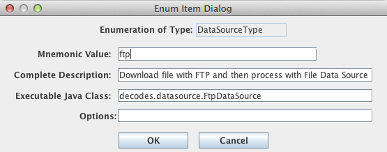
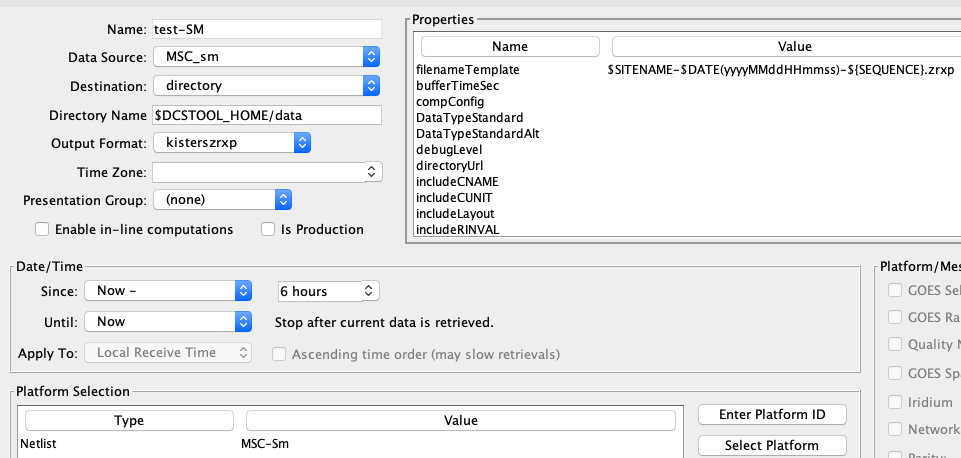
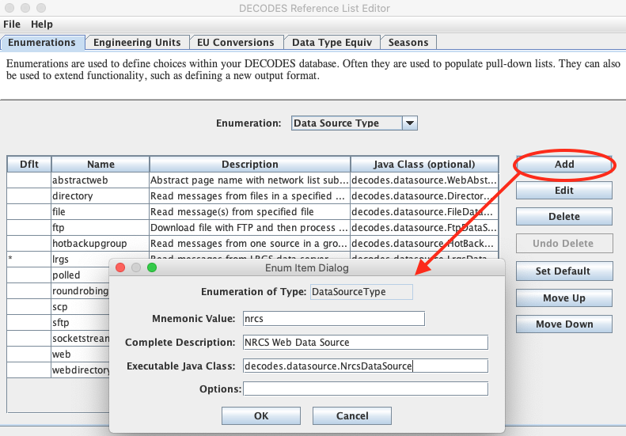
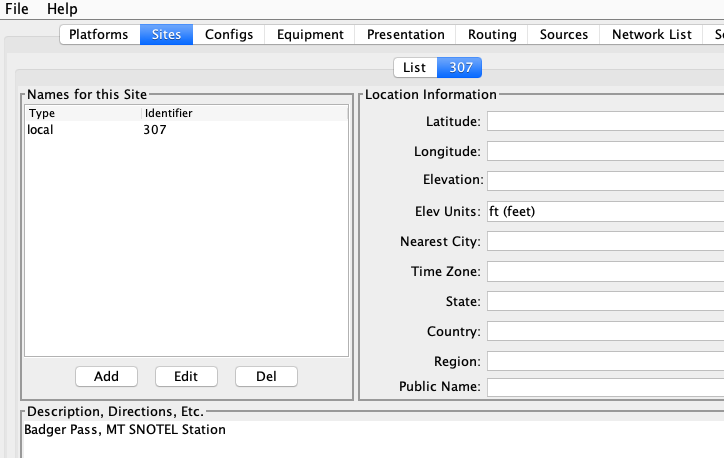
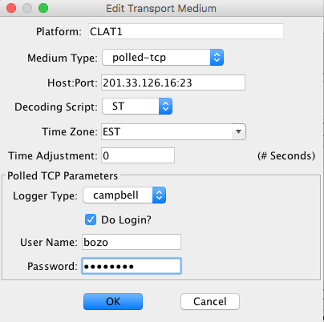

############################
Routing and Scheduling Guide
############################

.. 
    This Document is part of the OpenDCS Software Suite for environmental
    data acquisition and processing. The project home is:
    https://github.com/opendcs/opendcs

    See INTENT.md at the project home for information on licensing.

.. contents. Table of Contents
   :depth: 3

Data Sources
============

Data Sources provide Raw Messages to DECODES for processing. There are
several types:

-  LRGS – Retrieves raw messages from a remote LRGS server over the
   network.

-  HotBackupGroup – An ordered group of LRGS data sources. It switches
   to a backup server if a primary server becomes unavailable.

-  File – Read data from a specified file

-  Directory – Continually scan a directory and process files as they
   appear

-  Socket Stream – Connect to a socket and process a stream of data

Figure 1 shows a data source that pulls data from the CDADATA machine
operated by NESDIS at Wallops, VA. Note the properties that are
appropriate for LRGS data sources:

-  host: host name or IP address of the LRGS

-  username: The figure shows xxxxxx. You must supply an actual user
   name given to you by Wallops CDA.

-  port: (optional) You only need to enter this if it is something other
   than the default 16003.

Secure Values
-------------

DataSource that require a username and password can and should use the new properties mechanism.
Instead of specifiying the username and password directly a property provider and parameters can
be set to retrieve the values from appropriate sources such as environment variables or files.

The following providers are provided. Additional providers can be added by downstream users. See the Developer Documentation for
more information.

+--------------+-------------------------------------------------+
| **Provider** | **Description**                                 |
+--------------+-------------------------------------------------+
|DcsVariables  |So you acquire values like `DCSTOOL_USERDIR`     |
|              |By using `${DCSTOOL_USERDIR}`                    |
+--------------+-------------------------------------------------+
|Environment   |Retreieves arbitrary variable from the           |
|              |application environment using                    |
|              |`${env.VARIABLE_NAME`                            |
+--------------+-------------------------------------------------+
|Java          |Retrieves abritary variable from the application |
|Properties    |`System.properties` using                        |
|              |`${java.PROPERTY_NAME}`                          |
+--------------+-------------------------------------------------+
|Secrets File  |Retreives files contents from a defined file     |
|              |using `${file.PATH}` where path is suitable for  |
|              |`new File(String path)`. Assumes text file.      |
+--------------+-------------------------------------------------+

The property value sources can be nested as needed; however, it is prefered to use a single provider per property.

.. warning::
   The Secrets Properties providers are a recent addition. It is possible that not all DataSource username/password
   retrievals have been adapted to the new system. Please informs us if the usage is missing on any DataSources you are using.

   Additinoally not all properties support environment expansion at all; if you feel a given property anywhere should please
   inform us.

   If you have implemented a custom DataSource we recommend updating your code to use the feature as soon as practical.

Figure : Data Source Edit Panel showing LRGS Data Source.

The following subsections describe each data source type in detail.

.. _leg-route-source-properties-lrgs:

LRGS Data Source
----------------

LRGS Data Sources are used to connect to LRGS or DRS systems over the
network. The LDDS Server must be running on the LRGS you want to connect
to.

Properties for the LRGS Data Source may be placed in the Data Source
record or the Routing Spec Record in your DECODES database. Properties
defined in the Routing Spec record will override those of the same name
defined in the Data Source record.

So, for example, if the Data Source record contains “username=joe”, but
the Routing Spec record contains “username=ted”, THEN “ted” will be the
username passed to the LRGS server.

Accepted properties are as follows:

-  host: The host name or IP Address of the LRGS system to connect to.
   (Optional, If missing, the name of the data source object is used.)

-  port: Port number for this LRGS’s server. (Optional, default = 16003)

-  username: registered user on the LRGS server (required)

-  password: Some LRGS servers are configured to require passwords. If
   this is the case, you will need to enter the password here.
   **Warning! The password will be stored in clear text in the SQL
   database and XML files.**

-  single: (Default=false) The newer LRGS servers have a new feature
   whereby many DCP messages can be returned for a single request. By
   default, DECODES will use this feature if the server supports it. To
   force the old (single message per request) behavior, add a property
   “single” with a value of either “on”, “true”, or “yes”.

-  sendnl: (Default=true) – Old DRS servers do not support network list
   transfers. Set this to false when connecting to such servers. The
   data source will then assume that the network lists are already
   loaded on the DRS. You must then transfer the list using some other
   mechanism (e.g. FTP) prior to running the routing spec.

-  response.timeout: (Default=60 seconds) This is the number of seconds
   to wait for a response from this server. See discussion of timeouts
   below.

Each time an LRGS is initialized, it is passed the new search criteria
from the routing specification. This information includes the “since”
and “until” times, network lists, and the routing spec properties.

The Routing Spec may contain a property called “lrgs.timeout”, set to a
number of seconds. If so, this value will be used by the LRGS data
source. The default timeout is 60 seconds.

The routing spec will exit with the LRGS Data Source determines that the
specified “until time” has been reached. If no until time is specified,
the routing spec will continue running indefinitely.

Timeouts in LRGS Data Sources
~~~~~~~~~~~~~~~~~~~~~~~~~~~~~

There are two timeout values that effect the operation of an LRGS Data
Source:

The “response.timeout” property in the LRGS Data Source object controls
how long to wait for a response from the server after sending a request.
The purpose of this timeout is to catch connections that have failed.
For example, the server is no longer responding or a WAN link has gone
down.

The “lrgs.timeout” property *in the Routing Spec object*, specifies the
maximum number of seconds to wait for the next message to arrive. This
means, even if a link is up and the server is responding to each request
in a timely fashion, wait no more than this many seconds for the next
message. The purpose of this timeout is to catch problems upstream from
the server.

The “lrgs.timeout” property is associated with the routing spec (not the
Data Source) because it depends on what data you are retrieving. For
example, if I am getting data from a single DCP that reports hourly, I
might set lrgs.timeout to 3660 (1 hour and 1 minute).

In most cases, the “response.timeout” should be fairly low. The default
value of 60 seconds should suffice.

When a timeout (of either type) occurs, the LRGS Data Source throws an
exception and…

-  If this LRGS is part of a Hot Backup Group, the group will attempt to
   connect to another LRGS.

-  If this LRGS is the sole data source, the routing spec will
   terminate.

.. _leg-route-source-properties-file:

File Data Source
----------------

A File Data Source reads a series of DCP messages from a single file. It
processes the file from beginning to end and returns each message found
therein. After reaching the end of the file, the Data Source causes the
routing spec to exit.

Accepted properties for a File Data Source are as follows:

.. table:: Table 8‑: Properties for Directory Data Source.

   +----------------+--------+--------------------------------------------+
   | **Name**       | **\    | **Description**                            |
   |                | Value\ |                                            |
   |                | Type** |                                            |
   +----------------+--------+--------------------------------------------+
   | filename       | path   | If present, this value will be used as the |
   |                |        | file name to be read. It can be a complete |
   |                |        | path name or a filename relative to the    |
   |                |        | current working directory. If this         |
   |                |        | property is absent, the name of the data   |
   |                |        | source will be assumed to be a file name.  |
   |                |        | The value may also contain environment     |
   |                |        | variables as described in section 0.       |
   +----------------+--------+--------------------------------------------+
   | before         | del    | A special string that delimits the         |
   |                | imiter | beginning of a new message in the file.    |
   |                |        | This string may contain binary and escaped |
   |                |        | characters such as \\n (newline) or \\001  |
   |                |        | (ASCII STX).                               |
   +----------------+--------+--------------------------------------------+
   | after          | del    | special string the delimits the end of a   |
   |                | imiter | message in the file.                       |
   +----------------+--------+--------------------------------------------+
   | MediumType     | name   | Specifies the type of data stored in the   |
   |                |        | file, such as “GOES”, or “data-logger”.    |
   +----------------+--------+--------------------------------------------+
   | MediumId       | name   | Specifies the transport medium ID of the   |
   |                |        | platform that generated the messages in    |
   |                |        | the file. Optional: Only use this if all   |
   |                |        | the messages in the file came from the     |
   |                |        | same platform, such as an EDL file.        |
   |                |        | Typically, the MediumId can be constructed |
   |                |        | from information in the message header so  |
   |                |        | specifying a property is not necessary.    |
   +----------------+--------+--------------------------------------------+
   | LengthAdj      | number | Some header types (like Vitel) report      |
   |                |        | message length wrong. Use this kludge to   |
   |                |        | adjust the length before attempting to     |
   |                |        | read the message bodies.                   |
   +----------------+--------+--------------------------------------------+
   | OneMessageFile | B      | Default=false. When set to true, DECODES   |
   |                | oolean | assumes that the entire file contains one  |
   |                |        | message.                                   |
   +----------------+--------+--------------------------------------------+
   | gzip           | B      | Default=false. Set to true to gunzip the   |
   |                | oolean | file as it is being read.                  |
   +----------------+--------+--------------------------------------------+
   | ParityCheck    | String | “none” (default) = no parity checking.     |
   |                |        | “odd” means do an odd parity check and     |
   |                |        | replace bad characters with ‘$’ and strip  |
   |                |        | partiy from all results. Likewise “even”   |
   |                |        | does an even check. “strip” means to strip |
   |                |        | parity bits but do no checking.            |
   +----------------+--------+--------------------------------------------+

For added flexibility, the filename property may contain environment
variables preceded with a dollar sign. For example, set the filename
property to **$FILENAME**. Then start the routing spec with the -D
argument defining the filename, as follows:

rs -e -DFILENAME=/usr/local/mydata/cr10-1.dat specname

Delimiting Messages Within the File
~~~~~~~~~~~~~~~~~~~~~~~~~~~~~~~~~~~

The ‘before’ and ‘after’ strings are optional. Here is how DECODES
interprets them:

-  If neither ‘before’ or ‘after’ is specified, the entire file is
   assumed to contain a single message.

-  If ‘before’ is specified, but ‘after’ is not. DECODES will scan the
   file for the ‘before’ string and return data following it, up to, but
   not including the next ‘before’ string. The final message terminates
   at end-of-file. Any data in the file prior to the first ‘before’
   string will be ignored.

-  If ‘after’ is specified, but ‘before’ is not. The first message
   starts at the beginning of the file and continues up to, but not
   including, the first occurance of the ‘after’ string. ny data at the
   end of the file not terminated by the ‘after’ string will be ignored.

-  If both ‘before’ and ‘after’ are specified, only completely delimited
   messages will be processed from the file.

Directory Data Source
---------------------

A “Directory Data Source” allows you to designate one or more
directories on your system into which data files are placed. This is
typically used for Electronic Data Logger) files.

You use properties to specify the directories and other settings. The
routing spec will continually “watch” the directories for new files to
appear. When a file is found it is decoded. The following properties are
accepted. The property name is *not* case sensitive, but in some cases
(e.g. a UNIX file name) the property value *is* case sensitive.

.. table:: Table 9‑1: Column Names supported by Transmit Monitor Formatter.

   +--------------+--------+----------------------------------------------+
   | **Name**     | **\    | **Description**                              |
   |              | Value\ |                                              |
   |              | Type** |                                              |
   |              |        |                                              |
   +--------------+--------+----------------------------------------------+
   | D\           | Path   | The path name to the directory to be         |
   | irectoryName |        | watched. The value may contain environment   |
   |              |        | variables (see below).                       |
   +--------------+--------+----------------------------------------------+
   | FileExt      | S\     | Only files with this extension will be       |
   |              | tring  | processed from the directory. Other files    |
   |              |        | will be ignored.                             |
   +--------------+--------+----------------------------------------------+
   | Recursive    | Bo\    | If true, then DirectoryName is taken as the  |
   |              | olean  | root of a hierarchy of directories. All      |
   |              |        | sub-directories (and sub-sub-directories,    |
   |              |        | etc.) are also watched for files.            |
   +--------------+--------+----------------------------------------------+
   | Na\          | Bo\    | Some EDL files do not have a complete medium |
   | meIsMediumId | olean  | identifier in the header. Set this to true   |
   |              |        | if the file-name itself is to be taken as    |
   |              |        | the medium identifier. Note: If a FileExt is |
   |              |        | specified, it is stripped from the name      |
   |              |        | before using it as a medium ID.              |
   +--------------+--------+----------------------------------------------+
   | Subd\        | Bo\    | Use this with the Recursive flag if the      |
   | irIsMediumId | olean  | sub-directory name is to be taken as the     |
   |              |        | medium ID.                                   |
   +--------------+--------+----------------------------------------------+
   | DoneDir      | Path   | If specified, files that have been           |
   |              |        | successfully processed will be moved to this |
   |              |        | directory.                                   |
   +--------------+--------+----------------------------------------------+
   | DoneExt      | S\     | If specified, files that have been           |
   |              | tring  | successfully processed will be renamed with  |
   |              |        | this extension.                              |
   +--------------+--------+----------------------------------------------+
   | On\          | Bo\    | Default=false. If true, DECODES assumes that |
   | eMessageFile | olean  | each file in the directory contains a single |
   |              |        | message. Turn this feature off by adding a   |
   |              |        | property explicitly set to false.            |
   +--------------+--------+----------------------------------------------+
   | MediumType   | name   | Specifies the type of data stored in files   |
   |              |        | in this directory, such as “GOES”, or        |
   |              |        | “data-logger”.                               |
   +--------------+--------+----------------------------------------------+
   | Do\          | Bo\    | Default=true. ‘False’ will cause the input   |
   | neProcessing | olean  | file to be deleted after processing.         |
   +--------------+--------+----------------------------------------------+
   | FileN\       | S\     | If the medium ID is only the first part of   |
   | ameDelimiter | tring  | the file name, perhaps followed by a         |
   |              |        | time-stamp, you can specify a delimiter      |
   |              |        | here. The default delimiter is a single      |
   |              |        | period “.”. See the discussion below on File |
   |              |        | Name Delimiters.                             |
   +--------------+--------+----------------------------------------------+
   | fileN\       | Bo\    | Default=false, set to true if data between   |
   | ameTimeStamp | olean  | the delimiter and the filename extension is  |
   |              |        | to be taken as the message time-stamp, which |
   |              |        | must be in the format MMDDYYYYHHMMSS.        |
   +--------------+--------+----------------------------------------------+
   | gzip         | Bo\    | Default=false. Set to true to gunzip the     |
   |              | olean  | file as it is being read.                    |
   +--------------+--------+----------------------------------------------+
   | ParityCheck  | S\     | “none” (default) = no parity checking. “odd” |
   |              | tring  | means do an odd parity check and replace bad |
   |              |        | characters with ‘$’ and strip partiy from    |
   |              |        | all results. Likewise “even” does an even    |
   |              |        | check. “strip” means to strip parity bits    |
   |              |        | but do no checking.                          |
   +--------------+--------+----------------------------------------------+
   | fil\         | In\    | Allow this many seconds to elapse since last |
   | eRestSeconds | teger  | modify time before processing file. This     |
   |              |        | prevents processing of a file that is        |
   |              |        | currently being written.                     |
   +--------------+--------+----------------------------------------------+

**Setting up a Tree of Directories for Data Logger Files:**

To set up a tree of directories to be watched, set ‘DirectoryName’ to
the root of the tree, and set ‘Recursive’ to true. If you want to devote
each sub-directory to a specific platform, set ‘SubdirIsMediumId’ to
true. Then name each subdirectory with the transport identifier in the
platform.

Example: I have two data-loggers. The platform records have medium IDs
of “01435532-cr10-1” and “05523352-cr10-1”. The file headers do not
contain the STATION identifier. The data files will all end in “.dat”.
After processing, I want the files renamed with the extension “.done”.

I can set up a tree as follows:

-  Parent Dir: $HOME/edl-data

-  Sub Dir: 01435532-cr10-1

-  Sub Dir: 05523352-cr10-1

I set up a DirectoryDataSource with the following parameters:

.. table:: Table : Properties for Kisters ZRXP Formatter.

   +----------------------------------+-----------------------------------+
   | DirectoryName                    | $HOME/edl-data                    |
   +----------------------------------+-----------------------------------+
   | FileExt                          | .dat                              |
   +----------------------------------+-----------------------------------+
   | Recursive                        | true                              |
   +----------------------------------+-----------------------------------+
   | SubdirIsMediumId                 | true                              |
   +----------------------------------+-----------------------------------+
   | DoneExt                          | .done                             |
   +----------------------------------+-----------------------------------+

I then build a routing spec that uses this data source. When I run the
routing spec, it watches for new files to appear. I place the data files
in the appropriate sub-directory and they are immediately processed.

**Files with Errors:**

If a file contains un-recoverable errors, we don’t want the routing spec
to abort, as it would if we were only processing a single file. When
such an error occurs, DirectoryDataSource renames the file with the
extensions “.err” and leaves it in the input directory. FAILURE messages
will be generated in the log explaining the nature of the problem.

**Only Process Complete Files**

We only want to process files that are complete. Consider the following
scenario: I am copying a large EDL file from a floppy disk into the
input directory. Before the copy is complete, the Directory Data Source
grabs the (partial) file and processes it. There are two way to avoid
this problem:

-  Specify a FileExt property like “.dat”. Copy the file in from the
   floppy disk *without* the extension, and then rename the file *with*
   the extension.

-  Unix Only: Copy the file to a temporary directory on the same mounted
   disk partition. Then use the ‘mv’ command to move it into the input
   directory.

**File Name Delimiters**

The ‘fileNameDelimiter’ property is used in conjunction with
‘nameIsMediumId’. If only the first part of the name is to be considered
the medium ID. Set fileNameDelimiter to the character that separates the
mediumID from the rest of the file name. The default is a single period.
For example suppose the file from station ‘CORA’ has a time-stamp in the
name:

CORA-0905041230.dat

In this case, set nameIsMediumId=true, fileNameDelimiter=- (a single
hyphen), and fileExt=”.dat”.

Files with No Header
~~~~~~~~~~~~~~~~~~~~

When processing files that contain no header, you need to set the
property OneMessageFile=true. This tells DECODES that the entire file is
to be taken as a single message.

Then DECODES needs a way to associate the file to a platform. The medium
ID can be found in 3 places:

1. The file name: Add a property NameIsMediumId=true

2. The subdirectory containing the file: That is, you might have a
   hierarchy of directories with a separate subdirectory for each
   platform. The subdirectory is to be taken as the medium ID. Then set
   property SubdirIsMediumId=true

3. If all files from a given data source have the same medium ID, you
   can set a property “MediumID” with the value.

In the data source record, set medium type to either “NoHeader”, or
“Other”.

In the Platform Transport Medium record, set Medium Type to “Other”. If
“Other” is not one of the choices in the pull-down list, use the
Reference List Editor “rledit” program to add it.

.. _leg-route-source-properties-hotbackup:

Hot Backup Group Data Source
----------------------------

A Hot Backup Group Data Source is primarily used for a set of LRGS
connections. One connection may fail, in which case we want our routing
spec to try another. This makes your routing spec more reliable,
particularly if this is a real-time routing spec that runs continuously
(i.e. no “Until Time”).

Currently there is only one property that is used by a Hot Backup Group:

-  recheck: (default = 900 seconds, or 15 minutes) – If the currently
   active data source is not the first one in the list, the Hot Backup
   Group will attempt to connect to higher priority data sources at this
   period.

-  fudge: (default = 120 seconds, or 2 minutes) – Amount of time to
   back-up after connecting to new data source.

The Hot Backup Group contains an *ordered* list of LRGS data sources.
The group will prefer the members in the order they are listed.

Upon start-up, the group will attempt to connect to a LRGS, starting
with the first one listed. Once a successful connection is made, this
LRGS becomes *active*. The group then reads DCP messages from this
source until…

-  The active source fails (either a timeout or broken connection), or

-  The active source is not first in the list *and* the recheck period
   expires.

When this happens, the group will try to connect to a source, once again
starting from the first in the list.

When the group changes from one active source to another, it passes the
new source the network lists and search criteria with one modification:
The ‘since’ time is adjusted to:

LastMessageTime – fudge

… where LastMessageTime is the time of the last DCP message I received.
The ‘fudge’ factor (default=120 seconds) can be controlled via a
property setting.

The purpose of this fudge factor is to account for small variations in
the system clocks of the LRGS members. If you have all your systems
synchronized via NTP you can make the fudge factor very small.

Larger fudge factors may result in duplicate messages: A DCP message
received from one LRGS and then after a switch, the same message
received from the new LRGS.

Round Robin Group Data Source
-----------------------------

A round-robin group contains a list of other data sources.

The purpose of a round-robin group is to continually read data from all
data sources in the group. This differs from a hot-backup group, which
only uses one data source at a time

.. _leg-route-source-properties-socketstream:

Socket Stream Data Source
-------------------------

A socket stream data source opens a socket and reads a one-way stream of
data containing raw DCP messages. Some DRGS and HRIT product provide
such a stream.

Accepted properties for SocketStreamDataSource are:

-  host = the host name or IP address of the server

-  port = the port number of the socket to be opened

-  lengthAdj = a negative or positive number. The default value is -1.
   (See below)

-  delimiter = A string that begins each message, use \\r for carriage
   return and \\n for linefeed. The default delimiter is \\r\n. (See
   below)

-  endDelimiter = A string that marks the end of each message. This is
   required if header is “noaaport”. The NOAAPORT message format
   determines the message length not from the header but from the
   beginning and end delimiters.

-  header = GOES, VITEL, NOAAPORT, Vaisala. The default is GOES (See
   below)

-  ParityCheck = see description of this property under File Data
   Source.

**Delimiters and Length Adjustments**

Each message must start with a 37-byte DOMSAT header. The last 5 bytes
of the header is the number of message bytes to follow. Immediately
following the message data, a delimiter is expected. The delimiter is
not included in the message length.

The Vitel DRGS reports a message length which is actually 4 more than
the number of bytes actually present in the message data. Each message
is terminated by a carriage return and linefeed. Hence the proper
settings for a Vitel DRGS are:

lengthAdj = -4

delimiter = \\r\n

**How messages are parsed**

The socket is opened. The input software expects the stream to start
with a message header, followed by the message data, followed by the
delimiter. This cycle repeats indefinitely until the socket is closed.

The input software can get out of sync in one of the following ways:

-  Detecting an invalid 37-byte header (no DCP address, channel number,
   or message length).

-  Failing to find the delimiter string

When this happens, the input software goes into “hunt mode”. It will
read characters from the socket looking for the delimiter sequence. Once
found it will again attempt to read the 37 byte header.

Look at the debug-log when running the routing spec. If your ‘lengthAdj’
and ‘delimiter’ parameters are correct you will never see the messages
saying that the software has skipped data. If you do see these messages:

-  Consult the manual for the server system to determine how messages
   are formatted.

-  Make sure the delimiter string is correct as described above.

-  Try adjustin lengthAdj downward, into negative numbers
   (incrementally).

**Network Lists and Time Ranges**

Since a socket-stream is assumed to be a real-time data source, the
input software will ignore the ‘since’ and ‘until’ times specified in
the routing spec.

Network lists will be used to filter incoming data. Only messages whose
DCP address is contained in one of the routing-specs network lists will
be processed. If the routing spec contains no network lists, all data
will be processed.

**Header Format**

The “header” property should be one of “GOES”, “VITEL”, or “NOAAPORT”.
The default is “GOES” if the property is missing. The Vitel header is
slightly different in that it does not include the failure-code field,
causing subsequent fields to be shifted one character to the left.

Using SocketStreamDataSource for NOAAPORT
~~~~~~~~~~~~~~~~~~~~~~~~~~~~~~~~~~~~~~~~~

NOAAPORT messages are received over a socket in the following format:

*[SOH]*\\r\r\n\ *NNN*\\r\r\n\ *HHH[RS]DDD*\\r\r\n\ *[ETX]*

…where

-  *[SOH]* is an ASCII Start-Of-Header character (octal \\001)

-  *NNN* is a NOAAPORT 3 digit sequence number

-  *HHH* is a NOAAPORT Header (ignored)

-  *[RS]* is an ASCII Record-Separator character (octal \\036)

-  *DDD* is the DCP message containing time stamp and other header
   fields before and after the message proper.

-  *[ETX]* is an ASCII End-of-Text character (octal \\003)

The *DDD* data field contains all the header fields and message-data
that we need. We want to ignore everything else. Consequently use the
following Data Source Properties:

-  host

-  port =

-  delimiter = \\036

-  endDelimiter = \\r\r\n\003

-  header = NOAAPORT

The Socket Stream will then process only the DDD (data) field between
the *[RS]* and \\r\r\n\ *[ETX]*, and ignore everything else.

The Data Field itself will have the following format:

AAAAAAAA DDDHHMMSS *ddd...* SSFFNN CCCs

…where

-  AAAAAAAA is the 8-hex-char DCP Address

-  DDDHHMMSS is the date/time stamp.

-  ddd… is the actual message data

-  SS is the signal strength

-  FF is the Frequence offset

-  NN is a placeholder for IFPD (it is always set to ‘NN’)

-  CCC is the GOES Channel number, padded on the left with blanks (3
   characters)

-  s is the GOES Spacecraft (E or W)

.. _leg-route-source-abstract:

Abstract Web Data Source
-------------------------

A Web Data Source reads data files over a web connection. The connection
is specified by an URL (Uniform Resource Locator). The URL may be
specified completely or it may be contain parameters such as $DATE or
$MEDIUMID which are evaluated over the DCPs in the provided network
list.

An example will explain how to use this data source. First run “rledit”
to make sure you have the needed Enumeration records:

-  Run the “rledit” script or rledit.bat in the bin directory under OPENDCS.

::

   rledit

::

   rledit.bat

-  On the Enumerations tab, select Enumeration “Data Source Type”

-  Make sure the following two entries exist:

   -  abstractweb with Java
      Class=decodes.datasource.WebAbstractDataSource

   -  web with Java Class=decodes.datasource.WebDataSource

-  Hit File – Save to DB.

Figure : Required Data Source Enumeration Records for Web Data Sources.

Now as an example, we will be downloading data from the SNOTEL web site.
In the Database Editor (dbedit), create a new data source as shown in
Figure 3. We set OneMessageFile to true because each page we download
has data for a single station and thus should be considered a single
message. Since the page has no parsable header, we also set header to
“noheader”. The Abstract URL we entered is:

http://www.wcc.nrcs.usda.gov/reportGenerator/view_csv/customSingleStationReport%2Cmetric/hourly/${MEDIUMID}%3AMT%3ASNTL|id%3D%22%22|name/-167%2C0/WTEQ%3A%3Avalue%2CSNWD%3A%3Avalue%2CPREC%3A%3Avalue%2CTOBS%3A%3Avalue

Note that it has the variable ${MEDIUMID} in the middle. When we run the
routing spec, this will be replaced by the values in the network list we
supply.

Figure : Example of Abstract URL Data Source.

The routing spec that uses this data source is shown in Figure 4. Note
the network list that is assigned. The code will iterate over the
platforms in the network list and evaluate the URL for each one. It will
then download the web page and parse the entire page as a single DCP
message with no header.

Figure 5 shows the network list. Note the numeric Transport (medium) IDs
307, 469, etc. These will be substituted into the abstract URL. Thus the
first URL constructed will be:

http://www.wcc.nrcs.usda.gov/reportGenerator/view_csv/customSingleStationReport%2Cmetric/hourly/**307**\ %3AMT%3ASNTL|id%3D%22%22|name/-167%2C0/WTEQ%3A%3Avalue%2CSNWD%3A%3Avalue%2CPREC%3A%3Avalue%2CTOBS%3A%3Avalue

The resulting report is shown in Figure 6.

Figure : Routing Spec that uses an Abstract Web Data Source

Figure : SNOTEL Network List used by Abstract Web Data Source.

Figure : Snotel Report Downloaded from the Web

.. _leg-route-source-properties-ftp:

FTP Data Source
---------------

The FTP Data Source was added in the OpenDCS 6.1 release. If you
installed a previous version and then upgraded to 6.1, you may need to
manually add the Enumeration record for FTP Data Source.

To do this, run “rledit” and ...

-  On the Enumerations tab, select Enumeration “Data Source Type”

-  Make sure an entry exists with name “ftp”. If not, hit Add and fill
   out the form as shown in Figure 7. Be sure to type the Java Class
   Name exactly as shown. Capitalization matters:

   -  decodes.datasource.FtpDataSource

-  Hit File – Save to DB.

Figure : Form for Adding FTP Data Source in Reference List Editor
(rledit).

Now you can enter the DECODES Database Editor and create a Data Source
record with type “ftp”. The FTP Data Source can accept the following
properties:

.. table:: Table : Properties for CSV Formatter.

   +---------------+--------+--------------------------------------------+
   | **Name**      | **\    | **Description**                            |
   |               | Value\ |                                            |
   |               | Type** |                                            |
   +---------------+--------+--------------------------------------------+
   | host          | Ho     | Hostname or IP Address of the FTP Server   |
   |               | stname |                                            |
   |               | or IP  |                                            |
   |               | Addr   |                                            |
   +---------------+--------+--------------------------------------------+
   | port          | I      | Default = 21. FTP Port number on server.   |
   |               | nteger |                                            |
   +---------------+--------+--------------------------------------------+
   | username      | String | Username to use when connecting to FTP     |
   |               |        | server                                     |
   +---------------+--------+--------------------------------------------+
   | password      | Pa     | Password to use when connecting to FTP     |
   |               | ssword | server                                     |
   +---------------+--------+--------------------------------------------+
   | remoteDir     | Dir    | Default = empty string, meaning that the   |
   |               | ectory | file is at the root on the FTP server.     |
   |               |        | Specify remote directory on server where   |
   |               |        | the file is located.                       |
   +---------------+--------+--------------------------------------------+
   | localDir      | Dir    | Local directory in which to save the file. |
   |               | ectory | If not specified, it defaults to           |
   |               |        | $DCSTOOL_USERDIR/tmp.                      |
   +---------------+--------+--------------------------------------------+
   | filenames     | String | A space-separated list of file names to    |
   |               |        | download from the remote directory. Note   |
   |               |        | the ‘s’ on the end of the property name.   |
   |               |        | This property is required.                 |
   +---------------+--------+--------------------------------------------+
   | xferMode      | Enum   | Default = Binary. Set to ASCII to have FTP |
   |               |        | do carriage return/linefeed processing.    |
   |               |        | This is not normally needed for DCP        |
   |               |        | messages stored in an FTP file.            |
   +---------------+--------+--------------------------------------------+
   | del           | B      | Default = false. Set to true to attempt to |
   | eteFromServer | oolean | delete the file from the server after      |
   |               |        | retrieval. This may be disallowed by the   |
   |               |        | server. If an error occurs, it will not    |
   |               |        | abort processing of the file.              |
   +---------------+--------+--------------------------------------------+
   | ftpActiveMode | B      | Default=false. For security reasons, most  |
   |               | oolean | public FTP servers operate in Passive      |
   |               |        | mode.                                      |
   +---------------+--------+--------------------------------------------+
   | O             | B      | Default=false. If the entire file is to be |
   | neMessageFile | oolean | treated as a message, set this to true.    |
   +---------------+--------+--------------------------------------------+
   | N             | B      | Default=false. Usually used in conjunction |
   | ameIsMediumId | oolean | with OneMessageFile=true. This property,   |
   |               |        | if true, causes the file name to be taken  |
   |               |        | as the medium ID for the purpose of        |
   |               |        | linking it to a platform.                  |
   +---------------+--------+--------------------------------------------+

In addition to these properties, all of the properties specified in
section 2.2 above for File Data Source are also accepted. After
downloading, the local copy will be processed as if it were a File Data
Source.

Web Directory Data Source
-------------------------

Web Directory Data Source was designed for the Meteorological Service of
Canada (MSC) depot of bulletins containing observation and forecast
data. This can be found at:

http://dd.weather.gc.ca/bulletins/

The service provides a directory tree that can be traversed to find the
data you’re interested in. DECODES must construct an URL containing a
directory. It must then traverse the files in that directory and read
the files referenced therein.

For example, the URL contains a directory of file names:

http://dd.weather.gc.ca/bulletins/alphanumeric/20190319/SM/CWAO/11/

.. warning::
    At time of document update These link are not working as the given dates are 
    now too old. Follow the "bulletins" link above to find actual data.

The directory contains a date (20190319) and an hour number (11). Time
Zone is always UTC.

The directory contains several file names:

   `SMCN01_CWAO_191200__71092_38380 <http://dd.weather.gc.ca/bulletins/alphanumeric/20190319/SM/CWAO/11/SMCN01_CWAO_191200__71092_38380>`__ 2019-03-19 11:58 96
   `SMCN01_CWAO_191200__71094_36632 <http://dd.weather.gc.ca/bulletins/alphanumeric/20190319/SM/CWAO/11/SMCN01_CWAO_191200__71094_36632>`__ 2019-03-19 11:59 96
   `SMCN03_CWAO_191200__71467_58240 <http://dd.weather.gc.ca/bulletins/alphanumeric/20190319/SM/CWAO/11/SMCN03_CWAO_191200__71467_58240>`__ 2019-03-19 11:59 114
   `SMCN08_CWAO_191200__71911_46002 <http://dd.weather.gc.ca/bulletins/alphanumeric/20190319/SM/CWAO/11/SMCN08_CWAO_191200__71911_46002>`__ 2019-03-19 11:59 96
   `SMCN09_CWAO_191200__71948_12651 <http://dd.weather.gc.ca/bulletins/alphanumeric/20190319/SM/CWAO/11/SMCN09_CWAO_191200__71948_12651>`__ 2019-03-19 11:58 96

The file names contain a time stamp (191200) which means day 19 (of
March), at time 12:00, again in UTC. The file names also contain a
numeric station identifier (71092, 71094, etc.)

Note that the date/time and the field numeric field (a check sum) cannot
be predicted by DECODES. So in order for DECODES to traverse the depot,
it must build a directory name, read the filenames therein, scan for
station IDs it is interested in, and then open these files.

The files then contain METAR data::

    SMCN03 CWAO 191200
    AAXX 19124
    71467 46/// /1620 11126 21136 39917 40032 56005 6///1
    333 11140 21157 4/023 7////=

If you have upgraded from a previous version of OpenDCS (prior to 6.6),
then you may not have the Data Source Type for Web Directory in your
database. Start the Reference List Editor (command “rledit”). Click on
the Enumerations tab. Select the Data Source Type enumeration. Click the
Add button to the right of the list and fill out the form as shown
below.

Be careful to enter the Executable Java Class exactly as shown:

decodes.datasource.WebDirectoryDataSource

Using the SINCE and UNTIL time of the routing spec, DECODES will
construct directory names within the time range. It will then read the
files therein and attempt to match the IDs in the file name to an ID in
a network list assigned to the routing spec.

Properties used by the Data Source include:

.. table:: Table : Properties for CSV Formatter.

   +---------------+-----------+-----------------------------------------+
   | **Property    | **\       | **Description**                         |
   | Name**        | Default** |                                         |
   +===============+===========+=========================================+
   | directoryUrl  | none -    | A template for constructing the         |
   |               | required  | directory URL. May contain              |
   |               |           | $DATE(*format*) specs.                  |
   +---------------+-----------+-----------------------------------------+
   | urlF\         | u\        | Used to parse the file names in the     |
   | ieldDelimiter | nderscore | directory. The delimiter separates the  |
   |               | \_        | different fields of the file name.      |
   +---------------+-----------+-----------------------------------------+
   | urlTimePos    | 3         | The field number of the time within a   |
   |               |           | file name. In the above examples,       |
   |               |           | “191200” is in the 3\ :sup:`rd` field   |
   |               |           | of the file name.                       |
   +---------------+-----------+-----------------------------------------+
   | urlIdPos      | 5         | The field number of the platform ID     |
   |               |           | within a file name. In the above        |
   |               |           | examples, the first line has 71091 in   |
   |               |           | the 5\ :sup:`th` field. Note there are  |
   |               |           | two underscores preceding the station   |
   |               |           | ID, thus the 4\ :sup:`th` field is      |
   |               |           | empty.                                  |
   +---------------+-----------+-----------------------------------------+
   | urlTimeFormat | ddHHmm    | The format of the time within a file    |
   |               |           | name. See the man page for Java’s       |
   |               |           | SimpleDateFormat for a complete list of |
   |               |           | possibilities.                          |
   +---------------+-----------+-----------------------------------------+
   | urlTimeZone   | UTC       | The time zone used to construct         |
   |               |           | directory names and to parse the time   |
   |               |           | from file names.                        |
   +---------------+-----------+-----------------------------------------+

The following figure shows a DECODES data source record using Web
Directory. In most of the properties, the defaults can be used

.. image:: ./media/legacy/routing/im-09-source-webdirectory.png
   :alt: sources web directory
   :width: 6.49444in
   :height: 3.75278in

The following figure shows a DECODES routing spec that uses the MSC_sm
data source shown above:

This routing spec will construct directory URLs for “now – 6 hours”
through “now”. It will read the directories to discover what files are
available. The files with an ID contained in the networklist “MSC-Sm”
will be processed. Other files will be ignored.

Output files will be formatted into Kisters XRZP files and given the
name shown: The Site name, a date/time stamp, and a sequence number with
an extension “.zrxp”. Running this routing spec with the command::

    rs –d1 MSC-sm

... resulted in several files in ZRXP format like the following::

    71078-20190319080000-24.zxrp
    71141-20190319080000-22.zxrp
    71854-20190319080000-11.zxrp
    71876-20190319080000-30.zxrp
    71079-20190319080000-1.zxrp

NOTE: If you want to download the raw files in METAR format, change
Output Format to “raw”.

SCP Data Source
---------------

SCP Data Source can download files from an SCP (Secure Copy) server and
the process the file through DECODES.

If you have updated from an earlier release, you may not have the “scp”
data source type in your database. If not, start the Reference List
Editor with the “rledit” command and:

-  On the Enumerations Tab select the “Data Source Type” enumeration.

-  If “scp” is not in the list, add it with the following values:

   -  Mnemonic Value: scp

   -  Description: Download via SCP and process file

   -  Executable Java Class: decodes.datasource.ScpDataSource

Make sure that the executable class is entered *exactly* as shown above.
Then click File – Save to Db.

The SCP Data Source accepts the following properties, which may be set
either in the Data Source record or in the Routing Spec record:

.. table:: Table : CWMS Connection Parameters.

   +---------------+-----------+-----------------------------------------+
   | **Property    | **\       | **Description**                         |
   | Name**        | Default** |                                         |
   +===============+===========+=========================================+
   | host          | none -    | Host name or IP address of the SCP      |
   |               | required  | server.                                 |
   +---------------+-----------+-----------------------------------------+
   | port          | 22        | Set only if your SCP server uses a non  |
   |               |           | standard port.                          |
   +---------------+-----------+-----------------------------------------+
   | username      | none -    | User name with which to connect to the  |
   |               | required  | SCP server.                             |
   +---------------+-----------+-----------------------------------------+
   | password      | none –    | Password with which to connect to the   |
   |               | required  | SCP server.                             |
   +---------------+-----------+-----------------------------------------+
   | remoteDir     | (default  | If the files you want to download are   |
   |               | dir)      | not in the HOME directory on the        |
   |               |           | server, set this variable.              |
   +---------------+-----------+-----------------------------------------+
   | localDir      | current   | Download the files into this directory  |
   |               | dir       | prior to processing. If not set, files  |
   |               |           | are downloaded to the current           |
   |               |           | directory.                              |
   +---------------+-----------+-----------------------------------------+
   | filenames     | none –    | A space-separated list of files to      |
   |               | required  | download                                |
   +---------------+-----------+-----------------------------------------+

Files are downloaded from the SCP server into the specified “localDir”
directory. Then they are processed by FileDataSource. Thus, any of the
properties for FileDataSource will also be honored here.

SFTP Data Source
----------------

SFTP Data Source can download files from an SFTP (Secure-Shell File
Transfer Protocol) server and the process the file through DECODES.

If you have updated from an earlier release, you may not have the “sftp”
data source type in your database. If not, start the Reference List
Editor with the “rledit” command and:

-  On the Enumerations Tab select the “Data Source Type” enumeration.

-  If “sftp” is not in the list, add it with the following values:

   -  Mnemonic Value: sftp

   -  Description: Download via SFTP and process file

   -  Executable Java Class: decodes.datasource.SftpDataSource

Make sure that the executable class is entered *exactly* as shown above.
Then click File – Save to Db.

The SFTP Data Source accepts the following properties, which may be set
either in the Data Source record or in the Routing Spec record:

.. table:: Table 6‑: Built-in SHEF to CWMS Parameter Code Mapping

   +---------------+-----------+-----------------------------------------+
   | **Property    | **\       | **Description**                         |
   | Name**        | Default** |                                         |
   +===============+===========+=========================================+
   | host          | none -    | Host name or IP address of the SFTP     |
   |               | required  | server.                                 |
   +---------------+-----------+-----------------------------------------+
   | port          | 22        | Set only if your SFTP server uses a non |
   |               |           | standard port.                          |
   +---------------+-----------+-----------------------------------------+
   | username      | none -    | User name with which to connect to the  |
   |               | required  | SCP server.                             |
   +---------------+-----------+-----------------------------------------+
   | password      | none –    | Password with which to connect to the   |
   |               | required  | SCP server.                             |
   +---------------+-----------+-----------------------------------------+
   | remoteDir     | (default  | If the files you want to download are   |
   |               | dir)      | not in the HOME directory on the        |
   |               |           | server, set this variable.              |
   +---------------+-----------+-----------------------------------------+
   | localDir      | current   | Download the files into this directory  |
   |               | dir       | prior to processing. If not set, files  |
   |               |           | are downloaded to the current           |
   |               |           | directory.                              |
   +---------------+-----------+-----------------------------------------+
   | filenames     | none –    | A space-separated list of files to      |
   |               | required  | download.                               |
   +---------------+-----------+-----------------------------------------+
   | del\          | false     | Set to true to have file deleted from   |
   | eteFromServer |           | the server after it is downloaded.      |
   +---------------+-----------+-----------------------------------------+

Files are downloaded from the SFTP server into the specified “localDir”
directory. Then they are processed by FileDataSource. Thus, any of the
properties for FileDataSource will also be honored here.

NRCS Web Data Source
--------------------

This module was added for OpenDCS version 6.8 RC02.

The US Department of Agriculture (USDA) Natural Resources Conservation
Service (NRCS) has a web based application through which many types of
data can be downloaded including, SNOTEL, Reservoir and stream gages,
and climate index stations.

The report generator page can be found at:

https://wcc.sc.egov.usda.gov/reportGenerator/

Using this page you can build reports and then download the results in
HTML or CSV (Comma Separated Value) format.

The DECODES NRCS Web Data Source uses information in your DECODES
database to construct the proper URL to download CSV reports that can be
fed into DECODES and thus ingested into your time series database (e.g.
CWMS, OpenTSDB, or HDB). Here is an example URL that the code
constructs:

`<https://wcc.sc.egov.usda.gov/reportGenerator/view_csv/customMultiTimeSeriesGroupByStationReport/hourly/id="806"|name/-31,-7/BATT::value,TOBS::value>`_

The fields shown in red are dynamically added from information in the
DECODES database:

   hourly This is the report interval. It will retrieve hourly data.
   This is provided via a routing spec property.

   806 This is the Platform’s NRCS Transport Medium taken from a network
   list provided to the routing spec.

   -31,-7 This is the time range in units of the interval provided. In
   this case from 31 hours ago through 7 hours ago.

   BATT,TOBS These are NRCS data types assigned to the sensors in the
   configuration records in your DECODES database. BATT is Battery
   Voltage, TOBS is Observed Air Temperature.

Before using the NRCS Web Data Source you need to set up your database.
Start the reference list editor (command ‘rledit’). You need to add two
different enumeration values. On the Enumerations Tab, select the ‘Data
Source Type’ enumeration. If there is not already an ‘nrcs’ data source,
add one by clicking the Add button and filling out the form as shown
below.

NOTE: The Executable Java Class must be entered exactly:

decodes.datasource.NrcsDataSource

Next, while still on the Enumerations tab, select the ‘Data Type
Standard’ enumeration. If it is not already in the list, click the ‘Add’
button to the right of the list and fill out the form. The Mnemonic
value should be exactly ‘NRCS’. The description is optional.

   .. image:: ./media/legacy/routing/im-12-enumerations-data-type.png
      :width: 6.5in
      :height: 3.28339in

IMPORTANT: Click File – Save to DB before exiting the editor.

Next, import the NRCS presentation group XML file that came with the
release. This will bring in all he known NRCS data types. This file can
be found in the edit-db/presentation directory under the installation.
You can import with the following command:

dbimport $DCSTOOL_HOME/edit-db/presentation/NRCS.xml

Now start the DECODES Database Editor and click the ‘Sources’ tab.
Create a new Data Source record. The one shown below is for downloading
hourly data:

Note the data source type ‘nrcs’ is selected. This links it to the
executable java code. The interval is set to ‘hourly’. You can set
properties here and/or in the routing spec that uses the data source. If
set in both places, the value in the routing spec will override the
value set here. The accepted properties are:

+--------------+--------+----------------------------------------------+
| Property     | Type   | Description & Default Value                  |
| Name         |        |                                              |
+==============+========+==============================================+
| baseUrl      | URL    | This is the base URL for accessing the NRCS  |
|              | String | reports. The default is shown below.         |
+--------------+--------+----------------------------------------------+
| interval     | String | One of hourly, daily, monthly                |
+--------------+--------+----------------------------------------------+
| data\        | String | Default=nrcs. If you want to use something   |
| TypeStandard |        | other than NRCS data types when building the |
|              |        | URL, you can select it here.                 |
+--------------+--------+----------------------------------------------+

The default baseUrl is:

https://wcc.sc.egov.usda.gov/reportGenerator/view_csv/customMultiTimeSeriesGroupByStationReport/

As an example, we will download Battery Voltage and Observed Air
Temperature for two SNOTEL sites:

-  806 – Sylvan Lake, WY

-  307 – Badger Pass, MT

The URL for downloading the last 4 hours of data from the 806 site would
be:

`<https://wcc.sc.egov.usda.gov/reportGenerator/view_csv/customMultiTimeSeriesGroupByStationReport/hourly/id="806"|name/-4,0/BATT::value,TOBS::value>`_

The report generated by this URL is::

    #
    # Sylvan Lake (806)
    # Wyoming SNOTEL Site - 8420 ft
    # Reporting Frequency: Hourly; Date Range: 2020-09-30 00:00 to 2020-09-30 11:00
    #
    # As of: Sep 30, 2020 11:42:39 AM GMT-08:00
    #
    Date,Sylvan Lake (806) Battery (volt),Sylvan Lake (806) Air Temperature  Observed (degF)
    2020-09-30 00:00,13.01,31
    2020-09-30 01:00,12.95,31
    2020-09-30 02:00,12.89,30
    2020-09-30 03:00,12.84,30
    2020-09-30 04:00,12.78,29
    2020-09-30 05:00,12.73,29
    2020-09-30 06:00,12.69,29
    2020-09-30 07:00,12.77,31
    2020-09-30 08:00,13.02,41
    2020-09-30 09:00,14.28,52
    2020-09-30 10:00,14.64,57
    2020-09-30 11:00,14.00,61

Note that NRCS gave us all data from midnight on the current day rather
than the 4 hours we asked for. Sometimes it imposes a minimum.

Also, the report header (lines starting with #) was actually much
longer. We show only the last few lines above.

We will start with a DECODES Configuration Record. The snap below shows
a config named “NRCS-BATT-TOBS”. It has two sensors with NRCS data types
assigned. It has a single Decoding Script called “nrcs-report” that will
parse the report shown above.

.. image:: ./media/legacy/routing/im-14-configs-nrcs.png
   :width: 6.5in
   :height: 4.23611in

Below is a snap of the decoding script. The script has only two lines.

-  The “skip-header” line checks for a ‘#’ at the beginning of the line
   and repeats if there is one. If not it jumps to the line with label
   “data’.

-  The data line skips to the start of the next line and then parses the
   date, time, and two sensor values. It then repeats (by jumping to
   itself) until the report runs out of data.

-  The Data Order is given as Ascending, but it really doesn’t matter
   because each line starts with a time stamp.

-  The Header Type is ‘other’, meaning that the code doesn’t make any
   assumptions about the format of a header.

-  Set the units for each sensor in the middle area.

Next create a Site record for each of your stations. Below is a minimal
site record for Badger Pass. It uses the SNOTEL identifier as a “local”
name. It has a description with the site name. No other information is
needed:

Next, create a Platform record for each station. The snap below shows
the platform record for 307. Note the Transport Medium is of type
“other”. It has the identifier ‘307’. It also specifies the time zone
that will be used when decoding dates & times in the messages.

Next create a network list with the two stations.

-  Give it a unique name. I used ‘SNOTEL-Stations’.

-  Select Transport Medium Type ‘other’.

-  Select your site name preference. I used ‘local’.

-  Click Select Platforms. From the list select both platforms and click
   OK.

USGS Web Data Source
--------------------

This module was added for OpenDCS version 6.8 RC02.

The US Geological Survey (USGS) has a web based application through
which data can be downloaded for any gauge that the USGS monitors.

The REST data service is described here:

https://waterservices.usgs.gov/rest/IV-Service.html

The DECODES USGS Web Data Source module uses the data service by
building URLs for each USGS Site Number in a network list. It uses the
routing spec’s since and until times to specify the time range for the
data. Here is an example URL:

`<https://waterservices.usgs.gov/nwis/iv/?format=rdb&sites=01646500&startDT=2020-10-11T12:00-0400&endDT=2020-10-12T08:00-0400&parameterCd=00060,00065>`_

The fields shown in red are dynamically added from information in the
DECODES database:

Before using the USGS Web Data Source you need to set up your database.
Start the reference list editor (command ‘rledit’). On the Enumerations
Tab, select the ‘Data Source Type’ enumeration. If there is not already
a ‘usgs’ data source, add one by clicking the Add button and filling out
the form as shown below.

NOTE: The Executable Java Class must be entered exactly:

decodes.datasource.UsgsWebDataSource

Next, while still on the Enumerations tab, select the ‘Data Type
Standard’ enumeration. If it is not already in the list, click the ‘Add’
button to the right of the list and fill out the form. The Mnemonic
value should be exactly ‘USGS’. The description is optional.

   .. image:: ./media/legacy/routing/im-20-enumerations-data-type-usgs.png
      :width: 5.76105in
      :height: 3.56804in

Remember to click File – Save to DB before exiting from rledit.

Now start the DECODES Database Editor and click the ‘Sources’ tab.
Create a new Data Source record.

Note the data source type ‘usgs’ is selected. This links it to the
executable java code.

We set header to ‘other’ to tell DECODES to not try to process a GOES or
Iridium (or any other type of) header.

We set OneMessageFile to true meaning that each URL will return a file
that is to be processed as if the entire file constitutes a single
message (as opposed to a file with many messages and some kind of
delimiters.)

Properties specific to the USGS Web Data Source are:

+--------------+--------+----------------------------------------------+
| Property     | Type   | Description & Default Value                  |
| Name         |        |                                              |
+==============+========+==============================================+
| baseUrl      | URL    | This is the base URL for accessing the USGS  |
|              | String | reports. The default is shown below.         |
+--------------+--------+----------------------------------------------+
| data         | String | Default=usgs. If you want to use something   |
| TypeStandard |        | other than USGS data types when building the |
|              |        | URL, you can select it here, but be aware    |
|              |        | that the USGS web services expects 5-digit   |
|              |        | USGS parameter codes.                        |
+--------------+--------+----------------------------------------------+

The default baseUrl is:

`<https://waterservices.usgs.gov/nwis/iv/?format=rdb&>`_

As an example, we will download Stage and Flow for the following USGS
sites:

-  AGNO – 14372300

-  CGRO – 14159500

-  ELKO – 14338000

-  MLBO - 14337500

The URL for downloading a 4 hour time range of data from the AGNO site
would be:

`<https://waterservices.usgs.gov/nwis/iv/?format=rdb&sites=14372300&startDT=2020-10-11T12:00-0400&endDT=2020-10-11T16:00-0400&parameterCd=00060,00065>`_

The report generated by this URL is::

    # (many more header lines)
    # Data provided for site 14372300
    # TS_ID Parameter Description
    # 117616 00060 Discharge, cubic feet per second
    # 117617 00065 Gage height, feet
    #
    # Data-value qualification codes included in this output:
    # P Provisional data subject to revision.
    #
    agency_cd site_no datetime tz_cd 117616_00060 117616_00060_cd 117617_00065 117617_00065_cd
    5s 15s 20d 6s 14n 10s 14n 10s
    USGS 14372300 2020-10-11 09:00 PDT 1580 P 2.58 P
    USGS 14372300 2020-10-11 09:05 PDT 1580 P 2.58 P
    USGS 14372300 2020-10-11 09:10 PDT 1580 P 2.58 P
    USGS 14372300 2020-10-11 09:15 PDT 1580 P 2.58 P
    . . . many more data lines

We will start with a DECODES Configuration Record. The snap below shows
a config named “USGS-STAGE-FLOW”. It has two sensors Stage and Flow,
both with EPA-CODE (same as USGS) data types. It has a single Decoding
Script called “web” that will parse the report shown above.

Below is a snap of the decoding with a test message being decoded. This
script skips the ‘#’ lines, then skips the 2 column header line, and
then parses each data line by grabbing the time zone first, then the
date/time, and finally the sensor values.

.. image:: ./media/legacy/routing/im-23-usgs-decoding-script.png
   :width: 6.5in
   :height: 5.32708in

Next create a Site record for each of your stations. Below is a minimal
site record for AGNO containing a local name and USGS site number.

Next, create a Platform record for each station. The snap below shows
the platform record for AGNO. Note the Transport Medium is of type
“other”. It has the identifier ‘14372300’. It also specifies the time
zone that will be used when decoding dates & times in the messages.

After you have created a number of platform records, create a network
list containing the transport IDs of the sites you want to process. Make
sure to select medium type ‘other’ before clicking the Select Platforms
button.

Now you are ready to create a routing spec. The following one retrieves
data for the platforms on the “USGS-Sites” network list. It builds URLs
to retrieve the last 4 hours worth of data:

An example URL that the data source generated is:

`<https://waterservices.usgs.gov/nwis/iv/?format=rdb&sites=14372300&startDT=2020-10-15T12:47-0400&endDT=2020-10-15T16:47-0400&parameterCd=00065,00060>`_

Network Lists
=============

The figure below shows the StPaul Network List being edited.

A network list is a collection of identifiers for a particular transport
medium type.

-  If the transport medium type is “GOES”, the ID is a DCP address (as
   shown).

-  If the type is Iridium, the ID is the IMEI number

-  If the type is data-logger, the ID is the name by which the station
   identifies itself within the EDL header (this may or may not match a
   site name).

-  If the type is Polled-modem, the ID is a telephone number.

You can add or remove sites from the list using the buttons to the right
of the list.

You can click in the headers of the list to cause the list to be sorted
by Transport ID, Site Name, or Description.

Figure : Network List Edit Panel

Presentation Groups
===================

The Presentation Group Edit Panel is shown in Figure 9.

A Presentation Group determines how data will be formatted for output.
This includes:

-  What engineering units will be used on output.

-  An optional max and min value for each parameter

-  Fractional digits (precision) to include in the output

See the ‘HG’ line in the example. This asserts that all SHEF-PE HG
values must be in “ft” and have 2 fractional digits.

.. image:: ./media/legacy/routing/im-28-presentation-group-shef-english.png
   :alt: presentation group shef 
   :width: 6.49444in
   :height: 2.80903in

Figure : Presentation Group Edit Panel.

Using a Presentation Group as a Sensor Filter
---------------------------------------------

A presentation group can be used to omit specified data types from your
routing spec output. Suppose you want to run a routing spec with no
battery voltage output. You can create a presentation group for this
purpose as follows:

-  Create a new Presentation Group called “SensorFilter”.

-  In the “Inherits From” field, type in SHEF-English.

-  Click the “Add” button. For data type, specify SHEF-PE with a value
   of “VB”.

-  In the Units field, type “omit”.

Now, open your routing spec and select SensorFilter for presentation
group.

Routing Specifications
======================

A Routing Specification ties together the above-described entities:

-  A Routing Spec uses a Data Source to retrieve Raw Data Messages

-  You Specify the Output Format in the Routing Spec and supply whatever
   properties the formatter needs.

-  You supply a destination, or “consumer” for the data. This is
   normally a file or directory, but can be a database.

-  You tell the routing Spec what Time Zone to output data in

-  You tell the routing spec what Presentation Group to use.

-  You supply search criteria (time ranges, network lists, etc.) that
   tell the routing spec which data to retrieve.

Figure 10 shows a sample routing spec.

-  Data is pulled from a hot backup group called “LRGS Group”.

-  Note the time range: Each time it is run, the spec will retrieve the
   last hour’s worth of data.

-  Data is simply ‘piped’ to the standard output when we run the command
   within a terminal. We could redirect it to a file if we wanted.

-  Data is placed in the “albertaloader” format in MST. The Presentation
   Grou “NL-SHEF” is used to determine proper units and precision.

-  The “goes” network list is used.

In addition to actual lists in your database, you can specify one of two
automatic network lists:

-  <all> is an automatically generated list that includes all platforms
   defined in your DECODES database.

-  <production> is an automatically generated list that includes all
   platforms that have the ‘Production’ checkbox selected.

Figure : Routing Spec Edit Panel.

.. _leg-rout-manual-commands:

Running a Routing Specification Manually
========================================

Type “rs –x” at the command line and you will receive the following help
response:

Error: Unknown option -x

Usage: program [-Y <String>] [-P <String>] [-d <Int>] [-l <String>] [-D
<String> ...] [-m ] [-s <Script-Name> ...] [-n <Netlist-Name> ...] [-S
<String>] [-U <String>] [-o <filename>] [-R ] [-c ] [-C <filename>] [-E
<dirname>] [-k <filename>] [-p <property-set> ...] [-L <String>] [-M
<String>] [-O <String>] <RoutingSpecName>

-Y 'The log file time-zones' Default: UTC

-P 'Name (or path) of DECODES properties file'

-d 'debug-level' Default: 0

-l 'log-file' Default: routing.log

-D 'Env-Define'

-m 'Do NOT apply Sensor min/max limits.' Default: false

-s 'ScriptName'

-n 'Netlist Name'

-S 'Since Time'

-U 'Until Time'

-o 'Status Output File'

-c 'Enable computations' Default: false

-C 'Computation Config File'

-E 'Explicit Database Location'

-k 'Optional Lock File'

-p 'name=value'

-L 'host:port:user[:password]'

-M 'Optional Summary File'

-O 'OfficeID'

'Routing Spec Name'

Thus to run a routing spec, type ‘rs’ followed by any options you want
and finally, the spec name.

rs *<options>* s\ *pec-name*

**Common Options:**

   -m Do NOT apply sensor min/max limits (default is to do so).

   -n *netlist* Add the named network list to the routing spec before
   executing it.

   -S *since* Override “since-time” specified in database routing spec
   record.

   -U *until* Override “until-time” specified in database routing spec
   record.

   -o *filename* Set the status monitor output properties file. See
   below.

   -E DatabaseLoc Specify an Explicit XML database location. This allows
   you to run a routing spec in a database *other* than your editable or
   installed database.

   -c Enable computations (e.g. USGS RDB File Rating).

   -C *CompConfigFile* Specifies computation configuration file (default
   is $DECODES_INSTALL_DIR/computations.conf). This can also be set with
   the ‘compConfig’ Routing Spec Property.

   -k *lockFile* Use specified lock file to ensure only one instance
   runs and to provide a mechanism to kill the routing spec (by removing
   the lock file).

   -p *name=value* Adds (or overrides) a routing-spec property.

   -L *connectSpec* Specify LRGS data source on command line, overriding
   data source specified in database routing spec definition. The
   ‘connectSpec’ is in the form *host:port:user[:password]*

**Description:**

This script starts a Java Virtual Machine running the specified routing
spec. All of the parameters that control the action of the routing spec
are specified in the database or the DECODES properties file. Hence
there are no options to this command.

**Examples:**

   rs Atlanta-lrgs-input *Execute routing spec “Atlanta-lrgs-input” from
   the installed database.*

   rs -e test *Execute routing spec “test” from the editable database.*

   rs -e -s ST test *Execute routing spec “test” from the editable
   database, but only process messages for ST (self-timed) scripts.*

Each routing spec writes trouble-shooting information to a separate log
file. The file has the name of the routing spec with a “.log” extension.
These files will be placed in the directory specified by the
‘RoutingStatusDir’ value in decodes.properties. If none is defined, the
default of $DECODES_INSTALL_DIR/routstat will be used.

Thus look for the log file for routing spec ‘test’ in the file:

$DECODES_INSTALL_DIR/routstat/test.log.

Overriding Time Range from the Command Line
--------------------------------------------

The -S and -U arguments (note, must be capital letters) can be used to
override the time range specified in the database. For example, the
following runs ‘myspec’ but the since time is replaced by “now - 1 day”:

rs -e -S 'now - 1 day' myspec

Note that the string must be enclosed in single quotes so that it is
passed as a single argument. Also note that it must be separated from
the -S by at least one space.

Status Output File
------------------

The routing spec will write its status periodically to a file. This
allows you to check on the status of the specs running in the
background.

By default, the output file will be called “\ *name*.status”, where
*name* is the name of the routing spec. The file will be placed in the
directory specified in the decodes.properties file. (Refer back to
**Error! Reference source not found.**).

You can specify a particular file with the –o command line argument. For
example, to have the status written to “/tmp/mystat.status”, use the
following command line argument:

rs –o /tmp/mystat.status … (other args here) …

If you do not want the spec to write status, include the argument with a
value of “-“. As follows:

rs –o - … (other args here) …

Optional Lock File
------------------

The –k argument allows you to specify a lock file for this instance of
the routing spec. Lock files do two things:

1. Ensure only one instance with a given lock file can run: If the lock
   is busy, the routing spec will fail to start.

2. Provide an easy way to terminate a background routing spec: Simply
   delete the lock file.

While running, the process will ‘touch’ the lock file every 10 seconds.
If the file was deleted, the process will terminate. So allow about 10
seconds after deleting a lock file before starting a new instance.

A lock file is “busy” if it exists and has been touched within the last
20 seconds.

Expanding Environment Variables
-------------------------------

Several of the properties listed in the following sections allow
embedded environment variables. This is particularly true for file and
directory names. The following table list the substitutions that are
done:

+----------------------------+-----------------------------------------+
| **String**                 | **Replaced with …**                     |
+----------------------------+-----------------------------------------+
| ~                          | Current user’s home directory.          |
+----------------------------+-----------------------------------------+
| $HOME                      | Current user’s home directory.          |
+----------------------------+-----------------------------------------+
| $DATE                      | Current Date/Time in default format.    |
+----------------------------+-----------------------------------------+
| $DATE(*format*)            | Current Date/Time in user specified     |
|                            | format (see below).                     |
+----------------------------+-----------------------------------------+
| $DECODES_INSTALL_DIR       | The location where DECODES was          |
|                            | installed.                              |
| -- or --                   |                                         |
|                            |                                         |
| $DCSTOOL_HOME              |                                         |
+----------------------------+-----------------------------------------+
| $DCSTOOL_USERDIR           | For multi-user installations, this is   |
|                            | the location of the user’s specific     |
|                            | configuration.                          |
+----------------------------+-----------------------------------------+
| $user.dir                  | The current working directory.          |
+----------------------------+-----------------------------------------+

The Date/Time format is specified with a string passed to the Java
“SimpleDateFormat” class. See Sun’s documentation at the following URL
for a description of format options.

http://java.sun.com/j2se/1.5.0/docs/api/java/text/SimpleDateFormat.html

Output Formatters
=================

DECODES supports an ever expanding list of output formats. The list
available to you is controlled by the “Output Format” Enumeration in the
Reference List Editor. Type “rledit” at the command line. Then on the
Enumerations tab select “Output Format”.

Figure : Reference List Editor - Output Formatter List.

SHEF Output Format
------------------

The SHEF Output Formatter can produce either the “.A” or “.E” type
lines. Examples are shown in the figures below.

-  .E is normally used for regular interval data, such as is found in
   self-timed DCP messages.

-  .A is normally used for irregular interval data, such as is found in
   random DCP messages.

The SHEF Formatter honors the following routing-spec properties:

+-------------+--------+---------+------------------------------------+
| **Name**    | **\    | **De\   | **Description**                    |
|             | Value  | fault** |                                    |
|             | Type** |         |                                    |
+-------------+--------+---------+------------------------------------+
| dotAOnly    | True   | false   | If true, force output to be .A     |
|             | /false |         | lines only, even for self-timed    |
|             |        |         | (regular interval) data.           |
+-------------+--------+---------+------------------------------------+
| century     | True   | false   | SHEF time stamps allow 4 digit or  |
|             | /false |         | 2 digit years. The default is a 2  |
|             |        |         | digit year. To force the century   |
|             |        |         | to be included, add this property  |
|             |        |         | set to “true”.                     |
+-------------+--------+---------+------------------------------------+
| seconds     | True   | true    | Likewise, seconds can be omitted   |
|             | /false |         | in SHEF time stamps. By default    |
|             |        |         | they are included. To force them   |
|             |        |         | to be dropped, add a this property |
|             |        |         | with a value of “false”.           |
+-------------+--------+---------+------------------------------------+
| useNesdisId | True   | false   | Normally the default Site Name is  |
|             | /false |         | used in the SHEF output. To force  |
|             |        |         | the output to use the 8 hex-char   |
|             |        |         | NESDIS ID, set this to true.       |
+-------------+--------+---------+------------------------------------+
| f           | True   | false   | Normally the SHEF output will only |
| ullShefCode | /false |         | include the 2-character physical   |
|             |        |         | element (PE) code entered with     |
|             |        |         | each sensor. If you want a full 7  |
|             |        |         | digit code constructed by filling  |
|             |        |         | out the trailing 5 characters, set |
|             |        |         | this to true.                      |
+-------------+--------+---------+------------------------------------+
| defa        | 7-char | xxIRZZZ | If “fullShefCode” is set to true,  |
| ultShefCode | string |         | you can control the characters     |
|             |        |         | used to fill-out the 7-character   |
|             |        |         | code.                              |
+-------------+--------+---------+------------------------------------+

Figure : Example of SHEF .A::

    .A BRFW3 011203 GMT+00:00 DH110000 /DUE /HG 38.36 :ft
    .A BRFW3 011203 GMT+00:00 DH100000 /DUE /HG 38.35 :ft
    .A BRFW3 011203 GMT+00:00 DH090000 /DUE /HG 38.34 :ft
    .A BRFW3 011203 GMT+00:00 DH080000 /DUE /HG 38.35 :ft
    .A BRFW3 011203 GMT+00:00 DH070000 /DUE /HG 38.35 :ft
    .A BRFW3 011203 GMT+00:00 DH060000 /DUE /HG 38.35 :ft
    .A BRFW3 011203 GMT+00:00 DH050000 /DUE /HG 38.35 :ft
    .A BRFW3 011203 GMT+00:00 DH040000 /DUE /HG 38.35 :ft
    .A BRFW3 011203 GMT+00:00 DH110000 /DUS /PC 6.26 :INCH
    .A BRFW3 011203 GMT+00:00 DH100000 /DUS /PC 6.26 :INCH
    .A BRFW3 011203 GMT+00:00 DH090000 /DUS /PC 6.26 :INCH
    .A BRFW3 011203 GMT+00:00 DH080000 /DUS /PC 6.26 :INCH
    .A BRFW3 011203 GMT+00:00 DH070000 /DUS /PC 6.26 :INCH
    .A BRFW3 011203 GMT+00:00 DH060000 /DUS /PC 6.26 :INCH
    .A BRFW3 011203 GMT+00:00 DH050000 /DUS /PC 6.26 :INCH
    .A BRFW3 011203 GMT+00:00 DH040000 /DUS /PC 6.26 :INCH

Figure : Example of SHEF .E::

    .E SSIM5 020212 GMT DH150000 /DUS /VB/ DIH+1 /14.344 :V
    .E LFKM5 020212 GMT DH080000 /DUE /HG/ DIH+1 /2.79/2.79/2.79/2.79/2.79/2.79/2.79/2.79 :ft
    .E LFKM5 020212 GMT DH150000 /DUE /VB/ DIH+1 /14.344 :VOLT
    .E VRNN8 020212 GMT DH150000 /DUE /VB/ DIH+1 /13.876 :VOLT
    .E BRFW3 020212 GMT DH080000 /DUE /PC/ DIH+1 /6.26/6.26/6.26/6.26/6.26/6.26/6.26/6.26 :in
    .E BRFW3 020212 GMT DH150000 /DUS /VB/ DIH+1 /14.5 :V
    .E DURW3 020212 GMT DH080000 /DUE /HG/ DIH+1 /1.75/1.72/1.63/1.6/1.55/1.49/1.49/1.49 :ft
    .E DURW3 020212 GMT DH150000 /DUS /VB/ DIH+1 /13.84 :V
    .E HOMN8 020212 GMT DH160000 /DUS /VB/ DIH+1 /14.11 :V

SHEFIT Output Format
---------------------

SHEFIT is an expanded form of SHEF commonly used by the U.S. Army Corps
of Engineers.

Figure : Example of SHEFIT Output Format::

    CE459D7E20011203110000 0 0 0 0 0 0 HP RZZ 1055.530 Z -1.00 0 0 0
    CE459D7E20011203100000 0 0 0 0 0 0 HP RZZ 1055.530 Z -1.00 0 0 0
    CE459D7E20011203090000 0 0 0 0 0 0 HP RZZ 1055.530 Z -1.00 0 0 0
    CE459D7E20011203080000 0 0 0 0 0 0 HP RZZ 1055.530 Z -1.00 0 0 0
    CE459D7E20011203070000 0 0 0 0 0 0 HP RZZ 1055.530 Z -1.00 0 0 0
    CE459D7E20011203060000 0 0 0 0 0 0 HP RZZ 1055.530 Z -1.00 0 0 0
    CE459D7E20011203050000 0 0 0 0 0 0 HP RZZ 1055.530 Z -1.00 0 0 0
    CE459D7E20011203040000 0 0 0 0 0 0 HP RZZ 1055.530 Z -1.00 0 0 0
    CE459D7E20011203030000 0 0 0 0 0 0 HP RZZ 1055.530 Z -1.00 0 0 0
    CE459D7E20011203020000 0 0 0 0 0 0 HP RZZ 1055.520 Z -1.00 0 0 0
    CE459D7E20011203010000 0 0 0 0 0 0 HP RZZ 1055.520 Z -1.00 0 0 0
    CE459D7E20011203000000 0 0 0 0 0 0 HP RZZ 1055.520 Z -1.00 0 0 0
    CE459D7E20011203110000 0 0 0 0 0 0 PC RZZ .000 Z -1.00 0 0 0
    CE459D7E20011203100000 0 0 0 0 0 0 PC RZZ .000 Z -1.00 0 0 0
    CE459D7E20011203090000 0 0 0 0 0 0 PC RZZ .000 Z -1.00 0 0 0
    CE459D7E20011203080000 0 0 0 0 0 0 PC RZZ .000 Z -1.00 0 0 0
    CE459D7E20011203070000 0 0 0 0 0 0 PC RZZ .000 Z -1.00 0 0 0
    CE459D7E20011203060000 0 0 0 0 0 0 PC RZZ .000 Z -1.00 0 0 0

As of OpenDCS 6.1 RC17, SHEFIT formatter allows a single property:

+-----------+---------+----------+------------------------------------+
| **Name**  | **Value | **D      | **Description**                    |
|           | Type**  | efault** |                                    |
+-----------+---------+----------+------------------------------------+
| sit       | Valid   | (empty)  | By default, SHEFIT puts the NESDIS |
| eNameType | name    |          | DCP Address in the first 8         |
|           | type    |          | characters of each line. Set the   |
|           |         |          | ‘siteNameType’ property to have    |
|           |         |          | the first 8 characters assigned    |
|           |         |          | from the site name of the          |
|           |         |          | specified type. Names will be      |
|           |         |          | truncated to 8 characters if       |
|           |         |          | longer, or padded with spaces if   |
|           |         |          | less than 8 characters.            |
+-----------+---------+----------+------------------------------------+

Human Readable Output Format
-----------------------------

The Human Readable Formatter is designed, well, for humans. It displays
the message data in the simple table format shown below. It also honors
the following properties:

+-----------+---------+----------+------------------------------------+
| **Name**  | **Value | **D      | **Description**                    |
|           | Type**  | efault** |                                    |
+-----------+---------+----------+------------------------------------+
| dis       | Tru     | false    | Normally, empty columns will be    |
| playEmpty | e/false |          | omitted. Add this property and set |
|           |         |          | it to true to cause a column to be |
|           |         |          | displayed even for sensors that    |
|           |         |          | have no data.                      |
+-----------+---------+----------+------------------------------------+
| delimiter | String  | “ \| “   | String to delimit the columns.     |
+-----------+---------+----------+------------------------------------+
| datatype  | String  | SHEF-PE  | The data type standard to display  |
|           |         |          | in the header                      |
+-----------+---------+----------+------------------------------------+
| d         | String  |          | See man page on SimpleDateFormat.  |
| ateformat |         |          | This string specifies the format   |
|           |         |          | of the date/time stamps.           |
+-----------+---------+----------+------------------------------------+

Message for Platform NWSHB5-HOMN8

Figure : Example of Human Readable Output Format::

    | elev | PC | battery |
    | HP | PC | VB |
    | ft | in | V |
    12/03/2001 00:00:00 | 1055.53 | 0.0 | |
    12/03/2001 01:00:00 | 1055.53 | 0.0 | |
    12/03/2001 02:00:00 | 1055.53 | 0.0 | |
    12/03/2001 03:00:00 | 1055.53 | 0.0 | |
    12/03/2001 04:00:00 | 1055.53 | 0.0 | |
    12/03/2001 05:00:00 | 1055.53 | 0.0 | |
    12/03/2001 06:00:00 | 1055.53 | 0.0 | |
    12/03/2001 07:00:00 | 1055.53 | 0.0 | |
    12/03/2001 08:00:00 | 1055.53 | 0.0 | |
    12/03/2001 09:00:00 | 1055.52 | 0.0 | |
    12/03/2001 10:00:00 | 1055.52 | 0.0 | |
    12/03/2001 11:00:00 | 1055.52 | 0.0 | 13.876 |

Message for Platform NWSHB5-WTSM5::

    | pool | tail | battery |
    | HP | HT | VB |
    | ft | ft | VOLT |
    12/03/2001 00:00:00 | 900.0 | 935.5 | |
    12/03/2001 01:00:00 | 900.0 | 935.49 | |
    12/03/2001 02:00:00 | 900.0 | 935.5 | |
    12/03/2001 03:00:00 | 900.0 | 935.51 | |
    12/03/2001 04:00:00 | 900.0 | 935.54 | |
    12/03/2001 05:00:00 | 900.0 | 935.61 | |
    12/03/2001 06:00:00 | 900.0 | 935.65 | |
    12/03/2001 07:00:00 | 900.0 | 935.67 | |
    12/03/2001 08:00:00 | 900.0 | 935.67 | |
    12/03/2001 09:00:00 | 900.0 | 935.65 | |
    12/03/2001 10:00:00 | 900.0 | 935.64 | |
    12/03/2001 11:00:00 | 900.0 | 935.61 | 12.004 |

EMIT-ASCII Format
------------------

If the routing spec contains a string property called ‘delimiter’, this
will be used to delimit between columns. The default is a single space.

The EMIT-ASCII formatter produces an output that is compatible with the
old EMIT program when “ASCII” was selected as the output format. This
format has 12 blank-delimited fields as follows:

-  Hex DCP Address

-  EPA Sensor Code (0 if none is assigned)

-  Sensor Number

-  Time Stamp in the format: YYDDD/HH:MM:SS

-  Sample Value (formatted as specified by Presentation Group)

-  ‘I’ if this is a self-timed message (meaning interval data); or ‘R’
   if this is a random message.

-  DCP Name (the preferred site name as specified by your properties
   file is used)

-  Sensor Name

-  SHEF Code (or ‘XX’ if none is specified)

-  Recording interval for this sensor (in seconds)

-  ‘I’

-  Engineering Units

Following all sample data, a single line with ‘ZZZZ’ is printed.
**Error! Reference source not found.** shows a single message in
EMIT-ASCII format.

If you have used station or sensor names that have embedded spaces, you
can use an additional property ‘useQuotes’ set to TRUE. This will cause
the station and sensor names to be enclosed in single quotes.

Example of EMIT-ASCII format::

    CE459D7E 0 1 01337/11:00:00 1055.53 I HOMN8 elev HP 3600 I ft
    CE459D7E 0 1 01337/10:00:00 1055.53 I HOMN8 elev HP 3600 I ft
    CE459D7E 0 1 01337/09:00:00 1055.53 I HOMN8 elev HP 3600 I ft
    CE459D7E 0 1 01337/08:00:00 1055.53 I HOMN8 elev HP 3600 I ft
    CE459D7E 0 1 01337/07:00:00 1055.53 I HOMN8 elev HP 3600 I ft
    CE459D7E 0 1 01337/06:00:00 1055.53 I HOMN8 elev HP 3600 I ft
    CE459D7E 0 1 01337/05:00:00 1055.53 I HOMN8 elev HP 3600 I ft
    CE459D7E 0 1 01337/04:00:00 1055.53 I HOMN8 elev HP 3600 I ft
    CE459D7E 0 1 01337/03:00:00 1055.53 I HOMN8 elev HP 3600 I ft
    CE459D7E 0 1 01337/02:00:00 1055.52 I HOMN8 elev HP 3600 I ft
    CE459D7E 0 1 01337/01:00:00 1055.52 I HOMN8 elev HP 3600 I ft
    CE459D7E 0 1 01337/00:00:00 1055.52 I HOMN8 elev HP 3600 I ft
    CE459D7E 00045 2 01337/11:00:00 0.0 I HOMN8 PC PC 3600 I in
    CE459D7E 00045 2 01337/10:00:00 0.0 I HOMN8 PC PC 3600 I in
    CE459D7E 00045 2 01337/09:00:00 0.0 I HOMN8 PC PC 3600 I in
    CE459D7E 00045 2 01337/08:00:00 0.0 I HOMN8 PC PC 3600 I in
    CE459D7E 00045 2 01337/07:00:00 0.0 I HOMN8 PC PC 3600 I in
    CE459D7E 00045 2 01337/06:00:00 0.0 I HOMN8 PC PC 3600 I in
    CE459D7E 00045 2 01337/05:00:00 0.0 I HOMN8 PC PC 3600 I in
    CE459D7E 00045 2 01337/04:00:00 0.0 I HOMN8 PC PC 3600 I in
    CE459D7E 00045 2 01337/03:00:00 0.0 I HOMN8 PC PC 3600 I in
    CE459D7E 00045 2 01337/02:00:00 0.0 I HOMN8 PC PC 3600 I in
    CE459D7E 00045 2 01337/01:00:00 0.0 I HOMN8 PC PC 3600 I in
    CE459D7E 00045 2 01337/00:00:00 0.0 I HOMN8 PC PC 3600 I in
    CE459D7E 70969 3 01337/11:00:00 13.876 I HOMN8 battery VB 3600 I V
    ZZZZ

EMIT-Oracle Format
------------------

This format is similar to EMIT-ASCII but more compact. It was originally
designed to input data into an Oracle database, hence the name. It is,
however, a generally useful format in its own right, very easy to parse
with a computer program.

The ‘delimiter’ property is supported in the same way as for EMIT-ASCII.

The EMIT-ORACLE formatter produces an output that is compatible with the
old EMIT program when “ORACLE” was selected as the output format. This
format has 7 blank-delimited fields as follows:

-  Hex DCP Address

-  SHEF Code (or ‘XX’ if none is specified)

-  Sensor Number

-  Time Stamp in the format: YYDDD/HH:MM:SS

-  Sample Value (formatted as specified by Presentation Group)

-  ‘I’ if this is a self-timed message (meaning interval data); or ‘R’
   if this is a random message.

-  Engineering Units

Following all sample data, a single line with ‘ZZZZ’ is printed. The
following figure shows a single message in EMIT-Oracle format.

Figure : Example of EMIT Oracle Format::

    CE459D7E HP 1 01337/11:00:00 1055.53 I ft
    CE459D7E PC 2 01337/11:00:00 0.0 I in
    CE459D7E VB 3 01337/11:00:00 13.876 I V
    ZZZZ

EMIT-Oracle Formatter will accept the following properties:

+----------+-------------+---------------------------------------------+
| **Name** | **Default** | **Description**                             |
+==========+=============+=============================================+
| d\       | (space)     | Separator between columns.                  |
| elimiter |             |                                             |
+----------+-------------+---------------------------------------------+
| site\    | (none)      | Default is to use the GOES DCP address, as  |
| NameType |             | shown in the example above. To substitute   |
|          |             | for a site name, enter the type as a        |
|          |             | property.                                   |
|          |             |                                             |
|          |             | You can enter multiple site name types      |
|          |             | separated by commas to show a preference    |
|          |             | order. For example “CWMS,NWSHB5” would mean |
|          |             | to use the CWMS name if one is available.   |
|          |             | If not try the NWSHB5 name. If neither      |
|          |             | exists it will use whatever name for the    |
|          |             | site that it has.                           |
+----------+-------------+---------------------------------------------+
| si\      | (none)      | A constant string to be placed at the       |
| tePrefix |             | beginning of the site name.                 |
+----------+-------------+---------------------------------------------+
| da\      | yyD\        | This is a Java SimpleDateFormat string      |
| teFormat | DD/HH:mm:ss | (google that for details) that specifies    |
|          |             | how the program will format date/time       |
|          |             | values. Example: “MM/dd/yyyy,HH:mm:ss,z”    |
|          |             | would print a value like:                   |
|          |             |                                             |
|          |             | 04/19/2016,12:15:00,UTC                     |
+----------+-------------+---------------------------------------------+
| dataType | SHEF-PE     | Specifies the data type to be included in   |
|          |             | the 2\ :sup:`nd` column.                    |
+----------+-------------+---------------------------------------------+
| justify  | true        | By default, the formatter will pad with     |
|          |             | blanks to line up the columns. Set to false |
|          |             | to disable this.                            |
+----------+-------------+---------------------------------------------+
| add\     | true        | Include line ZZZZ meaning message delimiter |
| MsgDelim |             |                                             |
+----------+-------------+---------------------------------------------+

Example, to print data like this:

GOSO,Stage-Tailwater,1,04/13/2017 20:15:00,11.25,I,ft

Set the following properites:

-  delimiter = , (i.e. a single comma)

-  siteNameType = Local (assuming GOSO is an Local name type)

-  dateFormat = MM/dd/YYYY HH:mm:ss

-  dataType = CWMS

-  justify=false

-  addMsgDelim=false

Dump Formatter
--------------

DumpFormatter is useful for testing and trouble-shooting. It dumps the
raw message, performance measurements, and decoded data to an output
interface. The following figure shows an example of this format.

=================================

Start of message for platform NWSHB5-HOMN8

Time Stamp: 12/02/2001 16:08:11

Raw Data:

CE459D7E01336210811G44-4NN031E9200077B1HAvq@@@Avq@@@Avq@@@Avq@@@Avq@@@Avq@@@Avq@@@Avq@@@Avq@@@Avp@@@Avp@@@Avp@@@N

Performance Measurements:

DcpAddress=CE459D7E

Spacecraft=E

UplinkCarrier=92

Channel=31

SignalStrength=44

Length=77

ModulationIndex=N

Quality=N

Time=12/02/2001 21:08:11

FailureCode=G

FrequencyOffset=-4

Decoded Data::

    Sensor 1: elev, EU=ft(feet), DataType=SHEF-PE:HP
    Begin=12/02/2001 16:53:33, End=12/03/2001 06:00:00
    Number of Samples=12
    Sample[0]=12/03/2001 06:00:00: 1055.53 ' 1055.53'
    Sample[1]=12/03/2001 05:00:00: 1055.53 ' 1055.53'
    Sample[2]=12/03/2001 04:00:00: 1055.53 ' 1055.53'
    Sample[3]=12/03/2001 03:00:00: 1055.53 ' 1055.53'
    Sample[4]=12/03/2001 02:00:00: 1055.53 ' 1055.53'
    Sample[5]=12/03/2001 01:00:00: 1055.53 ' 1055.53'
    Sample[6]=12/03/2001 00:00:00: 1055.53 ' 1055.53'
    Sample[7]=12/02/2001 23:00:00: 1055.53 ' 1055.53'
    Sample[8]=12/02/2001 22:00:00: 1055.53 ' 1055.53'
    Sample[9]=12/02/2001 21:00:00: 1055.52 ' 1055.52'
    Sample[10]=12/02/2001 20:00:00: 1055.52 ' 1055.52'
    Sample[11]=12/02/2001 19:00:00: 1055.52 ' 1055.52'

    Sensor 2: PC, EU=in(inches), DataType=SHEF-PE:PC
    Begin=12/02/2001 16:53:33, End=12/03/2001 06:00:00
    Number of Samples=12
    Sample[0]=12/03/2001 06:00:00: 0 '0.0 '
    Sample[1]=12/03/2001 05:00:00: 0 '0.0 '
    Sample[2]=12/03/2001 04:00:00: 0 '0.0 '
    Sample[3]=12/03/2001 03:00:00: 0 '0.0 '
    Sample[4]=12/03/2001 02:00:00: 0 '0.0 '
    Sample[5]=12/03/2001 01:00:00: 0 '0.0 '
    Sample[6]=12/03/2001 00:00:00: 0 '0.0 '
    Sample[7]=12/02/2001 23:00:00: 0 '0.0 '
    Sample[8]=12/02/2001 22:00:00: 0 '0.0 '
    Sample[9]=12/02/2001 21:00:00: 0 '0.0 '
    Sample[10]=12/02/2001 20:00:00: 0 '0.0 '
    Sample[11]=12/02/2001 19:00:00: 0 '0.0 '

    Sensor 3: battery, EU=V(volts), DataType=SHEF-PE:VB
    Begin=12/02/2001 16:53:33, End=12/03/2001 06:00:00
    Number of Samples=1
    Sample[0]=12/03/2001 06:00:00: 13.876 ' 13.876

Figure : Example of Dump Output Format

Transmit Monitor Formatter
---------------------------

The Transmit Monitor format provides a log of transmission quality
measurements in an easy-to-use row column format. The following columns
are used by default:

-  Message Time Stamp in the form MM/DD/YYYY-HH:MM:SS

-  DCP Address (Transport Medium ID)

-  Site Name

-  Failure Code

-  SignalStrength

-  Message Length

-  GOES Channel Number

-  Frequency Offset

-  Modulation Index

-  Battery Voltage

An example of the default format is shown below::

   10/30/2002-20:03:33 CE7718EE 03324500 G 50 209 23 -4 N N 14.83
   10/30/2002-20:16:50 CE77835E 03360000 G 50 97 23 -5 N N 13.88
   10/30/2002-20:29:25 CE777D08 03327500 G 50 161 23 -2 N N 14.37
   10/30/2002-21:03:11 CE14B3F8 03324000 G 50 145 179 0 H N 13.70
   10/30/2002-21:07:22 CE14C568 03275000 G 50 113 179 -1 N N 13.74
   10/30/2002-22:21:29 CE6D361C 03335500 G 49 113 41 -4 N F 14.12
   10/31/2002-00:03:33 CE7718EE 03324500 G 49 209 23 -3 N N 14.72
   10/31/2002-00:05:30 CE772D74 03375500 G 49 105 23 -3 N N 13.3
   10/31/2002-00:06:27 CE7730D0 03276000 G 49 145 23 2 N N 14.8
   10/31/2002-00:16:50 CE77835E 03360000 G 49 97 23 -5 N N 14.23
   10/31/2002-00:29:25 CE777D08 03327500 G 50 161 23 -2 N N 13.99
   10/31/2002-01:03:11 CE14B3F8 03324000 G 50 145 179 0 H N 13.70
   10/31/2002-02:21:29 CE6D361C 03335500 G 50 113 41 -4 N N 14.11
   10/31/2002-04:16:50 CE77835E 03360000 G 49 97 23 -5 N N 13.88
   10/31/2002-04:29:25 CE777D08 03327500 G 49 161 23 -2 N N 13.79
   10/31/2002-05:03:11 CE14B3F8 03324000 G 49 145 179 0 H N 13.70
   10/31/2002-05:05:41 CE14D61E 03357500 G 50 145 179 -9 N N 14.70
   10/31/2002-05:07:22 CE14C568 03275000 G 50 113 179 -1 N N 13.57
   10/31/2002-06:21:29 CE6D361C 03335500 G 50 113 41 -4 N N 14.17

Figure : Example of Transmit Monitor Format

You can control the contents of the transmit monitor format by adding
properties to the routing specification:

-  The string property “delimiter” has a default value of a single space
   character. This is used to separate columns in the output. To ingest
   this data into a SQL database, for example, you may wish to use a
   comma as a delimiter.

-  The Boolean property “justify” defaults to ‘true’. This causes each
   column to be either right or left justified within the column width.
   The example above shows justified columns.

The string property “columns” is a blank or comma-separated list of
columns that you wish to see in the output. Table 9‑2 shows the column
names that can be included in this string. The default value for the
string is:

“time id name FailureCode SignalStrength Length Channel FrequencyOffset
ModulationIndex Quality batt”

+-------------+--------------------------------------------------------+
| **Column\   | **Description**                                        |
| Name**      |                                                        |
+-------------+--------------------------------------------------------+
| time        | Message time stamp in the format MM/DD/YYYY-HH:MM:SS   |
+-------------+--------------------------------------------------------+
| id          | Transport ID (i.e. DCP address for GOES messages)      |
+-------------+--------------------------------------------------------+
| name        | Site name                                              |
+-------------+--------------------------------------------------------+
| FailureCode | 1-character code for GOES messages: ‘G’ means good     |
|             | message, ‘?’ means parity errors.                      |
+-------------+--------------------------------------------------------+
| Length      | Length of the raw message in bytes                     |
+-------------+--------------------------------------------------------+
| Channel     | GOES Channel number                                    |
+-------------+--------------------------------------------------------+
| Freq\       | A sign plus a digit, taken from the DOMSAT message     |
| uencyOffset | header, this indicates the frequency offset of the raw |
|             | message, as reported by DAPS. The digit indicates the  |
|             | amount of the offset in units of 50Hz.                 |
+-------------+--------------------------------------------------------+
| Modu\       | ‘N’ for Normal, ‘L’ for Low, ‘H’ for High              |
| lationIndex |                                                        |
+-------------+--------------------------------------------------------+
| Quality     | ‘N’ (normal) = Error rate betterh than 10\ :sup:`-6`,  |
|             | ‘F’ (fair) = Error rate between 10\ :sup:`-4` and      |
|             | 10\ :sup:`-6`                                          |
|             | ’P’ (poor) = Error rate worse than 10\ :sup:`-4`       |
+-------------+--------------------------------------------------------+
| Sig\        | in dB.                                                 |
| nalStrength |                                                        |
+-------------+--------------------------------------------------------+
| Spacecraft  | ‘E’ (East), or ‘W’ (West)                              |
+-------------+--------------------------------------------------------+
| Up\         | Uplink Carrier Status (not implemented in DAPS-I)      |
| linkCarrier |                                                        |
+-------------+--------------------------------------------------------+
| batt        | Battery voltage if available. The most recent sample   |
|             | contained in the message will be printed. This looks   |
|             | for a sensor with a name that starts with “batt”. If   |
|             | none found it looks for any sensor with a datatype     |
|             | equivalent to VB.                                      |
+-------------+--------------------------------------------------------+

The string property “colwidths” is used to control the width and
justification of each column. It should be a blank or comma-separated
list of numbers, one for each column. A positive number means
right-justified. A negative number means left-justified. The default
value of this property is:

19, 8, 10, 1, 5, 3, 2, 2, 2, 5

Example: Cause the formatter to print a comma-separated list of
messages. For each message we only want the time, DCP Address, and
battery voltage.

Add the following properties to the routing spec:

-  delimiter = , (i.e. a single comma)

-  justify = false

-  columns = time id batt

-  colwidths = 19, 8, 7

Raw Formatter
-------------

This formatter simply outputs a raw message (that is un-decoded).

It supports the following Boolean property:

-  noStatusMessages – value=’true’ or ‘false’. If true, then the
   formatter will skip DAPS status messages.

Use the consumer’s properties to place delimiters before or after each
message. For example, if you’re using the ‘pipe’ consumer, the
properties ‘consumerBefore’ and ‘consumerAfter’ will place special
strings before and after each message in the output.

Hydstra Formatter
-----------------

This format is used for ingesting data into the ‘Hydstra’ software from
Kisters. Specifically, it is for use with the SVRIMP utility.

A sample of the Hydstra Format is shown below:

HNKM2 , 0001.00, 20091201193000, 3.96000, 1, 1, 0

HNKM2 , 0001.00, 20091201194500, 3.96000, 1, 1, 0

HNKM2 , 0001.00, 20091201200000, 3.96000, 1, 1, 0

HNKM2 , 0001.00, 20091201201500, 3.96000, 1, 1, 0

HNKM2 , 0001.00, 20091201203000, 3.96000, 1, 1, 0

This is a comma-separated-value format with (mostly) fixed-length fields
as follows:

SSSSSSSSSSSSSSS, FFFF.FF, YYYYMMDDHHIIEE, VVVVVV.VVV, QQQ, RR, GGGG

Where …

-  SSSSSSSSSSSSSSS is the station name padded to 15 characters. DECODES
   will look for a name with type “hydstra”. If none exists, it will use
   the default name for the station.

-  FFFF.FF is the Hydstra data type code for the sensor, padded to 7
   characters. It is up to you to enter the data type code for each
   sensor in the required 4.2 format.

-  YYYYMMDDHHIIEE is the time-stamp for the value. This will be in
   whatever time-zone you are using in the retrieval process.

-  VVVVV.VVV is the data value. This is the only field which is *not*
   fixed length. This field will be formatted according to whatever
   presentation group you are using in the retrieval process. If you
   require it to be fixed length, we suggest that you prepare a
   presentation group called ‘hydstra’ that sets the required format for
   all possible hydstra data types, and then apply this group when you
   run a retrieval process.

-  QQQ is the ‘hydstra’ quality code. DECODES sets this to a constant 1
   (padded to 3 characters).

-  RR is the Hydstra data-trans code. DECODES will default this to a
   constant 1. If you need this to be something else, add a sensor
   property call ‘HydstraTransCode’ with whatever value you want.

-  GGGG is the maxgap between points. DECODES will default this to 0,
   meaning “don’t care”. If you need this to be something else, add a
   sensor property called ‘HydstraMaxGap’ with whatever value you want
   (limit 4 characters).

You may need to create an enumeration entry for the hydstra data type
code. Start the reference list editor (rledit), click the Enumerations
tab, then select the Data Type Standard enumeration. Make sure there is
an entry as follows:

Hydstra ‘Self Identifying’ Format
~~~~~~~~~~~~~~~~~~~~~~~~~~~~~~~~~

As of OpenDCS 6.3 RC08, support is provided for a variation on the
Hydstra format which the Kisters’ documentation refers to as ‘Self
Identifying’. If you add a property ‘selfIdent’ set to TRUE, then
additional columns will be added. The following table shows the columns
in the normal Hydstra format (described above) and the Self Identifying
format:

+-----------------------------------+-----------------------------------+
| **Hydstra Normal**                | **Hydstra Self Identifying**      |
+===================================+===================================+
|                                   | #V2 (literal)                     |
+-----------------------------------+-----------------------------------+
| Site (padded)                     | Site (unpadded)                   |
+-----------------------------------+-----------------------------------+
|                                   | DataSrc (empty)                   |
+-----------------------------------+-----------------------------------+
| Data Type Code FFFF.FF            | Data Type Code (no padding)       |
+-----------------------------------+-----------------------------------+
| DateTime YYYYMMDDHHMMSS           | DateTime YYYYMMDDHMMSS            |
+-----------------------------------+-----------------------------------+
| Data Value                        | Data Value                        |
+-----------------------------------+-----------------------------------+
| qualcode                          | qualcode                          |
+-----------------------------------+-----------------------------------+
| datatrans                         | datatrans                         |
+-----------------------------------+-----------------------------------+
| maxgap                            | maxgap                            |
+-----------------------------------+-----------------------------------+
|                                   | “DECUM” or empty. Indicates value |
|                                   | need decumulation                 |
+-----------------------------------+-----------------------------------+

An example of self-identifying format is as follows:

| #V2,HYDSYS01,,100.70,20050830090000,000001.139,001,1,2880,
| #V2,HYDSYS01,,100.70,20050830093000,000001.161,001,1,2880,
| #V2,HYDSYS01,,100.70,20050830100000,000001.176,001,1,2880,

Additional columns are:

-  The first column is always the literal #V2.

-  The Optional Data Source field is always empty

-  The last column will be the word “DECUM” or nothing. If you add a
   sensor property HydstraDecum=true, then DECUM will be printed.

USBR Hydromet DMS3 Formatter
----------------------------

Add the following entry to the enumeration for Output Formatters (using
the ‘rledit’ program):

.. image:: ./media/legacy/routing/im-32-usbr-hydromet-dms3.png
   :alt: usbr hydro met dms3
   :width: 5.625in
   :height: 2.27719in

-  Mnemonic: hydromet-dms3

-  Full Name: U.S. Bureau of Reclamation Hydromet DMS3

-  Java Class Name: decodes.consumer.HydrometDMS3Formatter

**yyyyMMMdd hhmm cbtt PC NewValue OldValue Flag user:regtest # DECODES
output**

**# Platform GALW2, Timezone=EST**

2014FEB24 1000 GALW2 HP 17.21 998877.00 -20

2014FEB24 0900 GALW2 HP 17.37 998877.00 -20

2014FEB24 1000 GALW2 HT 38.71 998877.00 -20

2014FEB24 0900 GALW2 HT 38.86 998877.00 -20

2014FEB24 1000 GALW2 PC 4.39 998877.00 -01

2014FEB24 0900 GALW2 PC 4.39 998877.00 -01

At the very beginning of a routing spec run, a single header line is
printed as shown in blue. The name of the currently logged-in user is
included (“regtest”) in the example.

Whenever a new platform is being decoded a platform header line is
printed as shown in green. The site name is included along with the time
zone assigned to the site.

Note: For this formatter, time zones should *always* be assigned to your
site records.

Each sample value is then printed in the exact format shown:

-  Date/Time in “yyyyMMMdd HHmm” format in the time zone assigned to
   this site.

-  The site name – up to 8 characters, left justified in the field. The
   CBTT name is selected if one is present. If not, the preferred site
   name (as specified in your DECODES settings) is shown.

-  The data type code – up to 8 characters, left justified in the field.
   If a CBTT data type standard is defined, it is used. Otherwise, the
   preferred data type code (as specified in your DECODES settings) is
   shown.

-  The data value is shown left justified in a 10-character field. Two
   fractional digits are always included.

-  The “Old Value” coming from DECODES is always 998877.00. DECODES does
   not have historical context to print old values.

-  A 4-character flag field is shown (see possible values below.

Sensor max/min limits are used by this formatter. The limits can be
assigned in the DECODES Configuration record (to apply to all platforms
sharing the configuration). They may be overridden by max/min values in
the Platform Sensor record.

Values outside the max/min range are still shown in the output, but with
special flag values:

+---------+------------------------------------------------------------+
| **Flag  | **Meaning**                                                |
| Value** |                                                            |
+=========+============================================================+
| -01     | Good Data                                                  |
+---------+------------------------------------------------------------+
| -02     | No value. This can occur if the raw data indicated missing |
|         | data or if the field was garbled and could not be decoded. |
|         | In this case the value will also be 998877.00              |
+---------+------------------------------------------------------------+
| -20     | Low limit exceeded                                         |
+---------+------------------------------------------------------------+
| -22     | High limit exceeded                                        |
+---------+------------------------------------------------------------+

Kisters ZRXP Formatter
----------------------

The Kisters WISKI database supports an input format called ZRXP. This
formatter outputs data as required by ZRXP.

If you originally installed an OpenDCS release prior to 6.1, you will
have to add the Enumeration record manually in order to use the Kisters
ZRXP formatter. Start the Reference List Editor with the “rledit”
command. Then select the OutputFormat enumeration. Click Add and fill
out the form as shown in Figure 20.

.. image:: ./media/legacy/routing/im-33-enumeration-item-dialog.png
   :alt: enumeration item dialog
   :width: 5.25in
   :height: 2.32125in

Figure : Enumeration for Kisters ZRXP Formatter.

The formatter takes properties as shown in Table 3.

+---------------+------+------------------+---------------------------+
| **Prop Name** | **Ty | **Default**      | **Description**           |
|               | pe** |                  |                           |
+===============+======+==================+===========================+
| SitePrefix    | St   | (empty)          | Enter a string that will  |
|               | ring |                  | precede the SITENAME on   |
|               |      |                  | the header line. For      |
|               |      |                  | AESRD this will be        |
|               |      |                  | “collect.”.               |
+---------------+------+------------------+---------------------------+
| SiteNameType  | Enum | NWSHB5           | Primary site name type.   |
+---------------+------+------------------+---------------------------+
| Si            | Enum | Local            | Alternate Site name type  |
| teNameTypeAlt |      |                  |                           |
+---------------+------+------------------+---------------------------+
| Dat           | Enum | SHEF-PE          | Primary Data Type to use  |
| aTypeStandard |      |                  | in the header.            |
+---------------+------+------------------+---------------------------+
| DataTy        | Enum | SHEF-PE          | Alternate data type to    |
| peStandardAlt |      |                  | use in the header         |
+---------------+------+------------------+---------------------------+
| includeTZ     | Boo  | true             | Set to true to include    |
|               | lean |                  | the parameter TZ followed |
|               |      |                  | by the time zone name in  |
|               |      |                  | the header.               |
+---------------+------+------------------+---------------------------+
| tzName        | St   | (empty)          | The routing spec is       |
|               | ring |                  | assigned a time zone when |
|               |      |                  | it runs. Normally you can |
|               |      |                  | leave this empty and it   |
|               |      |                  | will be filled in by      |
|               |      |                  | whatever timezone the     |
|               |      |                  | routing spec is using.    |
|               |      |                  | Setting a value here will |
|               |      |                  | override the name used by |
|               |      |                  | the routing spec *but it  |
|               |      |                  | will not actually change  |
|               |      |                  | the computed time zone of |
|               |      |                  | the time stamps.* So use  |
|               |      |                  | this property with        |
|               |      |                  | extreme caution.          |
+---------------+------+------------------+---------------------------+
| includeCNAME  | Boo  | false            | Set to true to include a  |
|               | lean |                  | sensor name in the header |
|               |      |                  | preceded by CNAME. For    |
|               |      |                  | AESRD we will leave this  |
|               |      |                  | as false.                 |
+---------------+------+------------------+---------------------------+
| includeCUNIT  | Boo  | false            | Set to true to include    |
|               | lean |                  | the engineering units in  |
|               |      |                  | the header. For AESRD we  |
|               |      |                  | will leave this as false. |
+---------------+------+------------------+---------------------------+
| includeRINVAL | Boo  | true             | If true then the “Invalid |
|               | lean |                  | Value” specifier RINVAL   |
|               |      |                  | will be included in the   |
|               |      |                  | header. If false, then    |
|               |      |                  | invalid values will be    |
|               |      |                  | omitted from the data     |
|               |      |                  | output.                   |
+---------------+------+------------------+---------------------------+
| RINVAL        | St   | -777             | The default invalid value |
|               | ring |                  | specifier. Set to the     |
|               |      |                  | string “omit” to have     |
|               |      |                  | invalid values simply     |
|               |      |                  | omitted from the output.  |
+---------------+------+------------------+---------------------------+
| includeLayout | Boo  | false            | If true, then include a   |
|               | lean |                  | separate header line with |
|               |      |                  | the ZRXP layout spec.     |
|               |      |                  | This is required for ZRXP |
|               |      |                  | 3.0.                      |
+---------------+------+------------------+---------------------------+

An example of Kixters ZRXP formatter is:

#REXCHANGEcollect.BUHW.PR|*|TZMST|*\|

20200828061500 514.50

20200828063000 514.50

20200828064500 514.50

20200828070000 514.50

#REXCHANGEcollect.BUHW.AT|*|TZMST|*\|

20200828070000 7.5

#REXCHANGEcollect.BUHW.VB|*|TZMST|*\|

20200828070000 12.9000

Each sensor has a header line that begins with the string #REXCHANGE.
The code then builds an Exchange ID from information in the DECODES
database. The first Exchange ID shown above is “collect.BUHW.PR”. This
is built as follows:

-  The sitePrefix property was set to “collect.”

-  The siteNameType property was set to local. The local name for this
   station is “BUHW”.

-  DataTypeStandard was set to SHEF-PE and the client has (incorrectly)
   entered “PR” as the data type as an abbreviation for Precip.

Other parameters may appear on the header such as the RINVAL number,
which is used to replace invalid data values. The Time Zone is included
above. The Units may be included, etc.

CSV Formatter
-------------

The CSV formatter can print your message data in comma/tab delimited
format.

If you originally installed an OpenDCS release prior to 6.2, you will
have to add the Enumeration record manually in order to use this
formatter. Start the Reference List Editor with the “rledit” command.
Then select the OutputFormat enumeration. Click Add and fill out the
form as shown in Figure 21

Figure : Enumeration for CSV Formatter.

The formatter takes properties as shown below:

+--------------+------+------------------+---------------------------+
| **Prop       | **Ty | **Default**      | **Description**           |
| Name**       | pe** |                  |                           |
+==============+======+==================+===========================+
| delimiter    | St   | , (i.e. a single | Change to \\t for tab     |
|              | ring | comma)           | delimited, or enter any   |
|              |      |                  | other string for a custom |
|              |      |                  | delimiter.                |
+--------------+------+------------------+---------------------------+
| dataTypes    | St   | (empty)          | a comma-separated list of |
|              | ring |                  | data type codes. Use this |
|              |      |                  | if you always want a      |
|              |      |                  | particular set of columns |
|              |      |                  | in a particular order     |
|              |      |                  |                           |
|              |      |                  | If not specified (the     |
|              |      |                  | default), then all        |
|              |      |                  | sensors in a given        |
|              |      |                  | message are printed in    |
|              |      |                  | sensor order.             |
+--------------+------+------------------+---------------------------+
| timeFormat   | St   | MM/              | The format for the        |
|              | ring | dd/yyyy,HH:mm:ss | date/time column(s). See  |
|              |      |                  | Java API docs for         |
|              |      |                  | ja                        |
|              |      |                  | va.text.SimpleDateFormat. |
+--------------+------+------------------+---------------------------+
| missingValue | St   | (empty)          | Set this if you require a |
|              | ring |                  | special string to denote  |
|              |      |                  | missing data.             |
+--------------+------+------------------+---------------------------+
| noHeader     | Boo  | false            | Set to true if you do not |
|              | lean |                  | want any header lines.    |
|              |      |                  | Usually used in           |
|              |      |                  | conjunction with          |
|              |      |                  | dataTypes so that the     |
|              |      |                  | order of columns is fixed |
|              |      |                  | and known.                |
+--------------+------+------------------+---------------------------+
| header       | Boo  | true             | Default is to print a new |
| EveryMessage | lean |                  | header line at the start  |
|              |      |                  | of every message. Set to  |
|              |      |                  | false to only print the   |
|              |      |                  | header once.              |
+--------------+------+------------------+---------------------------+

XML-1 Formatter
---------------

The XML-1 Formatter prints your message data in an XML format. This
format is suitable for subsequent import into commercial time series
database products such as Aquatic Informatics’ Aquarius.

If you originally installed an OpenDCS release prior to 6.3 RC07, you
will have to add the Enumeration record manually in order to use this
formatter. Start the Reference List Editor with the “rledit” command.
Then select the OutputFormat enumeration. Click Add and fill out the
form as shown in Figure 22.

-  Be sure to enter the Executable Java Class exactly as shown:

   -  covesw.azul.consumer.DecodesXml1Formatter

.. image:: ./media/legacy/routing/im-35-output-format-xml.png
   :alt: output format xml
   :width: 5.75in
   :height: 2.58664in

Figure : Enumeration for XML-1 Formatter

The formatter takes the following properties:

+--------------+------+------------------+---------------------------+
| **Prop       | **Ty\| **Default**      | **Description**           |
| Name**       | pe** |                  |                           |
+==============+======+==================+===========================+
| dateFormat   | St\  | yyy\             | Java SimpleDateFormat     |
|              | ring | y/MM/dd-HH:mm:ss | specifier for all         |
|              |      |                  | date/times in the output. |
|              |      |                  | Note that times will be   |
|              |      |                  | printed in the timezone   |
|              |      |                  | assigned in the DECODES   |
|              |      |                  | routing spec.             |
+--------------+------+------------------+---------------------------+
| includ\      | boo\ | false            | Normally only the         |
| eSiteAliases | lean |                  | preferred site name is    |
|              |      |                  | printed. Set this to true |
|              |      |                  | to have SiteAlias records |
|              |      |                  | included with all names   |
|              |      |                  | defined in the DECODES    |
|              |      |                  | database.                 |
+--------------+------+------------------+---------------------------+

The following is an example of the output format. It shows four sensors
located at the main platform’s site and two at an alternate site (That
is, the Actual Site in the platform record is set to some other site).

.. code-block:: xml

    <DcpData Dcpaddr="CAB00592" Quality="G">
        <TimeZone>MST</TimeZone>
        <SystemTime>2017/03/02-15:23:09</SystemTime>
        <MessageTime>2017/03/02-15:10:01</MessageTime>
        <FailureCode>G</FailureCode>
        <SignalStrength>43</SignalStrength>
        <FrequencyOffset>0</FrequencyOffset>
        <ModulationIndex>N</ModulationIndex>
        <Site local="SomeSiteName">
            <Sensor shefcode="TA" name="AirTemp" units="degC">
                <Value time="2017/03/02-15:00:00">-5.5000</Value>
            </Sensor>
            <Sensor shefcode="US" name="WindSpeed" units="M/s">
                <Value time="2017/03/02-15:00:00">20.7000</Value>
            </Sensor>
            <Sensor shefcode="UD" name="WindDir" units="deg">
                <Value time="2017/03/02-15:00:00">133.0000</Value>
            </Sensor>
            <Sensor shefcode="HG" name="WaterLevel" units="m">
                <Value time="2017/03/02-15:00:00">0.315</Value>
            </Sensor>
            <Sensor shefcode="VB" name="Battery" units="V">
                <Value time="2017/03/02-15:00:00">14.120</Value>
            </Sensor>
        </Site>
        <Site local="AltSite">
            <Sensor shefcode="HG" name="AltWaterLevel" units="m">
                <Value time="2017/03/02-15:00:00">5.011</Value>
            </Sensor>
            <Sensor shefcode="VB" name="AltBattery" units="V">
                <Value time="2017/03/02-15:00:00">12.700</Value>
            </Sensor>
        </Site>
    </DcpData>

Figure : XML-1 Format Example

HydroJSON Formatter
-------------------

The HydroJSON formatter formats message data in HydroJSON format. For
information on this format see:

https://github.com/gunnarleffler/hydroJSON

If you originally installed an OpenDCS release prior to 6.3, you will
have to add the Enumeration record manually in order to use this
formatter. Start the Reference List Editor with the “rledit” command.
Then select the OutputFormat enumeration. Click Add and fill out the
form as shown in the figure below.

Note: It is important that the Executable Class be exactly as shown.

.. image:: ./media/legacy/routing/im-36-output-hydrojson.png
   :alt: output hydrojson
   :width: 4.91298in
   :height: 2.125in

Figure : Enumeration for HydroJSON Formatter.

The formatter takes properties as shown below:

+-----------------+------+------------------+-------------------------+
| **Prop Name**   | **Ty | **Default**      | **Description**         |
|                 | pe** |                  |                         |
+=================+======+==================+=========================+
| timeFormat      | St   | %Y-              | Format for the C        |
|                 | ring | %m-%dT%H:%M:%S%z | strftime method.        |
+-----------------+------+------------------+-------------------------+
| siteNam         | St   | CWMS             | If you want to use a    |
| eTypePreference | ring |                  | site name other than    |
|                 |      |                  | CWMS, set this          |
|                 |      |                  | property.               |
+-----------------+------+------------------+-------------------------+

TsImport Formatter
------------------

OpenDCS has a utility called “importts" which can take files in a
certain format and ingest them into the time series database. This works
for HDB, CWMS and OpenTSDB. The “TsImport” formatter will output DCP
data in this format.

If you installed prior to version 6.7 you probably do not have this
format in your database. To add it, start the Reference List Editor with
the “rledit” command. Then select the OutputFormat enumeration. Click
Add and fill out the form as shown in the figure below.

.. image:: ./media/legacy/routing/im-37-output-tsimport.png
   :width: 4.8843in
   :height: 2.07374in

Figure : "tsimport" formatter in rledit

The format requires that enough information be in the sensor records to
build a complete time series identifier (TSID). In HDB, a TSID has 4 or
5 parts:

Site.DataType.Interval._R *(For Real Data)*

Site.DataType.Interval._M.ModelId *(For Modeled Data)*

For CWMS and OpenTSDB, a TSID has six parts:

Location.Param.ParamType.Interval.Duration.Version

See the sections on the HDB Consumer or CWMS Consumer for detailed
instructions on how DECODES maps sensor information into a multi-part
TSID. (*Note: The information in the CWMS consumer is applicable to
OpenTSDB.*)

SNOTEL Formatter
----------------

The SNOTEL formatter was prepared for the ASRC Federal SNOTEL project
for USDA. This formatter is available in OpenDCS 6.8 RC02 and later
versions.

To use the formatter, start the Reference List Editor (rledit command).
On the Enumerations tab, select the Output Format enumeration. Then add
an entry as shown below:

.. image:: ./media/legacy/routing/im-38-output-snotel.png
   :width: 6.5in
   :height: 4.61111in

Make sure the Executable Java Class is exactly as shown:

decodes.snotel.SnotelOutputFormatter

The SNOTEL Output Formatter is somewhat different than other formatters
in that it takes a raw message and does its own decoding *without using
any of the DECODES platform, site, or config records.*

You must provide a specification file in the following format:

Next, Open the DECODES Settings dialog and set the variable named
‘snotelSpecFile’ to the name of the file.

.. image:: ./media/legacy/routing/im-39-snotelspecfile.png
   :width: 6.5in
   :height: 4.77778in

Next, you create a routing spec as you normally would. There is no need
to specify platform selection by IDs or network lists. The code will
build a list of platforms to process from the spec file that you
provide.

Note that the snotelSpecFile may be specified in the routing spec
properties in addition to the DECODES Settings, as shown above. The
setting in the routing spec will override the setting in DECODES
Settings. Thus you could have multiple routing specs, each using a
differen spec file if desired.

The routing spec shown below uses a Directory Destination. Note the
filenameTemplate property setting. Thus files will be created in the
directory ‘snotel-out’ under the DCSTOOL installation. Files will be
named as shown with a time stamp and a sequence number. Example:
snotel-20200917-153102-3

The ‘useSysDate’ property tells the code to use the system time for
building the file name, rather than the message time. The $SEQUENCE in
the file name guarantees that each name will be unique.

The optional bufferTimeSec property is set to a positive number of
seconds. This enables a buffering feature. Without this, a separate file
will be created for each message. Setting it to 5, as shown, means that
data will be buffered and a new file created every five seconds. Thus if
you are processing a large amount of historical data, this will prevent
a flood of very small files.

.. image:: ./media/legacy/routing/im-40-routing-output-snotel.png
   :width: 6.5in
   :height: 3.81736in

DECODES Consumers
=================

Consumers receive the formatted data created by DECODES and send it
somewhere. The list of consumers available to you is controlled by the
reference list editor. Type “rledit” at the command line. Select the
Enumerations Tab, and Data Consumer.

Figure : Reference List Editor - Consumer Enumeration.

Pipe Consumer
-------------

The Consumer Argument should be one of:

-  ‘stdout’ – send data to standard output.

-  ‘stderr’ – send data to standard error.

-  *command* - an arbitrary command line. The command will be executed
   and the data will be piped to the command’s standard input.

PipeConsumer will use the following routing-spec properties to control
its actions:

+------------------+-------+------------------------------------------+
| **Property       | **\   | **Description**                          |
| Name**           | Defa\ |                                          |
|                  | ult** |                                          |
+------------------+-------+------------------------------------------+
| ConsumerBefore   | none  | An encoded string that is written to the |
|                  |       | file preceding each message. The string  |
|                  |       | may contain UNIX-style escape sequences  |
|                  |       | such as \\n \\r \\t, and octal binary    |
|                  |       | characters encoded as \\002, etc.        |
+------------------+-------+------------------------------------------+
| ConsumerAfter    | none  | An encoded string that is written to the |
|                  |       | file after each message.                 |
+------------------+-------+------------------------------------------+

File Consumer
-------------

The Consumer Argument should be the file name template. The file will be
opened when the routing spec starts. All data from the routing spec will
be placed in the file. The file will be closed when finished.

The file name template may contain a variable of the form
$DATE(*format*) where *format* describes how the date/time stamp is to
be formatted in the file name. It can contain any format handled by the
Java class java.text.SimpleDateFormat, although since it is used as a
filename, it should not contain spaces or other illegal characters.

See http://java.sun.com/j2se/1.4.1/docs/api/ for complete docs on
SimpleDateFormat. Click on “java.text” in the upper left frame. Then
click on SimpleDateFormat in the lower left frame.

For example, if Consumer Arg is “data-$DATE(yyyyMMdd-HHmmss)”, this
might result in a filename data-20031213-120000.

This consumer should therefore only be used with routing specs that run
for a finite period of time. That is, the ‘until’ time should be
specified if reading from an LRGS.

FileConsumer will use the following routing-spec properties to control
its actions:

+------------------+-------+------------------------------------------+
| **Property       | **\   | **Description**                          |
| Name**           | Defa\ |                                          |
|                  | ult** |                                          |
+------------------+-------+------------------------------------------+
| ConsumerBefore   | none  | An encoded string that is written to the |
|                  |       | file preceding each message. The string  |
|                  |       | may contain UNIX-style escape sequences  |
|                  |       | such as \\n \\r \\t, and octal binary    |
|                  |       | characters encoded as \\002, etc.        |
+------------------+-------+------------------------------------------+
| ConsumerAfter    | none  | An encoded string that is written to the |
|                  |       | file after each message.                 |
+------------------+-------+------------------------------------------+
| file.overwrite   | false | Set this property to true if you want    |
|                  |       | the consumer to overwrite files that     |
|                  |       | already exist. The default behavior is   |
|                  |       | to append to the existing file.          |
+------------------+-------+------------------------------------------+
| cmdAfterFile     | none  | A command that DECODES will execute      |
|                  |       | after each file is generated and placed  |
|                  |       | in the directory. The command may        |
|                  |       | contain $FILENAME which will be replaced |
|                  |       | with the name of the file just           |
|                  |       | completed.                               |
+------------------+-------+------------------------------------------+
| cmdTimeout       | In    | Number of seconds for cmdAfterFile to    |
|                  | teger | complete. Default=60 seconds.            |
+------------------+-------+------------------------------------------+

Directory Consumer
------------------

The Consumer Argument should be a directory name. The routing spec will
create a separate file in this directory to hold the data generated for
each message. The file name will be in the following format:

*SiteName-YYYYMMDDHHmmSS*

Hence when looking at a sorted directory listing you will see each
platform’s files together in time order.

The Site Name used will be the default site name type defined in your
DECODES properties file.

DirectoryConsumer will use the following routing-spec properties to
control its actions:

+------------------+--------+-----------------------------------------+
| **Property       | **Def  | **Description**                         |
| Name**           | ault** |                                         |
+------------------+--------+-----------------------------------------+
| ConsumerBefore   | none   | An encoded string that is written to    |
|                  |        | the file preceding each message. The    |
|                  |        | string may contain UNIX-style escape    |
|                  |        | sequences such as \\n \\r \\t, and      |
|                  |        | octal binary characters encoded as      |
|                  |        | \\002, etc.                             |
+------------------+--------+-----------------------------------------+
| ConsumerAfter    | none   | An encoded string that is written to    |
|                  |        | the file after each message.            |
+------------------+--------+-----------------------------------------+
| cmdAfterFile     | none   | A command that DECODES will execute     |
|                  |        | after each file is generated and placed |
|                  |        | in the directory. The command may       |
|                  |        | contain $FILENAME which will be         |
|                  |        | replaced with the name of the file just |
|                  |        | completed.                              |
+------------------+--------+-----------------------------------------+
| cmdTimeout       | I      | Number of seconds for cmdAfterFile to   |
|                  | nteger | complete. Default=60 seconds.           |
+------------------+--------+-----------------------------------------+
| filename         | none   | A file-name template to override the    |
|                  |        | default described above. (see below)    |
+------------------+--------+-----------------------------------------+

Files will be constructed in a temporary location and then moved to the
named directory. Therefore, you can write a program to scan the
directory for new files and be assured that all files in the directory
are complete.

If you supply a filename property, it will be used to construct the
filename, overriding the default described above. The template may
contain variables of the following form:

-  $DATE(*format*) - See the description of this in section 8.2 .

-  $TRANSPORTID - will be replaced by the DCP address.

-  $SITENAME - will be replaced by the site name.

-  $SEQUENCE – Use this to ensure uniqueness. This will be replaced by
   an increasing integer starting with 1 for the first file output from
   the consumer.

CWMS Consumer
-------------

The USACE (U.S. Army Corps of Engineers) CWMS (Corps Water Management
System) stores uses a time-series database to store water-level and
related data. The DECODES software suite has a module allowing it to
place incoming data directly into the CWMS database. This obviates the
need for intermediate flat-files used in the pass.

Figure ‑: CWMS Consumer Data Flow

The “CWMS Consumer” is selected as the output (consumer) module in the
routing spec. It receives the decoded data from the routing spec and
stores it in the CWMS Oracle Database. The CWMS Consumer uses the AQL
API (Application Program Interface) published by HEC to write
time-series data directly to CWMS.

We have tried to make the CWMS Consumer as automatic as possible. It has
hard-coded defaults for time-series storage parameters that can be used
in most cases. For special cases, the consumer allows you to provide
properties in the DECODES database to override the defaults.

Control files tell DECODES how to connect and authenticate to the CWMS
database.

This section will explain how to set up DECODES to store data directly
into a CWMS database.

Set up DECODES for CWMS
~~~~~~~~~~~~~~~~~~~~~~~

CWMS requires some additions to the DECODES Database:

-  New “CWMS” Site Name Type

-  New “CWMS” Parameter Data Type

-  Several Engineering Units (CWMS is very particular about what EUs it
   will accept).

-  Unit Converters to convert from other DECODES units to the ones that
   CWMS recognizes.

-  A new “CWMS” Data Consumer Type

-  A “Null” Output Formatter

We have prepared an XML file containing these items. To import these
items into your DECODES database, open a terminal window. Then CD to the
DECODES_INSTALL_DIR directory. Then:

bin/dbimport –r to_import/cwms-import.xml

(If you are working on a Windows machine, substitute backslash for slash
in the above).

CWMS Connection Parameters
~~~~~~~~~~~~~~~~~~~~~~~~~~

Two files are required: A Properties file stores the CWMS connection and
default parameters. An encrypted file stores the username and password
to use when connecting to CWMS.

**The CWMS Properties File**

Create a text file in the $DECODES_INSTALL_DIR called
“decodes-cwms.conf”. This is a text file containing ‘name=value’ pairs,
one per line. The following table explains the parameters, whether or
not they are required, and what the default value is. The parameter name
is *not* case sensitive.

+--------------+---------------------+---------------------------------+
| **Name**     | **Default Value**   | **Description**                 |
+--------------+---------------------+---------------------------------+
| TimeZone     | GMT                 | Optional time zone in which     |
|              |                     | CWMS Database will represent    |
|              |                     | date/time stamps.               |
+--------------+---------------------+---------------------------------+
| dbUri        | No default value    | Required parameter in the form: |
|              | provided            |                                 |
|              |                     | host:portnumber:SID             |
|              |                     |                                 |
|              |                     | This tells DECODES the location |
|              |                     | of the CWMS database. Example:  |
|              |                     | 155.76.210.137:1521:MVRT)       |
+--------------+---------------------+---------------------------------+
| jdbc\        | jdbc:oracle:thin:@  | Optional Oracle JDBC Driver     |
| OracleDriver |                     | String. The default driver is   |
|              |                     | “thin” but you can change it to |
|              |                     | “oci”. If “oci” is used native  |
|              |                     | code will have to be installed. |
|              |                     | No need to modify this          |
|              |                     | property.                       |
+--------------+---------------------+---------------------------------+
| cwmsVersion  | Raw                 | Optional: This is used as the   |
|              |                     | default “Version” part of the   |
|              |                     | time-series descriptor.         |
+--------------+---------------------+---------------------------------+
| cwmsOfficeId | No default value    | Required: This is the CWMS      |
|              | provided            | office ID passed to the API     |
|              |                     | “store_ts” procedure. Typically |
|              |                     | this is your 3-character        |
|              |                     | district abbreviation. Example: |
|              |                     | MVR                             |
+--------------+---------------------+---------------------------------+
| DbAuthFile   | $D\                 | Optional: Set this if you want  |
|              | ECODES_INSTALL_DIR/ | to stored the database          |
|              | .cwmsdb.auth        | authentication file in a        |
|              |                     | different location.             |
+--------------+---------------------+---------------------------------+
| shefC\       | $D\                 | Optional: Set this if you want  |
| wmsParamFile | ECODES_INSTALL_DIR/ | to store the SHEF to CWMS       |
|              | shefCwmsParam.prop  | mapping in a different file.    |
+--------------+---------------------+---------------------------------+

**Encrypted Username/Password File**

The CWMS Consumer will look for a file called “.cwmsdb.auth” in the
directory $DECODES_INSTALL_DIR. This file will contain the needed login
information in an encrypted form.

A script called “setCwmsUser” has been prepared to facilitate creating
or modifying the file. This script must be run in a terminal session:

cd $DECODES_INSTALL_DIR

bin/setCwmsUser

*(enter username & password when prompted).*

chmod 600 .cwmsdb.auth

If this is a Windows system, open a DOS (“cmd”) window and type:

cd %DECODES_INSTALL_DIR%

bin\setCwmsUser

The program will ask you for a username and password. These will be
encrypted and stored in the file.

After creating the file for the first time, you should set its
permissions so that only you have access to it:

chmod 600 .cwmsdb.auth

**Note: The file should be owned by the user who will run the DECODES
routing spec. The routing-spec will need permission to read this file.**

Optional CWMS Parameter Mapping File
~~~~~~~~~~~~~~~~~~~~~~~~~~~~~~~~~~~~~

DECODES must build a time-series descriptor that contains a valid CWMS
“Parameter Type”. Since most of the Corps is currently using DECODES
with SHEF codes, we have provided a way to automatically map SHEF codes
to CMWS Parameter Types.

**Note: See section 8.4.4 for a more complete description on how DECODES
builds the descriptor. You can specify CWMS data-types directly in the
DECODES database, bypassing SHEF altogether.**

DECODES can do the mappings listed in Table 6‑7 automatically. If these
are sufficient for you, then you do not need to create a mapping file.

+----------------------------+-----------------------------------------+
| **SHEF Code**              | **CWMS Param Type**                     |
+----------------------------+-----------------------------------------+
| PC                         | Precip                                  |
+----------------------------+-----------------------------------------+
| HG                         | Stage                                   |
+----------------------------+-----------------------------------------+
| HP                         | Stage-Pool                              |
+----------------------------+-----------------------------------------+
| HT                         | Stage-Tail                              |
+----------------------------+-----------------------------------------+
| VB                         | Volt                                    |
+----------------------------+-----------------------------------------+
| BV                         | Volt                                    |
+----------------------------+-----------------------------------------+
| HR                         | Elev                                    |
+----------------------------+-----------------------------------------+
| LF                         | Stor                                    |
+----------------------------+-----------------------------------------+
| QI                         | Flow-In                                 |
+----------------------------+-----------------------------------------+
| QR                         | Flow                                    |
+----------------------------+-----------------------------------------+
| TA                         | Temp-Air                                |
+----------------------------+-----------------------------------------+
| TW                         | Temp-Water                              |
+----------------------------+-----------------------------------------+
| US                         | Speed-Wind                              |
+----------------------------+-----------------------------------------+
| UP                         | Speed-Wind                              |
+----------------------------+-----------------------------------------+
| UD                         | Dir-Wind                                |
+----------------------------+-----------------------------------------+

If the above defaults are *not* adequate, you may provide a mapping file
to override or supplement them. Prepare a text file “shefCwmsParam.prop”
and place it in $DECODES_INSTALL_DIR. This is a Java properties file,
containing name=value pairs, one per line. For example, to have SHEF
“HP” map to CWMS Param Type “Stage”, add a line as follows:

HP=Stage

The CWMS Time Series Descriptor
~~~~~~~~~~~~~~~~~~~~~~~~~~~~~~~

A CWMS Time-Series descriptor has six parts. Each part is separated with
a period:

*Location* . *Param* . *ParamType* . *Interval* . *Duration* . *Version*

We have designed the DECODES CWMS Consumer for convenience and
flexibility: For *convenience*, DECODES can build the descriptor
automatically, using information that it already has in the DECODES
database. For *flexibility*, you can explicitly set part or all of the
descriptor in special circumstances.

The following subsections describe each part of the descriptor.

**Location**

The *Location* corresponds to a DECODES site name. DECODES allows each
site to have multiple names of different types. It also allows each site
to specify which name-type to use by default (see the
“SiteNameTypePreference” parameter in your “decodes.properties” file).

So, if you have CWMS set up with the same names that you use in DECODES,
then you do not need to do anything else.

The consumer will build the location as follows:

-  If a site-name with type “CWMS” exists, use it.

-  Otherwise, use the default site name.

See below for instructions on creating an explicit CWMS site-name-type.

**Param**

The ‘Param’ part must exactly-match one of the CWMS parameter in your
database. The preferred way is to specify an explicit “CWMS” data-type
in the Config Sensor record, as shown below.

.. image:: ./media/legacy/routing/im-43-edit-config-sensor.png
   :width: 3.8875in
   :height: 4in

Figure : Config Sensor with Explicit CWMS Data Type

If no *explicit* CWMS data-type is specified, then the Consumer will
attempt to map it from a SHEF code. The consumer will use the mapping
specified in the file described in section 8.4.3, or a default mapping
listed in Table 6‑7 if the SHEF code is not found in the file.

**ParamType**

By default the consumer will set *ParamType* to “Inst”. You can override
this by adding a sensor property to the DECODES database called
“CwmsParamType”.

Set a Config Sensor Property if you want the value to be applied to all
platforms using shared configuration. Use a Platform Sensor Property to
apply the value to a single platform.

Other valid settings for ParamType include: “Ave”, “Max”, “Min”, or
“Total”.

**Interval**

The *Interval* part specifies the period at which this parameter is
measured. DECODES already has this information in each sensor record. It
can build the appropriately-formatted string.

If for some reason you need to override the setting the DECODES
automatically selects, you can add a sensor property called
“cwmsInterval” followed by the string you want to use.

**Duration**

The *Duration* part should be “0” for data with a ParamType of “Inst”.
DECODES will handle this automatically. For other types (specified by a
sensor property), DECODES will build a duration string matching the
sensor period. The user can override this choice by adding a sensor
property called “CwmsDuration”.

**Version**

The *Version* is used by different districts in different ways:

-  Some districts always use a constant value like “Raw” for data
   ingested from DECODES.

-  Other districts use the Version component to denote the source of the
   data. That is, which LRGS, DRGS, or file provided the data.

-  Some districts need to use a different Version component for each
   parameter.

The CWMS Consumer accommodates all three situations:

-  To always use a constant value, set the “cwmsVersion” parameter in
   the CWMS Properties file as described above in section 0.

-  To have the Version denote the Source of the data: set up separate
   DECODES routing specs for each source. Add a routing spec property
   called “cwmsVersion” set to the appropriate value. A routing spec
   property, if supplied, will override the value in the CWMS Properties
   file.

-  To have a particular version for a particular parameter, add a sensor
   property called “CwmsVersion” containing the desired value. A
   sensor-setting will override any other values.

The CMWS Office ID
~~~~~~~~~~~~~~~~~~

Under CWMS 3.0 the office ID is automatically determined when the user
logs in. If the user has privileges in more than one office then set the
following property in the DECODES Settings menu (or edit the
decode.properties file directly):

CwmsOfficeId=MVK

Set this to the appropriate code for your USACE Office.

You can also specify this as a routing-spec property called
“CwmsOfficeId”. This gives you flexibility: The properties file can
contain the default. Individual routing specs may override the default
if they process data from another office.

For CWMS 2.1, the decodes.properties setting is used exclusively, so it
is always recommended that you set it correctly.

The “Store Rule”
~~~~~~~~~~~~~~~~

The store rule value is used to control how to handle the insertion of
data samples that already exist in the CWMD database.

By default, the consumer will set the store rule to “Replace All”. You
may override this by adding a routing-spec property with the desired
setting. The valid values are:

-  Replace All

-  Delete Insert

-  Replace With Non Missing

-  Replace Missing Values Only

-  Do Not Replace

Refer to the API User’s Manual for more information on the store rule
field.

Override Protection
~~~~~~~~~~~~~~~~~~~

This value determines how CWMS will override existing data in the
database. By default, the consumer sets this to 1 (true). To set it to
false (0), add a routing-spec property called “OverrideProt” set to a
value of “0”.

Refer to the API User’s Manual for more information on the override
protection field.

Version Date
~~~~~~~~~~~~

NOT USED ON CURRENT CWMS DATABASE. Default value is null. Refer to the
CWMS Oracle API User’s Manual for more information on this field

Create the Routing Spec
~~~~~~~~~~~~~~~~~~~~~~~

Open the DECODES database editor and create a new routing spec in the
normal manner. For Consumer Type, select “cwms”. For Output Format,
select “null”.

As stated above, the properties shown below may be used to override the
built-in defaults. Property names are *not* case-sensitive.

+--------------------+-------------------------------------------------+
| **Name**           | **Description**                                 |
+--------------------+-------------------------------------------------+
| CwmsOfficeId       | Overrides setting in decodes-cwms.conf file.    |
+--------------------+-------------------------------------------------+
| StoreRule          | Overrides built-in default of “Replace All”     |
+--------------------+-------------------------------------------------+
| OverrideProt       | Overrides built-in default of 0 (false). Set to |
|                    | 1 for true.                                     |
+--------------------+-------------------------------------------------+
| VersionDate        | NOT USED ON CURRENT CWMS DATABASE VERSION.      |
|                    | Default value null. Refer to the CWMS Oracle    |
|                    | API User’s Manual for more information.         |
+--------------------+-------------------------------------------------+

We also recommend that you select the “CWMS” presentation group. This
will ensure that your data is converted into EUs that CWMS will accept.

Engineering Units
~~~~~~~~~~~~~~~~~

The sensor engineering-units need to be in compliance with the CWMS
Oracle Database, otherwise the sensor data will not be accepted by CWMS.
We have prepared a presentation group that will automatically convert
your data into CWMS EUs. You simply have to select the presentation
group in the routing spec.

The figure below shows the database editor with the CWMS-Metric
presentation group open. See how the presentation group asserts which
units should be used for each parameter type. When you apply the
presentation group to a routing spec, DECODES will automatically convert
the data into the correct units.

.. image:: ./media/legacy/routing/im-44-presentation-cwms-metric.png
   :alt: Macintosh HD:Users:mmaloney:Desktop:Screen Shot 2014-04-15 at 1.35.20 PM.png
   :width: 6.49444in
   :height: 3.41597in

Figure : CWMS-Metric Presentation Group.

Refer to the section on Presentation Groups in the DECODES User Guide.
Recall that you can also use the presentation group to omit certain
parameter types from the output. For example, if you do not store
battery voltage in the CWMS database, change the units for VB to ‘omit’.

Troubleshooting
~~~~~~~~~~~~~~~

The DECODES Routing Spec sends log messages to a file in the “routstat”
directory under $DECODES_INSTALL_DIR. Find the file there with the same
name as your routing spec and an extension “.log”. For example if your
Routing Spec is called “cwms_rs”, the log file name will be:
cwms_rs.log.

The remainder of this section will provide examples of possible log
messages, explaining what each means and what to do to correct the
situation. A ‘FATAL’ message will result in the termination of the
routing spec.

::

   FATAL 03/06/07 16:56:46 CwmsConsumer Cannot load configuration from
   ‘$DECODES_INSTALL_DIR/decodes-cwms.conf': java.io.IOException:
   CwmsDbConfig Cannot open config file 'C:\DCSTOOL/decodes-cwms.conf':
   java.io.FileNotFoundException: C:\DCSTOOL\decodes-cwms.conf (The
   system cannot find the file specified)]

This fatal message means that the decodes-cwms.conf file was not found
under the required directory. Make sure that the decodes-cwms.conf file
is located under the DECODES installed directory.

::

   WARNING 03/06/07 16:31:26 CwmsConsumer Cannot read DB auth from file
   'C:\DCSTOOL/.cwmsdb.auth': java.io.FileNotFoundException:
   C:\DCSTOOL\.cwmsdb.auth (The system cannot find the file specified)

This warning message means that the authentication file, which contains
the encryption of the username and password for the Database connection,
is not on the right directory. Make sure that the .cwmsdb.auth file is
located under the DECODES installed directory.

::

   FATAL 03/06/07 16:31:26 CwmsConsumer Error getting JDBC ORACLE
   connection using driver 'jdbc:oracle:thin:@' to database at
   '155.76.210.137:1521:MVRT' for user '': java.sql.SQLException:
   invalid arguments in call

CWMS Data Consumer will log Database connection fatal messages if:

- The wrong username/password was sent to it, which in this case make
  sure that the authentication file (.cwmsdb.auth) is on the right
  directory and contains the right username and password (this is the
  sample log shown above)

- The wrong CWMS Database connection information was supplied; in this
  case make sure that the DbUri property on the decodes-cwms.conf file
  contains the right Database connection information

- The CWMS Database server is down, in this case call the CWMS Database
  system administrator
  ::

        WARNING 03/06/07 17:03:17 CwmsConsumer Cannot read properties file
        'C:\DCSTOOL/shefCwmsParam.prop': java.io.FileNotFoundException:
        C:\DCSTOOL\shefCwmsParam.prop (The system cannot find the file
        specified)

This warning message means that the shefCwmsParam.prop file was not
found under the DECODES installed directory. However, this file is not
required. If the user has decided not to use this file no action need to
be taken. If not, make sure that this file exists under the DECODES
installed directory.

::

   WARNING 03/06/07 15:30:59 CwmsConsumer Platform Site Name
   nwshb5-STBI4, Platform Agency MVR, DCP Address CE2DC544, sensor HG
   Error while inserting sensor data in cwms_ts.store_ts CWMS procedure
   :java.sql.SQLException: ORA-20010: INVALID_OFFICE_ID: "tttMVR" is not
   a valid CWMS office id

This warning message means that the office that was set on the
decodes-cwms.conf file is not valid for the CWMS Database. Make sure
that the decodes-cwms.conf file contains the correct office value on the
cwmsofficeid property.

::

   WARNING 03/05/07 16:22:40 CwmsConsumer Platform Site Name
   nwshb5-STBI4, Platform Agency MVR, DCP Address CE2DC544, sensor VB
   Error while inserting sensor data in cwms_ts.store_ts CWMS procedure
   :java.sql.SQLException: ORA-20210: WARNING(cwms_loc.get_ts_code):
   STBI4.Volt.Inst.1Hour.0.raw FOR OFFICE: MVR NOT FOUND

This warning message means that the time-series descriptor does not
exists in the CWMS Database. Make sure that the CWMS Database contains
the time-series descriptors specified in the warning message. In this
case ‘STBI4.Volt.Inst.1Hour.0.raw’ for office MVR.

::

    FAILURE 02/23/07 15:20:13 RoutingSpec(CWMSTEST) Error on data
    consumer 'cwms': decodes.consumer.DataConsumerException: CwmsConsumer
    Error while inserting sensor data in cwms_ts.store_ts CWMS procedure
    :java.sql.SQLException: ORA-20103: Requested unit conversion is not
    available

This warning message means that the CWMS Database does not recognize the
unit value that CWMS Data Consumer sent. Make sure that the sensor unit
is accepted by the CWMS Database, you may need to create a DECODES
presentation group to convert units if the CWMS Database does not handle
the current senor unit. Refer to the DECODES Presentation group on the
DECODES User Manual for more information.

::

    WARNING 03/05/07 16:34:36 CwmsConsumer Platform Site Name
    nwshb5-CRVI4, Platform Agency MVR, DCP Address CE637FAC, sensor YA
    Cannot find CWMS or SHEF datatype -- skipping.

This warning message means that the time-series descriptor was not
created for that particular sensor. Change the sensor data type to cwms
with the correct cwms code (this is done on the Edit Config Sensor
dialog) or add the mapping of that sensor data type code on the
shefCwmsParam.prop file.

TCP Client Consumer
-------------------

TCP Client Consumer is included in OpenDCS Versions 6.4 RC08 and later.

The TCP Client Consumer will connect to a remote server and send the
data in the format you have specified.

Previous versions contained a “socketclient” enumeration with an
incorrect Java Class name.

Start the Reference List Editor from the Windows Start menu or with the
“rledit” command. On the Enumerations tab, select the Data Consumer
enumeration. Select the “socketclient” entry and click edit. Or, if none
exists, click Add. Fill out the form as shown below. It is important
that the executable Java Class be exactly as follows:

decodes.consumer.TcpClientConsumer

.. image:: ./media/legacy/routing/im-45-consumer-socketclient.png
   :alt: consumer socketclient
   :width: 6.38446in
   :height: 4.48455in

Before exiting the reference list editor, click File – Save to DB.

Now restart your OpenDCS GUI if it was already running to re-initialize
its reference lists. Go to the DECODES Database Editor – Routing tab.
Open the Routing Spec you want to use.

Under Destination, select “socketclient”. This will match the
enumeration entry you added above. Note that the label for the text
field just below this now changes to “Host:Port”. Type in the hostname
(or IP Address) and port number that the server is listening on,
separated by a colon.

.. image:: ./media/legacy/routing/im-46-routing-spec-socketclient.png
   :alt: routing spec socket client
   :width: 6.49444in
   :height: 5.04514in

The TCP Client Consumer has options that are activated by properties:

-  connectPerMessage – (default=false). Add this property with a value
   of true to have the client establish a separate connection for each
   message. The default is to leave the connection open and reuse it.

-  before – An optional string sent before the start of each message

-  after – An optional string sent after the end of each message

-  connectTries – (default=3) Connections may fail for a variety of
   reasons such as network issues, server reboot, etc. The client will
   try to connect this many times before declaring that the routing spec
   has failed.

-  connectPauseSec – (default=60) The client will pause this many
   seconds between connection attempts.

.. _leg-rout-scheduler:

Running the Routing Spec Scheduler
==================================

OPENDCS 6 introduces a database-defined way of running your routing
specifications for data retrieval on a schedule.

Schedule Entries
-----------------

The right-most tab on the database editor is for scheduling the
automatic execution of your routing specs (Figure 30).

Figure : DECODES Database Editor (dbedit) - Routing Spec Scheduler Tab.

The fields of a Schedule Entry are:

-  Name – a unique name for the schedule entry

-  Enabled Checkbox – Only schedule entries that are enabled will be
   executed

-  The process name (RoutingScheduler in the above figure) – This is the
   name of the Routing Scheduler process that this schedule entry is
   assigned to. You can have several process, as described below.

-  Last Modified – tells you when this record was last written to the
   database

-  Execution Schedule – Determines when to run this entry. There are
   three choices:

   -  Continuously – The entry is expected to be real-time. It is run
      when the assigned routing scheduler process is started.

   -  Run once – The process is only run a single time at the specified
      “Starting At” date/time.

   -  Run Every ... – This is for a periodic routing spec.

The figure above shows a routing spec that is run every 10 minutes.

Routing Scheduler Processes
---------------------------

There is a single pre-defined Routing Scheduler process called
“RoutingScheduler”. You can define more.

We make use of the Computations Editor. CCP users will be familiar with
this application. Start the OPENDCS Launcher (“launcher_start”). Then
hit the “Computations” button. Select the right-most tab “Processes”.
You are presented with a list of known processes that do various things.
Select the RoutingScheduler process and hit Edit. The figures below show
the list and then the open Routing Scheduler.

Figure : Comutation Editor - Processes Tab.

Figure : Computation Editor - Editing the RoutingScheduler Process.

In order to function as a Routing Scheduler, the process must be of the
type “routingscheduler”. Select this from the pull-down list.

Settable Properties:

-  AllowedHosts – A comma-separated list of host names or IP Addresses.
   Leave blank for no restriction. Use this only if you want to restrict
   this process so that it can only be started on specific hosts.

-  monitor: Boolean (true/false) – Set to true to allow this process to
   be monitored by the GUI.

-  EventPort – Give this process a unique event port for the host on
   which it is running. This allows a GUI to connect to the process,
   show its status, and a scrolling list of events.

Starting and Stopping the Routing Scheduler
-------------------------------------------

The command to start a routing scheduler process is:

routsched -a *appname*

... where appname is the name of the process (as defined in the process
record. If you omit the –a *appname* argument, the name
“routingscheduler” is assumed.

As with most DECODES programs you can also supply a –d argument to set
the debug level to 1, 2, or 3; and a –l argument to specify a log file
name.

**If you are using a SQL DECODES Database ...**

If you are using a SQL database, the process will attempt to obtain a
lock record. You can view locks with the utility:

complocklist

You can stop the process named “RoutingScheduler” with the command:

stopcomp –a RoutingScheduler

**If you are using an XML DECODES database ...**

You should use the –k *lockfile* argument. For example

nohup routsched –d1 –k routsched.lock &

The process will create and maintain a lock file wherever you specify.
To stop the process simply remove that file:

rm routsched.lock

In both cases (SQL and XML) after the lock is removed, the process will
exit within 10 seconds.

Monitoring the Routing Scheduler Processes
------------------------------------------

OPENDCS 6 contains a new GUI for monitoring background processes. This
can be used for the any process that maintains a lock in the database.

On the launcher bar, press Process Status. Adjust the center divider-bar
so that you can view all of the processes, as shown below.

Each process updates a “heartbeat” in the database at least once every
10 seconds. It also shows its status as a short string.

You can click the “Events” checkbox in the table. The GUI will connect
to the process and display events as they happen in the scrolling
window.

Figure : Process Monitor GUI.

DECODES Processing Modules
==========================

DECODES allows you to run *Processing Modules* on data after it has been
decoded, but before it has been formatted and written to the consumer.
Most of the modules perform some kind of computation to produce derived
sensors. For example, the Rating modules take a water level input and
derive a discharge or volume output.

Configuring Processing Modules
------------------------------

You configure the computation processor with an XML file in your DECODES
directory. The default name for the file is “computations.conf”. It can
be overridden with the –C argument:

rs ... –C *configFileName* ...

Or with the “compConfig” routing spec property. This allows you to have
separate configurations for separat routing specs.

There is an entry in this file for each type of computation you want to
support. Currently, two types supported. Your file should look much like
the following.

.. code-block:: xml

    <ComputationProcessor>
        <CompResolver class="decodes.comp.RdbRatingCompResolver">
            <Property name="dir">$DECODES_INSTALL_DIR/rdb-files</Property>
        </CompResolver>
        <CompResolver class="decodes.comp.TabRatingCompResolver">
            <Property name="dir">$DECODES_INSTALL_DIR/tab-files</Property>
        </CompResolver>
        <CompResolver class="decodes.comp.AreaRatingCompResolver">
            <Property name="dir">$DECODES_INSTALL_DIR/area-files</Property>
        </CompResolver>
        <CompResolver class="decodes.comp.StationExcludeCompResolver">
        </CompResolver>
        <CompResolver class="decodes.comp.TimeRangeFilterCompResolver">
        </CompResolver>
    </ComputationProcessor>

This file installs ‘resolvers’ for the known processing modules. This
file will *not* be overwritten when you install updates. This ensures
clients who have custom processing modules that they will not be removed
from the list. Unfortunately, it also means that if a new module is
added during an upgrade, you will have to manually add it to the list.

If your file is missing any of the resolvers shown above you can add
them manually (exactly as shown) to enable this feature in your system.
The subsections below describe each module in more detail.

To have computations executed in DECODES, you must enable them. Either
add the “-c” argument to the command line of your routing spec, or check
the ‘Enable In-Line Computations’ checkbox in the routing-spec edit
panel. For example, if my routing spec is called mvmDSS in the editable
database, use this command:

rs –e –c mvmDSS

Rating Computations
-------------------

There are three different types of rating computations. When a raw
message is processed, it produces one or more time series containing
your *independent* variables (e.g. STAGE). A computation processor can
then use these to derive separate time series containing *dependent*
variables (discharge). The output of the routing spec will contain both.

USGS RDB Rating Computations
~~~~~~~~~~~~~~~~~~~~~~~~~~~~

The USGS publishes rating tables in a format called “RDB”. USGS
distributes these files to other federal agencies. DECODES can use USGS
RDB files to do calculations like:

-  Stage to Discharge

-  Elevation to Volume

You will need USGS RDB files with the shifts already calculated. An
example is shown in Figure 35. Note the inclusion of the SHIFT column in
the data. This is necessary.

This example also shows an “expanded” rating, meaning that the table
includes the stored values (marked with an asterisk) *and* interpolated
values at every .01 increment of the independent variable. DECODES is
capable of doing its own logarithmic interpolation between stored
points, so you do not need an expanded rating.

::

    # //UNITED STATES GEOLOGICAL SURVEY http://water.usgs.gov/
    # //NATIONAL WATER INFORMATION SYSTEM http://water.usgs.gov/data.html
    # //DATA ARE PROVISIONAL AND SUBJECT TO CHANGE UNTIL PUBLISHED BY USGS
    # //RETRIEVED: 2003-10-31 10:10:47
    # //FILE TYPE="NWIS RATING"
    # //DATABASE NUMBER=1 DESCRIPTION=" Standard data base for this site."
    # //STATION AGENCY="USGS " NUMBER="05495000 " TIME_ZONE="CST" DST_FLAG=Y
    # //STATION NAME="Fox River at Wayland, MO"
    # //DD NUMBER=" 7" LABEL="Discharge, in cfs"
    # //PARAMETER CODE="00060"
    # //RATING SHIFTED="20031031100000 CST"
    # //RATING ID="19.0" TYPE="STGQ" NAME="stage-discharge"
    # //RATING REMARKS=""
    # //RATING EXPANSION="logarithmic"
    # //RATING BREAKPOINT1=1.00
    # //RATING OFFSET1=0.80 OFFSET2=1.00
    # //RATING_INDEP ROUNDING="2223456782" PARAMETER="Gage height IN feet"
    # //RATING_DEP ROUNDING="2222233332" PARAMETER="Discharge IN cfs"
    # //RATING_DATETIME BEGIN=20021001000000 BZONE=CDT END=23821230090000
    EZONE=CST
    INDEP SHIFT DEP STOR
    16N 16N 16N 1S
    0.80 0.12 0.12 \*
    0.81 0.12 0.13
    0.82 0.12 0.14
    0.83 0.12 0.15
    0.84 0.12 0.16
    0.85 0.12 0.17
    0.86 0.12 0.18
    0.87 0.12 0.19
    0.88 0.12 0.20
    0.99 0.12 0.44
    1.00 0.12 0.49 \*
    1.01 0.12 0.53
    1.02 0.12 0.57
    1.03 0.12 0.62
    . . .

Figure : USGS RDB Rating File Example.

Store the RDB Files in a Known Directory
^^^^^^^^^^^^^^^^^^^^^^^^^^^^^^^^^^^^^^^^

Set up a directory under the DECODES installation to hold the RDB files.
We recommend making a sub-directory called “rdb-files”.

Place your RDB files in this directory as you get them from the USGS.
Many agencies are using WGET or RSYNC utilities to make sure they have
the latest ratings.

The rating files can have any name. Typically, USGS will give them a
name that contains the USGS Station Identifier (a long number from 7 to
15 digits) and the USGS database descriptor number, which uniquely
identifies the sensor on that station. For example, the above rating
file might be called “05495000-7.rdb”.

At the time of this writing, USGS maintains a national web-repository of
RDB files at:

`<http://nwis.waterdata.usgs.gov/nwisweb/data/exsa_rat/**USGS-SITE-NUM**.rdb>`_

Associate RDB Files with Independent Platform Sensors
^^^^^^^^^^^^^^^^^^^^^^^^^^^^^^^^^^^^^^^^^^^^^^^^^^^^^

Next you need to tell DECODES which parameters on which sites are to be
the independent (input) values for RDB ratings. You do this by setting
Platform Sensor Properties for the Independent (input) sensor.

Open dbedit and click on the Platforms tab. Select the desired platform
and open it. Select the sensor for the independent variable. For
example, if this is a stage (HG) to flow (QR) conversion, the
independent variable would be stage (HG). Then press the “Sensor
Properties” button.

.. image:: ./media/legacy/routing/im-51-platform-sensor-parameters.png
   :width: 4.54595in
   :height: 3.98455in

Figure : Select Platform Sensor and Press "Sensor Properties".

.. image:: ./media/legacy/routing/im-52-platform-sensor-properties.png
   :alt: platform sensor properties
   :width: 4.6143in
   :height: 4.375in

Figure : Platform Sensor Properties Dialog.

In this dialog you can set properties to control the rating:

-  RdbFile is set to the name of the RDB file to do the conversion. You
   do not need to specify a complete path name. *The presence of this
   property is the trigger that causes the rating to be done.*

-  depSensorNumber is the preferred way to set output (dependent)
   parameter attributes. Create a sensor in the configuration for the
   output dependent parameter. Assign data type codes, intervals, and
   properties as you usually would. Then in this dialog, simply set the
   sensor number for the output parameter.

-  ExceedBounds is an optional Boolean property (true or false). It
   tells the software how to treat values that are outside the entire
   table range. By default it is set to false, meaning that the lookup
   would just fail to produce a value. Set it to true to have the
   software extend the table through linear interpolation.

Legacy Method of setting Dependent Parameters.

-  RdbShef is set to the SHEF code for the output (dependent) variable.
   The example shows QR for river discharge.

Simple ASCII Table Files
~~~~~~~~~~~~~~~~~~~~~~~~

Rating can be done with simple ASCII table files. An example would be
the following file, which converts lake elevation into storage in
Acre-Feet::

    # CRVI4 - Elevation vs Storage (Ac-Ft) 28June2004
    645, 0
    650, 2
    660, 100
    670, 3120
    680, 17720
    690, 70730
    700, 183710
    710, 372680
    715, 501670
    720, 644470

Figure : Example of Simple ASCII Table File.

Just as you did for RDB file, you specify linkages by adding Platform
Sensor Properties:

-  TabFile – The name of the table file to use on this sensor.

-  depSensorNumber – See description above under RDB Rating.

-  TabEU – The engineering units for the output value.

-  ExceedBounds is an optional Boolean property (true or false). It
   tells the software how to treat values that are outside the entire
   table range. By default it is set to false, meaning that the lookup
   would just fail to produce a value. Set it to true to have the
   software extend the table through linear interpolation.

Legacy Method of setting Dependent Parameters:

-  TabShef – The SHEF code for the output value.

-  TabName – The name for the output value.

USGS Area Ratings
~~~~~~~~~~~~~~~~~

Area ratings are done by table-lookup for a stage-area relation, and
then multiplying the area times an average velocity sensor to produce
discharge. Thus two independent variables must be present:

-  Stage (SHEF Code HG, HT, HP, etc.)

-  Water Velocity (SHEF Code WV, but sometimes called ‘XV’)

The computation does the following:

area = TableLookup( stage )

velocity = velocitySensor \* velocitySensor-scale

discharge = area \* velocity

You must attach properties to the stage-sensor to cause this to happen:

-  AreaFile – This is the name of the area rating file. This is the
   trigger that causes the computation to run.

-  DischargeShef – SHEF code for the computed discharge measurement.

-  DischargeName – Sensor name for the computed discharge measurement.

-  DischargeEU – Engineering Units abbreviation for the discharge
   measurement.

-  velocitySensor – The name of the sensor containing the velocity
   measurement.

If you want the velocity sensor value to be scaled, you must attach a
property to the Velocity Sensor:

-  scale – A constant multiplier applied to velocity.

-  Y means that daylight time applies according to the normal domestic
   U.S. rules. That is, daylight time starts at 2 AM on the first Sunday
   of April, and ends at 2 AM on the last Sunday of October.

-  N means that daylight time never applies.

-  M means Manual. That is, the platform is set manually to the new time
   zone by the operator when the site is visited to collect the data.

In the case of manual daylight change, there are special rules: The time
will be changed on or after the period starts. That is, the change to
daylight time must occur after 2 AM on the first Sunday of April. The
change back to normal time must occur after 2 AM on the last Sunday of
October. Also, the operator must make the change after collecting the
data, so that all data within a single EDL file has the same offset.

Note that the use of daylight time in general, and manual change in
particular, is error-prone. You are strongly discouraged from this
practice. The ideal situation is to program your recorder always in UTC,
and to let DECODES make the conversions as needed when the data is
parsed.

Saving Raw Archives
-------------------

This is not really a configurable processing module. Rather it is built
into the basic routing spec code.

This was added for a client that wanted a permanent record of all *raw*
messages processed by DECODES. After each message is decoded, this
module appends the raw data to an archive file.

To activate this module add a property in your Routing Spec called
“RawArchivePath”. (Case is not important. “RAWARCHIVEpath” would also
work.) This is the directory where you want archive files created.

You can include environment variables preceded by a dollar sign. These
will be expanded when the code executes. You should specify a DATE
timestamp somewhere in the string.

For example you could set it to:

$DCSTOOL_HOME/data/rawdata/fts/$DATE(yyMMdd).fts

And it will create the directories “data/rawdata/fts” under the OPENDCS
installation. The file name will be in the format shown with a “.fts”
extension.

Note: The date format take a string for the Java SimpleDateFormat class.
See
http://docs.oracle.com/javase/7/docs/api/java/text/SimpleDateFormat.html
for a complete set of format possibilities.

You can change the periodicity of the archive with the $DATE
specification. The file name is evaluated for each message. So to create
a daily archive, as shown above, include date information down to the
day.

Other possibilities:

-  For a monthly archive, leave off the day. E.g.: $DATE(yyMM)

-  For an hourly archive, add hour-of-day. E.g.: $DATE(yyMMdd-HH)

-  For an new archive every minute: $DATE(yyMMdd-HHmm)

In the RawArchivePath, you can also include:

-  $MEDIUMID – Will be replaced by the DCP Address (transport medium ID)
   of the station. You can use this to have separate archive files for
   each station.

-  $STATION - Will be replaced by the station(site) name used to
   determine the platform (used for data logger files). You can use this
   to have separate archive files for each station.

You can optionally include start and end delimiters which will be
written to the archive before and after the raw data. To do this set the
following properties:

-  RawArchiveStartDelim - written to the file before each message

-  RawArchiveEndDelim – written after each message

The delimiters can include C-style control characters like \\n
(linefeed), \\r (carriage return), or \\003 (ASCII End-Of-Text
character). They can also include any of the settings described above
with a dollar sign.

Delimiters make it easy to reprocess the file through DECODES.

The software will also purge archive files that are older than the
specified maximum age. Add the property “RawArchiveMaxAge” to the
Routing Spec. The value of this property can be strings like “1 year”,
“6 months”, “30 days”, etc.

Figure : Routing Spec with Raw Archive Configured.

Time Range Filtering
--------------------

For routing specs that run in real time, you may want to engage the Time
Range Filtering module as a guard against outputting data too far into
the future or the past. The module checks each time-series value’s time
against the current date and time. If the time is outside a range that
you specify, the values are set to MISSING so that they do not appear in
the output.

The module is controlled by the following properties:

+----------------+------+------+-------------------------------------+
| **Name**       | **Ty\| **D\ | **Description**                     |
|                | pe** | efau\|                                     |
|                |      | lt** |                                     |
+================+======+======+=====================================+
| TimeRan\       | Boo\ | f    | Set to true to enable the Time      |
| geFilterEnable | lean | alse | Range Filter Module                 |
+----------------+------+------+-------------------------------------+
| Ma\            | Int\ | 6    | Data with time-stamps more than     |
| xFutureMinutes | eger |      | this many minutes in the future     |
|                |      |      | will be discarded.                  |
+----------------+------+------+-------------------------------------+
| MaxAgeHours    | Int\ | 48   | Data with time-stamps older than    |
|                | eger |      | this many hours will be discarded.  |
+----------------+------+------+-------------------------------------+

Excluding Stations from the Output
----------------------------------

From time to time you may want to excluding stations from the output of
a routing spec. For example, suppose it is malfunctioning and reporting
garbage. You don’t want to modify all of your regional or functional
network lists that may include this station, but you want the station
ignored until it can be repaired.

The following properties allow you to do this. Define these properties
in your routing spec:

+----------------+------+------+-------------------------------------+
| **Name**       | **Ty\| **D\ | **Description**                     |
|                | pe** | efau\|                                     |
|                |      | lt** |                                     |
+================+======+======+=====================================+
| Statio\        | Boo\ | f\   | Set to true to enable the Station   |
| nExcludeEnable | lean | alse | Exclude Filter Module               |
+----------------+------+------+-------------------------------------+
| StationE\      | St\  | e\   | Stations on any network list with a |
| xcludeNLPrefix | ring | xclu\| name that starts with this prefix   |
|                |      | de\_ | will be excluded from the output.   |
+----------------+------+------+-------------------------------------+

When a message is excluded, the “Last Contact” and “Last Message” time
in the showPlatformStatus utility will continue to be updated. It will
also show an annotation like the following:

Excluded: **Routing Spec Name** netlist\ *=\ *\ **Network List Name**

Monitoring Schedule and Platform Status
========================================

GUI Platform and Routing Monitor
--------------------------------

These are new features added in OpenDCS 6.2 RC10. The Launcher bar now
contains two additional buttons:

Figure : Launcher Frame with Platform and Routing Monitor Buttons.

By default, these buttons will be shown. If you want to hide the
buttons, set the two new boolean properties in the Setup Screen:

-  showPlatformMonitor

-  showRoutingMonitor

Platform Monitor
~~~~~~~~~~~~~~~~

The Platform Monitor screen is shown below in Figure 41. The list may be
sorted by clicking any of the column headers. The columns are:

-  Site assigned to the platform

-  Designator assigned to the platform. Recall that the combination
   (Site, Designator) is unique.

-  Last contact time – For GOES stations, this will be the last message
   time. For Polled data loggers, it will be the last time the station
   was contacted.

-  Last Message Time

-  Last Quality Codes – See list of possible quality/failure codes in
   the LRGS users guide. Typical codes for GOES include G=Good, ?=Parity
   Error, T=Overlap Time Window, U=Unexpected.

-  Last Error Time – If no errors have occurred in the last 48 hours,
   this field is blank. Otherwise it is the time that a WARNING or more
   severe error was encountered when processing data from this platform.

-  Routing Spec – The last routing spec that processed a message from
   this platform.

.. image:: ./media/legacy/routing/im-55-platform-monitor.png
   :alt: platform monitor
   :width: 6.49444in
   :height: 3.8875in

Figure : Platform Monitor Screen.

Click on a platform in the list. The lower panel is filled with recent
events that were recorded for this station.

Routing Monitor
~~~~~~~~~~~~~~~

The Routing Monitor screen is shown below in Figure 42. The top panel
shows routing specs defined in your database.

Figure : Routing Monitor Screen.

Text Mode Utilities
-------------------

These are new features added in OPENDCS 6.0.

To monitor status of your schedule entries:

showScheduleStatus *[–h hours] [entry-name...]*

Where

   -h *hours* *Only show status records updated in the last number of
   hours (default=12). To only show the current status, use –h 0
   (zero).*

   *entry-name Only show status for specified entry name(s). You may
   specify more than one. If none specified then status for all schedule
   entries is shown.*

The system will keep track of your data retrievals and decoding by
platform:

-  Date/Time of last station contact

-  Date/Time of last successful message retrieval

-  Date/Time of last error (either transmission or decoding)

-  An annotation explaining the nature of the error.

You can view the current platform status list with the program:

showPlatformStatus *[–n NetworkList] [-e #hours] [-e current]*

If you specify a network list with the “-n” argument, only the platforms
in the list will be displayed. Otherwise all platforms are displayed.

You can specify a threshold with the –e argument:

   -e 3 *Only show platforms with an error in the last 3 hours.*

   -e 1 *Only show platforms with errors in the last hour.*

   -e current *Only show platforms that are currently in an error state.
   (That is, the most recent error has occurred since the most recent
   message retrieval.)*

The output of the program is a plaintext report designed to be easily
imported as a CSV file into a spreadsheet. For example::

        Platform Name         Last Contact         Last Message     FailCode      Last Error       Annotation
    ====================  ===================  ===================  ========  ===================  ==========
    GRIV-camp           , 03/11/2014-11:03:20, 03/11/2014-11:03:20, G       , 03/12/2014-14:32:17, Stale: No data
    STAV-camp           , 03/11/2014-11:03:20, 03/11/2014-11:03:20, G       , 03/12/2014-14:32:17, Stale: No data
    MSC-005-camp        , 03/11/2014-11:03:20, 03/11/2014-11:03:20, G       , 03/12/2014-14:32:17, Stale: No data

In order to detect stale data, you will need to run the daemon:

staleDataChecker [-n netlist] [-a appname]

The –n argument may appear more than once for checking platforms on a
set of lists. The application name specified with the –a argument
defaults to “StaleDataChecker”. This must match a process name in the
computation editor.

To set this up, start the computation editor either with the “compedit”
command or from the Computations button on the launcher panel. Click on
the Processes tab along the top. Find the process called
“StaleDataChecker” end edit it. It should look something like Figure
11‑43

Figure ‑: StaleDataChecker Process Record.

If this record doesn’t exist, you will need to create it. This can
happen if you upgraded to OPENDCS 6 from a previous toolkit.

In this case create a new Process called “StaleDataChecker”. Set the
process type to “utility”.

You can specify properties as follows:

-  StaleDataMaxAgeHours (default=6) – if a platform goes this long
   without receiving a message flag it as stale.

-  StaleDataCheckMinutes (default=1) – Check this often for stale data.

-  StaleDataTriggerFile1 (default = blank) – Name of first trigger file
   to create (see below).

-  StaleDataTriggerFile2 (default = blank) – Name of first trigger file
   to create (see below).

-  StaleDataFileContents (default = “DACQ-Alert: Data not current
   MST=${LASTMSGTIME} ${SITENAME}”) – This is the string placed in the
   trigger file(s).

When a station goes stale, one or two trigger files can be created. You
specify the complete path name with the two File1 and File2 properties.
The properties can contain strings like:

-  $HOME – your user’s home directory

-  $DCSTOOL_HOME – the installation directory of the toolkit

-  $DCSTOOL_USERDIR – Your individual user directory of a multi-user
   toolkit installation.

-  $SITENAME – the name of the site associated with the platform.

Likewise the StaleDataFileContents property can also contain these
strings along with a special string $LASTMSGTIME which will be replaced
with the time that this platform last received a message.

Data Acquisition & Decoding Events
==================================

As of OpenDCS 6.1 selected events relating to data acquisition and
decoding are stored in the database.

Each Routing Spec will create these events as it runs, regardless of
whether the Routing Spec was started from the scheduler or from the “rs”
command line.

Events are associated with routing-spec runs (i.e. the running of a
particular routing spec at a given time). If platform related, events
are also associated with a platform.

The OpenDCS 6.1 DCP Monitor contains web pages allowing you to search
stored events by routing spec run and by platform.

Only INFO, WARNING, FAILURE, and FATAL events are saved in the database.
Debug-level events are stored in the process’ log file, but never the
database.

Events are purged after a configurable number of days. The DECODES
Setting value eventPurgeDays is an integer number of days.

Periodically, each routing spec will attempt to purge events older than
the specified number of days. The default number of days is 5.

Polling and Listening for Data Loggers
======================================

OpenDCS supports a direct, automated interface for data loggers:

-  Polling a data logger via old-style modems

-  Polling a data logger via TCP socket. This can also be used for data
   loggers with cellular modems and a static IP address.

-  Listening for incoming TCP connections from remote data loggers. This
   can be used for data loggers with cellular modems and dynamic IP
   addresses.

Once data is received from an electronic data logger (EDL) it is
represented as a message with an EDL header. These messages can be
processed directly through DECODES. However, a recommended way is to use
LRGS to store raw message data. This arrangement is illustrated in
Figure 44.

Figure : Polling Data Saved in LRGS.

Here’s how it works:

-  Raw polled EDL message received by a routing spec configured with one
   of the polling or listening interfaces described in this chapter.

-  This routing spec saves data in “raw” format in a directory.

-  The LRGS is configured to watch this directory for incoming EDL files
   (See LRGS manual for instructions on how to do this).

-  LRGS stores raw EDL messages for specified number of days (e.g. 120).

-  A real-time DECODES routing spec retrieves EDL messages, decodes
   them, and puts decoded output somewhere.

Enumeration Records
-------------------

If you upgraded from a release that existed prior to the polling and
listening capability, you may need to enter some Enumeration Records
manually.

Start the Reference List Editor program with the ‘rledit’ command.

On the Enumerations Tab. Select the “Port Type” enumeration. If an entry
doesn’t already exist for TcpListen, you must create it. Click the Add
button and fill out the form as shown below. The Executable Java Class
must be entered exactly as shown:

decodes.polling.ListeningPortPool

Figure : Enter Enum Record for TcpListen.

Also on the Enumerations Tab, select the Transport Medium Type
enumeration. If an entry doesn’t already exist for incoming-tcp, click
the Add button and fill out the form as shown below. The Mnemonic value
must be exactly “incoming-tcp”.

Also make sure the following records exist:

-  Mnemonic Value: digi

   -  Description: Digi ConnectPort for Modem Interface

   -  Exec Class: decodes.polling.DigiConnectPortPool

-  Mnemonic Value: TcpClient

   -  Description: TCP Outgoing Client

   -  Exec Class: decodes.polling.TcpClientPortPool

Figure : Enter Enum Record for incoming-tcp Transport Medum type.

Also make sure the following records exist:

-  Mnemonic Value: polled-tcp

   -  Description: Polled TCP Socket

-  Mnemonic Value: polled-modem

   -  Description: Polled via modem

For these records, the Executable Java Class may be left blank.

Next, select the Data Source Type enumeration and add a new record with
mnemonic “Polled” and exec class “decodes.polling.PollingDataSource”. As
shown below:

Figure : Data Source Type for Polled & Listened Loggers.

Before exiting the Reference List Editor, Click File – Save to DB.

Make sure you have an Enumeration called PortType. If not, you will find
a file called “Polling.xml” in the $DCSTOOL_HOME/edit-db/enum directory.
Run the following commands

cd $DCSTOOL_HOME

bin/dbimport edit-db/enum/Polling.xml

On Windows systems you can execute these commands inside a DOS CMD
window:

cd %DCSTOOL_HOME%

bin\dbimport edit-db\enum\Polling.xml

Finally, older databases may be missing the “Logger Type” enumeration
entirely. Run the reference list editor as described above. On the
Enumerations tab, in the Enumeration pull-down list, if there is no
“Logger Type” enumeration, then:

-  Exit the reference list editor (saving any changes you may have
   already made).

-  When you last updated OpenDCS, it should have placed a file called
   “LoggerType.xml” in the edit-db/enum directory. Run the following:

cd $DCSTOOL_HOME

dbimport edit-db/enum/LoggerType.xml

Then restart reference list editor. You should now see the Logger Type
enumeration.

Platform Designator
-------------------

If you open a platform record in the database editor, you see a field
called “Designator”. This is a free-form annotation that you can use to
denote platforms of a given type. Many use it to see at a glance which
platforms are GOES, as opposed to different types of data loggers. In
the following snapshot, “camp” indicates that this is a polled logger
made by Campbell Scientific, Inc.

Figure : Assigning a Platform Designator

Assigning a designator is not strictly necessary in most cases. The rule
is that you may have more than one platform at a given site, but if you
do so, they must have different designators.

In the Decodes Settings panel, (Click Settings from the main launcher),
find the ‘PlatformListDesignatorCol’ variable and set it to True. Then
restart the database editor and go to the Platform tab.

There is now a separate column for Designator which you can use to sort
the list. Note also that designator appears as part of the platform
name.

Figure : Set platformListDesignatorCol to True.

Figure : Click 'Designator' Column Header to Sort List.

Modem Polling Routing Spec
--------------------------

**Modem Polling Data Source**

On the “Sources” tab of the database editor, create a data source record
for your Digi ConnectPort device:

Figure : Digi ConnectPort Polling Data Source Record.

On the left, select “polled” for data source type. Then fill out the
properties relevant for the modem polling. Hover over the property names
for tool-tip help. The properties are:

-  availablePorts: The Digi ConnectPort has 32 numbered ports. Enter
   here a list of ports or port-ranges that have modems installed. This
   defines the modems in the pool.

-  digiIpAddress: Enter the IP Address or Host Name for the Digi device
   on your network.

-  digiUserName: Usually ‘root’. This is the user name that the software
   uses to set up serial parameters like baud, stop bits, etc.

-  digiPassword: The password required to login as the digiUserName

-  digiPotBase: Usually 2100. This is the TCP base port for accessing
   the device serial ports.

-  maxBacklogHours: When polling, this is the maximum backlog that the
   software will request from a logger.

-  portType: digi

-  saveSessionFile: Optional file name for saving each raw modem
   session. The *session* shows all the interaction between the base
   station and the logger, not just the captured message data. A
   reasonable setting could be:

   -  $DCSTOOL_HOME/poll-sessions/$sitename-$DATE(yyyyMMdd-HHmmss).poll

   -  Warning! If you do this, you probably want to have some schedule
      script in place to purge the session files after they reach a
      certain age.

**Platform Transport Medium**

For each logger that you will access via modem, you must create a
transport medium:

Figure : Modem Transport Medium

For Medium Type, select “polled-modem”. The rest of the fields will then
adjust appropriately:

-  Telephone Number

-  Decoding Script: If you are only collecting raw logger data for
   feeding into an LRGS, as described above, you can leave this as
   (none).

-  Time Zone: Select or type the time zone in which the logger
   represents times in the collected data.

-  Logger Type: This determines the protocol used to communicate with
   the logger. See the section on Logger Types and Poll Scripts below.

-  Serial Parameters: Baud, Parity, Stop Bits, Data Bits

-  If it is required that OpenDCS logs into the logger, you can enter
   user name and password here. The Poll Script (described below) can
   use these fields for authenticating on different logger types.

**Network List of Modem Stations**

After you have added transport media to your modem Platform records.
Create a network list of the modem stations that you want to poll.

Select “polled-modem” for Transport Medium Type, then click Select
Platforms. All platforms with a polled-modem transport medium will be
shown for you to select from. In the following figure we have hidden the
actual telephone numbers, which will show up as your Transport ID.

Figure : Network List of Polled Modem Stations.

**The Routing Spec**

Finally, create a routing spec, which will tie all the pieces together.

Select the digi data source. When you do this, the software will
recognize that this is not a GOES/LRGS type data source and it will
disable several fields:

-  Date/Time range is not applicable. Each run of the routing spec will
   attempt to poll all of the stations in the network list once.

-  Selecting from PDT or GOES Channel is not applicable for polled
   stations.

-  Platform Message Types is an LRGS criteria and not applicable.

Figure : Routing Spec for Polled Modem Stations.

Also note in the above example that Output Format = raw, meaning no
decoding will be done. Rather, the raw data collected from the station
will be saved.

We have chosen the directory $HOME/SHARED/edl-incoming as the
destination. Thus each polled-message will be saved as a separate file
in that directory. Note the “filename” property is set to:

$SITENAME-$DATE(yyyyMMdd-HHmmss).msg

Thus each file will have the station and a date/time stamp.

When the routing spec is run, it will use all of the available modem
ports in the data source pool to poll all of the stations in the list.
The property “pollNumTries” (default=3) determines how many times each
station will be tried.

Once all of the stations have been successfully polled, or tried the
specified number of times, the routing spec will terminate.

**Schedule Entry to Poll Every Hour**

On the “Schedule” tab, we have created a schedule entry to run the
routing spec every hour.

Figure : Schedule Entry to Poll Hourly.

If the schedule entry record is unfamiliar to you, see Chapter 9. Note
here that we are running the “modem-poll-all” routing spec every hour
starting at 1 minute after the hour. The process called “Modem-Poller”
will do the execution.

Round Trip through LRGS
-----------------------

Refer to the OPENDCS6-LRGS-UserGuide chapter 10. The preferred mechanism
for polling is:

-  A routing spec that saves raw EDL message data to a directory, as
   described above.

-  The LRGS is configured to watch that directory for incoming EDL
   files. Thus after a poll is complete, the file is saved and then
   ingested into the LRGS day-file archive. The polling interface adds
   the EDL header as required by the LRGS.

-  A separate routing spec now retrieves the EDL data from the LRGS and
   decodes it.

This may seem somewhat indirect, but it has the following advantages:

-  EDL data is automatically backed up in LRGS short term archive
   (typically 90 days). So if it needs to be reprocessed later, you
   don’t have to poll the station again.

-  EDL data can be easily shared among multiple computers, applications,
   and agencies.

TCP Polling Routing Spec
------------------------

Polling through TCP is simpler than polling through modems. The
following discussion will rely on the previous section on modems. Please
read that section first.

**Polled TCP Data Source**

Set up the TCP Polling Data Source as shown below. Type is “polled”. Set
the portType property to “tcpclient”. Available ports here is a simple
number representing the maximum number of simultaneous polling sessions
to allow. It is a way to throttle the polling.

Figure : TCP Polling Data Source Record.

**Polled TCP Transport Medium**

The polled TCP transport medium is shown below.

-  Medium Type is “polled-tcp”

-  Enter the host name or IP address followed by a colon and the TCP
   port number that the station is listening on. Many stations listen on
   port 23 which is the standard port for Telnet.

All other parameters are similar to those shown above for polled modem.

Figure : Polled TCP Transport Medium

TCP Listening Routing Spec
--------------------------

**Listening Data Source**

On the “Sources” tab of the database editor, create a data source record
for your listening socket.

-  Under Type, select “polled”

-  Set the listeningPort property to the TCP port number (default is
   16050)

-  Set the portType property to tcplisten

-  Set the availablePorts property to the number of clients you would
   like to be able to serve simultaneously (default = 50)

Figure : Listening Data Source Record.

The listening socket supports an optional client login. That is, for
security reasons you may want the client data loggers who connect to
login to this server. If this is the case, set the authenticateClient
property. The format of the property value is:

password=\ **<prompt>**\ =\ **Required Password Value**

Thus in the example shown below, when a client EDL connects, the server
will send the prompt: \\r\npassword:

-  That is, carriage return, linefeed, followed by the string ‘password:
   ‘

The EDL must then response with the password: “ToPsEcReT”. If it fails
to do so, the connection is aborted, and a warning message is issued to
the routing spec log.

**Platform Transport Medium**

Open the Platform record for the loggers that will connect to the
listening port. Create a transport medium record with Medium Type set to
“incoming-tcp”:

Figure : Incoming TCP (listening socket) Transport Medium.

The fields in the Transport Medium dialog are:

-  Medium Type: Set to “incoming-tcp”

-  Logger ID: Set to the unique string that the logger uses to identify
   itself to the server. For the current implementation, the logger must
   send a single line of text with containing an ID used to identify the
   station.

-  Decoding Script: The script in the configuration used to decode this
   type of message. This may be left blank if you only want the raw
   data.

-  Time Zone: Set to the time zone that the logger uses to encode times
   in the data sent to the listening socket.

-  Logger Type: This specifies the name of a Poll Script (see below).
   The script is used to interact with the station after it connects.

-  Do Login, User Name, and Password: If the station requires that the
   server logs into it, check this box and enter the login info here.

**Listening Socket Session**

After the EDL connects to the listening socket, a session proceeds as
follows:

-  If required, the logger must login to the listening server. The
   “authenticateClient” property in the routing spec or data source
   controls this.

-  The station must send a single line containing a unique ID so that
   the server can identify the station. This must match an entry in the
   Logger ID of a transport medium.

-  The specified polling script is executed. This interacts with the
   logger to retrieve the desired data for the desired time range, etc.

-  The script determines what data is captured to be stored as a message

-  The session is terminated after the script is completely executed, or
   the logger terminates the connection.

-  If any data has been captured, it is processed as a DCP message.

**Network List of Loggers Allowed to Connect**

On the Network List Tab of the database editor, create a network list.
Set the Transport Medium Type to “incoming-tcp” and add all of the
platforms that are allowed to use the listening socket.

Figure : EDL Listen Network List.

**The Routing Spec**

The Routing Spec ties the pieces together. The example below shows a
routing spec that opens the listening socket and then saves raw data in
the directory $LRGSHOME/incoming-edl. Note the following:

-  Data Source: edl-listen – this is the data source record we set up
   above

-  Destination: Directory – this means that each message (session) will
   be saved as a file in the named directory.

-  Output Format: raw – no decoding is done.

-  Platform Selection: Netlist EDL-Listen – this is the network list
   that we created above. It determines what platforms are allowed to
   connect and send us data.

-  Date/Time Ranges are not used. A Listening Socket runs continuously,
   accepting client connections as they come.

Figure : EDL Listening Routing Spec.

Logger Types and Poll Scripts
-----------------------------

The Logger Type setting in the transport medium determines the protocol
used to communicate with the remote logger after a connection has been
established.

Like many of the pull-down lists in DECODES, logger types are populated
by Enumeration records that you can edit in the Reference List Editor.
Start the Reference List Editor from the Windows Start menu or from the
“rledit” command. Select the Logger Type enumeration. Here you can
create or modify logger types.

Currently there are two separate Java Classes that implement logger
protocols:

-  decodes.polling.PollScriptProtocol – Uses a script file to
   communicate with the logger via a command-line interface

-  decodes.polling.pakbus.PakBusProtocol – Communicates with a Campbell
   Scientific logger using Campbell’s proprietary PakBus protocol.

Most loggers accept some kind of command-line syntax. We describe the
PollScriptProtocol first. The following snap shows the complete
enumeration record for the “fts” logger type. Note that under options,
we specify the name of the script file (“fts.poll” in this case.)

Where are the script files located? This is specified by the DECODES
Setting called “pollScriptDir”:

Poll Scripts
~~~~~~~~~~~~

Poll Scripts provide a simple language to control the interaction with a
logger. They are used for polled TCP and Modem stations, as well as for
Listening Socket stations.

The Decodes Setting “pollScriptDir” tells the system where to find your
poll scripts. The default is $DCSTOOL_HOME/poll-scripts.

This section will explain the syntax for poll scripts.

Poll Scripts are ASCII text files with commands, one per line. Blank
lines and comment lines that begin with ‘#’ are ignored. The supported
commands are:

**XMIT “\ string in quotes\ ”**

Transmits a string of data to the logger. Normal C and Java- style
escape sequences are supported like \\n (newline), \\r (carriage
return), etc. It may also contain the following special strings:

-  ${START} – the start time for data retrieval formatted according to
   the STARTFORMAT setting (see below)

-  ${SITENAME} – the preferred name of the site for the platform being
   polled.

-  ${USERNAME} – from the transport medium record, if assigned.

-  ${PASSWORD} – from the transport medium record, if assigned.

**STARTFORMAT “\ date/time format in quotes\ ”**

The polling interface will determine the last time it communicated with
a given logger. This can be limited by a backlog setting. Example, if it
last communicated with a logger 2 weeks ago, but max backlog is set to
12 hours, then the $START time will be the current time minus 12 hours.

The string after STARTFORMAT should be acceptable to the Java
SimpleDateFormat class. See on-line documentation for this class.

Example:

STARTFORMAT "yyyy/MM/dd-HH:mm"

XMIT "start=$START\n"

**CAPTURE ON**

This command turns capture on. Any subsequent data received from the
station is considered part of the message data to be saved.

**CAPTURE OFF**

Turn capture off

**WAIT #seconds**

Causes the script to unconditionally pause for the specified number of
seconds.

**WAIT #seconds, “expected string in quotes”**

Cause the script to wait the specified number of seconds, or until an
expected string is received. For example, if you are expecting a prompt
“>” from the station, you could do this:

WAIT 10, ">"

If more than one possibility is possible you could have multiple strings
separated by a pipe character. For example, if the prompt could be a “>”
or the string “cmd:”, you could do:

WAIT 10, ">" \| "cmd:"

If the expected string is *not* received in the given number of seconds,
execute of the script will proceed.

**WAITR #seconds, “required string in quotes”**

This is identical to WAIT except that a correct response is Required. If
one of the expected strings is *not* received then the session
terminates.

**WAITX #seconds, “Bad String”**

The X means exclude. Use this to detect strings that indicate problems
on the logger.

**LOOPWAIT #iterations**

**...**

**WAIT ...**

**ENDLOOP**

This block of code allows you to loop, trying a number of times for a
desired result. For example, the following tries 5 times to send a
carriage return and then wait for the string “Operator Mode”:

# Try 5 times to get to the Main menu

LOOPWAIT 5

XMIT "\r"

WAIT 15, "Operator Mode"

ENDLOOP

PakBus Protocol
~~~~~~~~~~~~~~~

In the enumeration record for pakbus, it is not necessary to specify a
poll script:

The PakBus protocol works well with late model Campbell loggers such as
the CR1000 and CR3000. For older models, you may have more luck with the
Campbell command line interface and a poll script, as described in the
previous section.

The DECODES PakBus interface does the following:

-  Retrieve the logger’s Table Definitions.

-  Query the logger for data from a specific table (e.g. “Hourly” for
   the desired time range).

Since retrieving table definitions can be a lengthy process, the system
will cache table definitions in local files for a limited time.

-  The DECODES Setting “pakBusTableDefDir” defines the directory where
   these temporary table definition files are cached.

-  The DECODES Setting “PakBusMaxTableDefAge” defines the maximum age a
   cached file can be before a new one will be downloaded from the
   logger. The default is “hour*48” or 48 hours.

Once a table definition is downloaded you can view the table definitions
with a new utility:

printPBTableDefs *filename*

For the second step (query logger for data), the software needs to know
the table name to query. The default if none is specified is “Hourly”.
You can make a global default with the DECODES setting
“pakBusTableName”.

Then, if you have some odd loggers that require a different name, add a
Platform property (DECODES Database Editor – Platforms Tab – Open
Platform – Click the Platform Properties button). The name of the
property should be “pakBusTableName” with the desired table name as
property value.

DCP Performance Measurment Sensors
==================================

This feature was added for OpenDCS 6.8 RC08.

Some data sources have the concept of *performance measurements* that
are typically included in the header of a message. This feature allows
you to output these measurements as if they were sensors.

To do this, you must first add the sensors to the DECODES Configuration
records. Open the configuration for the platform(s) for which you want
performance measurements and click the “Add DCP PMs” button:

Select the performance measurements you want from the list:

Sensors will be added to the configuration for the PMs that you
selected:

Next, open each sensor by double clicking on it and add/modify the data
type codes. The sensors are set to “Variable” recording mode by default,
meaning that they will be time-stamped with the message time. You can
set them to fixed and provide an interval if you want, just like any
other sensor.

You can also set any sensor properties you need here.

Next, open the decoding script and add units.

The last step is in your routing spec. Open the routing spec in the
editor and add/set a property called “includePMs”. It should be set to a
comma-separated list of performance measurements you want included in
the output. The following figure shows a routing spec that will output
DcpAddress, (message) Length, ans Signal Strength.

Note: Be sure that the PM names match the sensor names that you added,
which will match the names in the select dialog:

