###################
Quick Start Guide
###################

This Document is part of the OpenDCS Software Suite for environmental
data acquisition and processing. The project home is:
https://github.com/opendcs/opendcs

See INTENT.md at the project home for information on licensing.

.. contents:: Table of Contents
   :depth: 3

Introduction
============

This document is intended to guide you through all the steps of using
OpenDCS DECODES to:

-  Connect to a remote LRGS to view a raw message

-  Create the DECODES Site, Configuration, and Platform records to
   decode the station.

-  Create and run a DECODES data source and routing spec to decode data
   and view decoded data interactively on screen.

-  Dropping data in a specific format in file in a directory.

-  Create a DECODES Schedule Entry to run the Routing Spec on a
   schedule.

-  Start and Stop the background Routing Scheduler process.

-  Monitor the background process execution.

GUIs to Interact with an LRGS
=============================

After installing OpenDCS, on a Windows machine, find the new OpenDCS
group in the start menu and start the GUI. If this is a Mac or a Linux,
use the “launcher_start” command found in the OpenDCS/bin directory.

*Hint: You can start the Status GUI from the command line with
‘rtstat’.*

To check the status of an LRGS and to verify your account, click the
‘LRGS Status’ button. Type or select the host name of the LRGS to which
you want to connect. Type your user name and if desired, your password.
Press Connect.

*Note: NOAA will soon start requiring password to connect to their
servers. If you do not have one, or you do not know the password,
contact the WCDAS DCS Operator at (757) 824-3446.*

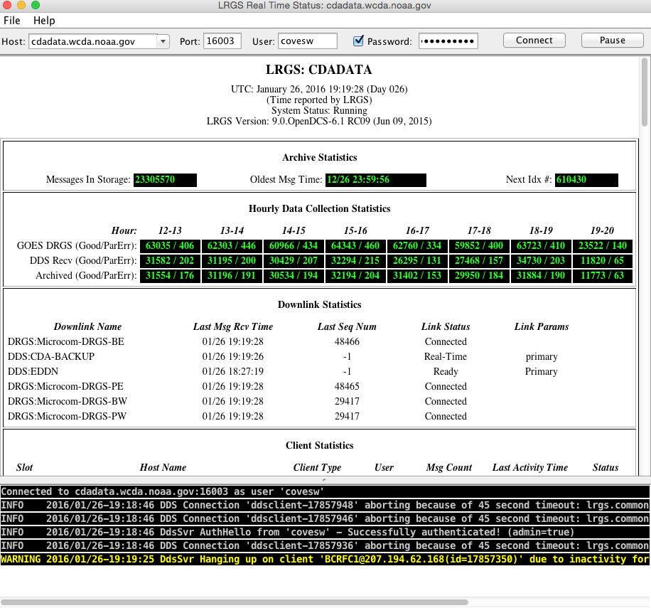

To retrieve raw DCP data, click the “DCP Message Browser” button.

*Hint: You can start the Message Browser with the command “msgaccess”.*

Again, type or select the LRGS hostname, type your user name and
password, then hit Connect. You should see a Connected message along the
bottom of the screen.

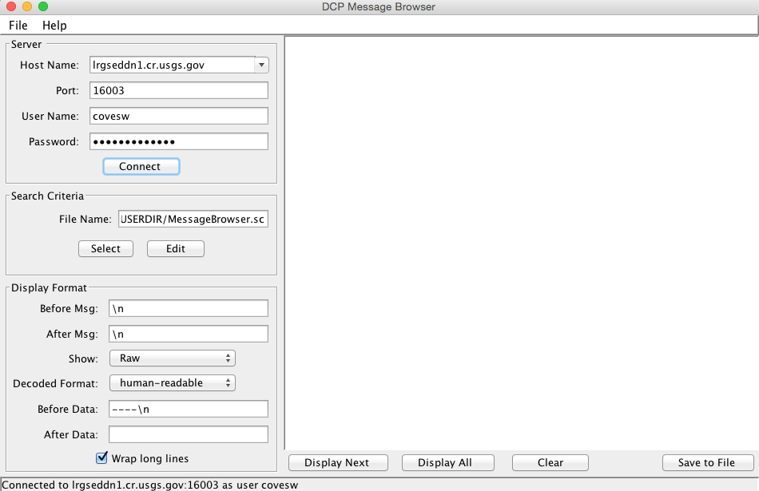

Now click the ‘Edit’ button under Search Criteria to specify which
messages you want to see. If you see a FileNotFoundException, it means
that you have never yet saved any criteria. Ignore this error and
continue.

You select the desired messages by time range, platform selection, and a
message type.

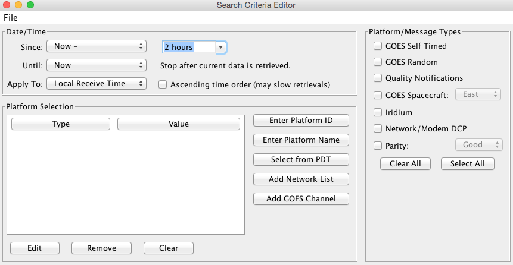

Think of the Search Criteria Screen as a kind of filter. If you don’t
select platforms it will allow any platform. If you don’t select any
message types, it will allow all message types.

Hit File – Save to save this criteria so that it is there the next time
you start the screen. Then close the editor screen and hit ‘Display All’
back on the main Message Browser screen. The resulting messages will be
retrieved from the server and displayed in the window.

Now click Edit under Search Criteria. Click the “Enter Platform ID”
button three times to enter the following IDs:

-  5531E462

-  162B88C8

-  CE2066DA

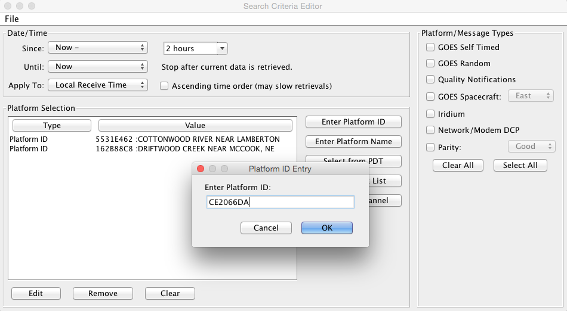

After each ID in the list, it will display the platform description
provided by NOAA.

Now go back to the main Browser screen again. Click Clear, and then
Display All. Now the system only retrieves the DCPs that you specified.
We will use these three platforms in the sample DECODES records to
follow.

A Simple ASCII DCP
==================

Messages for DCP 5531E462 look like this::

    5531E46216026183812G49-0NN038WUB00159
    4.48 0.07 0.28
    4.48 0.07 0.29
    4.47 0.07 0.29
    4.47 0.06 0.29
    4.48 0.06 0.29
    4.48 0.06 0.29
    4.47 0.06 0.29
    4.48 0.06 0.28 14.3

We will use descriptive information from the National Weather Service,
HADS system to populate the records and verify the decoding:
`www.nws.noaa.gov/oh/hads/ <http://www.nws.noaa.gov/oh/hads/>`__

Start the DECODES Database Editor from the launcher, or with the
‘dbedit’ command.

Create a Data Source Record
---------------------------

You will typically have one Data Source record from each place that can
provide you with data. For GOES data, we will use an LRGS data source.

The system comes with a record for the CDADATA system at Wallops. The
only thing you need to do is to double click the “username” property and
enter the user name for your DDS account provided by the server.

When finished, hit Commit and Close.

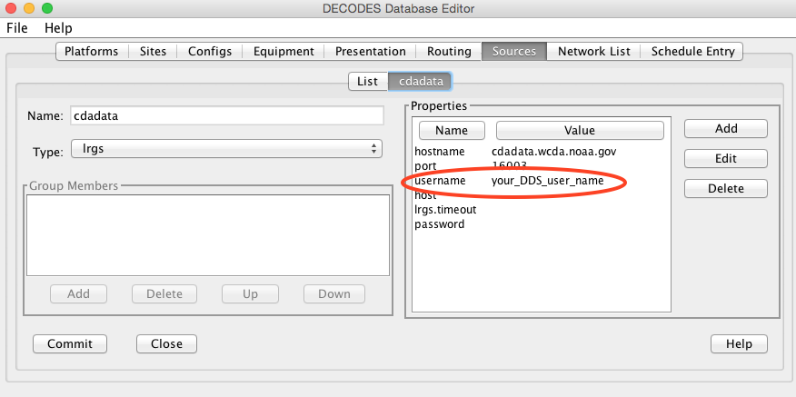

The Site Record
---------------

Click the Sites tab. Click New at the bottom. When asked for a name,
enter the HADS name:

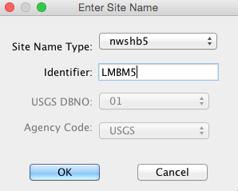

A site is identified by a unique combination of name type – identifier.
The NWSHB5 (National Weather Service Handbook 5) name for our site is
LMBM5. Sites may have many names, but only one of a given type.

Now the new Site is displayed in a form. You can enter all kinds of
descriptive information about the site. The only thing really necessary
is that a site must have at least one name.

When you are finished entering descriptive info, click the Commit button
and the Close button at the bottom. Your site now appears in the site
list.

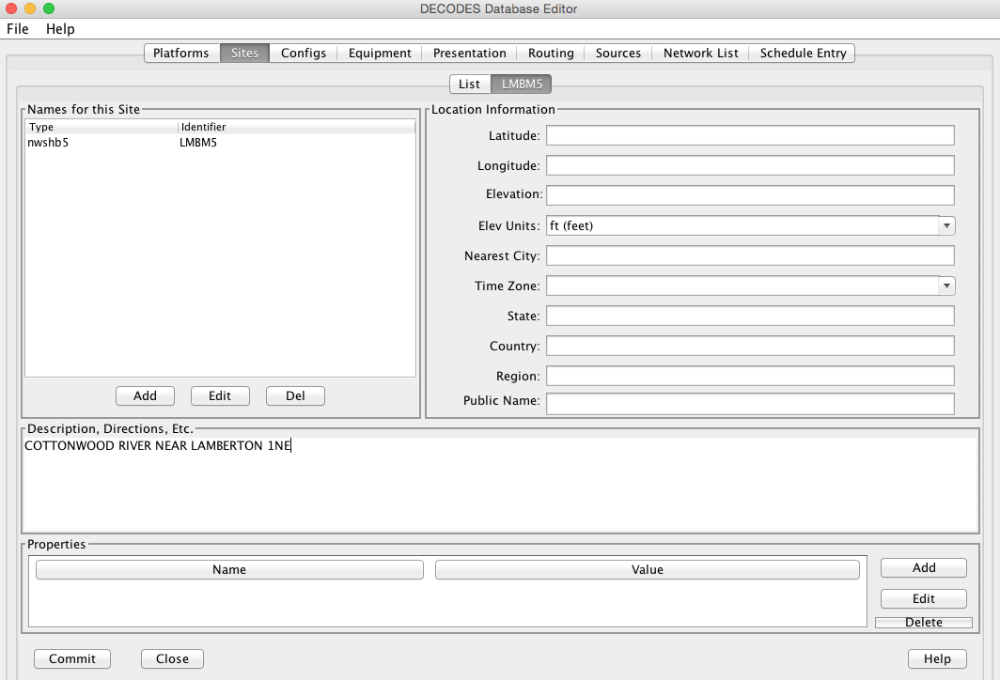

The Config Record
-----------------

Click the Configs tab and press New at the bottom.

*For simplicity, we are naming our test configuration with the same name
as the site. In practice, you would probably have several platforms
sharing the same configuration record: E.g. you have 30 water level
gages that all report data in the same format.*

Click Add Sensor and enter the info for your first sensor. See snapshot
below.

The sampling interval and first sample time should reflect how sampling
is done *on the DCP*.

Each sensor should have a unique name.

Each sensor must have at least one data type code.

*Data Type Codes are similar to site names. It’s a combination of type
(or standard) and an identifier. The SHEF Physical element code HG
(Height of a Gage) corresponds to the CWMS data type “Stage”.*

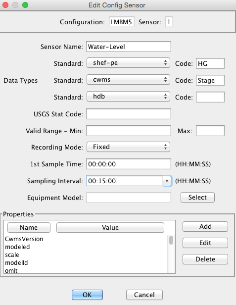

Repeat this process until all of your sensors are entered. After
completion, our sensor list looks like this:

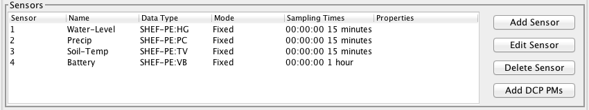

Click Commit before continuing.

Now we will create a script to decode a sample message. Click the Add
button next to Script at the bottom right of the Config screen.

Give the script a name. The conventional name for a GOES self timed
script is “ST”.

Select the data order (usually descending), and the header type (GOES).

Next enter the units for each sensor in the middle area. If any
conversions are necessary to get the raw data into those units, enter
the conversion algorithm and coefficients.

*For ASCII data, conversions are usually not necessary.*

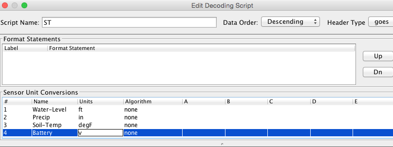

Now click Load, select your LRGS data source, and type the DCP Address.
Then click OK. You should now have a sample message to test your
decoding.

Write the script. Press the Decode button as often as you like to test
the script. Here is our script. Refer to the Platform Decoding Guide for
an explanation of each operation.

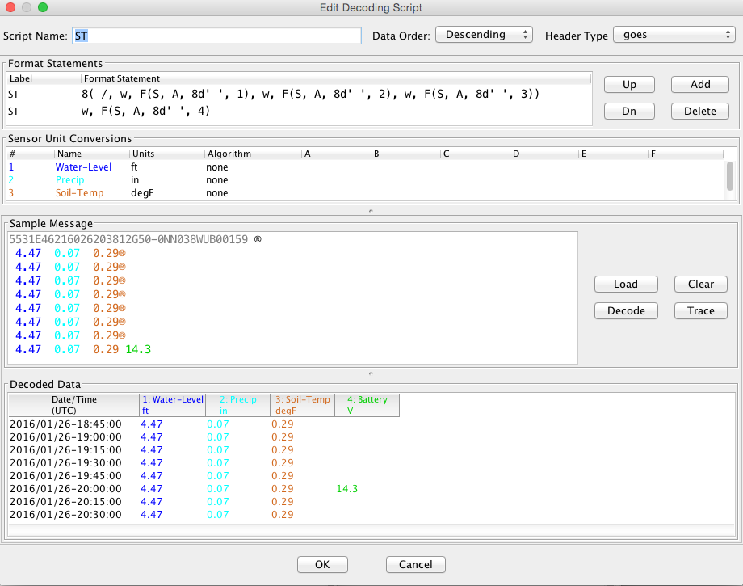

When finished, click OK to close the script dialog. Then click Commit
and Close on the config screen.

The Platform Record
-------------------

Click the Platforms Tab and the New button at the bottom of the list.

Choose your site for LMBM5 and then the Config. Type a nice description
for the platform.

Then click ‘Add’ at the bottom right to create a new Transport Medium
record. Select Medium Type “goes-self-timed”. Enter the correct GOES DCP
Address *and* GOES Channel (It will not work without the channel!)

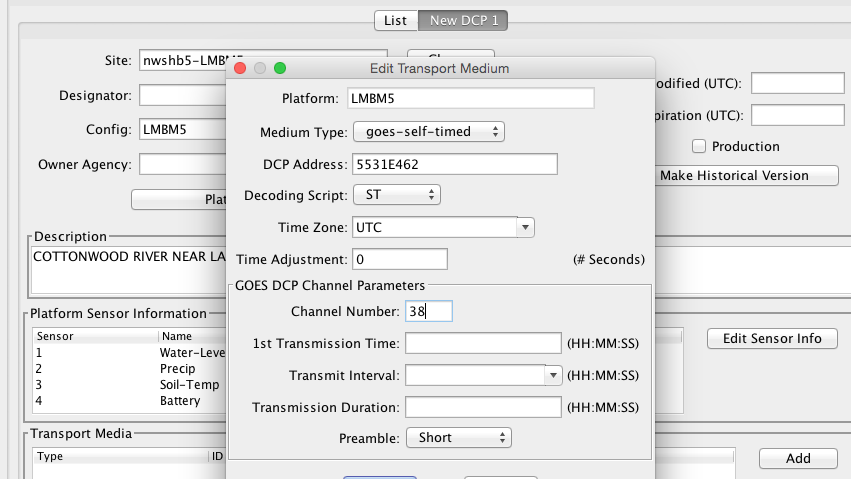

Hit Commit and Close when finished.

A More Complex ASCII DCP
========================

Messages for DCP CE2066DA look like this::

   CE2066DA16055133801G45-0NN162WUP00076":HG 8 #30 9.22 9.09 8.92 8.80 :PC
   8 #30 87.59 87.59 87.59 87.58 :BL 12.17

There are *thousands* of DCPs using GOES that follow this format:

-  A colon means the start of a new sensor, immediately followed by a
   sensor code. The code is often a SHEF code but it can be any string
   programmed into the DCP.

-  The next number is age in minutes of the most recent sample for that
   sensor.

-  #30 means that samples are 30 minutes aparty

-  Following this is a list of values

The message is actually all on a single line that starts immediately
after the GOES header (shown in blue).

.. _the-site-record-1:

The Site Record
---------------

Again, we use the National Weather Service HADS service to get
information about the site and its sensors.

Click the Sites tab. Click New at the bottom. When asked for a name,
enter the HADS name:

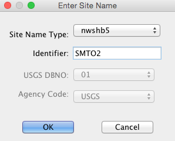

In the site form, you can enter other information such as a description,
location, etc. None of this is strictly required by DECODES.

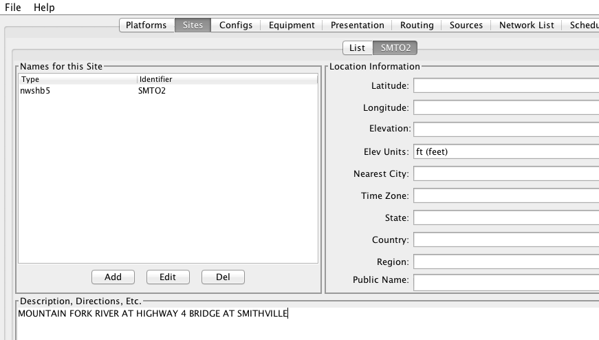

.. _the-config-record-1:

The Config Record
-----------------

In the previous example we created a special configuration record just
for a single DCP. In this case we will create a *generic* configuration
that we can reuse for any DCP that follows this general format.

Go to the Configs tab and click New at the bottom. Call this config
“STD-SELF-DESC” for standard self-describing.

As we did above in section 3.3 , enter the information you know about
the sensors on the DCP. Then click the Commit button at the bottom.

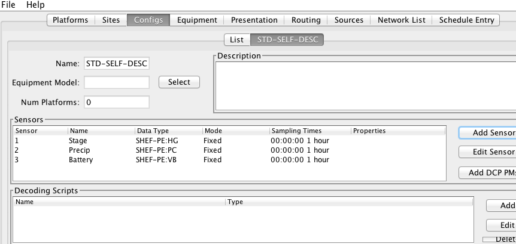

In this case, we will derive the sampling interval from the message
itself. So it does not matter what you enter here. We used the default 1
Hour.

Now click the Add button to the right of the Decoding Scripts to create
the self-timed script.

-  We use the conventional name “ST” for self timed.

-  We specify data order is descending (this is the standard, meaning
   that the most recent values are first in the message).

-  Header Type: goes-self-timed

-  Specify the Units for each sensor

Finally, click Load and specify the DCP Address CE2066DA. You should get
a sample message in the window. This is what we have so far:

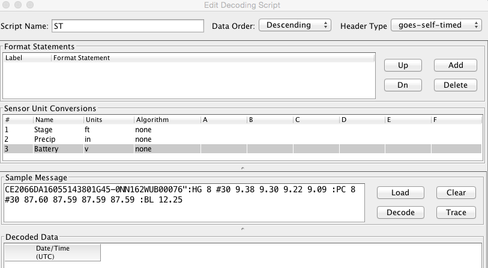

Our decoding strategy is:

1. Scan for a colon to put us at the start of a sensor block.

2. Get the sensor code and jump to the matching sensor statement.

3. Parse the minute offset with a MOFF field

4. Parse the minute interval with a MINT field

5. Parse all the values until we hit a non-numeric character (which is
   likely the colon at the start of the next sensor block).

6. Repeat, starting at step 1, until the message is done.

The figure below shows the complete script. We will explain it
step-by-step:

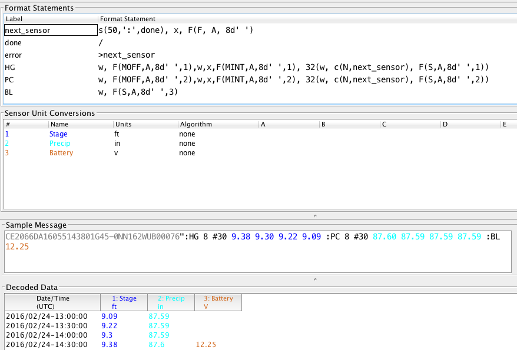

The first statement is:

+----------------+-----------------------------------------------------+
| next_sensor    | s(50,':',done), x, F(F, A, 8d' ')                   |
+================+=====================================================+
+----------------+-----------------------------------------------------+

This statement does the following:

**next_sensor** *This is the statement label.*

**s(50,':',done)** *This means to scan up to 50 chars or until you hit a
colon. If you don’t find a colon, skip to format statement ‘done’.*

**x** *If we get to here, we are on a colon. Skip it.*

**F(F, A, 8d' ')** *Field for a Format Label. The label is, at most, 8
characters long, or delimited by a space. This operation looks for a
matching label and jumps to it. If no match is found it jumps to label
“error”.*

The ‘done’ statement just skips the line. This ends decoding.

+----------------+-----------------------------------------------------+
| done           | /                                                   |
+================+=====================================================+
+----------------+-----------------------------------------------------+

The ‘error’ statement redirects us back to next_sensor. This is used to
find the beginning of the next sensor block. So, if the message contains
a label that our script does not recognize, it will skip the block but
continue to process data after it.

+----------------+-----------------------------------------------------+
| error          | >next_sensor                                        |
+================+=====================================================+
+----------------+-----------------------------------------------------+

The ‘HG’ statement is where the decoding happens for gage height:

+-----------------------------------------------------------------------+
| w, F(MOFF,A,8d' ',1),w,x,F(MINT,A,8d' ',1), 32(w, c(N,next_sensor),   |
| F(S,A,8d' ',1))                                                       |
+=======================================================================+
+-----------------------------------------------------------------------+

The statement does the following:

**w** *Skip white space.*

**F(MOFF,A,8d' ',1)** *Field for a MOFF (Minute Offset) for sensor
number 1*

**w,x** *Skip white space, bringing us to the ‘#’. Then skip the ‘#’.*

**F(MINT,A,8d' ',1)** *Field for a MINT (Minute Interval) for sensor
number 1.*

**32(...)** *Do whatever is in the parens as many as 32 times.*

**w, c(N,next_sensor)** *Skip white space, then check for a Number
character. If it is not a number character, jump to ‘next_sensor’.*

**F(S,A,8d' ',1)** *Field for a value for sensor number 1.*

The idea is to pick a repeat number (we chose 32) which is more than the
number of values you will have. The loop terminates when we get a
non-numeric number (like colon).

The ‘PC’ statement is identical to the HG statement except for the
sensor numbers in the field operations. PC is sensor number 2.

The ‘BL’ statement is simpler. Many DCPs encode battery without the MINT
and MOFF fields. Also, battery is often the last sensor encoded, so
there is no need to jump back to ‘next_sensor’:

+----------------+-----------------------------------------------------+
| BL             | w, F(S,A,8d' ',3)                                   |
+================+=====================================================+
+----------------+-----------------------------------------------------+

There are many slight variations on this message format:

-  Some DCPs encode battery in the same way as other sensors.

-  Some DCPs use a sign character (+/-) rather than a space between
   sensor values.

Another consideration: Often the Minute Offset (MOFF) is not accurate.
Decoding it can result in weird time stamps like a minute before/after
the desired period. You might consider skipping the MOFF field and just
let DECODES choose the time based on the interval and the message time.

.. _the-platform-record-1:

The Platform Record
-------------------

Create the platform record in the same manner as described in section
3.4 .

A Simple Routing Spec
=====================

A Routing Spec is the process that retrieves data, decodes it, formats
it, and then puts it somewhere. Follow these steps to create a simple
routing spec.

Network List Record
-------------------

Still in the DECODES Database Editor, click the Network List tab and the
New button. We have given our list the name “test”.

Select Transport Medium Type “goes” and Site Name Type Preference
“nwshb5”.

Hit the Select Platforms button and select the platforms you created in
the previous sections.

Hit Commit and Close when finished.

Interactive Routing Spec to Print to Screen
-------------------------------------------

Click the Routing tab and the New button to create a new routing spec.
We have called ours “test”. Then select:

-  Data Source: the one you’ve been using above (e.g. “cdadata”)

-  Destination: pipe (i.e. pipe it to the screen or standard output)

-  Leave Command blank

-  Output Format: human-readable

-  Time Zone: select or type your local time zone.

-  Under Date/Time, select Since Now – 4 hours

-  Select Until: Now

-  Under Platform Selection, select the network list you created above.

Click Commit and Close.

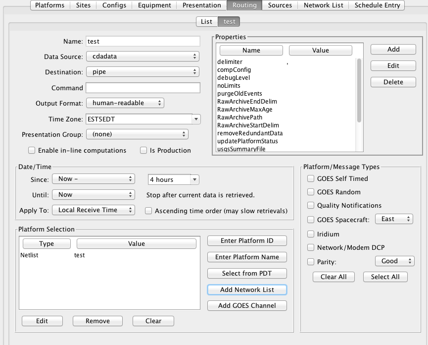

Now, open a terminal screen. On Windows, click Start, then Run: cmd.
First CD (change directory) to the OpenDCS installation. Then run the
routing spec as follows::

   cd C:\OPENDCS
   bin\rs -d3 test

If all goes well, you will see the human-readable output appear on your
screen for 4 hours worth of DCP messages. If you see nothing, or some
unexpected output, look for a log file in the “routstat” directory under
OpenDCS. In our example, it would be named C:\OPENDCS\routstat\test.log.

Open this log file in any program that can view a text file. Look for
messages that start with WARNING or FAILURE for a clue as to why the
failure occurred.

*A frequent problem is that the DCP Address or GOES Channel does not
match. If you see a message like this, then check your Transport Medium
in the Platform record:*

WARNING 01/26/16 21:07:38 RoutingSpec(test) Data source 'cdabackup':
decodes.datasource.UnknownPlatformException: lrgsMsg2RawMessage: No
platform matching 'CAD007A0' and channel 143 and medium type GOES --
skipped

Routing Spec to Drop Files
--------------------------

Now we will modify the routing spec to drop decoded data in files in a
directory. We will have each message written to its own file.

Re open the “test” routing spec, and:

-  Change Destination to Directory

-  Set Directory Name to: $DCSTOOL_HOME/data

-  Set Output Format to: emit-ascii

-  Double-click the “delimiter” property and set the value to a single
   comma.

-  Leave everything else the same.

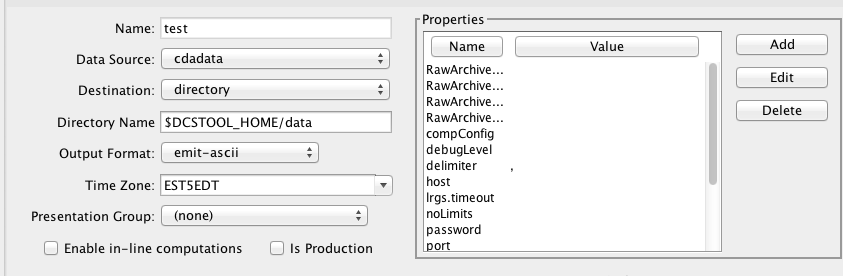

Now, back on your terminal screen, run the routing spec exactly as
before::

   bin\rs -d3 test

This time it will not produce an output. Look in the ‘data’ directory
under the OpenDCS installation. It should have created files there.

*Again, if not, check the log file for an explanatory message.*

Here’s what the file looks like::

   5531E462,00065,1 ,16026/14:30:00,4.47 ,I,LMBM5 ,Water-Level,HG,900 ,I,ft
   5531E462,00065,1 ,16026/14:15:00,4.47 ,I,LMBM5 ,Water-Level,HG,900 ,I,ft
   5531E462,00065,1 ,16026/14:00:00,4.47 ,I,LMBM5 ,Water-Level,HG,900 ,I,ft
   5531E462,00065,1 ,16026/13:45:00,4.47 ,I,LMBM5 ,Water-Level,HG,900 ,I,ft
   5531E462,00065,1 ,16026/13:30:00,4.48 ,I,LMBM5 ,Water-Level,HG,900 ,I,ft
   5531E462,00065,1 ,16026/13:15:00,4.48 ,I,LMBM5 ,Water-Level,HG,900 ,I,ft
   5531E462,00065,1 ,16026/13:00:00,4.47 ,I,LMBM5 ,Water-Level,HG,900 ,I,ft
   5531E462,00065,1 ,16026/12:45:00,4.47 ,I,LMBM5 ,Water-Level,HG,900 ,I,ft
   5531E462,00045,2 ,16026/14:30:00,0.07 ,I,LMBM5 ,Precip ,PC,900 ,I,in
   5531E462,00045,2 ,16026/14:15:00,0.07 ,I,LMBM5 ,Precip ,PC,900 ,I,in
   5531E462,00045,2 ,16026/14:00:00,0.07 ,I,LMBM5 ,Precip ,PC,900 ,I,in
   5531E462,00045,2 ,16026/13:45:00,0.07 ,I,LMBM5 ,Precip ,PC,900 ,I,in
   5531E462,00045,2 ,16026/13:30:00,0.07 ,I,LMBM5 ,Precip ,PC,900 ,I,in
   5531E462,00045,2 ,16026/13:15:00,0.07 ,I,LMBM5 ,Precip ,PC,900 ,I,in
   5531E462,00045,2 ,16026/13:00:00,0.07 ,I,LMBM5 ,Precip ,PC,900 ,I,in
   5531E462,00045,2 ,16026/12:45:00,0.06 ,I,LMBM5 ,Precip ,PC,900 ,I,in
   5531E462,0 ,3 ,16026/14:30:00,0.29 ,I,LMBM5 ,Soil-Temp,TV,900 ,I,degF
   5531E462,0 ,3 ,16026/14:15:00,0.29 ,I,LMBM5 ,Soil-Temp,TV,900 ,I,degF
   5531E462,0 ,3 ,16026/14:00:00,0.29 ,I,LMBM5 ,Soil-Temp,TV,900 ,I,degF
   5531E462,0 ,3 ,16026/13:45:00,0.29 ,I,LMBM5 ,Soil-Temp,TV,900 ,I,degF
   5531E462,0 ,3 ,16026/13:30:00,0.28 ,I,LMBM5 ,Soil-Temp,TV,900 ,I,degF
   5531E462,0 ,3 ,16026/13:15:00,0.29 ,I,LMBM5 ,Soil-Temp,TV,900 ,I,degF
   5531E462,0 ,3 ,16026/13:00:00,0.29 ,I,LMBM5 ,Soil-Temp,TV,900 ,I,degF
   5531E462,0 ,3 ,16026/12:45:00,0.29 ,I,LMBM5 ,Soil-Temp,TV,900 ,I,degF
   5531E462,70969,4 ,16026/14:00:00,14.4 ,I,LMBM5 ,Battery ,VB,3600,I,V
   ZZZZ

Dropping files is a very common way to interface OpenDCS with other
system, like a time series database. You have OpenDCS routing spec drop
files an a ‘hot’ directory. You have a database ingest program
periodically scanning the directory and ingesting any files it finds.

Scheduling a Background Routing Spec
====================================

Normally, you want your data collection activities to proceed in the
background. This section shows how to schedule and run background
routing specs.

Create a Schedule Entry
-----------------------

In the DECODES database editor, click the schedule entry tab. Click New
at the bottom. We called our schedule entry “test”.

*A schedule entry runs a routing spec. We recommend that you name the
schedule entry the same as the routing spec.*

-  Make sure the Enable check box is checked.

-  In the process list (after “Enabled for”) select RoutingScheduler

-  Select your routing spec (“test”)

-  Set the schedule

In our case we will have the routing spec run once every hour at 5
minutes after the hour:

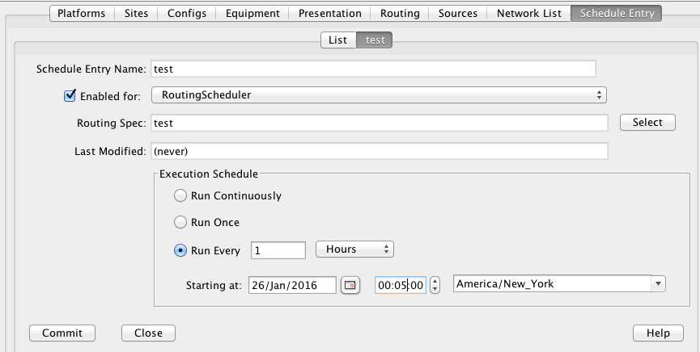

Hit Commit and Close at the bottom.

Review and Start the RoutingScheduler Process
---------------------------------------------

Back on the Launcher screen, click the Processes button. Double click
the RoutingScheduler process in the list.

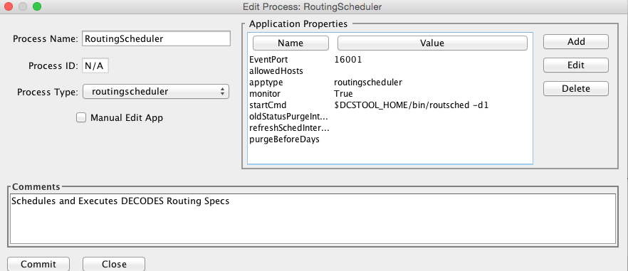

Hover your mouse pointer over the property names for tooltip help. These
are explained in detail in the DECODES Routing and Scheduling Guide.

For now, don’t change anything. Hit Close to get back to the process
monitor list screen.

Select the process in the list and click the ‘Start’ button to the
right. Check the ‘Events’ checkbox for the RoutingScheduler process.

The process should start and you will see events from it in the
scrolling area at the bottom:

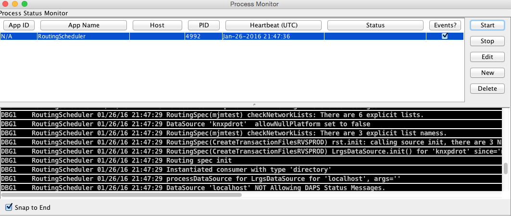

Run Routing Scheduler as a Service
----------------------------------

Ideally, you will want RoutingScheduler to always be running in the
background, even when no one is logged in. That is, it should run as a
service.

You will need system administrative privileges to do this.

**Windows**

.. 
   Update to list with 
   https://wrapper.tanukisoftware.com/doc/english/introduction.html
   https://commons.apache.org/proper/commons-daemon/index.html
   http://nssm.cc/
   https://yajsw.sourceforge.io/

Run the script installRsWrapper.bat, which you will find in the OpenDCS
bin directory. This will create a Windows service called
“OpenDCS-RoutSched”.

Now open the Administrative Services menu. Find OpenDCS-RoutSched in the
list. Right click and select start.

If the service fails to start, look in the file
C:\OPENDCS\jsw\rswrapper.log for clues.

IF YOU HAVE AN OLD 32-BIT WINDOWS MACHINE: The default JSW (Java Service
Wrapper) is for 64 bit windows. When you start the service it will fail.
Do this:

-  Copy the following three files from the C:\OPENDCS\jsw directory into
   some backup location:

   -  wrapper.dll

   -  wrapper.exe

   -  wrapper.jar

-  Copy the files from the jsw-32 subdirectory into the jsw directory.

-  Restart the service.

**Linux**

This is usually done by placing a script in the /etc/rc5.d directory.
This script usually runs another script on behalf of a normal user.

We are supposing that the user account that owns the OpenDCS
installation is user “opendcs” and that it was installed at
~opendcs/OPENDCS. Make substitutions if you installed under a different
user or at a different location.

Create a script in ~opendcs/bin/startRoutSched::

   #!/bin/bash
   cd $HOME
   . ./.bash_profile
   cd $DCSTOOL_HOME
   nohup bin/routsched –d2 –l routsched.log &

Now the script in rc5.d will call that script::

   su – opendcs –c ~opendcs/bin/startRoutSched
