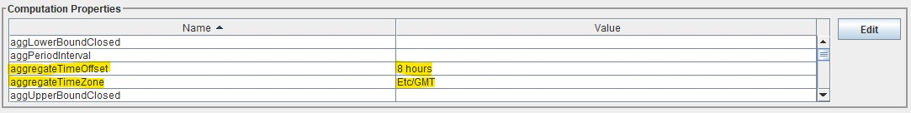

###################################
OpenDCS Reservoir Evaporation Algorithm
###################################

****************************
ResEvapAlgorithm
****************************

Exec Class: decodes.cwms.algo.ResEvapAlgo

The "ResEvap" algorithm aggregates and calculates
the Evaporation of water from a reservoir over the period of a day. By default,
if the following parameter values are not provided they will be retrieved from the CWMS DataBase.

* Longitude
* Latitude
* TimeZone
* Coming Soon - Secchi Depth
* Coming soon - Max Temperature Depth

Important Notes:

* Make sure to set your aggregateTimeOffset to your timezoneOffset if the form "8 hours"
* Always set your aggregateTimeZone to "ETC/GMT"

* When setting Zero_elevation property check rating table to find the exact and correct Zero_elevation
* This algorithm Requires there to exits a rating table within your CWMS data base for the area of your reservoir with rating id test to "FTPK.Elev;Area.Linear.Step"
* This algorithm Requires there to exits a set of Water Temperature profiles with the WtpTsid format of "FTPK-Lower-D000,0m.Temp-Water.Inst.1Day.0.Rev-NWO-Evap-test"

+-----------+------------------+----------------------------------------------+
|**Role**   |**Role Name**     |**Description**                               |
+===========+==================+==============================================+
|Inputs     |windSpeed         |Wind speed at reservoir in meters per second. |
|           +------------------+----------------------------------------------+
|           |AirTemp           |Air temperature at reservoir in Celsius       |
|           +------------------+----------------------------------------------+
|           |RelativeHumidity  |Percentage of relative humidity               |
|           +------------------+----------------------------------------------+
|           |AtmPress          |Atmospheric pressure in mbar                  |
|           +------------------+----------------------------------------------+
|           |PercentLowCloud   |Percentage of low cloud cover                 |
|           +------------------+----------------------------------------------+
|           |ElevLowCloud      |High of low clouds cover in meters            |
|           +------------------+----------------------------------------------+
|           |PercentMidCloud   |Percentage of mid cloud cover                 |
|           +------------------+----------------------------------------------+
|           |ElevMidCloud      |High of mid clouds cover in meters            |
|           +------------------+----------------------------------------------+
|           |PercentHighCloud  |Percentage of high cloud cover                |
|           +------------------+----------------------------------------------+
|           |ElevHighCloud     |High of high clouds cover in meters           |
|           +------------------+----------------------------------------------+
|           |Elev              |Elevation of water level at reservoir         |
+-----------+------------------+----------------------------------------------+
|Outputs    |HourlySurfaceTemp |                                              |
|           +------------------+----------------------------------------------+
|           |HourlyEvap        |                                              |
|           +------------------+----------------------------------------------+
|           |DailyEvap         |                                              |
|           +------------------+----------------------------------------------+
|           |DailyEvapAsFlow   |                                              |
|           +------------------+----------------------------------------------+
|           |HourlyFluxOut     |                                              |
|           +------------------+----------------------------------------------+
|           |HourlyFluxIn      |                                              |
|           +------------------+----------------------------------------------+
|           |HourlySolar       |                                              |
|           +------------------+----------------------------------------------+
|           |HourlyLatent      |                                              |
+-----------+------------------+----------------------------------------------+
|Properties |wtpTsId           |Base String for water Temperature Profiles,   |
|           |                  |Example FTPK-Lower-D000,0m.Temp-Water.Inst.   |
|           |                  |1Day.0.Rev-NWO-Evap                           |
|           +------------------+----------------------------------------------+
|           |reservoirId       |Location ID of reservoir                      |
|           +------------------+----------------------------------------------+
|           |secchi            |Average secchi depth of reservoir in feet     |
|           +------------------+----------------------------------------------+
|           |zeroElevation    |Streambed elevation of reservoir in feet      |
|           +------------------+----------------------------------------------+
|           |latitude          |Latitude of reservoir                         |
|           +------------------+----------------------------------------------+
|           |longitude         |Longitude of reservoir                        |
|           +------------------+----------------------------------------------+
|           |timezone          |Time zone at reservoir location,              |
|           |                  |Example value: D%03d,%dm                      |
|           +------------------+----------------------------------------------+
|           |windShear         |Wind shear equation to be utilized in         |
|           |                  |computation,(Donelan or Fischer)              |
|           +------------------+----------------------------------------------+
|           |thermalDifCoe     |Thermal diffusivity coefficient to be         |
|           |                  |utilized in computation                       |
|           +------------------+----------------------------------------------+
|           |rating            |Rating Curve specification for Elevation-Area |
|           |                  |curve, Example: FTPK.Elev;Area.Linear.Step    |
+-----------+------------------+----------------------------------------------+

See the legacy documentation below to better understand how the algorithm behaves.

**************************************************
Reservoir Evaporation Legacy Documentation
**************************************************

.. toctree::
   :maxdepth: 1
   :caption: Legacy ResEvap

   Legacy ResEvap <./legacy-resevap-computation.rst>

