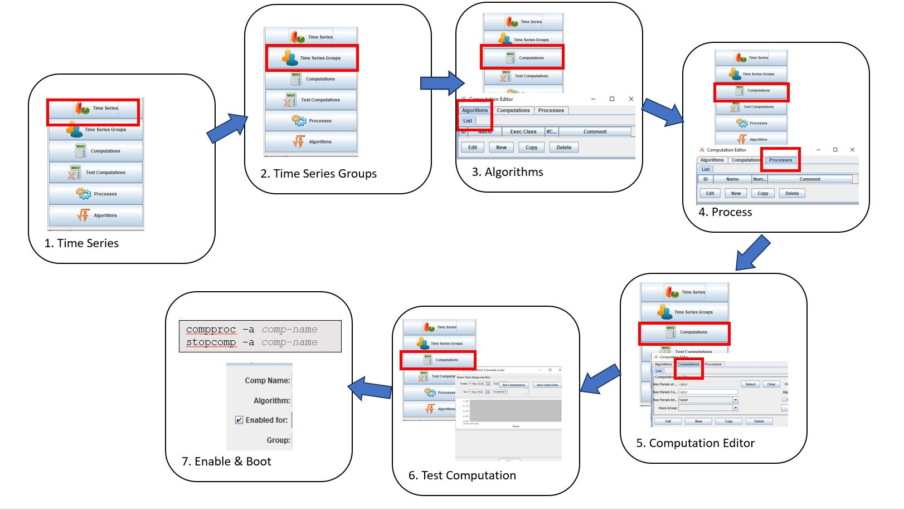
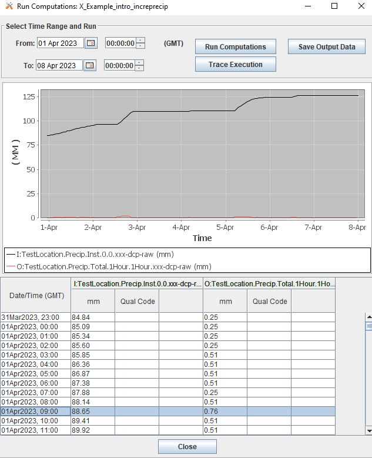

###################################
OpenDCS Computations - Introduction
###################################

<<<<<<< HEAD
OpenDCS inudes a program called Computation Processor.  This tool is
=======
OpenDCS includes a program called Computation Processor.  This tool is
>>>>>>> master
used for creating computations on the data stored in the time-series
database.  It is currently supported for the U.S. Bureau of Reclamation
Hydrologic Database (HDB)and the U.S. Army Corps of Engineers Corps 
Water Management System (CWMS).

Recall that once the Computation Processor is launched (launcher_start.bat),
users must log-in with the following credentials. 

USACE users:

* USERNAME: Username
* PASSWORD: Oracle

Computations can be helpful for operations because of the following abilities:

* Automate calculations
* Transform time series to another interval or period
* Calculate sum or average over a period
* Transform one parameter to another parameter
* Create and employ customized algorithms

***************************************
How to Set-Up a Computation in OpenDCS?
***************************************

In OpenDCS, a computation comprises of a few pieces:

* Algorithm (ie operations applied)
* Input & Output Time Series or Pathname Parts
* Process
* Optional - Group

A suggested guiding principal to building a new computation is
to follow the steps outlined below:

#. Ensure input time series exist
#. Create group if computation is going to be applied to multiple time series
#. Ensure algorithm exists (create if necessary)
#. Ensure process exists
#. Create computation
#. Test computation
#. Enable computation

The next steps outline an example for putting together a very simple 
"calculation" using the computation processor.  The steps are 
intended to provide a template for how to set up a computation
and familiarize a user with the tabs and tools needed to get started.
Some steps are assumed already completed but will be touched upon.

At the end of this section, a user should know how to set up a 
calculation that grabs the top of hour value from a higher
resolution time series and creates a new hourly time series.
In this example, the higher resolution time series will be 
six minute data. 

1.Time Series Check
===================

The first step to setting up a calculation is knowing the path
name parts to the time series and ensuring the time series has 
data populated.

As a recap, time series have 6 parts.

location.param.statcode.interval.duration.version

or

location.param.paramtype.interval.duration.version

Note - the location, param, and version parts are often subdivided 
with hyphens. See section :doc:`Time Series Introduction <./start-timeseries>`
for more details on time series.

* location - This refers to a Site in the database. This is the site name.
* param - This is the Data Type (such as precip, stage, speed, etc).
* statecode or paramtype (such as ave, inst, max, min, total).
* Interval (0, 15 min, 1 hour, 1 day, ~ 1 month, ~ year)
* Duration (0, 1Hour, 1Day, 1Month, 1Year)
* Version (meta data such as data steward or raw/revised status)

2.Time Series Groups
====================

If you plan to use the same algorithm on similar time series multiple 
times, it is recommended to use OpenDCS Time Series Groups.  This
tool is quite simple.  It is a way to name a group of time series
and call it when setting up a computation.  Typically, time series 
are grouped by "region", "basin", "data-type" or "site-group".  

To edit groups, launch the "Time Series Groups" application from
the main menu.  Click on the button at the bottom of the window "New".

A small window will pop up to name the group.  Enter a name. Note that 
this name can be edited after creation using the "rename" button displayed
in the image below.

.. image:: ./media/start/computations/im-03-groups.JPG
   :alt: time series groups editor
   :width: 550

3.Algorithms Intro
==================

The Algorithms tab in the Computations Editor is where default
Computation Processor algorithms are stored, in addition to custom
algorithms added by users.  Algorithms, in OpenDCS, can be thought
of as instructions or like a function that has yet to be called 
or invoked.  Examples of default algorithms are listed below:

* Copy
* IncrementalPrecip
* Sum
* Average
* USGS 
* Screening

.. image:: ./media/start/computations/im-04-algorithms.JPG
   :alt: computation editor - algorithms tab
   :width: 650

4.Process Intro
===============

Processes are a way of grouping computations together to help
spread the computational load of the system.  Once a computation
is created, it can be attributed to a process.  

Creating processes can also be beneficial because of their 
ability to reduce operational run time, reduce backfilling 
run time, and help maintain and organize computations.

To create a new process, follow one of the following steps:

#. Launch the Process Monitor by clicking the "Processes" button 
from the main menu. To add a new process click "New".
#. Launch the Computations Editor and navigate to the "Processes"
tab. To add a new process click "New".

.. image:: ./media/start/computations/im-05-process.JPG
   :alt: new process window
   :width: 650

5.Computation Editor Intro
==========================

Once algorithms and processes are defined, now a user is ready to 
set up a computation.  On the "Computations" tab of the Computation
Editor.  The editor will display a few items, including the computation
Name, Algorithm used in the Calculation, the Process for which the
computation is applied, and the status of whether the computation 
is enabled. 

If there are already a number of computations in the editor list,
the top portion of the screen can be used to filter computations
by some time series parts or groups.

The following examples outline how to set up a few basic introductory
computations. This means that the computations employ simple to 
understand algorithms, are common in practice, and demonstrate
the nuts and bolts of using the computation processor.

In the examples below, all the time series and computations are 
in UTC.  In most cases the examples below show how the default
output is calculated. For more information about how to apply time
shifts, and manipulate the calculation.  

To create a new computation click on the "New" button on the bottom of the 
"List" tab. A window will pop up instructing the user to enter a name.
Note that any name entered here can be edited once it is created.  Best
practices suggest that the name specify some information that easily 
conveys what type of time series is or are being calculated.

Once the name is entered and saved (click "OK) then a window will pop
up for the computation.  Generally the window for each computation will 
include a top section which is where users can specify the algorithm 
used in the calculation, change in the name of the computation, apply
the process, and call a group for the computation (if applicable). 
Users can also specify a start and end time for when the computation
is effective.  Recall that by default, computations in the computation
process are triggered when new data is available in the database.  

For more information about the default or standard algorithms that
come installed in OpenDCS see :doc:`Resources - Algorithms <./resources-algorithms>`.

Sample Calculation: Copy Time Series
------------------------------------

In the following example, the computation is a direct copy of the data 
in the time series path. See in the image below the left hand side is 
the input denoted with "I" and the right hand side is the output denoted
with "O".  The image is from the "Run Computation" button, which will be
elaborated on in the Test Computation section below.

After the computation is named, the following window will pop up.

.. image:: ./media/start/computations/im-08-example-copy-algorithm.JPG
   :alt: computation editor - new comp pop up
   :width: 650

After the computation is created, select the algorithm by clicking 
the "Select" button next to the Algorithm section. A window will
pop up with a list of the available algorithms.  Select the 
*CopyAlgorithm*. 

.. image:: ./media/start/computations/im-09-example-copy-algorithm.JPG
   :alt: computation editor - algorithm options
   :width: 650

Once the algorithm is selected, the Computation Properties section
at the bottom of the window will populate with some Names and 
the Values will be blank.

Additionally, two rows will populate in the Time-Series Parameters
section: and input Role and and output Role.  Select either of the 
roles and click "Edit" on the right.  And the following window
will pop up for the user to enter specifics about the input time
series for which the algorithm should be applied.

.. image:: ./media/start/computations/im-10-example-copy-algorithm.JPG
   :alt: computation editor - new copy algorithm
   :width: 650

In this example, the existing time series is:

BelleIsle.Stage-Encoder.Inst.6Minutes.0.lre-dcp-raw 

To select this time series as the input and populate the window,
click the "Select" on the right of the Location box, and select
the location of the input time series.

Once the Location is selected, users can either manually enter
the corresponding time series parts below, or use the "Time Series
Lookup" to view existing time series for the location selected.

Once the time series is selected, the parts will populate.  

NOTE - by default the following parameters are:

* **Delta-T**  0 seconds (more details are in the resources section)
* **Units** empty (by default the units will be the original units of the time series)
* **If Missing** IGNORE (if the input value is missing, the calculation will not be executed)

Click "OK" and then select and edit the output time series parameter.
In the "Edit" output parameters enter the time series parts for which
the desired output will consist of.  

If it the time series does not exist yet, a box will pop up prompting
the user to allow the creation of the desired time series.  Click 
"Yes". Or if there is something that needs to be modified, click 
Cancel and correct.  

.. image:: ./media/start/computations/im-14-example-copy-algorithm.JPG
   :alt: computation editor - computation parameter output
   :width: 150
   
As a last step, select the process for which this computation will
attributed to.  Do this by selecting the drop down menu next to the 
"Enabled for" box.  Select the process. 

.. image:: ./media/start/computations/im-15-example-copy-algorithm.JPG
   :alt: computation editor - enable box
   :width: 500

In the example below the process compproc-examples is selected.

As a final few steps - add in any comments about the computation for 
documentation purposes.  Click "Commit" on the bottom of the screen so
that all the steps above are saved.

Sample Calculation: Stage - Top of Hour
---------------------------------------

In the following example, the computation uses the **SubSample** algorithm
to extract the top of hour values from a higher resolution time series. 
In this example the input time series consists of 6 minute data.  The 
image below is from the "Run Computation" button, which will be
elaborated on in the Test Computation section below.

.. image:: ./media/start/computations/im-17-example-subsample.JPG
   :alt: computation editor - top of hour computation
   :width: 600

The following image shows how the computation should be set up.
Once the **SubSample** algorithm is selected the Computation Properties
at the bottom of the screen will populate with some default
settings.  

.. image:: ./media/start/computations/im-18-example-subsample.JPG
   :alt: computation editor - top of hour computation defined
   :width: 600

* **aggLowerBoundClosed** : true
* **aggUperBoundClosed** : false

The input and output roles for this algorithm are called

* **inputShortInterval**: the input time series which is a higher resolution time series than output
* **outputLongInterval**: the output time series which is a lower resolution time series than input

By default in this computation the "If Missing" is set blank.
 

Sample Calculation: Stage - Daily Average
-----------------------------------------

In the following example, the computation uses the **AverageAlgorithm**
algorithm to calculate a daily average based on hourly inputs. 
In this example the default computation properties are used.  This
includes the current default property that the minimum input samples
needed for the calculation to run is 1.  No time shifts or adjustments
of any kind are applied.  The image below is from the "Run Computation"
button, which will be elaborated on in the Test Computation section
below.

.. image:: ./media/start/computations/im-20-example-average.JPG
   :alt: computation editor - average computation
   :width: 600

The following image shows how the computation should be set up.
Once the **AverageAlgorithm** algorithm is selected the Computation
Properties at the bottom of the screen will populate with some
default minSamplesNeeded.  The input and output roles are:

* **input**:
* **average**: 

By default in this computation the "If Missing" is set blank.

By default, the average will use the lowest bound and upper bound. 
For daily averages, this means the average will use hours 00-23.

Sample Calculation: Precipitation - Cumulative to Incremental
-------------------------------------------------------------

In the following example, the computation uses the **IncrementalPrecip**
algorithm to calculate hourly precip totals from a cumulative precip
time series with cumulative totals recorded every hour. Put simply, 
the function calculates the difference between the intervals defined
in the output time series.  This example includes the default 
properties for the computation.  The image below is from the 
"Run Computation" button, which will be elaborated on in the Test 
Computation section below.

.. image:: ./media/start/computations/im-23-example-incr-precip.JPG
   :alt: computation editor - incremental precip hourly
   :width: 600

   
The following image shows how the computation should be set up.
Once the **IncrementalPrecip** algorithm is selected the Computation
Properties at the bottom of the screen will populate with 
default aggLowerBoundClosed and aggUpperBoundClosed as true.
The input and output roles are:

* **cumulativePrecip (input)**:  cumulative precip time series
* **incrementalPrecip (output)**: output time series

.. image:: ./media/start/computations/im-25-example-incr-precip.JPG
   :alt: computation editor - incremental precip set up hourly
   :width: 600

   
By default in this computation the "If Missing" is set blank.

Define the output time series based on the intervals and duration 
desired.

The output will calculate the difference between the current time 
step and the next time step, so long as the value is not negative.

Sample Calculation: Precipitation - Daily Total
-----------------------------------------------

The following example is intended to demonstrate how the 
"SumOverTimeAlgorithm" can be used to sum up incremental 
precipitation, if the most raw data is provided as incremental.
If the cumulative hourly time series is available, it is best
practice to use this time series as the input, as opposed to 
calculating the hourly incremental totals and then summing over
the incremental totals.

6.Test Computation Intro
========================

Once a calculation is set up, like any of the examples above,
users can test or run the computation to check and verify that 
the computation is calculating the desired output correctly.  

To test or run a computation, simply open the computation from 
the List. To open the computation from the List, select the desired
computation, and click "Edit" on the bottom of the page. 

Once **Run Computations** is launched, a window will pop up with
a top pane that shows an empty graph area with Time on the X-axis.
To run a computation, define the time window.  If the input data
is a high resolution, good practice is to start with a small 
time window range to reduce the run time. Once the calculation
has been verified, then increase the time range.

Dates and Times can either be selected using the small calendar icon
or by manually entering in the date in form "DD MMM YYYY".

Click "Run Computations" and if the output looks correct, then save
the output if the user wished to save the output. To save click 
"Save Output Data".  

Run Calculation: Copy Time Series
---------------------------------

The example outlined above for copying a time series using the
Computation Processor is demonstrated in the following window.
The output line (red) covers directly over the input line (black).

Run Calculation: Stage - Top of Hour
------------------------------------

The example outlined above for sub sampling the top of the hour is 
demonstrated in the image below.  

Run Calculation: Stage - Daily Average
--------------------------------------

The example outlined above for calculating a daily average from 
hourly values is demonstrated below.  

Run Calculation: Precipitation - Cumulative to Incremental
----------------------------------------------------------

The example outlined above for calculating hourly incremental
precipitation totals from cumulative hourly precipitation
is demonstrated in the graphic below.

Run Calculation: Precipitation - Daily Total
--------------------------------------------

There are two methods for calculating the daily total.  One method is
to sum the hourly totals that are calculated in the previous example. 
The other method is to use the incremental precipitation algorithms,
but change the increments and duration in the output time series.  The
two methods are displayed below.  It is good practice to use the raw
original data as the input rather than adding in extra calculations and
steps that can potentially accrue small erros.

7.Enable & Boot Intro
=============================

Once the computations are set and tested for accuracy, then the computations
can be set to run automatically.  This means that the calculations will
by default be triggered for a time increment for which the input time series
has new data for such time increment. To clarify, this means that computations 
are not going to be run for the entire time series period of record.  Rather 
computations are only going to be run for periods for which there is new input
data.  

Users can opt to define an Effective start and end date. This can be beneficial
to help users avoid accidentally triggering calculations for very long periods
of record.  It is unlikely to occur, however, when such a que of calculations
is triggered, depending on the resolution and number of processes defined, the 
run time can slow down calculations and in some cases take some time to backup.

To enable a calculation, check the enabled box, and make sure the process defined
above is selected.  Define any effective start or end dates. Click Commit to save
changes.

Once the computation is created and saved and enabled, it needs to be added to the 
computations daemons to run in the background.  For example, the following line
should be added to any Boot or Start script for the computations to be fully
enabled.  

::

   compproc -a compproc-examples 

Until such process is added to a boot script the computations will not be run
automatically.  However, a user can always run them from the GUI, as demonstrated
in the previous section.  

To stop a process add the following to a Stop or Off script.

::

   stopcomp -a compproc-examples

More about Computations
=======================

The steps above outline a few simple computations, set-up using default
settings in algorithms and computations.  The Computation Processor includes
a set of tools that can be used to create more complex algorithms or 
computations, including some of the following:

* Time shifts
* Minimum criteria
* Redefining floor/ceiling criteria
* Defining trigger input criteria
* Writing custom algorithms that pull data from the database

