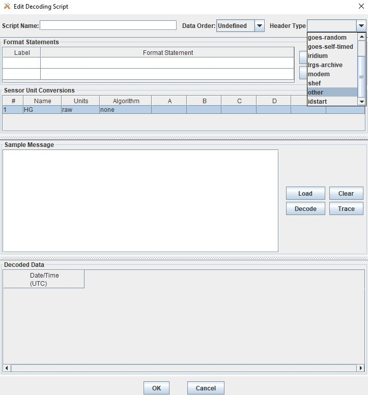
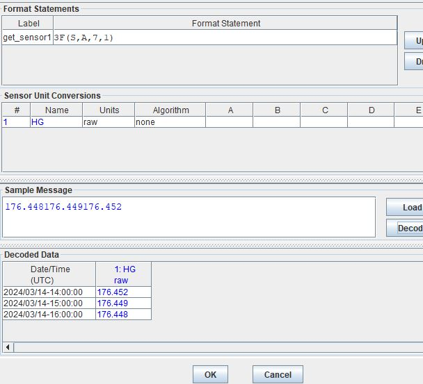
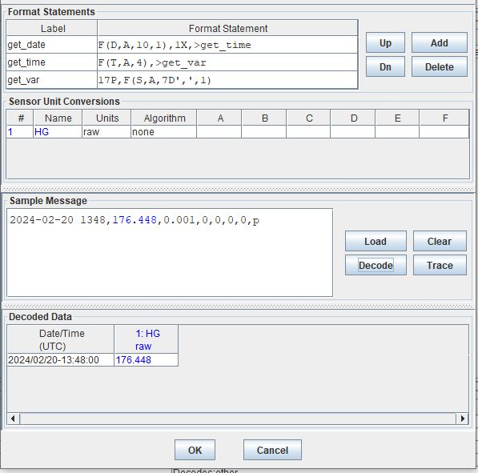

################################
OpenDCS DECODING - Introduction
################################

A significant piece of setting up a routing spec is 
writing the DECODING script.  This section is meant to
help new users get familiar with the DECODING format 
statements. 

A major bulk of the examples here are likely not typically
full raw messages from sources.  The sample messages are 
displayed for the purposes of providing examples of how 
the format statements DECODE when executed on certain 
input messages.

Further details and advanced topics on the DECODING can be 
found in the DECODING manual :doc:`DECODES Guide <./legacy-decoding-guide>`

**********************************
DECODING Statements - Fundamentals
**********************************

Starting to write a DECODING script from scratch can seem overwheling
at the start.  To get started, users can use a few different 
strategies - including:

* See if a script already exists for this type of messages
* Break down or edit the message to something shorter and more manageable
* Use the TRACE button to debug scripts

Overview of Operations
======================

This section contains tables for reference.  These commands or
operations are essentially the building blocks or fundamentals
of DECODING.  

* Skipping Operations
* Jump and Repeat Operations
* CSV Parser Operation
* Check Operation
* Scan Operation
* Field Operations

Recall that each operation is in most cases, really doing one of
two things:

#. Instructing the pointer where to go OR
#. Mapping the data in the message to a date/time or sensor.

The commands and operations in the tables below are expanded upon 
in the next sections with greater detail and include examples.  

The following table includes the skip operations. These are commands 
used to instruct the pointer where to go relative to where the pointer is.

+----------------------+----------------------------------------------------------+
| **Command**          | **Description**                                          |
+======================+==========================================================+
| nX                   | **Skip** n data characters                               |
+----------------------+----------------------------------------------------------+
| nP                   | **Position** to the nth character in the current line    |
+----------------------+----------------------------------------------------------+
| n/                   | **Skip** n data lines                                    |
+----------------------+----------------------------------------------------------+
| n\\                  | **Skip backward** n data lines                           |
+----------------------+----------------------------------------------------------+
| W                    | **Skip white space**                                     |
+----------------------+----------------------------------------------------------+

Table 1-1: DECODES Format Operations - Skipping

The following table includes very common operations including the jump to label
command and also the repeat syntax.  

+----------------------+----------------------------------------------------------+
| **Command**          | **Description**                                          |
+======================+==========================================================+
| > *label*            | **Jump** to the format with the specified label          |
+----------------------+----------------------------------------------------------+
| *n*\(*operations*...)| **Repeat operations** enclosed in parenthesis n times    |
+----------------------+----------------------------------------------------------+

Table 1-2: DECODES Format Operations - Jump to Label & Repeat

The following table includes the csv parser operation.  This command is 
useful for when data messages are in a comma deliminated format.  This command
will instruct data in the csv to be mapped to either a sensor or date/time.

+----------------------+----------------------------------------------------------+
| **Command**          | **Description**                                          |
+======================+==========================================================+
| csv(sens#,...)       | Parse a series of comma separated values                 |
+----------------------+----------------------------------------------------------+

Table 1-3: DECODES Format Operations - CSV Parser

The following table includes check operations.  Check operations or commands are
used to instruct the pointer where to navigate to depending on whether certain 
criteria are met, immediately after where the pointer currently is in the message.

+-------------------+------------------------------------------------------------------------+
| **Command**       | **Description**                                                        |
+===================+========================================================================+
| C(*n*\N,*label*\) | **Check** if next n characters are N digit, decimal, or sign,          |
|                   | if at least one is not switch to *label*  or proceed to next statement |
+-------------------+------------------------------------------------------------------------+
| C(S,*label*\)     | **Check** if next character is a + or -                                |
|                   | if at least one is not switch to *label* or proceed to next statement  |
+-------------------+------------------------------------------------------------------------+
| C(*str*\,*label*\)| **Check** if next n-length of string characters match 'str',           |
|                   | if at least one is not switch to *label* or proceed to next statement  |
+-------------------+------------------------------------------------------------------------+

Table 1-4: DECODES Format Operations - Check

The following table includes scan operations.  Scan operations or commands are
used to instruct the pointer where to navigate to depending on whether some criteria
is met within the scan window.  The scan criteria is slightly different than the check
command.  See their respective sections for further detail. 

+---------------------------+------------------------------------------------------------+
| **Command**               | **Description**                                            |
+===========================+============================================================+
| S(*n*\,N,*label*\)        | **Scan** n characters for N digit, decimal or sign         |
+---------------------------+------------------------------------------------------------+
| S(*n*\,S,*label*\)        | **Scan** n characters for S sign + or -                    |
+---------------------------+------------------------------------------------------------+
| S(*n*\,A,*label*\)        | **Scan** n characters for A letter, upper or lower case    |
+---------------------------+------------------------------------------------------------+
| S(*n*\,P,*label*\)        | **Scan** n characters for P pseudo-binary character or '/' |
+---------------------------+------------------------------------------------------------+
| S(*n*\,Xnn,*label*\)      | **Scan** n characters for X hex value *nn*                 |
+---------------------------+------------------------------------------------------------+
| S(*n*\,'*str*\',*label*\) | **Scan** n characters for exact string 'str'               |
+---------------------------+------------------------------------------------------------+

Table 1-5: DECODES Format Operations - Scan

The following table includes the simple field operations.  These statements
will instruct certain data of a particular format to be mapped to a 
sensor or date/time.  In some unique less common examples, other information
is parsed out as well.

+---------------------+----------------------------------------------------+
| **Command**         | **Description**                                    |
+=====================+====================================================+
| F(FT,DT,L,S,E)      | Generic **Field** Description                      |
+---------------------+----------------------------------------------------+
| F(D,DT,L,fld-ID)    | Date **Field**                                     |
+---------------------+----------------------------------------------------+
| F(T,DT,L)           | Time **Field**                                     |
+---------------------+----------------------------------------------------+
| F(S,DT,L,sensor#)   | Sensor **Field**                                   |
+---------------------+----------------------------------------------------+

Table 1-6: DECODES Format Operations - Fields

The following table includes the shef decoding command.  This command is 
useful for when data messages or file is of shef format.  

+----------------------+----------------------------------------------------------+
| **Command**          | **Description**                                          |
+======================+==========================================================+
| shefprocess()        | Parse a file that is of shef format                      |
+----------------------+----------------------------------------------------------+

Table 1-7: DECODES Format Operations - shefprocess()

In the examples in the sections below please make note a few items.

The **header types** are assumed to be "other".  More details about the 
various header types and assumptions about them will be expanded upon 
in another section.  

Sample messages can be copied and pasted or loaded into the Sample
Message Box.  Depending on what header type is selected, the DECODING 
will assume the first lines is the header.  If no header type is 
defined, then the header type is assumed to be a GOES self-timed
DCP header.  DECODES will by default skip the header and start 
where the messages start.  In all the examples below (unless otherwise
noted), the header type is "other".  If another header type
is selected, the sample decoding scripts may not work because 
the Sample Messages below do not include these various headers.

Skip Operations - nX, nP, n/, n\\
=================================

All of the following examples are for configurations with one sensor. 
In the examples below, skipping operations are demonstrated to help 
a new user understand how the statements work.  To start, consider that 
statements are commands telling the curser what to do as if starting 
from the top left of the file (message pasted in the browser).  Recall 
that statements are separated by commas.  In the examples below, it is
not necessary to delineate and have multiple labels, but this is done
for the sake of keeping the statements as simple as possible. The
field sesor label is the part that extracts the variable information
once the curser is at the data location in the file, and attributes
the information to a sensor. 

Skip Characters
---------------

+----------------+-------------------------------------------+
| **Command**    | **Description**                           |
+================+===========================================+
| nX             | **Skip** n data characters                |
+----------------+-------------------------------------------+

Sample Messages where the sensor data is at 18 charachters
from where the cursor is. Cursors or pointers, by default
start at the top left of the message (excluding header).
To test out the decoding, copy ONE of the lines below 
into the Sample Message browser.  To navigate to the 
18th position, the operations will tell the cursor to skip
17 characters.

::

   2024-02-20 00:48,176.448,0.001,0,0,0,0,p
   2024-02-20 00:54,176.443,0.001,0,0,0,0,p
   2024-02-20 01:00,176.445,0.002,0,0,0,0,p

+----------------------+-----------------------------+
| skip_17char          | 17X,>field_sensor           |
+----------------------+-----------------------------+
| field_sensor         | F(S,A,7D',',1)              |
+----------------------+-----------------------------+

When the message is pasted into the Sample Message browser
and DECODED, ignore the Date/Time since by default that
will populate with the latest hour.  Also, in the example
above the statement is only set to run once.  That is 
why only the first level is displayed. Note that the > or 
jump statement is used, see later sections for more details
on the field operation.

Recall that the skip characters will run from where the 
operations is.  So in the following statement, first the 
curser will skip 10 characters from the start of the first
line, then proceed to the next label, which instructs
the operation/curser to skip another 7 characters.  The 
result is the same as the statements above, just divided 
into two statements to convey how the skip characters operate
from the position the operation is at.

+----------------------+-----------------------------+
| skip_10char          | 10X,>skip_07char            |
+----------------------+-----------------------------+
| skip_07char          | 7X,>field_sensor            |
+----------------------+-----------------------------+
| field_sensor         | F(S,A,7D',',1)              |
+----------------------+-----------------------------+

Skip to Position in Line
------------------------

+-------------+-----------------------------------------------------+
| **Command** | **Description**                                     |
+=============+=====================================================+
| nP          |**Position** to the nth character in the current line|
+-------------+-----------------------------------------------------+

Sample Message where the data starts at position 18.  The
skip to position in line operations moves the curser exactly
to the 18th position in the line, regardless of where the 
cursor is prior to this command.  That is how it differs from 
the skip command.

::

   2024-02-20 00:48,176.448,0.001,0,0,0,0,p

When the above lines are pasted into the Sample Message
browser and DECODED,the position operation is used rather 
than the skip characters operation.  The result will
be the same as the skip character examples above.  This statement
is ideal for when messages are in a fixed format.

+----------------------+-----------------------------+
| position_18          | 18P,>field_sensor           |
+----------------------+-----------------------------+
| field_sensor         | F(S,A,7D',',1)              |
+----------------------+-----------------------------+

Skip Lines
----------

+----------------+---------------------------------------+
| **Command**    | **Description**                       |
+================+=======================================+
| n/             | **Skip** n data lines                 |
+----------------+---------------------------------------+

Sample Message where the first couple lines need to be skipped.

::

   line 1 message abc
   line 1 message xyz
   2024-02-20 01:00,176.445,0.002,0,0,0,0,p

When the above lines are pasted into the Sample Message
browser and DECODED the DECODING script will first skip
the first 2 lines then proceed with the field_sensor
label. 

+----------------------+-----------------------------+
| skip_2               | 2/,>field_sensor            |
+----------------------+-----------------------------+
| field_sensor         | 18P,F(S,A,7D',',1)          |
+----------------------+-----------------------------+

Skip Lines - Backwards
----------------------

+----------------+---------------------------------------+
| **Command**    | **Description**                       |
+================+=======================================+
| n\\            | **Skip backward** n data lines        |
+----------------+---------------------------------------+

Sample Message where the first couple lines need to be skipped.
In the example below instead of directly skipping 2 lines, the 
decoding will skip too many lines and then jump backwards the
appropriate number of lines.

::

   line 1 message, abc
   line 1 message, xyz
   2024-02-20 01:00,176.445,0.002,0,0,0,0,p
   line 4 message, mno
   line 5 message, efg
   
When the above lines are pasted into the Sample Message
browser and DECODED the DECODING script will first skip
the first 4 lines, then jump backward 2 lines and then
proceed with the field_sensor label. 

+----------------------+-----------------------------+
| skip_4               | 4/,>skip_back_2             |
+----------------------+-----------------------------+
| skip_back_2          | 2\\,>field_sensor           |
+----------------------+-----------------------------+
| field_sensor         | 18P,F(S,A,7D',',1)          |
+----------------------+-----------------------------+

Skip Whitespace
---------------

+----------------+---------------------------------------+
| **Command**    | **Description**                       |
+================+=======================================+
| W              | **Skip white space**                  |
+----------------+---------------------------------------+

::

   2024-02-20  		176.445,0.002,0,0,0,0,p

+----------------------+-----------------------------+
| skip_date10          | 10x,>skip_white             |
+----------------------+-----------------------------+
| skip_white           | W,>field_sensor             |
+----------------------+-----------------------------+
| field_sensor         | F(S,A,7D',',1)              |
+----------------------+-----------------------------+

In the above example, the first line will skip the first ten
characters, then jump to the skip white space command and then
skip the white space. Then the cursor should be right before
the data for sensor one. 

Jump and Repeat Operations - >, n(operations...)
================================================

Jump to Label
-------------

+--------------+--------------------------------------------------+
| **Command**  | **Description**                                  |
+==============+==================================================+
| > *label*    | **Jump** to the format with the specified label  |
+--------------+--------------------------------------------------+

Recall that DECODES format operations are separated by commas.
So a number of format statments can be entered in one label
so long as the commas are appropriately positioned.  When getting
started it can be helpful to separate the statements by labels.
To jump from one label to another use the > **label** command.
The jump label comes in handy when there are conditional
statements or search criteria.  

::

   24 02 20 13:48:06,176.448,0.001,0,0,0,0,p

+-----------------+-----------------------------+
| position_19     | 19P,>get_sensor1            |
+-----------------+-----------------------------+
| get_sensor1     | F(S,A,7D',',1)              |
+-----------------+-----------------------------+

+-----------------+-----------------------------+
| one_line        | 19P,F(S,A,7D',',1)          |
+-----------------+-----------------------------+

Repeating Statements
--------------------

+----------------------+----------------------------------------------------------+
| **Command**          | **Description**                                          |
+======================+==========================================================+
| *n*\(*operations*...)| **Repeat operations** enclosed in parenthesis n times    |
+----------------------+----------------------------------------------------------+

::

   176.448176.449176.452

+-----------------+-----------------------------+
| get_sensor1     | 3F(S,A,6,1)                 |
+-----------------+-----------------------------+

.. code-block:: bash

   @a}@a]@a~

+-----------------+-----------------------------+
| get_sensor1     | 3F(S,B,3,1)                 |
+-----------------+-----------------------------+

Field Operation - nF(FT,DT,L,S,E)
=================================

Field operations are used to extract time and sensor values from
the message. The general form is: 

nF(ft,dt,length,sensor # or fld-ID,E) 

* n is a repetition factor
* ft defines the type of field
* dt defines the type of data
* length defines the field length with operational delimiters
* sensor # the sensor number associated with this sensor-value field
* fld-id is used with DATE and TIME fields to specify different representations
* E is used with TIME fields to indicate that the recording of time is viewed as an event

Field - DATE
------------

In the examples below, DECODING field operations are displayed to 
convey how the date can be extracted from the message.  Ignore
the time that is showing up in the Decoded Data box - all examples
are by default showing 00:00.  DECODING Time is addressed next. 

There are four different fld-id options that can be used to 
extract date information versus parsing the date component 
individually (ie year, month day).  The four fld-id's are 
outlined below with examples of how to use them in DECODING
statements.

The examples below outline how to extract the date
from the line.  Ignore the time displayed. Decoding 
TIME formats will be addressed further on.  In the 
example below the following parameters are defined.

* D for DATE
* A for ASCII
* 2,3,4,6,7,8 or 10 is for the length of the date format
* 1,2,3 or 4 is for fld-id

Here is a list of potential date field operations:

* F(D,A,8,1)
* F(D,A,6,1)
* F(D,A,10,1)
* F(D,A,8,2)
* F(D,A,7,2)
* F(D,A,6,2)
* F(D,A,5,2)
* F(D,A,3,2)
* F(D,A,2,2)
* F(D,A,5,3)
* F(D,A,4,3)
* F(D,A,8,4)
* F(D,A,6,4)
* F(D,A,10,4)

DATE - Fld-id 1
~~~~~~~~~~~~~~~

Fld-id 1 should be used when the date is in one of the following 
formats:

+-------------+-----------------+--------------------+--------------------+------------+
| **fld-id**  | **statement**   | **date format**    | **date example**   | **length** |
+=============+=================+====================+====================+============+
| 1           | F(D,A,8,1)      | YY/MM/DD           | 24/10/01           | 8          |
+-------------+-----------------+--------------------+--------------------+------------+
| 1           | F(D,A,8,1)      | YY-MM-DD           | 24-10-01           | 8          |
+-------------+-----------------+--------------------+--------------------+------------+
| 1           | F(D,A,8,1)      | YY MM DD           | 24 10 01           | 8          |
+-------------+-----------------+--------------------+--------------------+------------+
| 1           | F(D,A,6,1)      | YYMMDD             | 241001             | 6          |
+-------------+-----------------+--------------------+--------------------+------------+
| 1           | F(D,A,10,1)     | YYYY/MM/DD         | 2024/10/01         | 10         |
+-------------+-----------------+--------------------+--------------------+------------+
| 1           | F(D,A,10,1)     | YYYY-MM-DD         | 2024-10-01         | 10         |
+-------------+-----------------+--------------------+--------------------+------------+
| 1           | F(D,A,10,1)     | YYYY MM DD         | 2024 10 01         | 10         |
+-------------+-----------------+--------------------+--------------------+------------+

Sample Messages: Examples where the date is 8 characters long.

::

   24/02/20 13:48:06,176.448,0.001,0,0,0,0,p

::

   24-02-20 13:48:06,176.448,0.001,0,0,0,0,p

::

   24 02 20 13:48:06,176.448,0.001,0,0,0,0,p

Decoding Labels and Statements for above Sample Messages.

+-----------------+-----------------------------+
| get_date        | F(D,A,8,1),>get_var         |
+-----------------+-----------------------------+
| get_var         | 19P,F(S,A,7D',',1)          |
+-----------------+-----------------------------+

Sample Messages:  Example where the date is 6 characters long.

::

   240220 13:48:06,176.448,0.001,0,0,0,0,p

+-----------------+-----------------------------+
| get_date        | F(D,A,6,1),>get_var         |
+-----------------+-----------------------------+
| get_var         | 17P,F(S,A,7D',',1)          |
+-----------------+-----------------------------+

Sample Messages:  Examples where the date is 10 characters long.

::

   2024/02/20 13:48:06,176.448,0.001,0,0,0,0,p

::

   2024-02-20 13:48:06,176.448,0.001,0,0,0,0,p

::

   2024 02 20 13:48:06,176.448,0.001,0,0,0,0,p

Decoding Labels and Statements for above Sample Messages.

+-----------------+-----------------------------+
| get_date        | F(D,A,10,1),>get_var        |
+-----------------+-----------------------------+
| get_var         | 21P,F(S,A,7D',',1)          |
+-----------------+-----------------------------+

DATE - Fld-id 2
~~~~~~~~~~~~~~~

Fld-id 2 should be used when the date is in one of the following 
formats:

+-------------+-----------------+--------------------+--------------------+------------+
| **fld-id**  | **statement**   | **date format**    | **date example**   | **length** |
+=============+=================+====================+====================+============+
| 2           | F(D,A,8,2)      | YYYY-DDD           | 2024-275           | 8          |
+-------------+-----------------+--------------------+--------------------+------------+
| 2           | F(D,A,8,2)      | YYYY/DDD           | 2024/275           | 8          |
+-------------+-----------------+--------------------+--------------------+------------+
| 2           | F(D,A,7,2)      | YYYYDDD            | 2024275            | 7          |
+-------------+-----------------+--------------------+--------------------+------------+
| 2           | F(D,A,6,2)      | YY-DDD             | 24-275             | 6          |
+-------------+-----------------+--------------------+--------------------+------------+
| 2           | F(D,A,6,2)      | YY/DDD             | 24/275             | 6          |
+-------------+-----------------+--------------------+--------------------+------------+
| 2           | F(D,A,5,2)      | YYDDD              | 24275              | 5          |
+-------------+-----------------+--------------------+--------------------+------------+
| 2           | F(D,A,3,2)      | DDD                | 275                | 3          |
+-------------+-----------------+--------------------+--------------------+------------+
| 2           | F(D,A,2,2)      | DD                 | 99                 | 2          |
+-------------+-----------------+--------------------+--------------------+------------+

Sample Messages:  Examples where the date is 8 characters long.

::

   2024-051 13:48:06,176.448,0.001,0,0,0,0,p

::

   2024/051 13:48:06,176.448,0.001,0,0,0,0,p

Decoding Labels and Statements for above Sample Messages.

+-----------------+-----------------------------+
| get_date        | F(D,A,8,2),>get_var         |
+-----------------+-----------------------------+
| get_var         | 19P,F(S,A,7D',',1)          |
+-----------------+-----------------------------+

Sample Messages:  Example where the date is 7 characters long.

::

   2024051 13:48:06,176.448,0.001,0,0,0,0,p

Decoding Labels and Statements for above Sample Messages.

+-----------------+-----------------------------+
| get_date        | F(D,A,7,2),>get_var         |
+-----------------+-----------------------------+
| get_var         | 18P,F(S,A,7D',',1)          |
+-----------------+-----------------------------+

Sample Messages:  Examples where the date is 6 characters long.

::

   24-051 13:48:06,176.448,0.001,0,0,0,0,p

::

   24-051 13:48:06,176.448,0.001,0,0,0,0,p

Decoding Labels and Statements for above Sample Messages.

+-----------------+-----------------------------+
| get_date        | F(D,A,6,2),>get_var         |
+-----------------+-----------------------------+
| get_var         | 17P,F(S,A,7D',',1)          |
+-----------------+-----------------------------+

Sample Messages:  Example where the date is 5 characters long.

::

   24051 13:48:06,176.448,0.001,0,0,0,0,p

Decoding Labels and Statements for above Sample Messages.

+-----------------+-----------------------------+
| get_date        | F(D,A,5,2),>get_var         |
+-----------------+-----------------------------+
| get_var         | 16P,F(S,A,7D',',1)          |
+-----------------+-----------------------------+

Sample Messages:  Example where the date is 3 characters long.

::

   051 13:48:06,176.448,0.001,0,0,0,0,p

Decoding Labels and Statements for above Sample Messages.

+-----------------+-----------------------------+
| get_date        | F(D,A,3,2),>get_var         |
+-----------------+-----------------------------+
| get_var         | 14P,F(S,A,7D',',1)          |
+-----------------+-----------------------------+

Sample Messages:  Example where the date is 2 characters long.

::

   51 13:48:06,176.448,0.001,0,0,0,0,p

Decoding Labels and Statements for above Sample Messages.

+-----------------+-----------------------------+
| get_date        | F(D,A,2,2),>get_var         |
+-----------------+-----------------------------+
| get_var         | 13P,F(S,A,7D',',1)          |
+-----------------+-----------------------------+

DATE - Fld-id 3
~~~~~~~~~~~~~~~

Fld-id 3 should be used when the date is in one of the following 
formats:

+-------------+-----------------+--------------------+--------------------+------------+
| **fld-id**  | **format**      | **date format**    | **date example**   | **length** |
+=============+=================+====================+====================+============+
| 3           | F(D,A,5,3)      | MM/DD              | 10/01              | 5          |
+-------------+-----------------+--------------------+--------------------+------------+
| 3           | F(D,A,5,3)      | MM-DD              | 10-01              | 5          |
+-------------+-----------------+--------------------+--------------------+------------+
| 3           | F(D,A,5,3)      | MM DD              | 10 01              | 5          |
+-------------+-----------------+--------------------+--------------------+------------+
| 3           | F(D,A,4,3)      | MMDD               | 1001               | 4          |
+-------------+-----------------+--------------------+--------------------+------------+

Sample Messages:  Examples where the date is 5 characters long.

::

   02/20 13:48:06,176.448,0.001,0,0,0,0,p

::

   02-20 13:48:06,176.448,0.001,0,0,0,0,p

::

   02 20 13:48:06,176.448,0.001,0,0,0,0,p

Decoding Labels and Statements for above Sample Messages.

+-----------------+-----------------------------+
| get_date        | F(D,A,5,3),>get_var         |
+-----------------+-----------------------------+
| get_var         | 16P,F(S,A,7D',',1)          |
+-----------------+-----------------------------+

Sample Messages:  Example where the date is 4 characters long.

::

   0220 13:48:06,176.448,0.001,0,0,0,0,p

Decoding Labels and Statements for above Sample Messages.

+-----------------+-----------------------------+
| get_date        | F(D,A,4,3),>get_var         |
+-----------------+-----------------------------+
| get_var         | 15P,F(S,A,7D',',1)          |
+-----------------+-----------------------------+

DATE - Fld-id 4
~~~~~~~~~~~~~~~

Fld-id 4 should be used when the date is in one of the following 
formats:

+-------------+-----------------+--------------------+--------------------+------------+
| **fld-id**  | **statement**   | **date format**    | **date example**   | **length** |
+=============+=================+====================+====================+============+
| 4           | F(D,A,8,4)      | MM/DD/YY           | 10/01/24           | 8          |
+-------------+-----------------+--------------------+--------------------+------------+
| 4           | F(D,A,8,4)      | MM-DD-YY           | 10-01-24           | 8          |
+-------------+-----------------+--------------------+--------------------+------------+
| 4           | F(D,A,8,4)      | MM DD YY           | 10 01 24           | 8          |
+-------------+-----------------+--------------------+--------------------+------------+
| 4           | F(D,A,6,4)      | MMDDYY             | 100124             | 6          |
+-------------+-----------------+--------------------+--------------------+------------+
| 4           | F(D,A,10,4)     | MM/DD/YYYY         | 10/01/2024         | 10         |
+-------------+-----------------+--------------------+--------------------+------------+
| 4           | F(D,A,10,4)     | MM-DD-YYYY         | 10-01-2024         | 10         |
+-------------+-----------------+--------------------+--------------------+------------+
| 4           | F(D,A,10,4)     | MM DD YYYY         | 10 01 2024         | 10         |
+-------------+-----------------+--------------------+--------------------+------------+

Sample Messages:  Examples where the date is 8 characters long.

::

   02/20/24 13:48:06,176.448,0.001,0,0,0,0,p

::

   02-20-24 13:48:06,176.448,0.001,0,0,0,0,p

::

   02 20 24 13:48:06,176.448,0.001,0,0,0,0,p

Decoding Labels and Statements for above Sample Messages.

+-----------------+-----------------------------+
| get_date        | F(D,A,8,4),>get_var         |
+-----------------+-----------------------------+
| get_var         | 19P,F(S,A,7D',',1)          |
+-----------------+-----------------------------+

Sample Messages:  Example where the date is 6 characters long.

::

   022024 13:48:06,176.448,0.001,0,0,0,0,p

Decoding Labels and Statements for above Sample Messages.

+-----------------+-----------------------------+
| get_date        | F(D,A,6,4),>get_var         |
+-----------------+-----------------------------+
| get_var         | 17P,F(S,A,7D',',1)          |
+-----------------+-----------------------------+

Sample Messages:  Examples where the date is 10 characters long.

::

   02/20/2024 13:48:06,176.448,0.001,0,0,0,0,p

::

   02-20-2024 13:48:06,176.448,0.001,0,0,0,0,p

::

   02 20 2024 13:48:06,176.448,0.001,0,0,0,0,p

Decoding Labels and Statements for above Sample Messages.

+-----------------+-----------------------------+
| get_date        | F(D,A,10,4),>get_var        |
+-----------------+-----------------------------+
| get_var         | 21P,F(S,A,7D',',1)          |
+-----------------+-----------------------------+

Field - TIME
------------

In the examples below, DECODING field operations are displayed to 
convey how the time can be extracted from the message.  The following 
example adds a time operations following a date operation.  

There are some banked time formats for when the field type is 'T' and 
when the data type is 'A' (ASCII). These formats are outlined in the 
table below.  Alternatively, a user could decode the time components
individually ( ie hour, min, sec, AM/PM).  There are also two optional
parameters for the field TIME.  The 'sensor #' and 'E' parameter 
signify that the time recorded is an event.  When DECODES encounters
a field description for a time and it has a sensor number and 'E' 
parameter, DECODES will use the value 1 as the data value associated
with that time.

+----------------+------------------+------------------+------------+
| **statement**  | **time format**  | **time example** | **length** |
+================+==================+==================+============+
| F(T,A,8)       | HH-MM-SS         | 13-15-06         | 8          |
+----------------+------------------+------------------+------------+
| F(T,A,8)       | HH:MM:SS         | 13:15:06         | 8          |
+----------------+------------------+------------------+------------+
| F(T,A,6)       | HHMMSS           | 131506           | 6          |
+----------------+------------------+------------------+------------+
| F(T,A,5)       | HH-MM            | 13-15            | 5          |
+----------------+------------------+------------------+------------+
| F(T,A,5)       | HH:MM            | 13:15            | 5          |
+----------------+------------------+------------------+------------+
| F(T,A,4)       | HHMM             | 1315             | 4          |
+----------------+------------------+------------------+------------+
| F(T,A,3)       | HMM              | 115              | 3          |
+----------------+------------------+------------------+------------+
| F(T,A,2)       | MM               | 15               | 2          |
+----------------+------------------+------------------+------------+

The examples below outline how to extract the date from the line.
Ignore the time displayed. Decoding TIME formats will be addressed 
further on.  In the example below the following parameters are defined.

* T for TIME
* A for ASCII
* 6,7 or 8 is for the length of the date format
* 1 is for fld-id equal to 1

Here is a list of potential time field operations (not including
optional parameters):

* F(T,A,8)
* F(T,A,6)
* F(T,A,5)
* F(T,A,4)
* F(T,A,3)
* F(T,A,2)

Sample Messages:  Examples where the date is 8 characters long.

::

   2024-02-20 13-48-06,176.448,0.001,0,0,0,0,p
   
::

   2024-02-20 13:48:06,176.448,0.001,0,0,0,0,p

Decoding Labels and Statements for above Sample Messages.

+-----------------+-----------------------------+
| get_date        | F(D,A,10,1),1X,>get_time    |
+-----------------+-----------------------------+
| get_time        | F(T,A,8),>get_var           |
+-----------------+-----------------------------+
| get_var         | 21P,F(S,A,7D',',1)          |
+-----------------+-----------------------------+

Sample Messages:  Example where the date is 6 characters long.

::

   2024-02-20 134806,176.448,0.001,0,0,0,0,p

Decoding Labels and Statements for above Sample Messages.

+-----------------+-----------------------------+
| get_date        | F(D,A,10,1),1X,>get_time    |
+-----------------+-----------------------------+
| get_time        | F(T,A,6),>get_var           |
+-----------------+-----------------------------+
| get_var         | 19P,F(S,A,7D',',1)          |
+-----------------+-----------------------------+

Sample Messages:  Examples where the date is 5 characters long.

::

   2024-02-20 13-48,176.448,0.001,0,0,0,0,p
   
::

   2024-02-20 13:48,176.448,0.001,0,0,0,0,p

Decoding Labels and Statements for above Sample Messages.

+-----------------+-----------------------------+
| get_date        | F(D,A,10,1),1X,>get_time    |
+-----------------+-----------------------------+
| get_time        | F(T,A,5),>get_var           |
+-----------------+-----------------------------+
| get_var         | 18P,F(S,A,7D',',1)          |
+-----------------+-----------------------------+

Sample Messages:  Example where the date is 4 characters long.

::

   2024-02-20 1348,176.448,0.001,0,0,0,0,p

Decoding Labels and Statements for above Sample Messages.

+-----------------+-----------------------------+
| get_date        | F(D,A,10,1),1X,>get_time    |
+-----------------+-----------------------------+
| get_time        | F(T,A,4),>get_var           |
+-----------------+-----------------------------+
| get_var         | 17P,F(S,A,7D',',1)          |
+-----------------+-----------------------------+

Sample Messages:  Example where the date is 3 characters long.

::

   2024-02-20 948,176.448,0.001,0,0,0,0,p

Decoding Labels and Statements for above Sample Messages.

+-----------------+-----------------------------+
| get_date        | F(D,A,10,1),1X,>get_time    |
+-----------------+-----------------------------+
| get_time        | F(T,A,3),>get_var           |
+-----------------+-----------------------------+
| get_var         | 16P,F(S,A,7D',',1)          |
+-----------------+-----------------------------+

Sample Messages:  Example where the date is 2 characters long.

::

   2024-02-20 48,176.448,0.001,0,0,0,0,p

Decoding Labels and Statements for above Sample Messages.

+-----------------+-----------------------------+
| get_date        | F(D,A,10,1),1X,>get_time    |
+-----------------+-----------------------------+
| get_time        | F(T,A,2),>get_var           |
+-----------------+-----------------------------+
| get_var         | 15P,F(S,A,7D',',1)          |
+-----------------+-----------------------------+

Field - SENSOR Data Type
------------------------

F(**S**\,*,length,sensor #) 

The field operation is what is used to extract the sensor values from
the message.  Like the DATE/TIME field operations, they are of a similar 
format.  The field operation can be used with data types such as ASCII, 
Pseudo Binary, Pseudo Binary Signed Integer, amongst others. This section
will go over how the Field operation can be used with ASCII data type.

Common data types include ASCII (A) and Pseudo-Binary (B or I).  OpenDCS
can DECODE all of the following data types.

+----------------+----------------------------------------------------------------------------+
| **data types** | **data type description**                                                  |
+================+============================================================================+
| **A**          | * ASCII                                                                    |
+----------------+----------------------------------------------------------------------------+
| **B**          | * Pseudo-Binary (unsigned)                                                 |
+----------------+----------------------------------------------------------------------------+
| **I**          | * Pseudo-Binary Signed Integer (signed binary)                             |
+----------------+----------------------------------------------------------------------------+
| **L**          | * Labarge pseudo-ASCII                                                     |
+----------------+----------------------------------------------------------------------------+
| **X**          | * Hexadecimal                                                              |
+----------------+----------------------------------------------------------------------------+
| **S**          | * String                                                                   |
+----------------+----------------------------------------------------------------------------+
| **BC**         | * Campbell Scientific Binary Format                                        |
+----------------+----------------------------------------------------------------------------+
| **C**          | * Campbell Scientific Binary Format (first byte defines sign and magnitude)|
+----------------+----------------------------------------------------------------------------+
| **BD**         | * Design Analysis binary Format (Intger value made negative by sign bit)   |
+----------------+----------------------------------------------------------------------------+
| **BT**         | * Telonics Binary Format (same as BD)                                      |
+----------------+----------------------------------------------------------------------------+
| **BIN**        | * Pure Binary 2's compliment Signed Intger, MSB-first                      |
+----------------+----------------------------------------------------------------------------+
| **UBIN**       | * Unsigned (always a positive) Pure Binary Integer, MSB-first              |
+----------------+----------------------------------------------------------------------------+
| **BINL**       | * Pure Binary 2's compliment Signed Intger, LSB-first                      |
+----------------+----------------------------------------------------------------------------+
| **UBINL**      | * Unsigned (always a positive) Pure Binary Integer, LSB-first              |
+----------------+----------------------------------------------------------------------------+

Field - SENSOR - ASCII
----------------------

F(S,**A**\,length,sensor #) 

The sensor number (denoted # in the table below) is the numeric sensor number specified in the configuration.

+--------------------+--------------+----------------------------------------------+-------------+-------------+
| **statement**      | **data**     | **about**                                    | **length**  |**delimiter**|
+====================+==============+==============================================+=============+=============+
| F(S,A,6,#)         | 123456       | * ideal for fixed width messages             | 6 or less   |             |
|                    +--------------+ * sensor values asumed equal to 6 character  |             |             |
|                    | 123.45       | * blank space around value ignored           |             |             |
|                    +--------------+                                              |             |             |
|                    | 0.1234       |                                              |             |             |
|                    +--------------+                                              |             |             |
|                    |  1.234       |                                              |             |             |
|                    +--------------+                                              |             |             |
|                    | 123000       |                                              |             |             |
|                    +--------------+                                              |             |             |
|                    |    123       |                                              |             |             |
+--------------------+--------------+----------------------------------------------+-------------+-------------+
| F(S,A,6D',',#)     | 123.45,      | * ideal for unfixed or fixed deliminated data| 6 or less   | ,           |
|                    +--------------+ * character length equal to 6 or             |             |             |
|                    | 123.4,       | * is less than 6 and deliminated by comma    |             |             |
|                    +--------------+                                              |             |             |
|                    | 12.2,        |                                              |             |             |
|                    +--------------+                                              |             |             |
|                    | 1.2345,      |                                              |             |             |
+--------------------+--------------+----------------------------------------------+-------------+-------------+
| F(S,A,6D':',#)     | 123.45:      | * ideal for unfixed or fixed deliminated data| 6 or less   | :           |
|                    +--------------+ * character length equal to 6 or             |             |             |
|                    | 123.4:       | * is less than 6 and deliminated by colon    |             |             |
|                    +--------------+                                              |             |             |
|                    | 12.2:        |                                              |             |             |
|                    +--------------+                                              |             |             |
|                    | 1.2345:      |                                              |             |             |
+--------------------+--------------+----------------------------------------------+-------------+-------------+
| F(S,A,6D' ',#)     | 123.45` `    | * ideal for unfixed or fixed deliminated data| 6 or less   | ` `         |
|                    +--------------+ * character length equal to 6 or             |             |             |
|                    | 123.4` `     | * is less than 6 and deliminated by a space  |             |             |
|                    +--------------+                                              |             |             |
|                    | 12.2` `      |                                              |             |             |
|                    +--------------+                                              |             |             |
|                    | 1.2345` `    |                                              |             |             |
+--------------------+--------------+----------------------------------------------+-------------+-------------+
| F(S,A,6D' :,',#)   | 123.45:      | * ideal for unfixed or fixed deliminated data| 6 or less   |` ` or : or ,|
|                    +--------------+ * character length equal to 6 or             |             |             |
|                    | 123.45,      | * is less than 6 and deliminated by either   |             |             |
|                    +--------------+ * space, colon or comma                      |             |             |
|                    | 123.45` `    |                                              |             |             |
|                    +--------------+                                              |             |             |
|                    | 123.4:       |                                              |             |             |
+--------------------+--------------+----------------------------------------------+-------------+-------------+
| F(S,A,6DS,#)       | 123.45+      | * ideal for unfixed or fixed deliminated data| 6 or less   | +\ or -     |
|                    +--------------+ * character length equal to 6 or             |             |             |
|                    | 123456-      | * is less than 6 and deliminated by a sign   |             |             |
|                    +--------------+ * sign can be + or -                         |             |             |
|                    | 12.2+        |                                              |             |             |
|                    +--------------+                                              |             |             |
|                    | 1.2345-      |                                              |             |             |
+--------------------+--------------+----------------------------------------------+-------------+-------------+

Care must be taken in positioning the data pointer after a delimited
field.  The pointer will be left at the delimiter.  Hence you will 
probably want to use a skip operation to skip the delimiter after
parsing the field.  

If the delimiter is not found, the pointer is advanced by length
characters. 

For the examples below copy any one of the lines from the code block
below and see how the decoding statements work.  In each example
there are 2 sensors in the raw message.

Sample Messages:  Example where the sensors are of fixed formats.
Sensor 1 is 6 characters and sensor 2 is 4 characters long.

::

   extra1,2024-02-29,176.54,1.2 ,
   extra1,2024-02-29,176.54, .2 ,
   extra1,2024-02-29,176.54,2   ,
   extra1,2024-02-29, 76.54,01.3,
   extra1,2024-02-29,76.5  ,01.3,

Decoding Labels and Statements for above Sample Messages.

+-----------------+----------------------------------+
| get_date        | 7x,F(D,A,10,1),1X,>get_sensor1   |
+-----------------+----------------------------------+
| get_sensor1     | F(S,A,6,1),1x,>get_sensor2       |
+-----------------+----------------------------------+
| get_sensor2     | F(S,A,4,2)                       |
+-----------------+----------------------------------+

Sample Messages:  Example where the first sensor is comma
deliminated up to 6 characters and where the second sensor
is of fixed format of 4 characters.

::

   extra2,2024-02-29,176.54,1.2 ,
   extra2,2024-02-29,76.540,1.2 ,
   extra2,2024-02-29,76.54,1.2 ,
   extra2,2024-02-29,76.5,1.2 ,
   extra2,2024-02-29,9,1.2 ,

Decoding Labels and Statements for above Sample Messages.

+-----------------+----------------------------------+
| get_date        | 7x,F(D,A,10,1),1X,>get_sensor1   |
+-----------------+----------------------------------+
| get_sensor1     | F(S,A,6D',',1),1x,>get_sensor2   |
+-----------------+----------------------------------+
| get_sensor2     | F(S,A,4,2)                       |
+-----------------+----------------------------------+

Sample Messages:  Example where the first sensor is colon
deliminated up to 6 characters and where the second sensor
is of fixed format of 4 characters.

::

   extra3 2024-02-29+176.54:1.2 ,
   extra3 2024-02-29+76.540:1.2 ,
   extra3 2024-02-29+76.54:1.2 ,
   extra3 2024-02-29+76.5:1.2 ,
   extra3 2024-02-29+9:1.2 ,

Decoding Labels and Statements for above Sample Messages.

+-----------------+----------------------------------+
| get_date        | 7x,F(D,A,10,1),1X,>get_sensor1   |
+-----------------+----------------------------------+
| get_sensor1     | F(S,A,6D':',1),1x,>get_sensor2   |
+-----------------+----------------------------------+
| get_sensor2     | F(S,A,4,2)                       |
+-----------------+----------------------------------+

Sample Messages:  Example where the first sensor is space
deliminated up to 6 characters and where the second sensor
is of fixed format of 4 characters.

::

   extra4 2024-02-29+176.54 1.2 ,
   extra4 2024-02-29+76.540 1.2 ,
   extra4 2024-02-29+76.54 1.2 ,
   extra4 2024-02-29+76.5 1.2 ,
   extra4 2024-02-29+9 1.2 ,

Decoding Labels and Statements for above Sample Messages.

+-----------------+----------------------------------+
| get_date        | 7x,F(D,A,10,1),1X,>get_sensor1   |
+-----------------+----------------------------------+
| get_sensor1     | F(S,A,6D' ',1),1x,>get_sensor2   |
+-----------------+----------------------------------+
| get_sensor2     | F(S,A,4,2)                       |
+-----------------+----------------------------------+

.. image:: ./media/start/decoding/im-20-field-ascii-delim-space-fixed.JPG
   :alt:  field ascii deliminated space and fixed
   :width: 550

Sample Messages:  Example where the first sensor is either
comma deliminated or colon deliminated or space deliminated
or up to 6 characters and where the second sensor
is of fixed format of 4 characters.

::

   extra5!2024-02-29~176.54 1.2 ,
   extra5!2024-02-29~76.540:1.2 ,
   extra5!2024-02-29~76.54,1.2 ,
   extra5!2024-02-29~76.5 1.2 ,
   extra5!2024-02-29~9:1.2 ,

Decoding Labels and Statements for above Sample Messages.

+-----------------+----------------------------------+
| get_date        | 7x,F(D,A,10,1),1X,>get_sensor1   |
+-----------------+----------------------------------+
| get_sensor1     | F(S,A,6D' :,',1),1x,>get_sensor2 |
+-----------------+----------------------------------+
| get_sensor2     | F(S,A,4,2)                       |
+-----------------+----------------------------------+

Sample Messages:  Example where the first sensor is sign
deliminated up to 6 characters and where the second sensor
is of fixed format of 4 characters.

::

   extra6 2024-02-29!176.54+1.2 ,
   extra6 2024-02-29!76.540-1.2 ,
   extra6 2024-02-29!76.54+1.2 ,
   extra6 2024-02-29!76.5-1.2 ,
   extra6 2024-02-29!9-1.2 ,
   
Decoding Labels and Statements for above Sample Messages.

+-----------------+----------------------------------+
| get_date        | 7x,F(D,A,10,1),1X,>get_sensor1   |
+-----------------+----------------------------------+
| get_sensor1     | F(S,A,6DS,1),1x,>get_sensor2     |
+-----------------+----------------------------------+
| get_sensor2     | F(S,A,4,2)                       |
+-----------------+----------------------------------+

Field - SENSOR - Pseudo-Binary
------------------------------

B - Pseudo-Binary - unsigned
~~~~~~~~~~~~~~~~~~~~~~~~~~~~

Unlike messages that are sent in ASCII characters, messages that
are sent in pseudo-binary are not discernible to the human eye.  
Even if the date/time order of a ASCII messages type is not obvious,
typically a human can tell which bits of a message are relating 
to a certain sensor or parameters.  On the contrary, in pseudo-binary
a numeric value is delivered in potentially all letter or non-numeric
characters. 

Encoding Steps (Going from a numeric number to pseudo-binary)

* Start with decimal number
* Turn decimal number into integer with multiplier
* Encode the integer to binary
* Tack on leading zeros if binary number is not multiple of 6
* Divide (separate) the number into 6-bit chucks
* Tack on high order bits 01 to each of the resulting 6 digit chunks
* Result is 8-bit chunks
* Encode each 8-bit chucks using ASCII characters.

Decoding Steps (Going from pseudo-binary to a numeric number)

* Decode ASCII characters to 8-bit binary
* Result will be binary number of multiples of 8 (ie 8,16,24, etc)
* Remove preceding 01 of each 8-bit chucks
* Result is binary number of multiples of 6 (ie 6,12,18, etc)
* Decode the binary number to integer
* Use sensor defined translations (ie multipliers, linear shift, other).

Examples 

.. code-block:: bash

   DECODING RECAP
   @E} -> 381
   
   CONVERT @E} TO BINARY
   @ = 01000000
   E = 01000101
   } = 01111101
   
   010000000100010101111101
   **      **      **
   
   REMOVE LEADING 01 FROM EACH 8-BIT BINARY NUMBER
   000000000101111101
   
   CONVERT 18-DIGIT BINARY NUMBER TO INTEGER
   000000000101111101 = 381

.. code-block:: bash

   DECODING RECAP
   DSe -> 17637
   
   CONVERT DSe TO BINARY
   D = 01000100
   S = 01010011
   e = 01100101
   
   010001000101001101100101
   **      **      **
   
   REMOVE LEADING 01 FROM EACH 8-BIT BINARY NUMBER
   000100010011100101
   
   CONVERT 18-DIGIT BINARY NUMBER TO INTEGER
   000100010011100101 = 17637

.. code-block:: bash

   DECODING RECAP
   J^~ -> 42942
   
   CONVERT DSe TO BINARY
   J = 01001010
   ^ = 01011110	
   ~ = 01111110
   
   010010100101111001111110
   **      **      **
   
   REMOVE LEADING 01 FROM EACH 8-BIT BINARY NUMBER
   001010011110111110
   
   CONVERT 18-DIGIT BINARY NUMBER TO INTEGER
   001010011110111110 = 42942

As an OpenDCS user it is not expected or assumed that one is familiar 
with the intricate methodology behind pseudo-binary encoding/decoding.
It is however pertinent that users know the proper spacing and order
for such messages to ensure that the proper message or series of 
characters gets decoded as pseudo-binary.

For those who wish to better understand the steps behind pseudo-binary
encoding and decoding, it is recommended that users refer to an ASCII 
table that has the 7-bit (with a leading zero that makes it 8 characters)
binary numbers with the corresponding ASCII symbols.  Additionally,
a user might want to use an online binary to decimal converter (or vica 
versa).

Sample messages in pseduo-binary (3 character length)

.. code-block:: bash

   @E}
   DSe
   J^~

DECODING format statement for messages above.

+-----------------+-------------------------+
| get_sensor      | F(S,B,3,1)              |
+-----------------+-------------------------+

Sample messages in pseduo-binary (5 character length)

.. code-block:: bash

   @E}DS
   {^~qz
   J^~qz

+-----------------+-------------------------+
| get_sensor      | F(S,B,5,1)              |
+-----------------+-------------------------+

Sample messages in pseduo-binary (1 character length)

.. code-block:: bash

   }
   Z
   \
   ]

+-----------------+-------------------------+
| get_sensor      | F(S,B,1,1)              |
+-----------------+-------------------------+

I - Pseudo-Binary - signed integer
~~~~~~~~~~~~~~~~~~~~~~~~~~~~~~~~~~

... more content coming soon ...

CSV Operations - (sens#,...)
============================

Parse CSV
---------

The csv function can be used to parse comma-separated values within
a message.  The arguments to the function are a series of DECODES
sensor numbers.  Use an 'x' if you want to skip a column.

The function will step when it reaches a newline or when it runs out
of specified columns. Therefore, if the messages has more than one
line it is advised to add a / at the end of the statement and 
repeat the statement over.

The following images are examples of CSVs file types that can be 
parsed using the csv operation.

Recall that by default the message browser will 
show date/time relative to current time, assuming the 
message is in descending order (ie most recent data slice
is at the top, and oldest data slice is at the bottom
of the message). Unless a header with date/time information
is assumed and selected under the Header Type drop menu.  In 
all of the examples below the Header Type is set to "other".

The following two example show the CSV parser can be used when
there are 2 sensors.  The first example has no date or time
included in the message. 

::

    WL, 0.50 , 176.462
    WL, 0.01 , 176.498
    WL, 0.24 , 176.496
    +, 0.32  , 176.484
    P, 0.00  , 176.520

+------------------+------------------------------------+
| csv_command      | csv(x,2,1),/>csv_command           |
+------------------+------------------------------------+

::

   2024-03-21 12:00,  176.462 , WL, 13.5, 0.50, E, 95, 10.7
   2024-03-21 13:00,  176.498 , WL, 13.5, 0.01, E, 93, 10.9
   2024-03-21 14:00,  176.496 , WL, 13.4, 0.24, E, 101, 11.3
   2024-03-21 15:00,  176.484 , +, 13.5, 0.32, E, 102, 11.2
   2024-03-21 16:00,  176.520 , P, 13.5, 0.00, E, 98, 10.0

+------------------+----------------------------------------------------------------+
| csv_command      | F(D,A,10,1),x,F(T,A,5),csv(x,1,x,x,2,x,x,x),/>csv_command      |
+------------------+----------------------------------------------------------------+

The following two examples show how the CSV parser can be used when
there are 5 sensors.  The first example hss no date or time
included in the message. 

::

   176.462 , WL, 13.5, 0.50, E, 95, 10.7
   176.498 , WL, 13.5, 0.01, E, 93, 10.9
   176.496 , WL, 13.4, 0.24, E, 101, 11.3
   176.484 , +, 13.5, 0.32, E, 102, 11.2
   176.520 , P, 13.5, 0.00, E, 98, 10.0

+------------------+------------------------------------+
| csv_command      | csv(1,x,5,2,x,3,4),/>csv_command   |
+------------------+------------------------------------+

::

   2024-03-21 12:00,  176.462 , WL, 13.5, 0.50, E, 95, 10.7
   2024-03-21 13:00,  176.498 , WL, 13.5, 0.01, E, 93, 10.9
   2024-03-21 14:00,  176.496 , WL, 13.4, 0.24, E, 101, 11.3
   2024-03-21 15:00,  176.484 , +, 13.5, 0.32, E, 102, 11.2
   2024-03-21 16:00,  176.520 , P, 13.5, 0.00, E, 98, 10.0

+------------------+----------------------------------------------------------------+
| csv_command      | F(D,A,10,1),x,F(T,A,5),csv(x,1,x,5,2,x,3,4),/>csv_command      |
+------------------+----------------------------------------------------------------+

Check Operation - C(*,*label*\)
===============================

+--------------------+---------------------+------------+---------------------------------------------------------+
| **statement**      | **example**         | **data**   | **about**                                               |
+====================+=====================+============+=========================================================+
| C(*n*\N, *label*\) | C(3N, **other**\)   | 123        | * check next *n*\ characters for number characters      |
|                    |                     +------------+ * number characters are digits, decimal points or signs |
|                    |                     | 1.3        | * if ALL characters are number characters               |
|                    |                     +------------+ * then PROCEED to next statement after end parentheses  |
|                    |                     | -3.        | * examples on left will PROCEED                         |
|                    |                     +------------+                                                         |
|                    |                     | +13        |                                                         |
|                    |                     +------------+---------------------------------------------------------+
|                    |                     | 1,2        | * check next *n*\ characters for number characters      |
|                    |                     +------------+ * number characters are digits, decimal points or signs |
|                    |                     | #23        | * if AT LEAST one character is NOT a number character   |
|                    |                     +------------+ * then JUMP to label **other**                          |
|                    |                     | 12!        | * examples on left will JUMP                            |
|                    |                     +------------+                                                         |
|                    |                     | 23         |                                                         |
+--------------------+---------------------+------------+---------------------------------------------------------+
| C(S, *label*\)     | C(S, **other**\)    | +\         | * check if next character is a sign + or -              |
|                    |                     +------------+ * if next character IS A SIGN                           |
|                    |                     | -\         | * then PROCEED to next statement after end parentheses  |
|                    |                     +------------+ * examples on left will PROCEED                         |
|                    |                     | +12        |                                                         |
|                    |                     +------------+                                                         |
|                    |                     | -24        |                                                         |
|                    |                     +------------+---------------------------------------------------------+
|                    |                     | !          | * check if next character is a sign + or -              |
|                    |                     +------------+ * if next character is NOT A SIGN                       |
|                    |                     | 3          | * then JUMP to label **other**                          |
|                    |                     +------------+ * examples on left will JUMP                            |
|                    |                     | 1+         |                                                         |
|                    |                     +------------+                                                         |
|                    |                     | 2-         |                                                         |
+--------------------+---------------------+------------+---------------------------------------------------------+
| C('str', *label*\) | C('hi', **other**\) | hi         | * check if next n (n=length of string) characters       |
|                    |                     +------------+ * match the string exactly (case sensitive)             |
|                    |                     | hi123      | * if EXACT match to string in statement                 |
|                    |                     +------------+ * then PROCEED to next statement after end parentheses  |
|                    |                     | hi#1~      | * examples on left will PROCEED                         |
|                    |                     +------------+                                                         |
|                    |                     | hi.+Z      |                                                         |
|                    |                     +------------+---------------------------------------------------------+
|                    |                     | 1hi        | * check if next n (n=length of string) characters       |
|                    |                     +------------+ * match the string exactly (case sensitive)             |
|                    |                     | hello      | * if NOT an EXACT match to string in statement          |
|                    |                     +------------+ * then JUMP to label **other**                          |
|                    |                     | bye        | * examples on left will JUMP                            |
|                    |                     +------------+                                                         |
|                    |                     | ih         |                                                         |
+--------------------+---------------------+------------+---------------------------------------------------------+

For the examplese below - copy one line and see how the 
decoding works.  A date and time format statement are not
included in the script, therefor by default the date/time
will show the latest hour and top of hour.

Sample Messages:  Examples where the check will pass and the 
data will be decoded

::

   line001 20240229 176.54,
   line-43 20240229 176.54,
   line4.3 20240229 176.54,
   line+43 20240229 176.54,

Sample Messages:  Examples where the check will fail and the
statement will jump to the next line.

::
   line  1 20240229 176.54,
   line1,2 20240229 176.54,
   line#23 20240229 176.54,
   line23  20240229 176.54,

Decoding Labels and Statements for above Sample Messages.

+-----------------+---------------------------------------+
| check_for_num   | 4x,C(3N,jump_to_label),>get_sensor    |
+-----------------+---------------------------------------+
| jump_to_label   | /                                     |
+-----------------+---------------------------------------+
| get_sensor      | 18P,F(S,A,6,1)                        |
+-----------------+---------------------------------------+

Sample Messages:  Examples where the check will pass and the 
data will be decoded

::

   ln+01 20240229 176.54,
   ln-43 20240229 176.54,
   ln+.3 20240229 176.54,
   ln-43 20240229 176.54,

Sample Messages:  Examples where the check will fail and the
statement will jump to the next line.

::

   ln0+1 20240229 176.54,
   ln4-3 20240229 176.54,
   ln33+ 20240229 176.54,
   ln~1- 20240229 176.54,

Decoding Labels and Statements for above Sample Messages.

+-----------------+---------------------------------------+
| check_for_sign  | 2x,C(S,jump_to_label),>get_sensor     |
+-----------------+---------------------------------------+
| jump_to_label   | /                                     |
+-----------------+---------------------------------------+
| get_sensor      | 16P,F(S,A,6,1)                        |
+-----------------+---------------------------------------+

Sample Messages:  Examples where the check will pass and the 
data will be decoded

::

   prefMessage 20240229 176.54,
   prefMessage 20240229 176.54,
   prefMessage 20240229 176.54,
   prefMessage 20240229 176.54,

Sample Messages:  Examples where the check will fail and the
statement will jump to the next line.

::

   prefMESSAGE 20240229 176.54,
   prefmessage 20240229 176.54,
   prefixMessage 20240229 176.54,
   pref 20240229 176.54,

Decoding Labels and Statements for above Sample Messages.

+------------------+----------------------------------------------+
| check_for_string | 4x,C('Message',jump_to_label),>get_sensor    |
+------------------+----------------------------------------------+
| jump_to_label    | /                                            |
+------------------+----------------------------------------------+
| get_sensor       | 22P,F(S,A,6,1)                               |
+------------------+----------------------------------------------+

Scan Operations - S(n,*,label)
==============================

The scan operation is slightly different than the check operation.  
The scan operation will scan the next N characters for a specified 
type of character (ie number, sign, alphabetic letter, or a string).
If the character or string is found, then the pointer will navigate
to where the specific condition has occured.  The command is used
to position to a particular location based upon a specified location.

In all cases below the following will occur: Scan at most **n** data 
bytes until either the target of the scan is found or an end-of-line
is found.

If the target of the scan is found, continue with the next operation
in the current statement label.  Otherwise switch to the label 
specified in the parentheses.  After the operation is completed
the current data pointer points to where the scan halted, i.e. 
if target character(s) is found, it points to that character.  
Otherwise, it is moved 'n' characters from the previous position.

A special case of the S operation results when n is 0.  In this case
the current data pointer remains unchanged.  If the target of the 
scan if found continue with the next operation.  Otherwise switch
to specified format.  This feature allows multiple tests on the same
data character.

+--------------------------+-----------------------+------------+---------------------------------------------------------+
| **statement**            | **example**           | **data**   | **about**                                               |
+==========================+=======================+============+=========================================================+
| S(*n*\,N, *label*\)      | S(3,N, **other**\)    | HG1        | * scan next *n*\ characters for number characters       |
|                          |                       +------------+ * number characters are digits, decimal points or signs |
|                          |                       | G.5        | * if at LEAST ONE number characters found               |
|                          |                       +------------+ * then NAVIGATE to immediately before character         |
|                          |                       | 176        | * and PROCEED with next statement                       |
|                          |                       +------------+ * examples on left will NAVIGATE and PROCEED            |
|                          |                       | HG.        |                                                         |
|                          |                       +------------+---------------------------------------------------------+
|                          |                       | abc        | * scan next *n*\ characters for number characters       |
|                          |                       +------------+ * number characters are digits, decimal points or signs |
|                          |                       | HG#        | * if NONE are found                                     |
|                          |                       +------------+ * then JUMP to label **other**                          |
|                          |                       | !~a        | * examples on left will JUMP                            |
|                          |                       +------------+                                                         |
|                          |                       | @DT        |                                                         |
+--------------------------+-----------------------+------------+---------------------------------------------------------+
| S(*n*\,S, *label*\)      | S(3,S, **other**\)    | +\12       | * scan next *n*\ characters for sign character          |
|                          |                       +------------+ * if a SIGN is found                                    |
|                          |                       | 12-\       | * then NAVIGATE to immediately before sign              |
|                          |                       +------------+ * and PROCEED with next statement                       |
|                          |                       | 1+\2       | * examples on left will NAVIGATE and PROCEED            |
|                          |                       +------------+                                                         |
|                          |                       | -\12       |                                                         |
|                          |                       +------------+---------------------------------------------------------+
|                          |                       | 123        | * scan next *n*\ characters for sign character          |
|                          |                       +------------+ * if NO SIGNS found                                     |
|                          |                       | 123+\      | * then JUMP to label **other**                          |
|                          |                       +------------+ * examples on left will JUMP                            |
|                          |                       | #~!        |                                                         |
|                          |                       +------------+                                                         |
|                          |                       | {3*        |                                                         |
+--------------------------+-----------------------+------------+---------------------------------------------------------+
| S(*n*\,A, *label*\)      | S(4,'h', **other**\)  | hi12       | * scan next *n*\ characters for letter character        |
|                          |                       +------------+ * to match the letter exactly (case sensitive)          |
|                          |                       | 1hi2       | * if EXACT match to letter in statement                 |
|                          |                       +------------+ * then NAVIGATE to immediately before character         |
|                          |                       | 12hi       | * and PROCEED with next statement                       |
|                          |                       +------------+ * examples on left will NAVIGATE and PROCEED            |
|                          |                       | +#hi       |                                                         |
|                          |                       +------------+---------------------------------------------------------+
|                          |                       | Hi12       | * scan next *n*\ characters for letter character        |
|                          |                       +------------+ * to match the letter exactly (case sensitive)          |
|                          |                       | i123       | * if EXACT LETTER found                                 |
|                          |                       +------------+ * then JUMP to label **other**                          |
|                          |                       | 12H3       | * examples on left will JUMP                            |
|                          |                       +------------+                                                         |
|                          |                       | ello       |                                                         |
+--------------------------+-----------------------+------------+---------------------------------------------------------+

In all of the SCAN examples, only copy one line at a time into 
the Message Browser.

Sample Messages: The following messages will DECODE the data for sensor 1.
In other words the scan was successful in finding a number within the 
next 3 characters.  Since a number was found, the pointer will jump
to immediately before the number found, then proceed with the next
statement. 

::

   scanHG176.54
   scanHG.54
   scan175.54
   scanG176.54

Sample Messages: The following messages will jump to the label
jump_to_label because the scan was unsuccessful in finding a 
number in the next 3 characters.  

::

   scanabc#176.54
   scanHG#H176.54
   scan!~a#175.54
   scan@DT#176.54

Decoding Labels and Statements for above Sample Messages.

+-----------------+-------------------------------------------+
| scan_for_num    | 4x,S(3,N,jump_to_label),>get_sensor       |
+-----------------+-------------------------------------------+
| jump_to_label   | /                                         |
+-----------------+-------------------------------------------+
| get_sensor      | F(S,A,6,1)                                |
+-----------------+-------------------------------------------+

Sample Messages: The following messages will DECODE the data for sensor 1.
In other words the scan was successful in finding the sign within the 
next 3 characters.  Therefore the pointer will navigate to immediately
before the sign, and then proceed to the next statment.  The next statement
instructs the pointer to jump 1 character (the sign), then extract
the sensor data.

::

   scan+176.54
   scan54-176.54
   scan1+176.54
   scan-176.54

Sample Messages: The folowing messages will jump to the label
jump_to_label because the scan was unsucessful in finding a 
sign in the next 3 characters.

::

   scan123176.54
   scan123+176.54
   scan#~!176.54
   scan{3*176.54

+-----------------+-------------------------------------------+
| scan_for_sign   | 4x,S(3,S,jump_to_label),>get_sensor       |
+-----------------+-------------------------------------------+
| jump_to_label   | /                                         |
+-----------------+-------------------------------------------+
| get_sensor      | 1x,F(S,A,6,1)                             |
+-----------------+-------------------------------------------+

Sample Messages: The following messages will DECODE the data for sensor 1.
In other words the scan was successful in finding a letter 'G' within the 
next 4 characters.  Since a 'G' was found, the pointer will jump
to immediately before the 'G' found, then proceed with the next
statement. 

::

   scan12hG176.54
   scan4HG176.54
   scanHG176.54
   scan12G176.54

Sample Messages: The folowing 3 messages will jump to the label
jump_to_label because the scan was unsucessful in finding a 
letter in the next 3 characters.  The last line will navigate
to the first 'G' found, but then try to get the sensor from 
GG176. and therefore an error will occur.

::

   scan12hg176.54
   scang176.54
   scan1234g176.54
   scanGGG176.54

+-----------------+-------------------------------------------+
| scan_for_letter | 4x,S(4,'G',jump_to_label),>get_sensor     |
+-----------------+-------------------------------------------+
| jump_to_label   | /                                         |
+-----------------+-------------------------------------------+
| get_sensor      | 1x,F(S,A,6,1)                             |
+-----------------+-------------------------------------------+

***************************
DECODES Headers and Formats
***************************

GOES
====

... more content coming soon ...

SHEF
====

... more content coming soon ...

Iridium
=======

... more content coming soon ...

Other
=====

... more content coming soon ...

***************************************
DECODES - Basics on new DECODING Script
***************************************

