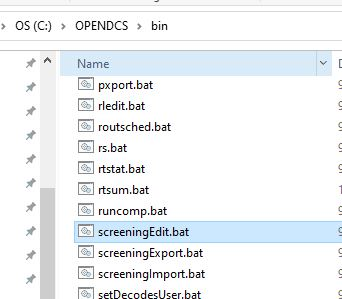

################################
OpenDCS DECODING - Introduction
################################

A significant piece of setting up a routing spec is 
writing the DECODING script.  This section is meant to
help new users get familiar with the DECODING format 
statements. 

A major bulk of the examples here are likely not typically
full raw messages from sources.  The sample messages are 
displayed for the purposes of providing examples of how 
the format statements function and decoding information.

Further details and advanced topics on the DECODING can be 
found in the DECODING manual ::ref DECODES Guide <./legacy-decoding-guide.rst>

How do I launch the Screening Editor?
=====================================

Unlike the computation processor or DECODES Database Editor the 
Screening Editor is not launched from the Main Menu. 

A window will pop up for log-in information.

For USACE:
* USERNAME: H7
* PASSWORD: Oracle

For USBR:

What are the tabs?
------------------
