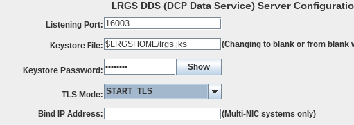
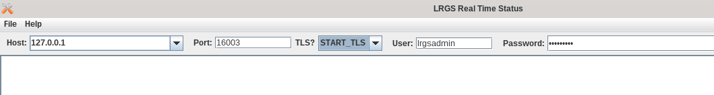

###########################
LRGS Installation and Setup
###########################

This document is part of the OpenDCS Software Suite for environmental
data acquisition and processing. The project home is:
https://github.com/opendcs/opendcs

See INTENT.md at the project home for information on licensing.

.. contents. Table of Contents
   :depth: 3

What is the LRGS?
#################

The letters LRGS stand for Local Readout Ground Station. The primary purpose of this component is to get data from
satellite sources, a DRGS (Direct Readout Ground Station) or an HRIT (High Rate Information Transfer).

See the legacy LRGS user guide for additional information :doc:`Legacy LRGS User Guide <legacy-lrgs-userguide>`.

The LRGS can take data from Satellites (HRIT, DRGS, NOAAport, Irridium), HRIT files, 
or another LRGS (DDS Protocol), and any network device that implements the DAMS-NT protocol as 
built-in sources.

Users can also provide custom sources to the LRGS.

What each LRGS data source has in common is that it acquires a unit of data, for example a GOES transmission, and saves it 
to an archive as a `DcpMsg`. DECODES can then search for and further process these individual messages.

The remainder of this guide will focus on setting up the LRGS component of OpenDCS for Linux.  However,  LRGS also works on a windows computer.

Installation - Linux
====================

This will guide a user through manual setup on a linux system using `systemd` for service control
For a guide on hardware requirements the LRGS is known to work for at least a single HRIT source on
the old Raspberry Pi 3B hardware and was used to create this documentation and verify examples. 

This example will use commands appropriate to Rocky Linux 9 on a Raspberry Pi. It is assumed the reader has
gotten all networking setup as needed. The instructions would be appropriate to Rocky Linux 9, RHEL 8/9, or
any other RHEL based distribution given appropriate changes in usernames.

These instructions will assume a fresh system without any OpenDCS components installed.

Install Java
------------

The minimum Java is 8. However, we recommend a Java 11 Runtime to take advantage of performance
improvements to java.

The following example uses the "main-nightly" release. This release will include any new features
but may be unstable. Substitute for a specific release, such as 7.0.14 in any environments that require
stability

.. code-block:: bash
    
    sudo dnf install java-11-openjdk-headless

Download and extract OpenDCS
----------------------------

.. code-block:: bash

    mkdir -p /opt/opendcs/main-nightly
    cd /opt/opendcs/main-nightly
    curl -O -L https://github.com/opendcs/opendcs/releases/download/main-nightly/opendcs-main-nightly.tar
    tar -xf opendcs-main-nightly.tar

Initial Setup
-------------

Newer versions of OpenDCS (7.0.13 or higher) will automatically create a $HOME/.opendcs directory for you the first
time any of applications are started. However, as this guide is for a specific server setup we will manually create the
appropriate directories.

.. code-block:: bash

    cd /home/rocky
    mkdir -p .opendcs/lrgs
    # Now copy the initial configuration
    cd .opendcs/lrgs
    cp /opt/opendcs/main-nightly/lrgs.conf .
    cp /opt/opendcs/main-nightly/ddsrecv.conf .
    cp /opt/opendcs/main-nightly/drgsconf.xml .
    cp -r /opt/opendcs/main-nightly/netlist .
    cp -r /opt/opendcs/main-nightly/users .
    # The Rocky Linux 9 Raspberry Pi image has a firewall on by default.
    # OpenDCS does not recommend turning the firewall off. Allow Port 16003
    # to be used.
    sudo firewall-cmd --zone=public --add-port=16003/tcp --permanent

    
You will need to set your environment. Add the following to .bashrc, if using bash. Otherwise adjust to your chosen shell.

.. code-block:: bash

    export PATH=$PATH:/opt/opendcs/main-nightly/bin
    export DCSTOOL_USERDIR=$HOME/.opendcs
    export LRGSHOME=$DCSTOOL_USERDIR/lrgs

.. code-block:: bash

    # For the current shell. If you add the above to .bashrc the commands
    # will be available by default.
    source ~/.bashrc
    

Now set the LRGS Admin Password:

.. code-block:: bash

    #For random generation:
    if [ "$LRGS_ADMIN_PASSWORD" == "" ]; then
        LRGS_ADMIN_PASSWORD=`tr -cd '[:alnum:]' < /dev/urandom | fold -w30 | head -n1`
        echo "Admin Password is $LRGS_ADMIN_PASSWORD"
        echo "This will not be printed on subsequent runs"
    fi
    cat `<<EOF | editPasswd
        adduser lrgsadmin
        $LRGS_ADMIN_PASSWORD
        $LRGS_ADMIN_PASSWORD
        addrole lrgsadmin dds
        addrole lrgsadmin admin
        write
        quit
    EOF

.. code-block:: bash
    
    # To set manually
    editPasswd
    adduser lrgsadmin
    # provide desired password
    addrole lrgsadmin dds
    addrole lrgsadmin admin
    write
    quit

Run LRGS
--------

# To run in the background using the normal start process
.. code-block:: bash
    
    startLRGS
    cd ~/.opendcs/lrgs
    # Use
    tail -f lrgslog
    # to see if there are any errors in the initial setup

If you would like to run the LRGS in the foreground use the following:

.. code-block:: bash    

    decj -DLRGSHOME=$LRGSHOME lrgs.lrgsmain.LrgsMain -d3 -l /dev/stdout -F -k -

Run LRGS as a service
---------------------

Installation - docker
#####################

.. code-block:: bash

    docker pull ghcr.io/opendcs/opendcs/lrgs:main-nightly
    
    docker volume create lrgs_home
    # A default password will be generated and in the logs
    docker run -d --name lrgs -p 16003:16003 -v lrgs_home:/lrgs_home ghcr.io/opendcs/opendcs/lrgs:main-nightly
    # or if you wish to manually set the password
    docker run -d --name lrgs -p 16003:16003 -v lrgs_home:/lrgs_home -e LRGS_ADMIN_PASSWORD="<password>" ghcr.io/opendcs/opendcs/lrgs:main-nightly

Connecting
##########

Now that you have an initial LRGS you can use the RtStat program (LRGS Status in the launcher) to connect to your LRGS at the host and port 16003.

TLS
###

The LRGS can now serve and receive DDS messages over TLS. This provides for confidentiality and especially integrity of 
the messages set and received. At this time the LRGS can either serve all DDS request over TLS or none.

Future work will implement "STARTTLS" and the ability to serve DDS from two ports.

For client usage, the TLS settings are determined per client connection.

Server
======

To serve DDS data over make use of TLS create a java keystore file of a certificate and configure the LRGS to use it.
If you have a certificate with key and the full trust chain you can do the following to create the keystore:

.. code-block:: bash
    
    keytool -importkeystore -noprompt \
        -alias lrgs  \
        -destkeystore lrgs.ks \
        -deststorepass lrgspass \
        -srckeystore lrgs.p12 \
        -srcstoretype JKS \
        -srcstorepass lrgspass # this password will depend on how the source .p12 file was created

in your lrgs.conf file set the following properties (also available in the GUI)

.. code-block:: text

    keyStoreFile=$LRGSHOME/lrgs.p12 # or where you have placed the file
    keyStorePassword=lrgspass
    ddsServerTlsMode=TLS
    # or START_TLS
    # or NONE

In the GUI

Client
======

The client uses a combination of the following sources when determining certificate trust:

1. The current JVMs certificate keystore
2. The system's certificate store
3. The file $DCSTOOL_USERDIR/local_trust.p12

The local_trust.p12 file is created automatically. For example, if you connect to an LRGS with with RtStat and
the server is not already trusted, you will receive a prompt with the certificate information asking if you want
to trust the server certificate.

Backend processing applications will log an error message with the host name if the certificate is not already trusted.
If necessary, you can manually add trust to the local_trust.p12 file with the keytool command similar to the 
Server certificate above. 

The password is `local_trust`. Given the limited security (no more or less than the system or java keystores) only
public certificates should be put in the local_trust keystore.

To configure the LRGS to connect with TLS to a given LRGS server, check the TLS box and save the configuration. 
The LRGS will need to be restarted.

For Routing Specs, documented later, there is a "lrgs.tls" property that can be set to one of the same options to enable 
TLS for those connections.

For `START_TLS` OpenDCS clients consider failure to establish the TLS connection an unrecoverable error.