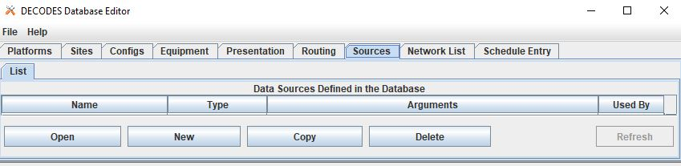
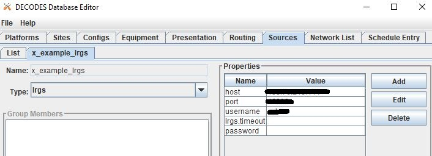

###################################
OpenDCS Routing Spec - Introduction
###################################

A **Routing Spec** is a process that retreives data, decodes it,
formats it, and then puts it somewhere.

In other words, a defined routing spec is a set of instructions that
do the following steps:

#. Identify a source to retreive information from
#. Transform information to a time series based on pre-described set of rules
#. Match tranformed information to a time series or group of time series in relevant database
#. Put information into database or alternative format
#. Do step 1-4 for multiple locations, in one defined routing spec

The GUI is built to help users set up a routing spec.  Once a routing 
spec is set up using the GUI, it will have a name.  The routing spec
can then be executed by running the OpenDCS command "rs".  More
information on the commands to run routing specs can be found ____.

Routing specs can also be set to run on a background scheduler called
the *Routing Scheduler*.  More information on this can be found _____.

The content below is focused on how to set up a routing spec. 

How to Set-Up a Routing Spec?
=============================

There is not any one specific order to setting up a routing spec,
but a recommended order is outlined below.  Variations of such 
order are necessary when variations and unique applications within
a routing spec are employed.

#. Ensure locations exist in database
#. Ensure connections to LRGS's are defined 
#. Define a source or sources for the routing spec
#. Define a configuration or configurations for the routing spec
#. Define DECODING scripts
#. Create a platform or platforms
#. Create a Network List or Lists for the routing spec.
#. Define the routing spec.
#. Schedule Entry

The steps below are intended to help guide a new user through the 
GUI and DECODES Database Editor tabs used for setting up the routing 
spec.

To get started, launch the DECODES Database Editor from the main menu.

.. image:: ./media/start/routingspec/im-routingspec-01.JPG
   :alt: sources
   :width: 150

A window will pop up prompted a user for log in information.

USACE users:

* USERNAME: User H7
* PASSWORD: Oracle

Sources
-------

Once the DECODES Database Editor has been launched, navigate to the 
**Sources** tab. On the bottom of the page, click the "New". 

There are a number of types of sources.  The main options are
outlined below. In the event that some of the options below are 
not showing up, use rledit to add these in.  See section ____ for 
more information.

* **lrgs** - retreives raw messages from a remote LRGS server over the network
* **file** - read data from a specified file
* **directory** - continually scan a directory and process files as they appear 
* **web** - reads data files over a web connection specified by a URL
* **abstractweb** - reads data files over a web connection specified by a URL with parameters
* **socketstream** - opens a socket and reads a one-way stream of data containing raw DCP messages. Some DRGS and HRIT product provide such a stream
* **hotbackupgroup** - an ordered group of LRGS data sources, where secondary and teriary servers are used with primary or secondary is unavailble, respectively
* **roundrobingroup** - contains a list of other data sources and is continually read in

lrgs
~~~~

Users can set up a source to pull from a remote LRGS server over
the network.  This source can set up to connect to an LRGS or 
DRS system.  Properties for the LRGS Data Source can be defined 
in the Properties section on the right hand side of the window.

Typical information required for this type of source include:

* host: the numeric 
* port:
* username:
* password: 

For further information about the other properties see ______

file
~~~~

Users can set up a source to pull from a file to ingest the

... content coming soon ...

directory
~~~~~~~~~

... content coming soon ...

web
~~~

... content coming soon ...

abstractweb
~~~~~~~~~~~

... content coming soon ...

Configuration
-------------

Once a 
The configuration tab is where 

DECODING
--------

Platforms
---------

Network Lists
-------------

Routing Spec
------------

