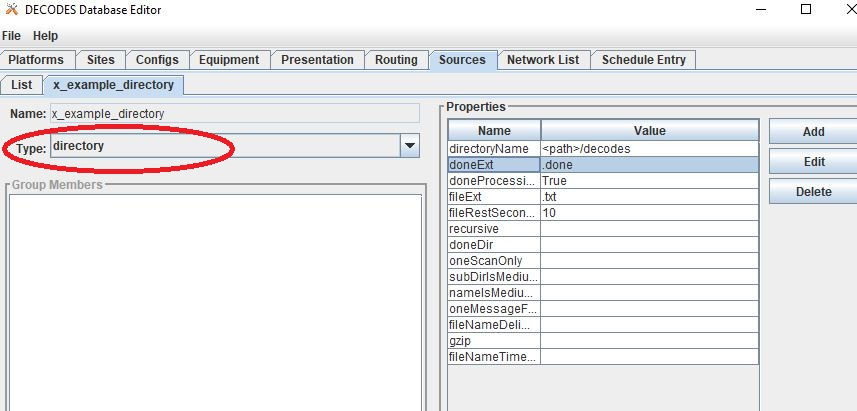
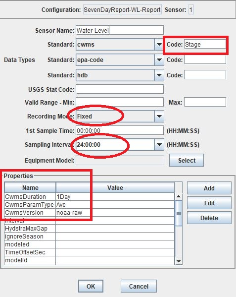

###################################
OpenDCS Routing Spec - Introduction
###################################

A **Routing Spec** is a process that retreives data, decodes it,
formats it, and then puts it somewhere.

In other words, a defined routing spec is a set of instructions that
do the following steps:

#. Identify a source to retreive information from
#. Transform information to a time series based on pre-described set of rules
#. Match tranformed information to a time series or group of time series in relevant database
#. Put information into database or alternative format
#. Do step 1-4 for multiple locations, in one defined routing spec

The GUI is built to help users set up a routing spec.  Once a routing 
spec is set up using the GUI, it will have a name.  The routing spec
can then be executed by running the OpenDCS command "rs".  More
information on the commands to run routing specs can be found 
:any:`leg-rout-manual-commands`

Routing specs can also be set to run on a background scheduler called
the *Routing Scheduler*.  More information on this can be found 
:any:`leg-rout-scheduler`.

The content below is focused on how to set up a routing spec. 

How to Set-Up a Routing Spec?
=============================

There is not any one specific order to setting up a routing spec,
but a recommended order is outlined below.  Variations of such 
order are necessary when variations and unique applications within
a routing spec are employed.

#. Ensure locations exist in database
#. Ensure connections to LRGS's are defined 
#. Define a source or sources for the routing spec
#. Define a configuration or configurations for the routing spec
#. Define DECODING scripts
#. Create a platform or platforms
#. Create a Network List or Lists for the routing spec
#. Define the routing spec
#. Schedule Entry

The steps below are intended to help guide a new user through the 
GUI and DECODES Database Editor tabs used for setting up the routing 
spec.

To get started, launch the DECODES Database Editor from the main menu.

.. image:: ./media/start/routingspec/im-01-decodes-components.JPG
   :alt: sources
   :width: 150

A window will pop up prompted a user for log in information.

USACE users:

* USERNAME: User H7
* PASSWORD: Oracle

Sources
-------

Once the DECODES Database Editor has been launched, navigate to the 
**Sources** tab. On the bottom of the page, click the "New". 

.. image:: ./media/start/routingspec/im-02-sources-tab.JPG
   :alt: sources
   :width: 600

There are a number of types of sources.  The main options are
outlined below. In the event that some of the options below are 
not showing up, use rledit to add these in.  See section ____ for 
more information.

* **lrgs** - retreives raw messages from a remote LRGS server over the network
* **file** - read data from a specified file
* **directory** - continually scan a directory and process files as they appear 
* **web** - reads data files over a web connection specified by a URL
* **abstractweb** - reads data files over a web connection specified by a URL with parameters
* **socketstream** - opens a socket and reads a one-way stream of data containing raw DCP messages. Some DRGS and HRIT product provide such a stream
* **hotbackupgroup** - an ordered group of LRGS data sources, where secondary and teriary servers are used with primary or secondary is unavailble, respectively
* **roundrobingroup** - contains a list of other data sources and is continually read in

Note that the names of sources **cannot be renamed** after they are
created, so select the source name wisely. 

lrgs
~~~~

Users can set up a source to pull from a remote LRGS server over
the network.  This source can set up to connect to an LRGS or 
DRS system.  Properties for the LRGS Data Source can be defined 
in the Properties section on the right hand side of the window.

.. image:: ./media/start/routingspec/im-03-source-lrgs.JPG
   :alt: sources
   :width: 600

Typical information required for this type of source include:

* host: the numeric 
* port:
* username:
* password: 

For further information about lrgs and connection, see ______ .
For more information about the properties options see _____ .

file
~~~~

Users can set up a source to pull from a file on a local server.  
The file mus be in a defined specified location.  For example,
in the image below the file "catchup.txt" is called upon.  Users
should add in the whole path for the file where the '<path>'
placeholder is specified.  

.. image:: ./media/start/routingspec/im-04-source-file.JPG
   :alt: sources
   :width: 600

Users can specify some properties in the Properties section, such
as where there is one message per file, or whether there is a header.
Note that the parsing of the information in the file will be
defined in the DECODING script, along with perhaps some simple 
properties and/or parameters. 

For more information about the properties options see _____ .

directory
~~~~~~~~~

Users can set up a source to pull information from a group of files
that are in a specified directory.  For example, in the image below
the directory is called "decodes".  When setting up users should add
in the whole path for the directory. Some other common parameters 
to define include:

* fileExt: If set, only process files with a matching extention. Other files ignored.
* fileRestSeconds: Don't process until x seconds have lapsed, to present processing of a file while it's being written. 
* doneProcessing: Decision about how processed file are handled. If False, files are deleted. If True, then files are renamed or moved.
* doneExt: Extention to be added to files once processed (if doneProcessing set True). Do not use same extention as fileExt.

For more information about the properties options see _____ .

web
~~~

Users can also set up a source to retreive or fetch information 
from a web page.  In the example below the url points towards a web
page (url) that is static.  The information on the web page is
updated on a regular basis. For web sources, users must define
a url in the *url* Properties box.

Additional common parameters defined included for web sources are:

* OneMessageFile: if True entire web page is assumed to contain one message
* before: 
* header: 

.. image:: ./media/start/routingspec/im-06-source-web.JPG
   :alt: sources
   :width: 600

Below is a snapshot of what the URL looks like:

.. image:: ./media/start/routingspec/im-07-source-web-url.JPG
   :alt: sources
   :width: 450

In the example above, the url includes daily levels for multiple
sites or locations. Each locations' data is separated by a header
that includes a station identifier number and name.

For more information about the properties options see _____ .

abstractweb
~~~~~~~~~~~

Users can also set up a source that reads data directly over the 
web.  The abstractweb source differs from the web source by including
options to build a unique url with parameters such as $Date or 
$MediumID to specify a time window or station in the url.

If users are not seeing the option "abstractweb" in the list of the 
types, then see section ____ and use rledit to add it.

.. image:: ./media/start/routingspec/im-08-source-abstractweb.JPG
   :alt: sources
   :width: 600

For example - Daily Water Levels from NOAA for one station (bottom of file): 

.. code-block:: shell
    
    With Variables: https://tidesandcurrents.noaa.gov/cgi-bin/co-ops_qry.cgi?stn=$MEDIUMID&dcp=1&ssid=V1&pc=W1&datum=NULL&unit=0&edate=$SINCE&date=1&shift=NULL&level=-1&form=0&data_type=pgs&format=View+Report
    Example: https://tidesandcurrents.noaa.gov/cgi-bin/co-ops_qry.cgi?stn=9087031&dcp=1&ssid=V1&pc=W1&datum=NULL&unit=0&edate=20240218&date=1&shift=NULL&level=-1&form=0&data_type=pgs&format=View+Report

.. image:: ./media/start/routingspec/im-09-source-abstractweb-url.JPG
   :alt: sources
   :width: 600

For example - Hourly Water Levels from NOAA for one station: 

.. code-block:: shell

    With Variables: https://api.tidesandcurrents.noaa.gov/api/prod/datagetter?begin_date=$SINCE&end_date=$UNTIL&station=$MEDIUMID&product=water_level&datum=IGLD&time_zone=gmt&units=metric&application=USACE&format=csv
    Example - CSV: https://api.tidesandcurrents.noaa.gov/api/prod/datagetter?begin_date=$SINCE&end_date=$UNTIL&station=$MEDIUMID&product=water_level&datum=IGLD&time_zone=gmt&units=metric&application=USACE&format=csv

Configuration
-------------

The next step, after defining a source, to setting up a routing spec
is to define a new configuration.  To do this, navigate to the 
**Config** tab.  Select "New" at the bottom of the screen.  

.. image:: ./media/start/routingspec/im-11-configs-tab.JPG
   :alt: sources
   :width: 600

An input window will pop up asking the user to enter a name for
the new config.  Like the sources, the name selected for the 
configuration cannot be changed once it is created.  Good practice
is to select a name that conveys to users some information about 
the DECODING stored in the configuration.  

.. image:: ./media/start/routingspec/im-12-config-example.JPG
   :alt: sources
   :width: 600

Once set up, the configuration record will contain:

* a list of sensors
* a DECODING script
* count of number of platforms using the configuration
* an equipment model (if applicable)

Once the new configuration is opened, the parameters will need to
be filled in.  Add sensor information.  The sensor information is
applicable whether the source is an lrgs, or file, or directory or
abstractweb.  This is where the information is defined about what
type of time series data will be the output of the DECODING script.
For example, below are a few examples of what type of information
could be stored in the Sensor area (ie water levels, precipitation,
stage, flow, etc). Below is a brief recap of the Sensor headers:

* Name: information about the variable (ie Precipitation, AirTempMax, PeakFlow, etc)
* Data Type: information about **param** such as (Precip, Temp-Air, Stage, Flow). Users can enter either the Code or Param Type from the tables below.
* Mode: information about the time series **interval**
* Sampling Times: additional information about the sampling time interval
* Properties: further information about the time series such as **statcode** , **duration** , and **version**.

See the table below for more information about what code or parameter
should be entered above for the Data Type.

In this example in getting started, the configurations are
introductory and will not include offsets or computations or 
transformations.  

Note that if a user specifies properties in the platform section,
those properties will overwrite what is defined in the configuration
record.

Below is a table of the codes and the corresponding parameter
types that need to be entered for the sensors.

.. table:: Table Matching Codes and Parameter Types

   +-----------+-----------------------+
   | **Code**  | **CWMS Param Type**   |
   |           |                       |
   |           |                       |
   +-----------+-----------------------+
   | PC        | Precip                |
   +-----------+-----------------------+
   | HG        | Stage                 |
   +-----------+-----------------------+
   | HP        | Stage-Pool            |
   +-----------+-----------------------+
   | HT        | Stage-Tail            |
   +-----------+-----------------------+
   | VB        | Volt                  |
   +-----------+-----------------------+
   | BV        | Volt                  |
   +-----------+-----------------------+
   | HR        | Elev                  |
   +-----------+-----------------------+
   | LF        | Stor                  |
   +-----------+-----------------------+
   | QI        | Flow-In               |
   +-----------+-----------------------+
   | QR        | Flow                  |
   +-----------+-----------------------+
   | TA        | Temp-Air              |
   +-----------+-----------------------+
   | TW        | Temp-Water            |
   +-----------+-----------------------+
   | US        | Speed-Wind            |
   +-----------+-----------------------+
   | UP        | Speed-Wind            |
   +-----------+-----------------------+
   | UD        | Dir-Wind              |
   +-----------+-----------------------+

Once the sensor information is added, add a new Decoding Script.

The next section will go into further detail about how to set up
a decoding script.

DECODING
--------

Once the configuration and sensors are defined, then a DECODING script
can be added.  One can think of the DECODING script as the 
instructions or recipe for translating the raw lrgs messages or data
retrieved from the web to human readable time series, formatted such
that it can be easily entered into the database. 

For example, see in the following window the Sample Message Box
window contains a raw message, and the bottom shows the data in 
a time series format.

.. image:: ./media/start/routingspec/im-15-config-decoding-script-example.JPG
   :alt: sources
   :width: 600

The next section will go over the window parts.  

DECODING Basics
~~~~~~~~~~~~~~~

DECODES uses Fortran-like statements to intrepet and format the data.

The DECODES format statments consist of two parts:

#. a *label* to identify the format
#. a *statement* containing a sequence of format operations

Within a stement, the format operations are separated from each other by commas.

**Setting up DECODING script is likely the most challenging part of
setting up a routing spec.**

Overview of the Decoding Script Editor
~~~~~~~~~~~~~~~~~~~~~~~~~~~~~~~~~~~~~~

A few key items must be defined in a DECODING script. There must
be at least one format statement and a script name.  The default
"Data Order" is Undefined and there is by default no Header Type.

* Script Name:
* Format Statement - Label: 
* Format Statement - Format Statement: 

On the top of the screen there are additional options including

* Data Order: A drop down menu where Ascending or Descending can be selected
* Header Type: A drop fown menu for selecting a header type such as a medium or source type

DECODES uses Fortran-like statements to interpret and format the data.
Within a statement, the format operations are spearated from each
other by commas.

In the middle of the screen there is a box "Sample Message" where
users can paste messages.  Users can retreive messages from alternative
sources and paste directly into the window, or load messages using
the Load button on the right. 

In the example below, a message is pasted from loading a message. 
To LOAD a message, users must retreive the message while connected
to the lrgs.  For USACE users, this means that messages can only
be retreieved while logged onto the server.  To select a message 

DECODING - Statement Basics
~~~~~~~~~~~~~~~~~~~~~~~~~~~

Once the statements are defined, and a message is in the Sample
Message area, then DECODING can be executed for testing or debugging
purposes.  Click the Decode button on the right hand side. 

As it is executed, the script keeps track of three things:

*. The currently executing format statement
*. The current operation within the format statement
*. The current position within the message data

The message header is not processed by the script.  The data pointer
is initialized to the first actual message byte.

The script will start with the first format statement, so position
is important.  This differs from previous versions of DECODES and EMIT.

Each format statement has a label.  Several operations can cause
decoding to jump to a new statement, indentified by its label. Labels
may only contain letters and digits.

Note, that sometimes an entire format statement cannot fit into one 
line. In these cases, a second adjacent label with the exact same 
name can be added and the format statement will be treated as a 
continuation of the first statement. 

The various operations in the format statements step through the 
message data from beginning to end.  There are operations for 
skipping characters and lines, and for positioning the data
pointer within the message data.

Below are a few examples of some common statements, to help a new
user get familiar with how the statements work.  Typically, DECODING
that is operational and parses a raw message, is more involved. For more
information see section _______ .

Recall that the following information is being retreived.

* Date
* Value for Variable

For a more detailed introduction about DECODING see the :: ref 

Platforms
---------

The next step to getting the routing spec set up is to set up a 
platform.  For example, in this example, the platform will be named

Network Lists
-------------

Operationally it is common to group a number of platforms together.
In some cases these may be grouped together by project, or perhaps by 
seasonanilty, or perhaps something else.  For this examples 

Routing Spec
------------

