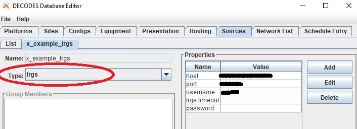
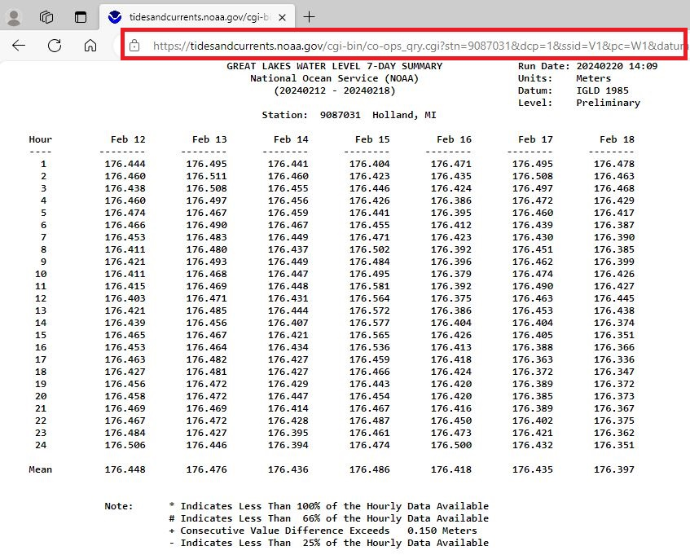
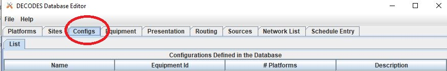
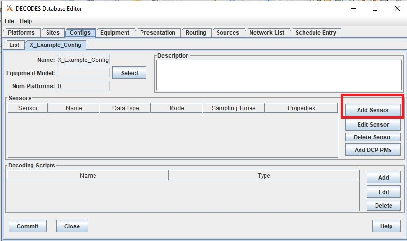
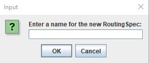
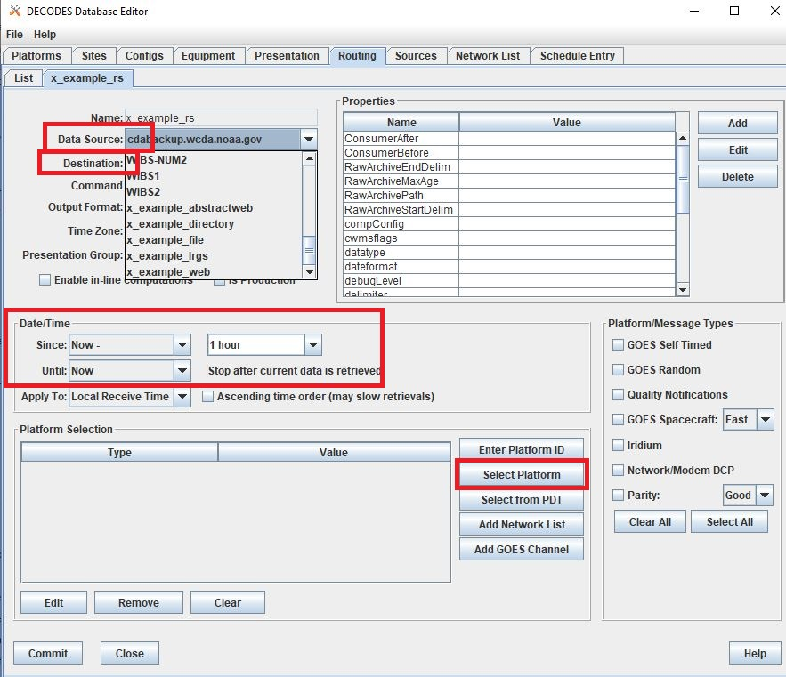

###################################
OpenDCS Routing Spec - Introduction
###################################

A **Routing Spec** is a process that retreives data, decodes it,
formats it, and then puts it somewhere.

In other words, a defined routing spec is a set of instructions that
do the following steps:

#. Identify a source to retreive information from
#. Transform information to a time series based on pre-described set of rules
#. Match tranformed information to a time series or group of time series in relevant database
#. Put information into database or alternative format
#. Do step 1-4 for multiple locations, in one defined routing spec

The GUI is built to help users set up a routing spec.  Once a routing 
spec is set up using the GUI, it will have a name.  The routing spec
can then be executed by running the OpenDCS command "rs".  More
information on the commands to run routing specs can be found 
:any:`leg-rout-manual-commands`

:: 

   rs -d3 'routing-spec-name'

More details about how to run the routing spec are addressed at the end
of this page.

Routing specs can also be set to run on a background scheduler called
the *Routing Scheduler*.  More information on this can be found 
:any:`leg-rout-scheduler`.

The content below is focused on how to set up a routing spec.

*****************************
How to Set-Up a Routing Spec?
*****************************

There is not any one specific order to setting up a routing spec,
but a recommended order is outlined below.  Variations of such 
order are necessary when variations and unique applications within
a routing spec are employed.

#. Ensure locations exist in database
#. Ensure connections to LRGS's are defined 
#. Define a **source** or sources for the routing spec
#. Define a **configuration** or configurations for the routing spec
#. Define **DECODING** scripts
#. Create a **platform** or platforms
#. Create a **network list** or lists for the routing spec
#. Define the **routing spec**
#. Schedule routing specs using **routing scheduler**

The steps below are intended to help guide a new user through the 
GUI and DECODES Database Editor tabs used for setting up the routing 
spec.

To get started, launch the DECODES Database Editor from the main menu.

A window will pop up prompted a user for log in information.

USACE users:

* USERNAME: User H7
* PASSWORD: Oracle

1.Database Locations
====================

2.LRGS Connections
====================

3.Sources
=========

Once the DECODES Database Editor has been launched, navigate to the 
**Sources** tab. On the bottom of the page, click the "New". 

There are a number of types of sources.  The main options are
outlined below. In the event that some of the options below are 
not showing up, use rledit to add these in.  See :any:`rledit <leg-route-source-abstract>`
for more information on using the reference list editor.

* **lrgs** - retreives raw messages from a remote LRGS server over the network
* **file** - read data from a specified file
* **directory** - continually scan a directory and process files as they appear 
* **web** - reads data files over a web connection specified by a URL
* **abstractweb** - reads data files over a web connection specified by a URL with parameters
* **socketstream** - opens a socket and reads a one-way stream of data containing raw DCP messages. Some DRGS and HRIT product provide such a stream
* **hotbackupgroup** - an ordered group of LRGS data sources, where secondary and teriary servers are used with primary or secondary is unavailble, respectively
* **roundrobingroup** - contains a list of other data sources and is continually read in

Note that the names of sources **cannot be renamed** after they are
created, so select the source name wisely. 

lrgs
----

Users can set up a source to pull from a remote LRGS server over
the network.  This source can set up to connect to an LRGS or 
DRS system.  Properties for the LRGS Data Source can be defined 
in the Properties section on the right hand side of the window.

Typical information required for this type of source include:

* host: the numeric 
* port:
* username:
* password: 

For further information about lrgs and connection, see :doc:`LRGS User Guide <./legacy-lrgs-userguide>`.
For more information about the properties options see :any:`lrgs source properties <leg-route-source-properties-lrgs>`.

file
----

Users can set up a source to pull from a file on a local server.  
The file mus be in a defined specified location.  For example,
in the image below the file "catchup.txt" is called upon.  Users
should add in the whole path for the file where the '<path>'
placeholder is specified.  

Users can specify some properties in the Properties section, such
as where there is one message per file, or whether there is a header.
Note that the parsing of the information in the file will be
defined in the DECODING script, along with perhaps some simple 
properties and/or parameters. 

For more information about the properties options see :any:`file and directory source properties <leg-route-source-properties-file>`.

directory
---------

Users can set up a source to pull information from a group of files
that are in a specified directory.  For example, in the image below
the directory is called "decodes".  When setting up users should add
in the whole path for the directory. Some other common parameters 
to define include:

* fileExt: If set, only process files with a matching extention. Other files ignored.
* fileRestSeconds: Don't process until x seconds have lapsed, to present processing of a file while it's being written. 
* doneProcessing: Decision about how processed file are handled. If False, files are deleted. If True, then files are renamed or moved.
* doneExt: Extention to be added to files once processed (if doneProcessing set True). Do not use same extention as fileExt.

.. image:: ./media/start/routingspec/im-05-source-directory.JPG
   :alt: sources
   :width: 600

For more information about the properties options see :any:`file and directory source properties <leg-route-source-properties-file>`.

web
---

Users can also set up a source to retreive or fetch information 
from a web page.  In the example below the url points towards a web
page (url) that is static.  The information on the web page is
updated on a regular basis. For web sources, users must define
a url in the *url* Properties box.

Additional common parameters defined included for web sources are:

* OneMessageFile: if True entire web page is assumed to contain one message
* before: 
* header: 

Below is a snapshot of what the URL looks like:

In the example above, the url includes daily levels for multiple
sites or locations. Each locations' data is separated by a header
that includes a station identifier number and name.

For more information about the properties options see :any:`web and abstract web source properties <leg-route-source-abstract>`.

abstractweb
-----------

Users can also set up a source that reads data directly over the 
web.  The abstractweb source differs from the web source by including
options to build a unique url with parameters such as $Date or 
$MediumID to specify a time window or station in the url.

If users are not seeing the option "abstractweb" in the list of the 
types, then see section ____ and use rledit to add it.

For example - Daily Water Levels from NOAA for one station (bottom of file): 

.. code-block:: shell
    
    With Variables: https://tidesandcurrents.noaa.gov/cgi-bin/co-ops_qry.cgi?stn=$MEDIUMID&dcp=1&ssid=V1&pc=W1&datum=NULL&unit=0&edate=$SINCE&date=1&shift=NULL&level=-1&form=0&data_type=pgs&format=View+Report
    Example: https://tidesandcurrents.noaa.gov/cgi-bin/co-ops_qry.cgi?stn=9087031&dcp=1&ssid=V1&pc=W1&datum=NULL&unit=0&edate=20240218&date=1&shift=NULL&level=-1&form=0&data_type=pgs&format=View+Report

For example - Hourly Water Levels from NOAA for one station: 

.. code-block:: shell

    With Variables: https://api.tidesandcurrents.noaa.gov/api/prod/datagetter?begin_date=$SINCE&end_date=$UNTIL&station=$MEDIUMID&product=water_level&datum=IGLD&time_zone=gmt&units=metric&application=USACE&format=csv
    Example - CSV: https://api.tidesandcurrents.noaa.gov/api/prod/datagetter?begin_date=$SINCE&end_date=$UNTIL&station=$MEDIUMID&product=water_level&datum=IGLD&time_zone=gmt&units=metric&application=USACE&format=csv

.. image:: ./media/start/routingspec/im-10-source-abstractweb-url-csv.JPG
   :alt: sources - abstract web url csv
   :width: 600

4.Configuration
===============

The next step, after defining a source, to setting up a routing spec
is to define a new configuration.  To do this, navigate to the 
**Config** tab.  Select "New" at the bottom of the screen.  

An input window will pop up asking the user to enter a name for
the new config.  Like the sources, the name selected for the 
configuration cannot be changed once it is created.  Good practice
is to select a name that conveys to users some information about 
the DECODING stored in the configuration.  

Once set up, the configuration record will contain:

* a list of sensors
* a DECODING script
* count of number of platforms using the configuration
* an equipment model (if applicable)

Sensors
-------

Once the new configuration is opened, the parameters will need to
be filled in.  Add sensor information.  The sensor information is
applicable whether the source is an lrgs, or file, or directory or
abstractweb.  This is where the information is defined about what
type of time series data will be the output of the DECODING script.
For example, below are a few examples of what type of information
could be stored in the Sensor area (ie water levels, precipitation,
stage, flow, etc). Below is a brief recap of the Sensor headers:

* Name: information about the variable (ie Precipitation, AirTempMax, PeakFlow, etc)
* Data Type: information about **param** such as (Precip, Temp-Air, Stage, Flow). Users can enter either the Code or Param Type from the tables below.
* Mode: information about the time series **interval**
* Sampling Times: additional information about the sampling time interval
* Properties: further information about the time series such as **statcode** , **duration** , and **version**.

.. image:: ./media/start/routingspec/im-13-config-sensors-window.JPG
   :alt: config sensor window
   :width: 550

See the table below for more information about what code or parameter
should be entered above for the Data Type.

In this example in getting started, the configurations are
introductory and will not include offsets or computations or 
transformations.  

Note that if a user specifies properties in the platform section,
those properties will overwrite what is defined in the configuration
record.

Below is a table of the codes and the corresponding parameter
types that need to be entered for the sensors.

.. table:: Table Matching Codes and Parameter Types

   +-----------+-----------------------+
   | **Code**  | **CWMS Param Type**   |
   |           |                       |
   |           |                       |
   +-----------+-----------------------+
   | PC        | Precip                |
   +-----------+-----------------------+
   | HG        | Stage                 |
   +-----------+-----------------------+
   | HP        | Stage-Pool            |
   +-----------+-----------------------+
   | HT        | Stage-Tail            |
   +-----------+-----------------------+
   | VB        | Volt                  |
   +-----------+-----------------------+
   | BV        | Volt                  |
   +-----------+-----------------------+
   | HR        | Elev                  |
   +-----------+-----------------------+
   | LF        | Stor                  |
   +-----------+-----------------------+
   | QI        | Flow-In               |
   +-----------+-----------------------+
   | QR        | Flow                  |
   +-----------+-----------------------+
   | TA        | Temp-Air              |
   +-----------+-----------------------+
   | TW        | Temp-Water            |
   +-----------+-----------------------+
   | US        | Speed-Wind            |
   +-----------+-----------------------+
   | UP        | Speed-Wind            |
   +-----------+-----------------------+
   | UD        | Dir-Wind              |
   +-----------+-----------------------+

Once the sensor information is added, add a new Decoding Script.

.. image:: ./media/start/routingspec/im-14-config-sensors.JPG
   :alt: config sensors
   :width: 450

The next section will go into further detail about how to set up
a decoding script.

5.DECODING
==========

Once the configuration and sensors are defined, then a DECODING script
can be added.  One can think of the DECODING script as the 
instructions or recipe for translating the raw lrgs messages or data
retrieved from the web to human readable time series, formatted such
that it can be easily entered into the database. 

For example, see in the following window the Sample Message Box
window contains a raw message, and the bottom shows the data in 
a time series format.

Overview of the Decoding Script Editor
--------------------------------------

In the above image there are three parts boxed in red:

* Format Statements: FORTRAN-like statements to interpret and format the data
* Sample Message: Box for pasting or loading retrieved messages to test DECODING
* Decoded Data: Output of DECODING with color syntax

In addition to the parts highligted above, there are three other parts that 
the user may use:

* Sesnor Line Conversions: Table for specifying units of decoded message and any simple linear coefficient conversions
* Data order:  A drop down menu where Ascending or Descending can be selected (default is undefined)
* Header Type:  A drop fown menu for selecting a header type such as a medium or source type (default is blank)

In regards to using the sample message browser, note that messages
can only be retrieved from an lrgs for which a connection has already
been established.  For USACE users, this means that messages can only
be retireved while logged onto the server.

To get started on writing DECODES statements, see :doc:`DECODES Guide<./start-decoding>`.
DECODES statements use FORTRAN-like statements. Within a statement,
the format operations are separated from each other by commas.  Each
statement has two parts:  

#. a *label* to identify the format
#. a *statement* containing a sequence of format operations

**Setting up DECODING script is likely the most challenging part of
setting up a routing spec.**  This means that filling in the following 
window is likely going to be the largest time sink in getting a new
routing spec set-up.

.. image:: ./media/start/routingspec/im-16-config-decoding-script-new.JPG
   :alt: decoding script new window
   :width: 650

DECODING - Executing Basics
---------------------------

Once the statements are defined, and a message is in the Sample
Message area, then DECODING can be executed for testing or debugging
purposes.  Click the Decode button on the right hand side. 

As it is executed, the script keeps track of three things:

* The currently executing format statement
* The current operation within the format statement
* The current position within the message data

The message header is not processed by the script.  The data pointer
is initialized to the first actual message byte.

The script will start with the first format statement, so position
is important.  This differs from previous versions of DECODES and EMIT.

Each format statement has a label.  Several operations can cause
decoding to jump to a new statement, indentified by its label. Labels
may only contain letters and digits.

Note, that sometimes an entire format statement cannot fit into one 
line. In these cases, a second adjacent label with the exact same 
name can be added and the format statement will be treated as a 
continuation of the first statement. 

The various operations in the format statements step through the 
message data from beginning to end.  There are operations for 
skipping characters and lines, and for positioning the data
pointer within the message data.

Below is one example of DECODING for a specific type of messags from a 
csv.  Typically, DECODING that is operational and parases a raw mesage
is often more involved and complicated.  Depending on how the platform is
set up and what type of message is assumed, the header information
may be interpreted, skipped or parsed differently.  In the example
below, it is assumed the header is for a GOES self-timed DCP message.
This is a common type of message, especially when the source is defined
as an lrgs.

For more information about getting started with DECODES see 
:doc:`Intro to DECODES <./start-decoding>`

Recall that the following information is being retreived.

* Date
* Value for Variable

GOES DCP Message Header
~~~~~~~~~~~~~~~~~~~~~~~

And LRGS internally formats headers into a 37-byte character string.

Sample Raw Message:
::

   CE06021C24060212401G39+0NN017EXE00196

::

                                        
   CE06021C24060212401G39+0NN017EXE00196
   CE06021C           G  +0NN   E  00196
           24060212401 39  N 017 XE00196
          |          || | |||  || |    |
          A          BC D EFG  HI J    K           

+---------------------------+---------------------+--------------------------------------------------------+
|**Field**                  |**Letter and Index** |**Description**                                         |
+===========================+=====================+========================================================+
|DCP Address                |A  (1-8)             |8 hex digit DCP Address                                 |
+---------------------------+---------------------+--------------------------------------------------------+
|Date                       |B  (9-19)            |11 digit date and time in YYDDDHHMMSS (DDD=Julian Day)  |
+---------------------------+---------------------+--------------------------------------------------------+
|Failure Code               |C  (20)              |G (good), ? (parity error), or  W, D, A, B, T, U, etc   |
+---------------------------+---------------------+--------------------------------------------------------+
|Digital Signal Strength    |D  (21-22)           |2 decimal digital signal strength (32-57)               |
+---------------------------+---------------------+--------------------------------------------------------+
|Digital Frequency Offset   |E  (23-24)           |2 decimal frequency offset (+ or -, 0-9)                |
+---------------------------+---------------------+--------------------------------------------------------+
|Modulation Index           |F  (25)              |1 decimal index - N (normal), L (low) or H (high)       |
+---------------------------+---------------------+--------------------------------------------------------+
|Data Quality Indicator     |G  (26)              |1 decimal data quality - N (normal), F (fair), P (poor) |
+---------------------------+---------------------+--------------------------------------------------------+
|GOES receive channel       |H  (27-29)           |3 decimal digit GOES receive channel                    |
+---------------------------+---------------------+--------------------------------------------------------+
|GOES spacecraft indicator  |I  (30)              |1 character GOES spacecraft indicator E or W            |
+---------------------------+---------------------+--------------------------------------------------------+
|Uplink Carrier Status      |J  (31-32)           |2 hex digit uplink carrier status                       |
+---------------------------+---------------------+--------------------------------------------------------+
|Message data length        |K  (33-37)           |5 decimal digit message data length                     |
+---------------------------+---------------------+--------------------------------------------------------+

DECODING EXAMPLES
~~~~~~~~~~~~

Below is an example of when the message is formatted like a csv.  
The second examples shows a simple GOES dcp message with one variable.

In the above message, the dates and times are actually in the message and 
so in the case above the DECODING has to search for the date and time. The 
DECODING uses a banked csv format statement to parse the message.

In the above message, the date and times are derived from the message header.
Be sure to click "OK" so the script editor closes and then click "Commit" on
the config page so that the DECODING script edits save.

**DECODING** messages requires a solid understanding of the message
structure and formats, and DECODING statements and formats. Even 
experienced users may require significant time to set up functional
DECODING scripts and statements.

Once a DECODING script is set up, then the next step is to set up a
platform. 

6.Platforms
===========

To create a new platform click on the **Platforms** tab in the 
DECODES Database Editor.  On the bottom of the screen click "New".

Then a new DCP window will pop up.  In the window there will be a number of fields
to be filled in. They are listed in the table below.

+----------------------------+---------------------------------------------------+
|**Field**                   |**Description**                                    |
+============================+===================================================+
|Site                        |Location in Database                               |
+----------------------------+---------------------------------------------------+
|Designator                  |Optional note about the site or data type          |
+----------------------------+---------------------------------------------------+
|Config                      |Select the config set up in the previous steps     |
+----------------------------+---------------------------------------------------+
|Owner Agency                |Optional note for agency platform owner            |
+----------------------------+---------------------------------------------------+
|Description                 |Optional note about the platform                   |
+----------------------------+---------------------------------------------------+
|Platform Sensor Information |Sensor information will overwrite config sensor    |
+----------------------------+---------------------------------------------------+
|Transport Media             |Define medium type and transmission info           |
+----------------------------+---------------------------------------------------+
|Production Box              |Optional setting                                   |
+----------------------------+---------------------------------------------------+

For the Transport Media, this box will pop up where the user can 
include platform media transport information.  The two images below
show an example of a DCP and the transmission information.

The Transport Medium window may look different depending on which 
Medium Type is selected.  For example, when the "Medium Type" is set 
to "goes-self-timed", then the bottom of the window populates with 
fields relevant to GOES, such as channel number, transmittion time,
transmition duration, and transmit interval.  

**IMPORTANT NOTE**: Transport medium IDs can only be attributed to one
platform. Therefore, if there is more than one message type or source 
(perhaps for different variables, or sources, or time resolutions), 
the DECODING script must address all sources. So, in the example 
above, the DCP address is the transport ID.

Be sure to click "commit" to save new platform edits. 

7.Network Lists
===============

A routing spec can be defined once at least one platform is defined.
However, in the event there are multiple platforms defined that 
are all going to use the same source, it is helpful to create a
Network List.  A Network List is simply a list or group of platforms.
Platforms in a list must all be of the same Medium Type. 

To create a new network list, navigate to the Network List tab. 
Click on the "New" button and then name the list. **The name 
cannot be changed later**, so give some consideration to how the
list is named.  

.. image:: ./media/start/routingspec/im-24-new-network-list.JPG
   :alt: new list name
   :width: 150

Depending on what **Transport Medium Type** is selected in the window
will determine which platforms pop up when "Select Platforms" is clicked.
A window will pop up with a list of the platforms available to select.  
A platform can be included in more than one list. Alternatively platforms
can be manually added by clicking the "Manual Add" or the other options on
the right of the screen (variable depending on Transport Medium Type).
Note that more than one platform can be selected at once in the "Select
Platform(s)" list by holding the "ctrl" button as platforms are selected.

After you click "Select", be sure to click "Commit" so that all the 
platforms selected are saved. 

8.Routing Spec
==============

By this point, users should now be ready to create a routing spec. 
Recall that the routing spec is essentially a command that specifies

#. where messages should be retreived from
#. what messages should be retrieved from what platforms
#. what duration or look back time window
#. how the messages should be decoded
#. where the decoded time series should be sent or stored

The information that will be defined in the routing spec has been
set up in the previous steps. To create the routing spec, first 
navigate to the **Routing** tab. Click on the "New" button and
a window will pop up for a new routing spec name.  **NOTE** that 
the name of the routing spec cannot be changed after it is created,
so consider the name before saving.

.. image:: ./media/start/routingspec/im-26-new-list-window.JPG
   :alt: new list window
   :width: 450

Once the new window comes up the user should address the following fields, at least.

+-------------------------+---------------------------------------------------+
|**Field**                |**Description**                                    |
+=========================+===================================================+
|Data Source              |Location in Database                               |
+-------------------------+---------------------------------------------------+
|Destination              |Optional note about the site or data type          |
+-------------------------+---------------------------------------------------+
|Output Format            |Select the config set up in the previous steps     |
+-------------------------+---------------------------------------------------+
|Date/Time - Since/Util   |Optional note for agency platform owner            |
+-------------------------+---------------------------------------------------+
|Platform Selection       |Identify a platform or network list                |
+-------------------------+---------------------------------------------------+

