################################
OpenDCS Screening - Introduction
################################

OpenDCS includes a tool called the Screening Editor. This tool
is designed for users to set up screening criteria for time
series.  It is common practice for data to be ingested into
a database with meta-data "raw".  In other words, the output
of the DECODING is meant to be the rawest data format from 
the field.  When the screening tool and computation is run,
a copy of the raw time series is created with the suffix
"rev". Depending on the screening criteria, data will be a 
direct copy of the raw, or flagged as questionable or 
perhaps even rejected if the raw data is too extreme.

Reasons that screening may be used include the following:

* Prevent unrealistic or physically impossible values from reporting
* Help attribute flags to help monitor the state of the system where the gages are deployed
* Minimize gage malfunctions from reporting

How do I launch the Screening Editor?
=====================================

Unlike the computation processor or DECODES Database Editor the 
Screening Editor is not launched from the Main Menu. 

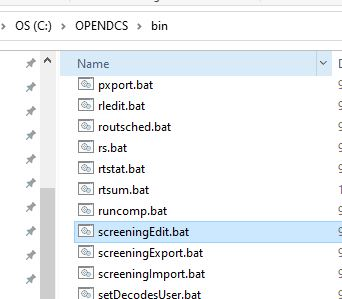

A window will pop up for log-in information.

For USACE:

* USERNAME: H7
* PASSWORD: Oracle

Alternatively, if launching from the server, use the following
command:

:: screeningEdit

   

For USBR:

What are the tabs?
------------------

There are two tabs in the screening editor:

* Screening IDs
* TS Assignments

The screening IDs tab is where criteria are defined.  Any IDs 
defined here can be attributed to more than one time series.
For example, if you have multiple gages on the same body of 
water for which you would like to undergo the same screening 
criteria, one screening ID can be defined here for common time
series paths.

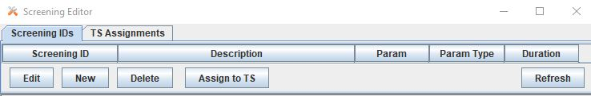

To add a new criteria, click the "New" button on the bottom of the
screen.  A window will pop up to name the new screening ID. Names
must be constrained to 16 characters or less.

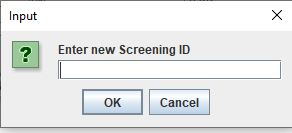

In the window that pops up, there will be some criteria to be selected.

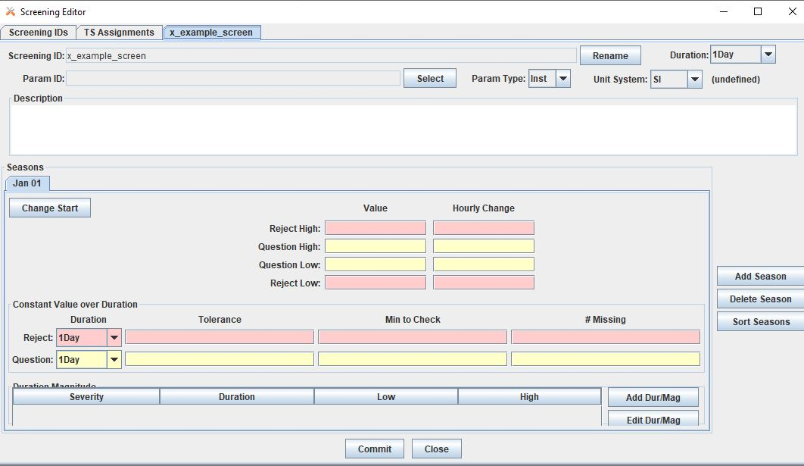

To set the criteria, recall the time series parts.  More detail
about time series parts can be found _______.

Location.Stage.Type.Interval.Duration.Version

In the example below, the screening criteria is set for hourly
stage average time series. This screening criteria can be 
applied to any time series that has the following parts.  The
Location, Interval and Version can be unique to the time series
selected.

Location.**Stage**.**Ave**.Interval.**Hourly**.Version

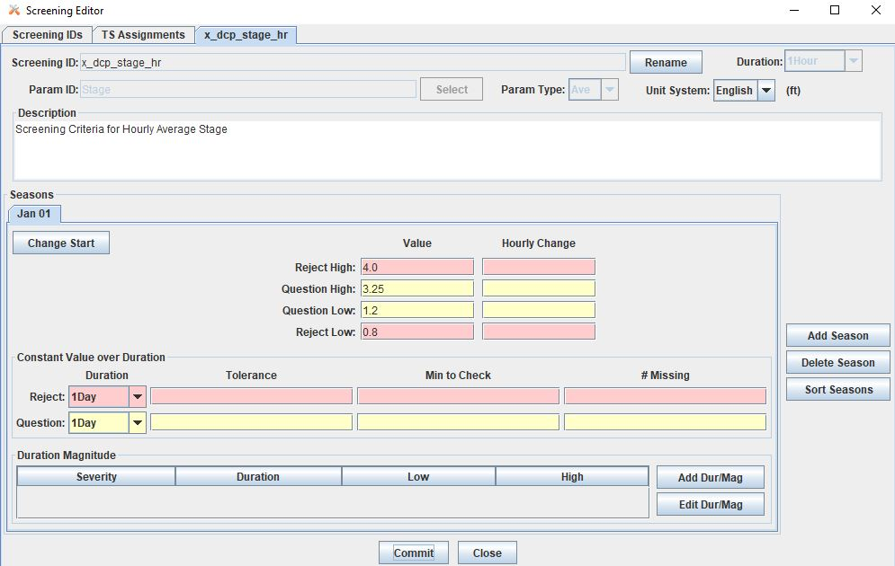

Before attributing this to a time series, the recommended next
step is to set up the computations.  Users should be familiar with
the basics of setting up a computation prior to setting up a screening.
For more information about getting started with computations,
see ______ .

Set up the Computation
======================

The screening computation will use the algorithm CwmsScreening. 
There is another option to use DATCHK files. This is addressed 
further below ______.

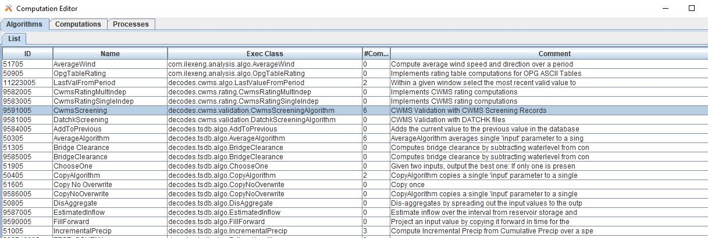

To set up the computation, navigate to the computations tab
and create a new computation.  

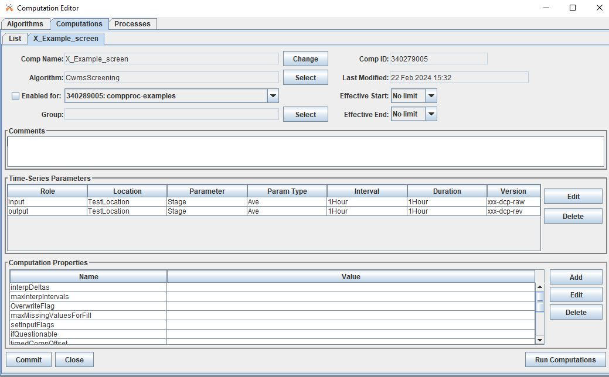

At this point, the screening ID has not yet been attributed to a 
time series.  Therefore, by default, if this computation is run,
the output will be a direct copy of the input.

For example, see the computation run in the window below:

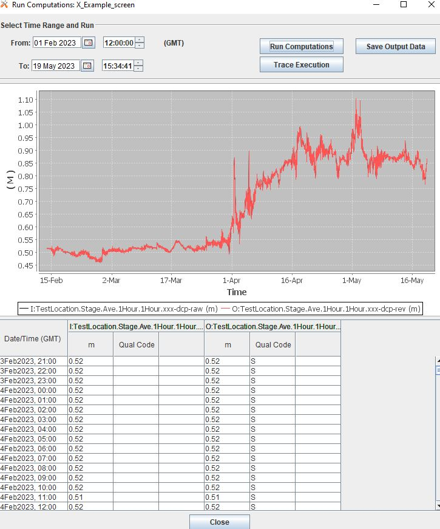

Now, to apply the screening, go back to the Screening Editor and
navigate to the TS Assignments Tab.  If this is your first time 
using the screening editor, there are no records listed.  Go back 
to the Screening IDs Tab, and select the screening ID which is going
to be applied to a time series. Click on the "Assign to TS" button 
on the bottom of the screen. 

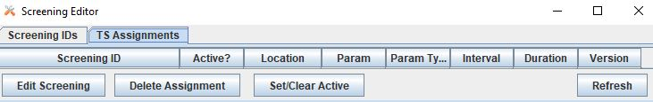

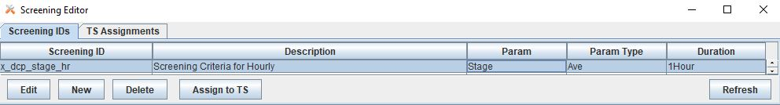

Then a list of all the pathnames in the database that match the
screening criteria will pop up. The window is called "Time Series
List".

For this example, recall that this means any pathname of the form:

Location.**Stage**.**Ave**.Interval.**Hourly**.Version

Select the time series for which the criteria is going to be applied.
To select more than one record, click and hold **Shift** to select a 
group of records, or use **ctrl**.  The list of time series can be 
resorted by clicking on the headers.

NOTE: If there is already a record of the desired time series with a 
version "rev", select the "raw" version.  The screening here will be 
applied to the "raw" time series, but the screened output will be 
written to the "rev" time series path defined in the computation. No
changes will occur on the input "raw" time series.

Once all the time series are selected, click "Select" on the bottom 
of the screen.  Then, the Time Series List window will close and 
likely the main screen will go back to the ScreeningIDs tab.  Navigate
to the TS Assignments tab and a new listing or listings will be 
present.

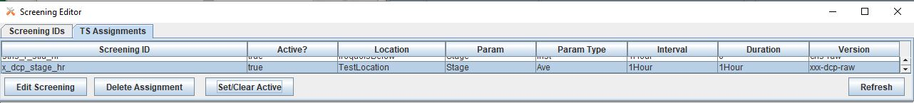

By default, the Active setting will be set to **true**.  To change 
this setting click on the "Set/Clear Active" button and select 
"inactive".  

To test the computation, go back to the Computation Editor. On
the Computations tab, be sure that the computation is closed. 
Click the Refresh List button on the top  right of the window.
Then open the computation again and run the computation.

... more content coming soon ...

Starting with DATCHK files
==========================

Some users may be familiar with employing screening or validation
using DATCHK files.  DATCHK files are files 

Running the Screening
=====================

