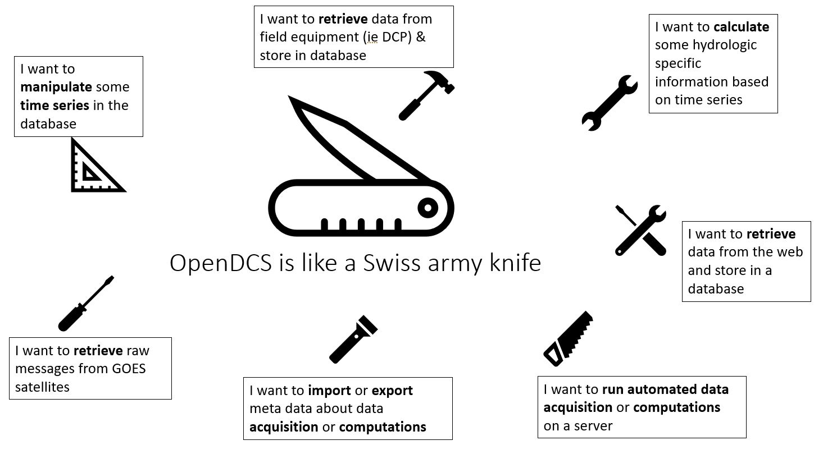
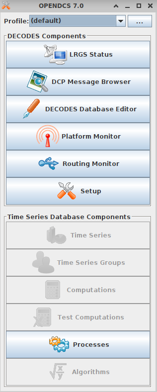

################################
Software Set-Up
################################

****************
OpenDCS Overview
****************

OpenDCS is a software built for the following purposes:

* Retrieving data from NOAA GOES Satellite system
* Processing data from NOAA GOES Satellite system to a more useful 
* Retrieving data from arbitrary systems
* Processing of near real-time time series data

OpenDCS is currently used by:

* U.S. Army Corps of Engineers
* U.S. Bureau of Reclamation
* U.S. National Oceanic and Atmospheric Administration
* And Others

OpenDCS current and past contributors include:

* U.S. Army Corps of Engineers
* U.S. Bureau of Reclamation
* U.S. Geological Survey
* ILEX Engineering Incorporated
* Sutron Corporation
* Cove Software, LLC
* Precision Water Resources Engineering
* Xcellious Consulting
* Resource Management Associates

What is OpenDCS?
================

OpenDCS is a software for retrieving and processing data from NOAA 
GOES Satellite system.  OpenDCS is also used for retrieving data
from arbitrary systems (ie ), and processing of time series data.
The software is built to be compatible with the U.S. Army Corps 
of Engineers Corps Water Management System (CWMS) and with the U.S.
Bureau of Reclamation Hydrologic Database (HDB).

OpenDCS includes a subset of tools for users, including the
following applications:

* DECODES
* LRGS
* Computation Processor
* Screening

Once set-up, users can experience automated data and retrieval and
processing from LRGS satellite data.  Automatically triggered 
calculations can be set-up if data is being stored in CWMS or HDB 
systems.  

In OpenDCS terms, this means that a user will have the tools
to do the following (and more):

* Create routing specs
* Create algorithms and computations
* Create and manage time series in database

OpenDCS is designed to operate with a database.  A fast majority 
of the documentation here assumes that a database is already set 
up an running.  Below is a high level schematic to conveys how
a typical office has OpenDCS set up.  The set-up and install 
directions below focus on a Windows PC set-up.  Further documatation
about server set-up and how to set up an OpenHydro database can
be found in the legacy documentation :doc:`Additional Content 
on Installation <./legacy-install-guide>`

.. image:: ./media/start/software/im-00-typical-office-high-level.JPG
   :alt: typical office set-up
   :width: 800

Where can I find more information?
----------------------------------

Information about OpenDCS can be found on the github repository.

Github: https://github.com/opendcs/opendcs 

Where can I find this information in PDF format?
------------------------------------------------

Previous versions of OpenDCS (before 7.0.0), included a doc folder
in the install directory (ie C:\\OPENDCS\\doc), with PDFs, which were
previously developer or advanced-user focused.  Versions 7.0.0 
and after include html code in the OPENDCS\\doc folder.  The content of
the older PDFs is now contained in the html files.

What is the history of OpenDCS?
-------------------------------

* 1999 - Java-based LRGS developed for USGS
* 2001 - Java-based DECODES developed for USGS and USACE (Database schem for XML and SQL)
* 2004 - DCP Monitor Tomcat Web App funded by USACE MVR (Also DECODES in-line Rating Computations)
* 2005 - Computation Processor Design funded by US Bureu of Reclamation and USGS
* 2007 - Computation Processor implemented for USBR Hydrologic Database (HBD)
* 2007 - Support LRIT (not HRIT) added to LRGS
* 2008 - Iridium support added to LRGS
* 2008 - CP ported to USACE CWMS
* 2012 - "OpenDCS" released with several improvement to GUI design
* 2014 - OpenTSBD (Time Series Database) - implemented in PostgreSQL
* 2015 and later - Improvements to all modules

*************************
How do I install OpenDCS?
*************************

Installing OpenDCS requires a few steps outlined below.  The 
content below is catered towards users who wish to install
OpenDCS on personal workstations. 

#. Download the software package (opendcs-installer-#.#.#.jar).
#. Unzip the contents.
#. Configure OpenDCS.

What do I need installed before getting started with OpenDCS?
=============================================================

Prior to installing OpenDCS, java 1.8 or a later version must be
installed.  

For windows users, check if java is installed and check if java is 
in the user environment path (or system environment path).

Run the following commands in a command prompt.

.. code-block:: batch

   > where java
   C:\Program Files (x86)\Common Files\Oracle\Java\javapath\java.exe
   
In the code block above java is installed in the path returned.  The 
location may be different on your PC - this is OK.  If nothing is 
returned (or a message like ""INFO: Could not find files for the given
pattern(s).), check if java is installed somewhere on your PC. If it
is installed, and if it is at least version 1.8, then add the location
to the system or user environment path.

If a path is returned, run the following command to see what version
is installed.
   
.. code-block:: batch

   > java -version
   java version "1.8.0_391"

If a java version (at least 1.8.##) is returned, then java is installed.
Proceed with installing OpenDCS.
 
If nothing is returned or the version is older then 1.8, then install
the 1.8 or up to java 17 from https://adoptium.net/temurin/releases/ .

Where can I find releases of OpenDCS?
=====================================

The latest version releases of OpenDCS can be found online: https://github.com/opendcs/opendcs.
From the main github site click on the header "Releases" in the image below.

Alternatively the following link goes straight to the releasese page: https://github.com/opendcs/opendcs/releases 
For each release, there is a drop down menu "Assets", and in that section download the (opendcs-installer-#.#.#.jar).

.. image:: ./media/start/software/im-02-releases.JPG
   :alt: github releases - example of version to retrieve
   :width: 800

Once the jar file is downloaded. Install it by launching it (double clicking).

How do I install the jar?
=========================

Prior to double clicking or launching the install jar, decide where you
want to install the program.  The default location will be "C:\\OPENDCS".
If you already have a previous version installed in this location, back it 
up per your own standards. 

Ensure that your desired installation path exists.  Ie if you wish to use 
the default installation path, create an empty folder C:\\OPENDCS.

Double click the **opendcs-installer-#.#.#.jar** to begin the installation.

The first window to pop-up will be a welcome note.  Click next.

The next window will prompt a user to define an installation path.  If you 
wish to use the default location (C:\\OPENDCS) click "Next" (so long as
the location exists). Or select the the location.  Then click "Next".
You may get a warning "The directory already exists! Are you sure you
want to install here and possibly overwrite existing files?".  Click "Yes".

Next, a window will pop up prompting the user to check which packs should
be included in the install.  

The following packs should be checked for each respective agency:

USACE

* OpenDCSBase
* XML Database Template
* Docs
* TSBD Computation Components
* Corps Water Management Systems (CWMS) Components
* LRGS

USBR

* OpenDCSBase
* XML Database Template
* Docs
* TSBD Computation Components
* Bureau of Reclamation Hydrologic Database (HDB) Components
* LRGS

Other Agency

* OpenDCSBase
* XML Database Template
* Docs
* TSBD Computation Components
* Open Time Series Database Schema and Components
* LRGS

Click "Next". Then the installation will begin. Once "Finished"
shows up in the window, then click "Next".

The next window relates to shortcut set-up and preferences.
Select your preferences and click "Next".  The final window
shown below will include a button "Done".  Click "Done" and 
the installation is completed.  

Navigate to the install directory to view the contents that just
installed.  Make note that the folder "doc" contains a folder "html"
where documentation can be accessed.  Open the index.html (ie drag the 
file into a browser).

What do I need to edit/configure for my set-up?
===============================================

Prior to launching the software, set up the **decodes.properties** file.

USACE and USBR users:

* Copy the user.properties file from server to the C:\\OPENDCS directory.
* Rename the file to decodes.properties.

For more details about the decodes.properties see
:any:`leg-inst-start-configure`

How do I launch the software?
=============================

Now that the software is installed.  On windows double click:
**launcher_start.bat** (in the C:\\OPENDCS\bin directory). 

And the following menu will pop up, when installed successfully:

Double click on a section, such as the DECODES Database Editor
and a Database Login should pop up prompting the user for credentials.

USACE users:

* USERNAME: User H7
* PASSWORD: Oracle

***************************************
OpenDCS Main Menu Components - Overview
***************************************

The OpenDCS main menu is divided into two parts outlined below.

DECODES Components
==================

The top part of the menu consists of the DECODES Components

**LRGS Status**

LRGS stands for Local Readout Ground Station. This button launches the 
LRGS Real-Time Status and Configuration GUI.  This tool is for monitoring
all the data received from all sources the LRGS connects to.  It also 
shows the status of all clients connected to the LRGS that are retrieving
data from it.  

The GUI has a menu at the upper left that allows users to configure 
client user accounts and configure the various data sources the 
LRGS retreives data from (e.g. DRGS, HRIT, Network DCP, NOAAPORT, 
etc.).

The Real Time Status grid shows the number of messages received each 
hour with an error ration where applicable (e.g., 5000/15 means 5000
good messages received and 15 bad ones detected).

**DCP Message Browser**

The DCP Message Browser is a tool for retrieving and/or reviewing raw
DCP messages.  Users can connect to various servers and set display 
formats.  This tool is useful for reviewing raw DCP messages, especially
when bad messages are detected.  This tool is also useful for 
retrieving older messages beyond the look back window of active
routing specs.

**DECODES Database Editor**

The DECODES Database Editor is where users can set up routing specs. 
The GUI has multiple tabs including, but not limited to the following:

Platforms: 

This tab is where users can add (or remove) DCP platforms that 
they may wish to retrieve data from.  Typical information specified 
in this section includes the Platform Sensor information (ie parameters
or type of data transmitted) and Transport Media information (ie 
DCP address and GOES channel parameters). 

Configs:

This tab is where various configurations can be defined.  For 
example, more information about the mapping between the 
DCP sensor information and time series information is defined.
For USACE, this means that more information matching the parameters 
defined in the Platform section to CWMS database parameter parts
(such as sampling interval and duration, etc).

This section is where DECODING information is added.  DECODING
comprises of statements rooted in FORTRAN that will translate a 
variety of recording devices (ie raw DCP messages, web scrapping, 
etc.), into standard engineering units and forms, such as 
human readable time series data.

Sources: 

This section is where data sources are defined.  Source types include:

* lrgs
* hotbackupgroup
* socketstream
* file
* directory
* web
* abstractweb
* roundrobingroup

Routing:

This section is where routing specifications are defined.  Routing specs
require at a bare minimum, the following bits of information:

* Source
* Platform
* Destination
* Name

**Platform Monitor**

This is a tool that can assist users in monitoring the status of 
data being retrieved, decoded, and data quality in the database.

**Routing Monitor**

This is a tool that users can use to monitor routing spec running
on the scheduler.  

**Setup**

This section where users can edit default properties (decodes.properties).
For example - the following are potential edits users may modify.

* Default Data Source
* Time Zone preferences (default is UTC)
* Screening Unit System

For more information about the Preferences and options, see 
:any:`leg-inst-start-configure`

Time Series Database Components
===============================

**Time Series**

This is one method to view the time series in the database.
Time Series can be filtered by pathname parts, or Descriptions,
or Database Keys.  This is one method to identify the Key for
a given time series in the database. 

Additional information can be retrieved about each time series
such as number of values, the min and max values, and period of 
record.  

**Time Series Groups**

This is a tool for creating groups that are comprised of various 
time series.  These groups can be used in calculations such that 
individual calculations are not set up for each individual time 
series.

Typically, time series are grouped by data type, basin, region or
site-group.  

**Computations**

This is the GUI to 

#. Access, edit, or add new algorithms;
#. Set up computations for time series in the database and;
#. Set up Processes.

**Test Computations**

This is a tool for testing out computations.  Computations can also be 
tested within the Computations GUI. 

**Processes**

Created processes is a way to group computations together, to help 
speed up run time operationally, and for backfilling data.  By grouping
computations together users can better organize computations and keep
track of dependencies. 

**Algorithms**

This tab takes users to the Algorithm Wizard. 

**Logging**

All of the application write to a log. The default name is the internal name of the application or "gui.log" for the 
GUI application. The file on disk can be control in each application with the `-l filename.ext` command line switch
if run from a terminal.

The logging system has recently (7.0.13, which is not released) be updated to make use of newer, standard, technologies and exposes more information
from the 3rd party libraries we use to easy development.

You create a file named logfilter.txt in the directory $DCSTOOL_USERDIR, that will be picked up and used to filter out messages that aren't
needed or wanted. For example most CWMS users will want to have a file of at least the following:

   org.jooq

As not filtering that out can cause excessive messages in the log.

.. warning::
   
   DCSTOOL_USERDIR is not fully utilized in windows yet. We are planning to correct that behavior with the release of 7.0.13.
   As such users should currently only expect this mechanism to work in unix style environment

.. note:: 
   This mechanism is intentionally limited. It is a goal of the project to switch the current custom logging backend
   to an available standard, such as logback or just java.util.logging which will provide the end-user with better
   options for log filtering and storage.

