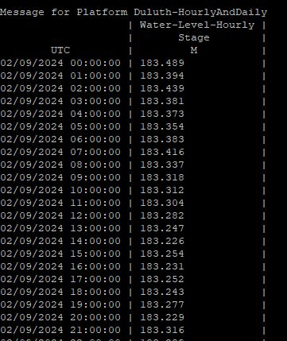

###################################
OpenDCS Time Series - Introduction
###################################

OpenDCS Suite includes an extention called OpenTSBD. 
TSBD = Time Series Database. 

Whether users are from USACE or USBR, using CWMS or HBD, the databases
are comprised of time series.  These time series are for storing 
data, typically hydrological in nature, or related information.  

*********************************
Overview - what is a Time Series?
*********************************

Definitions:

A **time series** is a series of data points ordered in time. 

A **sample** is a measurement at a point in time.

Types of Time Series
====================

There are multiple types of time series for which OpenDCS is
compatible.  They are outlined below:

* **Regular** : The time between each sample is identical, regardless of time zone.
* **Irregular**: There is no set interval between samples, or is one expected.
* **PseudoRegular**: There is an expected, possible rough, interval between samples but it can be reasonably be more or less.

Regular Time Series
-------------------

Example of regular hourly time series
::

   2/27/2024 01:00:00, 174.43
   2/27/2024 02:00:00, 174.45
   2/27/2024 03:00:00, 174.46
   2/27/2024 04:00:00, 174.45
   2/27/2024 05:00:00, missing value
   2/27/2024 06:00:00, 174.42
   2/27/2024 07:00:00, 174.44

Example of regular daily time series
::

   2/27/2024 17:00:00, 183.26
   2/28/2024 17:00:00, 183.23
   2/29/2024 17:00:00, 183.23
   3/01/2024 17:00:00, 183.22
   2/02/2024 17:00:00, 183.22
   2/03/2024 17:00:00, 183.26
   2/04/2024 17:00:00, 183.25

Example of DECODED Hourly DCP Stage, Precip, Water Temp and Volt

Example of DECODED Hourly Water Levels

Example of DECODED Daily Water Levels

.. image:: ./media/start/timeseries/im-04-levels-daily.JPG
   :alt: time series - hourly water levels
   :width: 350

Irregular Time Series
---------------------

Example of irregular monthly time series (note monthly is always irregular since months are different lengths)
::

   11/30/2023 17:00:00, 1.201
   12/31/2023 17:00:00, 2.256
   01/31/2024 17:00:00, 3.638
   02/29/2024 17:00:00, 0.661

Example of irregular annual time series (note annual is always irregular because of leap years)
::

   12/31/2018 17:00:00, 46.58
   12/31/2019 17:00:00, 46.76
   12/31/2020 17:00:00, 47.12
   12/31/2021 17:00:00, 48.74
   12/31/2022 17:00:00, 46.76
   12/31/2023 17:00:00, 49.10

Example of irregular hourly time series (no sample  at 4:00 or 5:00)
::

   2/27/2024 01:00:00, 174.43
   2/27/2024 02:00:00, 174.45
   2/27/2024 03:00:00, 174.46
   2/27/2024 06:00:00, 174.42
   2/27/2024 07:00:00, 174.44

Example of irregular monthly mean water temps

Example of irregular annual mean air temperatures

Pseudo Regular Time Series
--------------------------

... example coming soon ...

Constituent Parts
=================

* Value/Sample: the measurement of interest
* Interval: distance between samples
* Sample time: duration the sample was measured
* Period: synonym for interval
* Sample Rate: synonym for interval 

In OpenDCS, there are 6 components that make up a time series. 

* *location* -  refers to a Site in the database.  This is the site name or location.
* *param* - refers to a data type in the database (ie precipitation, stage, flow, etc).
* *statcode* - qualified how the data was measured or calculated (ie instantaneous, average, maximum, minimum, total).
* *interval* - one of the valid intervals in the database (ie 5-minute, 15-minute, hourly, daily, ~monthly, ~yearly, etc))
* *duration* - refers to the duration over which the value was measured or calculated (0 for instantaneous, hourly, monthly, yearly, etc)
* *version* -a free-form string used to distinguish between different versions of a time series (ie raw vs rev)

::

   location.param.statcode.interval.duration.version
   location.param.type.interval.duration.version

Time Series and OpenDCS
=======================

It is important to understand the parts of time series when using
OpenDCS.  In a nutshell, OpenDCS is used for retreiving
data and processing time series.  The basis of how data is 
retreived and decoded and stored relies on the basic time series 
principals outlined above.  Likewise, the processing, such as 
computations, assume users have a solid understanding of the 
input and output time series that they are executing computations on.