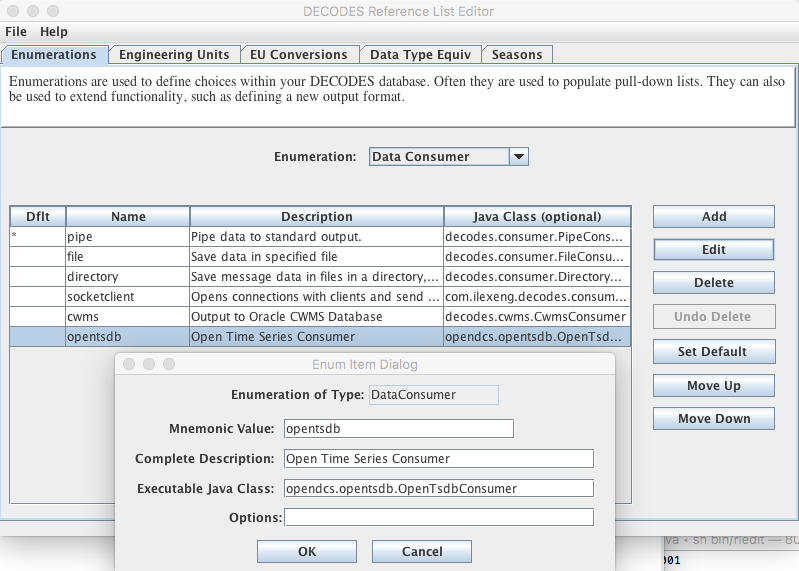
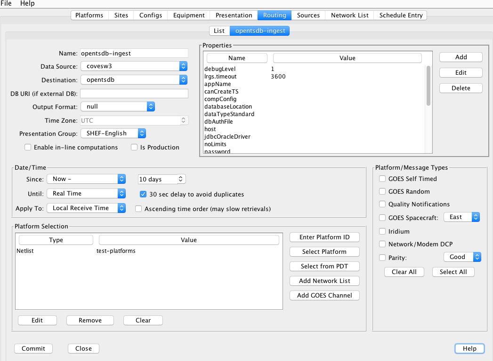
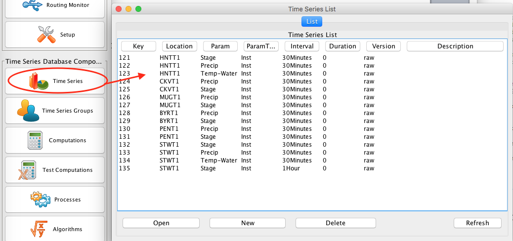

#########################
Open Time Series Database
#########################
(OpenTSDB)

.. 
    Document Revision 3

    March, 2020

    This Document is part of the OpenDCS Software Suite for environmental
    data acquisition and processing. The project home is:
    https://github.com/opendcs/opendcs

    See INTENT.md at the project home for information on licensing.

.. contents. Table of Contents
   :depth: 3

Overview
========

OpenTSDB (TSDB = Time Series Database) is an extension of OpenDCS first
included in the 6.5 release. This manual describes the schema and
utilities making up OpenTSDB.

.. note::

    Do not confuse with http://opentsdb.net/. We will be renaming our reference
    timeseries database after some work on the build and release infrastructure.
    

Revision History
----------------

Rev 1: OpenDCS 6.5 RC01, June, 2018:

-  Initial release

Rev 2: OpenDCS 6.7 RC01, February, 2020

-  This release supports computations.

-  The sections on Exporting and Importing time series data have been
   expanded and improved. The “outputts” and “importts” utilities now
   provide a good way of backing up time series data in an ASCII file,
   or for transferring data from one database to another. For example,
   you could use this to transfer data from a CWMS database into
   OpenTSDB.

Rev 3: OpenDCS 6.7 RC02, March, 2020

-  Define bits used for time series values.

Installation and Configuration
==============================

Fresh Schema Install
--------------------

After installing OpenDCS 6.5 you will find a schema subdirectory
containing two other subdirectories:

-  opendcs-pg – Schema installation scripts for PostgreSQL

-  opendcs-oracle – Schema installation scripts for Oracle

Follow the instructions in the README files contained in those
directories for a fresh install.

Configure OpenDCS
-----------------

Follow the instructions in the OPENDCS Installation Guide to configure
your database. Make sure the Database Type is set to OPENTSDB.

TSDB-Specific Properties
------------------------

The database schema contains a table “tsdb_property” (see schema below).
Currently the only way to add values to the table is with direct SQL
statements. This will be improved in future releases. The following
properties will affect OpenTSDB operation:

-  allowDstOffsetVariation: (default = true) Allowing the variation
   means that daily averages may vary by an hour over a DST change.
   Setting to false will force OpenTSDB to operate like CWMS: The UTC
   Offsets must remain consistent for all values stored.

-  offsetErrorAction: (default = ROUND) One of IGNORE, REJECT, or ROUND.
   This determines how sample times may be modified for time series
   values stored in the database for regular interval time series:

   -  INGORE – means to do nothing. Store time values as-is

   -  ROUND – means to round to the nearest regular interval

   -  REJECT – means to reject values that are not on a regular interval

-  storagePresentationGroup: (default = CWMS-English) When creating a
   new time series, the presentation group named here will be used to
   determine the storage units based on the data type of the time series
   being created.

   -  Note that for OpenDCS 6.5 a modification has been made for CWMS
      data types. The presentation group may contain Base Param values
      only. When attempting to find a match for a data type (e.g.
      “Stage-Tailwater”), if no exact match is found in the group, the
      code will look for a match for the base param value (“Stage”).
      Thus, you only need Base Params in the CWMS-English and
      CWMS-Metric presentation groups.

You can edit the TSDB_PROPERTY values using a dialog in the Time Series
GUI. From the launcher, select Time Series. Then press the TSDB
Properties button in the upper right. Each property is shown with an
explanation as to its use and proper setting.

Schema
======

OpenTSDB Time Series ID
-----------------------

An OpenTSDB Time Series Identifier (TSID) has 6 parts, separated by
periods:

*location . param . statcode . interval . duration . version*

The location, param, and version parts are often subdivided with
hyphens.

Example:

Crystal-HeadWater.Inst.Elev.1Hour.0.GOES-raw

The components are:

-  *location* – This refers to a Site in the DECODES database. This is
   the site name, preferably with CWMS name-type.

-  *param* – This is a DECODES Data Type, preferably with CWMS data
   type.

-  *statcode* – Statistics Code qualifies how the data was measured or
   calculated. See examples below. (Note – In CWMS this is called param
   type).

-  *interval* – One of the valid intervals in this database. All CWMS
   intervals are accepted.

-  *duration* – 0 (zero) means an instantaneous value. Other intervals
   can specify the duration over which the value was measured or
   calculated.

-  *version* – A free-form string used to distinguish between different
   versions of a time series, e.g. raw vs. validated.

TSDB Global Properties
----------------------

.. code-block:: sql

    -- Global properties on the database components.

    CREATE TABLE TSDB_PROPERTY
    (
        PROP_NAME VARCHAR(24) NOT NULL UNIQUE,
        PROP_VALUE VARCHAR(240) NOT NULL,
        PRIMARY KEY (PROP_NAME)
    ) WITHOUT OIDS;

Metadata About Each Time Series
-------------------------------

.. code-block:: sql

    CREATE TABLE TS_SPEC
    (
        TS_ID INT NOT NULL UNIQUE,
        SITE_ID INT NOT NULL,
        DATATYPE_ID INT NOT NULL,
        STATISTICS_CODE VARCHAR(24) NOT NULL,
        INTERVAL_ID INT NOT NULL,
        DURATION_ID INT NOT NULL,
        TS_VERSION VARCHAR(32) NOT NULL,
        ACTIVE_FLAG VARCHAR(5) DEFAULT 'TRUE' NOT NULL,
        STORAGE_UNITS VARCHAR(24) NOT NULL,
        -- Number of data storage table where values for this TS are stored.
        STORAGE_TABLE INT NOT NULL,
        -- 'N' for numeric, 'S' for String.
        STORAGE_TYPE CHAR DEFAULT 'N' NOT NULL,
        -- Last Modify Time for this record, stored as Java msec time value UTC.
        MODIFY_TIME BIGINT NOT NULL,
        DESCRIPTION VARCHAR(400),
        -- Initially set to NULL. After first ts value written, this is set to
        number of seconds.
        --
        UTC_OFFSET INT,
        -- NULL = use default in TSDB_PROPERTIES, TRUE=allow, FALSE=disallow
        ALLOW_DST_OFFSET_VARIATION VARCHAR(5),
        -- NULL=use default in TSDB_PROPERTIES, ROUND, REJECT, or IGNORE
        OFFSET_ERROR_ACTION VARCHAR(24),
        PRIMARY KEY (TS_ID),
        CONSTRAINT 
            time_series_identifier_unique 
            UNIQUE 
            (
                SITE_ID, DATATYPE_ID,
                STATISTICS_CODE, INTERVAL_ID,
                DURATION_ID, TS_VERSION
            )
    ) WITHOUT OIDS;

Notes:

-  TS_ID is a unique numeric key assigned from a sequence when the time
   series is created.

-  SITE_ID points to a DECODES Site record. This is analogous to a CWMS
   location.

-  DATATYPE_ID points to a DECODES DATATYPE record. This is analogous to
   a CWMS “Param”.

-  STATISTICS_CODE is analogous to a CWMS “Param Type”.

-  INTERVAL_ID and DURATION_ID both point to records in the
   INTERVAL_CODE table (see below).

-  STORAGE_UNITS must be a valid DECODES Engineering Unit abbreviation.
   It specifies the units in which the time series values are stored.

-  STORAGE_TABLE is an integer which specifies a 4-digit suffix to the
   table name where the actual data values are stored (see below).

-  STORAGE_TYPE – currently the only acceptable value is ‘N’. String
   values are not yet supported.

-  MODIFY_TIME specifies the last time the TS_SPEC record was modified.
   It is a Java msec value specifies the number of ms since Midnight,
   Jan 1, 1970 UTC.

-  UTC_OFFSET can be used for regular interval data to ensure they all
   have the same UTC offset.

-  ALLOW_DST_OFFSET_VARIATION can be set to true to allow the offset to
   vary based on DST changes. Example: a daily value stored at local
   midnight would have a UTC_OFFSET variance when DST changes.

Interval and Duration Fields
----------------------------

Valid Interval and Durations are stored in the INTERVAL_CODE table:

.. code-block:: sql

    CREATE TABLE INTERVAL_CODE
    (
        INTERVAL_ID INT NOT NULL UNIQUE,
        -- Interval Name for Display in Pull-Down lists, files, etc.
        NAME VARCHAR(24) NOT NULL UNIQUE,
        -- Java Calendar Constant Name.
        -- One of MINUTE, HOUR_OF_DAY, DAY_OF_MONTH, WEEK_OF_YEAR, MONTH, YEAR
        CAL_CONSTANT VARCHAR(16) NOT NULL,
        -- Multiplier for calendar constant.
        -- Zero means instantaneous.
        CAL_MULTIPLIER INT NOT NULL,
        PRIMARY KEY (INTERVAL_ID)
    ) WITHOUT OIDS;

Time Series Values
------------------

The software tries to spread the time series values among the available
tables that you created when you installed the database, or when you run
the Rebalance utility (see below).

Table names are TS_NUM\_\ *NNNN*, where *NNNN* is a 4 digit suffix. To
determine the table, take the TS_SPEC.STORAGE_TABLE integer and format
it as a 4-digit number. The tables have the following format:

.. code-block:: sql

    CREATE TABLE TS_NUM_0001

    (
        TS_ID INT NOT NULL,
        SAMPLE_TIME BIGINT NOT NULL,
        TS_VALUE DOUBLE PRECISION NOT NULL,
        -- Bitwise flags for each value
        FLAGS BIGINT NOT NULL,
        SOURCE_ID INT NOT NULL,
        DATA_ENTRY_TIME BIGINT NOT NULL,
        PRIMARY KEY (TS_ID, SAMPLE_TIME)
    ) WITHOUT OIDS;

Thus all values for a given time series are in the same table. This is
different from CWMS, which divides the values by time: Each year has a
separate data table in CWMS.

The FLAGS word is a collection of bit flags indicating various
validation and other conditions. The following code defines the bits
used by OpenTSDB. Bits not defined are reserved for future use:

// The value was successfully screened.

**public** **static** **final** **int** **SCREENED** = 0x00010000;

// Apply this mask and compare to SCR_VALUE_xxx definitions

// to obtain result

**public** **static** **final** **int** **SCR_VALUE_RESULT_MASK** =
0x000E0000;

**public** **static** **final** **int** **SCR_VALUE_GOOD** = 0x00000000;

**public** **static** **final** **int** **SCR_VALUE_REJECT_HIGH** =
0x00020000;

**public** **static** **final** **int** **SCR_VALUE_CRITICAL_HIGH** =
0x00040000;

**public** **static** **final** **int** **SCR_VALUE_WARNING_HIGH** =
0x00060000;

**public** **static** **final** **int** **SCR_VALUE_WARNING_LOW** =
0x00080000;

**public** **static** **final** **int** **SCR_VALUE_CRITICAL_LOW** =
0x000A0000;

**public** **static** **final** **int** **SCR_VALUE_REJECT_LOW** =
0x000C0000;

// Apply this mask and compare to SCR_ROC_xxx definitions

// to obtain result

**public** **static** **final** **int** **SCR_ROC_RESULT_MASK** =
0x00700000;

**public** **static** **final** **int** **SCR_ROC_GOOD** = 0x00000000;

**public** **static** **final** **int** **SCR_ROC_REJECT_HIGH** =
0x00100000;

**public** **static** **final** **int** **SCR_ROC_CRITICAL_HIGH** =
0x00200000;

**public** **static** **final** **int** **SCR_ROC_WARNING_HIGH** =
0x00300000;

**public** **static** **final** **int** **SCR_ROC_WARNING_LOW** =
0x00400000;

**public** **static** **final** **int** **SCR_ROC_CRITICAL_LOW** =
0x00500000;

**public** **static** **final** **int** **SCR_ROC_REJECT_LOW** =
0x00600000;

**public** **static** **final** **int** **SCR_STUCK_SENSOR_DETECTED** =
0x00800000;

// The following is NOT stored in data values, but used by the

// alarm system only

**public** **static** **final** **int** **SCR_MISSING_VALUES_EXCEEDED**
= 0x01000000;

Time Series Properties
----------------------

TS_PROPERTY records are not currently used. They are intended for future
expansion where there may be a need for additional meta-data not
currently stored in TS_SPEC.

.. code-block:: sql

    CREATE TABLE TS_PROPERTY
    (
        TS_ID INT NOT NULL,
        PROP_NAME VARCHAR(24) NOT NULL,
        PROP_VALUE VARCHAR(240) NOT NULL,
        PRIMARY KEY (TS_ID, PROP_NAME)
    ) WITHOUT OIDS;

Time Series Value Data Sources
------------------------------

The TSDB tracks the source of every value in the database through the
SOURCE_ID field in the TS_NUM_nnnn tables. The SOURCE_ID refers to a
record in TSDB_DATA_SOURCE:

.. code-block:: sql

    CREATE TABLE TSDB_DATA_SOURCE

    (

    SOURCE_ID INT NOT NULL UNIQUE,

    LOADING_APPLICATION_ID INT NOT NULL,

    -- Further describes source: If DECODES routing spec,

    -- this should be the rs and ds names.

    -- If manual entry, this is user name

    -- If computation, this is comp name

    -- If modeled, this is the model name, etc.

    MODULE VARCHAR(120),

    PRIMARY KEY (SOURCE_ID)

    ) WITHOUT OIDS;

The combination of LOADING_APPLICATION_ID and MODULE should be unique.
Thus a TSDB_DATA_SOURCE tells us, for each value, what application and
module within that application created that values. Examples are:

-  Routing Scheduler / Routing Spec Name

-  Computation Processor / Computation Name

Time Series Value Annotions
---------------------------

TS_ANNOTATION records are not currently used. They are intended for a
new feature whereby a user could add a free form text annotation
describing time series values over a given time range.

.. code-block:: sql

    CREATE TABLE TS_ANNOTATION

    (

    ANNOTATION_ID INT NOT NULL UNIQUE,

    TS_ID INT NOT NULL,

    START_TIME BIGINT NOT NULL,

    END_TIME BIGINT NOT NULL,

    ANNOTATION_TEXT VARCHAR(1000) NOT NULL,

    PRIMARY KEY (ANNOTATION_ID)

    ) WITHOUT OIDS;

DECODES OpenTSDB Consumer
=========================

The OpenTSDB Consumer writes time series data to the OpenTSDB. If you
have an older OpenDCS Installation, your database may not have the
consumer in its list. Before attempting to use the consumer, run the
Reference List Editor (rledit). On the Enumerations Tab, select the Data
Consumer enumeration. Make sure there is an entry for opentsdb and the
the java class is exactly as shown below.

The Java class must be exact:

opendcs.opentsdb.OpenTsdbConsumer

When using the consumer, you may specify the following properties in the
routing spec:

+----------------+-------+---------------------------------------------+
| Property Name  | De    | Description                                 |
|                | fault |                                             |
+================+=======+=============================================+
| da\            | *\    | By default, it will assume that you want to |
| tabaseLocation | null* | ingest data into the same database that     |
|                |       | hosts your DECODES data. If you want to     |
|                |       | write to a *different* OpenTSDB, you can    |
|                |       | specify the location URL here.              |
+----------------+-------+---------------------------------------------+
| dbAuthFile     | *\    | Not needed if databaseLocation is the       |
|                | null* | default (null). If you are connecting to a  |
|                |       | *different* OpenTSDB, you can run           |
|                |       | ‘setDecodesUser’ with a file name to create |
|                |       | an encrypted file containing the username   |
|                |       | and password. Then specify that file name   |
|                |       | as a property here.                         |
+----------------+-------+---------------------------------------------+
| jd\            | *\    | Also not needed if you are writing to the   |
| bcOracleDriver | null* | same database as DECODES. If it is a        |
|                |       | *different* database, you can specify the   |
|                |       | JDBC driver class here.                     |
|                |       |                                             |
|                |       | The value for postgres is                   |
|                |       | ‘org.postgresql.Driver’                     |
|                |       |                                             |
|                |       | The value for Oracle is                     |
|                |       | ‘oracle.jdbc.driver.OracleDriver’           |
+----------------+-------+---------------------------------------------+
| appName        | de\   | The consumer will make a connection to the  |
|                | codes | database as this application. OpenTSDB      |
|                |       | tracks connections by app name.             |
+----------------+-------+---------------------------------------------+
| da\            | CWMS  | Specifies which sensor data type to use to  |
| taTypeStandard |       | build the TSID. (See below.)                |
+----------------+-------+---------------------------------------------+
| sh\            | *\    | If you want to map SHEF-PE codes to the     |
| efParamMapping | null* | param type of the TSID, specify a mapping   |
|                |       | file here. (See below.)                     |
+----------------+-------+---------------------------------------------+
| tsidDuration   | 0     | The default duration part for a time series |
|                |       | ID if none is specified in the individual   |
|                |       | sensors. (See below.)                       |
+----------------+-------+---------------------------------------------+
| tsidVersion    | raw   | The default version for a time series ID if |
|                |       | none is specified in the individual         |
|                |       | sensors. (See below.)                       |
+----------------+-------+---------------------------------------------+
| canCreateTs    | true  | Set to false if you do NOT want this        |
|                |       | routing spec to be able to create time      |
|                |       | series if it builds a TSID that does not    |
|                |       | yet exist.                                  |
+----------------+-------+---------------------------------------------+

Building the TSID
-----------------

This section exlains how the consumer takes information from the DECODES
database to build the TSID.

**Location**

The Location part is taken from the DECODES site where the platform is
located, or, if a sensor-specific site has been specified, it is used.

The CWMS name type is selected if one is present. If not, the preferred
name type that you specified in your DECODES settings is used.

**Param**

The Param part is taken from one of the DECODES Data Type codes assigned
to the sensor. A routing spec property called ‘dataTypeStandard’ may be
used to specify one of the valid Data Type Standards in your database.

Hint: You can use the Reference List Editor (rledit) to define which
data type standards are valid in your database.

If no property is specified, CWMS is used as a default.

Then if the specified data type is present it is used. If not, the
sensor is skipped.

Exception for SHEF Parameter Mapping: If you specify a property named
‘shefParamMapping’ containing the name of a mapping file, then the
SHEF-PE data type code will be used to look up a parameter in the named
file. The format of each line in the file is:

*SHEFCODE=Param*

**Statistics Code**

If a DECODES Sensor Property named either ‘statcode’ or ‘CwmsParamType’,
then the value will be used as the statcode part of the TSID. Otherwise,
‘Inst’ will be used.

**Interval**

If a Sensor Property named ‘cwmsInterval’ is present, it will be used as
the interval part of the TSID. Otherwise:

-  If the recording mode is Variable (meaning an irregular time series),
   interval will be set to 0.

-  Otherwise the interval will be derived from the specified recording
   interval in seconds.

**Duration**

If a Sensor Property named ‘cwmsDuration’ is present, it will be used as
the duration part of the TSID. Otherwise:

-  If the recording mode is Variable (meaning an irregular time series),
   interval will be set to 0.

-  Else, if the Statistics Code determined above is ‘Inst’, 0 will be
   used as the duration.

-  Else, the interval determined above will be used.

**Version**

The routing spec property ‘cwmsVersion’ may be used to specify the
default version part for all sensors. If none is specified, the default
is ‘raw’.

Each sensor can also specify a property named ‘cwmsVersion’ that will
override the default.

The following routing spec runs in real time and ingests data into the
OpenTSDB:

Note:

-  Since we are ingesting into the same database where DECODES is
   running, no DB URI or username or password are necessary.

-  Output Format=null, because we are not formatting data, but rather
   placing it into the TSDB tables.

-  SHEF-English presentation group is used. This will determine storage
   units when creating new time series in the database.

Time Series Utilities
=====================

Updating Old Schema
-------------------

If you installed the database from pre OpenDCS 6.5 schema files you will
need to update. A Java utility is provided to do this.

Command:

dbupdate

You will be prompted to enter the TSDB Schema owner’s database username
and password. Tables will be modified to conform to OpenDCS 6.5 schema.
the internal TSDB_DATABASE_VERSION number will be set to 16.

GUI Time Series List
--------------------

The Time Series List GUI can be activated from the Launcher Button panel
or from the “tslist” script:

It shows a list of time series which may be sorted in different ways by
clicking the column headers.

This GUI is not unique to OpenTSDB. It also works for CWMS and HDB.

Buttons:

-  Open – Not yet implemented. In a future release this will provide a
   way to edit the meta data about a time series, change its storage
   units, etc.

-  New – Brings up a dialog in which you can specify the time series
   identifier components and create a new time series.

-  Delete – Deletes a time series including all of its values and meta
   data.

-  Refresh – refreshes the list from the database.

Outputting Time Series Values
-----------------------------

Command:

outputts [options] TSID|group:*groupName*\ \|all [*TSID2 ...*]

This command can output time series data in any of the DECODES data
formats. Run with –x for a help message showing options:

$ bin/outputts -x

Error: Unknown option -x

Usage: program [-Y <String>] [-P <String>] [-d <Int>] [-l <String>] [-D
<String> ...] [-c <String>] [-t ] [-m <Int>] [-a <String>] [-S <String>]
[-U <String>] [-F <String>] [-Z <String>] [-L <String>] [-G <String>]
[-I <String>] <String> ...

-d 'debug-level' Default: 0

-l 'log-file' Default: util.log

-S 'Since Time dd-MMM-yyyy/HH:mm'

-U 'Until Time dd-MMM-yyyy/HH:mm'

-F 'OutputFormat' Default: Human-Readable

-Z 'Time Zone' Default: UTC

-L 'Lookup Type' Default: id

-G 'PresentationGroup'

-I 'TransportID'

'time-series-IDs \| all \| group:groupname'

**Examples:**

Output a specific time series values since midnight May 15 in HydroJSON
format:

outputts -S 15-May-2018/00:00 -F HydroJSON
HNTT1.Stage.Inst.30Minutes.0.raw

Output all values for a specific time series:

outputts -S all -F tsimport HNTT1.Stage.Inst.30Minutes.0.raw > somefile

Output all values for time series in a group named “Stages”:

outputts -S all -F tsimport group:Stages > somefile

Output all values for all time series. This is suitable for making a
backup of for transferring time series values to some other database:

outputts -S all -F tsimport all > somefile

Output is written to stdout. You can redirect to file if desired.

Note: Using the tsimport format as shown in the example above is the
easiest way to transfer data from one database to another.

Example: suppose you wanted to transfer data from a group of time series
on your CWMS database into an OpenTSDB database. Suppose the group is
called “Stages”.

1. On the CWMS Database, run:

   outputts -S all -F tsimport group:Stage > somefile

2. Transfer “somefile” from the CWMS machine to the OpenTSDB
   installation.

3. On the OpenTSDB installation run:

   importts somefile

Importting Time Series Values
-----------------------------

Command::

    importts *filename*

Description:

   Reads the file and imports the data into HDB.

   The file has three types of lines:

-  SET:TZ\ *=*\ TimeZone

-  TSID:*Full Time Series Path Name*

-  SET:UNITS=\ *Units Abbreviation, e.g. “ft”*

-  Data line: YYYY/MM/DD-HH:MM:SS,Value,Flags

..

   The SET and TSID apply to all subsequent data lines.

The ‘Rebalance’ Utility
-----------------------

The Rebalance utility can be used to add new data tables after the
initial installation.

Command::

    decj opendcs.opentsdb.Rebalance [*-N numTables*]

Where the optional *numTables* integer specifies the number of numeric
tables to add to the database.

Scenario: You created the database with a very small number of numeric
tables (say, 10), but now that you have hundreds of time series, data
writes and retrievals are becoming slow. You wish to create new numeric
data tables and then move existing time series among the tables to
balance the load.

List Time Series Data Sources
-----------------------------

This utility lists all of the unique TSDB_DATA_SOURCE records in the
database.

Command::

    decj opendcs.opentsdb.ListDataSources

The Generic “DbUtil” Utility
----------------------------

A generic utility to perform various operations on the database has
existed for some time. It works with CWMS, HDB, or OpenTSDB.

Command::

    bin/decj decodes.tsdb.DbUtil

Type the ‘help’ command to get a list of available commands. New
commands are added from time to time:

cmd: help

Valid commands are:

list-site [startsWith] List sites, optionally starting with a specified
string, sorted name.

delete-site [default-site-name] - delete site by its default site name

delete-platform [id|site] [platformId or SiteName] - delete platform by
ID or site name

list-ts [contains] List Time Series, optionally with id containing
specified string, sorted name.

loc-aliases List all location aliases

ts-aliases List all time-series aliases

delete-ts [contains] List Time Series, optionally with id containing
specified string, sorted name.

list-dev List Device Statuses

update-dev [devname] [procname] [mediumId] [status] List Device Statuses

events-containing [string] List events containing a specified string

event [priority (I,W,F)] [subsystem] [event text...]

sched-event [priority (I,W,F)] schedStatusId platformId(or -1) subsystem
[event text...]

version -- show DECODES and tsdb database versions

bparam -- show CWMS Base Param - Unit Associations

select -- An arbitrary database SELECT statement.

alter -- An arbitrary database ALTER statement.

update -- An arbitrary database UPDATE statement.

hdbRating -- Install a test rating in HDB.

tsdbSpecs – Display statistics on OpenTSDB Storage Tables.

quit - Quit the program

help - Print this message

The “list-ts” command will print a list of time series IDs along with
the storage units, storage table number, and description.

The “tsdbSpecs” command will print statistics on the time series
specifiers including number of tables, number of values in each table,
etc.

Some commands are specific to a database type (CWMS, HDB or OPENTSDB)
and will give an error message if executed on the wrong type of
database.

Care should be taken when executing update or alter commands.

HydroJSON Server
================

The HydroJSON Server is a web app that runs under Apache Tomcat. It
handles the basic functions of HydroJSON defined on Gunnar’s github
page. https://github.com/gunnarleffler/hydroJSON

Deploying the HydroJSON Server
------------------------------

The server is distributed as a “.war” (Web Archive) file suitable for
deploying under the Tomcat Application server.

Before deploying you need to fix the “context.xml” file contained in the
WAR so that the application can connect to your database. Here are the
instructions to do this:

1. Create a temporary directory and unpack the war file there:

cd $HOME # Or to some directory where you want to work

mkdir tmpwar

cd tmpwar

Now copy the distro file HydroJSON.war into the parent of this directory
(i.e. $HOME) and ...

jar xvf ../HydroJSON.war

Now the tmpwar directory contains the image that was in the war file.

2. Modify the META-INF/context.xml file with your favorite text editor.
It looks like this:

.. code-block:: xml

    <Context>

    <Resource name="jdbc/opentsdb"
        auth="Container"
        type="javax.sql.DataSource"
        maxActive="100"
        maxIdle="30"
        maxWait="10000"
        username="tsdbadmin"
        password="tsdbadmin"
        driverClassName="org.postgresql.Driver"
        url="jdbc:postgresql://localhost/open_tsdb"/>
    </Context>

Modify the url to point to your actual database. This is the same URL in
the editDatabaseLocation in your decodes.properties file.

Modify the username and password to an account for the Web app to
connect.

3. Rebuild the war file::

    jar cvf ../HydroJSON.war \*

4. Deploy the modified war file by copying it into Tomcat’s webapps
directory.

Server Request Details
----------------------

Retrieve Catalog of Sites
~~~~~~~~~~~~~~~~~~~~~~~~~

/getjson?catalog=[]

Returns a list of all site/locations defined in the database.

Retrieve Catalog of Time Series IDs
~~~~~~~~~~~~~~~~~~~~~~~~~~~~~~~~~~~

getjson?tscatalog=[**search_terms**]

**search_terms**\ = a string containing spec-delimited words. Only TSIDs
containing these words will be returned. The check is
non-case-sensitive.

Retrieve Data by TSIDs
~~~~~~~~~~~~~~~~~~~~~~

/getjson?timeseries=\ **TsidSpecs**\ &backward=\ **Duration**\ &time_format=\ **PythonTimeSpec**\ @tz=\ **TimeZoneID**

**TsidSpecs=** [["tsid1","units1"],["tsid2","units2"], ...]

**Duration=** Duration as defined in ISO-8601, but without the leading
‘P’.

**PythonTimeSpec**\ = As defined for Python’s strftime function.

**TimeZoneID**\ = a standard time zone identifier.

Where

-  tsidN is a fully-qualified 6-part TSID

-  unitsN is optional. If not supplied the TS will be in its database
   storage units.

-  Duration is optional. If not supplied, only the most recent value for
   each time series will be returned.

-  PythonTimeSpec is optional. If not supplied it is %Y-%m-%dT%H:%M:%S
   in UTC.

-  The tz argument is optional. If not supplied, UTC will be used.
